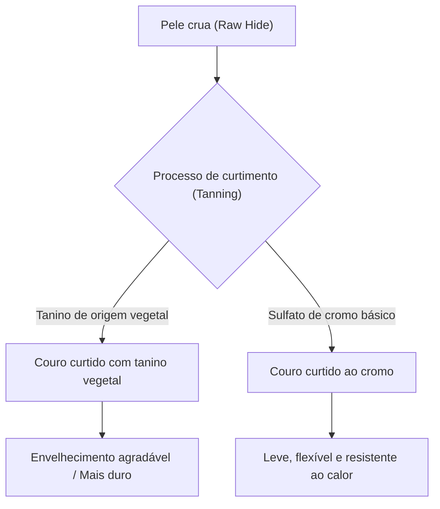

## 1. Introdução: A relação entre a história humana e o couro

O couro é um dos materiais mais antigos adquiridos pela humanidade. Desde o período Paleolítico, tem sido valorizado como roupa de frio e ferramenta, e sua tecnologia de processamento tornou-se sofisticada com o desenvolvimento da civilização. O processo no qual uma simples pele de animal (Skin/Hide) se transforma em "couro (Leather)" durável e flexível, que não apodrece, pode ser considerado uma arte onde a química e a física se cruzam. Neste artigo, aprofundaremos nos tipos de couro, na ciência do curtimento e nos mecanismos de envelhecimento.

## 2. A ciência do curtimento: A transformação de pele em couro

O processo de transformar "pele" em "couro" é chamado de "curtimento (Tanning)". É uma reação química que estabiliza a estrutura das fibras de colágeno, o principal componente da pele, conferindo-lhe resistência ao calor, propriedades conservantes e flexibilidade.

### 2.1 Curtimento vegetal (Vegetable Tanning)

Um método de fabricação tradicional que utiliza compostos polifenólicos (taninos) de origem vegetal. As moléculas de tanino formam ligações de hidrogênio com as ligações peptídicas do colágeno, construindo uma rede forte.
- **Características**: O impacto ambiental é relativamente baixo e o envelhecimento (pátina) é notável.
- **Propriedades físicas**: As fibras são apertadas, a elasticidade é baixa e a moldabilidade é excelente.

### 2.2 Curtimento ao cromo (Chrome Tanning)

Um método de fabricação moderno que usa complexos metálicos, como o sulfato de cromo básico. Os íons de cromo formam ligações de coordenação (ligações cruzadas) com os grupos carboxila do colágeno.
- **Características**: O tempo de curtimento é curto e é adequado para produção em massa.
- **Propriedades físicas**: Alta resistência ao calor (alta temperatura de encolhimento em água fervente), flexível e leve.

## 3. Tipos e características de couro

Dependendo da espécie animal, a densidade das fibras de colágeno e a estrutura dos poros variam, e cada um tem suas próprias características únicas.

### 3.1 Couro bovino (Bovine Leather)

É o couro mais comumente distribuído e versátil. É classificado por idade em meses e sexo.
- **Bezerro (Calfskin)**: Bezerros com menos de 6 meses de idade. As fibras são extremamente finas e é considerado da mais alta qualidade.
- **Kipskin**: Bovinos jovens de cerca de 6 meses a 2 anos de idade. É mais espesso e durável que o couro de bezerro.
- **Novilho (Steerhide)**: Machos castrados entre 3 e 6 meses de idade, e com mais de 2 anos. Tem espessura uniforme e é altamente versátil.

### 3.2 Couro suíno (Porcine Leather/Pigskin)

É um dos poucos materiais de couro que pode ser autossuficiente no Japão.
- **Características**: Os poros penetram desde a epiderme até as costas, de modo que a respirabilidade é extremamente alta.
- **Aplicações**: Forros de sapatos, bolsas leves e roupas. É resistente ao atrito e mantém a força mesmo sendo fino.

### 3.3 Couro equino (Equine Leather)

A densidade da fibra tende a ser ligeiramente inferior à do couro bovino, mas partes específicas são altamente valorizadas.
- **Cordovan**: Esculpido da camada de fibra de colágeno de alta densidade chamada "camada Cordovan" dentro da pele das nádegas do cavalo. É chamado de "diamante do couro" e possui um brilho profundo único e alta dureza (várias vezes a resistência do couro bovino).

### 3.4 Couro exótico (Exotic Leather)

Couros especiais, como os de répteis e aves.
- **Crocodilo (Crocodile)**: O padrão único de escamas (manchas) é bonito e considerado um símbolo de status. Extremamente durável.
- **Avestruz (Ostrich)**: Couro de avestruz. Caracterizado por marcas de onde as penas foram arrancadas (marcas de pena), combina flexibilidade e tenacidade.

## 4. O mecanismo de envelhecimento (pátina)

O maior atrativo dos produtos de couro está no "envelhecimento", onde a cor e a textura mudam com o uso. Isso se deve principalmente aos seguintes fatores químicos e físicos:

1. **Reação fotoquímica (raios ultravioleta)**: Devido aos raios ultravioleta da luz solar, o tanino contido no couro é oxidado e polimerizado, e pigmentos (principalmente quinonas) são gerados, concentrando a cor.
2. **Migração e oxidação de óleos**: O sebo das mãos e os óleos de cuidado penetram no couro, reduzindo o atrito entre as fibras, além de oxidarem na superfície para criar um brilho único (pátina).
3. **Fricção física e alisamento**: Devido à fricção diária, as finas irregularidades na superfície do couro são esmagadas e alisadas, melhorando a refletância da luz e produzindo "brilho".

## 5. Contexto econômico e sustentabilidade

A moderna indústria do couro também é a indústria de reciclagem definitiva que faz uso efetivo de subprodutos da indústria da carne. Nos últimos anos, progressos com consciência ambiental vêm ocorrendo, como a redução da poluição da água no processo de fabricação (certificação LWG, etc.) e o desenvolvimento de couro vegano à base de plantas.

Os produtos de couro são representantes típicos de "materiais sustentáveis" que podem ser usados por décadas com a manutenção adequada. Ao compreender a ciência e a história por trás deles, a relação com os produtos de couro na vida diária se tornará mais enriquecedora.
