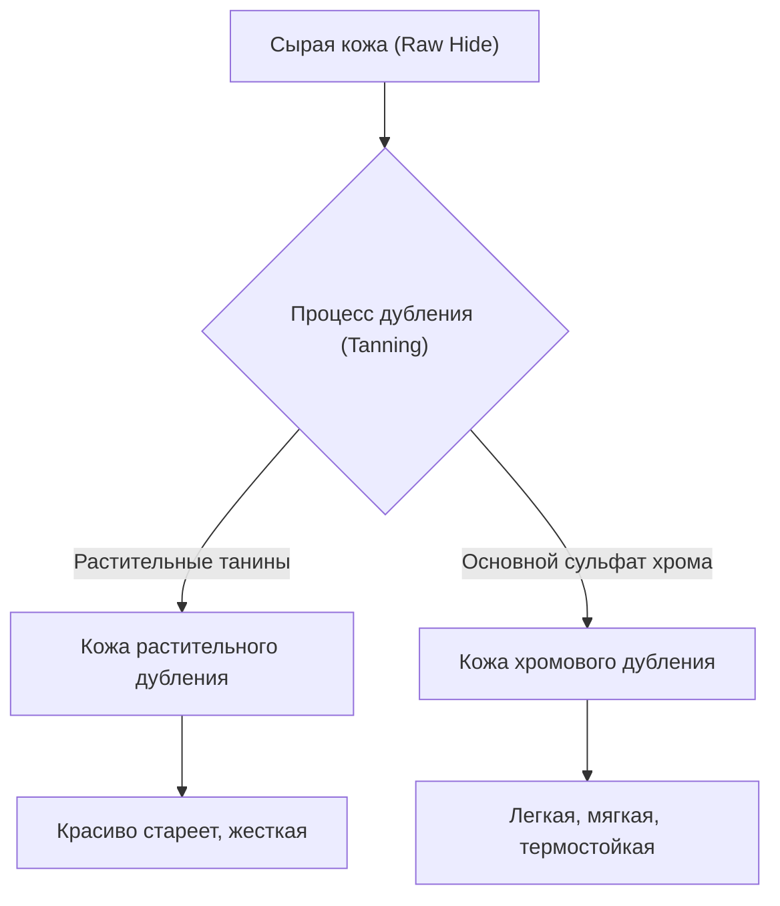

## 1. Введение: Отношения между историей человечества и кожей

Кожа (Leather) — один из древнейших материалов, освоенных человечеством. Начиная с эпохи палеолита она ценилась как материал для зимней одежды и инструментов, и с развитием цивилизации технологии её обработки усложнялись. Процесс превращения простой шкуры животного (Skin/Hide), которая не гниет и обладает гибкостью, в «кожу (Leather)» можно назвать искусством, на стыке химии и физики. В этой статье мы подробно рассмотрим виды кожи, науку о дублении и механизмы её старения.

## 2. Наука дубления: Превращение шкуры в кожу

Процесс превращения «шкуры» в «кожу» называется «дублением (Tanning)». Это химическая реакция, которая стабилизирует структуру коллагеновых волокон — основного компонента шкуры, придавая ей термостойкость, устойчивость к гниению и эластичность.

### 2.1 Растительное дубление (Vegetable Tanning)

Это традиционный метод, использующий полифенольные соединения растительного происхождения (танины). Молекулы танина образуют водородные связи с пептидными связями коллагена, создавая прочную сеть.
- **Особенности**: Относительно низкая нагрузка на окружающую среду, ярко выраженные изменения с течением времени (старение/патинирование).
- **Физические свойства**: Волокна плотные, низкая эластичность, отличная способность к формовке.

### 2.2 Хромовое дубление (Chrome Tanning)

Современный метод, использующий металлические комплексы, такие как основной сульфат хрома. Ионы хрома образуют координационные связи (сшивки) с карбоксильными группами коллагена.
- **Особенности**: Короткое время дубления, подходит для массового производства.
- **Физические свойства**: Высокая термостойкость (высокая температура усадки в кипящей воде), гибкая и легкая.

## 3. Виды кожи и их особенности

В зависимости от вида животного плотность коллагеновых волокон и структура пор различаются, благодаря чему каждый вид обладает уникальными характеристиками.

### 3.1 Коровья кожа (Bovine Leather)

Самая распространенная на рынке кожа с широким спектром применения. Классифицируется по возрасту и полу животного.
- **Телячья кожа (Calfskin)**: Телята в возрасте до 6 месяцев. Волокна чрезвычайно тонкие, считается кожей высшего качества.
- **Кип (Kipskin)**: Подросшие телята в возрасте от 6 месяцев до 2 лет. Толще и прочнее телячьей кожи.
- **Стирхайд (Steerhide)**: Кастрированные бычки в возрасте 3-6 месяцев, которым больше 2 лет. Равномерная толщина и высокая универсальность.

### 3.2 Свиная кожа (Porcine Leather/Pigskin)

Один из немногих кожевенных материалов, полностью обеспечиваемых внутри Японии.
- **Особенности**: Поры проходят насквозь от эпидермиса до обратной стороны, поэтому она обладает очень высокой воздухопроницаемостью.
- **Применение**: Внутренняя отделка обуви (подкладка), легкие сумки, одежда. Устойчива к трению и сохраняет прочность даже при небольшой толщине.

### 3.3 Лошадиная кожа (Equine Leather)

По сравнению с коровьей кожей плотность волокон обычно немного ниже, но определенные части ценятся очень высоко.
- **Кордован (Cordovan)**: Кожа, полученная путем вырезания внутреннего слоя плотных коллагеновых волокон, называемого «слоем кордована», из задней части (крупа) лошади. Её называют «бриллиантом среди кож», она обладает уникальным глубоким блеском и высокой твердостью (в несколько раз прочнее коровьей кожи).

### 3.4 Экзотическая кожа (Exotic Leather)

Особая кожа рептилий, птиц и т. д.
- **Крокодил (Crocodile)**: Уникальный узор чешуи красив и считается символом статуса. Чрезвычайно долговечна.
- **Страус (Ostrich)**: Кожа страуса. Характеризуется следами от вырванных перьев (quill marks), сочетает в себе гибкость и прочность.

## 4. Механизм старения (патинирования)

Самая большая привлекательность кожаных изделий заключается в «старении», при котором цвет и текстура меняются по мере использования. В основном это связано со следующими химическими и физическими факторами.

1. **Фотохимические реакции (ультрафиолет)**: Под воздействием ультрафиолетовых лучей солнечного света танины, содержащиеся в коже, окисляются и полимеризуются, образуя пигменты (в основном хиноны), что делает цвет более насыщенным.
2. **Перемещение и окисление масел**: Кожное сало с рук и масла для ухода проникают внутрь кожи, уменьшая трение между волокнами и окисляясь на поверхности, создавая уникальный блеск (патину).
3. **Физическое трение и сглаживание**: Ежедневное трение сглаживает микроскопические неровности на поверхности кожи, улучшая отражение света и придавая ей «глянец».

## 5. Экономические предпосылки и устойчивое развитие

Современная кожевенная промышленность также является высшей формой индустрии переработки, эффективно использующей побочные продукты (By-product) мясной промышленности. В последние годы происходят изменения с учетом воздействия на окружающую среду, такие как снижение загрязнения воды в процессе производства (сертификация LWG и т. д.) и разработка веганской кожи растительного происхождения.

Кожаные изделия — яркий пример «устойчивого материала», который при правильном уходе может служить десятилетиями. Понимание науки и истории, стоящих за ними, сделает ваше взаимодействие с кожаными изделиями в повседневной жизни еще более богатым.
