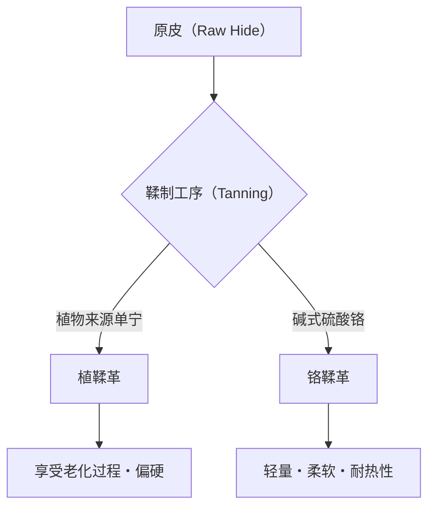

## 1. 引言：人类历史与皮革的关系

皮革是人类获得的最古老的材料之一。从旧石器时代起，它就被作为御寒衣物和工具而受到重视，随着文明的发展，其加工技术也日益高度化。单纯的动物皮（Skin/Hide）转变为不腐败且具有柔软性的“皮革（Leather）”的过程，可以说是化学与物理学交汇的艺术。本文将深入探讨皮革的种类、鞣制的科学，以及老化（经年变化）的机制。

## 2. 鞣制的科学：从皮到革的转换

将“皮”变成“革”的工序被称为“鞣制（Tanning）”。这是一种稳定皮的主要成分——胶原纤维结构，并赋予其耐热性、防腐性和柔软性的化学反应。

### 2.1 植鞣（Vegetable Tanning）

这是一种使用植物来源的多酚化合物（单宁）的传统制法。单宁分子与胶原蛋白的肽键形成氢键，构建出坚固的网络。
- **特征**: 环境负荷相对较低，经年变化（老化）显著。
- **物理特性**: 纤维紧密，伸缩性低，成型性优异。

### 2.2 铬鞣（Chrome Tanning）

这是一种使用碱式硫酸铬等金属络合物的现代制法。铬离子与胶原蛋白的羧基形成配位键（交联键）。
- **特征**: 鞣制时间短，适合大量生产。
- **物理特性**: 耐热性高（沸水收缩温度高），柔软且轻量。

## 3. 皮革的种类与特征

根据动物种类的不同，胶原纤维的密度和毛孔的结构也不同，各自具有独特的特性。

### 3.1 牛皮（Bovine Leather）

最普遍流通且用途广泛的皮革。根据月龄和性别进行分类。
- **小牛皮（Calfskin）**: 出生6个月以内的幼牛。纤维极其细密，被认为是最高级的。
- **中牛皮（Kipskin）**: 出生6个月到2年左右的中牛。比小牛皮厚且结实。
- **成牛皮（Steerhide）**: 出生3至6个月被阉割，并经过2年以上的公牛。厚度均匀，通用性高。

### 3.2 猪皮（Porcine Leather/Pigskin）

日本国内少数能自给自足的皮革材料。
- **特征**: 毛孔从表皮贯穿到背面，因此透气性非常高。
- **用途**: 鞋的内衬（Lining）以及轻量包袋、衣服。耐摩擦，即使很薄也能保持强度。

### 3.3 马皮（Equine Leather）

与牛皮相比，纤维密度往往略低，但特定部位非常珍贵。
- **马臀皮（Cordovan）**: 削出马臀部（屁股）皮内部被称为“科尔多瓦层（Cordovan层）”的高密度胶原纤维层而成。被称为“皮革中的钻石”，具有独特的深邃光泽和高硬度（牛皮数倍的强度）。

### 3.4 稀有皮革（Exotic Leather）

爬行动物和鸟类等特殊的皮革。
- **鳄鱼皮（Crocodile）**: 独特的鳞片图案（斑纹）十分美丽，被视为地位的象征。极其耐用。
- **鸵鸟皮（Ostrich）**: 鸵鸟的皮革。拔掉羽毛后的痕迹（Quill mark）是一大特征，兼具柔软性和强韧性。

## 4. 老化（经年变化）的机制

皮革制品最大的魅力在于，随着使用，颜色和质感会发生变化的“老化（Aging）”。这主要是由以下化学和物理因素引起的。

1. **光化学反应（紫外线）**: 由于阳光中紫外线的作用，皮革中包含的单宁发生氧化和聚合，生成色素（主要是醌类），从而使颜色变深。
2. **油脂的转移与氧化**: 手上的皮脂和护理用的油渗入皮革内部，减少纤维间的摩擦，同时在表面氧化，产生独特的光泽（Patina）。
3. **物理摩擦与平滑化**: 由于日常的摩擦，皮革表面的微小凹凸被压平变得平滑，光反射率提高，从而出现“光泽”。

## 5. 经济背景与可持续性

现代皮革产业也是一种有效利用肉类产业副产品（By-product）的终极回收产业。近年来，意识到了环境负荷的变革正在推进，例如减少制造过程中的水污染（LWG认证等）以及开发植物来源的纯素皮革等。

皮革制品只要进行适当的保养，就可以使用几十年，是“可持续材料”的代表。通过了解其背后的科学和历史，在日常生活中与皮革制品的相处将会变得更加丰富多彩。
