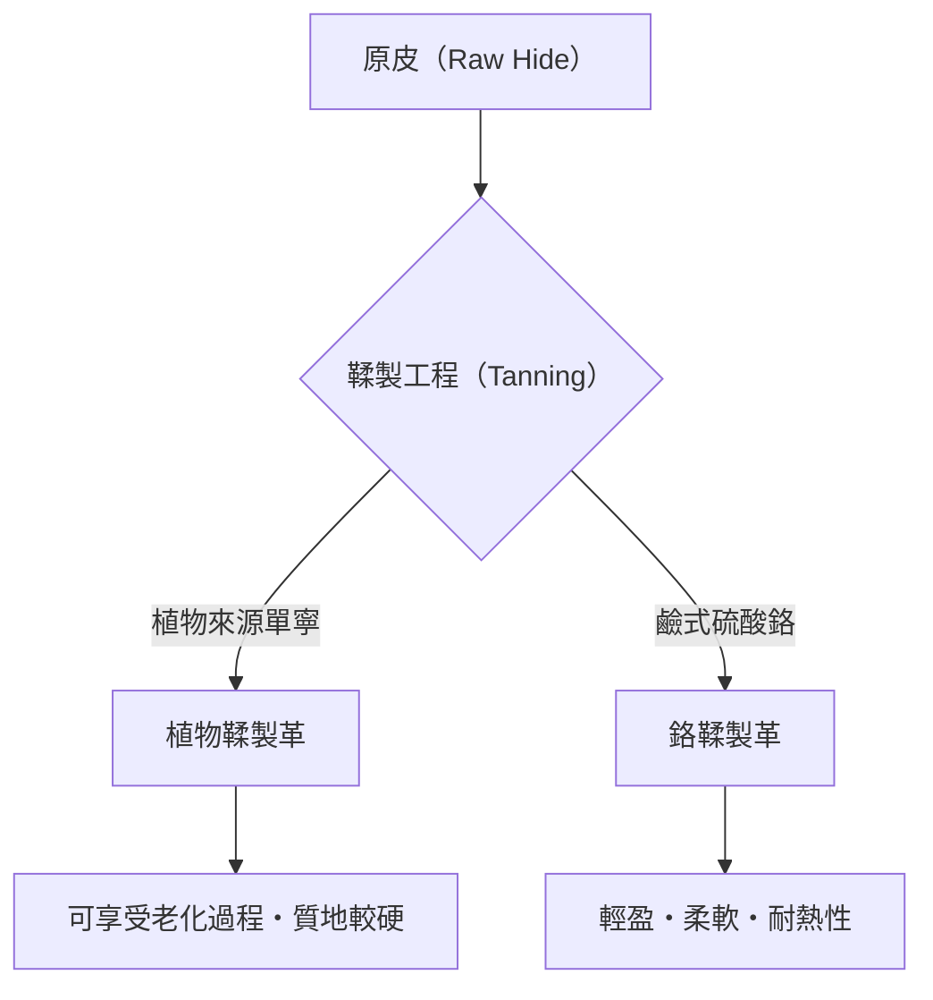

## 1. 前言：人類歷史與皮革的關係

皮革（Leather）是人類獲得的最古老材料之一。從舊石器時代起就被作為防寒衣物和工具而受到重視，隨著文明的發展，其加工技術也變得越來越高度化。從單純的動物皮（Skin/Hide），轉變為不會腐敗且具有柔軟性的「皮革（Leather）」的過程，可以說是一門化學與物理學交織的藝術。在本文中，我們將深入探討皮革的種類、鞣製的科學以及老化的機制。

## 2. 鞣製的科學：從皮到革的轉換

將「皮」轉化為「革」的過程稱為「鞣製（Tanning）」。這是一種化學反應，能穩定皮的主要成分膠原蛋白纖維的結構，並賦予其耐熱性、防腐性和柔軟性。

### 2.1 植物鞣製（Vegetable Tanning）

這是一種使用植物來源的多酚化合物（單寧）的傳統製程。單寧分子與膠原蛋白的胜肽鍵和氫鍵結合，構建出強固的網絡。
- **特徵**: 環境負擔相對較低，經年變化（老化）明顯。
- **物理特性**: 纖維緊密，伸縮性低，成形性極佳。

### 2.2 鉻鞣製（Chrome Tanning）

這是一種使用鹼式硫酸鉻等金屬錯合物的現代製程。鉻離子與膠原蛋白的羧基形成配位鍵（交聯）。
- **特徵**: 鞣製時間短，適合大量生產。
- **物理特性**: 耐熱性高（沸水收縮溫度高），輕盈且柔軟。

## 3. 皮革的種類與特徵

根據動物種類的不同，膠原蛋白纖維的密度和毛孔的結構也會有所差異，各自擁有獨特的特性。

### 3.1 牛革（Bovine Leather）

這是市面上流通最廣、用途最廣泛的皮革。會根據月齡和性別進行分類。
- **小牛皮（Calfskin）**: 出生6個月以內的幼牛。纖維極其細緻，被視為最高等級。
- **中牛皮（Kipskin）**: 出生6個月至2年左右的中牛。比小牛皮厚且堅固。
- **閹牛皮（Steerhide）**: 出生3至6個月內被閹割，並生長2年以上的公牛。厚度均勻，泛用性高。

### 3.2 豬革（Porcine Leather/Pigskin）

這是日本國內少數可以自給的皮革材料。
- **特徵**: 因為毛孔從表皮貫穿到背面，所以透氣性非常高。
- **用途**: 鞋子的內襯（Lining）以及輕量的包包、衣物。耐摩擦，即使薄也能保持強度。

### 3.3 馬革（Equine Leather）

與牛革相比，纖維密度稍微低一些，但特定部位非常珍貴。
- **馬臀皮（Cordovan）**: 取自馬匹臀部皮下被稱為「科爾多瓦層（Cordovan層）」的高密度膠原蛋白纖維層。被譽為「皮革中的鑽石」，具有獨特深邃的光澤和高硬度（強度為牛革的數倍）。

### 3.4 珍稀皮革（Exotic Leather）

爬蟲類和鳥類等特殊的皮革。
- **鱷魚皮（Crocodile）**: 獨特的鱗片紋路（斑紋）非常美麗，被視為地位的象徵。非常耐用。
- **鴕鳥皮（Ostrich）**: 鴕鳥的皮革。拔掉羽毛後的痕跡（羽毛孔）是其特徵，兼具柔軟性與強韌性。

## 4. 老化（經年變化）的機制

皮革製品最大的魅力在於，隨著使用時間的推移，顏色和質地會發生變化的「老化」過程。這主要歸因於以下化學和物理因素：

1. **光化學反應（紫外線）**: 太陽光的紫外線會使皮革中含有的單寧氧化、聚合，生成色素（主要是醌類），從而使顏色變深。
2. **油脂的轉移與氧化**: 手上的皮脂或保養用油滲透到皮革內部，減少了纖維間的摩擦，同時在表面氧化，產生獨特的光澤（Patina）。
3. **物理摩擦與平滑化**: 由於日常的摩擦，皮革表面的微小凹凸被壓平，使其變得平滑，光反射率提高，從而產生「光澤」。

## 5. 經濟背景與永續性

現代的皮革產業同時也是一種有效利用肉類產業副產品（By-product）的終極回收產業。近年來，為了減少製造過程中的水污染（如 LWG 認證），以及開發植物來源的純素皮革等，產業正朝著意識到環境負擔的方向進行變革。

如果進行適當的保養，皮革製品是可以持續使用數十年的「永續材料」代表。了解其背後的科學與歷史，將使我們在日常生活中與皮革製品的互動變得更加豐富。
