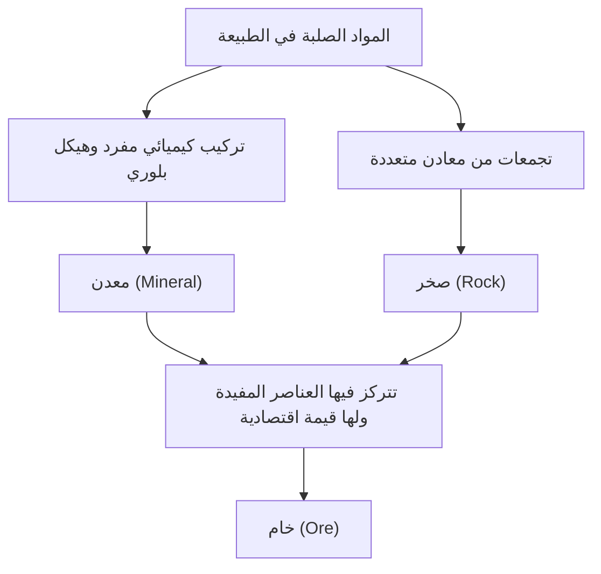

تحت أقدامنا على كوكب الأرض، يمتد عالم متنوع وجميل يضاهي نجوم الكون. "الأحجار" التي نراها يوميًا هي في الواقع مجموعات من "المعادن (Minerals)" التي تكونت عبر أزمنة هائلة تصل إلى مئات الملايين من السنين بفضل حرارة الأرض الداخلية، الضغط، والتفاعلات الكيميائية. ومن بينها، تُعرف تلك التي تحمل قيمة خاصة للبشرية باسم "الخامات (Ores)". في هذا المقال، ومن منظور جيولوجي، سنقوم بشرح شامل لعالم البلورات العميق، بدءًا من تكوين المعادن والخامات، مرورًا بخصائصها الفيزيائية والكيميائية، وصولاً إلى أهميتها الاقتصادية والتكنولوجية في المجتمع الحديث.

## 1. الفرق بين المعادن والصخور: تعلم الجيولوجيا من الأساسيات

في كثير من الأحيان، نستخدم كلمات مثل "الحجر" أو "الصخر" في حياتنا اليومية، ولكن من الناحية الجيولوجية، هناك تمييز دقيق بين "المعادن (Minerals)" و"الصخور (Rocks)".

### ما هو المعدن (Mineral)
المعدن هو مادة صلبة غير عضوية تتكون في الطبيعة، وتتميز بتركيب كيميائي محدد وهيكل بلوري منتظم. على سبيل المثال، الكوارتز (المرو) يُعبر عنه بالصيغة الكيميائية لثاني أكسيد السيليكون (SiO2)، وفي داخله تترتب ذرات السيليكون والأكسجين بشكل منتظم. هذا الترتيب المنتظم يخلق الشكل الخارجي البلوري السداسي الجميل المميز للكوارتز. حاليًا، هناك أكثر من 5000 نوع من المعادن معتمدة من قبل الرابطة الدولية للمعادن (IMA)، ويتم اكتشاف معادن جديدة كل عام.

### ما هو الصخر (Rock)
من ناحية أخرى، الصخر هو كتلة صلبة تتكون من تجمع معدن واحد أو أكثر. على سبيل المثال، "الجرانيت"، المعروف باسم حجر الجرانيت، يتكون بشكل رئيسي من خليط من عدة معادن مثل الكوارتز والفلسبار والبيوتايت (الميكا السوداء). وتُصنف الصخور بشكل عام حسب طريقة تكونها إلى ثلاثة أنواع رئيسية: "الصخور النارية" التي تتكون من تبريد وتصلب الصهارة (الماجما)، "الصخور الرسوبية" التي تتكون من تراكم الرمال والطين، و"الصخور المتحولة" التي تتكون عندما تتغير الصخور الموجودة بفعل الحرارة والضغط.

### تعريف الخام (Ore)
إذن، ما هو "الخام"؟ الخام ليس مصطلحًا جيولوجيًا، بل هو كلمة تُستخدم أساسًا من منظور اقتصادي وصناعي. عندما تتركز عناصر مفيدة (مثل العناصر المعدنية كالحديد، النحاس، الذهب وغيرها) داخل الصخور بتركيزات عالية تكفي لتكون مجدية اقتصاديًا عند استخراجها، فإن هذه الصخور أو مجموعات المعادن تُسمى "خامًا". بعبارة أخرى، مهما كان المعدن نادرًا، إذا كانت تكلفة استخراج المعدن منه باهظة جدًا، فإنه يُعامل كمجرد "صخر".

## 2. العملية الجيولوجية التي تولد البلورات

إن عملية تكوين المعادن هي انعكاس للنشاط الديناميكي للأرض نفسها. على مدى مئات الملايين من السنين، تتشابك حرارة باطن الأرض، حركات القشرة الأرضية، المياه، والغلاف الجوي في تفاعلات معقدة لإنتاج بلورات متنوعة. يمكن تصنيف عمليات التكوين الرئيسية إلى الأربعة التالية:

### 2.1 النشاط الناري (التبلور من الصهارة)
تتكون المعادن خلال عملية تبريد وتصلب "الصهارة" السائلة ذات درجة الحرارة العالية، والتي تتشكل من ذوبان الوشاح أو الجزء السفلي من القشرة الأرضية في أعماق الأرض، سواء على السطح أو في الأعماق. ومع انخفاض درجة حرارة الصهارة، تتبلور المعادن ذات درجات الانصهار الأعلى أولاً (سلسلة تفاعلات بوين).
على سبيل المثال، يتبلور الأوليفين (الزبرجد) والبيروكسين بسرعة في درجات حرارة عالية، وبالتالي تميل إلى الغرق والتجمع في قاع غرف الصهارة، مما قد يؤدي إلى تكوين رواسب خام تتركز فيها عناصر معينة (رواسب الصهارة). تُستخرج المعادن مثل البلاتين والكروم بشكل أساسي من الرواسب المتكونة بهذه العملية.

### 2.2 النشاط الحراري المائي (تكوين الرواسب الحرارية المائية)
عندما تبرد الصهارة وتتصلب، يتبقى الماء والمكونات المتطايرة التي كانت موجودة فيها حتى النهاية، وتدخل في شقوق الصخور المحيطة. هذا الماء الساخن غني بالعناصر المعدنية المذابة مثل الذهب، الفضة، النحاس، الزنك، والرصاص. وعندما يرتفع الماء الساخن عبر شقوق الصخور وتنخفض درجة حرارته وضغطه، تترسب العناصر المعدنية التي لم يعد من الممكن إبقاؤها مذابة الواحدة تلو الأخرى، لتشكل أشرطة من البلورات تسمى "الأوردة المعدنية (عروق الخام)".
تعد مناجم الذهب الشهيرة في اليابان مثل منجم هيشيكاري نوعًا من هذه الرواسب الحرارية المائية (رواسب الذهب والفضة الحرارية المائية الضحلة). يخلق النشاط الحراري المائي عناقيد كوارتز جميلة جدًا ومعادن معدنية زاهية الألوان، لذلك يتم إنتاج العديد من البلورات التي تحظى بشعبية كعينات معدنية.

### 2.3 الترسيب والتجوية
تتكون المعادن الجديدة وتتركز أيضًا من خلال عملية تآكل الصخور السطحية بفعل الأمطار والرياح (التجوية والتعرية)، ونقلها عبر الأنهار إلى البحار والبحيرات.
على سبيل المثال، عندما تتبخر مياه البحر أو البحيرات بسبب المناخ الجاف، تتبلور الأملاح الذائبة في الماء لتشكل "معادن متبخرة" مثل الملح الصخري (الهاليت) والجبس. بالإضافة إلى ذلك، فإن المعادن الصلبة والمستقرة كيميائيًا وذات الثقل النوعي العالي مثل الذهب والماس والبلاتين، تميل إلى الغرق والتراكم في قاع النهر، لتشكل "رواسب الغرينية (مثل الذهب الغريني)". بدأ أقدم استخراج للذهب في تاريخ البشرية من هذه الرواسب الغرينية.

### 2.4 التحول (إعادة التبلور بفعل الحرارة والضغط)
عندما تُدفع الصخور الموجودة بالفعل إلى أعماق تحت الأرض بسبب تحركات القشرة الأرضية وتتعرض لحرارة الصهارة أو لضغط هائل، قد تتفاعل المعادن المكونة للصخر كيميائيًا وتتحول إلى معادن مختلفة تمامًا.
في عملية تحول الحجر الجيري إلى رخام (حجر جيري بلوري) بفعل الحرارة، أو تحول الحجر الطيني إلى نايس تحت حرارة وضغط مرتفعين، تتكون معادن أحجار كريمة جميلة مثل العقيق والياقوت والزفير. في مناطق بناء الجبال حيث تتصادم القارات، مثل جبال الهيمالايا، يحدث نشاط تحولي قوي للغاية، وتتولد معادن متحولة متنوعة.

## 3. الخامات الرئيسية والمعادن النادرة التي تحرك العالم

لا يمكن لحياتنا الحديثة أن تستمر بدون المعادن المستخرجة من الخامات. من الهواتف الذكية إلى السيارات الكهربائية (EV) وحتى المباني الضخمة، هناك حاجة ماسة لأنواع مختلفة من الخامات. سنلقي هنا نظرة عامة على الخامات التي كانت ذات أهمية تاريخية، وصولاً إلى المعادن النادرة التي تدعم صناعات التكنولوجيا الفائقة اليوم.

### خام الحديد (Iron Ore)
الحديد هو المعدن الأكثر استخدامًا على وجه الأرض. يُستخرج معظم خام الحديد من "التكوينات الحديدية الشريطية (BIF)" التي تشكلت في المحيطات قبل حوالي ملياري سنة. في ذلك الوقت، تفاعلت كميات هائلة من أيونات الحديد المذابة في مياه البحر مع الأكسجين الذي أطلقته البكتيريا الزرقاء (كائنات دقيقة تقوم بالتمثيل الضوئي) لتكوين أكسيد الحديد، الذي ترسب وتراكم في قاع البحر. بعبارة أخرى، يمكن القول إن مباني الصلب والبنية التحتية التي تدعم الحضارة الحديثة هي نعمة من الأكسجين الذي أنتجته الكائنات الحية الدقيقة القديمة. معادن الخام الرئيسية هي الهيماتيت (الحديد الأحمر) والماجنتيت (الحديد المغناطيسي).

### خام النحاس (Copper Ore)
النحاس هو واحد من أوائل المعادن التي بدأ البشر في استخدامها بشكل جدي، وبفضل قدرته الممتازة على التوصيل الكهربائي، يُستخدم بكميات كبيرة في الأسلاك الكهربائية ولوحات الدوائر الإلكترونية حتى اليوم. معادن الخام الرئيسية هي الكالكوبيريت والبورنيت. يتم الجزء الأكبر من استخراج النحاس الحديث من رواسب عملاقة تسمى "رواسب النحاس السماقي"، والتي نشأت من النشاط الصهاري. تعد مناجم الحفرة المكشوفة العملاقة في تشيلي وبيرو بأمريكا الجنوبية من أشهرها.

### العناصر الأرضية النادرة (Rare Earths) ومعادن البطاريات
في السنوات الأخيرة، تركز الاهتمام الأكبر على العناصر الأرضية النادرة والليثيوم والكوبالت والنيكل، والتي تُعرف بـ "معادن البطاريات".
- **الليثيوم**: المادة الخام الرئيسية لبطاريات أيون الليثيوم. يُستخرج بشكل أساسي عن طريق تبخير المياه الجوفية من البحيرات المالحة العملاقة (مثل سالار دي أويوني) في جبال الأنديز بأمريكا الجنوبية، بالإضافة إلى تكريره من معدن يُسمى الإسبودومين الذي يُستخرج في أستراليا وغيرها.
- **الكوبالت**: ضروري لزيادة استقرار البطاريات، ولكن معظم الإنتاج العالمي يتركز في جمهورية الكونغو الديمقراطية، وهناك نقاشات حول المخاطر الجيوسياسية وقضايا بيئة العمل.
- **النيوديميوم وغيرها (العناصر الأرضية النادرة)**: ضرورية لصنع مغناطيسات دائمة قوية، ولا غنى عنها لتوربينات توليد طاقة الرياح ومحركات السيارات الكهربائية. توجد في معادن مثل الباستناسايت والمونازيت، لكن فصلها عن العناصر الأخرى صعب للغاية ويتطلب تقنية كيميائية متقدمة للتكرير.

## 4. الهيكل البلوري والخصائص الفيزيائية: لماذا تتألق الأحجار الكريمة؟

جمال المعادن وخصائصها العملية نابعة جميعها من "هيكلها البلوري". كيفية ترابط الذرات (نوع الرابطة الكيميائية) وكيفية ترتيبها (الترتيب المكاني) هي ما يحدد الصلابة، اللون، البريق، والخصائص الكهربائية.

### الصلابة (مقياس موس للصلابة)
"مقياس موس للصلابة (1-10)" مشهور كمؤشر يوضح مدى مقاومة المعدن للخدش. الماس، وهو الأقوى بصلابة 10، والتلك والجرافيت، اللذان يتميزان بالنعومة الشديدة بصلابة 1، يتكونان جميعًا فقط من "الكربون (C)". على الرغم من أن التركيب هو نفسه، إلا أن الخصائص مختلفة تمامًا لأن الماس يشكل روابط تساهمية شبكية ثلاثية الأبعاد قوية بين ذرات الكربون، بينما الجرافيت له بنية طبقية، والروابط بين الطبقات تعتمد فقط على قوة ضعيفة (قوة فان دير فالس).

### آليات اللون والتلوين
تنتج ألوان المعادن بشكل أساسي عن الشوائب الموجودة بكميات ضئيلة (مثل أيونات المعادن الانتقالية) أو العيوب في الهيكل البلوري (المراكز اللونية).
أكسيد الألومنيوم النقي (الكوراندوم) عديم اللون وشفاف، ولكن عندما يختلط به القليل من الكروم يتحول إلى "ياقوت" أحمر فاتح، وعندما يختلط به الحديد والتيتانيوم يتحول إلى "زفير" أزرق. بالإضافة إلى ذلك، فإن تأثير تلاعب الألوان (بريق ألوان قوس قزح) الموجود في الأوبال ناتج عن "اللون البنيوي"، حيث يتسبب الترتيب المنتظم لكريات السيليكا الدقيقة في حيود الضوء وتداخله.

### البريق البصري (معامل الانكسار والتشتت)
يتلألأ الحجر الكريم بسبب الانحناء الكبير للضوء عند دخوله للبلورة (معامل انكسار عالٍ) وانقسام الضوء إلى سبعة ألوان (درجة تشتت كبيرة). يمتلك الماس قيمًا عالية جدًا لهاتين الخاصيتين، ومن خلال صقله بزاوية مثالية مثل "القطع اللامع (Brilliant Cut)"، ينعكس الضوء الداخل انعكاسًا كليًا ويخرج، مما يخلق ذلك البريق المبهر (النار).

## 5. الموارد المعدنية ومستقبل البشرية: التحدي نحو الاستدامة

تاريخ البشرية هو أيضًا تاريخ اكتشاف واستخدام موارد معدنية جديدة. من العصر الحجري إلى العصر البرونزي والعصر الحديدي، يمكننا القول إن العصر الحديث هو "عصر السيليكون والمعادن النادرة". ومع ذلك، فإن الموارد المعدنية على الأرض محدودة ولا يمكن الاستمرار في استخراجها إلى ما لا نهاية.

### الأثر البيئي لتطوير المناجم
يصاحب تطوير المناجم مخاطر التسبب في مشاكل بيئية خطيرة تتمثل في قطع مساحات شاسعة من الغابات، واستهلاك كميات هائلة من الموارد المائية، وتلوث التربة والمياه بالمعادن الثقيلة. على وجه الخصوص، في السنوات الأخيرة حيث انخفضت الجودة (نسبة المعدن المستهدف في الخام)، يجب استخراج وتكسير كميات أكبر من الصخور للحصول على نفس الكمية من المعدن، مما أدى إلى زيادة استهلاك الطاقة وكمية النفايات (الركام والخبث).

### المناجم الحضرية وإعادة التدوير
للتعامل مع هذا، تزداد أهمية "المناجم الحضرية (Urban Mines)" لاستعادة المعادن من الأجهزة الإلكترونية والسيارات المستعملة. يمكن استرداد كمية من الذهب من طن واحد من الهواتف الذكية تفوق بكثير ما يمكن الحصول عليه من طن واحد من خام الذهب. ولتحقيق الاقتصاد الدائري، بات من الضروري والملح إنشاء تقنيات فعالة لإعادة التدوير.

### الجبهة الجديدة: أعماق البحار وخامات الفضاء
مع نضوب الموارد البرية على كوكب الأرض، تُوجه الأنظار نحو "أعماق البحار" و"الفضاء" كحدود جديدة.
في قاع المحيط العميق، ترقد عقيدات المنجنيز والرواسب الحرارية المائية في حالة عذراء، وتُعتبر كنزًا للمعادن النادرة. ومع ذلك، هناك مخاوف من تأثيرها على النظم البيئية في أعماق البحار، ويجري وضع لوائح دولية بشأنها.
علاوة على ذلك، وعلى المدى الطويل، أصبح "تعدين الفضاء (Space Mining)" على الكويكبات القريبة من الأرض والقمر أكثر واقعية. وقد ظهرت بالفعل شركات ناشئة تهدف إلى تعدين الكويكبات الغنية بعناصر مجموعة البلاتين لإمداد الموارد في الفضاء أو جلبها إلى الأرض.

## خاتمة

حتى الحصاة الصغيرة الملقاة على جانب الطريق تحمل في طياتها تاريخًا عظيمًا يمتد لـ 4.6 مليار سنة، منذ ولادة الأرض وحتى الوقت الحاضر. حرارة الصهارة، حركات القشرة الأرضية، والضغط والزمن الهائل، كل ذلك رتب الذرات بشكل منتظم وحولها إلى بلورات جميلة وخامات مفيدة.
الجيولوجيا وعلم المعادن ليسا مجرد دراسة لكشف شكل الأرض في الماضي، بل هما المفتاح لدعم التكنولوجيا الحديثة وتصميم مجتمع مستدام في المستقبل. في المرة القادمة التي تمسك فيها بحجر كريم جميل أو هاتف ذكي، حاول أن تتخيل قليلاً الرحلة التي مر بها هذا الشيء في أعماق الأرض ليصل إليك. عالم البلورات الذي خلقته الأرض أعمق وأكثر سحرًا مما نتخيله.
