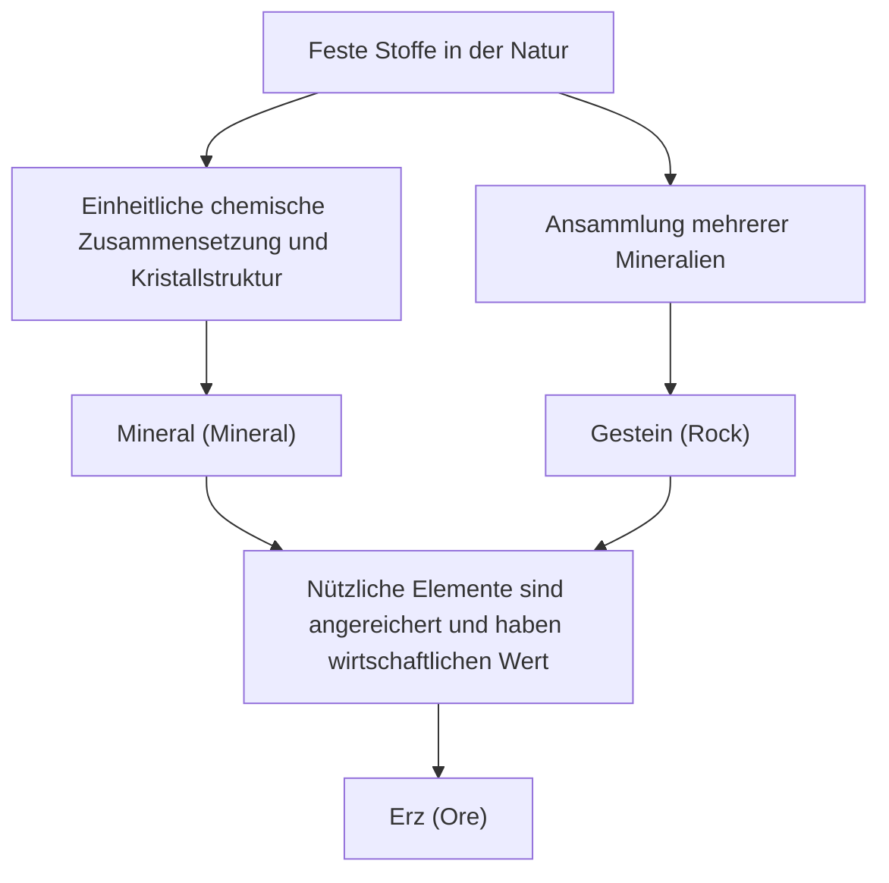

Unter unseren Füßen erstreckt sich eine vielfältige und wunderschöne Welt, die mit den Sternen des Universums vergleichbar ist. Die „Steine“, die wir im Alltag sehen, sind in Wirklichkeit Ansammlungen von „Mineralien“, die durch die Hitze, den Druck und die chemischen Veränderungen im Inneren der Erde über eine unvorstellbare Zeitspanne von Hunderten von Millionen Jahren entstanden sind. Unter ihnen werden diejenigen, die für die Menschheit von besonderem Wert sind, als „Erze“ bezeichnet. In diesem Artikel werden wir die Entstehung von Mineralien und Erzen aus geologischer Sicht, ihre physikalischen und chemischen Eigenschaften sowie ihre wirtschaftliche und technologische Bedeutung in der modernen Gesellschaft tiefgehend beleuchten und die faszinierende Welt der Kristalle entschlüsseln.

## 1. Der Unterschied zwischen Mineralien und Gesteinen: Geologie von den Grundlagen lernen

In vielen Fällen verwenden wir Wörter wie „Stein“ oder „Fels“ alltäglich, aber in der Geologie wird streng zwischen „Mineralien“ (Minerals) und „Gesteinen“ (Rocks) unterschieden.

### Was ist ein Mineral (Mineral)?
Ein Mineral ist ein in der Natur anorganisch entstandener Feststoff, der eine bestimmte chemische Zusammensetzung und eine regelmäßige Kristallstruktur aufweist. Zum Beispiel wird Quarz durch die chemische Formel Siliziumdioxid (SiO2) dargestellt, und in seinem Inneren sind Silizium- und Sauerstoffatome regelmäßig angeordnet. Diese regelmäßige Anordnung erzeugt die für Quarz charakteristische, schöne sechseckige Kristallform. Derzeit gibt es mehr als 5000 von der International Mineralogical Association (IMA) anerkannte Mineralarten, und jedes Jahr werden neue Mineralien entdeckt.

### Was ist ein Gestein (Rock)?
Andererseits ist ein Gestein eine feste Ansammlung, die aus einer oder mehreren Mineralarten besteht. Zum Beispiel besteht „Granit“, der auch als Hartgestein bekannt ist, hauptsächlich aus einer Mischung mehrerer Mineralien wie Quarz, Feldspat und Biotit. Gesteine werden je nach ihrer Entstehung grob in drei Arten unterteilt: „Magmatische Gesteine“, die durch das Abkühlen und Erstarren von Magma entstehen; „Sedimentgesteine“, die durch die Ablagerung von Sand und Schlamm entstehen; und „Metamorphe Gesteine“, die entstehen, wenn sich bestehende Gesteine durch Hitze oder Druck verändern.

### Definition von Erz (Ore)
Was also ist ein „Erz“? Erz ist kein geologischer Begriff, sondern ein Wort, das hauptsächlich aus wirtschaftlicher und industrieller Sicht verwendet wird. Wenn nützliche Elemente (hauptsächlich metallische Elemente) wie Eisen, Kupfer oder Gold in Gesteinen in einer so hohen Konzentration angereichert sind, dass sich der Abbau wirtschaftlich lohnt, wird dieses Gestein oder die Ansammlung von Mineralien als „Erz“ bezeichnet. Das bedeutet, dass ein Gestein, egal wie seltene Mineralien es enthält, lediglich als normales „Gestein“ behandelt wird, wenn die Kosten für die Gewinnung des Metalls daraus zu hoch sind.

## 2. Geologische Prozesse, bei denen Kristalle entstehen

Der Prozess der Mineralienbildung ist die dynamische Aktivität der Erde selbst. Über Zeitskalen von Hunderten von Millionen Jahren verflechten sich die Hitze im Inneren der Erde, Krustenbewegungen, Wasser und die Atmosphäre auf komplexe Weise und bringen vielfältige Kristalle hervor. Die wichtigsten Entstehungsprozesse lassen sich in die folgenden vier Kategorien einteilen.

### 2.1 Magmatismus (Kristallisation aus Magma)
Mineralien entstehen beim Prozess des Abkühlens und Erstarrens von „Magma“, einer heißen Flüssigkeit, die durch das Schmelzen des tieferen Erdmantels oder der unteren Erdkruste gebildet wird, entweder an der Erdoberfläche oder tief unter der Erde. Wenn die Temperatur des Magmas sinkt, kristallisieren die Mineralien in der Reihenfolge ihrer Schmelzpunkte aus (Bowen-Reaktionsreihe).
Zum Beispiel kristallisieren Olivin (Peridot) und Pyroxen bei hohen Temperaturen frühzeitig aus und neigen daher dazu, auf den Boden der Magmakammer zu sinken und sich dort anzusammeln, wodurch manchmal Lagerstätten entstehen, in denen bestimmte Elemente konzentriert sind (Magmatische Lagerstätten). Metalle wie Platin und Chrom werden hauptsächlich aus Lagerstätten abgebaut, die durch diesen Prozess entstanden sind.

### 2.2 Hydrothermale Prozesse (Bildung hydrothermaler Lagerstätten)
Wenn Magma abkühlt und erstarrt, bleiben die im Magma enthaltenen Wasser- und flüchtigen Bestandteile bis zum Schluss übrig und dringen in die Risse des umliegenden Gesteins ein. In diesem heißen Wasser sind metallische Elemente wie Gold, Silber, Kupfer, Zink und Blei reichlich gelöst. Wenn das heiße Wasser in den Gesteinsrissen aufsteigt und dabei Temperatur und Druck sinken, fallen die metallischen Elemente, die nicht mehr gelöst bleiben können, nach und nach aus und bilden Kristallbänder, die als „Erzgänge (Ganggesteine)“ bezeichnet werden.
Die berühmte Hishikari-Goldmine in Japan ist ebenfalls eine Art solcher hydrothermalen Lagerstätten (epithermale Gold-Silber-Lagerstätte). Hydrothermale Prozesse bringen oft sehr schöne Quarzkristalle und farbenprächtige metallische Mineralien hervor, weshalb dort viele als Mineralienproben beliebte Kristalle gefunden werden.

### 2.3 Sedimentation und Verwitterung
Auch während des Prozesses, bei dem Gesteine an der Erdoberfläche durch Regen und Wind abgetragen (Verwitterung und Erosion) und von Flüssen in Meere oder Seen transportiert werden, bilden sich neue Mineralien oder reichern sich an.
Wenn beispielsweise Meerwasser oder Seewasser durch ein trockenes Klima verdunstet, kristallisieren die im Wasser gelösten Salze aus und bilden „Evaporitmineralien“ wie Steinsalz (Halit) oder Gips. Außerdem sinken Mineralien, die hart, chemisch stabil und schwer sind, wie Gold, Diamanten und Platin, leicht auf den Flussgrund und sammeln sich dort an, wodurch „Seifenlagerstätten (z.B. Waschgold)“ entstehen. Der älteste Goldabbau der Menschheit begann in solchen Seifenlagerstätten.

### 2.4 Metamorphose (Rekristallisation durch Hitze und Druck)
Wenn bereits vorhandene Gesteine durch Krustenbewegungen tief unter die Erde gedrückt werden und der Hitze von Magma oder enormem Druck ausgesetzt sind, können die das Gestein bildenden Mineralien chemisch reagieren und in völlig neue Mineralien umgewandelt werden.
In dem Prozess, in dem Kalkstein durch Hitze zu Marmor (kristalliner Kalkstein) wird, oder wenn sich Tonstein unter hohen Temperaturen und Drücken in Gneis verwandelt, entstehen wunderschöne Edelsteinmineralien wie Granat, Rubin und Saphir. Besonders in Orogenese-Zonen (Gebirgsbildungszonen), in denen Kontinente zusammenstoßen, wie beim Himalaya-Gebirge, wirkt eine sehr starke Metamorphose, die vielfältige metamorphe Mineralien hervorbringt.

## 3. Die wichtigsten Erze und seltenen Metalle, die die Welt antreiben

Unser modernes Leben wäre ohne aus Erzen gewonnene Metalle nicht denkbar. Von Smartphones über Elektrofahrzeuge (EVs) bis hin zu riesigen Bauwerken sind verschiedene Erze unverzichtbar. Hier geben wir einen Überblick von historisch wichtigen Erzen bis hin zu seltenen Metallen, die die moderne Hightech-Industrie unterstützen.

### Eisenerz (Iron Ore)
Eisen ist das am weitesten verbreitete Metall der Welt. Der größte Teil des Eisenerzes wird aus „Bändereisenerzen (Banded Iron Formation: BIF)“ abgebaut, die sich vor etwa 2 Milliarden Jahren im Meer gebildet haben. Damals reagierten riesige Mengen an Eisenionen, die im Meerwasser gelöst waren, mit Sauerstoff, der von Cyanobakterien (photosynthetisierenden Mikroorganismen) freigesetzt wurde, zu Eisenoxid, das auf den Meeresboden sank und sich anhäufte. Das bedeutet, dass die Stahlgebäude und die Infrastruktur, die unsere moderne Zivilisation stützen, ein Geschenk des von urzeitlichen Mikroorganismen produzierten Sauerstoffs sind. Die wichtigsten Erzmineralien sind Hämatit und Magnetit.

### Kupfererz (Copper Ore)
Kupfer ist eines der ersten Metalle, das die Menschheit im großen Maßstab zu nutzen begann, und wegen seiner hervorragenden elektrischen Leitfähigkeit wird es auch heute noch in großen Mengen für Stromkabel und Leiterplatten in elektronischen Geräten verwendet. Die wichtigsten Erzmineralien sind Kupferkies (Chalkopyrit) und Buntkupferkies (Bornit). Der Großteil des modernen Kupferabbaus erfolgt aus riesigen Lagerstätten, die als „porphyrische Kupferlagerstätten“ bezeichnet werden und magmatischen Ursprungs sind. Berühmt sind die riesigen Tagebauminen in Chile und Peru in Südamerika.

### Seltene Erden und Batteriemetalle
In den letzten Jahren haben „Batteriemetalle“ wie Seltene Erden, Lithium, Kobalt und Nickel die größte Aufmerksamkeit auf sich gezogen.
- **Lithium**: Der Hauptrohstoff für Lithium-Ionen-Batterien. Es wird hauptsächlich gewonnen, indem Grundwasser aus riesigen Salzseen (wie dem Salar de Uyuni) in den südamerikanischen Anden verdampft wird, und es wird auch aus einem Mineral namens Spodumen raffiniert, das beispielsweise in Australien abgebaut wird.
- **Kobalt**: Es ist unerlässlich, um die Stabilität von Batterien zu erhöhen, aber ein Großteil der weltweiten Produktion konzentriert sich auf die Demokratische Republik Kongo, was Diskussionen über geopolitische Risiken und Arbeitsbedingungen aufwirft.
- **Neodym usw. (Seltene Erden)**: Sie sind notwendig, um starke Permanentmagnete herzustellen, und sind für Windkraftturbinen und EV-Motoren unverzichtbar. Sie sind in Mineralien wie Bastnäsit und Monazit enthalten, lassen sich jedoch nur sehr schwer von anderen Elementen trennen, was hochentwickelte chemische Technologien für die Raffination erfordert.

## 4. Kristallstruktur und physikalische Eigenschaften: Warum leuchten Edelsteine?

Die Schönheit und die praktischen Eigenschaften von Mineralien ergeben sich alle aus ihrer „Kristallstruktur“. Die Art und Weise, wie Atome miteinander verbunden sind (Art der chemischen Bindung) und wie sie angeordnet sind (räumliche Anordnung), bestimmt ihre Härte, Farbe, ihren Glanz und ihre elektrischen Eigenschaften.

### Härte (Mohshärte)
Als Indikator für die Kratzfestigkeit von Mineralien ist die „Mohshärte (1 bis 10)“ bekannt. Der härteste Diamant mit der Härte 10 und das sehr weiche Talkum oder Graphit mit der Härte 1 bestehen beide ausschließlich aus „Kohlenstoff (C)“. Der Grund, warum die Eigenschaften trotz gleicher Bestandteile völlig unterschiedlich sind, liegt darin, dass Diamant ein starkes dreidimensionales Netzwerk kovalenter Bindungen zwischen den Kohlenstoffatomen bildet, während Graphit eine Schichtstruktur aufweist, bei der die Schichten nur durch schwache Kräfte (Van-der-Waals-Kräfte) zusammengehalten werden.

### Farbe und der Mechanismus der Farbentstehung
Die Farbe von Mineralien entsteht hauptsächlich durch Spuren von Verunreinigungen (wie Übergangsmetallionen) oder durch Defekte in der Kristallstruktur (Farbzentren).
Reines Aluminiumoxid (Korund) ist farblos und transparent, aber wenn ihm Spuren von Chrom beigemischt werden, wird es zu einem leuchtend roten „Rubin“, und wenn Eisen und Titan beigemischt werden, wird es zu einem blauen „Saphir“. Außerdem beruht das Farbspiel (regenbogenfarbener Glanz), das man bei Opalen sieht, auf „Strukturfarben“, bei denen mikroskopisch kleine Siliziumdioxidkugeln regelmäßig angeordnet sind, was zu Beugung und Interferenz des Lichts führt.

### Optischer Glanz (Brechungsindex und Dispersion)
Dass Edelsteine so funkelnd leuchten, liegt daran, dass Licht, das in den Kristall eintritt, stark gebrochen wird (hoher Brechungsindex) und in sieben Farben aufgespalten wird (hohe Dispersion). Da diese Werte beim Diamanten sehr hoch sind, kann durch das Polieren in idealen Winkeln, wie beim „Brillantschliff“, das eingedrungene Licht im Inneren totalreflektiert und nach außen gestrahlt werden, wodurch das blendende Funkeln (Feuer) entsteht.

## 5. Mineralische Ressourcen und die Zukunft der Menschheit: Die Herausforderung der Nachhaltigkeit

Die Geschichte der Menschheit ist auch die Geschichte der Entdeckung und Nutzung neuer mineralischer Ressourcen. Von der Steinzeit über die Bronzezeit und die Eisenzeit können wir das heutige Zeitalter als das „Zeitalter des Siliziums und der seltenen Metalle“ bezeichnen. Die mineralischen Ressourcen auf der Erde sind jedoch begrenzt, und wir können sie nicht endlos abbauen.

### Umweltbelastung durch den Bergbau
Die Entwicklung von Minen birgt das Risiko ernsthafter Umweltprobleme wie die Abholzung riesiger Wälder, den Verbrauch großer Mengen an Wasserressourcen und die Verschmutzung von Boden und Wasser durch Schwermetalle. Besonders in den letzten Jahren, da der Erzgehalt (der Anteil des gewünschten Metalls im Erz) gesunken ist, muss eine größere Menge an Gestein abgebaut und zerkleinert werden, um die gleiche Menge an Metall zu erhalten, was zu einem erhöhten Energieverbrauch und einer Zunahme der Abfallmengen (Abraum und Schlacke) führt.

### Urban Mining (Städtischer Bergbau) und Recycling
Um diesem Problem zu begegnen, gewinnt das „Urban Mining (städtischer Bergbau)“, bei dem Metalle aus ausgedienten elektronischen Geräten und Autos zurückgewonnen werden, zunehmend an Bedeutung. Aus einer Tonne Smartphones lässt sich viel mehr Gold zurückgewinnen als aus einer Tonne Golderz. Um eine Kreislaufwirtschaft (Circular Economy) zu verwirklichen, ist die Etablierung effizienter Recyclingtechnologien dringend erforderlich.

### Neue Grenzen: Die Tiefsee und Lagerstätten im Weltraum
Da die Ressourcen auf dem Festland der Erde schwinden, rücken die „Tiefsee“ und der „Weltraum“ als neue Grenzen in den Fokus.
Auf dem Meeresgrund ruhen unberührte Manganknollen (Mangan-Nodule) und hydrothermale Lagerstätten, die als Schatztruhe für seltene Metalle gelten. Es gibt jedoch Bedenken hinsichtlich der Auswirkungen auf die Ökosysteme der Tiefsee, weshalb an internationalen Regeln gearbeitet wird.
Auf längere Sicht wird auch das „Space Mining (Weltraumbergbau)“ auf erdnahen Asteroiden oder dem Mond immer realistischer. Es gibt bereits Start-up-Unternehmen, die planen, Asteroiden abzubauen, die reich an Platingruppenmetallen sind, um Ressourcen im Weltraum bereitzustellen oder sie zur Erde zurückzubringen.

## Fazit

Selbst in einem kleinen Kieselstein, der am Straßenrand liegt, ist die epische 4,6 Milliarden Jahre alte Geschichte von der Entstehung der Erde bis zur Gegenwart eingraviert. Die Hitze des Magmas, die Krustenbewegungen, der unvorstellbare Druck und die Zeit haben Atome regelmäßig angeordnet und in wunderschöne Kristalle und nützliche Erze verwandelt.
Geologie und Mineralogie sind nicht nur Fächer, die das Bild der Erde in der Vergangenheit entschlüsseln, sondern sie sind auch der Schlüssel, um moderne Technologien zu unterstützen und eine nachhaltige Gesellschaft für die Zukunft zu gestalten. Wenn Sie das nächste Mal einen wunderschönen Edelstein oder ein Smartphone in die Hand nehmen, denken Sie einen Moment darüber nach, welch lange Reise aus den Tiefen der Erde dieses Objekt hinter sich hat, um zu Ihnen zu gelangen. Die von der Erde erschaffene Welt der Kristalle ist tiefgründiger und faszinierender, als wir es uns vorstellen können.
