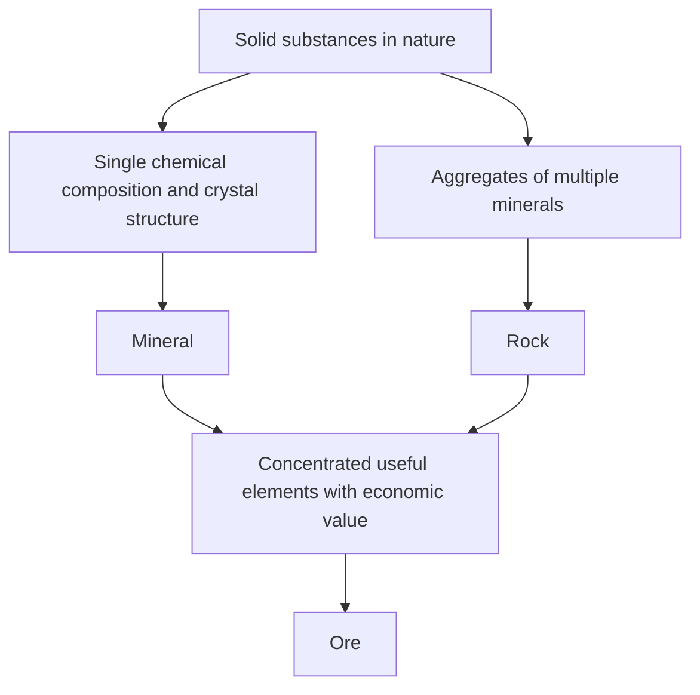

Beneath our feet lies a diverse and beautiful world that rivals the stars in the universe. The "stones" we see on a daily basis are actually aggregates of "minerals" created by internal Earth's heat, pressure, and chemical changes over a staggering period of hundreds of millions of years. Among them, those that possess special value for humanity are called "ores". In this article, we will thoroughly unravel the profound world of crystals from a geological perspective, covering the formation of minerals and ores, their physical and chemical properties, and their economic and technological importance in modern society.

## 1. The Difference Between Minerals and Rocks: Geology from the Basics

In many cases, we use words like "stone" and "rock" on a daily basis, but geologically, "minerals" and "rocks" are strictly distinguished.

### What is a Mineral?
A mineral refers to a solid substance naturally formed inorganically in nature, possessing a specific chemical composition and an ordered crystal structure. For example, quartz is represented by the chemical formula silicon dioxide (SiO2), in which silicon and oxygen atoms are regularly arranged. This regular arrangement creates the beautiful hexagonal columnar crystal shape peculiar to quartz. Currently, the number of minerals approved by the International Mineralogical Association (IMA) exceeds 5,000, and new minerals are being discovered every year.

### What is a Rock?
On the other hand, a rock is a solid aggregate made up of one or more minerals. For example, "granite," known as a building stone, is mainly composed of a mixture of multiple minerals such as quartz, feldspar, and biotite. Rocks are broadly classified by their origin into three types: "igneous rocks" formed by the cooling and solidification of magma, "sedimentary rocks" formed by the deposition of sand and mud, and "metamorphic rocks" formed when existing rocks are altered by heat and pressure.

### Definition of an Ore
So, what is an "ore"? Ore is not a geological term but is mainly used from an economic and industrial perspective. When useful elements (mainly metallic elements) such as iron, copper, and gold are concentrated in a rock at a high enough concentration to be economically viable for mining, that rock or aggregate of minerals is called an "ore." In other words, no matter how rare a mineral it contains, if it costs too much to extract the metal from it, it is treated merely as a "rock."

## 2. Geological Processes That Give Birth to Crystals

The process of mineral formation is the dynamic activity of the Earth itself. On a scale of hundreds of millions of years, the Earth's internal heat, crustal movements, water, and atmosphere intertwine complexly to create diverse crystals. The main formation processes can be classified into the following four.

### 2.1 Igneous Processes (Crystallization from Magma)
Minerals are formed as "magma," a high-temperature liquid created by the melting of the mantle or lower crust deep within the Earth, cools and solidifies on the surface or deep underground. As the temperature of the magma drops, minerals with higher melting points crystallize first (Bowen's reaction series).
For example, olivine (peridot) and pyroxene crystallize early at high temperatures, so they tend to sink and accumulate at the bottom of magma chambers, which can form ore deposits where specific elements are concentrated (magmatic deposits). Metals such as platinum and chromium are mainly mined from ore deposits formed by this process.

### 2.2 Hydrothermal Processes (Formation of Hydrothermal Deposits)
When magma cools and solidifies, the water and volatile components it contained remain until the very end, seeping into the cracks of surrounding rocks. This high-temperature hydrothermal fluid is rich in dissolved metallic elements such as gold, silver, copper, zinc, and lead. As the hydrothermal fluid rises through rock fractures and its temperature and pressure drop, the metallic elements that can no longer remain dissolved precipitate one after another, forming bands of crystals called "veins (gangue)."
Japan's famous Hishikari Gold Mine is one such type of hydrothermal deposit (epithermal gold-silver deposit). Hydrothermal action produces very beautiful quartz clusters and vibrantly colored metallic minerals, yielding many crystals that are popular as mineral specimens.

### 2.3 Sedimentary Processes and Weathering
New minerals are also formed or concentrated during the process in which surface rocks are worn away by rain and wind (weathering and erosion) and carried by rivers to seas and lakes.
For example, when seawater or lake water evaporates due to an arid climate, the salts dissolved in the water crystallize to form "evaporite minerals" such as rock salt (halite) and gypsum. In addition, minerals that are hard, chemically stable, and have a high specific gravity, such as gold, diamonds, and platinum, tend to sink and accumulate on riverbeds, forming "placer deposits (like placer gold)." The earliest human gold mining began with these placer deposits.

### 2.4 Metamorphism (Recrystallization by Heat and Pressure)
When existing rocks are pushed deep underground by crustal movements and subjected to the heat of magma or immense pressure, the minerals that made up the rock may undergo chemical reactions and be reborn as completely different minerals.
In the process where limestone is heated and becomes marble (crystalline limestone), or where mudstone changes into gneiss under high temperature and high pressure, beautiful gem minerals such as garnet, ruby, and sapphire are formed. Particularly in orogenic belts where continents are colliding, such as the Himalayas, extremely powerful metamorphism occurs, producing a wide variety of metamorphic minerals.

## 3. Major Ores and Rare Metals That Drive the World

Our modern lives would not be possible without the metals extracted from ores. From smartphones and electric vehicles (EVs) to massive structures, various ores are indispensable. Here, we overview everything from historically important ores to the rare metals that support modern high-tech industries.

### Iron Ore
Iron is the most widely used metal on Earth. Most iron ore is mined from "Banded Iron Formations (BIF)," which were formed in oceans about 2 billion years ago. At that time, a massive amount of iron ions dissolved in the ocean reacted with oxygen released by cyanobacteria (photosynthetic microorganisms) to become iron oxide, which precipitated and accumulated on the seabed. In other words, the steel buildings and infrastructure that support modern civilization can be said to be a blessing of the oxygen created by ancient microorganisms. The main ore minerals are hematite and magnetite.

### Copper Ore
Copper is one of the first metals that humanity began to use extensively, and because of its excellent electrical conductivity, it is still used in massive quantities today for electrical wires and electronic circuit boards. The main ore minerals are chalcopyrite and bornite. The vast majority of modern copper mining is conducted from enormous ore deposits called "porphyry copper deposits," which originate from magmatic activity. The giant open-pit mines in Chile and Peru in South America are famous for this.

### Rare Earths and Battery Metals
In recent years, the metals attracting the most attention are "battery metals" such as rare earths, lithium, cobalt, and nickel.
- **Lithium**: The main raw material for lithium-ion batteries. It is mainly extracted by evaporating lithium contained in the groundwater of huge salt flats (such as the Uyuni Salt Flat) in the Andes mountains of South America, and it is also refined from a mineral called spodumene mined in places like Australia.
- **Cobalt**: Essential for increasing the stability of batteries, but the majority of global production is concentrated in the Democratic Republic of the Congo, leading to discussions over geopolitical risks and labor environment issues.
- **Neodymium, etc. (Rare Earths)**: Required for making powerful permanent magnets, they are indispensable for wind power turbines and EV motors. They are contained in minerals such as bastnäsite and monazite, but separation from other elements is extremely difficult, requiring advanced chemical technology for refining.

## 4. Crystal Structure and Physical Properties: Why Do Gemstones Sparkle?

The beauty and practical properties of minerals all stem from their "crystal structure." How the atoms are connected (type of chemical bond) and how they are arranged (spatial configuration) determine their hardness, color, brilliance, and electrical properties.

### Hardness (Mohs Hardness)
The "Mohs hardness scale (1 to 10)" is famous as an index of a mineral's scratch resistance. Diamond, the hardest at hardness 10, and talc or graphite, which are extremely soft at hardness 1, are both composed entirely of "carbon (C)." The reason their properties are entirely different despite having the same composition is that diamonds form a strong, three-dimensional network of covalent bonds between carbon atoms, whereas graphite has a layered structure, and the layers are connected only by a weak force (van der Waals force).

### The Mechanism of Color and Coloration
The color of a mineral is primarily caused by trace impurities (such as transition metal ions) or defects in the crystal structure (color centers).
Pure aluminum oxide (corundum) is colorless and transparent, but when a trace amount of chromium is mixed in, it becomes a brilliant red "ruby," and when iron and titanium are mixed in, it becomes a blue "sapphire." In addition, the play-of-color (rainbow-like brilliance) seen in opals is due to "structural color," where light diffracts and interferes because microscopic silica spheres are arranged in a regular pattern.

### Optical Brilliance (Refractive Index and Dispersion)
Gemstones sparkle because light bends significantly when it enters the crystal (high refractive index) and separates into the colors of the rainbow (high dispersion). Because diamonds have very high values for these properties, polishing them at ideal angles, such as the "brilliant cut," allows the light that enters them to be completely internally reflected and emitted outwards, creating that dazzling brilliance (fire).

## 5. Mineral Resources and Humanity's Future: The Challenge for Sustainability

The history of humanity is also a history of discovering and utilizing new mineral resources. From the Stone Age to the Bronze Age and the Iron Age, modern times can be called the "era of silicon and rare metals." However, the mineral resources on Earth are finite, and we cannot continue to mine them inexhaustibly.

### The Environmental Impact of Mine Development
Mine development entails serious environmental risks, such as massive deforestation, heavy consumption of water resources, and soil and water pollution from heavy metals. Particularly in recent years, as ore grades (the proportion of the target metal in the ore) have been declining, much more rock must be mined and crushed to obtain the same amount of metal, increasing energy consumption and the volume of waste (tailings and slag).

### Urban Mines and Recycling
To address this, the importance of "urban mines," which recover metals from used electronic devices and automobiles, is growing. Far more gold can be recovered from one ton of smartphones than from one ton of gold ore. Toward realizing a circular economy, the establishment of efficient recycling technologies is an urgent task.

### Frontiers: Deep Seabed and Space Deposits
As land-based resources on Earth deplete, the "deep seabed" and "space" are drawing attention as new frontiers.
Manganese nodules and hydrothermal deposits lie untouched on the deep seabed, which is considered a treasure trove of rare metals. However, there are concerns about the impact on deep-sea ecosystems, and the creation of international rules is underway.
Furthermore, from a longer-term perspective, "space mining" on near-Earth asteroids and the Moon is becoming a reality. Venture companies have emerged that aim to mine asteroids rich in platinum-group elements for resupplying resources in space or bringing them back to Earth.

## Conclusion

Even a single small pebble rolling on the side of the road carries the magnificent history of 4.6 billion years from the birth of the Earth to the present. The heat of magma, crustal movements, and immense pressure and time have arranged atoms systematically, transforming them into beautiful crystals and useful ores.
Geology and mineralogy are disciplines that not only unravel the past form of the Earth but are also the keys to supporting modern technology and designing a sustainable society for the future. The next time you hold a beautiful gemstone or a smartphone in your hand, try to imagine for a moment what kind of journey it took deep within the Earth to reach you. The world of crystals created by the Earth is far deeper and more full of charm than we can imagine.
