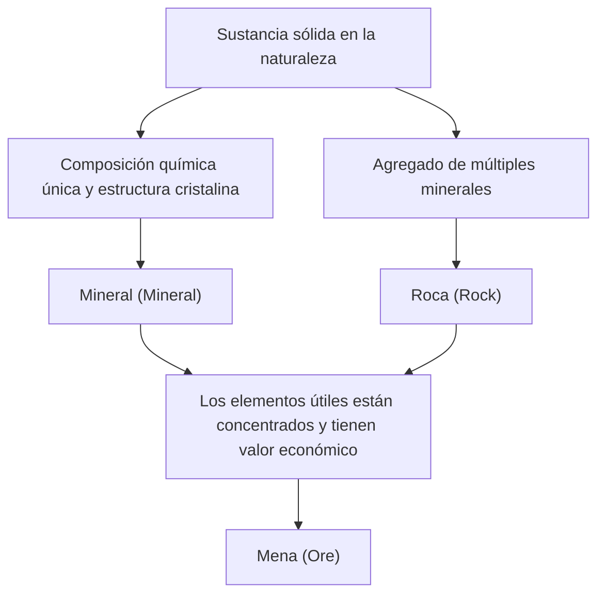

Bajo nuestros pies en la Tierra, se extiende un mundo tan diverso y hermoso que rivaliza con las estrellas del universo. Las "piedras" que vemos a diario son en realidad agregados de "minerales" creados a través del calor, la presión y los cambios químicos en el interior de la Tierra durante una asombrosa cantidad de tiempo, cientos de millones de años. Y, entre ellos, aquellos que tienen un valor especial para la humanidad se denominan "menas". En este artículo, desde una perspectiva geológica, exploraremos a fondo el profundo mundo de los cristales, desde la formación de los minerales y las menas, pasando por sus características físicas y químicas, hasta su importancia económica y tecnológica en la sociedad moderna.

## 1. La diferencia entre minerales y rocas: geología desde lo básico

En muchos casos, usamos palabras como "piedra" o "roca" a diario, pero geológicamente, "mineral" y "roca" se distinguen estrictamente.

### ¿Qué es un mineral?

Un mineral es un sólido generado inorgánicamente en la naturaleza y se refiere a una sustancia que tiene una composición química específica y una estructura cristalina regular. Por ejemplo, el cristal de roca (cuarzo) se representa por la fórmula química dióxido de silicio (SiO2), y en su interior, los átomos de silicio y oxígeno están dispuestos de forma regular. Esta disposición regular crea la hermosa forma exterior de cristal prismático hexagonal característica del cuarzo. Actualmente, el número de minerales reconocidos por la Asociación Mineralógica Internacional (IMA) supera los 5000 tipos, y se descubren nuevos minerales cada año.

### ¿Qué es una roca?

Por otro lado, una roca es un agregado sólido compuesto por uno o más tipos de minerales. Por ejemplo, el "granito", conocido también como piedra berroqueña, está compuesto por una mezcla de múltiples minerales, principalmente cuarzo, feldespato y biotita. Según su origen, las rocas se clasifican a grandes rasgos en tres grupos: "rocas ígneas", formadas por el enfriamiento y solidificación del magma; "rocas sedimentarias", formadas por la acumulación de arena o lodo; y "rocas metamórficas", que son rocas preexistentes que han cambiado debido al calor o la presión.

### Definición de mena (Ore)

Entonces, ¿qué es una "mena"? "Mena" no es un término geológico, sino una palabra que se usa principalmente desde una perspectiva económica e industrial. Cuando los elementos útiles (principalmente elementos metálicos) como el hierro, el cobre o el oro están concentrados en las rocas en una concentración lo suficientemente alta como para ser económicamente rentables, ese agregado de rocas o minerales se llama "mena". En otras palabras, sin importar cuán raro sea el mineral que contenga, si cuesta demasiado extraer el metal de él, se trata simplemente como una "roca".

## 2. Procesos geológicos por los cuales nacen los cristales

El proceso mediante el cual se forman los minerales es en sí mismo la actividad dinámica de la Tierra. A una escala de cientos de millones de años, el calor del interior de la Tierra, los movimientos de la corteza, el agua y la atmósfera se entrelazan de manera compleja para crear una variedad de cristales. Los principales procesos de formación se pueden clasificar en los cuatro siguientes.

### 2.1 Actividad ígnea (cristalización a partir del magma)

Los minerales se forman en el proceso donde el "magma", un líquido a alta temperatura creado al derretirse el manto o la parte inferior de la corteza terrestre en las profundidades de la Tierra, se enfría y solidifica en la superficie o a gran profundidad bajo tierra. A medida que disminuye la temperatura del magma, los minerales con puntos de fusión más altos cristalizan primero (Serie de reacciones de Bowen).
Por ejemplo, el olivino (peridoto) y el piroxeno cristalizan rápidamente a altas temperaturas, por lo que tienden a hundirse y acumularse en el fondo de las cámaras magmáticas, lo que a veces conduce a la formación de depósitos minerales donde se concentran ciertos elementos (depósitos magmáticos). Metales como el platino y el cromo se extraen principalmente de los depósitos minerales formados en este proceso.

### 2.2 Actividad hidrotermal (formación de depósitos hidrotermales)

Cuando el magma se enfría y solidifica, el agua y los componentes volátiles que contenía el magma quedan hasta el final y penetran en las grietas de las rocas circundantes. En esta agua hidrotermal a alta temperatura, se disuelven abundantemente elementos metálicos como oro, plata, cobre, zinc y plomo. A medida que el agua hidrotermal asciende por las grietas de la roca y la temperatura y la presión disminuyen, los elementos metálicos que ya no pueden permanecer disueltos precipitan uno tras otro, formando bandas de cristales llamadas "vetas minerales" (ganga).
La famosa mina de oro de Hishikari en Japón también es un tipo de depósito hidrotermal como este (depósito epitermal de oro y plata). Dado que la actividad hidrotermal produce agrupaciones de cuarzo extremadamente hermosas y minerales metálicos de colores brillantes, se producen muchos cristales que son populares como especímenes minerales.

### 2.3 Actividad sedimentaria y meteorización

Incluso en el proceso por el cual las rocas de la superficie terrestre se desgastan por la lluvia y el viento (meteorización y erosión) y son transportadas por los ríos al mar o a los lagos, se forman o concentran nuevos minerales.
Por ejemplo, cuando el agua de mar o de lago se evapora debido a un clima seco, la sal disuelta en el agua cristaliza y se forman "minerales evaporíticos" como la sal de roca (halita) y el yeso. Además, los minerales duros, químicamente estables y de alta gravedad específica, como el oro, los diamantes y el platino, tienden a hundirse y acumularse en los lechos de los ríos, formando "depósitos de placer" (como oro aluvial). La minería de oro más antigua de la humanidad comenzó a partir de estos depósitos de placer.

### 2.4 Metamorfismo (recristalización por calor y presión)

Cuando las rocas ya existentes son empujadas hacia las profundidades subterráneas por movimientos de la corteza y otras fuerzas, y se someten al calor del magma y a una inmensa presión, los minerales que componían la roca pueden sufrir reacciones químicas y renacer como minerales completamente diferentes.
En el proceso en el que la piedra caliza se calienta para convertirse en mármol (piedra caliza cristalina), o en el proceso en el que la lutita se convierte en gneis bajo alta temperatura y presión, se forman hermosos minerales preciosos como el granate, el rubí y el zafiro. Particularmente en los cinturones orogénicos donde los continentes chocan entre sí, como la cordillera del Himalaya, actúa un metamorfismo extremadamente poderoso, creando una amplia variedad de minerales metamórficos.

## 3. Las principales menas y metales raros que mueven el mundo

Nuestra vida moderna no existiría sin los metales extraídos de las menas. Desde los teléfonos inteligentes hasta los vehículos eléctricos (VE) y las gigantescas estructuras, varios tipos de menas son indispensables. Aquí daremos un repaso desde las menas históricamente importantes hasta los metales raros que sostienen la industria de alta tecnología actual.

### Mineral de hierro (Iron Ore)

El hierro es el metal más utilizado en la Tierra. La mayor parte del mineral de hierro se extrae de las "formaciones de hierro bandeado" (Banded Iron Formation: BIF) formadas en los océanos hace unos 2 mil millones de años. En ese momento, una gran cantidad de iones de hierro disueltos en el mar reaccionaron con el oxígeno liberado por las cianobacterias (microorganismos fotosintéticos) para convertirse en óxido de hierro, que se depositó y acumuló en el fondo marino. En otras palabras, los edificios de acero y la infraestructura que sustentan la civilización moderna pueden considerarse una bendición del oxígeno creado por los microorganismos antiguos. Los principales minerales de mena son la hematita y la magnetita.

### Mineral de cobre (Copper Ore)

El cobre es uno de los primeros metales que la humanidad comenzó a utilizar en serio y, dado que tiene una excelente conductividad, todavía se usa en grandes cantidades hoy en día para cables eléctricos y placas de circuitos en dispositivos electrónicos. Los principales minerales de mena son la calcopirita y la bornita. La mayor parte de la minería moderna de cobre se lleva a cabo en depósitos gigantescos derivados de la actividad magmática llamados "depósitos de cobre pórfido". Son famosas las enormes minas a cielo abierto en Chile y Perú, en América del Sur.

### Tierras raras y metales de batería

En los últimos años, lo que más ha llamado la atención son los "metales de batería", como las tierras raras, el litio, el cobalto y el níquel.
- **Litio**: La materia prima principal de las baterías de iones de litio. Se extrae principalmente evaporando el litio contenido en el agua subterránea de los enormes lagos salados de la Cordillera de los Andes en América del Sur (como el Salar de Uyuni), y también se refina a partir de un mineral llamado espodumena, que se extrae en países como Australia.
- **Cobalto**: Es indispensable para mejorar la estabilidad de las baterías, pero la mayor parte de la producción mundial se concentra en la República Democrática del Congo, y se están debatiendo los riesgos geopolíticos y los problemas del entorno laboral.
- **Neodimio y otros (Tierras raras)**: Son necesarios para fabricar potentes imanes permanentes, y son esenciales para las turbinas eólicas y los motores de los vehículos eléctricos. Están contenidos en minerales como la bastnasita y la monacita, pero su separación de otros elementos es extremadamente difícil y su refinación requiere tecnología química avanzada.

## 4. Estructura cristalina y propiedades físicas: ¿Por qué brillan las piedras preciosas?

La belleza y las propiedades prácticas de los minerales provienen enteramente de su "estructura cristalina". La forma en que los átomos están conectados (el tipo de enlace químico) y cómo están dispuestos (disposición espacial) determina su dureza, color, brillo y propiedades eléctricas.

### Dureza (Escala de dureza de Mohs)

La "escala de dureza de Mohs (1 al 10)" es famosa como un indicador de la resistencia al rayado de los minerales. El diamante, el más duro con una dureza de 10, y el talco o el grafito, que son muy blandos con una dureza de 1, están formados ambos únicamente por "carbono (C)". La razón por la que sus propiedades son completamente diferentes a pesar de tener la misma composición es que el diamante forma enlaces covalentes fuertes en una red tridimensional entre los átomos de carbono, mientras que el grafito tiene una estructura en capas y las uniones entre las capas son solo de fuerzas débiles (fuerzas de Van der Waals).

### Mecanismo de color y coloración

El color de los minerales se produce principalmente por las impurezas (como los iones de metales de transición) contenidas en pequeñas cantidades, o por defectos en la estructura cristalina (centros de color).
El óxido de aluminio puro (corindón) es incoloro y transparente, pero cuando se mezcla con una cantidad minúscula de cromo, se convierte en un "rubí" de color rojo brillante, y cuando se mezcla con hierro y titanio, se convierte en un "zafiro" azul. Además, el juego de colores (brillo iridiscente) que se ve en los ópalos se debe a un "color estructural", donde diminutas esferas de sílice dispuestas regularmente causan la difracción e interferencia de la luz.

### Brillo óptico (Índice de refracción y dispersión)

El brillo deslumbrante de las piedras preciosas se debe a que la luz se dobla significativamente cuando entra en el cristal (alto índice de refracción) y a que la luz se divide en los siete colores (alta dispersión). Dado que los diamantes tienen estos valores muy altos, pulirlos en ángulos ideales, como en el "corte brillante", permite que la luz que ingresa al interior se refleje totalmente y se proyecte hacia afuera, creando ese destello cegador (fuego).

## 5. Los recursos minerales y el futuro de la humanidad: el desafío de la sostenibilidad

La historia de la humanidad es también la historia del descubrimiento y uso de nuevos recursos minerales. Desde la Edad de Piedra, pasando por la Edad del Bronce y la Edad del Hierro, se podría decir que la época actual es la "Era del silicio y los metales raros". Sin embargo, los recursos minerales en la Tierra son limitados y no se pueden seguir extrayendo inagotablemente.

### El impacto ambiental del desarrollo minero

El desarrollo de minas conlleva el riesgo de causar graves problemas ambientales, como la deforestación de vastas extensiones de bosques, el consumo masivo de recursos hídricos y la contaminación del suelo y el agua con metales pesados. Especialmente en los últimos años, donde la ley (la proporción del metal objetivo en el mineral) está disminuyendo, para obtener la misma cantidad de metal, es necesario extraer y triturar más rocas, lo que aumenta el consumo de energía y la cantidad de desechos (escombros y escoria).

### Minería urbana y reciclaje

Para hacer frente a esto, está ganando importancia la "minería urbana", que recupera metales de dispositivos electrónicos y automóviles usados. A partir de 1 tonelada de teléfonos inteligentes se puede recuperar mucho más oro del que se obtendría de 1 tonelada de mineral de oro. Con miras a hacer realidad una economía circular, es urgente establecer tecnologías de reciclaje eficientes.

### Nuevas fronteras: depósitos minerales en el lecho marino profundo y en el espacio

Mientras los recursos terrestres en la Tierra se agotan, el "lecho marino profundo" y el "espacio" atraen la atención como nuevas fronteras.
En el lecho marino profundo, yacen intactos nódulos de manganeso y depósitos hidrotermales, y se los considera un tesoro de metales raros. Sin embargo, existe preocupación por el impacto en el ecosistema de las profundidades marinas, por lo que se está avanzando en la creación de normas internacionales.
Además, desde una perspectiva a largo plazo, la "minería espacial" en los asteroides cercanos a la Tierra y en la Luna también se está convirtiendo en una realidad. Han surgido incluso empresas emergentes que buscan extraer minerales de asteroides ricos en metales del grupo del platino, con el objetivo de reabastecer recursos en el espacio o traerlos de vuelta a la Tierra.

## Conclusión

Incluso en el pequeño guijarro que rueda por el borde del camino está grabada la épica historia de 4.600 millones de años, desde el nacimiento de la Tierra hasta el presente. El calor del magma, los movimientos de la corteza terrestre y el inmenso tiempo y presión han ordenado regularmente los átomos, transformándolos en hermosos cristales y útiles menas.
La geología y la mineralogía son disciplinas clave, no solo para descubrir el aspecto de la Tierra en el pasado, sino también para respaldar la tecnología moderna y diseñar una sociedad sostenible para el futuro. La próxima vez que tenga en sus manos una hermosa gema o su teléfono inteligente, intente imaginar por un momento qué viaje a través de las profundidades de la Tierra la llevó hasta usted. El mundo de los cristales creados por la Tierra es más profundo y está más lleno de fascinación de lo que podemos imaginar.
