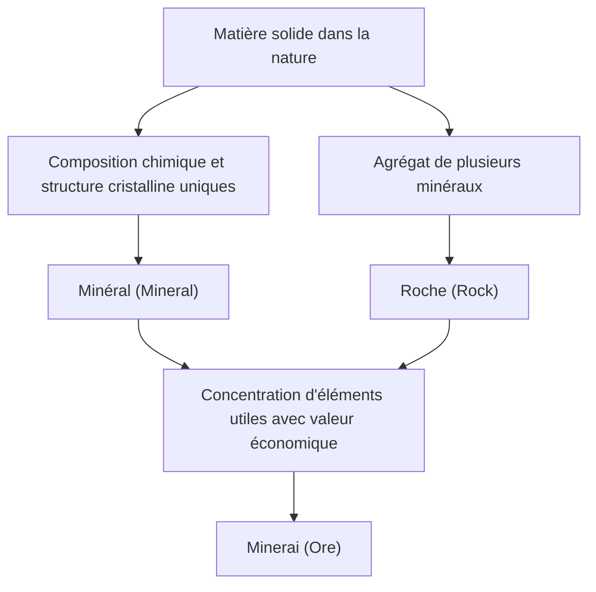

Sous nos pieds s'étend un monde d'une diversité et d'une beauté comparables aux étoiles de l'univers. Les "pierres" que nous voyons tous les jours sont en fait des agrégats de "minéraux" créés sur une durée astronomique de centaines de millions d'années par la chaleur, la pression et les changements chimiques à l'intérieur de la Terre. Parmi eux, ceux qui ont une valeur particulière pour l'humanité sont appelés "minerais". Dans cet article, d'un point de vue géologique, nous explorerons en profondeur le monde des cristaux, de la formation des minéraux et des minerais à leurs propriétés physiques et chimiques, en passant par leur importance économique et technologique dans la société moderne.

## 1. Différence entre minéraux et roches : La géologie à partir de la base

Souvent, nous utilisons les mots "pierre" et "roche" au quotidien, mais en géologie, les termes "minéral" et "roche" sont strictement distingués.

### Qu'est-ce qu'un minéral ?
Un minéral est une substance inorganique solide formée dans la nature, possédant une composition chimique spécifique et une structure cristalline régulière. Par exemple, le quartz (ou cristal de roche) est représenté par la formule chimique dioxyde de silicium (SiO2), et à l'intérieur, les atomes de silicium et d'oxygène sont arrangés de manière régulière. Cet arrangement régulier crée la forme cristalline prismatique hexagonale magnifique, caractéristique du quartz. Actuellement, le nombre de minéraux approuvés par l'Association Internationale de Minéralogie (IMA) dépasse les 5 000 espèces, et de nouveaux minéraux sont découverts chaque année.

### Qu'est-ce qu'une roche ?
D'autre part, une roche est un agrégat solide composé d'un ou de plusieurs types de minéraux. Par exemple, le "granit", bien connu, est composé d'un mélange de plusieurs minéraux, principalement du quartz, des feldspaths et de la biotite (mica noir). Selon leur origine, les roches sont globalement divisées en trois catégories : les "roches magmatiques" (ou ignées) formées par le refroidissement du magma, les "roches sédimentaires" formées par l'accumulation de sable et de boue, et les "roches métamorphiques" qui sont des roches existantes modifiées par la chaleur ou la pression.

### Définition d'un minerai (Ore)
Alors, qu'est-ce qu'un "minerai" ? Le terme minerai n'est pas strictement géologique, mais est principalement utilisé d'un point de vue économique et industriel. Lorsqu'une roche contient des éléments utiles (principalement des éléments métalliques) comme le fer, le cuivre ou l'or à une concentration suffisamment élevée pour être économiquement rentable à exploiter, cet agrégat de roches ou de minéraux est appelé "minerai". En d'autres termes, peu importe la rareté du minéral contenu, si l'extraction du métal coûte trop cher, il est simplement traité comme une "roche".

## 2. Le processus géologique par lequel naissent les cristaux

Le processus de formation des minéraux est l'activité dynamique de la Terre elle-même. Sur des échelles de centaines de millions d'années, la chaleur interne de la Terre, les mouvements de la croûte, l'eau et l'atmosphère s'entremêlent de manière complexe pour créer une diversité de cristaux. Les principaux processus de formation peuvent être classés en quatre catégories :

### 2.1 Processus magmatique (cristallisation à partir du magma)
Les minéraux se forment lors du processus de refroidissement et de solidification du "magma", un liquide à haute température résultant de la fusion du manteau ou de la partie inférieure de la croûte terrestre. À mesure que la température du magma baisse, les minéraux cristallisent successivement en commençant par ceux ayant le point de fusion le plus élevé (série de réactions de Bowen).
Par exemple, l'olivine (péridot) et le pyroxène cristallisent très tôt à haute température et ont tendance à couler et à s'accumuler au fond de la chambre magmatique, formant ainsi parfois des gisements où des éléments spécifiques sont concentrés (gisements magmatiques). Des métaux tels que le platine et le chrome sont principalement extraits de gisements formés par ce processus.

### 2.2 Processus hydrothermal (formation de gisements hydrothermaux)
Lorsque le magma refroidit et se solidifie, l'eau et les composants volatils contenus dans le magma restent jusqu'à la fin et pénètrent dans les fissures des roches environnantes. Cette eau chaude à haute température est riche en éléments métalliques dissous tels que l'or, l'argent, le cuivre, le zinc et le plomb. Lorsque les fluides hydrothermaux montent à travers les fissures des roches et que leur température et leur pression diminuent, les éléments métalliques qui ne peuvent plus rester dissous précipitent successivement, formant des bandes de cristaux appelées "filons".
La célèbre mine d'or de Hishikari au Japon est un type de ce gisement hydrothermal (gisement épithermal d'or et d'argent). Le processus hydrothermal donne naissance à de très beaux amas de quartz et à des minéraux métalliques aux couleurs vives, produisant ainsi de nombreux cristaux très prisés comme spécimens minéraux.

### 2.3 Sédimentation et altération
De nouveaux minéraux peuvent également se former ou se concentrer pendant le processus où les roches à la surface de la terre sont érodées par la pluie et le vent (altération et érosion), puis transportées par les rivières vers les mers et les lacs.
Par exemple, lorsque l'eau de mer ou des lacs s'évapore sous des climats arides, le sel dissous cristallise pour former des "minéraux évaporitiques" tels que le sel gemme (halite) ou le gypse. De plus, les minéraux durs, chimiquement stables et ayant une densité élevée comme l'or, le diamant et le platine ont tendance à couler au fond des rivières, formant ainsi des "gisements alluvionnaires (placers)". Les premières extractions d'or de l'humanité ont commencé dans ces gisements alluvionnaires.

### 2.4 Métamorphisme (recristallisation par la chaleur et la pression)
Lorsque les roches existantes sont enfouies profondément sous terre par les mouvements tectoniques et soumises à la chaleur du magma ou à une pression énorme, les minéraux constituant la roche peuvent subir des réactions chimiques et se transformer en minéraux complètement différents.
Lors du processus où le calcaire est chauffé pour devenir du marbre, ou lorsque le mudstone se transforme en gneiss sous haute température et pression, de beaux minéraux précieux comme le grenat, le rubis et le saphir se forment. En particulier, dans les ceintures orogéniques où des continents entrent en collision, comme dans la chaîne de l'Himalaya, un métamorphisme extrêmement puissant agit, donnant naissance à une grande variété de minéraux métamorphiques.

## 3. Minerais majeurs et métaux rares qui font tourner le monde

Notre mode de vie moderne serait impossible sans les métaux extraits des minerais. Du smartphone aux véhicules électriques (VE), en passant par les structures gigantesques, divers minerais sont indispensables. Ici, nous passons en revue depuis les minerais historiquement importants jusqu'aux métaux rares qui soutiennent l'industrie de pointe moderne.

### Minerai de fer (Iron Ore)
Le fer est le métal le plus largement utilisé sur Terre. La majorité du minerai de fer est extraite des "gisements de fer rubanés (Banded Iron Formation : BIF)" qui se sont formés dans les océans il y a environ 2 milliards d'années. À l'époque, une grande quantité d'ions fer dissous dans la mer ont réagi avec l'oxygène libéré par les cyanobactéries (micro-organismes photosynthétiques) pour devenir des oxydes de fer, qui ont précipité et se sont accumulés au fond de la mer. En d'autres termes, les bâtiments en acier et les infrastructures qui soutiennent la civilisation moderne sont une bénédiction de l'oxygène produit par les micro-organismes anciens. Les principaux minéraux de minerai sont l'hématite et la magnétite.

### Minerai de cuivre (Copper Ore)
Le cuivre est l'un des premiers métaux que l'humanité a commencé à utiliser à grande échelle. Ayant une excellente conductivité électrique, il est toujours massivement utilisé aujourd'hui pour les fils électriques et les cartes de circuits électroniques. Les principaux minéraux sont la chalcopyrite et la bornite. La majorité de l'extraction moderne du cuivre se fait à partir de gisements géants d'origine magmatique, appelés "gisements de cuivre porphyrique". Les gigantesques mines à ciel ouvert au Chili et au Pérou en Amérique du Sud sont célèbres.

### Terres rares et métaux pour batteries
Récemment, les "métaux pour batteries" tels que les terres rares, le lithium, le cobalt et le nickel attirent le plus d'attention.
- **Lithium** : Matière première principale des batteries lithium-ion. Il est principalement extrait par évaporation des eaux souterraines des vastes lacs salés (comme le Salar d'Uyuni) situés dans la cordillère des Andes en Amérique du Sud, et est également raffiné à partir d'un minéral appelé spodumène, extrait en Australie, entre autres.
- **Cobalt** : Indispensable pour améliorer la stabilité des batteries, mais la grande majorité de la production mondiale est concentrée en République démocratique du Congo, soulevant des discussions sur les risques géopolitiques et les problèmes de conditions de travail.
- **Néodyme et autres (Terres rares)** : Nécessaires pour fabriquer des aimants permanents puissants, et essentiels pour les turbines éoliennes et les moteurs de VE. Ils sont contenus dans des minéraux tels que la bastnésite et la monazite, mais leur séparation des autres éléments est très difficile, nécessitant des technologies chimiques très avancées pour leur raffinage.

## 4. Structure cristalline et propriétés physiques : Pourquoi les pierres précieuses brillent-elles ?

La beauté et les propriétés pratiques des minéraux découlent toutes de leur "structure cristalline". La façon dont les atomes sont liés (le type de liaison chimique) et comment ils sont arrangés (la disposition spatiale) déterminent la dureté, la couleur, l'éclat et les propriétés électriques.

### Dureté (Dureté de Mohs)
L'"échelle de dureté de Mohs (1 à 10)" est célèbre comme indicateur de la résistance d'un minéral aux rayures. Le diamant, le plus dur à 10, ainsi que le talc et le graphite, très tendres avec une dureté de 1, sont tous deux composés uniquement de "carbone (C)". Bien qu'ils aient la même composition, la raison pour laquelle leurs propriétés sont complètement différentes est que le diamant forme de solides liaisons covalentes tridimensionnelles entre les atomes de carbone, tandis que le graphite a une structure en couches, et les liaisons entre les couches ne sont maintenues que par de faibles forces (forces de van der Waals).

### Couleur et mécanisme de coloration
La couleur des minéraux est principalement causée par des impuretés à l'état de traces (telles que des ions de métaux de transition) ou des défauts dans la structure cristalline (centres de couleur).
L'oxyde d'aluminium pur (corindon) est incolore et transparent, mais lorsqu'une petite quantité de chrome y est mélangée, il devient un "rubis" rouge vif, et avec du fer et du titane, il devient un "saphir" bleu. De plus, le jeu de couleurs (éclat iridescent) observé dans l'opale est dû à la "couleur structurelle", où de minuscules sphères de silice sont régulièrement alignées, provoquant la diffraction et l'interférence de la lumière.

### Éclat optique (Indice de réfraction et dispersion)
Les pierres précieuses scintillent et brillent parce que la lumière se courbe fortement (indice de réfraction élevé) lorsqu'elle pénètre dans le cristal, et la lumière se sépare en sept couleurs (dispersion élevée). Étant donné que le diamant possède des valeurs très élevées pour ces caractéristiques, en le taillant avec des angles idéaux tels que la "taille brillant", la lumière entrant à l'intérieur est totalement réfléchie et projetée vers l'extérieur, produisant cet éclat éblouissant (feu).

## 5. Ressources minérales et l'avenir de l'humanité : Le défi de la durabilité

L'histoire de l'humanité est aussi celle de la découverte et de l'utilisation de nouvelles ressources minérales. De l'âge de pierre à l'âge du bronze, en passant par l'âge du fer, on peut dire que l'époque moderne est "l'ère du silicium et des métaux rares". Cependant, les ressources minérales sur Terre sont limitées, et nous ne pouvons pas continuer à les extraire inépuisablement.

### Impact environnemental de l'exploitation minière
Le développement minier entraîne de graves risques environnementaux tels que la déforestation à grande échelle, la consommation massive de ressources en eau, et la pollution des sols et de l'eau par les métaux lourds. En particulier, avec la diminution de la teneur (la proportion du métal cible dans le minerai) ces dernières années, pour obtenir la même quantité de métal, il faut extraire et broyer plus de roches, augmentant ainsi la consommation d'énergie et la quantité de déchets (stériles et scories).

### Mine urbaine et recyclage
Pour y faire face, l'importance de la "mine urbaine", qui récupère les métaux des appareils électroniques et des automobiles usagés, s'accroît. D'une tonne de smartphones, il est possible de récupérer beaucoup plus d'or que d'une tonne de minerai d'or. Pour réaliser une économie circulaire, l'établissement de technologies de recyclage efficaces est urgent.

### Nouvelles frontières : Fonds marins abyssaux et gisements spatiaux
Alors que les ressources terrestres s'épuisent, les "fonds marins abyssaux" et "l'espace" attirent l'attention en tant que nouvelles frontières.
Dans les fonds marins abyssaux, des nodules polymétalliques (nodules de manganèse) et des gisements hydrothermaux dorment à l'état vierge, considérés comme un trésor de métaux rares. Cependant, l'impact sur les écosystèmes des grands fonds suscite des inquiétudes, et l'élaboration de règles internationales est en cours.
À plus long terme, l'"exploitation minière spatiale" sur les astéroïdes géocroiseurs et la Lune devient également une réalité. Des startups émergent, visant à exploiter les astéroïdes riches en métaux du groupe du platine pour se ravitailler en ressources dans l'espace ou pour les ramener sur Terre.

## Conclusion

Même un petit caillou tombé sur le bord du chemin porte en lui la grande histoire de 4,6 milliards d'années, de la naissance de la Terre jusqu'à nos jours. La chaleur du magma, les mouvements tectoniques, ainsi que des pressions et des durées colossales ont ordonné les atomes de manière régulière, les transformant en de magnifiques cristaux et en minerais utiles.
La géologie et la minéralogie ne sont pas seulement des sciences permettant de dévoiler le passé de la Terre, mais ce sont des disciplines clés pour soutenir la technologie moderne et concevoir une société future durable. La prochaine fois que vous aurez entre les mains une belle pierre précieuse ou un smartphone, essayez d'imaginer un peu le voyage qu'ils ont fait depuis les profondeurs de la Terre pour arriver jusqu'à vous. Le monde des cristaux créé par la Terre est bien plus profond et plein de charme que nous ne pouvons l'imaginer.
