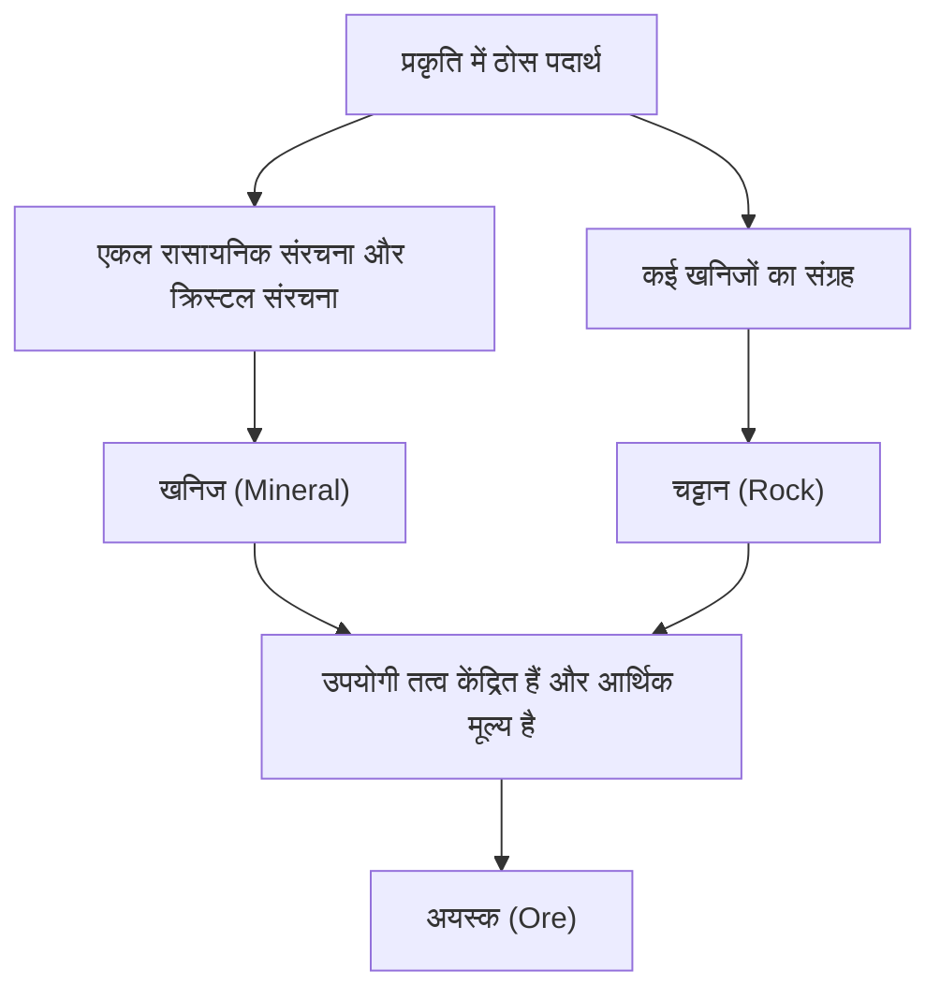

पृथ्वी के पैरों के नीचे, एक विविध और खूबसूरत दुनिया फैली हुई है जो ब्रह्मांड के तारों को टक्कर देती है। "पत्थर" जिन्हें हम रोजमर्रा की जिंदगी में देखते हैं, वास्तव में "खनिज (मिनरल)" के संग्रह हैं जो पृथ्वी के अंदर गर्मी, दबाव और रासायनिक परिवर्तनों द्वारा अरबों वर्षों के अकल्पनीय समय में बनाए गए हैं। और, उनमें से, जिनका मानव जाति के लिए विशेष मूल्य है, उन्हें "अयस्क (ओर)" कहा जाता है। इस लेख में, हम भूवैज्ञानिक दृष्टिकोण से खनिजों और अयस्कों की उत्पत्ति, उनके भौतिक और रासायनिक गुणों और आधुनिक समाज में उनके आर्थिक और तकनीकी महत्व तक, क्रिस्टल की गहरी दुनिया को पूरी तरह से उजागर करेंगे।

## 1. खनिज और चट्टान के बीच का अंतर: खरोंच से भूविज्ञान सीखना

कई मामलों में, हम रोजमर्रा की जिंदगी में "पत्थर" और "चट्टान" जैसे शब्दों का उपयोग करते हैं, लेकिन भूवैज्ञानिक रूप से "खनिज (मिनरल)" और "चट्टान (रॉक)" के बीच कड़ाई से अंतर किया जाता है।

### खनिज (Mineral) क्या है
खनिज एक ठोस पदार्थ है जो प्रकृति में अकार्बनिक रूप से उत्पन्न होता है और इसमें एक विशिष्ट रासायनिक संरचना और नियमित क्रिस्टल संरचना होती है। उदाहरण के लिए, क्वार्ट्ज (स्फटिक) को सिलिकॉन डाइऑक्साइड (SiO2) के रासायनिक सूत्र द्वारा दर्शाया जाता है, और इसके अंदर, सिलिकॉन और ऑक्सीजन परमाणु नियमित रूप से व्यवस्थित होते हैं। यह नियमित व्यवस्था क्वार्ट्ज के विशिष्ट हेक्सागोनल स्तंभकार सुंदर क्रिस्टल का बाहरी आकार बनाती है। वर्तमान में, अंतर्राष्ट्रीय खनिज संघ (IMA) द्वारा अनुमोदित खनिजों की संख्या 5000 से अधिक है, और हर साल नए खनिजों की खोज की जा रही है।

### चट्टान (Rock) क्या है
दूसरी ओर, एक चट्टान एक या अधिक खनिजों से बना एक ठोस संग्रह है। उदाहरण के लिए, "ग्रेनाइट" जिसे मिकागे पत्थर के रूप में जाना जाता है, मुख्य रूप से क्वार्ट्ज, फेल्डस्पार और बायोटाइट जैसे कई खनिजों के मिश्रण से बना है। चट्टानों को मोटे तौर पर उनके मूल के अनुसार तीन प्रकारों में विभाजित किया जाता है: ठंडे और कठोर मैग्मा से बनी "आग्नेय चट्टानें", रेत और कीचड़ के जमा होने से बनी "तलछटी चट्टानें", और मौजूदा चट्टानों से गर्मी और दबाव के कारण बनी "कायांतरित चट्टानें"।

### अयस्क (Ore) की परिभाषा
तो "अयस्क" क्या है? अयस्क कोई भूवैज्ञानिक शब्द नहीं है, बल्कि मुख्य रूप से आर्थिक और औद्योगिक दृष्टिकोण से उपयोग किया जाने वाला शब्द है। यदि चट्टान में लोहा, तांबा, सोना आदि जैसे उपयोगी तत्व (मुख्य रूप से धातु तत्व) उच्च सांद्रता में केंद्रित होते हैं जो आर्थिक रूप से लाभदायक होते हैं, तो चट्टान या खनिजों के संग्रह को "अयस्क" कहा जाता है। दूसरे शब्दों में, चाहे उसमें कितना भी दुर्लभ खनिज क्यों न हो, यदि उससे धातु निकालने में बहुत अधिक लागत आती है, तो उसे केवल एक "चट्टान" माना जाता है।

## 2. भूवैज्ञानिक प्रक्रिया जिसके द्वारा क्रिस्टल का जन्म होता है

जिस प्रक्रिया से खनिज बनते हैं वह पृथ्वी की गतिशील गतिविधि ही है। करोड़ों वर्षों के पैमाने पर, पृथ्वी के अंदर की गर्मी, क्रस्टल गतिविधियाँ, पानी और वायुमंडल जटिल रूप से एक दूसरे से जुड़ते हुए विभिन्न क्रिस्टल बनाते हैं। मुख्य गठन प्रक्रियाओं को निम्नलिखित चार में वर्गीकृत किया जा सकता है।

### 2.1 आग्नेय क्रिया (मैग्मा से क्रिस्टलीकरण)
खनिज उस प्रक्रिया के दौरान बनते हैं जिसमें पृथ्वी की सतह पर या भूमिगत गहराई में मेंटल या निचले क्रस्ट के पिघलने से बना उच्च तापमान वाला तरल "मैग्मा" ठंडा होकर सख्त हो जाता है। जैसे-जैसे मैग्मा का तापमान गिरता है, उच्च गलनांक वाले खनिज पहले क्रिस्टलीकृत होते हैं (बोवेन की प्रतिक्रिया श्रृंखला)।
उदाहरण के लिए, पेरिडॉट (ओलिविन) और पाइरोक्सिन उच्च तापमान पर जल्दी क्रिस्टलीकृत हो जाते हैं, इसलिए वे आसानी से डूब जाते हैं और मैग्मा कक्ष के तल पर इकट्ठा हो जाते हैं, जिससे अयस्क जमा हो सकते हैं जिनमें विशिष्ट तत्व केंद्रित होते हैं (मैग्मैटिक अयस्क जमा)। प्लैटिनम और क्रोमियम जैसी धातुएं मुख्य रूप से इस प्रक्रिया में बने अयस्क जमा से निकाली जाती हैं।

### 2.2 हाइड्रोथर्मल क्रिया (हाइड्रोथर्मल अयस्क जमा का निर्माण)
जब मैग्मा ठंडा होकर सख्त हो जाता है, तो मैग्मा में मौजूद पानी और वाष्पशील घटक अंत तक बने रहते हैं और आसपास की चट्टानों की दरारों में प्रवेश कर जाते हैं। इस उच्च तापमान वाले गर्म पानी में सोना, चांदी, तांबा, जस्ता और सीसा जैसे धातु तत्व प्रचुर मात्रा में घुले होते हैं। जैसे ही चट्टान की दरारों से गर्म पानी के बढ़ने पर तापमान और दबाव गिरता है, धातु तत्व जो अब भंग नहीं हो सकते, एक के बाद एक अवक्षेपित होते हैं, जिससे "शिरा (गैंग)" नामक क्रिस्टल का एक बैंड बनता है।
जापान की प्रसिद्ध हिशिकारी खदान भी इसी प्रकार के हाइड्रोथर्मल अयस्क जमा (उथले हाइड्रोथर्मल सोना-चांदी अयस्क जमा) का एक प्रकार है। हाइड्रोथर्मल क्रिया बहुत सुंदर क्वार्ट्ज क्लस्टर और रंगीन धातु खनिज पैदा करती है, इसलिए कई क्रिस्टल जो खनिज नमूनों के रूप में लोकप्रिय हैं, उत्पादित होते हैं।

### 2.3 अवसादन और अपक्षय
उस प्रक्रिया में भी नए खनिज बनते या केंद्रित होते हैं जिसमें पृथ्वी की सतह पर चट्टानें बारिश और हवा (अपक्षय और क्षरण) से खुरची जाती हैं और नदियों के माध्यम से समुद्रों और झीलों तक ले जाई जाती हैं।
उदाहरण के लिए, जब समुद्री जल या झील का पानी शुष्क जलवायु के कारण वाष्पित हो जाता है, तो पानी में घुला हुआ नमक क्रिस्टलीकृत हो जाता है और रॉक सॉल्ट (हैलाइट) और जिप्सम जैसे "बाष्पीकरणीय खनिज" बन जाते हैं। इसके अलावा, सोना, हीरा और प्लैटिनम जैसे खनिज जो कठोर, रासायनिक रूप से स्थिर होते हैं, और उच्च विशिष्ट गुरुत्व रखते हैं, आसानी से नदी के तल में डूब जाते हैं और जमा हो जाते हैं, जिससे "प्लेसर जमा (प्लेसर सोना, आदि)" बनते हैं। मानव जाति का सबसे पुराना सोने का खनन इस प्लेसर जमा से शुरू हुआ था।

### 2.4 कायांतरण (गर्मी और दबाव के कारण पुनर्क्रिस्टलीकरण)
जब पहले से मौजूद चट्टानों को क्रस्टल गतिविधियों के कारण भूमिगत गहराई में धकेल दिया जाता है और मैग्मा की गर्मी और भारी दबाव के अधीन किया जाता है, तो चट्टान बनाने वाले खनिजों में रासायनिक प्रतिक्रियाएं हो सकती हैं और वे पूरी तरह से अलग खनिजों में बदल सकते हैं।
उस प्रक्रिया में जिसमें चूना पत्थर संगमरमर (क्रिस्टलीय चूना पत्थर) बनने के लिए गर्मी प्राप्त करता है, और जिस प्रक्रिया में मडस्टोन उच्च तापमान और उच्च दबाव के तहत गनीस में बदल जाता है, गार्नेट, रूबी और नीलम जैसे सुंदर रत्न खनिज बनते हैं। विशेष रूप से ओरोजेनिक बेल्ट में जहां हिमालय पर्वत जैसे महाद्वीप आपस में टकरा रहे हैं, बहुत शक्तिशाली कायांतरण क्रिया काम करती है, और विभिन्न कायांतरित खनिज पैदा होते हैं।

## 3. प्रमुख अयस्क और दुर्लभ धातुएं जो दुनिया को चलाती हैं

आधुनिक समय में हमारा जीवन अयस्कों से निकाली गई धातुओं के बिना नहीं चल सकता है। स्मार्टफोन से लेकर इलेक्ट्रिक वाहनों (EV) और विशाल इमारतों तक, विभिन्न अयस्क अपरिहार्य हैं। यहाँ, हम ऐतिहासिक रूप से महत्वपूर्ण अयस्कों से लेकर आधुनिक उच्च तकनीक उद्योगों का समर्थन करने वाली दुर्लभ धातुओं का अवलोकन करेंगे।

### लौह अयस्क (Iron Ore)
लोहा पृथ्वी पर सबसे व्यापक रूप से उपयोग की जाने वाली धातु है। अधिकांश लौह अयस्क का खनन "बैंडेड आयरन फॉर्मेशन (BIF)" से किया जाता है, जो लगभग 2 अरब साल पहले समुद्र में बना था। उस समय, समुद्र में बड़ी मात्रा में घुले लोहे के आयन सायनोबैक्टीरिया (प्रकाश संश्लेषण करने वाले सूक्ष्मजीव) द्वारा छोड़े गए ऑक्सीजन के साथ प्रतिक्रिया करके आयरन ऑक्साइड बन गए, जो समुद्र तल पर अवक्षेपित और जमा हो गए। दूसरे शब्दों में, स्टील की इमारतें और बुनियादी ढांचे जो आधुनिक सभ्यता का समर्थन करते हैं, उन्हें प्राचीन सूक्ष्मजीवों द्वारा बनाई गई ऑक्सीजन का वरदान कहा जा सकता है। मुख्य अयस्क खनिज हेमेटाइट और मैग्नेटाइट हैं।

### तांबा अयस्क (Copper Ore)
तांबा उन धातुओं में से एक है जिसे मानव जाति ने सबसे पहले पूरी तरह से उपयोग करना शुरू किया था, और क्योंकि इसमें उत्कृष्ट विद्युत चालकता है, आज भी इसका उपयोग बिजली के तारों और इलेक्ट्रॉनिक उपकरणों के सब्सट्रेट के लिए बड़ी मात्रा में किया जाता है। मुख्य अयस्क खनिज चाल्कोपाइराइट और बोर्नाइट हैं। आधुनिक तांबे के खनन का अधिकांश हिस्सा मैग्मा गतिविधि से प्राप्त "पोर्फिरी कॉपर डिपॉजिट" नामक विशाल अयस्क जमा से किया जाता है। दक्षिण अमेरिका में चिली और पेरू में विशाल ओपन-पिट खदानें प्रसिद्ध हैं।

### दुर्लभ पृथ्वी (दुर्लभ पृथ्वी तत्व) और बैटरी धातुएं
हाल के वर्षों में, जिस चीज ने सबसे ज्यादा ध्यान आकर्षित किया है, वह है दुर्लभ पृथ्वी, लिथियम, कोबाल्ट और निकल जैसी "बैटरी धातुएं"।
- **लिथियम**: लिथियम-आयन बैटरी का मुख्य कच्चा माल। यह मुख्य रूप से दक्षिण अमेरिका में एंडीज पर्वत (जैसे सालार डी उयुनी) में विशाल नमक झीलों के भूजल में निहित लिथियम को वाष्पित करके निकाला जाता है, और इसे स्पोड्यूमिन नामक खनिज से भी परिष्कृत किया जाता है, जिसका खनन ऑस्ट्रेलिया आदि में किया जाता है।
- **कोबाल्ट**: यह बैटरी की स्थिरता में सुधार के लिए आवश्यक है, लेकिन दुनिया का अधिकांश उत्पादन कांगो लोकतांत्रिक गणराज्य में केंद्रित है, और भू-राजनीतिक जोखिम और काम के माहौल के मुद्दों पर चर्चा की जा रही है।
- **नियोडिमियम, आदि (दुर्लभ पृथ्वी)**: मजबूत स्थायी चुंबक बनाने के लिए आवश्यक, और पवन टरबाइन और EV मोटर्स के लिए अपरिहार्य। वे बास्टनेसाइट और मोनाज़ाइट जैसे खनिजों में निहित होते हैं, लेकिन अन्य तत्वों से उनका अलगाव बहुत मुश्किल है, और शोधन के लिए उन्नत रासायनिक तकनीक की आवश्यकता होती है।

## 4. क्रिस्टल संरचना और भौतिक गुण: रत्न क्यों चमकते हैं?

खनिजों की सुंदरता और व्यावहारिक गुण सभी उनकी "क्रिस्टल संरचना" से उत्पन्न होते हैं। परमाणु कैसे बंधे हैं (रासायनिक बंधनों के प्रकार) और उन्हें कैसे व्यवस्थित किया जाता है (स्थानिक व्यवस्था) कठोरता, रंग, चमक और विद्युत गुणों को निर्धारित करता है।

### कठोरता (मोह्स कठोरता)
खनिजों की खरोंच प्रतिरोध को दर्शाने वाले सूचकांक के रूप में "मोह्स कठोरता (1-10)" प्रसिद्ध है। 10 की कठोरता वाला सबसे कठोर हीरा और 1 की कठोरता वाला बहुत नरम टैल्क और ग्रेफाइट दोनों केवल "कार्बन (C)" से बने हैं। यद्यपि घटक समान हैं, गुण पूरी तरह से भिन्न हैं क्योंकि हीरा कार्बन परमाणुओं के बीच एक मजबूत त्रि-आयामी नेटवर्क सहसंयोजक बंधन बनाता है, जबकि ग्रेफाइट की एक स्तरित संरचना होती है, और परतों के बीच केवल एक कमजोर बल (वैन डेर वाल्स बल) से बंधे होते हैं।

### रंग और रंग तंत्र
खनिजों का रंग मुख्य रूप से सूक्ष्म मात्रा में निहित अशुद्धियों (संक्रमण धातु आयन, आदि) और क्रिस्टल संरचना में दोषों (रंग केंद्रों) के कारण होता है।
शुद्ध एल्यूमीनियम ऑक्साइड (कोरंडम) रंगहीन और पारदर्शी होता है, लेकिन जब इसमें थोड़ी मात्रा में क्रोमियम मिलाया जाता है, तो यह गहरा लाल "रूबी" बन जाता है, और जब लोहा और टाइटेनियम मिलाया जाता है, तो यह नीला "नीलम" बन जाता है। इसके अलावा, ओपल में देखा जाने वाला रंग का खेल (इंद्रधनुषी चमक) "संरचनात्मक रंग" के कारण होता है जिसमें प्रकाश सूक्ष्म सिलिका क्षेत्रों की नियमित व्यवस्था के कारण विवर्तन और हस्तक्षेप का कारण बनता है।

### ऑप्टिकल चमक (अपवर्तक सूचकांक और फैलाव)
रत्नों की चमक इस तथ्य के कारण है कि जब प्रकाश क्रिस्टल में प्रवेश करता है तो प्रकाश काफी मुड़ जाता है (उच्च अपवर्तक सूचकांक) और प्रकाश सात रंगों में विभाजित हो जाता है (उच्च फैलाव)। क्योंकि हीरे में ये मूल्य बहुत अधिक होते हैं, "ब्रिलियंट कट" जैसे आदर्श कोण पर पॉलिश करने से, अंदर प्रवेश करने वाला प्रकाश पूरी तरह से परावर्तित होता है और बाहर की ओर उत्सर्जित होता है, जिससे वह चकाचौंध चमक (आग) पैदा होती है।

## 5. खनिज संसाधन और मानव जाति का भविष्य: स्थिरता की चुनौती

मानव इतिहास भी नए खनिज संसाधनों की खोज और उपयोग का इतिहास है। पाषाण युग, कांस्य युग और लौह युग से होते हुए, आधुनिक समय को "सिलिकॉन (सिलिकॉन) और दुर्लभ धातुओं का युग" कहा जा सकता है। हालाँकि, पृथ्वी पर खनिज संसाधन सीमित हैं, और उन्हें अंतहीन रूप से खनन नहीं किया जा सकता है।

### खदान विकास का पर्यावरणीय प्रभाव
खदानों के विकास में बड़े पैमाने पर वनों की कटाई, जल संसाधनों की बड़ी खपत और भारी धातुओं द्वारा मिट्टी और पानी के प्रदूषण की गंभीर पर्यावरणीय समस्याओं का जोखिम होता है। विशेष रूप से हाल के वर्षों में जब ग्रेड (अयस्क में लक्षित धातु का अनुपात) कम हो रहा है, धातु की समान मात्रा प्राप्त करने के लिए अधिक चट्टानों का खनन और कुचल दिया जाना चाहिए, जिससे ऊर्जा की खपत और अपशिष्ट (मलबे, स्लैग) की मात्रा बढ़ रही है।

### शहरी खदानें (अर्बन माइन) और पुनर्चक्रण
इससे निपटने के लिए, उपयोग किए गए इलेक्ट्रॉनिक उपकरणों और ऑटोमोबाइल से धातुओं को पुनर्प्राप्त करने के लिए "शहरी खदानों (अर्बन माइन)" का महत्व बढ़ रहा है। 1 टन स्मार्टफोन से, 1 टन सोने के अयस्क की तुलना में बहुत अधिक सोना प्राप्त किया जा सकता है। एक परिपत्र अर्थव्यवस्था (सर्कुलर इकोनॉमी) को साकार करने के लिए, कुशल रीसाइक्लिंग तकनीक की स्थापना एक जरूरी काम है।

### फ्रंटियर: गहरे समुद्र तल और अंतरिक्ष अयस्क जमा
चूंकि पृथ्वी पर भूमि संसाधन समाप्त हो रहे हैं, "गहरे समुद्र तल" और "अंतरिक्ष" नए मोर्चे के रूप में ध्यान आकर्षित कर रहे हैं।
गहरे समुद्र तल पर, मैंगनीज नोड्यूल और हाइड्रोथर्मल अयस्क जमा अछूते पड़े हैं, और उन्हें दुर्लभ धातुओं का खजाना कहा जाता है। हालांकि, गहरे समुद्र के पारिस्थितिक तंत्र पर प्रभाव के बारे में चिंताएं हैं, और अंतर्राष्ट्रीय नियम बनाए जा रहे हैं।
इसके अलावा, लंबी अवधि के परिप्रेक्ष्य में, पृथ्वी के निकट क्षुद्रग्रहों और चंद्रमा पर "अंतरिक्ष खनन (स्पेस माइन)" भी एक वास्तविकता बनता जा रहा है। उद्यम कंपनियां भी दिखाई दे रही हैं जो प्लैटिनम समूह के तत्वों से भरपूर क्षुद्रग्रहों का खनन करने और बाहरी अंतरिक्ष में संसाधनों की आपूर्ति करने और उन्हें पृथ्वी पर वापस लाने का लक्ष्य बना रही हैं।

## निष्कर्ष

सड़क के किनारे पड़े एक छोटे से पत्थर में भी पृथ्वी के जन्म से लेकर वर्तमान तक के 4.6 अरब वर्षों का एक भव्य इतिहास खुदा हुआ है। मैग्मा की गर्मी, क्रस्टल आंदोलनों और भारी दबाव और समय ने परमाणुओं को नियमित रूप से व्यवस्थित किया है, उन्हें सुंदर क्रिस्टल और उपयोगी अयस्कों में बदल दिया है।
भूविज्ञान और खनिज विज्ञान न केवल अतीत में पृथ्वी की उपस्थिति को स्पष्ट करने के लिए अध्ययन हैं, बल्कि वे आधुनिक तकनीक का समर्थन करने और भविष्य के टिकाऊ समाज को डिजाइन करने की कुंजी भी हैं। अगली बार जब आप एक सुंदर रत्न या स्मार्टफोन लेते हैं, तो यह कल्पना करने का प्रयास करें कि पृथ्वी की गहराई में कैसी यात्रा के बाद यह आप तक पहुंचा है। पृथ्वी द्वारा निर्मित क्रिस्टल की दुनिया हमारी कल्पना से कहीं अधिक गहरी और आकर्षक है।
