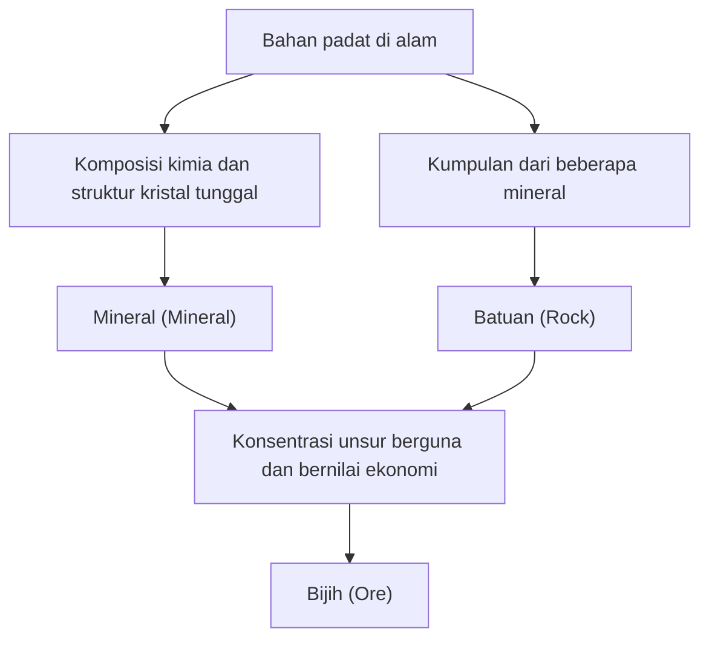

Di bawah pijakan Bumi kita, terbentang sebuah dunia yang sangat beragam dan indah, setara dengan bintang-bintang di alam semesta. "Batu" yang biasa kita lihat dalam kehidupan sehari-hari, sebenarnya adalah kumpulan "mineral" yang tercipta oleh panas dan tekanan di dalam bumi, serta perubahan kimia, melalui proses waktu yang sangat panjang selama ratusan juta tahun. Di antara mineral tersebut, yang memiliki nilai khusus bagi umat manusia disebut sebagai "bijih" (ore). Dalam artikel ini, kita akan mengungkap secara mendalam dunia kristal, dari pembentukan mineral dan bijih dari perspektif geologi, sifat fisik dan kimianya, hingga pentingnya secara ekonomi dan teknologi dalam masyarakat modern.

## 1. Perbedaan Antara Mineral dan Batuan: Belajar Geologi dari Dasar

Sering kali, kita menggunakan kata "batu" (stone) atau "batuan" (rock) secara bergantian dalam keseharian, tetapi dalam geologi, "mineral" (mineral) dan "batuan" (rock) dibedakan dengan sangat tegas.

### Apa itu Mineral (Mineral)
Mineral adalah zat padat anorganik yang terbentuk di alam, memiliki komposisi kimia tertentu dan struktur kristal yang teratur. Sebagai contoh, kuarsa (quartz) direpresentasikan dengan rumus kimia silikon dioksida (SiO2), dan di dalamnya, atom-atom silikon dan oksigen tersusun secara teratur. Susunan teratur ini menciptakan bentuk luar kristal kuarsa yang indah dan khas berbentuk prisma heksagonal. Saat ini, jumlah mineral yang diakui oleh Asosiasi Mineralogi Internasional (IMA) telah melebihi 5.000 jenis, dan mineral-mineral baru terus ditemukan setiap tahunnya.

### Apa itu Batuan (Rock)
Di sisi lain, batuan adalah sekumpulan zat padat yang terbentuk dari satu atau lebih jenis mineral. Sebagai contoh, batuan granit yang dikenal luas, sebagian besar terdiri dari campuran beberapa mineral seperti kuarsa, feldspar, dan biotit (mika hitam). Berdasarkan proses pembentukannya, batuan secara garis besar dibagi menjadi tiga: "batuan beku" yang terbentuk dari pendinginan magma, "batuan sedimen" yang terbentuk dari endapan pasir atau lumpur, dan "batuan metamorf" yang merupakan perubahan batuan yang sudah ada akibat panas atau tekanan.

### Definisi Bijih (Ore)
Lalu, apakah yang dimaksud dengan "bijih"? Bijih bukanlah istilah geologi, melainkan istilah yang digunakan terutama dari sudut pandang ekonomi dan industri. Jika elemen yang bermanfaat (terutama elemen logam) seperti besi, tembaga, dan emas terkosentrasi dalam batuan dengan konsentrasi yang cukup tinggi sehingga menguntungkan secara ekonomi untuk ditambang, batuan atau kumpulan mineral tersebut disebut "bijih". Dengan kata lain, tidak peduli seberapa langka mineral yang terkandung di dalamnya, jika biayanya terlalu tinggi untuk mengekstrak logam tersebut, ia hanya akan dianggap sebagai "batuan" biasa.

## 2. Proses Geologis Pembentukan Kristal

Proses pembentukan mineral merupakan cerminan dari aktivitas dinamis Bumi itu sendiri. Dalam skala ratusan juta tahun, panas di dalam bumi, pergerakan kerak bumi, air, dan atmosfer saling berinteraksi dengan cara yang kompleks, menghasilkan berbagai macam kristal. Proses pembentukan utama dapat diklasifikasikan ke dalam 4 jenis berikut.

### 2.1 Aktivitas Magmatik (Kristalisasi dari Magma)
Mineral terbentuk selama proses pendinginan "magma", cairan bersuhu tinggi yang dihasilkan oleh pencairan mantel dan kerak bumi bagian bawah, yang membeku di permukaan atau jauh di bawah tanah. Seiring dengan turunnya suhu magma, mineral mengkristal secara berurutan, dimulai dari yang memiliki titik leleh tinggi (Seri Reaksi Bowen).
Sebagai contoh, mineral seperti olivin (peridot) dan piroksen mengkristal paling awal pada suhu tinggi, sehingga cenderung tenggelam dan berkumpul di dasar kantong magma, yang dapat membentuk endapan bijih di mana unsur-unsur tertentu terkonsentrasi (endapan magma). Logam seperti platina dan kromium ditambang terutama dari endapan bijih yang terbentuk melalui proses ini.

### 2.2 Aktivitas Hidrotermal (Pembentukan Endapan Hidrotermal)
Saat magma mendingin dan membeku, uap air dan komponen volatil yang terkandung di dalam magma tersisa hingga akhir, lalu masuk ke dalam celah-celah batuan di sekitarnya. Air panas bersuhu tinggi (hidrotermal) ini kaya akan elemen logam terlarut seperti emas, perak, tembaga, seng, dan timbal. Saat fluida hidrotermal naik melalui retakan batuan dan suhu serta tekanannya turun, elemen-elemen logam yang tidak dapat larut lagi akan mengendap satu per satu, membentuk pita-pita kristal yang disebut "urat bijih" (mineral urat).
Tambang Emas Hishikari yang terkenal di Jepang adalah salah satu contoh endapan hidrotermal semacam itu (endapan emas dan perak epithermal). Aktivitas hidrotermal menghasilkan klaster kuarsa yang sangat indah dan mineral logam berwarna cerah, sehingga banyak kristal yang ditambang populer sebagai spesimen mineral.

### 2.3 Sedimentasi dan Pelapukan
Proses pembentukan atau konsentrasi mineral baru juga terjadi ketika batuan di permukaan tergerus oleh hujan dan angin (pelapukan dan erosi), kemudian dibawa oleh sungai menuju laut atau danau.
Sebagai contoh, saat air laut atau air danau menguap karena iklim kering, garam yang terlarut di dalam air mengkristal untuk membentuk "mineral evaporit" seperti halit (garam batu) dan gipsum. Selain itu, mineral yang keras, stabil secara kimia, dan memiliki berat jenis yang tinggi seperti emas, intan, dan platina, cenderung tenggelam dan menumpuk di dasar sungai, membentuk "endapan plaser" (seperti emas plaser). Penambangan emas paling awal oleh manusia dimulai dari endapan plaser ini.

### 2.4 Metamorfisme (Rekristalisasi akibat Panas dan Tekanan)
Batuan yang sudah ada dapat terdorong jauh ke bawah tanah akibat pergerakan kerak bumi dan mendapatkan panas dari magma serta tekanan yang luar biasa, menyebabkan mineral penyusun batuan mengalami reaksi kimia dan berubah menjadi mineral yang sama sekali berbeda.
Dalam proses pemanasan batu gamping menjadi marmer (batu gamping kristalin), atau proses perubahan batu lumpur menjadi genes (gneiss) pada suhu dan tekanan tinggi, mineral permata yang indah seperti garnet dan safir atau rubi dapat terbentuk. Khususnya di sabuk orogenik, di mana benua saling bertabrakan seperti Pegunungan Himalaya, proses metamorfosis yang sangat kuat terjadi dan menghasilkan berbagai macam mineral metamorf.

## 3. Bijih Utama dan Logam Tanah Jarang yang Menggerakkan Dunia

Kehidupan modern kita tidak akan bisa berjalan tanpa logam yang diekstraksi dari bijih. Dari ponsel pintar, kendaraan listrik (EV), hingga bangunan raksasa, berbagai bijih sangat diperlukan. Di sini, kita akan mengulas dari bijih yang memiliki sejarah penting, hingga logam tanah jarang (rare metals) yang mendukung industri teknologi tinggi saat ini.

### Bijih Besi (Iron Ore)
Besi adalah logam yang paling banyak digunakan di bumi. Sebagian besar bijih besi ditambang dari "Formasi Besi Berpita (Banded Iron Formation: BIF)" yang terbentuk di lautan sekitar 2 miliar tahun yang lalu. Pada masa itu, sejumlah besar ion besi yang terlarut di lautan bereaksi dengan oksigen yang dilepaskan oleh cyanobacteria (mikroorganisme yang melakukan fotosintesis), berubah menjadi oksida besi, dan mengendap serta menumpuk di dasar laut. Dengan kata lain, bangunan baja dan infrastruktur yang mendukung peradaban modern adalah berkah dari oksigen yang diciptakan oleh mikroorganisme purba. Mineral bijih utamanya adalah hematit dan magnetit.

### Bijih Tembaga (Copper Ore)
Tembaga adalah salah satu logam pertama yang mulai digunakan secara masif oleh umat manusia, dan karena memiliki konduktivitas listrik yang sangat baik, logam ini digunakan dalam jumlah besar untuk kabel listrik dan papan sirkuit alat elektronik hingga saat ini. Mineral bijih utamanya adalah kalkopirit dan bornit. Sebagian besar penambangan tembaga modern dilakukan pada deposit raksasa yang berasal dari aktivitas magma, yang disebut "Endapan Tembaga Porfiri". Tambang terbuka raksasa di Chile dan Peru, Amerika Selatan sangat terkenal.

### Logam Tanah Jarang (Rare Earth) dan Logam Baterai
Dalam beberapa tahun terakhir, yang paling menarik perhatian adalah logam tanah jarang, serta litium, kobalt, dan nikel yang merupakan "logam baterai".
- **Litium**: Bahan baku utama baterai ion litium. Logam ini sebagian besar diekstraksi dengan cara menguapkan air tanah yang mengandung litium dari danau garam raksasa (seperti Salar de Uyuni) di Pegunungan Andes, Amerika Selatan, serta dimurnikan dari mineral bernama spodumene yang ditambang di tempat-tempat seperti Australia.
- **Kobalt**: Sangat penting untuk meningkatkan stabilitas baterai, namun sebagian besar produksi dunia terkonsentrasi di Republik Demokratik Kongo, di mana risiko geopolitik dan masalah lingkungan kerja telah memicu banyak perdebatan.
- **Neodimium dan lain-lain (Logam Tanah Jarang)**: Diperlukan untuk membuat magnet permanen yang kuat, dan tidak terpisahkan untuk turbin angin dan motor kendaraan listrik. Logam-logam ini terkandung dalam mineral seperti bastnäsite dan monazite, tetapi sangat sulit dipisahkan dari unsur-unsur lain, dan proses pemurniannya memerlukan teknologi kimia tingkat tinggi.

## 4. Struktur Kristal dan Sifat Fisik: Mengapa Batu Permata Berkilau?

Keindahan dan sifat praktis mineral semuanya berasal dari "struktur kristalnya". Bagaimana atom-atom terikat bersama (jenis ikatan kimia) dan bagaimana mereka tersusun (susunan spasial), menentukan tingkat kekerasan, warna, kilau, dan sifat listriknya.

### Kekerasan (Skala Kekerasan Mohs)
"Skala Kekerasan Mohs (1-10)" dikenal sebagai indikator ketahanan mineral terhadap goresan. Intan (berkekerasan 10) yang paling keras, serta talk dan grafit (berkekerasan 1) yang sangat lunak, keduanya hanya terdiri dari elemen "karbon (C)". Meskipun memiliki komposisi yang sama, sifatnya sangat berbeda karena intan membentuk ikatan kovalen berstruktur jaringan tiga dimensi yang kuat antara atom karbon, sedangkan grafit memiliki struktur berlapis, di mana lapisan-lapisannya hanya terikat oleh gaya yang lemah (Gaya Van der Waals).

### Mekanisme Warna dan Pewarnaan
Warna mineral terutama disebabkan oleh sejumlah kecil ketidakmurnian (seperti ion logam transisi) atau cacat pada struktur kristal (pusat warna).
Aluminium oksida murni (korundum) tidak berwarna dan transparan, tetapi ketika tercampur dengan sedikit kromium, ia menjadi "rubi" yang merah tua, dan jika tercampur dengan besi dan titanium, ia menjadi "safir" yang biru. Selain itu, efek warna-warni (kilauan pelangi) yang terlihat pada opal disebabkan oleh "warna struktural", di mana bola silika kecil yang tersusun teratur menyebabkan difraksi dan interferensi cahaya.

### Kilauan Optik (Indeks Bias dan Dispersi)
Batu permata berkilau cemerlang karena cahaya sangat dibelokkan ketika memasuki kristal (indeks bias yang tinggi) dan cahaya terpisah menjadi tujuh warna (tingkat dispersi yang besar). Karena intan memiliki nilai-nilai ini yang sangat tinggi, dengan memotong dan memolesnya pada sudut ideal seperti pada "Brilliant Cut", cahaya yang masuk ke dalam akan dipantulkan seluruhnya di dalam (pemantulan sempurna) dan dipancarkan ke luar, menghasilkan kilauan (fire) yang menyilaukan.

## 5. Sumber Daya Mineral dan Masa Depan Umat Manusia: Tantangan Menuju Keberlanjutan

Sejarah umat manusia juga merupakan sejarah penemuan dan pemanfaatan sumber daya mineral baru. Dari Zaman Batu ke Zaman Perunggu, melalui Zaman Besi, dan zaman modern saat ini dapat disebut sebagai "Zaman Silikon dan Logam Tanah Jarang". Namun, sumber daya mineral di Bumi itu terbatas, dan kita tidak bisa terus-menerus menambangnya tanpa batas.

### Dampak Lingkungan dari Eksploitasi Tambang
Pengembangan tambang membawa risiko besar yang memicu masalah lingkungan serius, seperti penebangan hutan secara luas, konsumsi sumber daya air dalam jumlah besar, dan pencemaran tanah serta kualitas air oleh logam berat. Khususnya dalam beberapa tahun terakhir ini, di mana kadar kualitas bijih (proporsi logam yang dituju di dalam bijih) menurun, untuk mendapatkan jumlah logam yang sama, dibutuhkan lebih banyak batuan yang ditambang dan dihancurkan, sehingga meningkatkan konsumsi energi dan jumlah limbah (terak/slag).

### Tambang Perkotaan (Urban Mining) dan Daur Ulang
Untuk mengatasi hal ini, pentingnya "tambang perkotaan" (urban mine) untuk memulihkan logam dari perangkat elektronik dan mobil bekas semakin meningkat. Dari 1 ton ponsel pintar, kita dapat memulihkan jumlah emas yang jauh lebih besar dibandingkan dari 1 ton bijih emas. Untuk mewujudkan ekonomi sirkular (circular economy), pembentukan teknologi daur ulang yang efisien merupakan kebutuhan yang sangat mendesak.

### Garis Depan (Frontier): Dasar Laut Dalam dan Endapan Bijih Luar Angkasa
Di tengah menipisnya sumber daya darat di Bumi, "dasar laut dalam" dan "luar angkasa" menarik perhatian sebagai garis depan (frontier) baru.
Di dasar laut dalam, nodul mangan (manganese nodules) dan endapan hidrotermal tertidur dalam keadaan belum tersentuh, dan dianggap sebagai harta karun logam tanah jarang. Namun, terdapat kekhawatiran mengenai dampaknya terhadap ekosistem laut dalam, dan pembuatan aturan internasional saat ini sedang berjalan.
Dalam prospek jangka panjang yang lebih luas, "penambangan luar angkasa" (space mining) di asteroid dekat bumi dan di bulan juga mulai menjadi kenyataan. Beberapa perusahaan rintisan bermunculan, dengan tujuan untuk menambang asteroid yang kaya akan logam golongan platina, mengisi suplai sumber daya di luar angkasa, atau membawanya kembali ke Bumi.

## Penutup

Bahkan di dalam sebuah kerikil kecil yang tergeletak di pinggir jalan, terukir sejarah epik selama 4,6 miliar tahun sejak pembentukan Bumi hingga saat ini. Panas dari magma, pergerakan kerak bumi, serta tekanan dan waktu yang tak terbayangkan, telah menyusun atom-atom secara teratur dan mengubahnya menjadi kristal yang indah atau bijih yang berguna.
Geologi dan mineralogi bukan sekadar ilmu untuk mengungkap gambaran masa lalu Bumi, tetapi juga ilmu yang menjadi kunci untuk mendukung teknologi modern dan merancang masyarakat yang berkelanjutan di masa depan. Kelak ketika Anda memegang batu permata yang indah atau ponsel pintar di tangan Anda, cobalah untuk membayangkan sejenak perjalanan seperti apa yang telah ia lalui di kedalaman Bumi hingga akhirnya sampai kepada Anda. Dunia kristal yang diciptakan oleh Bumi ternyata jauh lebih dalam dan penuh daya tarik daripada yang bisa kita bayangkan.
