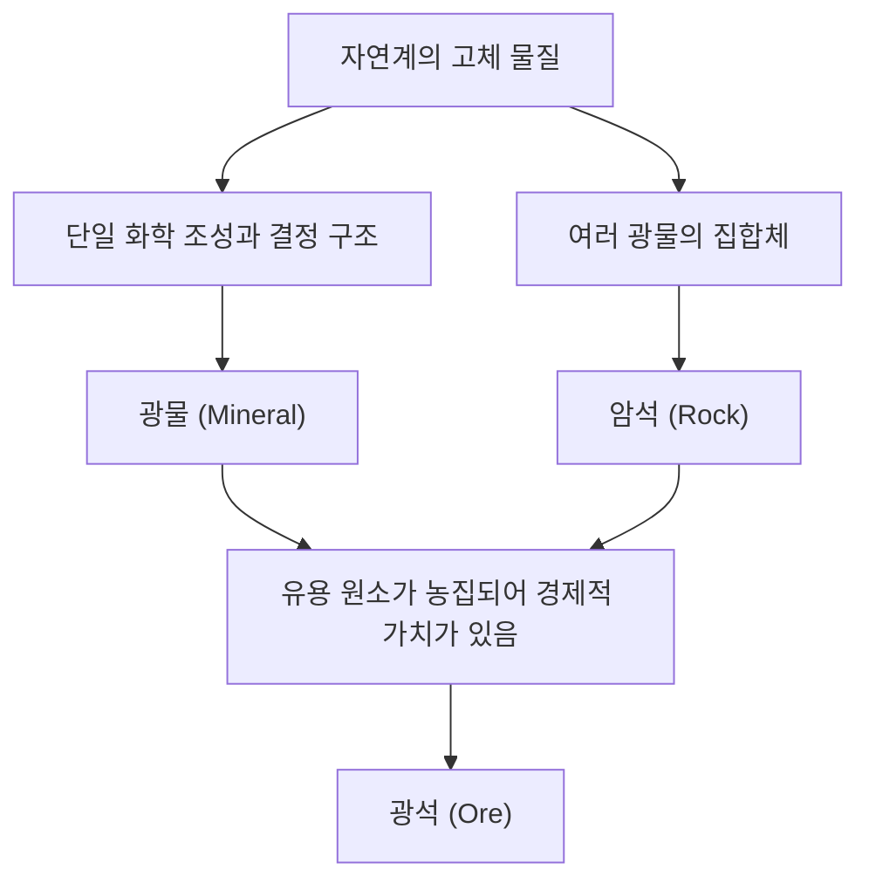

지구의 발밑에는 우주의 별들에도 필적할 만큼 다양하고 아름다운 세계가 펼쳐져 있습니다. 우리가 일상적으로 보는 '돌'은 사실 수억 년이라는 엄청난 시간에 걸쳐 지구 내부의 열과 압력, 화학 변화를 통해 생겨난 '광물(미네랄)'의 집합체입니다. 그리고 그중에서도 인류에게 특별한 가치를 지닌 것이 '광석(오어)'이라고 불립니다. 본 기사에서는 지질학적인 관점에서 광물과 광석의 형성과정, 그 물리적·화학적 특성, 그리고 현대 사회에서의 경제적·기술적인 중요성까지 심오한 결정의 세계를 철저하게 해명해 나갈 것입니다.

## 1. 광물과 암석의 차이: 기초부터 배우는 지질학

대부분의 경우, 우리는 '돌'이나 '바위'라는 단어를 일상적으로 사용하지만, 지질학적으로는 '광물(미네랄)'과 '암석(락)'은 엄격하게 구별됩니다.

### 광물(Mineral)이란 무엇인가
광물이란 자연계에서 무기적으로 생성된 고체이며, 특정 화학 조성과 규칙적인 결정 구조를 가진 물질을 가리킵니다. 예를 들어, 수정(석영, 쿼츠)은 이산화규소(SiO2)라는 화학식으로 표현되며, 그 내부에서는 규소와 산소 원자가 규칙적으로 배열되어 있습니다. 이 규칙적인 배열이 수정 특유의 육각 기둥 모양의 아름다운 결정 외형을 만들어냅니다. 현재 국제광물학연합(IMA)에서 승인한 광물의 수는 5000종류가 넘으며, 매년 새로운 광물이 발견되고 있습니다.

### 암석(Rock)이란 무엇인가
반면에 암석이란 1종류 이상의 광물이 모여 형성된 고체의 집합체입니다. 예를 들어, 화강암(미카게이시)으로 알려진 '화강암(granite)'은 주로 석영, 장석, 흑운모 같은 여러 광물이 섞여 구성되어 있습니다. 암석은 그 생성 원인에 따라 마그마가 식어 굳어져 형성되는 '화성암', 모래나 진흙이 퇴적되어 형성되는 '퇴적암', 기존 암석이 열이나 압력에 의해 변화한 '변성암'의 세 가지로 크게 나뉩니다.

### 광석(Ore)의 정의
그렇다면 '광석'이란 무엇일까요? 광석은 지질학적인 용어가 아니라 주로 경제적·산업적인 관점에서 사용되는 단어입니다. 암석 속에 철이나 구리, 금 등의 유용한 원소(주로 금속 원소)가 경제적으로 채산이 맞을 정도로 높은 농도로 농집되어 있는 경우, 그 암석이나 광물의 집합체를 '광석'이라고 부릅니다. 즉, 아무리 희귀한 광물을 포함하고 있어도 그곳에서 금속을 추출하는 데 비용이 너무 많이 든다면 단순한 '암석'으로 취급됩니다.

## 2. 결정이 생겨나는 지질학적인 과정

광물이 형성되는 과정은 지구의 역동적인 활동 그 자체입니다. 수억 년의 규모로 지구 내부의 열, 지각 변동, 물, 그리고 대기가 복잡하게 얽히면서 다양한 결정을 만들어냅니다. 주요 형성 과정은 다음의 4가지로 분류할 수 있습니다.

### 2.1 화성 작용(마그마로부터의 정출)
지구 깊은 곳에 있는 맨틀이나 하부 지각이 녹아 형성된 고온의 액체 '마그마'가 지표나 지하 깊은 곳에서 식어 굳어지는 과정에서 광물이 형성됩니다. 마그마의 온도가 내려감에 따라 녹는점이 높은 광물부터 차례로 결정화됩니다(보엔의 반응 계열).
예를 들어, 감람석(페리도트)이나 휘석 등은 고온에서 가장 먼저 결정화되기 때문에 마그마 웅덩이 바닥으로 침강하여 모이기 쉬우며, 이로 인해 특정 원소가 농집된 광상이 형성되기도 합니다(마그마 광상). 백금(플래티넘)이나 크롬 등의 금속은 이 과정에서 형성된 광상에서 주로 채굴됩니다.

### 2.2 열수 작용(열수 광상의 형성)
마그마가 식어 굳어질 때, 마그마에 포함되어 있던 수분이나 휘발성 성분이 마지막까지 남아 주변 암석의 틈새로 스며듭니다. 이 고온의 열수에는 금, 은, 구리, 아연, 납 등의 금속 원소가 풍부하게 녹아 있습니다. 열수가 암석의 틈새를 따라 상승하면서 온도나 압력이 떨어지면 더 이상 녹지 못하게 된 금속 원소가 차례로 침전하여 '광맥(맥석)'이라고 불리는 결정의 띠를 형성합니다.
일본의 유명한 히시카리 금광 등도 이러한 열수 광상의 일종(천열수성 금은 광상)입니다. 열수 작용은 매우 아름다운 수정 클러스터나 색채가 선명한 금속 광물을 만들어내기 때문에 광물 표본으로도 인기 있는 결정이 많이 산출됩니다.

### 2.3 퇴적 작용과 풍화
지표의 암석이 비나 바람에 의해 깎이고(풍화·침식) 강을 따라 흘러 바다나 호수로 운반되는 과정에서도 새로운 광물이 형성되거나 농집됩니다.
예를 들어, 해수나 호숫물이 건조한 기후로 인해 증발하면 물에 녹아 있던 염분이 결정화되어 암염(할로암)이나 석고 등의 '증발암 광물'이 형성됩니다. 또한, 금이나 다이아몬드, 백금처럼 단단하고 화학적으로 안정되어 비중이 무거운 광물은 강바닥에 가라앉아 쌓이기 쉽기 때문에 '표사 광상(사금 등)'을 형성합니다. 인류 최초의 금 채굴은 이 표사 광상에서 시작되었습니다.

### 2.4 변성 작용(열과 압력에 의한 재결정)
이미 존재하고 있는 암석이 지각 변동 등에 의해 지하 깊은 곳으로 밀려 들어가 마그마의 열이나 거대한 압력을 받으면, 암석을 구성하고 있던 광물이 화학 반응을 일으켜 전혀 다른 광물로 다시 태어나는 경우가 있습니다.
석회암이 열을 받아 대리석(결정질 석회암)이 되는 과정이나, 이암이 고온 고압에서 편마암으로 변하는 과정에서 가넷(석류석)이나 루비, 사파이어 같은 아름다운 보석 광물이 형성됩니다. 특히 히말라야 산맥처럼 대륙끼리 충돌하고 있는 조산대에서는 매우 강력한 변성 작용이 작용하여 다양한 변성 광물이 만들어지고 있습니다.

## 3. 세계를 움직이는 주요 광석과 희소 금속

현대의 우리 생활은 광석에서 추출된 금속 없이는 성립되지 않습니다. 스마트폰부터 전기 자동차(EV), 거대한 건축물에 이르기까지 다양한 광석이 필수적입니다. 여기에서는 역사적으로 중요한 광석부터 현대의 하이테크 산업을 지탱하는 희소 금속까지 개괄해 보겠습니다.

### 철광석(Iron Ore)
철은 지구상에서 가장 널리 사용되는 금속입니다. 철광석의 대부분은 약 20억 년 전의 바닷속에서 형성된 '호상 철광상(Banded Iron Formation: BIF)'에서 채굴됩니다. 당시 바닷물 속에 녹아 있던 대량의 철 이온이 시아노박테리아(광합성을 하는 미생물)가 방출한 산소와 반응하여 산화철이 되고, 해저에 침전되어 쌓인 것입니다. 즉, 현대 문명을 지탱하는 철강 건물과 인프라는 태고의 미생물이 만들어낸 산소의 혜택이라고 할 수 있습니다. 주요 광석 광물은 적철석(헤마타이트)과 자철석(마그네타이트)입니다.

### 구리 광석(Copper Ore)
구리는 인류가 가장 먼저 본격적으로 이용하기 시작한 금속 중 하나이며, 우수한 전도성을 가지고 있어 현대에도 전선이나 전자 기기의 기판에 대량으로 사용됩니다. 주요 광석 광물은 황동석(찰코파이라이트)이나 반동석입니다. 현대 구리 채굴의 대부분은 '반암 구리 광상'이라고 불리는 마그마 활동에서 유래한 거대한 광상에서 이루어지고 있습니다. 남미의 칠레나 페루에 있는 거대한 노천굴 광산이 유명합니다.

### 희토류(희토류 원소)와 배터리 메탈
최근 가장 주목받고 있는 것이 희토류나 리튬, 코발트, 니켈 등의 '배터리 메탈'입니다.
- **리튬**: 리튬 이온 배터리의 주원료. 주로 남미 안데스 산맥에 있는 거대한 소금 호수(우유니 사막 등)의 지하수에 포함된 리튬을 증발시켜 추출하는 것 외에도, 호주 등에서 채굴되는 스포듀민(리시아 휘석)이라는 광물에서 정제됩니다.
- **코발트**: 배터리의 안정성을 높이는 데 필수적이지만, 세계 생산의 대부분이 콩고 민주 공화국에 집중되어 있어 지정학적 리스크나 노동 환경 문제가 논의되고 있습니다.
- **네오디뮴 등(희토류)**: 강력한 영구 자석을 만드는 데 필요하며, 풍력 발전 터빈이나 EV의 모터에 빠질 수 없습니다. 바스트네사이트나 모나자이트 등의 광물에 포함되어 있지만, 다른 원소와의 분리가 매우 어려워 정제에는 고도의 화학 기술이 필요합니다.

## 4. 결정 구조와 물리적 성질: 보석은 왜 빛나는가?

광물의 아름다움이나 실용적인 성질은 모두 그 '결정 구조'에서 유래합니다. 원자가 어떻게 결합되어 있는지(화학 결합의 종류)와 어떻게 배열되어 있는지(공간 배열)가 경도, 색, 광택, 전기적 성질을 결정짓습니다.

### 경도(모스 경도)
광물이 긁히지 않는 정도를 나타내는 지표로서 '모스 경도(1~10)'가 유명합니다. 가장 단단한 경도 10의 다이아몬드와 매우 부드러운 경도 1의 활석(탈크)이나 흑연(그라파이트)은 모두 '탄소(C)'만으로 구성되어 있습니다. 성분이 같은데도 성질이 전혀 다른 것은 다이아몬드가 탄소 원자끼리 견고한 입체 그물망 모양의 공유 결합을 형성하고 있는 반면, 흑연은 층상 구조를 가지고 있어 층과 층 사이가 약한 힘(반데르발스 힘)으로만 결합되어 있기 때문입니다.

### 색과 발색의 메커니즘
광물의 색은 주로 미량으로 포함된 불순물(전이 금속 이온 등)이나 결정 구조의 결함(컬러 센터)에 의해 발생합니다.
순수한 산화 알루미늄(코런덤)은 무색 투명하지만, 거기에 미량의 크롬이 섞이면 새빨간 '루비'가 되고, 철과 티타늄이 섞이면 파란 '사파이어'가 됩니다. 또한 오팔에서 볼 수 있는 유색 효과(무지갯빛 광택)는 미세한 실리카 구체가 규칙적으로 배열됨으로써 빛이 회절·간섭을 일으키는 '구조색'에 의한 것입니다.

### 광학적인 빛(굴절률과 분산)
보석이 반짝반짝 빛나는 것은 빛이 결정 안으로 들어갔을 때 크게 꺾이는(굴절률이 높은) 것과 빛이 일곱 색깔로 나뉘는(분산도가 큰) 것에 기인합니다. 다이아몬드는 이러한 값들이 매우 높기 때문에 '브릴리언트 컷' 등의 이상적인 각도로 연마함으로써 내부로 들어간 빛을 전반사시켜 밖으로 방출하여 그 눈부신 광채(파이어)를 만들어 낼 수 있는 것입니다.

## 5. 광물 자원과 인류의 미래: 지속 가능성에 대한 도전

인류의 역사는 새로운 광물 자원의 발견과 이용의 역사이기도 합니다. 석기 시대부터 청동기 시대, 철기 시대를 거쳐 현대는 '실리콘(규소)과 희소 금속의 시대'라고 할 수 있을 것입니다. 그러나 지구상의 광물 자원은 유한하며 무궁무진하게 계속 채굴할 수는 없습니다.

### 광산 개발의 환경 부하
광산 개발은 광대한 숲의 벌채, 막대한 수자원 소비, 그리고 중금속에 의한 토양 및 수질 오염이라는 심각한 환경 문제를 일으킬 위험을 수반합니다. 특히 품위(광석 중 목적하는 금속의 비율)가 저하되고 있는 최근에는 같은 양의 금속을 얻기 위해 더 많은 암석을 채굴·파쇄해야 하므로 에너지 소비량과 폐기물(광미·슬래그)의 양이 증가하고 있습니다.

### 어반 마인(도시 광산)과 재활용
이에 대처하기 위해 사용이 끝난 전자 기기나 자동차에서 금속을 회수하는 '도시 광산(어반 마인)'의 중요성이 높아지고 있습니다. 1톤의 스마트폰에서는 1톤의 금광석에서 얻는 것보다 훨씬 많은 금을 회수할 수 있습니다. 순환형 경제(서큘러 이코노미) 실현을 위해 효율적인 재활용 기술의 확립이 시급한 과제가 되고 있습니다.

### 프런티어: 심해저와 우주의 광상
지구상의 육지 자원이 고갈되어 가는 가운데 새로운 프런티어로 주목받고 있는 것이 '심해저'와 '우주'입니다.
심해저에는 망간 단괴(망간 노듈)나 열수 광상이 손대지 않은 상태로 잠들어 있어 희소 금속의 보고로 여겨지고 있습니다. 그러나 심해 생태계에 미치는 영향이 우려되고 있어 국제적인 규칙 마련이 진행되고 있습니다.
더욱 장기적인 시야에서는 지구 근접 소행성이나 달에서의 '우주 채굴(스페이스 마이닝)'도 현실성을 띠고 있습니다. 백금족 원소를 풍부하게 포함한 소행성을 채굴하여 우주 공간에서의 자원 보급이나 지구로의 반입을 노리는 벤처 기업도 등장하고 있습니다.

## 맺음말

길가에 굴러다니는 작은 돌멩이 하나에도 지구 탄생부터 현재에 이르기까지 46억 년의 장대한 역사가 새겨져 있습니다. 마그마의 열, 지각의 변동, 엄청난 압력과 시간이 원자를 규칙적으로 배열하여 아름다운 결정이나 유용한 광석으로 바꾸어 왔습니다.
지질학과 광물학은 단순히 과거 지구의 모습을 밝혀내는 것뿐만 아니라 현대의 테크놀로지를 지탱하고 미래의 지속 가능한 사회를 설계하기 위한 핵심이 되는 학문입니다. 다음에 아름다운 보석이나 스마트폰을 손에 쥐었을 때, 그것이 지구 깊은 곳에서 어떤 여행을 거쳐 당신에게 도달했는지 조금이나마 상상해 보시기 바랍니다. 지구가 만들어낸 결정의 세계는 우리의 상상 이상으로 깊고 또한 매력이 넘칩니다.
