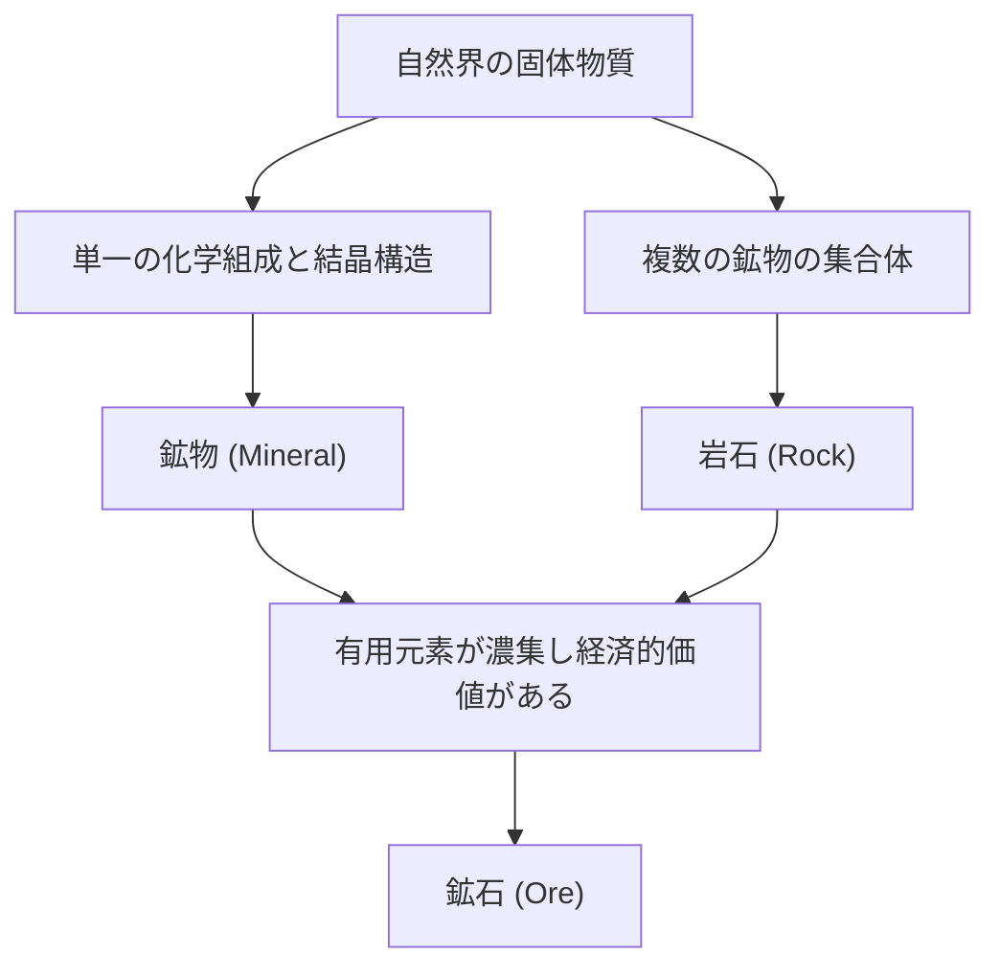

地球の足元には、宇宙の星々にも匹敵するほどの多様で美しい世界が広がっています。私たちが日常的に目にする「石」は、実は何億年という途方もない時間をかけて地球内部の熱や圧力、化学変化によって生み出された「鉱物（ミネラル）」の集合体です。そして、その中でも人類にとって特別な価値を持つものが「鉱石（オーア）」と呼ばれます。本記事では、地質学的な視点から鉱物と鉱石の成り立ち、その物理的・化学的特性、そして現代社会における経済的・技術的な重要性まで、深遠なる結晶の世界を徹底的に解き明かしていきます。

## 1. 鉱物と岩石の違い：基礎から学ぶ地質学

多くの場合、私たちは「石」や「岩」といった言葉を日常的に使いますが、地質学的には「鉱物（ミネラル）」と「岩石（ロック）」は厳密に区別されます。

### 鉱物（Mineral）とは何か
鉱物とは、自然界で無機的に生成された固体であり、特定の化学組成と規則正しい結晶構造を持つ物質を指します。たとえば、水晶（石英、クォーツ）は二酸化ケイ素（SiO2）という化学式で表され、その内部ではケイ素と酸素の原子が規則正しく配列しています。この規則正しい配列が、水晶特有の六角柱状の美しい結晶の外形を作り出しています。現在、国際鉱物学連合（IMA）によって承認されている鉱物の数は5000種類を超えており、毎年新しい鉱物が発見されています。

### 岩石（Rock）とは何か
一方、岩石とは、1種類以上の鉱物が集まってできた固体の集合体です。たとえば、御影石として知られる「花崗岩（かこうがん）」は、主に石英、長石、黒雲母といった複数の鉱物が混ざり合って構成されています。岩石はその成因によって、マグマが冷え固まってできる「火成岩」、砂や泥が堆積してできる「堆積岩」、既存の岩石が熱や圧力で変化した「変成岩」の3つに大別されます。

### 鉱石（Ore）の定義
それでは「鉱石」とは何でしょうか。鉱石は地質学的な用語ではなく、主に経済的・産業的な観点から使われる言葉です。岩石の中に、鉄や銅、金などの有用な元素（主に金属元素）が、経済的に採算が合うほど高い濃度で濃集している場合、その岩石や鉱物の集合体を「鉱石」と呼びます。つまり、どんなに珍しい鉱物を含んでいても、そこから金属を取り出すのにコストがかかりすぎる場合は、単なる「岩石」として扱われます。

## 2. 結晶が生まれる地質学的なプロセス

鉱物が形成されるプロセスは、地球のダイナミックな活動そのものです。何億年ものスケールで、地球内部の熱、地殻変動、水、そして大気が複雑に絡み合いながら、多様な結晶を生み出していきます。主な形成プロセスは以下の4つに分類できます。

### 2.1 火成作用（マグマからの晶出）
地球の深部にあるマントルや地殻下部が溶融してできた高温の液体「マグマ」が、地表や地下深くで冷え固まる過程で鉱物が形成されます。マグマの温度が下がるにつれて、融点の高い鉱物から順に結晶化していきます（ボーエンの反応系列）。
例えば、橄欖石（かんらんせき、ペリドット）や輝石などは高温でいち早く結晶化するため、マグマ溜まりの底に沈降して集まりやすく、これにより特定の元素が濃集した鉱床が形成されることがあります（マグマ鉱床）。白金（プラチナ）やクロムなどの金属は、このプロセスで形成された鉱床から主に採掘されます。

### 2.2 熱水作用（熱水鉱床の形成）
マグマが冷え固まる際、マグマに含まれていた水分や揮発性成分が最後まで残り、周囲の岩石の割れ目に入り込みます。この高温の熱水には、金、銀、銅、亜鉛、鉛などの金属元素が豊富に溶け込んでいます。熱水が岩石の割れ目を上昇しながら温度や圧力が下がると、溶けきれなくなった金属元素が次々と沈殿し、「鉱脈（脈石）」と呼ばれる結晶の帯を形成します。
日本の有名な菱刈金山なども、このような熱水鉱床の一種（浅熱水性金銀鉱床）です。熱水作用は非常に美しい水晶クラスターや、色鮮やかな金属鉱物を生み出すため、鉱物標本としても人気のある結晶が多く産出されます。

### 2.3 堆積作用と風化
地表の岩石が雨や風によって削られ（風化・侵食）、川を流れて海や湖に運ばれる過程でも、新しい鉱物が形成されたり濃集したりします。
例えば、海水や湖水が乾燥気候によって蒸発すると、水に溶けていた塩分が結晶化して岩塩（ハロ岩）や石膏などの「蒸発岩鉱物」が形成されます。また、金やダイヤモンド、プラチナのように硬く、化学的に安定していて比重が重い鉱物は、川底に沈んで溜まりやすいため、「漂砂鉱床（砂金など）」を形成します。人類最古の金採掘は、この漂砂鉱床から始まりました。

### 2.4 変成作用（熱と圧力による再結晶）
すでに存在している岩石が、地殻変動などによって地下深くへ押し込まれ、マグマの熱や巨大な圧力を受けると、岩石を構成していた鉱物が化学反応を起こして全く別の鉱物に生まれ変わることがあります。
石灰岩が熱を受けて大理石（結晶質石灰岩）になる過程や、泥岩が高温高圧で片麻岩に変わる過程で、ガーネット（柘榴石）やルビー、サファイアといった美しい宝石鉱物が形成されます。特にヒマラヤ山脈のような大陸同士が衝突している造山帯では、非常に強力な変成作用が働き、多様な変成鉱物が生み出されています。

## 3. 世界を動かす主要な鉱石とレアメタル

現代の私たちの生活は、鉱石から取り出された金属なしでは成り立ちません。スマートフォンから電気自動車（EV）、巨大な建造物に至るまで、様々な鉱石が不可欠です。ここでは、歴史的に重要な鉱石から、現代のハイテク産業を支えるレアメタルまでを概観します。

### 鉄鉱石（Iron Ore）
鉄は地球上で最も広く使われている金属です。鉄鉱石の大部分は、約20億年前の海の中で形成された「縞状鉄鉱床（Banded Iron Formation: BIF）」から採掘されます。当時、海中に溶けていた大量の鉄イオンが、シアノバクテリア（光合成を行う微生物）が放出した酸素と反応して酸化鉄となり、海底に沈殿して積み重なったものです。つまり、現代の文明を支える鉄鋼ビルディングやインフラは、太古の微生物が作り出した酸素の恩恵と言えます。主な鉱石鉱物は赤鉄鉱（ヘマタイト）と磁鉄鉱（マグネタイト）です。

### 銅鉱石（Copper Ore）
銅は人類が最初に本格的に利用し始めた金属の一つであり、優れた導電性を持つため、現代でも電線や電子機器の基板に大量に使用されます。主な鉱石鉱物は黄銅鉱（チャルコパイライト）や斑銅鉱です。現代の銅採掘の大部分は「斑岩銅鉱床」と呼ばれる、マグマ活動に由来する巨大な鉱床から行われています。南米のチリやペルーにある巨大な露天掘り鉱山が有名です。

### レアアース（希土類元素）とバッテリーメタル
近年、最も注目を集めているのがレアアースやリチウム、コバルト、ニッケルといった「バッテリーメタル」です。
- **リチウム**: リチウムイオン電池の主原料。主に南米のアンデス山脈にある巨大な塩湖（ウユニ塩湖など）の地下水に含まれるリチウムを蒸発させて抽出するほか、オーストラリアなどで採掘されるスポジュメン（リシア輝石）という鉱物から精製されます。
- **コバルト**: バッテリーの安定性を高めるために不可欠ですが、世界の生産の大部分がコンゴ民主共和国に集中しており、地政学的なリスクや労働環境の問題が議論されています。
- **ネオジムなど（レアアース）**: 強力な永久磁石を作るために必要であり、風力発電のタービンやEVのモーターに欠かせません。バストネサイトやモナザイトといった鉱物に含まれていますが、他の元素との分離が非常に難しく、精製には高度な化学技術が必要です。

## 4. 結晶構造と物理的性質：なぜ宝石は輝くのか？

鉱物の美しさや実用的な性質は、すべてその「結晶構造」に由来しています。原子がどのように結びついているか（化学結合の種類）と、どのように並んでいるか（空間配列）が、硬さ、色、輝き、電気的性質を決定づけます。

### 硬度（モース硬度）
鉱物の傷つきにくさを表す指標として「モース硬度（1〜10）」が有名です。最も硬い硬度10のダイヤモンドと、非常に柔らかい硬度1の滑石（タルク）や黒鉛（グラファイト）は、どちらも「炭素（C）」のみから構成されています。成分が同じなのに性質が全く異なるのは、ダイヤモンドが炭素原子同士で強固な立体網目状の共有結合を形成しているのに対し、黒鉛は層状の構造を持ち、層と層の間が弱い力（ファンデルワールス力）でしか結びついていないためです。

### 色と発色のメカニズム
鉱物の色は、主に微量に含まれる不純物（遷移金属イオンなど）や、結晶構造の欠陥（カラーセンター）によって生じます。
純粋な酸化アルミニウム（コランダム）は無色透明ですが、そこに微量のクロムが混ざると真っ赤な「ルビー」になり、鉄とチタンが混ざると青い「サファイア」になります。また、オパールに見られる遊色効果（虹色の輝き）は、微細なシリカの球体が規則正しく並ぶことで光が回折・干渉を起こす「構造色」によるものです。

### 光学的な輝き（屈折率と分散）
宝石がキラキラと輝くのは、光が結晶の中に入ったときに大きく曲がる（屈折率が高い）ことと、光が七色に分かれる（分散度が大きい）ことによります。ダイヤモンドはこれらの値が非常に高いため、「ブリリアントカット」などの理想的な角度で研磨することで、内部に入った光を全反射させて外に放ち、あの眩い輝き（ファイヤ）を生み出すことができるのです。

## 5. 鉱物資源と人類の未来：持続可能性への挑戦

人類の歴史は、新しい鉱物資源の発見と利用の歴史でもあります。石器時代から青銅器時代、鉄器時代を経て、現代は「シリコン（ケイ素）とレアメタルの時代」と言えるでしょう。しかし、地球上の鉱物資源は有限であり、無尽蔵に採掘し続けることはできません。

### 鉱山開発の環境負荷
鉱山の開発は、広大な森林の伐採、大量の水資源の消費、そして重金属による土壌や水質の汚染という深刻な環境問題を引き起こすリスクを伴います。特に、品位（鉱石中の目的とする金属の割合）が低下している近年では、同じ量の金属を得るために、より多くの岩石を採掘・破砕しなければならず、エネルギー消費量と廃棄物（ズリ・スラグ）の量が増大しています。

### アーバンマイン（都市鉱山）とリサイクル
これに対処するため、使用済みの電子機器や自動車から金属を回収する「都市鉱山（アーバンマイン）」の重要性が高まっています。1トンのスマートフォンからは、1トンの金鉱石から得られるよりもはるかに多くの金を回収することができます。循環型経済（サーキュラーエコノミー）の実現に向けて、効率的なリサイクル技術の確立が急務となっています。

### フロンティア：深海底と宇宙の鉱床
地球上の陸地の資源が枯渇する中、新たなフロンティアとして注目されているのが「深海底」と「宇宙」です。
深海底には、マンガン団塊（マンガンノジュール）や熱水鉱床が手付かずの状態で眠っており、レアメタルの宝庫とされています。しかし、深海生態系への影響が懸念されており、国際的なルール作りが進められています。
さらに長期的な視野では、地球近傍小惑星や月での「宇宙採掘（スペースマイン）」も現実味を帯びてきています。白金族元素を豊富に含む小惑星を採掘し、宇宙空間での資源補給や地球への持ち帰りを狙うベンチャー企業も登場しています。

## 結び

道端に転がっている小さな石ころ一つにも、地球誕生から現在に至るまでの46億年の壮大な歴史が刻まれています。マグマの熱、地殻の変動、途方もない圧力と時間が、原子を規則正しく並べ、美しい結晶や有用な鉱石へと変えてきました。
地質学と鉱物学は、単に過去の地球の姿を解き明かすだけでなく、現代のテクノロジーを支え、未来の持続可能な社会を設計するための鍵となる学問です。次に美しい宝石や、スマートフォンを手にしたとき、それが地球の奥深くでどのような旅を経てあなたのもとへ辿り着いたのか、少しだけ想像を巡らせてみてください。地球が創り出した結晶の世界は、私たちの想像以上に深く、そして魅力に溢れています。
