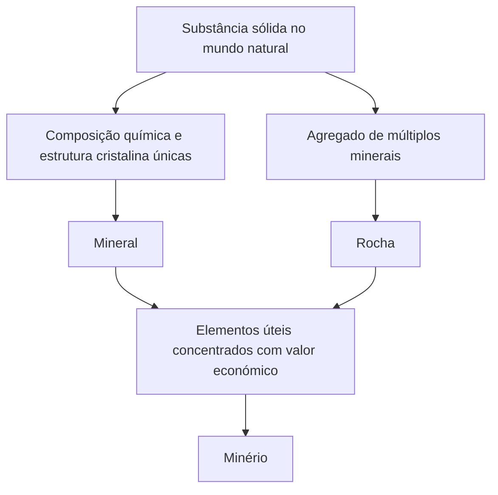

Sob os nossos pés na Terra, estende-se um mundo diversificado e belo, rivalizando com as estrelas do universo. As "pedras" que vemos no dia a dia são, na verdade, agregados de "minerais", criados através do calor, da pressão e de mudanças químicas no interior da Terra ao longo de um período inimaginável de centenas de milhões de anos. E, entre eles, aqueles que têm um valor especial para a humanidade são chamados de "minérios". Neste artigo, desvendaremos minuciosamente o profundo mundo dos cristais a partir de uma perspectiva geológica, desde a formação de minerais e minérios, as suas propriedades físicas e químicas, até a sua importância económica e tecnológica na sociedade moderna.

## 1. A Diferença entre Minerais e Rochas: Geologia a Partir do Básico

Muitas vezes usamos palavras como "pedra" ou "rocha" de forma intercambiável no nosso dia a dia, mas geologicamente, "mineral" e "rocha" são estritamente distinguidos.

### O Que é um Mineral?
Um mineral refere-se a uma substância sólida gerada inorganicamente na natureza, que possui uma composição química específica e uma estrutura cristalina regular. Por exemplo, o quartzo (cristal de rocha) é representado pela fórmula química dióxido de silício (SiO2), e dentro dele os átomos de silício e oxigénio estão arranjados de forma regular. Este arranjo regular cria a bela forma externa de cristal colunar hexagonal característica do quartzo. Atualmente, o número de minerais aprovados pela Associação Mineralógica Internacional (IMA) ultrapassa os 5.000 tipos, e novos minerais são descobertos todos os anos.

### O Que é uma Rocha?
Por outro lado, uma rocha é um agregado sólido composto por um ou mais tipos de minerais. Por exemplo, o "granito", amplamente conhecido, é composto principalmente por uma mistura de vários minerais, como quartzo, feldspato e biotita. Dependendo da sua origem, as rochas são amplamente classificadas em três tipos: "rochas ígneas", formadas pelo arrefecimento e solidificação do magma; "rochas sedimentares", formadas pela acumulação de areia e lama; e "rochas metamórficas", onde rochas existentes foram alteradas pelo calor ou pressão.

### A Definição de Minério (Ore)
Então, o que é um "minério"? Minério não é um termo geológico, mas sim uma palavra usada principalmente do ponto de vista económico e industrial. Quando elementos úteis (principalmente elementos metálicos), como ferro, cobre ou ouro, estão concentrados numa rocha numa concentração suficientemente alta para serem economicamente viáveis, esse agregado de rochas ou minerais é chamado de "minério". Por outras palavras, por mais raro que seja o mineral que contém, se o custo de extração do metal for demasiado elevado, será tratado simplesmente como uma "rocha".

## 2. Processos Geológicos Onde Nascem os Cristais

O processo pelo qual os minerais são formados é a própria atividade dinâmica da Terra. Numa escala de centenas de milhões de anos, o calor no interior da Terra, os movimentos da crosta, a água e a atmosfera entrelaçam-se de forma complexa, produzindo uma vasta gama de cristais. Os principais processos de formação podem ser classificados nos quatro seguintes.

### 2.1 Atividade Ígnea (Cristalização a partir do Magma)
Os minerais formam-se durante o processo em que o "magma", um líquido a alta temperatura gerado pelo derretimento do manto profundo ou da crosta inferior da Terra, arrefece e solidifica na superfície ou nas profundezas do subsolo. À medida que a temperatura do magma diminui, os minerais com pontos de fusão mais altos cristalizam primeiro (série de reações de Bowen).
Por exemplo, a olivina (peridoto) e a piroxena cristalizam-se precocemente a altas temperaturas, por isso tendem a afundar-se e a acumular-se no fundo das câmaras magmáticas, o que pode formar depósitos minerais onde elementos específicos estão concentrados (depósitos magmáticos). Metais como a platina e o crómio são extraídos principalmente de depósitos formados por este processo.

### 2.2 Atividade Hidrotermal (Formação de Depósitos Hidrotermais)
Quando o magma arrefece e solidifica, a água e os componentes voláteis contidos nele permanecem até ao fim e penetram nas fendas das rochas circundantes. Esta água quente (hidrotermal) está rica em elementos metálicos dissolvidos, como ouro, prata, cobre, zinco e chumbo. À medida que o fluido hidrotermal sobe através das fendas rochosas e a temperatura e a pressão diminuem, os elementos metálicos que já não podem permanecer dissolvidos precipitam-se sucessivamente, formando faixas de cristais chamadas "veios (gânga)".
A famosa Mina de Ouro de Hishikari, no Japão, é um tipo desse depósito hidrotermal (depósito epitérmico de ouro e prata). A atividade hidrotermal produz aglomerados de quartzo extremamente belos e minerais metálicos de cores vivas, pelo que muitos dos cristais que são populares como amostras minerais são produzidos aqui.

### 2.3 Sedimentação e Intemperismo
No processo em que as rochas na superfície da terra são desgastadas pela chuva e pelo vento (intemperismo e erosão) e transportadas por rios para mares e lagos, novos minerais também são formados ou concentrados.
Por exemplo, quando a água do mar ou a água de lagos evapora devido a um clima seco, os sais dissolvidos na água cristalizam para formar "minerais evaporíticos", como sal-gema (halita) e gesso. Além disso, minerais duros, quimicamente estáveis e de alta gravidade específica, como ouro, diamantes e platina, tendem a afundar e a acumular-se no leito dos rios, formando "depósitos de plácer (como ouro de aluvião)". A mineração de ouro mais antiga da humanidade começou a partir destes depósitos de plácer.

### 2.4 Metamorfismo (Recristalização por Calor e Pressão)
Quando rochas já existentes são empurradas para o fundo do subsolo pelos movimentos da crosta e expostas ao calor do magma ou a uma pressão imensa, os minerais que constituíam a rocha podem sofrer reações químicas e renascer como minerais completamente diferentes.
Minerais preciosos e belos, como a granada, o rubi e a safira, formam-se durante o processo em que o calcário é sujeito a calor para se tornar mármore (calcário cristalino), ou quando o argilito se transforma em gnaisse sob alta temperatura e pressão. Especialmente em zonas orogénicas onde os continentes colidem, como a cordilheira dos Himalaias, o metamorfismo extremamente forte ocorre, produzindo uma grande variedade de minerais metamórficos.

## 3. Os Principais Minérios e Metais Raros que Movem o Mundo

A nossa vida moderna não poderia existir sem os metais extraídos dos minérios. Desde smartphones a veículos elétricos (VEs) e enormes estruturas, vários minérios são indispensáveis. Aqui, daremos uma visão geral que abrange desde minérios historicamente importantes até aos metais raros que sustentam a indústria de alta tecnologia de hoje.

### Minério de Ferro
O ferro é o metal mais utilizado na Terra. A maior parte do minério de ferro é extraída de "formações ferríferas bandadas (BIF)", que se formaram nos oceanos há cerca de 2 mil milhões de anos. Naquela altura, um grande número de iões de ferro dissolvidos no oceano reagiram com o oxigénio libertado pelas cianobactérias (microrganismos fotossintéticos) para se tornarem óxido de ferro, que se precipitou e se acumulou no fundo do oceano. Em outras palavras, os edifícios e infraestruturas de aço que sustentam a civilização moderna podem ser considerados um benefício do oxigénio criado por microrganismos ancestrais. Os principais minerais de minério são a hematita e a magnetita.

### Minério de Cobre
O cobre foi um dos primeiros metais que a humanidade começou a utilizar a sério e, devido à sua excelente condutividade elétrica, ainda é amplamente utilizado em cabos elétricos e placas de dispositivos eletrónicos. Os principais minerais de minério são a calcopirite e a bornite. A maior parte da mineração de cobre atual provém de enormes depósitos derivados da atividade magmática chamados de "depósitos de cobre pórfiro". São famosas as enormes minas a céu aberto no Chile e no Peru, na América do Sul.

### Terras Raras e Metais de Bateria
Nos últimos anos, as terras raras e os "metais de bateria", como lítio, cobalto e níquel, têm atraído a maior atenção.
- **Lítio**: A principal matéria-prima para baterias de iões de lítio. É extraído principalmente através da evaporação do lítio contido nas águas subterrâneas de enormes lagos salgados (como o Salar de Uyuni) nos Andes sul-americanos, bem como refinado a partir de um mineral chamado espodumena, que é extraído na Austrália e noutros locais.
- **Cobalto**: Essencial para aumentar a estabilidade das baterias, mas a maior parte da produção mundial está concentrada na República Democrática do Congo, e estão a ser discutidos riscos geopolíticos e problemas no ambiente de trabalho.
- **Neodímio e outros (Terras Raras)**: Necessários para fabricar ímanes permanentes poderosos e indispensáveis para turbinas de energia eólica e motores de VEs. Estão contidos em minerais como a bastnaesita e a monazita, mas é extremamente difícil separá-los de outros elementos e o seu refino requer tecnologia química avançada.

## 4. Estrutura Cristalina e Propriedades Físicas: Por que Brilham as Joias?

A beleza e as propriedades práticas dos minerais derivam todas da sua "estrutura cristalina". A forma como os átomos estão ligados (o tipo de ligação química) e como estão organizados (o arranjo espacial) determina a dureza, a cor, o brilho e as propriedades elétricas.

### Dureza (Escala de Mohs)
A "dureza de Mohs (1 a 10)" é famosa como indicador da resistência aos riscos de um mineral. O diamante mais duro, com dureza 10, e o talco ou a grafite muito macios, com dureza 1, são ambos compostos exclusivamente por "carbono (C)". A razão pela qual têm propriedades completamente diferentes, apesar de terem a mesma composição, é que o diamante forma ligações covalentes numa rede tridimensional forte entre os átomos de carbono, enquanto a grafite tem uma estrutura em camadas e as camadas estão ligadas apenas por forças fracas (forças de van der Waals).

### Mecanismos de Cor e Coloração
As cores dos minerais são causadas principalmente por quantidades residuais de impurezas (como iões de metais de transição) ou defeitos na estrutura cristalina (centros de cor).
O óxido de alumínio puro (corindo) é incolor e transparente, mas quando traços de crómio são misturados, torna-se um "rubi" vermelho vivo, e quando ferro e titânio são misturados, torna-se uma "safira" azul. Além disso, o jogo de cores (brilho iridescente) visto na opala é devido à "cor estrutural", onde a luz se difrata e interfere devido ao arranjo regular de microscópicas esferas de sílica.

### Brilho Ótico (Índice de Refração e Dispersão)
A razão pela qual as pedras preciosas brilham intensamente é devido ao facto de que a luz se curva significativamente ao entrar no cristal (alto índice de refração) e a luz se divide em sete cores (alta dispersão). Como o diamante tem valores muito elevados para estes parâmetros, ao lapidá-lo em ângulos ideais, como no corte "brilhante", ele pode refletir totalmente a luz que entra no seu interior e enviá-la para fora, criando aquele brilho deslumbrante (fogo).

## 5. Recursos Minerais e o Futuro da Humanidade: O Desafio da Sustentabilidade

A história da humanidade é também a história da descoberta e do uso de novos recursos minerais. Da Idade da Pedra à Idade do Bronze, e depois à Idade do Ferro, a era atual pode ser chamada de "a Era do Silício e dos Metais Raros". No entanto, os recursos minerais na Terra são finitos e não podem ser extraídos inesgotavelmente.

### O Impacto Ambiental do Desenvolvimento de Minas
O desenvolvimento de minas acarreta o risco de causar graves problemas ambientais, como a desflorestação em grande escala, o consumo maciço de recursos hídricos e a poluição do solo e da água por metais pesados. Especialmente nos últimos anos, onde o teor (a proporção do metal desejado no minério) está a diminuir, é necessário extrair e triturar mais rocha para obter a mesma quantidade de metal, aumentando o consumo de energia e a quantidade de resíduos (estéril e escória).

### Mineração Urbana (Urban Mining) e Reciclagem
Para lidar com isto, a importância da "mineração urbana", que recupera metais de dispositivos eletrónicos e automóveis em fim de vida, está a aumentar. De uma tonelada de smartphones, é possível recuperar muito mais ouro do que de uma tonelada de minério de ouro. A fim de alcançar uma economia circular, o estabelecimento de tecnologias de reciclagem eficientes tornou-se uma questão urgente.

### Novas Fronteiras: Depósitos Minerais no Fundo do Mar e no Espaço
À medida que os recursos terrestres se esgotam, as "profundezas do oceano" e o "espaço" estão a atrair a atenção como novas fronteiras.
No fundo do oceano profundo, nódulos de manganês e depósitos hidrotermais jazem intocados, sendo considerados tesouros de metais raros. No entanto, há preocupações sobre o impacto nos ecossistemas de águas profundas e estão a ser elaboradas regras internacionais.
Além disso, a longo prazo, a "mineração espacial" em asteróides próximos da Terra e na Lua está a tornar-se uma realidade. Têm surgido empresas em fase de arranque que pretendem extrair asteróides ricos em elementos do grupo da platina, visando o reabastecimento de recursos no espaço ou o seu transporte para a Terra.

## Conclusão

Mesmo um pequeno seixo rolado à beira da estrada tem gravada a magnífica história de 4,6 mil milhões de anos, desde a formação da Terra até ao presente. O calor do magma, os movimentos da crosta, a imensa pressão e o tempo arranjaram os átomos regularmente, transformando-os em belos cristais e minérios úteis.
A geologia e a mineralogia não são apenas disciplinas que revelam a forma passada da Terra, mas são disciplinas-chave para sustentar a tecnologia moderna e conceber uma sociedade sustentável para o futuro. Da próxima vez que tiver uma bela joia ou um smartphone nas suas mãos, tente imaginar por breves instantes que tipo de viagem ela fez desde as profundezas da Terra até chegar a si. O mundo dos cristais criado pela Terra é muito mais profundo e fascinante do que imaginamos.
