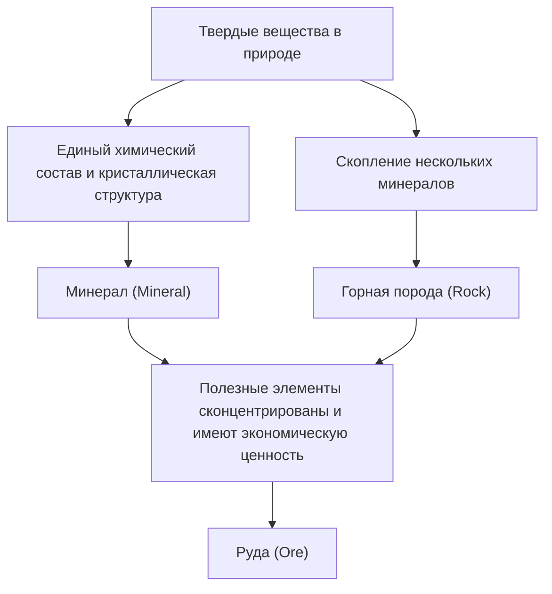

У нас под ногами раскинулся разнообразный и прекрасный мир, не уступающий по масштабам звездам во Вселенной. «Камни», которые мы видим каждый день, на самом деле представляют собой скопления «минералов», образованных благодаря невероятному количеству времени, исчисляемому сотнями миллионов лет, а также внутреннему теплу, давлению и химическим изменениям Земли. Среди них те, которые представляют для человечества особую ценность, называются «рудами». В этой статье мы подробно раскроем глубинный мир кристаллов с геологической точки зрения: от процессов образования минералов и руд, их физических и химических свойств до их экономической и технологической значимости в современном обществе.

## 1. Отличия минералов от горных пород: геология с азов

Во многих случаях мы используем такие слова, как «камень» или «скала», в повседневной жизни, однако в геологии проводится строгое различие между «минералами» (minerals) и «горными породами» (rocks).

### Что такое минерал (Mineral)
Минерал — это неорганическое твердое вещество, образующееся в природе и имеющее определенный химический состав, а также упорядоченную кристаллическую структуру. Например, кварц (quartz) выражается химической формулой диоксида кремния (SiO2), внутри которого атомы кремния и кислорода расположены в строгом порядке. Именно это регулярное расположение создает характерную для кварца красивую внешнюю форму гексагональной призмы. В настоящее время количество минералов, признанных Международной минералогической ассоциацией (IMA), превышает 5000 видов, и каждый год открываются новые минералы.

### Что такое горная порода (Rock)
С другой стороны, горная порода — это твердое скопление, состоящее из одного или нескольких видов минералов. Например, «гранит», часто используемый в качестве строительного камня, в основном состоит из смеси нескольких минералов, таких как кварц, полевой шпат и биотит. В зависимости от своего происхождения горные породы делятся на три основные группы: «магматические породы», образовавшиеся в результате остывания и затвердевания магмы, «осадочные породы», сформировавшиеся путем накопления песка и грязи, и «метаморфические породы», возникшие в результате изменения уже существующих пород под воздействием тепла и давления.

### Определение руды (Ore)
Тогда что же такое «руда»? Руда — это не столько геологический термин, сколько понятие, используемое преимущественно с экономической и промышленной точек зрения. Если в горной породе в достаточно высокой концентрации, делающей добычу экономически выгодной, скапливаются полезные элементы (в основном металлические), такие как железо, медь или золото, то такая порода или скопление минералов называется «рудой». Иными словами, независимо от того, насколько редкие минералы она содержит, если затраты на извлечение металлов из нее слишком высоки, она будет рассматриваться просто как обычная «горная порода».

## 2. Геологические процессы зарождения кристаллов

Процесс образования минералов — это само отражение динамичной активности Земли. В масштабах сотен миллионов лет внутреннее тепло Земли, тектонические движения, вода и атмосфера сложно переплетаются друг с другом, рождая разнообразные кристаллы. Основные процессы формирования можно разделить на четыре категории.

### 2.1 Магматические процессы (кристаллизация из магмы)
Минералы формируются в процессе остывания и затвердевания высокотемпературной жидкости «магмы», образовавшейся в результате плавления мантии в недрах Земли или нижней части земной коры, как на поверхности, так и глубоко под землей. По мере снижения температуры магмы, минералы с высокой температурой плавления начинают кристаллизоваться первыми (реакционная серия Боуэна).
Например, оливин (перидот) и пироксен кристаллизуются при высоких температурах одними из первых, поэтому они легко оседают и скапливаются на дне магматических камер, что иногда приводит к образованию месторождений, богатых определенными элементами (магматические месторождения). Металлы, такие как платина и хром, добываются в основном из месторождений, образованных в ходе этого процесса.

### 2.2 Гидротермальные процессы (образование гидротермальных месторождений)
При остывании и затвердевании магмы оставшиеся до самого конца вода и летучие компоненты проникают в трещины окружающих горных пород. В этой высокотемпературной термальной воде в изобилии растворены металлические элементы, такие как золото, серебро, медь, цинк и свинец. Когда термальная вода поднимается по трещинам в породе, и ее температура и давление падают, металлические элементы, которые больше не могут оставаться растворенными, начинают один за другим выпадать в осадок, образуя полосы кристаллов, называемые «рудными жилами».
Знаменитый золотой рудник Хисикари в Японии является одним из видов таких гидротермальных месторождений (эпитермальное золото-серебряное месторождение). Поскольку в результате гидротермальных процессов возникают очень красивые скопления кристаллов кварца и ярко окрашенные металлические минералы, здесь добывается множество кристаллов, пользующихся популярностью в качестве минералогических образцов.

### 2.3 Осадочные процессы и выветривание
По мере того, как горные породы на поверхности земли разрушаются под воздействием дождей и ветров (выветривание и эрозия) и переносятся реками в моря и озера, также могут образовываться или концентрироваться новые минералы.
Например, когда морская или озерная вода испаряется в условиях засушливого климата, растворенные в воде соли кристаллизуются, образуя «эвапоритовые минералы», такие как каменная соль (галит) и гипс. Кроме того, такие твердые, химически стабильные и тяжелые по удельному весу минералы, как золото, алмазы и платина, имеют тенденцию тонуть и скапливаться на дне рек, образуя «россыпные месторождения» (например, россыпное золото). Древнейшая в истории человечества добыча золота началась именно с таких россыпных месторождений.

### 2.4 Метаморфические процессы (рекристаллизация под воздействием тепла и давления)
Когда уже существующие горные породы вдавливаются глубоко под землю в результате тектонических сдвигов и подвергаются воздействию магматического тепла или огромного давления, минералы, составляющие эти породы, могут вступать в химические реакции и превращаться в совершенно другие минералы.
В процессе, когда известняк нагревается и превращается в мрамор (кристаллический известняк), или когда аргиллит при высокой температуре и высоком давлении превращается в гнейс, формируются такие прекрасные драгоценные минералы, как гранат, рубин и сапфир. В частности, в таких орогенических поясах, как Гималаи, где сталкиваются континенты, действуют чрезвычайно мощные метаморфические процессы, в результате которых образуется множество разнообразных метаморфических минералов.

## 3. Основные руды и редкие металлы, движущие миром

Наша современная жизнь была бы немыслима без металлов, извлекаемых из руд. От смартфонов до электромобилей (EV) и гигантских сооружений — разнообразные руды просто незаменимы. Здесь мы рассмотрим всё: от исторически важных руд до редких металлов, на которых держится современная высокотехнологичная индустрия.

### Железная руда (Iron Ore)
Железо — самый широко используемый металл на Земле. Большая часть железной руды добывается из «железистых кварцитов (Banded Iron Formation: BIF)», образовавшихся в океанах около 2 миллиардов лет назад. В то время огромное количество растворенных в море ионов железа вступало в реакцию с кислородом, выделяемым цианобактериями (фотосинтезирующими микроорганизмами), превращаясь в оксид железа, который затем оседал на морском дне и накапливался слоями. Иными словами, можно сказать, что стальные здания и инфраструктура, поддерживающие современную цивилизацию, являются даром кислорода, произведенного древними микроорганизмами. Основными рудными минералами являются гематит (красный железняк) и магнетит (магнитный железняк).

### Медная руда (Copper Ore)
Медь была одним из первых металлов, который человечество начало использовать в значительных масштабах, и, благодаря своей превосходной электропроводности, она до сих пор в огромных количествах применяется в электрических проводах и печатных платах электронных устройств. Основными рудными минералами являются халькопирит (медный колчедан) и борнит. Бóльшая часть современной добычи меди ведется на гигантских месторождениях, называемых «медно-порфировыми», которые связаны с магматической активностью. Знамениты гигантские открытые карьеры в таких южноамериканских странах, как Чили и Перу.

### Редкоземельные элементы (Rare Earths) и аккумуляторные металлы
В последние годы наибольшее внимание привлекают так называемые «аккумуляторные металлы», такие как редкоземельные элементы, литий, кобальт и никель.
- **Литий**: Основное сырье для литий-ионных аккумуляторов. Добывается главным образом путем выпаривания грунтовых вод, содержащих литий, из гигантских солончаков в Андах в Южной Америке (таких как солончак Уюни), а также очищается из минерала под названием сподумен, добываемого в Австралии и других странах.
- **Кобальт**: Незаменим для повышения стабильности аккумуляторов, однако бóльшая часть мировой добычи сосредоточена в Демократической Республике Конго, в связи с чем ведутся дискуссии о геополитических рисках и проблемах условий труда.
- **Неодим и другие (редкоземельные элементы)**: Необходимы для создания мощных постоянных магнитов и являются критически важными компонентами ветряных турбин и двигателей электромобилей. Они содержатся в таких минералах, как бастнезит и монацит, однако их крайне сложно отделить от других элементов, что требует высокоразвитых химических технологий очистки.

## 4. Кристаллическая структура и физические свойства: почему драгоценные камни сверкают?

Красота и практические свойства минералов всецело обусловлены их «кристаллической структурой». То, как атомы связаны друг с другом (тип химической связи), и то, как они расположены (пространственное расположение), определяет их твердость, цвет, блеск и электрические свойства.

### Твердость (шкала Мооса)
«Шкала Мооса (от 1 до 10)» известна как показатель устойчивости минерала к царапинам. И самый твердый алмаз (твердость 10), и очень мягкие тальк или графит (твердость 1) состоят исключительно из «углерода (C)». Причина, по которой при одинаковом составе их свойства так кардинально отличаются, заключается в том, что в алмазе атомы углерода образуют прочную трехмерную сеть ковалентных связей, в то время как графит имеет слоистую структуру, а его слои связаны между собой лишь слабыми силами (силами Ван-дер-Ваальса).

### Механизмы цвета и окраски
Цвет минералов возникает в первую очередь из-за микроскопических примесей (например, ионов переходных металлов) и дефектов в кристаллической структуре (центров окраски).
Чистый оксид алюминия (корунд) бесцветен и прозрачен, однако если к нему примешивается небольшое количество хрома, он становится ярко-красным «рубином», а если железо и титан — синим «сапфиром». Кроме того, эффект иризации (радужного свечения), наблюдаемый в опалах, обусловлен «структурным цветом», возникающим в результате дифракции и интерференции света благодаря упорядоченному расположению мельчайших сфер кремнезема.

### Оптический блеск (показатель преломления и дисперсия)
Драгоценные камни ярко сверкают потому, что свет, попадая внутрь кристалла, сильно преломляется (высокий показатель преломления), а также распадается на цвета радуги (высокая дисперсия). Поскольку у алмаза эти показатели чрезвычайно высоки, при идеальной огранке, такой как «бриллиантовая», свет, проникающий внутрь, полностью отражается и выходит наружу, создавая то самое ослепительное сияние (игру света).

## 5. Минеральные ресурсы и будущее человечества: вызов устойчивости

История человечества — это в том числе история открытия и использования новых минеральных ресурсов. Пройдя через каменный, бронзовый и железный века, мы живем в эпоху, которую можно назвать «эпохой кремния и редких металлов». Однако минеральные ресурсы на Земле ограничены, и мы не можем продолжать их добычу бесконечно.

### Воздействие разработки рудников на окружающую среду
Разработка рудников сопряжена с рисками возникновения серьезных экологических проблем, таких как вырубка обширных лесов, потребление огромного количества водных ресурсов, а также загрязнение почвы и воды тяжелыми металлами. В частности, в последние годы, в условиях снижения содержания полезного компонента (доли целевого металла в руде), для получения того же количества металла приходится добывать и измельчать все больше горной породы, что ведет к увеличению потребления энергии и объемов отходов (пустой породы и шлака).

### Городские рудники (Urban Mining) и переработка
Для решения этой проблемы возрастает важность «городских рудников», где металлы извлекаются из отслужившей электронной техники и автомобилей. Из одной тонны смартфонов можно извлечь гораздо больше золота, чем из одной тонны золотой руды. На пути к реализации экономики замкнутого цикла (циркулярной экономики) создание эффективных технологий переработки является насущной задачей.

### Новые рубежи: глубоководные океаны и космос
В условиях истощения наземных ресурсов на Земле внимание привлекают новые рубежи — «глубоководное дно океана» и «космос».
На глубоководном дне в нетронутом виде покоятся марганцевые конкреции и гидротермальные месторождения, которые считаются сокровищницами редких металлов. Однако существуют опасения по поводу возможного воздействия на глубоководные экосистемы, в связи с чем ведется разработка международных правил.
Более того, в долгосрочной перспективе все более реальными становятся проекты «космической добычи (space mining)» на околоземных астероидах и Луне. Уже появляются венчурные компании, планирующие добывать полезные ископаемые на астероидах, богатых элементами платиновой группы, чтобы пополнять запасы ресурсов в космосе или доставлять их на Землю.

## Заключение

Даже в одном маленьком камешке, валяющемся на обочине дороги, запечатлена грандиозная история длиной в 4,6 миллиарда лет — от самого зарождения Земли и до наших дней. Магматическое тепло, тектонические сдвиги, колоссальное давление и время упорядочили атомы, превратив их в прекрасные кристаллы и полезные руды.
Геология и минералогия — это науки, которые не только раскрывают облик Земли в прошлом, но и служат ключом к поддержке современных технологий и проектированию устойчивого общества будущего. Когда вы в следующий раз возьмете в руки красивый драгоценный камень или смартфон, попробуйте на мгновение представить, какое путешествие в недрах Земли ему пришлось проделать, прежде чем попасть к вам. Созданный Землей мир кристаллов намного глубже и полнее очарования, чем мы можем себе вообразить.
