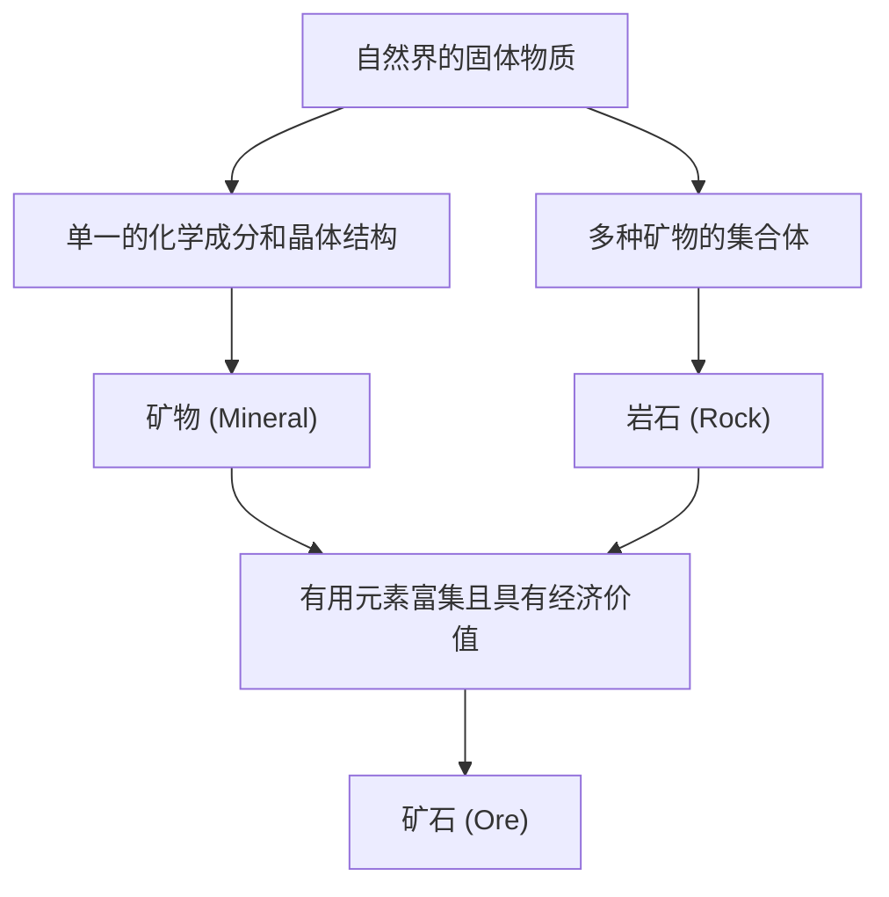

地球的脚下，延伸着一个多样且美丽的世界，其壮丽程度丝毫不逊色于宇宙中的群星。我们日常所见的“石头”，实际上是地球内部的惊人热量、巨大压力以及化学变化，历经数亿年这般漫长得令人难以置信的岁月，所孕育出的“矿物（Mineral）”的集合体。而在这些矿物中，对人类具有特殊价值的便被称为“矿石（Ore）”。本文将从地质学的视角出发，彻底解明矿物与矿石的形成过程、它们的物理和化学特性，以及在现代社会中的经济与技术重要性，带您深入探索深奥的结晶世界。

## 1. 矿物与岩石的区别：从基础学习地质学

在很多情况下，我们在日常生活中会使用“石头”或“岩石”这样的词汇，但在地质学上，“矿物（Mineral）”与“岩石（Rock）”是有着严格区别的。

### 什么是矿物（Mineral）
矿物是指在自然界中通过无机作用生成的固体，是具有特定化学成分和规则晶体结构的物质。例如，水晶（石英，Quartz）的化学式为二氧化硅（SiO2），在其内部，硅原子和氧原子呈规则排列。这种规则的排列方式，造就了水晶特有的六角柱状美丽晶体外形。目前，获得国际矿物学协会（IMA）认可的矿物种类已超过5000种，并且每年都有新的矿物被发现。

### 什么是岩石（Rock）
另一方面，岩石是由一种或多种矿物聚集而成的固体集合体。例如，被称为花岗岩的岩石，主要就是由石英、长石、黑云母等多种矿物混合构成的。根据成因，岩石可分为三大类：岩浆冷却凝固形成的“岩浆岩（火成岩）”，沙子和泥土沉积形成的“沉积岩”，以及原有岩石在高温高压下发生变化形成的“变质岩”。

### 矿石（Ore）的定义
那么，“矿石”又是什么呢？矿石并非一个严格的地质学专业术语，它主要是一个从经济和产业角度使用的词汇。当岩石中含有铁、铜、金等有用元素（主要是金属元素），且其富集浓度高到足以在经济上实现盈利采掘时，这种岩石或矿物集合体就被称为“矿石”。也就是说，无论岩石中含有多么罕见的矿物，如果从中提取金属的成本过高，它也只能被当作普通的“岩石”来对待。

## 2. 结晶诞生的地质学过程

矿物形成的过程，正是地球动态活动本身的体现。在数亿年的时间尺度上，地球内部的热量、地壳变动、水以及大气等因素相互交织，孕育出了多种多样的结晶。主要的形成过程可分为以下四类：

### 2.1 岩浆作用（从岩浆中结晶）
地球深处的地幔或地壳下部熔融形成的高温液体“岩浆”，在地表或地下深处冷却凝固的过程中，就会形成矿物。随着岩浆温度的下降，熔点高的矿物会率先结晶析出（鲍文反应系列）。
例如，橄榄石和辉石等矿物在高温下会较早结晶，因此容易沉降并聚集在岩浆房的底部，有时这会导致特定元素的富集，从而形成矿床（岩浆矿床）。铂金（白金）和铬等金属，主要就是从这一过程形成的矿床中开采出来的。

### 2.2 热液作用（热液矿床的形成）
在岩浆冷却凝固时，岩浆中包含的水分和挥发性成分会保留到最后，并渗入周围岩石的裂缝中。这种高温的热液中富含金、银、铜、锌、铅等金属元素。当热液沿着岩石裂缝上升，温度和压力随之下降时，无法继续溶解的金属元素就会不断沉淀，形成被称为“矿脉”的结晶带。
日本著名的菱刈金矿等，就是此类热液矿床的一种（浅成热液金银矿床）。由于热液作用能孕育出极其美丽的水晶簇以及色彩鲜艳的金属矿物，因此产出了许多作为矿物标本备受青睐的结晶。

### 2.3 沉积作用与风化
地表岩石被风雨侵蚀（风化、侵蚀），顺着河流被搬运到海洋或湖泊的过程中，也会形成新的矿物或发生矿物富集。
例如，海水或湖水因气候干燥而蒸发时，溶解在水中的盐分就会结晶，形成岩盐或石膏等“蒸发岩矿物”。此外，像金、钻石、铂金等硬度高、化学性质稳定且比重较大的矿物，容易沉降并聚集在河底，从而形成“砂矿床（如砂金等）”。人类最古老的黄金开采，正是从这种砂矿床开始的。

### 2.4 变质作用（热量与压力导致的重结晶）
已经存在的岩石，如果因地壳变动等原因被推入地下深处，在受到岩浆热量或巨大压力的作用下，构成岩石的矿物可能会发生化学反应，脱胎换骨变成完全不同的矿物。
在石灰岩受热变成大理石（结晶质石灰岩）的过程，或者泥岩在高温高压下变成片麻岩的过程中，会形成石榴石、红宝石、蓝宝石等美丽的宝石矿物。特别是在像喜马拉雅山脉这样的大陆碰撞造山带，由于受到极强的变质作用，孕育出了多种多样的变质矿物。

## 3. 驱动世界的主要矿石与稀有金属

我们现代人的生活，如果离开了从矿石中提取出来的金属，将无法正常运转。从智能手机到电动汽车（EV），再到巨大的建筑物，各种矿石都不可或缺。在这里，我们将概览从历史上具有重要地位的矿石到支撑现代高科技产业的稀有金属。

### 铁矿石（Iron Ore）
铁是地球上使用最广泛的金属。绝大部分的铁矿石开采自约20亿年前在海洋中形成的“条带状铁矿床（Banded Iron Formation: BIF）”。当时，溶解在海水中的大量铁离子，与蓝细菌（进行光合作用的微生物）释放出的氧气发生反应生成氧化铁，随后沉淀并堆积在海底。也就是说，支撑现代文明的钢铁建筑和基础设施，可以说都要归功于远古微生物所制造的氧气。主要的矿石矿物为赤铁矿和磁铁矿。

### 铜矿石（Copper Ore）
铜是人类最早开始大规模利用的金属之一。由于其具有优良的导电性，在现代社会中仍被大量用于电线和电子设备的电路板中。主要的矿石矿物为黄铜矿和斑铜矿。现代铜矿的开采，绝大部分来自于被称为“斑岩铜矿床”的巨大矿床，这类矿床源于岩浆活动。南美洲智利和秘鲁的巨大露天矿山在世界上非常著名。

### 稀土（稀土元素）与电池金属
近年来，最受瞩目的是稀土以及锂、钴、镍等“电池金属”。
- **锂**: 锂离子电池的主要原料。除了主要通过蒸发南美安第斯山脉的巨大盐湖（如乌尤尼盐湖等）的地下水中所含的锂来提取外，还可以从澳大利亚等地开采的锂辉石矿物中精炼得出。
- **钴**: 对于提高电池的稳定性不可或缺，但全球的生产绝大部分集中在刚果民主共和国，存在地缘政治风险和劳动环境等引发争议的问题。
- **钕等（稀土）**: 这是制造强力永久磁铁所必需的材料，也是风力发电的涡轮机和电动汽车（EV）的电机中不可或缺的成分。它存在于氟碳铈矿和独居石等矿物中，但与其他元素分离非常困难，精炼过程需要高度的化学技术。

## 4. 晶体结构与物理性质：为什么宝石会闪闪发光？

矿物的美丽及其具有实用价值的性质，全都源于其“晶体结构”。原子的结合方式（化学键的种类）以及它们的排列方式（空间排列），决定了矿物的硬度、颜色、光泽以及电学性质。

### 硬度（莫氏硬度）
作为表示矿物抗划伤能力的指标，“莫氏硬度（1〜10）”非常有名。最硬的莫氏硬度10的钻石，和极其柔软的莫氏硬度1的滑石或石墨，都是完全由“碳（C）”构成的。成分相同但性质却截然不同，这是因为钻石中的碳原子之间形成了坚固的立体网状共价键，而石墨则具有层状结构，层与层之间仅靠微弱的力（范德华力）结合。

### 颜色与发色机制
矿物的颜色主要由微量含有的杂质（如过渡金属离子等）或晶体结构的缺陷（色心）引起。
纯净的氧化铝（刚玉）是无色透明的，但如果混入微量的铬，就会变成鲜红的“红宝石”；如果混入铁和钛，就会变成蓝色的“蓝宝石”。此外，在欧泊中看到的游彩效应（彩虹般的光芒），是由于微小的二氧化硅球体呈规则排列，使光发生衍射和干涉而产生的“结构色”。

### 光学光泽（折射率与色散）
宝石之所以闪闪发光，是因为光线进入晶体时发生了大幅度的弯折（折射率高），并且光线被分解成了七种颜色（色散度大）。钻石由于这些数值非常高，因此通过“明亮式切割”等理想角度的打磨，可以使进入其内部的光线发生全反射并散发出来，从而产生那种耀眼的光芒（火彩）。

## 5. 矿物资源与人类的未来：可持续性的挑战

人类的历史，同时也是不断发现和利用新矿物资源的历史。从石器时代、青铜器时代到铁器时代，可以说现代社会已经进入了“硅（Silicon）与稀有金属的时代”。然而，地球上的矿物资源是有限的，不能无休止地开采下去。

### 矿山开发的环境负荷
矿山的开发伴随着砍伐广阔的森林、消耗大量的水资源以及重金属造成土壤和水质污染等严重环境问题的风险。特别是在品位（矿石中目标金属的比例）不断下降的近些年，为了获得同等数量的金属，必须开采并破碎更多的岩石，这就导致了能源消耗量和废弃物（废石、矿渣）数量的增加。

### 城市矿山与回收利用
为了应对这一问题，从废旧电子设备和汽车中回收金属的“城市矿山（Urban Mine）”的重要性日益凸显。从1吨智能手机中，可以回收到比从1吨金矿石中多得多的黄金。为了实现循环型经济（Circular Economy），确立高效的回收技术已成为当务之急。

### 新前沿：深海海底与宇宙的矿床
随着地球陆地资源的不断枯竭，“深海海底”和“宇宙”作为新的前沿领域正备受关注。
深海海底原封不动地沉睡着锰结核和热液矿床，被认为是稀有金属的宝库。然而，这引发了对深海生态系统产生影响的担忧，因此国际上正在推进相关规则的制定。
从更长远的视角来看，在近地小行星或月球上进行“太空采矿（Space Mine）”也越来越具有现实意义。目前已经出现了一些旨在开采富含铂族元素的小行星，以在太空中进行资源补给或将其带回地球的风险投资公司。

## 结语

即使是路边滚落的一块小石头，也铭刻着从地球诞生至今46亿年壮阔的历史。岩浆的热量、地壳的变动、巨大的压力以及漫长的时间，使原子规则地排列，变成了美丽的结晶或有用的矿石。
地质学和矿物学不仅是解明过去地球面貌的学科，更是支撑现代科技、设计未来可持续发展社会的关键学问。下次当您欣赏美丽的宝石，或是拿起智能手机时，请试着稍微想象一下，它们是在地球深处经历了一场怎样的旅行才来到您的身边。地球孕育出的结晶世界，比我们想象的还要深邃，且充满了无穷的魅力。
