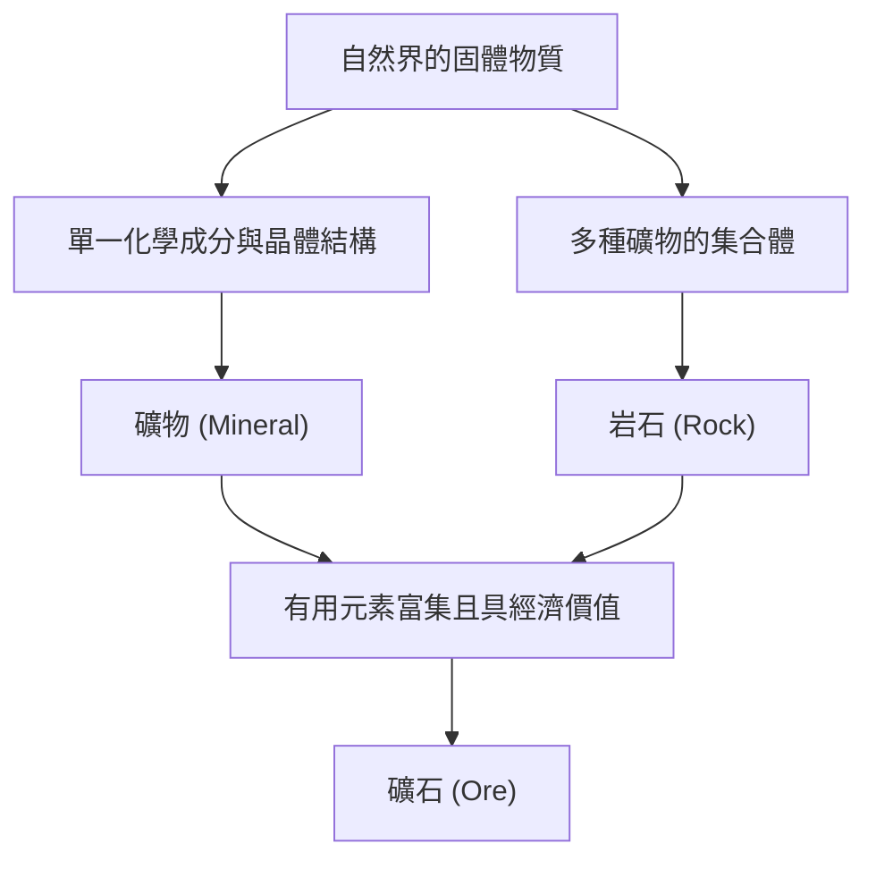

在我們腳下的地球，展現著一個足以媲美宇宙星辰般多樣而美麗的世界。我們日常所見的「石頭」，其實是地球內部歷經數億年漫長歲月中的熱能、壓力以及化學變化所孕育而出的「礦物（Mineral）」集合體。而在這之中，對人類具有特別價值的則被稱為「礦石（Ore）」。本篇文章將從地質學的角度出發，深入探討礦物與礦石的形成過程、其物理與化學特性，以及在現代社會中的經濟與技術重要性，徹底揭開深奧的結晶世界之謎。

## 1. 礦物與岩石的差異：從基礎學習地質學

在多數情況下，我們日常會隨意使用「石頭」或「岩石」等詞彙，但在地質學上，「礦物」與「岩石」是有著嚴格區分的。

### 什麼是礦物（Mineral）
礦物是指在自然界中無機生成的固體，並擁有特定化學成分與規則晶體結構的物質。舉例來說，水晶（石英）可以用二氧化矽（SiO2）這個化學式來表示，其內部矽與氧原子的排列非常規律。這種規律的排列方式，造就了水晶特有的美麗六角柱狀晶體外觀。目前由國際礦物學協會（IMA）所認可的礦物種類已超過5000種，且每年都有新礦物被發現。

### 什麼是岩石（Rock）
另一方面，岩石則是由一種或多種礦物聚集而成的固態集合體。例如，我們熟知為花崗石的「花崗岩」，主要是由石英、長石、黑雲母等多種礦物混合構成的。岩石根據其成因，大致可分為三大類：岩漿冷卻凝固而成的「火成岩」、砂或泥沉積而成的「沉積岩」，以及原有岩石受到高溫高壓影響而改變的「變質岩」。

### 礦石（Ore）的定義
那麼，「礦石」又是什麼呢？礦石並非地質學的專業術語，而主要是一個基於經濟與產業觀點所使用的詞彙。當岩石中含有鐵、銅、金等有用元素（主要為金屬元素），且其濃度高到在經濟上具備開採效益時，該岩石或礦物的集合體就會被稱為「礦石」。也就是說，無論其中含有多麼罕見的礦物，如果從中提取金屬的成本過高，它就只會被視為普通的「岩石」。

## 2. 結晶誕生的地質學過程

礦物形成的過程，正是地球充滿活力的動態活動本身。在數億年的時間尺度上，地球內部的熱能、地殼變動、水以及大氣相互交織，孕育出各式各樣的結晶。主要的形成過程可分為以下四種：

### 2.1 火成作用（從岩漿中結晶）
地球深部地函或下部地殼熔融產生的高溫液體「岩漿」，在流出地表或在地下深處冷卻凝固的過程中會形成礦物。隨著岩漿溫度下降，熔點較高的礦物會優先結晶（鮑氏反應系列）。
例如，橄欖石與輝石等礦物在高溫下會最先結晶，因此容易沉降並聚集在岩漿庫的底部，進而形成特定元素富集的礦床（岩漿礦床）。白金（鉑）與鉻等金屬，主要就是從這種過程中形成的礦床開採出來的。

### 2.2 熱液作用（熱液礦床的形成）
在岩漿冷卻凝固時，原本含在其中的水分與揮發性成分會留到最後，並滲入周圍岩石的裂縫中。這種高溫的熱液富含金、銀、銅、鋅、鉛等溶解的金屬元素。當熱液沿著岩石裂縫上升，溫度與壓力隨之下降時，無法繼續溶解的金屬元素就會陸續沉澱，形成被稱為「礦脈」的結晶帶。
日本著名的菱刈金山，正是這種熱液礦床的一種（淺成熱液金銀礦床）。由於熱液作用能孕育出極為美麗的水晶簇以及色彩鮮豔的金屬礦物，因此許多作為礦物標本而廣受歡迎的結晶都產自這裡。

### 2.3 沉積作用與風化
地表的岩石受到風吹雨打的侵蝕（風化、侵蝕），並隨著河流被搬運至海洋或湖泊的過程中，也會形成或富集新的礦物。
例如，在乾燥氣候下，海水或湖水蒸發時，溶解在水中的鹽分就會結晶，形成岩鹽或石膏等「蒸發岩礦物」。此外，像金、鑽石、白金等硬度高、化學性質穩定且比重較大的礦物，容易沉積在河底，從而形成「砂礦床（如砂金）」。人類最早的黃金開採，就是從這類砂礦床開始的。

### 2.4 變質作用（熱與壓力引發的再結晶）
已經存在的岩石，因地殼變動等因素被推擠至地下深處，在承受岩漿的高溫與巨大壓力後，構成岩石的礦物可能會發生化學反應，轉變為完全不同的新礦物。
在石灰岩受熱變成大理石（結晶石灰岩），或是泥岩在高溫高壓下變成片麻岩的過程中，會形成石榴石、紅寶石、藍寶石等美麗的寶石礦物。特別是在像喜馬拉雅山脈這樣大陸板塊相互碰撞的造山帶中，會產生極為強烈的變質作用，孕育出多樣化的變質礦物。

## 3. 驅動世界的主要礦石與稀有金屬

我們現代的生活若沒有從礦石中提取的金屬，將無法運作。從智慧型手機、電動車（EV）到巨大的建築物，各種礦石都是不可或缺的。在此，我們將概覽從具有歷史重要性的礦石，到支撐現代高科技產業的稀有金屬。

### 鐵礦石（Iron Ore）
鐵是地球上被最廣泛使用的金屬。大部分的鐵礦石開採自約20億年前在海洋中形成的「條狀鐵礦床（Banded Iron Formation: BIF）」。當時溶解在海水中大量的鐵離子，與藍綠菌（行光合作用的微生物）釋放出的氧氣發生反應，形成氧化鐵並沉澱堆積於海底。換言之，支撐現代文明的鋼鐵建築與基礎設施，可說是遠古微生物製造出氧氣所帶來的恩賜。主要的礦石礦物為赤鐵礦與磁鐵礦。

### 銅礦石（Copper Ore）
銅是人類最早開始大規模利用的金屬之一，由於具備優良的導電性，在現代仍被大量應用於電線與電子設備的電路板中。主要的礦石礦物為黃銅礦與斑銅礦。現代的銅礦開採大部分來自被稱為「斑岩銅礦床」的岩漿活動相關巨大礦床。位於南美洲智利與秘魯的巨大露天礦山便非常著名。

### 稀土元素與電池金屬
近年來，最受矚目的莫過於稀土元素以及鋰、鈷、鎳等「電池金屬」。
- **鋰**: 鋰離子電池的主要原料。除了透過蒸發南美洲安地斯山脈巨大鹽湖（如烏尤尼鹽沼等）地下水中的鋰來提取外，也可以從澳洲等地開採的鋰輝石礦物中提煉。
- **鈷**: 對於提升電池穩定性至關重要，但全球產量大部分集中在剛果民主共和國，因此其地緣政治風險與勞動環境問題常受到討論。
- **釹等（稀土元素）**: 製造強力永久磁鐵的必備元素，在風力發電渦輪機與電動車馬達中不可或缺。它們存在於氟碳鈰礦或獨居石等礦物中，但與其他元素分離極為困難，提煉過程需要高度的化學技術。

## 4. 晶體結構與物理性質：為什麼寶石會閃閃發光？

礦物的美麗外觀與實用特性，全源自於其「晶體結構」。原子之間如何結合（化學鍵的種類）以及如何排列（空間配置），決定了它的硬度、顏色、光澤及電學性質。

### 硬度（莫氏硬度）
作為衡量礦物抗刮能力的指標，「莫氏硬度（1至10）」非常著名。最堅硬的硬度10鑽石，以及極為柔軟的硬度1滑石與石墨，兩者都是僅由「碳（C）」構成的。雖然成分相同，性質卻截然不同，原因在於鑽石的碳原子之間形成了堅固的立體網狀共價鍵，而石墨則具有層狀結構，層與層之間僅靠微弱的力量（凡得瓦力）連結。

### 顏色與發色機制
礦物的顏色主要來自於微量含有的雜質（如過渡金屬離子）或晶體結構的缺陷（色心）。
純淨的氧化鋁（剛玉）是無色透明的，但若混入微量的鉻，就會變成鮮紅色的「紅寶石」；若混入鐵與鈦，則會變成藍色的「藍寶石」。此外，在蛋白石中看到的遊彩效應（虹彩光澤），是由於微小的二氧化矽球體規則排列，使光線發生繞射與干涉所產生的「結構色」。

### 光學光澤（折射率與色散）
寶石之所以會閃閃發光，是因為光線進入晶體時會發生大幅度的偏折（高折射率），並且光線會被分解成七種顏色（高色散度）。由於鑽石的這些數值非常高，透過如「明亮式切割」等理想角度的研磨，能讓進入內部的光線產生全反射並向外散射，進而創造出那種耀眼的光彩（火光）。

## 5. 礦產資源與人類的未來：邁向永續性的挑戰

人類的歷史，同時也是發現與利用新礦產資源的歷史。從石器時代、青銅器時代到鐵器時代，現代可說已進入了「矽與稀有金屬的時代」。然而，地球上的礦產資源是有限的，無法無止盡地開採下去。

### 礦山開發的環境負擔
礦山的開發伴隨著砍伐廣大森林、消耗大量水資源，以及重金屬污染土壤與水質等嚴重的環境風險。特別是在近年來礦石品位（礦石中目標金屬的比例）下降的情況下，為了獲取相同數量的金屬，必須開採與破碎更多的岩石，導致能源消耗量與廢棄物（礦渣）數量大增。

### 城市礦山與回收利用
為了解決這個問題，從廢棄電子設備與汽車中回收金屬的「城市礦山」重要性日益提升。從1噸的智慧型手機中能回收到的黃金，遠比從1噸的金礦石中提取的還要多出許多。為了實現循環經濟，確立高效的回收技術已成為當務之急。

### 新邊疆：深海底與太空礦床
在地球陸地資源逐漸枯竭之際，「深海底」與「太空」成為備受矚目的新邊疆。
在深海底，沉睡著未經開發的錳結核與熱液礦床，被視為稀有金屬的寶庫。然而，由於擔憂會對深海生態系造成影響，國際社會正在制定相關規範。
從更長遠的視野來看，在近地小行星或月球上進行「太空採礦（Space Mining）」也逐漸具備現實可行性。目前已出現一些新創企業，目標是開採富含鉑族元素的小行星，並企圖在太空中進行資源補給或將資源帶回地球。

## 結語

即使是路邊滾動的一塊小石頭，也刻劃著從地球誕生至今46億年的壯闊歷史。岩漿的熱能、地殼的變動、以及難以想像的壓力與時間，讓原子規律排列，最終轉變為美麗的結晶與有用的礦石。
地質學與礦物學不僅是解開地球過去樣貌的學問，更是支撐現代科技、設計未來永續社會的關鍵。下次當你手中握著美麗的寶石或智慧型手機時，不妨稍微想像一下，它在地球深處經歷了怎樣的旅程才來到你的身邊。地球所孕育出的結晶世界，遠比我們想像的還要深邃，且充滿無限魅力。
