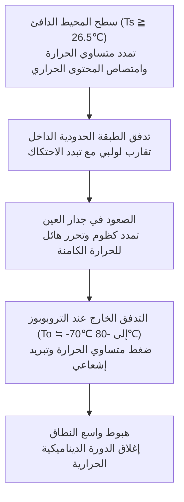
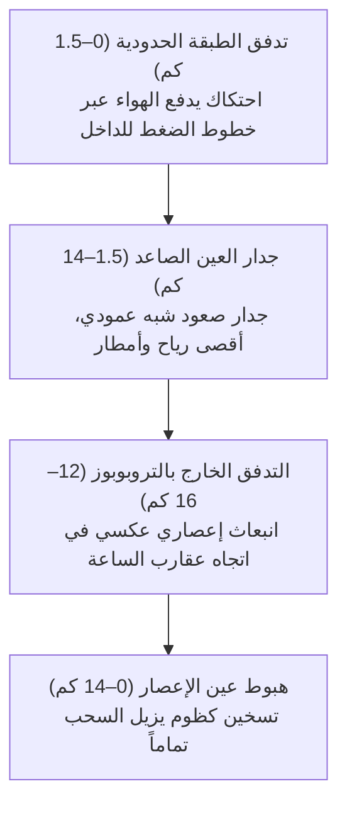
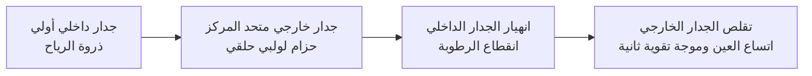
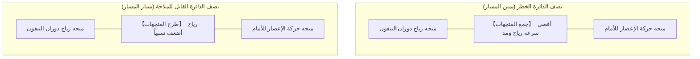
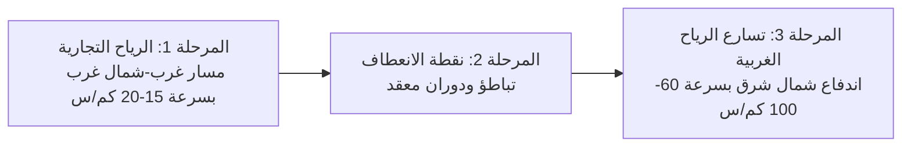
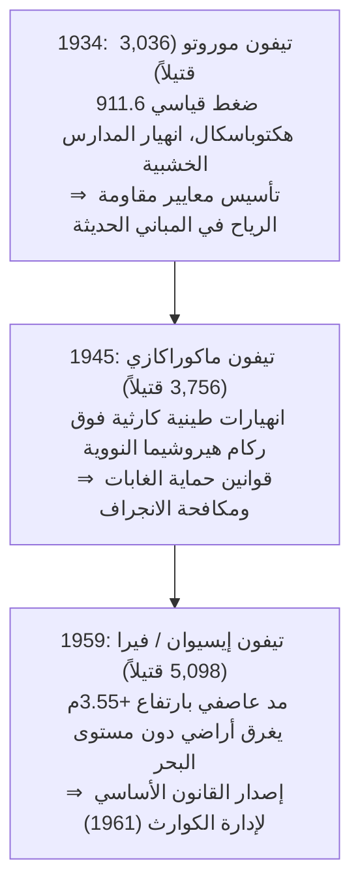
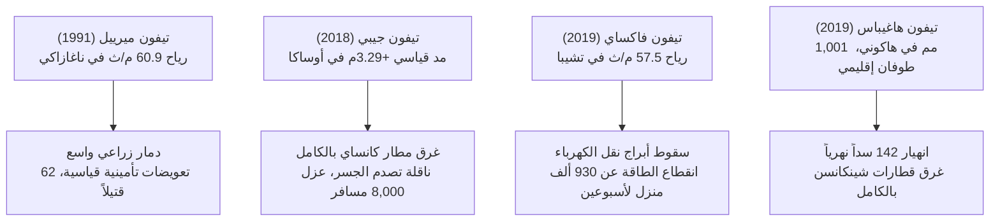
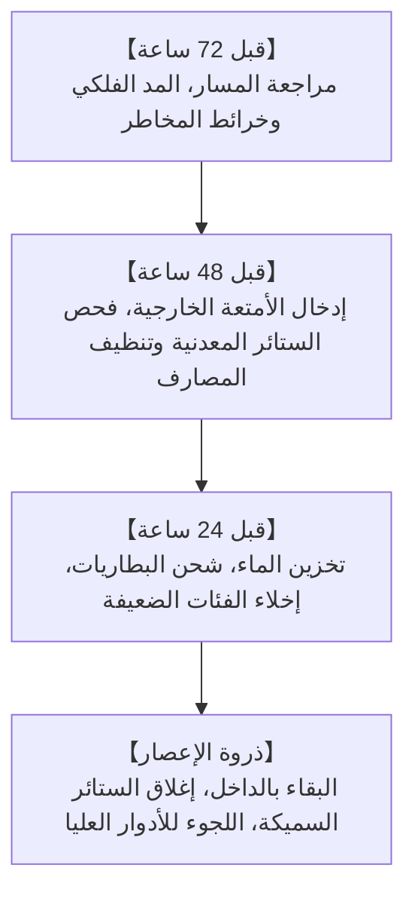
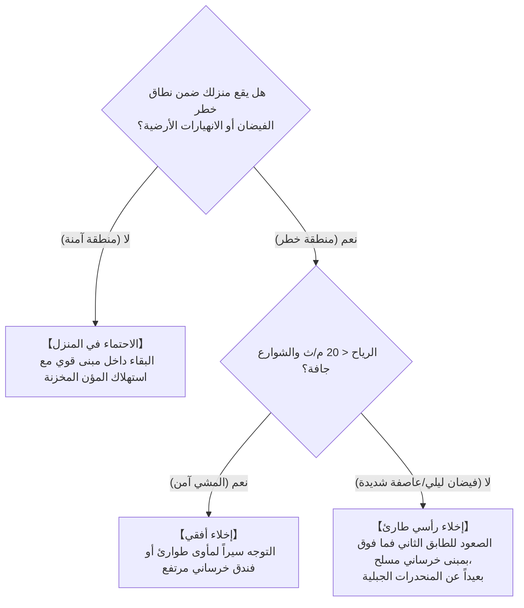

## مقدمة: مواجهة المحركات الحرارية الجبارة للمحيط والغلاف الجوي

فوق مياه المحيطات الاستوائية الشاسعة التي تصهرها أشعة الشمس الحارقة، تتصاعد أعمدة غير مرئية من بخار الماء. وتحت تأثير قوة كوريوليس الناتجة عن دوران الأرض، تبدأ هذه الكتل الركامية بالدوران، لتنتظم ذاتياً في نظام دوران جوي عملاق يمتد من مئات إلى أكثر من ألف كيلومتر: إنه **التيفون (الإعصار المداري: Tropical Cyclone)**.

تمثل أعاصير التيفون صمامات أمان ديناميكية حرارية حيوية لكوكب الأرض، حيث تنقل الفائض الحراري الشمسي من المناطق الاستوائية نحو القطبين. ولكن عندما تقتحم المناطق المأهولة، فإن ثالوثها المدمر — الرياح العاتية، والمد العاصفي الهائل، والأمطار الغزيرة — يمكن أن يسحق البنية التحتية الحديثة في غضون ساعات معدودة.

يقع الأرخبيل الياباني تحت المسار المباشر لالتفاف أعاصير شمال غرب المحيط الهادئ نحو الرياح الغربية. وقد أدت ثلاث كوارث كبرى في عصر شووا — تيفون موروتو (1934)، وتيفون ماكوراكازي (1945)، وتيفون خليج إيسيوان (فيرا، 1959) — إلى مقتل آلاف المواطنين، مما دفع إلى صياغة القانون الأساسي لإدارة الكوارث ومعايير هندسة الأنهار الحديثة. وفي القرن الحادي والعشرين، أدى التغير المناخي إلى ظواهر غير مسبوقة: غرق مطار كانساي الدولي بالكامل (تيفون جيبي، 2018)، وانقطاع الكهرباء عن طوكيو لأسبوعين (تيفون فاكساي، 2019)، وانهيار 142 سداً نهرياً (تيفون هاغيباس، 2019). يقدم هذا الدليل إطاراً علمياً وتطبيقياً لحماية الأرواح في مواجهة هذه التهديدات المناخية المتصاعدة.

---

## 1. الديناميكا الحرارية ونشأة الأعاصير: التيفون كمحرك كارنو الحراري

### 1.1 التصنيف الدولي ومعايير سرعة الرياح
في الأرصاد الجوية الديناميكية، تسمى المنخفضات الدوارة ذات القلب الدافئ المتغذية من المحيط بـ **الأعاصير المدارية**:

| التصنيف | الحوض المحيطي | معيار قياس سرعة الرياح المستمرة | عتبة التحديد |
| :--- | :--- | :--- | :--- |
| **تيفون (وكالة الأرصاد اليابانية JMA)** | شمال غرب المحيط الهادئ وبحر الصين الجنوبي | **متوسط 10 دقائق** | $\ge 34\,\text{عقدة}$ ($\approx 17.2\,\text{م/ث}$) |
| **تيفون (مركز التحذير الأمريكي JTWC)** | شمال غرب المحيط الهادئ | **متوسط دقيقة واحدة** | $\ge 64\,\text{عقدة}$ ($\approx 33\,\text{م/ث}$، فئة 1) |
| **إعصار هوريكان (NHC)** | شمال الأطلسي، الكاريبي، شمال شرق الهادئ | **متوسط دقيقة واحدة** | $\ge 64\,\text{عقدة}$ ($\approx 33\,\text{م/ث}$) |
| **عاصفة إعصارية شديدة** | المحيط الهندي، جنوب غرب الهادئ | متوسط 3 أو 10 دقائق | $\ge 34$ أو $\ge 64\,\text{عقدة}$ |

تصنيف وكالة الأرصاد اليابانية حسب الشدة:
- **تيفون قوي**: $33\,\text{م/ث} \sim 44\,\text{م/ث}$ (64–84 عقدة)
- **تيفون قوي جداً**: $44\,\text{م/ث} \sim 54\,\text{م/ث}$ (85–104 عقدة)
- **تيفون عنيف**: $\ge 54\,\text{م/ث}$ ($\ge 105\,\text{عقدة}$)

---

### 1.2 نموذج دورة كارنو ونظرية الكثافة القصوى المحتملة (MPI)
صاغ البروفيسور كيري إيمانويل (Kerry Emanuel) من معهد MIT التيفون كـ **محرك كارنو حراري (Carnot Heat Engine)**:

الكفاءة الديناميكية الحرارية $\epsilon$:

$$\epsilon = \frac{T_s - T_o}{T_s}$$

في المياه الاستوائية ($T_s \approx 300\,\text{K}$ أو $27^\circ\text{C}$ و $T_o \approx 200\,\text{K}$ أو $-73^\circ\text{C}$)، تصل الكفاءة إلى حوالي $33\%$. وتحدد معادلة أقصى شدة محتملة (MPI) سرعة الرياح القصوى $V_{\max}$:

$$V_{\max}^2 \approx \frac{C_k}{C_D} \frac{T_s - T_o}{T_o} \left( k_s^* - k \right)$$

إن ارتفاع درجة حرارة سطح البحر بمقدار $1^\circ\text{C}$ فقط يضاعف عدم التوازن الحراري $(k_s^* - k)$ بشكل هائل، مما يرفع طاقة التدمير القصوى للأعاصير.

---

### 1.3 الشروط الفيزيائية الضرورية للتشكل
1. **حرارة سطح البحر (SST) $\ge 26.5^\circ\text{C}$**: لتغذية محرك التبخر الكثيف بالحرارة الكامنة.
2. **المحتوى الحراري للمحيط (TCHP)**: طبقة مياه دافئة بعمق 50 إلى 100 متر لمنع التيارات الصاعدة الباردة من إخماد الإعصار.
3. **معامل كوريوليس ($f = 2\Omega\sin\phi$) عند خطوط عرض $>5^\circ$**: ضروري لمنح الهواء حركة دورانية.
4. **قص رياح رأسي ضعيف (VWS $< 10\,\text{م/ث}$)**: القص القوي يمزق عمود الدوامة الدافئ.
5. **نظريتا CISK و WISHE**: التفاعل بين الاحتكاك السطحي وتحرر الحرارة الكامنة، والتبخر المتسارع بتأثير سرعة الرياح ($F_k \propto v$) يتيحان التكثف الانفجاري السريع.

---

## 2. البنية ثلاثية الأبعاد والتوازن الهيدروديناميكي

### 2.1 بنية الدوران ثلاثي الأبعاد

- **حفظ الزخم الزاوي**: $M = vr + \frac{1}{2}fr^2 = \text{const}$. مع تقلص نصف القطر ($r \to 0$)، يتسارع الطرد المركزي بمعدل $r^{-3}$، مانعاً الهواء من بلوغ المركز، ومشكلاً جدار العين. وفي الداخل، يهبط الهواء الجاف ويسخن أدياباتياً ($9.8^\circ\text{C/km}$)، مما يبخر السحب تماماً في **عين الإعصار (Eye)**.
- **دورة استبدال جدار العين (ERC)**: في الأعاصير الفائقة، يقطع جدار خارجي الإمداد الرطب عن الجدار الداخلي الذي ينهار، ليتسع مجال الرياح بعد تقلص الجدار الجديد.

- **نصف الدائرة الخطر (Dangerous Semicircle)**: في النصف الشمالي للكرة الأرضية، إلى اليمين من مسار التيفون، تتحد سرعة الانتقال مع سرعة دوران الرياح ($v_{\text{net}} = v_{\text{rot}} + v_{\text{trans}}$)، مما يولد أعلى مستويات الرياح والمد العاصفي.

---

## 3. حركية المسارات والتحول غير المداري (ET)

### 3.1 تيارات التوجيه والانعطاف
تتحرك الأعاصير وفق تيارات التوجيه الكبرى في التروبوسفير.

### 3.2 انحراف بيتا وتأثير فوجيوارا
يتحرك الإعصار تلقائياً نحو **الشمال الغربي** بتأثير تدرج كوريوليس ($\beta = df/dy$). وعند اقتراب إعصارين لمسافة أقل من 1,500 كم، يدوران حول مركز مشترك وفق **تأثير فوجيوارا**.

### 3.3 التحول غير المداري (ET)
يتحول الإعصار من محرك حرارة كامنة إلى منخفض جبهي يعتمد على التدرجات الحرارية، مما يوسع نطاق الرياح العاتية إلى **مئات الكيلومترات**.

---

## 4. الكوارث الكبرى التاريخية لعصر شووا

- **موروتو (1934)**: $911.6\,\text{hPa}$ (أدنى ضغط جوي مسجل على اليابسة في اليابان)؛ رياح تجاوزت $60\,\text{م/ث}$ دمرت 260 مدرسة خشبية في أوساكا وأودت بحياة 600 تلميذ (3,036 قتيلاً إجمالاً).
- **ماكوراكازي (1945)**: ضرب هيروشيما بعد شهر من القنبلة الذرية؛ جرفت الانهيارات الطينية المستشفيات وأودت بحياة 3,756 شخصاً.
- **إيسيوان / فيرا (1959)**: مد عاصفي غير مسبوق ($+3.55\,\text{م}$ في ناغويا)؛ حطمت جذوع الأشجار العائمة السدود البحرية، مما أسفر عن 5,098 قتيلاً ومفقوداً، وأسس القانون الأساسي للوقاية من الكوارث لعام 1961.

---

## 5. الفيضانات التاريخية والكوارث البحرية

- **كاثلين (1947)**: انهيار سدود نهر توني وغرق طوكيو (1,930 قتيلاً) وبداية مشروعات السدود العملاقة.
- **تويا مارو (1954)**: غرق 5 عبارات قطارات في مضيق تسوغارو ($57\,\text{م/ث}$، 1,430 قتيلاً) وبناء نفق سيكان البحري.
- **كانوغاوا (1958)**: أمطار بلغت $750\,\text{مم}$ في إيزو وسيول طينية جارفة أغرقت 300 ألف منزل بطوكيو.

---

## 6. الأعاصير الفائقة المعاصرة في عصر تغير المناخ

- **ميرييل (1991)**: رياح بلغت $60.9\,\text{م/ث}$ في ناغازاكي دمرت بساتين التفاح والمعابد، وسجلت تعويضات تأمينية قياسية.
- **جيبي (2018)**: مد بارتفاع $+3.29\,\text{م}$ غمر مطار كانساي بالكامل، وصدمت ناقلة نفط الجسر الرابط مما عزل 8,000 مسافر.
- **فاكساي (2019)**: رياح بسرعة $57.5\,\text{م/ث}$ أسقطت أبراج الضغط العالي في تشيبا (انقطاع الكهرباء عن 930 ألف منزل لأسبوعين).
- **هاغيباس (2019)**: أمطار بلغت $1,001\,\text{مم}$ في هاكوني تسببت في انهيار 142 سداً نهرياً وغرق قطارات شينكانسن.

---

## 7. أرقام قياسية عالمية وتوقعات IPCC

- **تيب (1979)**: أدنى ضغط جوي مسجل عالمياً (**$870\,\text{hPa}$**) وقطر 2,220 كم.
- **هاييان / يولندا (2013)**: رياح بلغت **$378\,\text{كم/ساعة}$** وموجة مد تسونامي أودت بحياة 7,300 شخص في الفلبين.
- **كاترينا (2005) وساندي (2012)**: غرق نيو أورلينز وأنفاق مترو نيويورك.
- **تقرير IPCC AR6**: زيادة نسبة الأعاصير من الفئتين 4 و5، وزيادة كثافة الأمطار بنسبة 7% لكل $1^\circ\text{C}$ احترار.

---

## 8. فيزياء الأضرار والمد العاصفي والفيضانات المركبة

### 8.1 قانون مربع السرعة لضغط الرياح
يتناسب الضغط الديناميكي للرياح مع مربع السرعة:

$$P = \frac{1}{2} \rho v^2 C_f$$

مضاعفة سرعة الرياح تضاعف الحمل الإنشائي 4 مرات، ومضاعفتها 3 مرات تزيده 9 مرات.

### 8.2 هيدروديناميكا المد العاصفي
$$\Delta h = \Delta h_p + \Delta h_w$$
بتأثير البارومتر العكسي ($\Delta h_p \approx 1\,\text{سم/هكتوباسكال}$) وتراكم الرياح ($\frac{\partial h_w}{\partial x} \approx \frac{\rho_a C_D v^2}{\rho_w g H}$) العكسي مع عمق المياه $H$.

### 8.3 الفيضانات المركبة
فيضان الأنهار وانهيار سدودها، فيضان مياه الأمطار بالمدن لإغلاق بوابات الصرف، وارتداد المياه في الروافد النهرية (Backwater).

---

## 9. أنظمة الإنذار المبكر واستراتيجية النجاة

### 9.1 مصفوفة ألوان تحذير كيكيكورو (Kikikuru)
| المستوى | اللون | التحذير القانوني | الإجراء المدني الإلزامي |
| :--- | :--- | :--- | :--- |
| **شديد الخطورة** | **أرجواني داكن** | **المستوى 4: أمر إخلاء** | **يجب أن يكون الإخلاء مكتملاً** |
| **خطير جداً** | **أرجواني فاتح** | **المستوى 4: أمر إخلاء** | إخلاء فوري لكافة السكان |
| **تحذير** | **أحمر** | **المستوى 3: إخلاء الفئات الضعيفة** | إخلاء كبار السن والأطفال فوراً |
| **تنبيه** | **أصفر** | **المستوى 2: تنبيه أمطار/فيضان** | مراجعة الطرق وحقيبة الطوارئ |
| **وقوع الكارثة** | **أسود** | **المستوى 5: ضمان الأمان الطارئ** | **خطر داهم: إخلاء رأسي فوري** |

---

### 9.2 جدول زمني قبل 72 ساعة من وصول الإعصار

### 9.3 الحماية المنزلية الذاتية
- **أسطورة شريط التثبيت على النوافذ**: وضع الأشرطة اللاصقة بشكل متقاطع لا يحمي الزجاج من الكسر؛ الحماية الفعلية تتطلب إغلاق الستائر المعدنية الخارجية، وتركيب أفلام الحماية، و**إغلاق ستائر التعتيم السميكة وتثبيتها بالمشابك**.
- **منع ارتداد مياه الصرف الصحي**: وضع أكياس نفايات مزدوجة مملوءة بالماء فوق المراحيض والمصارف الأرضية في الطابق الأول لمنع طفح المجاري.
- **مؤن الصمود لمدة 14 يوماً**: 3 لترات ماء/شخص/يوم، مواقد غاز محمولة مع 28–42 أسطوانة غاز، محطة طاقة محمولة (1,000–2,000 واط/ساعة)، و70 كيساً كيميائياً للمراحيض الجافة لكل فرد.

### 9.4 مصفوفة اتخاذ قرار الإخلاء: أفقي أم رأسي؟

---

## خاتمة: درع العلم وحصن الخيال

في مواجهة الطاقة الحرارية الهائلة للأعاصير، يرتكز الإنسان على ركيزتين: **درع العلم** — فهم القوانين الفيزيائية ومتابعة الرادارات الجوية — و**حصن الخيال** — تجاوز الانحياز للاطمئنان الزائف واستشراف أسوأ السيناريوهات للتحرك الاستباقي وحماية الأرواح.
