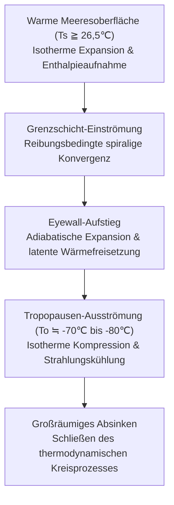
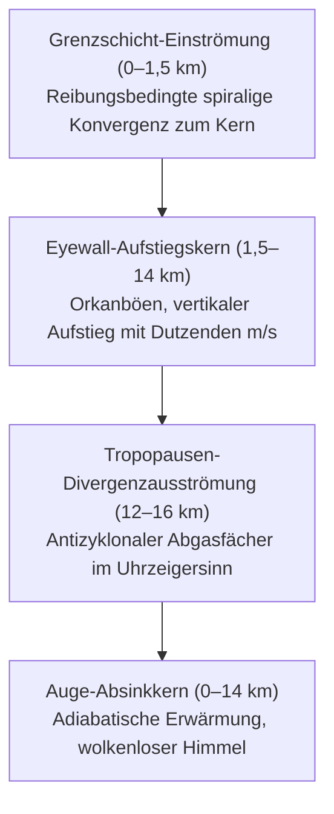
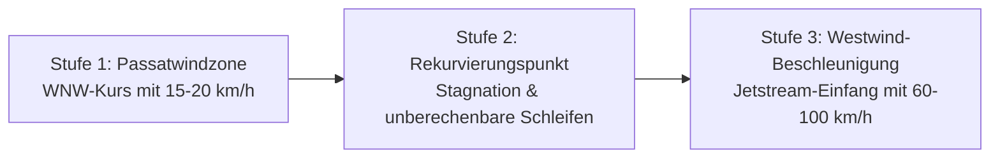
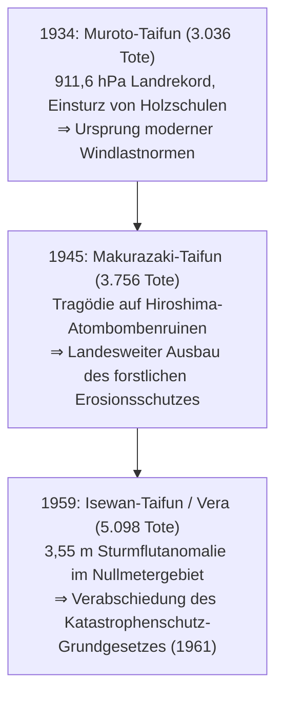
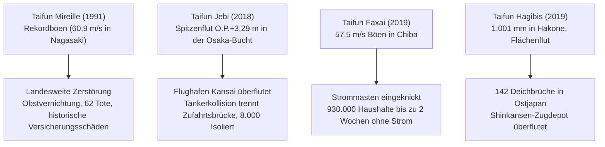
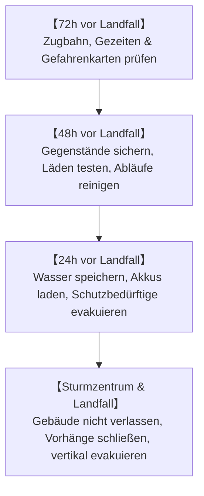
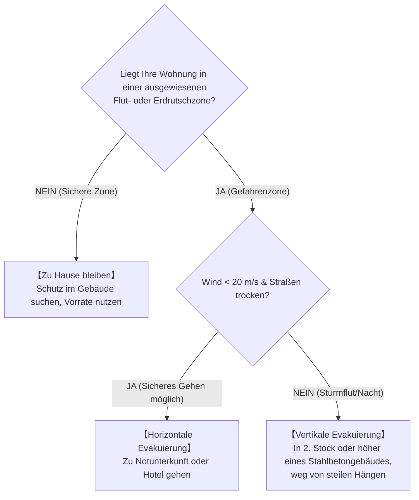

## Einleitung: Konfrontation mit den Gewaltigen Wärmekraftmaschinen von Atmosphäre und Ozean

Über den sengenden tropischen Ozeanen steigt unsichtbarer Wasserdampf empor. Durch die Corioliskraft der Erdrotation in Drehung versetzt, organisiert sich dieses konvektive Wolkencluster zu einem gigantischen atmosphärischen Zirkulationssystem von Hunderten bis über Tausend Kilometern Durchmesser: dem **Taifun (Tropischer Wirbelsturm)**.

Taifune sind gigantische thermodynamische Sicherheitsventile unseres Planeten, die überschüssige Sonnenwärme der Tropen zu den polaren Kältesenken transportieren. Wenn sie jedoch auf dicht besiedelte Küsten treffen, zerstört ihre zerstörerische Triade aus orkanartigen Winden, verheerenden Sturmfluten und sintflutartigen Regenfällen selbst modernste Infrastruktur binnen weniger Stunden.

Japan liegt direkt auf der Hauptzugbahn nordwestpazifischer Taifune, die in die westlichen Höhenwinde der mittleren Breiten einbiegen. Drei verheerende Katastrophen der Showa-Ära – der Muroto-Taifun (1934), der Makurazaki-Taifun (1945) und der Isewan-Taifun (Vera, 1959) – kosteten jeweils Tausende Menschenleben und führten zur Entstehung moderner Bau- und Hochwasserschutzgesetze. Im 21. Jahrhundert verschärft der Klimawandel diese Extreme: die Überflutung des Kansai-Flughafens (Taifun Jebi, 2018), zweiwöchige Stromausfälle (Taifun Faxai, 2019) und 142 Deichbrüche (Taifun Hagibis, 2019) belegen die Notwendigkeit wissenschaftlich fundierter Schutzstrategien.

---

## 1. Thermodynamik und Entstehungsmechanismen: Der Taifun als Carnot-Wärmekraftmaschine

### 1.1 Internationale Klassifikation und Windstärkenskalen
In der dynamischen Meteorologie werden rotierende Tiefdrucksysteme über warmen Meeren als **Tropische Wirbelstürme** bezeichnet:

| Klassifikation | Ozeanbecken | Windgeschwindigkeits-Standard | Schwellenwert |
| :--- | :--- | :--- | :--- |
| **Taifun (JMA)** | Nordwestpazifik & Südchinesisches Meer | **10-Minuten-Mittel** | $\ge 34\,\text{Knoten}$ ($\approx 17,2\,\text{m/s}$) |
| **Taifun (JTWC)** | Nordwestpazifik | **1-Minute-Mittel** | $\ge 64\,\text{Knoten}$ ($\approx 33\,\text{m/s}$, Kategorie 1) |
| **Hurrikan (NHC)** | Nordatlantik, Karibik, Nordostpazifik | **1-Minute-Mittel** | $\ge 64\,\text{Knoten}$ ($\approx 33\,\text{m/s}$) |
| **Zyklon** | Indischer Ozean, Südwestpazifik | 3- oder 10-Minuten-Mittel | $\ge 34$ oder $\ge 64\,\text{Knoten}$ |

Die Japan Meteorological Agency (JMA) unterscheidet zudem:
- **Starker Taifun**: $33\,\text{m/s} \sim 44\,\text{m/s}$ (64–84 Knoten)
- **Sehr starker Taifun**: $44\,\text{m/s} \sim 54\,\text{m/s}$ (85–104 Knoten)
- **Gewaltsamer Taifun**: $\ge 54\,\text{m/s}$ ($\ge 105\,\text{Knoten}$)

---

### 1.2 Carnot-Kreisprozess und Theorie der maximalen potenziellen Intensität (MPI)
Kerry Emanuel (MIT) formulierte den Taifun als makroskopische **Carnot-Wärmekraftmaschine**:

Der thermodynamische Wirkungsgrad $\epsilon$ lautet:

$$\epsilon = \frac{T_s - T_o}{T_s}$$

Mit $T_s \approx 300\,\text{K}$ ($27^\circ\text{C}$) und $T_o \approx 200\,\text{K}$ ($-73^\circ\text{C}$) beträgt der theoretische Wirkungsgrad ca. $33\%$. Die maximale potenzielle Intensität (MPI) bestimmt die maximale Windgeschwindigkeit $V_{\max}$:

$$V_{\max}^2 \approx \frac{C_k}{C_D} \frac{T_s - T_o}{T_o} \left( k_s^* - k \right)$$

Bereits ein Anstieg der Wassertemperatur um $1^\circ\text{C}$ vergrößert das Enthalpie-Ungleichgewicht $(k_s^* - k)$ drastisch und erhöht die Zerstörungskraft überproportional.

---

### 1.3 Notwendige thermodynamische und dynamische Bedingungen
1. **Wassertemperatur (SST) $\ge 26,5^\circ\text{C}$**: Für ausreichende Verdunstungsraten.
2. **Wärmegehalt der oberen Ozeanschicht (TCHP)**: Eine mindestens 50 m bis 100 m tiefe Schicht über $26^\circ\text{C}$ verhindert, dass sturmbedingter Auftrieb von kaltem Tiefenwasser den Wirbelsturm abkühlt.
3. **Corioliskraft ($f = 2\Omega\sin\phi$) bei Breiten $>5^\circ$**: Unverzichtbar für die zirkuläre Ablenkung.
4. **Geringe vertikale Windscherung (VWS $< 10\,\text{m/s}$)**: Starke Scherung zerstört den vertikalen Warmluftkern.
5. **CISK- und WISHE-Instabilität**: Charneys Theorie der bedingten Instabilität zweiter Art (CISK) und Emanuels windinduzierter Oberflächenwärmeaustausch (WISHE, Verdunstung $F_k \propto v$) treiben die rapide Intensivierung an.

---

## 2. Dreidimensionale Wirbelstruktur und hydrodynamisches Gleichgewicht

### 2.1 Zirkulationsarchitektur

1. **Grenzschicht (0–1,5 km)**: Bodenreibung bricht das geostrophische Gleichgewicht; Luft konvergiert isobarisch zum Zentrum.
2. **Eyewall (1,5–14 km)**: Durch Zentrifugalkräfte gestaut, steigen feuchte Luftmassen mit gewaltiger Vehemenz senkrecht auf.
3. **Ausströmung (12–16 km)**: An der Tropopause strömt die Luft antizyklonal (im Uhrzeigersinn) radial ab.

---

### 2.2 Das Auge: Drehimpulserhaltung und Absinkwärme
Die Entstehung des **Auges (Eye)** folgt dem Drehimpulserhaltungssatz:

$$M = v r + \frac{1}{2} f r^2 = \text{const}$$

Beim Zusammenziehen nach innen ($r \to 0$) wächst die Zentrifugalbeschleunigung ($v^2/r$) mit $r^{-3}$. Am Radius des maximalen Windes (RMW) wird eine dynamische Barriere erreicht. Im Auge entsteht erzwungenes Absinken mit trockenadiabatischer Erwärmung ($9,8^\circ\text{C/km}$), was Wolken vollständig auflöst.

---

### 2.3 Eyewall-Ersatzzyklen (ERC)
In Super-Taifunen umschließt ein äußeres Regenband die innere Eyewall, kappt deren Feuchtigkeitszufuhr und führt zu deren Kollaps, gefolgt von einer Kontraktion der neuen Eyewall und oft sekundärer Intensivierung.

---

### 2.4 Gradientwind-Gleichgewicht und Gefährlicher Halbkreis
Das horizontale Windfeld gehorcht dem **Gradientwind-Gleichgewicht**:

$$\frac{1}{\rho} \frac{\partial p}{\partial r} = f v + \frac{v^2}{r}$$

---

## 3. Zugbahnkinematik und Extratropische Transition (ET)

### 3.1 Steuerungsströmungen und Subtropenhoch
Taifune werden von tiefreichenden **Steuerungsströmungen (Steering Flows)** des Subtropenhochs gelenkt.

### 3.2 Rekurvierung und Ensemble-Vorhersagen

### 3.3 Beta-Drift und Fujiwhara-Effekt
Durch die Breitengrad-Abhängigkeit der Corioliskraft ($\beta = df/dy$) driften Taifune auch ohne Umgebungsströmung autonom nach **Nordwesten**. Nähern sich zwei Wirbelstürme auf $1.000 \sim 1.500\,\text{km}$, umkreisen sie ein gemeinsames Zentrum (**Fujiwhara-Effekt**).

### 3.4 Extratropische Transition (ET): Energieumschaltung
Bei der ET wandelt sich der Taifun in ein Frontentief um: Die Energiequelle wechselt von ozeanischer latenter Wärme zu baroklinen Temperaturgradienten, wodurch sich das Sturm- und Wellenfeld explosionsartig auf hunderte Kilometer ausdehnt.

---

## 4. Die drei Großen Showa-Taifune Japans

- **Muroto-Taifun (1934)**: Mit $911,6\,\text{hPa}$ der tiefste je in Japan gemessene Bodendruck; stürzte über 260 Holzschulen in Osaka ein (600 tote Schulkinder).
- **Makurazaki-Taifun (1945)**: Traf das zerstörte Hiroshima kurz nach Kriegsende; gewaltige Schlammlawinen zerstörten Lazarette und forderten 3.756 Menschenleben.
- **Isewan-Taifun (Vera, 1959)**: Tötete 5.098 Menschen durch eine verheerende Sturmflut ($+3,55\,\text{m}$ in Nagoya). Tausende Tonnen treibender Baumstämme zertrümmerten Deiche. Dies führte zum Katastrophenschutz-Grundgesetz von 1961.

---

## 5. Historische Extremfluten und maritime Katastrophen

- **Kathleen (1947)**: Brach die Tone-Flussdeiche und überflutete Tokio (1.930 Tote); führte zum modernen Flussbauplan der Hauptstadt.
- **Toya Maru (1954)**: Versenkte 5 Fährschiffe in der Hakodate-Bucht ($57\,\text{m/s}$ Böen, 1.430 Tote) und erzwang den Bau des Seikan-Tunnels.
- **Kanogawa (1958)**: $750\,\text{mm}$ Regen auf der Izu-Halbinsel lösten verheerende Muren aus und fluteten 300.000 Häuser in Tokio.

---

## 6. Moderne Taifune im Zeitalter des Klimawandels

- **Taifun Mireille (1991)**: Orkanböen von $60,9\,\text{m/s}$ in Nagasaki verwüsteten Obstplantagen und Tempel; historische Rekordschäden für Versicherer.
- **Taifun Jebi (2018)**: Sturmflut von $+3,29\,\text{m}$ überflutete den Kansai-Flughafen; Tankschiffkollision isolierte 8.000 Menschen.
- **Taifun Faxai (2019)**: Böen von $57,5\,\text{m/s}$ knickten Hochspannungsmasten in Chiba (930.000 Haushalte bis zu 2 Wochen ohne Strom).
- **Taifun Hagibis (2019)**: $1.001\,\text{mm}$ Regen in Hakone führte zu 142 Deichbrüchen und überflutete Shinkansen-Schnellzüge.

---

## 7. Globale Rekorde und IPCC-Projektionen

- **Taifun Tip (1979)**: Weltweiter Luftdruckrekord von **$870\,\text{hPa}$** und 2.220 km Durchmesser.
- **Haiyan / Yolanda (2013)**: Landfall mit Böen von **$378\,\text{km/h}$**; Tsunami-artige Sturmflut tötete über 7.300 Menschen auf den Philippinen.
- **Hurrikane Katrina (2005) & Sandy (2012)**: Überfluteten New Orleans und die U-Bahn von New York City.
- **IPCC AR6 Projektionen**: Anteil der Kategorie 4–5 Stürme steigt; Niederschläge nehmen um 7% pro $1^\circ\text{C}$ Erwärmung zu; Zuggeschwindigkeiten verlangsamen sich.

---

## 8. Zerstörungsphysik: Windlasten, Sturmfluten und Hochwasser

### 8.1 Winddruck: Quadratisches Geschwindigkeitsgesetz
Der dynamische Winddruck skaliert quadratisch:

$$P = \frac{1}{2} \rho v^2 C_f$$

Eine Verdopplung der Windgeschwindigkeit vervierfacht die statische Last; eine Verdreifachung verneunfacht sie.

### 8.2 Sturmflutmechanik
$$\Delta h = \Delta h_p + \Delta h_w$$
1. **Inverser Barometereffekt ($\Delta h_p$)**: Druckabfall um $1\,\text{hPa}$ hebt den Meeresspiegel um $\approx 1\,\text{cm}$.
2. **Windstau ($\Delta h_w$)**: $\frac{\partial h_w}{\partial x} \approx \frac{\rho_a C_D v^2}{\rho_w g H}$ – umgekehrt proportional zur Wassertiefe $H$, weshalb flache Buchten extrem anfällig sind.

### 8.3 Zusammengesetzte Überflutungen
- Deichbruch durch Überströmen und landseitige Kolkbildung.
- Binnenhochwasser durch geschlossene Siele bei hohem Flusspegel.
- Rückstauphänomene (Backwater-Effekt) in Nebenflüssen.

---

## 9. Frühwarnsysteme und Überlebensstrategie

### 9.1 Warnstufen des Kikikuru-Gefahrensystems
| Warnstufe | Kartenfarbe | Entsprechende Warnung | Vorgeschriebene Bürgeraktion |
| :--- | :--- | :--- | :--- |
| **Extrem gefährlich** | **Dunkelviolett** | **Evakuierungsbefehl (Stufe 4)** | **Evakuierung muss vollständig abgeschlossen sein** |
| **Sehr gefährlich** | **Hellviolett** | **Evakuierungsbefehl (Stufe 4)** | Unverzügliche Evakuierung aller Personen |
| **Warnung** | **Rot** | **Evakuierung Senioren (Stufe 3)** | Gefährdete Personen evakuieren sofort |
| **Vorwarnung** | **Gelb** | **Vorwarnung (Stufe 2)** | Fluchtrouten und Notgepäck prüfen |
| **Katastrophe eingetreten** | **Schwarz** | **Notfallsicherung (Stufe 5)** | **Lebensgefahr: Notfallmäßige vertikale Evakuierung** |

---

### 9.2 72-Stunden-Aktionsplan vor dem Landfall

### 9.3 Selbstschutz im Haushalt
- **Fensterschutz-Mythos**: Klebeband auf Scheiben schützt nicht vor Bruch; nötig sind Rollläden, Sicherheitsfolien und dicke, verklipste Vorhänge.
- **Rückstausicherung**: Wassersäcke (zwei Müllsäcke mit Wasser gefüllt) in Toiletten und Abflüsse legen, um Fäkalienrückstau zu verhindern.
- **14-Tage-Vorrat**: 3 l Wasser/Tag/Person, Gaskocher, mobile Powerstations (1.000–2.000 Wh) und 70 Notfall-Toilettenbeutel pro Person.

### 9.4 Evakuierungs-Entscheidungsmatrix

---

## Fazit: Schild der Wissenschaft und Festung der Vorstellungskraft

Gegen die planetare Wucht der Taifune stützt sich die Menschheit auf zwei Pfeiler: den **Schild der Wissenschaft** – das Verständnis hydrodynamischer Gesetze und Frühwarnsysteme – und die **Festung der Vorstellungskraft**, die den Normalitätsbias bricht, um sich auf das Schlimmste vorzubereiten.
