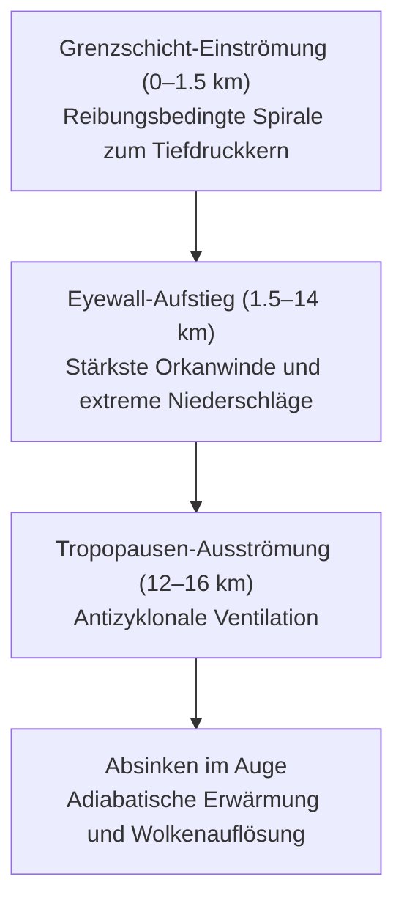

## Einleitung: Konfrontation mit den Gigantischen Wärmekraftmaschinen von Atmosphäre und Ozean

Über den sonnenüberfluteten Weiten der tropischen Ozeane steigt unsichtbarer Wasserdampf empor. Durch die Corioliskraft der Erdrotation in Drehung versetzt, organisiert sich diese Konvektion zu einem kolossalen Wirbelsystem von Hunderten bis Tausenden Kilometern Durchmesser: dem **Taifun (Tropischer Wirbelsturm: Tropical Cyclone)**.

Auf planetarer Ebene fungieren Taifune als gigantische thermodynamische Ventile, die überschüssige Sonnenwärme aus den Tropen zu den polaren Kältesenken transportieren. Wenn sie jedoch auf menschliche Siedlungsräume treffen, vermag ihre Zerstörungs-Triade – orkanartige Winde, verheerende Sturmfluten und sintflutartige Niederschläge – moderne Infrastrukturen binnen weniger Stunden zu zerschlagen.

Die drei epochalen Katastrophen der japanischen Showa-Ära – der Muroto-Taifun (1934), der Makurazaki-Taifun (1945) und der Isewan-Taifun (Taifun Vera, 1959) – forderten jeweils Tausende von Menschenleben und führten zur Etablierung moderner Bauvorschriften und des Katastrophenschutz-Grundgesetzes von 1961. Im Zeitalter des anthropogenen Klimawandels erfordern wärmere Meere und intensivere Niederschläge eine tiefgreifende wissenschaftliche Vorbereitung.

---

## 1. Thermodynamik und Entstehungsmechanismen: Der Taifun als Carnot-Maschine

### 1.1 Klassifikation und Grenzwerte
Die World Meteorological Organization (WMO) und die Japan Meteorological Agency (JMA) klassifizieren tropische Wirbelstürme nach der 10-Minuten-Dauerwindgeschwindigkeit:
- **Taifun**: $\ge 34\,\text{Knoten}$ ($17.2\,\text{m/s}$)
- **Sehr Starker Taifun**: $44\,\text{m/s} \sim 54\,\text{m/s}$
- **Heftiger Taifun**: $\ge 54\,\text{m/s}$ ($\ge 105\,\text{Knoten}$)

### 1.2 Carnot-Zyklus und Maximum Potential Intensity (MPI)
Nach Kerry Emanuel (MIT) arbeitet ein Taifun als makroskopische **Carnot-Wärmekraftmaschine**:
- Wärmequelle: Warme Meeresoberfläche ($T_s \approx 300\,\text{K}$)
- Wärmesenke: Tropopause ($T_o \approx 200\,\text{K}$)
- Thermischer Wirkungsgrad: $\epsilon = \frac{T_s - T_o}{T_s} \approx 33\%$

Die theoretische Maximalgeschwindigkeit $V_{\max}$ wird durch die MPI-Gleichung beschrieben:

$$V_{\max}^2 \approx \frac{C_k}{C_D} \frac{T_s - T_o}{T_o} \left( k_s^* - k \right)$$

---

## 2. Dreidimensionale Wirbelarchitektur und Strömungsgleichgewicht

- **Auge des Taifuns**: Drehimpulserhaltung ($M = v r + \frac{1}{2} f r^2 = \text{const}$) erzeugt eine dynamische Zentrifugalbarriere am Radius maximaler Winde (RMW). Erzwungenes Absinken führt zu adiabatischer Erwärmung und Wolkenfreiheit.
- **Eyewall-Replacement-Cycle (ERC)**: Bildung einer sekundären äußeren Eyewall bei Supertaifunen.
- **Gradientwindgleichgewicht & Gefährlicher Halbkreis**:
  $$\frac{1}{\rho} \frac{\partial p}{\partial r} = f v + \frac{v^2}{r}$$
  Auf der rechten Seite (in Zugrichtung) addieren sich Rotations- und Translationsgeschwindigkeit ($v_{\text{rot}} + v_{\text{trans}}$).

---

## 3. Zugbahndynamik und Außertropische Umwandlung (ET)

Der Übergang in ein außertropisches Tief (ET) bedeutet keine Abschwächung, sondern einen **Wechsel der Energiequelle** – von latenter Wärme zu barokliner Instabilität. Das Starkwindfeld dehnt sich dabei auf Hunderte Kilometer aus.

---

## 4. Die Drei Großen Showa-Taifune Japans

1. **Muroto-Taifun (1934)**: Bodendruck-Rekord von **$911.6\,\text{hPa}$**; Einsturz von über 260 Holzschulen in Osaka mit 600 toten Schulkindern; Grundstein für moderne Windlastnormen.
2. **Makurazaki-Taifun (1945)**: Landfall mit $916.3\,\text{hPa}$ unmittelbar nach Kriegsende; verheerende Muren im atombombenzerstörten Hiroshima; 3.756 Todesopfer.
3. **Isewan-Taifun (Taifun Vera, 1959)**: Landfall mit $929\,\text{hPa}$; Rekord-Sturmflutanomalie von **$3.55\,\text{m}$** im Hafen von Nagoya; Überflutung der Null-Meter-Zonen; **5.098 Tote und Vermisste**; Verabschiedung des Katastrophenschutz-Grundgesetzes von 1961.

---

## 5. Historische Flut- und Seekatastrophen

- **Kathleen (1947)**: Bruch des Tone-Deichs, Überflutung von Tokio, Beginn des modernen Damm- und Entlastungskanalsystems.
- **Toya Maru (1954)**: Untergang von fünf Eisenbahnfähren in der Tsugaru-Straße mit **1.430 Toten**, Auslöser für den Bau des Seikan-Tunnels.
- **Kanogawa (1958)**: Über $750\,\text{mm}$ Regen auf der Izu-Halbinsel, Erdrutsche und urbane Überflutungen.

---

## 6. Neuzeitliche Extremtaifune (Heisei & Reiwa)

- **Taifun Jebi (2018)**: Sturmflutrekord in Osaka (O.P. $+3.29\,\text{m}$), Überflutung des Flughafens Kansai, Tankerkollision isoliert 8.000 Passagiere.
- **Taifun Faxai (2019)**: Böen von $57.5\,\text{m/s}$ in Chiba, Zusammenbruch von Hochspannungsmasten, zweiwöchiger Blackout für 930.000 Haushalte.
- **Taifun Hagibis (2019)**: $1.001\,\text{mm}$ Niederschlag in Hakone, 142 Deichbrüche, Überflutung des Shinkansen-Betriebswerks Nagano (10 Züge zerstört).

---

## 7. Globale Rekorde und Klimaprognosen

- **Taifun Tip (1979)**: Weltrekordtiefdruck **$870\,\text{hPa}$**, Sturmfelddurchmesser **$2.220\,\text{km}$**.
- **Supertaifun Haiyan (2013)**: Spitzenböen bis **$105\,\text{m/s}$ ($378\,\text{km/h}$)**, meterhohe Sturmflutwand in Tacloban, über 7.300 Todesopfer.
- **IPCC-Trends**: Zunahme der Kategorie-4–5-Stürme, 7% mehr Regen pro Grad Erwärmung, Verlangsamung der Zuggeschwindigkeit.

---

## 8. Physik der Zerstörung: Windlasten und Sturmflut

### Winddruck
$$P = \frac{1}{2} \rho v^2 C_f$$
Verdopplung der Windgeschwindigkeit vervierfacht die mechanische Last. Wenn Trümmer Fenster durchschlagen, sprengt der interne Überdruck das Dach ab.

### Sturmflutmechanik
$$\Delta h = \Delta h_p + \Delta h_w$$
Barometrischer Saugeffekt ($1\,\text{cm}$ pro $1\,\text{hPa}$) kombiniert mit Windstau ($\Delta h_w \propto v^2 / H$) in flachen Meeresbuchten.

---

## 9. Timeline-Katastrophenvorsorge

- **72h vorher**: Gefahrenkarten prüfen, Flutzeiten abgleichen.
- **48h vorher**: Außenobjekte sichern, Entwässerungsrinnen reinigen.
- **24h vorher**: Notstromakkus laden, Nutzwasser bevorraten, Schutzbedürftige evakuieren.
- **Evakuierungsregel**: Horizontale Evakuierung vor Erreichen von $20\,\text{m/s}$ Wind; bei Überflutung vertikale Evakuierung in obere Stockwerke stabiler Stahlbetongebäude.

---

## Fazit: Schutzschild der Wissenschaft

Angesichts der Naturgewalten schützt uns zweierlei: Der **Schild der Wissenschaft** durch meteorologisches Verständnis und die **Festung der Vorstellungskraft**, die jede Sorglosigkeit überwindet. Proaktives Handeln rettet Menschenleben.
