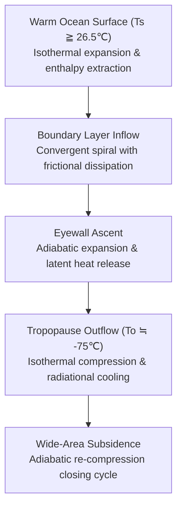
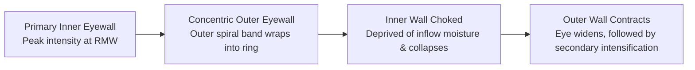
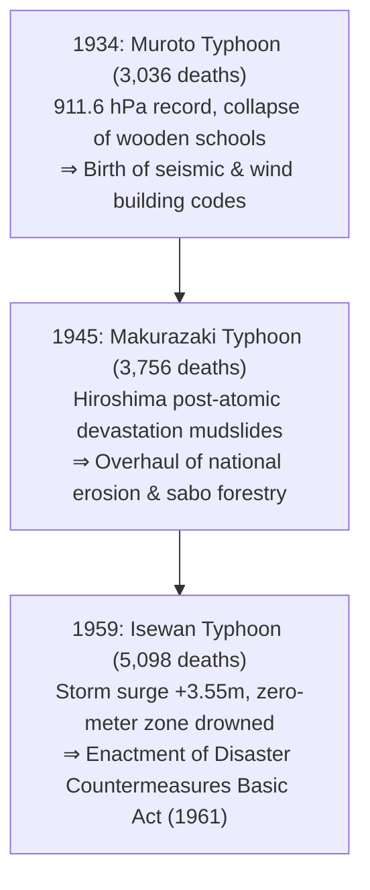
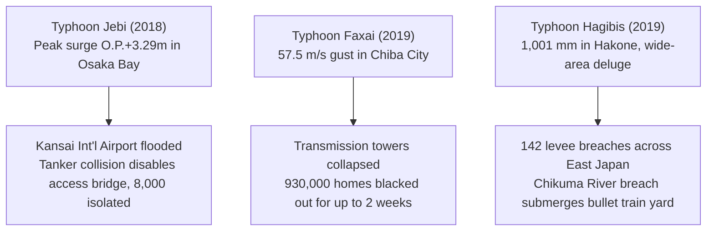
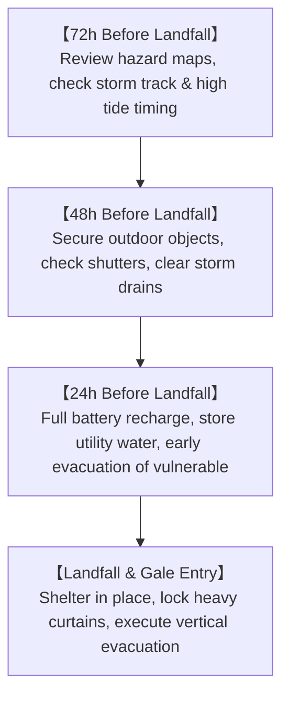

## Introduction: Confronting the Giant Heat Engines of the Atmosphere and Ocean

From the sun-drenched expanse of the tropical oceans rises a plume of invisible water vapor. Set into rotational motion by the invisible deflecting hand of Earth's rotation, this convection organizes itself into a colossal atmospheric vortex spanning hundreds to thousands of kilometers: the **Typhoon (Tropical Cyclone)**.

Typhoons represent one of nature's most formidable and geometrically sublime phenomena. On a planetary scale, they serve as crucial planetary thermodynamic valves, transporting surplus solar thermal energy from equatorial latitudes toward the polar heat sinks. Yet, when their paths intersect human civilization, their destructive triad—destructive gale-force winds, towering storm surges, and catastrophic inland deluges—can pulverize modern engineering infrastructure in mere hours.

Situated directly along the primary recurvature pathway of Northwest Pacific typhoons, the Japanese archipelago has coexisted with these cyclonic giants for millennia. While nourishing fertile rice paddies with vital monsoon rains, typhoons have also repeatedly rewritten Japanese history through catastrophic loss of life. The three defining calamities of the Showa era—the Muroto Typhoon (1934), the Makurazaki Typhoon (1945), and the Isewan Typhoon (Typhoon Vera, 1959)—each claimed thousands of lives, ultimately forging Japan's modern Disaster Countermeasures Basic Act, building codes, and river engineering paradigms.

In the 21st century, anthropogenic climate change is reshaping the thermodynamic baseline of our oceans. With elevated sea surface temperatures and enhanced atmospheric moisture-holding capacity, we face unprecedented storm behavior: artificial island airports submerged (Typhoon Jebi, 2018), metropolitan power grids paralyzed for weeks (Typhoon Faxai, 2019), and simultaneous wide-area levee breaches across 142 river sections (Typhoon Hagibis, 2019). This treatise provides an exhaustive scientific and practical foundation—spanning geophysical fluid dynamics, thermodynamics, disaster history, and survival doctrines—to empower society against the escalating threats of a warming world.

---

## 1. Thermodynamics and Genesis Mechanisms: The Typhoon as a Carnot Heat Engine

### 1.1 International Classification and Definitions

In global meteorology, rotating low-pressure systems driven by warm oceanic cores are collectively classified as **Tropical Cyclones**. Nomenclature and wind-speed thresholds vary across international operational bodies:

| Classification | Primary Ocean Basin | Sustained Wind Standard | Threshold Criteria |
| :--- | :--- | :--- | :--- |
| **Typhoon** | Northwest Pacific & South China Sea | JMA: **10-minute maximum sustained wind** | $\ge 34\,\text{knots}$ ($\approx 17.2\,\text{m/s}$) |
| **Typhoon (JTWC)** | Northwest Pacific | US JTWC: **1-minute maximum sustained wind** | $\ge 64\,\text{knots}$ ($\approx 33\,\text{m/s}$, Category 1 equiv.) |
| **Hurricane** | North Atlantic, Caribbean, NE Pacific | US NHC: **1-minute maximum sustained wind** | $\ge 64\,\text{knots}$ ($\approx 33\,\text{m/s}$) |
| **Severe Cyclonic Storm** | North & South Indian Ocean, SW Pacific | BOM / IMD: 3-min or 10-min sustained | $\ge 34\,\text{knots}$ or $\ge 64\,\text{knots}$ |

The Japan Meteorological Agency (JMA) further grades typhoons by sustained wind intensity:
- **Strong Typhoon**: $33\,\text{m/s}$ to $44\,\text{m/s}$ (64–84 knots)
- **Very Strong Typhoon**: $44\,\text{m/s}$ to $54\,\text{m/s}$ (85–104 knots)
- **Violent Typhoon**: $\ge 54\,\text{m/s}$ ($\ge 105\,\text{knots}$)

---

### 1.2 The Carnot Cycle Model and Maximum Potential Intensity (MPI)

Atmospheric thermodynamicist Kerry Emanuel (MIT) formalized the tropical cyclone as a macroscopic **Carnot Heat Engine**. The storm absorbs enthalpy from the warm ocean surface ($T_s$) and exhausts waste heat into the cryogenic lower stratosphere / tropopause ($T_o \approx -70^\circ\text{C}$ to $-80^\circ\text{C}$).

The thermodynamic efficiency $\epsilon$ is governed by:

$$\epsilon = \frac{T_s - T_o}{T_s}$$

For $T_s \approx 300\,\text{K}$ and $T_o \approx 200\,\text{K}$, $\epsilon \approx 33\%$. Under steady-state balance between enthalpy acquisition and surface aerodynamic drag dissipation, Emanuel's **Maximum Potential Intensity (MPI)** equation governs the theoretical terminal wind velocity $V_{\max}$:

$$V_{\max}^2 \approx \frac{C_k}{C_D} \frac{T_s - T_o}{T_o} \left( k_s^* - k \right)$$

where $C_k / C_D$ represents the ratio of exchange coefficients, and $(k_s^* - k)$ reflects the thermodynamic disequilibrium between the saturated sea surface and the ambient marine boundary layer.

---

### 1.3 Essential Thermodynamic & Dynamic Preconditions

Tropical cyclogenesis requires the simultaneous satisfaction of strict environmental constraints:
1. **Sea Surface Temperature (SST) $\ge 26.5^\circ\text{C}$**: Maintains high evaporation rates to feed the latent heat engine.
2. **Tropical Cyclone Heat Potential (TCHP)**: Requires a warm oceanic mixed layer extending $50\,\text{m}$ to $100\,\text{m}$ deep. Shallow warm layers are quickly upwelled by cyclonic wind stress, cooling the surface and arresting storm intensification.
3. **Coriolis Parameter ($f = 2\Omega\sin\phi \ne 0$)**: Latitudes poleward of $5^\circ$ are essential to impart planetary vorticity to converging air parcels.
4. **Low Vertical Wind Shear (VWS $< 10\,\text{m/s}$)**: High shear tilts the vertical updraft column, laterally displacing the warm core and decoupling the thermal engine.
5. **CISK and WISHE Instabilities**: Transitioning from conditional instability of the second kind (Ekman pumping feedback) to Wind-Induced Surface Heat Exchange (WISHE), where higher surface winds exponentially enhance oceanic enthalpy fluxes.

---

## 2. Three-Dimensional Vortex Architecture and Fluid Equilibrium

### 2.1 Vortex Anatomy

A mature typhoon exhibits axisymmetric radial circulation divided into three dynamic regimes:
- **Boundary Layer Inflow (0–1.5 km)**: Cross-isobaric inward spiral feeding moisture directly into the central core.
- **Eyewall Updraft Core (1.5–14 km)**: Nearly vertical wall of high-velocity ascent with extreme vertical accelerations, intense precipitation, and lightning.
- **Tropopause Outflow (12–16 km)**: Anticyclonic (clockwise in Northern Hemisphere) divergent exhaust canopy ventilating the upper column.

---

### 2.2 Dynamics of the Eye and Eyewall Replacement Cycles (ERC)

The **Eye** forms via angular momentum conservation:

$$M = v r + \frac{1}{2} f r^2 = \text{const}$$

As converging air approaches the center ($r \to 0$), tangential velocity $v$ accelerates rapidly. Centrifugal acceleration ($v^2/r$) increases as $r^{-3}$, eventually counterbalancing inward pressure gradients at the Radius of Maximum Winds (RMW). Trapped inside, air is forced into gentle downward subsidence, undergoing **adiabatic compression** ($9.8^\circ\text{C/km}$ dry lapse rate). This evaporates all cloud hydrometeors, creating the calm, cloud-free eye.

In Category 4–5 super typhoons, **Eyewall Replacement Cycles (ERC)** occur:

---

### 2.3 Horizontal Wind Field: Gradient Wind Balance & Asymmetry

Horizontal dynamics obey **Gradient Wind Balance**:

$$\frac{1}{\rho} \frac{\partial p}{\partial r} = f v + \frac{v^2}{r}$$

The storm exhibits severe horizontal asymmetry:
- **Dangerous Semicircle (Right of track)**: The storm's rotational wind vector aligns with its translational velocity vector ($v_{\text{net}} = v_{\text{rot}} + v_{\text{trans}}$), generating the highest wind loads and pushing sea surges onshore.
- **Navigable Semicircle (Left of track)**: Rotational and translational vectors oppose each other, moderating observed winds ($v_{\text{net}} = v_{\text{rot}} - v_{\text{trans}}$).

---

## 3. Trajectory Kinematics and Extratropical Transition (ET)

### 3.1 Steering Flows and Recurvature

Typhoon tracks are dictated by large-scale **Steering Flows**, primarily the western periphery of the North Pacific Subtropical High (Subtropical Anticyclone). As the storm progresses northward, it encounters mid-latitude westerlies (jet stream), undergoing **Recurvature**:
- **Tropical Phase**: West-northwestward track at 15–25 km/h.
- **Recurvature Point**: Deceleration and erratic loop tracks where steering currents weaken.
- **Accelerating Phase**: Jet stream capture propelling the storm northeastward at 60–100 km/h.

---

### 3.2 The Physics of Extratropical Transition (ET)

Public broadcasts declaring that "the typhoon has transformed into an extratropical low" frequently induce false security. In physical reality, ET is an **energy conversion switch**:
- **Tropical Engine**: Barotropic, powered by latent heat condensation over warm water.
- **Extratropical Engine**: Baroclinic, powered by horizontal temperature gradients between cold continental air and warm tropical remnants.

During ET, storm asymmetry expands dramatically. While central pressure may slightly rise or explosively re-deepen (bomb cyclogenesis), the gale-force wind field expands from tens of kilometers to **hundreds of kilometers**, generating widespread maritime and terrestrial disasters.

---

## 4. The Three Great Showa Disasters: Milestones in Modern Japanese Mitigation

### 4.1 Muroto Typhoon (1934): School Collapse and Building Engineering
On September 21, 1934, Muroto Typhoon struck Cape Muroto with a central pressure of **$911.6\,\text{hPa}$**—the lowest surface pressure ever recorded at a terrestrial meteorological observatory in Japan. Hitting the Osaka-Kobe urban corridor during morning school hours, the ferocious gales collapsed over 260 wooden school buildings lacking structural wind braces, killing 600 schoolchildren. The disaster forced the Ministry of Education to pioneer modern wind-load engineering standards and mandatory reinforced concrete school reconstruction.

### 4.2 Makurazaki Typhoon (1945): Double Tragedy on Atomic Ruins
Landing on September 17, 1945 ($916.3\,\text{hPa}$), Makurazaki Typhoon hit a nation crippled by wartime defeat and shattered communications. In Hiroshima Prefecture—devastated by the atomic bomb just six weeks prior—torrential rains triggered massive debris flows from deforested hillsides. The Ono Army Hospital was swallowed by a mud avalanche, killing 156 medical researchers from Kyoto Imperial University and atomic bomb survivors. The catastrophe prompted national legislation for comprehensive watershed management.

### 4.3 Isewan Typhoon (Typhoon Vera, 1959): The Watershed Calamity
Striking Cape Shionomisaki on September 26, 1959 ($929\,\text{hPa}$), Typhoon Vera triggered Japan's deadliest peacetime storm surge. Passing west of Ise Bay, the entire shallow basin fell within the **Dangerous Semicircle**. Extreme winds drove a record surge anomaly of **$3.55\,\text{m}$** into Nagoya Port. Massive foreign timber logs stored in ports became battering rams, pulverizing coastal defenses and drowning sea-level delta communities. With **5,098 dead or missing**, the Japanese Diet enacted the **Disaster Countermeasures Basic Act of 1961**, establishing modern national crisis architecture.

---

## 5. Landmark Historical Disasters: Flood, Maritime, and Urban Deluges

- **Kathleen Typhoon (1947)**: Breached the Tone River levee in Saitama Prefecture, sending floodwaters 60 km south to inundate Tokyo's downtown wards (Edogawa, Katsushika), establishing the modern Tokyo Flood Defense Plan and upstream dam networks.
- **Toya Maru Typhoon (Typhoon Marie, 1954)**: Undergoing violent extratropical transition, unexpected $57\,\text{m/s}$ hurricane-force winds capsized the passenger ferry *Toya Maru* and four other vessels in Hakodate Bay, killing **1,430 people** and catalyzing the construction of the undersea Seikan Tunnel.
- **Kanogawa Typhoon (Typhoon Ida, 1958)**: Dropped $750\,\text{mm}$ of rain across the Izu Peninsula, creating devastating debris flows and inundating 300,000 homes in urban Tokyo, leading to the construction of the Kanogawa Flood Diversion Canal.

---

## 6. Contemporary Extreme Typhoons in an Era of Climate Change

- **Typhoon Jebi (2018)**: Proved the vulnerability of coastal megaprojects. A storm surge of $+3.29\,\text{m}$ inundated Kansai International Airport's runways and electrical vaults, while a drifting oil tanker severed its sole umbilical bridge.
- **Typhoon Faxai (2019)**: Produced unprecedented compact gusts ($57.5\,\text{m/s}$ in Chiba), felling high-voltage transmission towers and triggering a two-week blackout compounded by deadly heat waves.
- **Typhoon Hagibis (2019)**: An atmospheric river superstorm causing $1,001\,\text{mm}$ of rainfall in Hakone. Levees collapsed at 142 locations across 71 rivers, including the catastrophic flooding of Nagano's Shinkansen rail yard (10 trainsets scrapped).

---

## 7. Global Extreme Tropical Cyclones and Projections

- **Typhoon Tip (1979)**: Global benchmark for minimum sea-level pressure (**$870\,\text{hPa}$**) and circulation diameter ($2,220\,\text{km}$), verified via US Air Force WC-130 weather reconnaissance dropsonde.
- **Super Typhoon Haiyan (Yolanda, 2013)**: Landfall intensity at $895\,\text{hPa}$ with estimated gusts of **$105\,\text{m/s}$ ($378\,\text{km/h}$)**. Generated a vertical storm surge wall destroying Tacloban City, killing over 7,300 people.
- **IPCC Projections**: Warming oceans will likely maintain or slightly decrease total cyclone frequency, while significantly increasing the proportion of **Category 4–5 Super Typhoons**, elevating rainfall rates by 7% per $1^\circ\text{C}$ warming, and shifting peak intensity latitudes northward toward temperate coastlines.

---

## 8. Physics of Damage: Wind Pressures, Storm Surges, and Compound Floods

### 8.1 Wind Load Dynamics: The Velocity-Squared Law
Aerodynamic wind pressure scales nonlinearly with wind velocity:

$$P = \frac{1}{2} \rho v^2 C_f$$

Doubling wind speed quadruples structural load; tripling wind speed increases force ninefold. When flying debris punctures a single window (missile phenomenon), internal room pressure skyrockets while external rooftop suction pulls upward (Bernoulli effect), explosively detonating roof assemblies.

### 8.2 Storm Surge Mechanics
Total coastal surge elevation is governed by hydrostatic suction and aerodynamic shear:

$$\Delta h = \Delta h_p + \Delta h_w$$

1. **Inverse Barometer Effect ($\Delta h_p$)**: $1\,\text{hPa}$ pressure drop produces approximately $1\,\text{cm}$ of sea surface rise.
2. **Wind Setup ($\Delta h_w$)**: Governed by the shallow-water momentum equation:
   $$\frac{\partial h_w}{\partial x} \approx \frac{\rho_a C_D v^2}{\rho_w g H}$$
   Surge height scales with wind speed squared ($v^2$) and is **inversely proportional to water depth ($H$)**, creating devastating sea elevation in shallow, funnel-shaped bays (Ise Bay, Osaka Bay, Tokyo Bay).

---

## 9. Frontier Meteorology and Comprehensive Survival Strategy

### 9.1 Evacuation Decision Framework
- **Horizontal Evacuation (Relocation)**: Must be completed before wind speeds exceed $20\,\text{m/s}$ or street floodings exceed $20\,\text{cm}$.
- **Vertical Evacuation (In-Situ Safety)**: If outdoor conditions are already hazardous, retreat to the second floor or higher of a sturdy reinforced concrete structure, positioning away from adjacent cliff faces.

---

## Conclusion: The Scientific Shield and Fortress of Imagination

Facing the planetary thermodynamic fury of typhoons, human resilience rests upon two pillars: the **Scientific Shield**—mastering fluid dynamic laws and decoding early warning telemetry—and the **Fortress of Imagination**—shattering normalcy bias to preempt the worst-case scenario. By respecting historical lessons and executing proactive timeline actions, society can preserve life and infrastructure amidst an era of escalating climate extremes.
