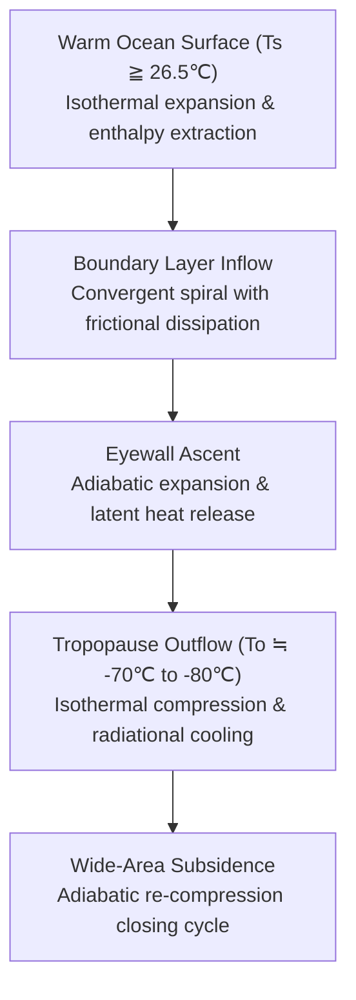
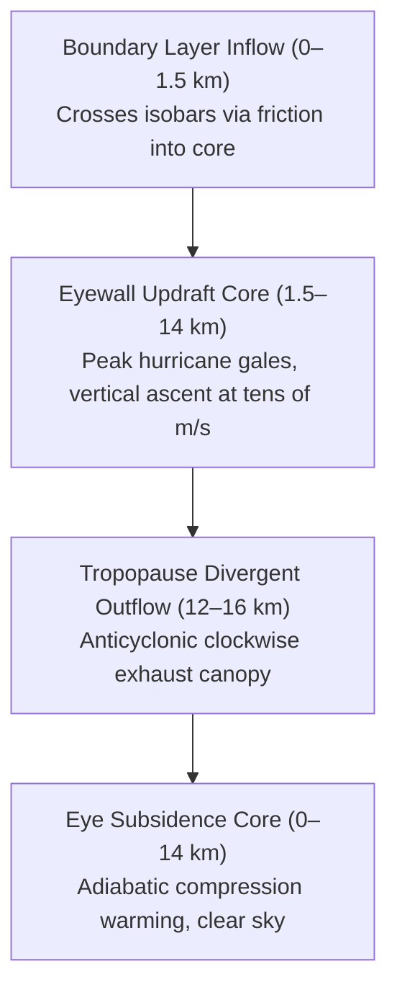
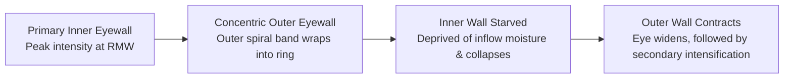
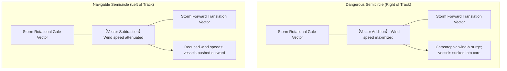
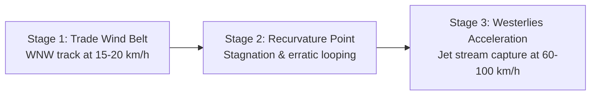
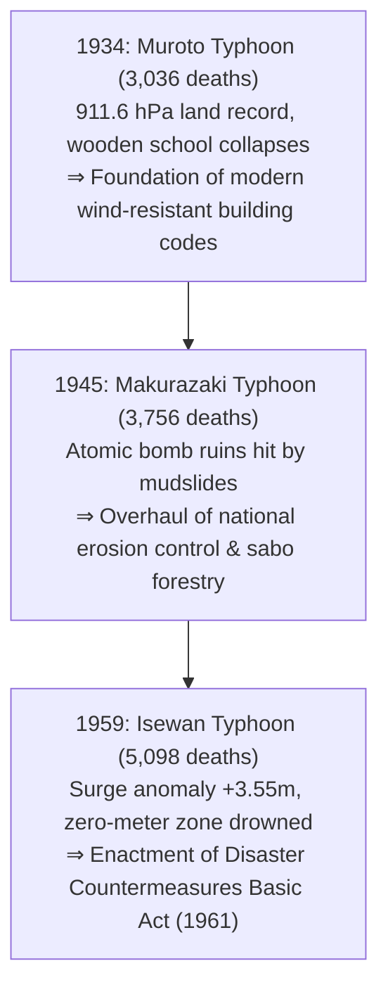
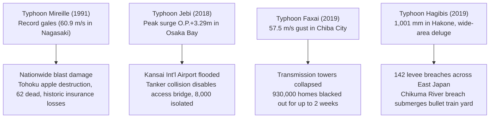
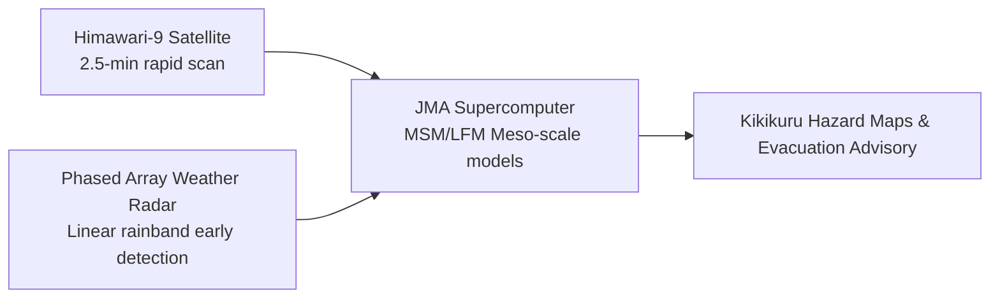
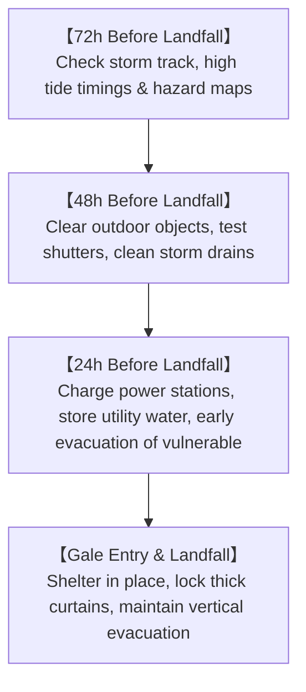
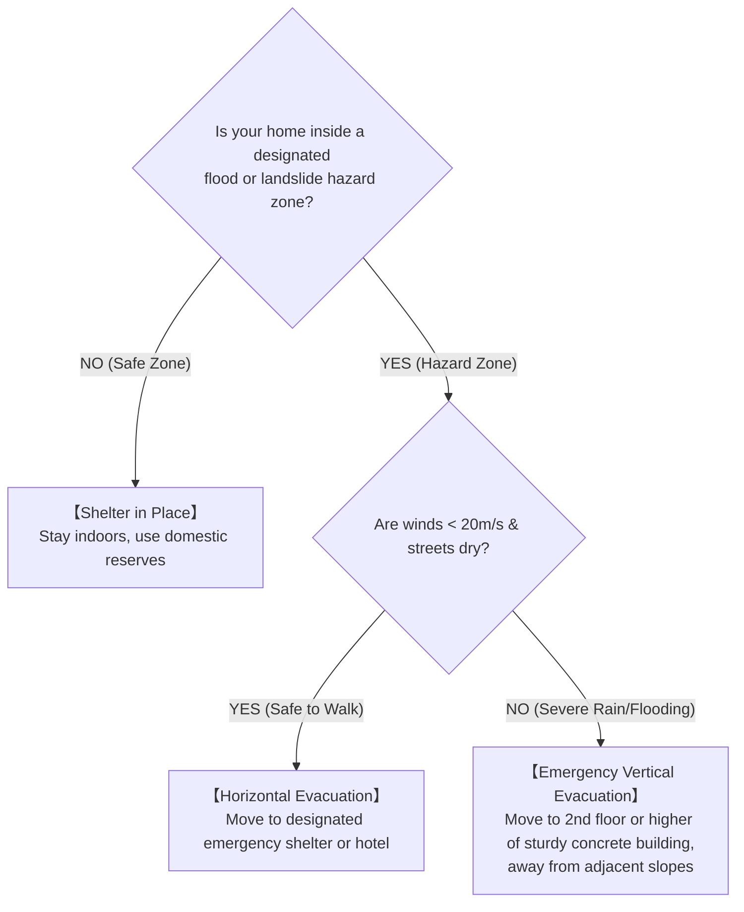

## Introduction: Confronting the Giant Heat Engines of the Atmosphere and Ocean

From the sun-drenched, sweltering expanse of the tropical ocean rises an invisible column of water vapor. Imparted with angular rotation by the unseen deflecting force of Earth's spin, this convective cluster undergoes organized self-assembly into a colossal atmospheric circulation system spanning hundreds to thousands of kilometers: the **Typhoon (Tropical Cyclone)**.

Typhoons represent one of the most formidable, energetic, and geometrically harmonious atmospheric phenomena on Earth. Functioning on a planetary scale as vital thermodynamic safety valves, they transport surplus solar thermal energy from equatorial latitudes toward polar heat sinks. Yet, whenever their trajectories intersect human civilization, their destructive triad—ferocious hurricane-force gales, towering ocean surges, and torrential inland downpours—can obliterate modern engineering infrastructure in mere hours.

Situated directly beneath the primary recurvature corridor where Northwest Pacific typhoons curve into the mid-latitude westerlies, the Japanese archipelago has coexisted with these cyclonic monsters since antiquity. While monsoon rains have sustained wetland rice cultivation for millennia, typhoons have repeatedly inflicted catastrophic damage. The three defining calamities of the Showa era—the Muroto Typhoon (1934), the Makurazaki Typhoon (1945), and the Isewan Typhoon (Typhoon Vera, 1959)—each claimed thousands of lives. In their wake, modern Japanese disaster governance, the Building Standards Act, and river basin engineering were born out of painstaking technological breakthroughs.

In the 21st century, anthropogenic climate change is reshaping the thermodynamic baseline of the ocean and atmosphere. Elevated sea surface temperatures and enhanced atmospheric moisture capacities (governed by the Clausius-Clapeyron relation) have ushered in extreme behaviors: an offshore artificial island airport submerged (Typhoon Jebi, 2018), metropolitan power grids paralyzed for weeks (Typhoon Faxai, 2019), and simultaneous levee breaches across 142 river sections (Typhoon Hagibis, 2019). This treatise provides an exhaustive scientific and operational compendium—spanning geophysical fluid dynamics, thermodynamics, disaster history, global extremes, and survival doctrines—to empower society against escalating climate hazards.

---

## 1. Thermodynamics and Genesis Mechanisms: The Typhoon as a Carnot Heat Engine

### 1.1 International Classification and Operational Definitions
In dynamic meteorology, rotating low-pressure vortices sustained by warm marine cores are collectively designated as **Tropical Cyclones**. Operational classifications and wind-speed thresholds vary across international meteorological bodies:

| Classification | Ocean Basin | Sustained Wind Standard | Threshold Criteria |
| :--- | :--- | :--- | :--- |
| **Typhoon (JMA)** | Northwest Pacific & South China Sea | JMA: **10-minute maximum sustained wind** | $\ge 34\,\text{knots}$ ($\approx 17.2\,\text{m/s}$) |
| **Typhoon (JTWC)** | Northwest Pacific | US JTWC: **1-minute maximum sustained wind** | $\ge 64\,\text{knots}$ ($\approx 33\,\text{m/s}$, Category 1 equiv.) |
| **Hurricane** | North Atlantic, Caribbean, NE Pacific | US NHC: **1-minute maximum sustained wind** | $\ge 64\,\text{knots}$ ($\approx 33\,\text{m/s}$) |
| **Severe Cyclonic Storm** | North & South Indian Ocean, SW Pacific | BOM / IMD: 3-min or 10-min sustained | $\ge 34\,\text{knots}$ or $\ge 64\,\text{knots}$ |

The Japan Meteorological Agency (JMA) further grades typhoons by intensity:
- **Strong Typhoon**: Maximum sustained wind $33\,\text{m/s} \sim 44\,\text{m/s}$ (64–84 knots)
- **Very Strong Typhoon**: Maximum sustained wind $44\,\text{m/s} \sim 54\,\text{m/s}$ (85–104 knots)
- **Violent Typhoon**: Maximum sustained wind $\ge 54\,\text{m/s}$ ($\ge 105\,\text{knots}$)

Scale is independently classified by the radius of the $15\,\text{m/s}$ gale-force wind zone: **Large** (500 km to 800 km) and **Super-Large** ($\ge 800\,\text{km}$).

---

### 1.2 The Carnot Cycle Model and Maximum Potential Intensity (MPI) Theory
In atmospheric thermodynamics, a tropical cyclone is formulated as a macroscopic **Carnot Heat Engine**. Developed by Kerry Emanuel (MIT), the **Maximum Potential Intensity (MPI)** theory defines the theoretical upper limit of central pressure deficit and terminal wind velocity.

The thermodynamic efficiency $\epsilon$ is dictated by the sea surface temperature $T_s$ and the outflow tropopause temperature $T_o$:

$$\epsilon = \frac{T_s - T_o}{T_s}$$

For tropical waters where $T_s \approx 300\,\text{K}$ ($27^\circ\text{C}$) and $T_o \approx 200\,\text{K}$ ($-73^\circ\text{C}$), the thermal efficiency reaches approximately $33\%$. Under steady-state balance between enthalpy uptake and surface frictional dissipation, Emanuel's MPI formulation governs maximum wind velocity $V_{\max}$:

$$V_{\max}^2 \approx \frac{C_k}{C_D} \frac{T_s - T_o}{T_o} \left( k_s^* - k \right)$$

where $C_k$ is the enthalpy exchange coefficient, $C_D$ is the surface drag coefficient, $k_s^*$ is the saturation enthalpy at sea surface temperature, and $k$ is the boundary layer enthalpy. A rise of just $1^\circ\text{C}$ in sea surface temperature amplifies thermodynamic disequilibrium $(k_s^* - k)$, driving exponential increases in theoretical storm strength.

---

### 1.3 Essential Thermodynamic Genesis Conditions
1. **Sea Surface Temperature (SST) $\ge 26.5^\circ\text{C} \sim 27.0^\circ\text{C}$**: Sustains rapid evaporation to feed the latent heat engine. Below $26^\circ\text{C}$, evaporation rates collapse.
2. **Tropical Cyclone Heat Potential (TCHP)**: Requires a warm mixed layer ($>26^\circ\text{C}$) extending $50\,\text{m}$ to $100\,\text{m}$ deep. Shallow warm layers are quickly upwelled by cyclonic wind shear (turbulent mixing), self-quenching the storm. High TCHP pools (e.g., east of the Philippines) trigger **Rapid Intensification (RI)**.
3. **Coriolis Parameter ($f = 2\Omega\sin\phi$) at Latitudes $>5^\circ$**: Essential to deflect converging inflow into cyclonic rotation. In equatorial zones ($\pm 5^\circ$), Coriolis force is negligible, preventing vortex spin-up.

---

### 1.4 Dynamic Preconditions and Vertical Wind Shear
1. **Mid-Tropospheric Moisture (700hPa–500hPa)**: Relative humidity must exceed $70\%$. Entrainment of dry air produces evaporative downdrafts that destroy convective cores.
2. **Low-Level Relative Vorticity & Convergence**: Intertropical Convergence Zones (ITCZ) or monsoon troughs provide baseline positive vorticity.
3. **Weak Vertical Wind Shear (VWS $< 10\,\text{m/s}$ / 20 knots)**: Vector difference between 850hPa (1.5 km) and 200hPa (12 km) must remain small. Strong shear tilts the updraft column and blows away the upper warm core.

---

### 1.5 Convective Self-Organization: CISK to WISHE
- **Conditional Instability of the Second Kind (CISK)**: Charney & Eliassen (1964) proposed positive feedback between boundary layer Ekman pumping, convective latent heat release, pressure drops, and increased low-level convergence.
- **Wind-Induced Surface Heat Exchange (WISHE)**: Emanuel (1986) demonstrated that cyclogenesis does not require pre-existing CAPE; rather, boundary layer enthalpy extraction scales nonlinearly with surface wind speed ($F_k \propto v$), driving autonomous self-amplification.

---

## 2. Three-Dimensional Vortex Architecture and Fluid Equilibrium

### 2.1 Three-Dimensional Circulation Dynamics

1. **Boundary Layer Inflow (0–1.5 km)**: Surface friction disrupts geostrophic balance, causing air to spiral inward across isobars, absorbing heat and moisture.
2. **Eyewall Updraft Core (1.5–14 km)**: Centrifugal barrier forces moisture-laden air into a near-vertical ascent wall, generating intense squalls and lightning.
3. **Upper Outflow Canopy (12–16 km)**: At the tropopause, high central pressure drives radial exhaust deflected into an anticyclonic (clockwise) plume by Coriolis force.

---

### 2.2 The Eye: Angular Momentum Conservation and Subsidence Warming
The **Eye** forms via angular momentum conservation:

$$M = v r + \frac{1}{2} f r^2 = \text{const}$$

As converging air contracts inward ($r \to 0$), tangential velocity $v$ accelerates violently. Centrifugal acceleration ($v^2/r$) scales with $r^{-3}$, creating an insurmountable dynamic wall at the Radius of Maximum Winds (RMW). Trapped inside, air undergoes forced downward subsidence, heating via dry adiabatic compression ($9.8^\circ\text{C/km}$), completely evaporating cloud hydrometeors and leaving a tranquil, cloud-free core.

---

### 2.3 Eyewall Replacement Cycles (ERC) in Super Typhoons

In Category 4–5 storms, an outer rainband contracts into a secondary ring. It intercepts moisture inflow, starving the inner eyewall until it collapses. The outer eyewall then contracts inward, temporarily weakening the storm before triggering secondary intensification with an expanded wind field.

---

### 2.4 Spiral Rainband Wave Dynamics
- **Inner Rainbands ($<100\,\text{km}$)**: Propagate as Vortex Rossby Waves (VRW) coupled with gravity waves, transferring angular momentum to the eyewall.
- **Outer Rainbands ($200–500\,\text{km}$)**: Generate severe pre-storm squalls, downbursts, and localized tornadoes hours before core arrival.

---

### 2.5 Horizontal Wind Profile: Gradient Balance and Rankine Vortex
Horizontal motion conforms to **Gradient Wind Balance**:

$$\frac{1}{\rho} \frac{\partial p}{\partial r} = f v + \frac{v^2}{r}$$

The tangential wind field is modeled by the **Modified Rankine Vortex**:
- Inside RMW ($r < R_{\max}$): Solid-body rotation where $v(r) = V_{\max} (r / R_{\max})$.
- Outside RMW ($r \ge R_{\max}$): Vortex decay where $v(r) = V_{\max} (R_{\max} / r)^x$ ($x \approx 0.5 \sim 0.7$).

---

### 2.6 The Fluid Dynamics of Dangerous vs. Navigable Semicircles

In the Northern Hemisphere, the right-hand semicircle aligns rotational wind with forward motion ($v_{\text{net}} = v_{\text{rot}} + v_{\text{trans}}$), compounding storm surge and wind damage.

---

## 3. Trajectory Kinematics and Extratropical Transition (ET)

### 3.1 Steering Flows and the Subtropical High
Typhoon tracks are dictated by deep-layer **Steering Flows**, primarily guided by the western flank of the North Pacific Subtropical High (Subtropical Anticyclone) and the Tibetan High.

### 3.2 Recurvature Kinematics and Ensemble Forecasting

At latitudes $25^\circ–30^\circ\text{N}$, typhoons encounter mid-latitude westerlies (jet stream), accelerating northeastward at $60–100\,\text{km/h}$. Modern numerical prediction utilizes **Ensemble Forecasting** (ECMWF, JMA) where forecast circles depict the $70\%$ probability zone of the center.

### 3.3 Beta Drift ($\beta$ Effect)
Even in zero ambient steering flow, typhoons autonomously drift **northwestward** due to the latitudinal gradient of the Coriolis parameter ($\beta = df/dy$). Symmetrical vortex circulation advects planetary vorticity, inducing counter-rotating "Beta Gyres" that generate a northwestward ventilation flow.

### 3.4 The Fujiwhara Effect: Double Vortex Interaction
When two tropical cyclones approach within $1,000–1,500\,\text{km}$, they orbit cyclonically around a mutual centroid, exhibiting mutual attraction, orbit-following, or sudden repulsion.

### 3.5 The Energy Switch of Extratropical Transition (ET)
Announcements that "the typhoon has become an extratropical cyclone" often breed complacency. In physics, ET is an **energy engine switch**:
- **Tropical Phase**: Powered by ocean latent heat, barotropic warm-core, concentrated eyewall winds.
- **Extratropical Phase**: Powered by baroclinic temperature gradients, cold/warm fronts, explosive kinetic energy release.
During ET, the gale-force wind field expands from tens of kilometers to **hundreds of kilometers**, spreading severe maritime and coastal disasters.

---

## 4. The Three Great Showa Typhoons and Postwar Destruction

### 4.1 Muroto Typhoon (1934): School Collapse and Building Engineering
On September 21, 1934, Muroto Typhoon struck Cape Muroto with a central pressure of **$911.6\,\text{hPa}$**—the lowest terrestrial barometer reading ever recorded in Japan. Striking Osaka during morning school hours with gusts exceeding $60\,\text{m/s}$, it flattened over 260 wooden school buildings, killing 600 schoolchildren. The disaster led to mandatory wind-bracing standards and modern reinforced concrete school designs.

### 4.2 Makurazaki Typhoon (1945): Double Tragedy on Atomic Ruins
Landing on September 17, 1945 ($916.3\,\text{hPa}$), just one month after Japan's surrender, it struck Hiroshima where hillsides had been deforested by wartime logging. Massive debris flows engulfed the Ono Army Hospital, killing 156 researchers and survivors, triggering nationwide watershed erosion control legislation.

### 4.3 Isewan Typhoon (Typhoon Vera, 1959): Modern Disaster Governance
Landing on September 26, 1959 ($929\,\text{hPa}$), Typhoon Vera triggered Japan's deadliest peacetime storm surge:
- Entire Ise Bay fell into the **Dangerous Semicircle**.
- South-southeasterly gales ($45\,\text{m/s}$) drove a record surge anomaly of **$3.55\,\text{m}$** into Nagoya Port.
- Floating port timber logs became battering rams, demolishing seawalls and drowning zero-meter delta communities.
- **5,098 dead and missing** prompted the Diet to enact the **Disaster Countermeasures Basic Act of 1961**.

---

## 5. Landmark Historical Disasters: Flood, Maritime, and Urban Deluges

- **Kathleen Typhoon (1947)**: Breached Tone River levees in Saitama, sending floodwaters into Tokyo's downtown wards (Katsushika, Edogawa), killing 1,930 people and establishing the Metropolitan Tokyo Flood Defense Plan.
- **Toya Maru Typhoon (1954)**: Undergoing violent extratropical transition, $57\,\text{m/s}$ winds capsized five railway ferries in Hakodate Bay (**1,430 fatalities**), spurring construction of the undersea Seikan Tunnel.
- **Kanogawa Typhoon (1958)**: Dropped $750\,\text{mm}$ across the Izu Peninsula, creating fatal debris flows and flooding 300,000 homes in urban Tokyo, inspiring the Kanogawa Flood Diversion Canal.

---

## 6. Contemporary Extreme Typhoons in an Era of Climate Change

- **Typhoon Mireille (Typhoon 19, 1991 - "Apple Typhoon")**: Tracking along the western fringe of the Japanese archipelago at exceptionally high speed, Mireille brought devastating hurricane-force gusts ($60.9\,\text{m/s}$ in Nagasaki, $52.6\,\text{m/s}$ in Hiroshima) across vast swathes of Japan. It annihilated apple orchards across Aomori and toppled ancient forest groves at shrines like Itsukushima, leaving 62 dead and generating the largest insured property loss in Japanese history at the time ($>¥560\text{ billion}$).
- **Typhoon Jebi (2018)**: Peak surge of $+3.29\,\text{m}$ inundated Kansai International Airport, while a drifting tanker severed its sole access bridge, trapping 8,000 travelers.
- **Typhoon Faxai (2019)**: Compact storm with $57.5\,\text{m/s}$ gusts in Chiba, felling transmission towers and causing a two-week blackout for 930,000 households amidst summer heat waves.
- **Typhoon Hagibis (2019)**: Atmospheric river superstorm dumping $1,001\,\text{mm}$ in Hakone. Levees collapsed at 142 locations across 71 rivers, including the flooding of 10 Hokuriku Shinkansen trainsets in Nagano.

---

## 7. Global Extreme Tropical Cyclones and Projections

- **Typhoon Tip (1979)**: Global benchmark for lowest sea-level pressure (**$870\,\text{hPa}$**) and circulation diameter (**$2,220\,\text{km}$**), verified via US Air Force WC-130 dropsonde reconnaissance.
- **Super Typhoon Haiyan (Yolanda, 2013)**: Landfall at $895\,\text{hPa}$ with gusts of **$105\,\text{m/s}$ ($378\,\text{km/h}$)**. Generated a vertical storm surge wall destroying Tacloban City, killing over 7,300 people.
- **Hurricanes Katrina (2005) & Sandy (2012)**: Drowned New Orleans and inundated the New York City subway system, proving metropolitan vulnerability.
- **IPCC AR6 Projections**: Category 4–5 storms will increase in proportion; rainfall rates rise 7% per $1^\circ\text{C}$ of warming; translational velocities are slowing, exacerbating localized downpours.

---

## 8. Physics of Damage: Wind Pressures, Storm Surges, and Compound Floods

### 8.1 Wind Load Dynamics: The Velocity-Squared Law
Dynamic wind pressure $P$ scales with the square of velocity:

$$P = \frac{1}{2} \rho v^2 C_f$$

Doubling wind speed quadruples structural load; tripling wind speed increases force ninefold. Flying debris (missile phenomenon) that shatters a window introduces massive positive internal pressure, combining with external roof suction (Bernoulli effect) to explosively blow off roof assemblies.

### 8.2 Storm Surge Mechanics
$$\Delta h = \Delta h_p + \Delta h_w$$
1. **Inverse Barometer Effect ($\Delta h_p$)**: $1\,\text{hPa}$ pressure drop produces $\approx 1\,\text{cm}$ sea surface rise.
2. **Wind Setup ($\Delta h_w$)**: Governed by the shallow-water equation:
   $$\frac{\partial h_w}{\partial x} \approx \frac{\rho_a C_D v^2}{\rho_w g H}$$
   Surge height scales with $v^2$ and is **inversely proportional to water depth ($H$)**, creating catastrophic water piles in shallow, funnel-shaped bays (Ise Bay, Osaka Bay, Tokyo Bay).

### 8.3 Compound Flooding Dynamics
- **Overbank Flow & Levee Scour**: Surcharged rivers overtop embankments, eroding the unarmored landward face (scour failure).
- **Inland Pluvial Flooding**: High river levels force gravity drainage sluices to shut, flooding urban streetscapes when drainage pump capacity is exceeded.
- **Backwater Phenomenon**: Elevated mainstem rivers back up into tributaries, causing catastrophic levee failures kilometers upstream.

---

## 9. Frontier Meteorology and Comprehensive Survival Strategy

### 9.1 Decoding JMA Kikikuru Hazard Maps
| Risk Level | Map Color | Warning Equivalent | Mandated Civilian Action |
| :--- | :--- | :--- | :--- |
| **Extremely Dangerous** | **Dark Purple** | **Level 4 Evacuation Order** | **All residents in hazardous zones must have completed evacuation** |
| **Very Dangerous** | **Light Purple** | **Level 4 Evacuation Order** | Immediate evacuation for general public |
| **Warning** | **Red** | **Level 3 Senior Evacuation** | Seniors, infants, disabled evacuate immediately |
| **Advisory** | **Yellow** | **Level 2 Advisory** | Review hazard maps and evacuation kits |
| **Disaster Occurring** | **Black** | **Level 5 Emergency Safety** | **Life-threatening conditions; execute emergency vertical refuge** |

---

### 9.2 Timeline Disaster Mitigation: 72-Hour Checklist

### 9.3 Domestic & Lifeline Self-Defense
- **Window Protection Myth**: Cross-taping window glass does not prevent fracture from wind pressure. The true defense is locking exterior hurricane shutters, applying shatterproof film, and **drawing heavy blackout curtains clipped shut** to contain flying glass shards.
- **Water & Sewage Defense**: Under heavy rain, sewer backflow pushes wastewater into ground-floor toilets. Place water-filled ballast bags ("water bags") in bowls and drains.
- **14-Day Supplies**: Maintain 3L water/person/day, portable butane stoves (28–42 canisters), portable lithium power stations (1,000–2,000 Wh), and 70 chemical toilet kits per person.

### 9.4 Evacuation Decision Framework: Horizontal vs. Vertical

- **Horizontal Evacuation Deadline**: Walking becomes impossible once sustained winds exceed $20\,\text{m/s}$ or street floodwaters exceed $20\,\text{cm}$.
- **Vertical Evacuation**: If flooding or nighttime darkness has arrived, retreat to the second floor or higher of a reinforced concrete building, positioned away from adjacent mountain slopes.

---

## Conclusion: The Scientific Shield and Fortress of Imagination

Facing the planetary thermodynamic fury of typhoons, humanity relies upon two pillars: the **Scientific Shield**—mastering fluid dynamic laws and decoding early warning telemetry—and the **Fortress of Imagination**—shattering normalcy bias to anticipate worst-case outcomes. By honoring historical lessons and executing proactive timeline actions, society can safeguard lives and civilization amidst an era of escalating climate extremes.
