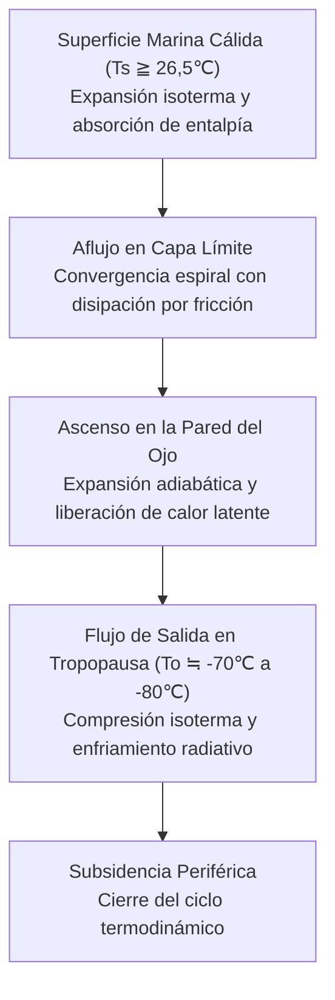
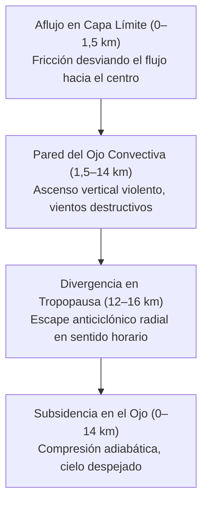
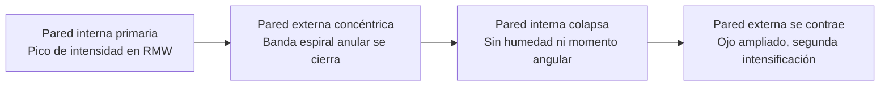
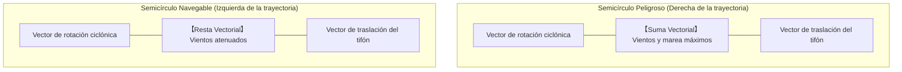
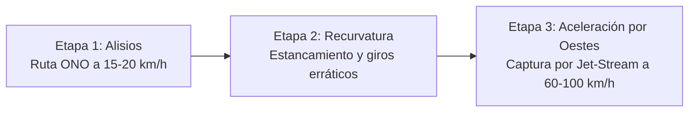
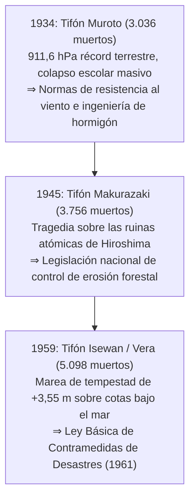
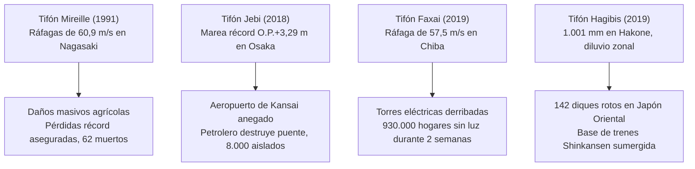
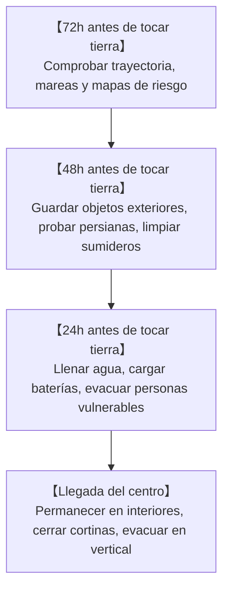
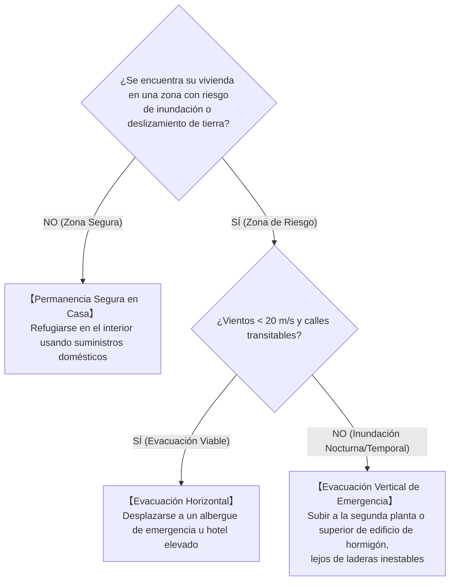

## Introducción: Enfrentando a los Colosales Motores Térmicos del Océano y la Atmósfera

Sobre las cálidas aguas tropicales bañadas por un sol abrasador, asciende una corriente continua de vapor de agua. Impulsada por la fuerza de Coriolis de la rotación terrestre, esta masa convectiva se autoorganiza en un vórtice atmosférico de cientos a más de mil kilómetros de diámetro: el **Tifón (Ciclón Tropical)**.

Los tifones actúan como válvulas termodinámicas vitales para el planeta, transportando los excesos térmicos de las bajas latitudes hacia los polos. Sin embargo, al tocar tierra firme, su tríada destructiva – vientos huracanados, mareas de tempestad sobrecogedoras y precipitaciones torrenciales ininterrumpidas – es capaz de pulverizar las infraestructuras modernas en pocas horas.

El archipiélago japonés se encuentra bajo la ruta directa de recurvatura hacia los vientos del oeste. Tres calamidades colosales de la era Showa – el Tifón Muroto (1934), el Tifón Makurazaki (1945) y el Tifón de la Bahía de Ise (Vera, 1959) – cobraron miles de vidas y sentaron las bases de la Ley Básica de Contramedidas de Desastres y la ingeniería hidráulica moderna. En el siglo XXI, el calentamiento global agrava estos fenómenos: la inundación del Aeropuerto Internacional de Kansai (Tifón Jebi, 2018), el apagón prolongado de Tokio (Tifón Faxai, 2019) y la rotura de 142 diques (Tifón Hagibis, 2019). Este compendio ofrece un marco científico y operativo para salvaguardar vidas humanas ante amenazas climáticas extremas.

---

## 1. Termodinámica y Mecanismos de Génesis: El Tifón como Motor de Carnot

### 1.1 Clasificación Internacional y Umbrales
En meteorología dinámica, los centros de baja presión con núcleo cálido marino se denominan **Ciclones Tropicales**:

| Clasificación | Cuenca Oceánica | Estándar de Viento Sostenido | Criterio Umbral |
| :--- | :--- | :--- | :--- |
| **Tifón (JMA)** | Pacífico Noroccidental & Mar de China | **Viento sostenido en 10 min** | $\ge 34\,\text{nudos}$ ($\approx 17,2\,\text{m/s}$) |
| **Tifón (JTWC)** | Pacífico Noroccidental | **Viento sostenido en 1 min** | $\ge 64\,\text{nudos}$ ($\approx 33\,\text{m/s}$, Cat. 1 equiv.) |
| **Huracán (NHC)** | Atlántico Norte, Caribe, Pacífico Nororiental | **Viento sostenido en 1 min** | $\ge 64\,\text{nudos}$ ($\approx 33\,\text{m/s}$) |
| **Ciclón Severo** | Océano Índico, Pacífico Suroccidental | Media en 3 o 10 min | $\ge 34$ o $\ge 64\,\text{nudos}$ |

Categorización de la Agencia Meteorológica de Japón (JMA):
- **Tifón Fuerte**: $33\,\text{m/s} \sim 44\,\text{m/s}$ (64–84 nudos)
- **Tifón Muy Fuerte**: $44\,\text{m/s} \sim 54\,\text{m/s}$ (85–104 nudos)
- **Tifón Violento**: $\ge 54\,\text{m/s}$ ($\ge 105\,\text{nudos}$)

---

### 1.2 Ciclo de Carnot e Intensidad Potencial Máxima (MPI)
Kerry Emanuel (MIT) demostró que el tifón maduro funciona como un **Motor Térmico de Carnot**:

Eficiencia termodinámica $\epsilon$:

$$\epsilon = \frac{T_s - T_o}{T_s}$$

Para $T_s \approx 300\,\text{K}$ ($27^\circ\text{C}$) y $T_o \approx 200\,\text{K}$ ($-73^\circ\text{C}$), la eficiencia es del $33\%$. La Intensidad Potencial Máxima (MPI) rige la velocidad del viento $V_{\max}$:

$$V_{\max}^2 \approx \frac{C_k}{C_D} \frac{T_s - T_o}{T_o} \left( k_s^* - k \right)$$

Un aumento de solo $1^\circ\text{C}$ en la temperatura marina intensifica de manera exponencial el desequilibrio entálpico $(k_s^* - k)$.

---

### 1.3 Condiciones Fundamentales
1. **Temperatura superficial del mar (SST) $\ge 26,5^\circ\text{C}$**: Mantiene las tasas de evaporación requeridas para alimentar el calor latente.
2. **Potencial Térmico Ciclónico (TCHP)**: Capa cálida de al menos 50 m a 100 m de profundidad para neutralizar la surgencia fría (upwelling).
3. **Parámetro de Coriolis ($f = 2\Omega\sin\phi$) en latitudes $>5^\circ$**: Necesario para proporcionar vorticidad inicial.
4. **Cizalladura vertical del viento débil (VWS $< 10\,\text{m/s}$)**: La cizalladura fuerte destruye la alineación vertical del núcleo cálido.
5. **Teorías CISK y WISHE**: La inestabilidad condicional de segundo tipo y la evaporación retroalimentada por el viento ($F_k \propto v$) posibilitan la intensificación rápida.

---

## 2. Estructura Tridimensional y Dinámica de Vórtices

### 2.1 Circulación 3D

- **Conservación del momento angular**: $M = vr + \frac{1}{2}fr^2 = \text{const}$. Al contraerse el radio ($r \to 0$), la aceleración centrífuga se eleva de forma cúbica ($r^{-3}$), bloqueando la penetración en el centro y forzando la subsidencia descendente que evapora las nubes en el **Ojo**.
- **Reemplazo de la pared del ojo (ERC)**: En supertifones, una banda exterior anular ahoga a la pared interna, que colapsa antes de que la nueva pared se contraiga y ensanche el campo destructivo.

- **Semicírculo Peligroso**: A la derecha de la trayectoria en el hemisferio norte, la velocidad de traslación se suma al viento rotacional ($v_{\text{net}} = v_{\text{rot}} + v_{\text{trans}}$), maximizando mareas y vendavales.

---

## 3. Cinemática de Trayectorias y Transición Extratropical (ET)

### 3.1 Flujos Directores y Recurvatura
Guiados por el anticiclón subtropical, los tifones recurvan hacia los oestes de latitudes medias acelerando a 60–100 km/h.

### 3.2 Efecto Beta y Efecto Fujiwhara
La variación de Coriolis con la latitud ($\beta = df/dy$) produce una deriva autónoma al **noroeste**. Al aproximarse dos vórtices a menos de 1.500 km, interactúan ciclónicamente (**Efecto Fujiwhara**).

### 3.3 Transición Extratropical (ET)
El tifón cambia su motor: del calor latente a los gradientes térmicos baroclinos, ampliando el radio de vendavales a **cientos de kilómetros**.

---

## 4. Los Tres Grandes Tifones de Showa

- **Muroto (1934)**: $911,6\,\text{hPa}$ (récord terrestre japonés); más de 260 colegios de madera colapsados en Osaka con 600 escolares fallecidos.
- **Makurazaki (1945)**: Azotó Hiroshima tras la rendición bélica; colosales flujos de lodo barrieron hospitales de campaña (3.756 fallecidos en total).
- **Isewan / Vera (1959)**: Catástrofe de marea de tempestad ($+3,55\,\text{m}$ en Nagoya) con troncos de maderas flotantes que actuaron como arietes demoliendo diques (5.098 víctimas fatales).

---

## 5. Inundaciones y Siniestros Marítimos Históricos

- **Kathleen (1947)**: Rotura del río Tone que inundó Tokio (1.930 muertos), sentando las bases del plan metropolitano de contención.
- **Toya Maru (1954)**: 5 transbordadores ferroviarios hundidos en el estrecho de Tsugaru ($57\,\text{m/s}$, 1.430 víctimas), impulsando el túnel submarino de Seikan.
- **Kanogawa (1958)**: $750\,\text{mm}$ en la península de Izu con lahares devastadores y 300.000 viviendas anegadas en Tokio.

---

## 6. Tifones Extremos Contemporáneos y Crisis Climática

- **Mireille (1991)**: Ráfagas de $60,9\,\text{m/s}$ en Nagasaki que arrasaron plantaciones agrícolas e inmuebles históricos.
- **Jebi (2018)**: Marea de $+3,29\,\text{m}$ que inundó el Aeropuerto de Kansai; petrolero a la deriva destruyó el puente de acceso aislando a 8.000 viajeros.
- **Faxai (2019)**: Ráfagas de $57,5\,\text{m/s}$ que derribaron torres de alta tensión en Chiba (930.000 hogares sin luz durante dos semanas).
- **Hagibis (2019)**: $1.001\,\text{mm}$ de precipitación en Hakone provocaron 142 roturas de diques fluviales y sumergieron trenes bala Shinkansen.

---

## 7. Monstruos Tropicales Globales y Proyecciones

- **Tip (1979)**: Récord mundial de presión mínima (**$870\,\text{hPa}$**) y 2.220 km de diámetro.
- **Haiyan / Yolanda (2013)**: Rachas de **$378\,\text{km/h}$** y marea de tempestad vertical con 7.300 víctimas en Filipinas.
- **Katrina (2005) & Sandy (2012)**: Sumergieron Nueva Orleans y el metro de Nueva York.
- **Proyecciones IPCC AR6**: Mayor proporción de huracanes Cat. 4–5, precipitaciones un 7% más intensas por cada $1^\circ\text{C}$ de calentamiento.

---

## 8. Física del Daño: Viento, Mareas e Inundaciones Complejas

### 8.1 Carga Dinámica del Viento
La presión dinámica del viento sigue la ley cuadrática:

$$P = \frac{1}{2} \rho v^2 C_f$$

Duplicar la velocidad del viento multiplica la carga estructural por cuatro; triplicarla la multiplica por nueve.

### 8.2 Mecánica de la Marea de Tempestad
$$\Delta h = \Delta h_p + \Delta h_w$$
Con el efecto barómetro inverso ($\Delta h_p \approx 1\,\text{cm/hPa}$) y el apilamiento por viento ($\frac{\partial h_w}{\partial x} \approx \frac{\rho_a C_D v^2}{\rho_w g H}$), inversamente proporcional a la profundidad $H$.

### 8.3 Inundaciones Compuestas
Desbordamiento fluvial, erosión de taludes traseros de diques, inundación pluvial por cierre de compuertas y efecto de remanso (Backwater).

---

## 9. Alerta Temprana y Estrategia de Supervivencia

### 9.1 Sistema de Alertas Kikikuru
| Nivel | Color | Alerta Oficial | Acción Civil Requerida |
| :--- | :--- | :--- | :--- |
| **Extremadamente Peligroso** | **Morado Oscuro** | **Nivel 4: Orden de Evacuación** | **Evacuación debe estar totalmente completada** |
| **Muy Peligroso** | **Morado Claro** | **Nivel 4: Orden de Evacuación** | Evacuación inmediata de todos |
| **Alerta** | **Rojo** | **Nivel 3: Evacuación Mayores** | Mayores y niños evacuan ya |
| **Atención** | **Amarillo** | **Nivel 2: Aviso de Lluvia/Inundación** | Revisar rutas y mochila |
| **Desastre Ocurrido** | **Negro** | **Nivel 5: Seguridad de Emergencia** | **Peligro mortal: Refugio vertical inmediato** |

---

### 9.2 Plan de Acción 72h antes del Impacto

### 9.3 Autodefensa en el Hogar
- **Mito de la cinta adhesiva en ventanas**: Pegar cintas no impide la rotura mecánica. La protección real exige persianas exteriores de seguridad, láminas antiesquirlas y **cortinas opacas pesadas aseguradas con pinzas**.
- **Reflujo de aguas residuales**: Colocar bolsas dobles de basura con agua en inodoros y sumideros de planta baja.
- **Reservas para 14 días**: 3 litros de agua/persona/día, hornillos portátiles con 28 a 42 cartuchos de gas, baterías portátiles (1.000–2.000 Wh) y 70 kits de inodoro químico de emergencia por persona.

### 9.4 Toma de Decisión: Evacuación Horizontal o Vertical

---

## Conclusión: El Escudo de la Ciencia y la Fortaleza de la Imaginación

Frente a la energía termodinámica planetaria de los tifones, la sociedad se defiende mediante dos pilares: el **Escudo de la Ciencia** – la comprensión de los fluidos y la lectura de las alertas tempranas – y la **Fortaleza de la Imaginación** – rompiendo el sesgo de normalidad para anticipar el peor escenario y actuar con tiempo.
