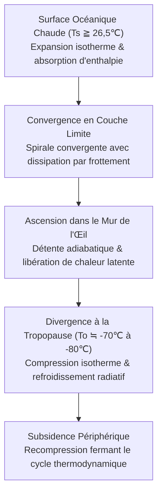
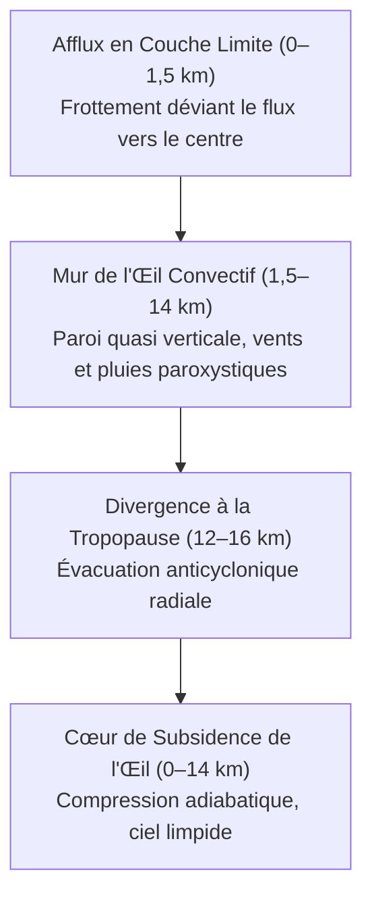
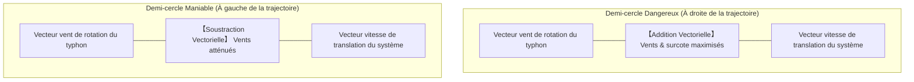
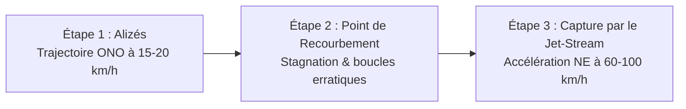
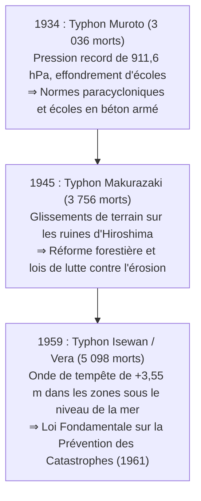
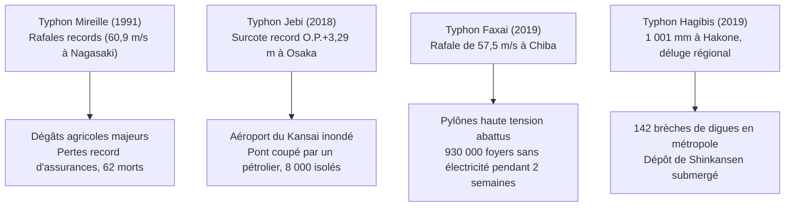
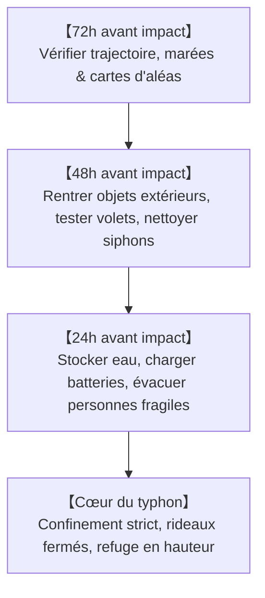
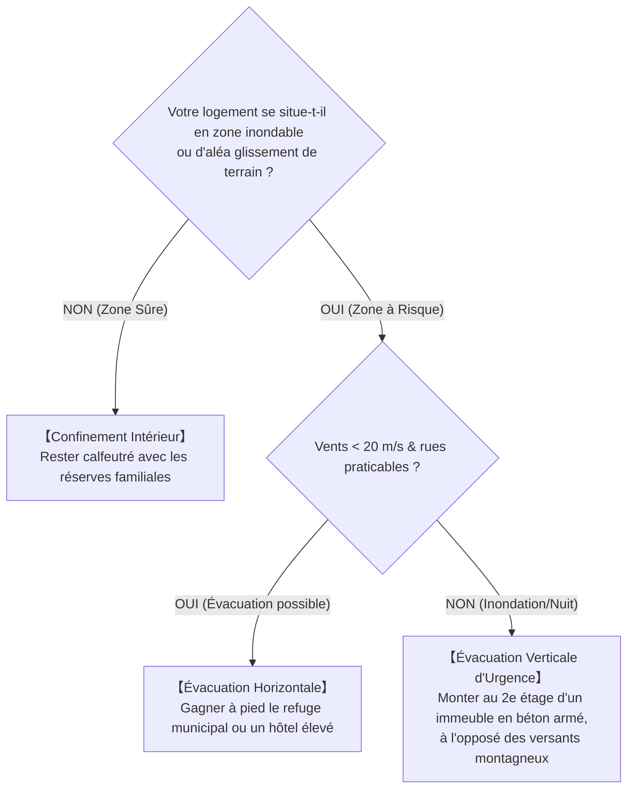

## Introduction : Face aux Gigantesques Moteurs Thermiques Océan-Atmosphère

Au-dessus des eaux tropicales surchauffées par un soleil de plomb, de puissantes colonnes de vapeur d'eau s'élèvent. Mises en rotation par la force de Coriolis induite par la rotation terrestre, ces amas convectifs s'auto-organisent en un gigantesque vortex atmosphérique s'étendant sur des centaines à plus d'un millier de kilomètres : le **Typhon (Cyclone Tropical)**.

Véritables soupapes de sécurité thermodynamiques planétaires, les typhons transfèrent l'excédent thermique équatorial vers les puits froids polaires. Toutefois, lorsqu'ils percutent les zones littorales, leur redoutable triade dévastatrice – vents orageux d'une violence extrême, ondes de tempête submergeant les digues et pluies torrentielles diluviennes – anéantit les infrastructures modernes en quelques heures.

L'archipel japonais se situe directement sur le couloir de trajectoire où les typhons du Pacifique Nord-Ouest s'incurvent dans les vents d'ouest des moyennes latitudes. Trois tragédies majeures de l'ère Showa – les typhons Muroto (1934), Makurazaki (1945) et la baie d'Ise (Typhon Vera, 1959) – ont chacune causé la mort de plusieurs milliers de citoyens, donnant naissance à la législation moderne de prévention des catastrophes et aux normes de construction parasismiques et paracycloniques. Au XXIe siècle, le changement climatique engendre des comportements extrêmes : l'inondation intégrale de l'aéroport du Kansai (Typhon Jebi, 2018), le black-out électrique durable de Tokyo (Typhon Faxai, 2019) et la rupture simultanée de 142 digues fluviales (Typhon Hagibis, 2019). Ce traité propose une synthèse scientifique et tactique exhaustive pour faire face à cette nouvelle ère météorologique.

---

## 1. Thermodynamique et Genèse : Le Typhon comme Moteur de Carnot

### 1.1 Classifications Internationales et Seuils Opérationnels
Dans la dynamique atmosphérique, les tourbillons à cœur chaud alimentés par l'océan sont désignés sous le terme de **Cyclones Tropicaux** :

| Classification | Bassin Océanique | Norme de Mesure du Vent | Seuil Critique |
| :--- | :--- | :--- | :--- |
| **Typhon (JMA)** | Pacifique Nord-Ouest & Mer de Chine | **Vent soutenu moyen sur 10 min** | $\ge 34\,\text{nœuds}$ ($\approx 17,2\,\text{m/s}$) |
| **Typhon (JTWC)** | Pacifique Nord-Ouest | **Vent soutenu moyen sur 1 min** | $\ge 64\,\text{nœuds}$ ($\approx 33\,\text{m/s}$, équivalent Cat. 1) |
| **Ouragan (NHC)** | Atlantique Nord, Caraïbes, Pacifique Nord-Est | **Vent soutenu moyen sur 1 min** | $\ge 64\,\text{nœuds}$ ($\approx 33\,\text{m/s}$) |
| **Cyclone Sévère** | Océan Indien, Pacifique Sud-Ouest | Moyenne sur 3 ou 10 min | $\ge 34$ ou $\ge 64\,\text{nœuds}$ |

L'Agence Météorologique du Japon (JMA) gradue les typhons selon leur intensité :
- **Typhon Fort** : $33\,\text{m/s} \sim 44\,\text{m/s}$ (64–84 nœuds)
- **Typhon Très Fort** : $44\,\text{m/s} \sim 54\,\text{m/s}$ (85–104 nœuds)
- **Typhon Violent** : $\ge 54\,\text{m/s}$ ($\ge 105\,\text{nœuds}$)

---

### 1.2 Modèle du Cycle de Carnot et Théorie MPI
Kerry Emanuel (MIT) a formulé la dynamique cyclonique sous forme de **Moteur Thermique de Carnot** :

Le rendement thermodynamique $\epsilon$ est régi par :

$$\epsilon = \frac{T_s - T_o}{T_s}$$

Avec $T_s \approx 300\,\text{K}$ ($27^\circ\text{C}$) et $T_o \approx 200\,\text{K}$ ($-73^\circ\text{C}$), l'efficacité atteint environ $33\%$. L'intensité potentielle maximale (MPI) définit la vitesse théorique maximale des vents $V_{\max}$ :

$$V_{\max}^2 \approx \frac{C_k}{C_D} \frac{T_s - T_o}{T_o} \left( k_s^* - k \right)$$

Une élévation d'à peine $1^\circ\text{C}$ de la température de surface marine démultiplie le déséquilibre d'enthalpie $(k_s^* - k)$ et propulse l'énergie cinétique destructive vers de nouveaux sommets.

---

### 1.3 Conditions Indispensables à la Cyclogenèse
1. **Température de surface de la mer (SST) $\ge 26,5^\circ\text{C}$** : Nécessaire à l'évaporation intense qui alimente le moteur à condensation latente.
2. **Potentiel Thermique des Cyclones Tropicaux (TCHP)** : Couche chaude de plus de 50 à 100 m d'épaisseur pour éviter l'upwelling (remontée d'eau froide) qui étouffe le typhon.
3. **Paramètre de Coriolis ($f = 2\Omega\sin\phi$) à des latitudes $>5^\circ$** : Force centrifuge nécessaire à la mise en rotation du tourbillon.
4. **Faible Cisaillement Vertical du Vent (VWS $< 10\,\text{m/s}$)** : Un fort cisaillement disperse le cœur chaud d'altitude et brise la cheminée convective.
5. **Théories CISK et WISHE** : L'instabilité conditionnelle de second type (CISK) et le transfert thermique air-mer induit par le vent (WISHE, $F_k \propto v$) expliquent l'intensification explosive autonome.

---

## 2. Structure Tridimensionnelle et Équilibres Hydrodynamiques

### 2.1 Dynamique de Circulation 3D

- **Afflux en couche limite (0–1,5 km)** : Le frottement dévie le flux au travers des isobares vers le centre dépressionnaire.
- **Cheminée convective du mur de l'œil (1,5–14 km)** : Barrière dynamique où les vents et les précipitations culminent avec une rare furie.
- **Panache d'évacuation à la tropopause (12–16 km)** : Divergence anticyclonique évacuant les masses d'air.

### 2.2 L'Œil : Conservation du Moment Cinétique
L'œil se forme par conservation du moment cinétique absolu :

$$M = v r + \frac{1}{2} f r^2 = \text{const}$$

À mesure que le rayon $r \to 0$, l'accélération centrifuge ($v^2/r$) croît en $r^{-3}$, créant un mur infranchissable au Rayon des Vents Maximaux (RMW). À l'intérieur, une subsidence forcée compresse et réchauffe l'air adiabatiquement ($9,8^\circ\text{C/km}$), évaporant toute nébulosité.

### 2.3 Remplacement du Mur de l'Œil (ERC)

### 2.4 Demi-cercle Dangereux et Demi-cercle Maniable

---

## 3. Cinématique des Trajectoires et Transition Extratropicale (ET)

### 3.1 Flux Directeurs et Anticyclone Subtropical
Les typhons sont guidés par les flux directeurs troposphériques profonds.

### 3.2 Recourbement et Prévisions d'Ensemble

### 3.3 Effet Bêta et Effet Fujiwhara
En raison du gradient latitudinal de Coriolis ($\beta = df/dy$), le typhon dérive vers le **nord-ouest**. Deux typhons distants de moins de 1 500 km interagissent selon l'**effet Fujiwhara**.

### 3.4 Transition Extratropicale (ET)
Le typhon bascule son moteur : de la chaleur latente vers les gradients thermiques baroclines. Le champ de vents violents s'étend de 50 km à **plusieurs centaines de kilomètres**.

---

## 4. Les Trois Grands Typhons de Showa et Catastrophes Historiques

- **Muroto (1934)** : Pression terrestre record de $911,6\,\text{hPa}$; rafales à plus de $60\,\text{m/s}$ détruisant 260 écoles en bois à Osaka (600 écoliers tués).
- **Makurazaki (1945)** : Frappant Hiroshima un mois après la bombe atomique ($916,3\,\text{hPa}$), des coulées de boue massives anéantirent les hôpitaux militaires (3 756 morts au total).
- **Isewan / Vera (1959)** : Plus meurtrière onde de tempête du Japon contemporain ($+3,55\,\text{m}$ à Nagoya), transformant les stocks de grumes flottantes en béliers destructeurs. 5 098 morts déclenchèrent l'adoption de la Loi Fondamentale de Prévention de 1961.

---

## 5. Inondations et Naufrages Majeurs

- **Kathleen (1947)** : Rupture des digues de la Tone submergeant Tokyo (1 930 morts); point de départ du schéma d'endiguement métropolitain.
- **Toya Maru (1954)** : 5 ferries coulés dans le détroit de Tsugaru ($57\,\text{m/s}$, 1 430 morts), entraînant le percement du tunnel sous-marin du Seikan.
- **Kanogawa (1958)** : $750\,\text{mm}$ de pluie sur la péninsule d'Izu entraînant des laves torrentielles et inondant 300 000 habitations à Tokyo.

---

## 6. Typhons Extrêmes Contemporains et Changement Climatique

- **Mireille (1991)** : Rafale de $60,9\,\text{m/s}$ à Nagasaki, vergers de pommes d'Aomori ravagés, records historiques d'indemnisation assurantielle.
- **Jebi (2018)** : Submersion de l'aéroport du Kansai ($+3,29\,\text{m}$), pétrolier dérivant détruisant le pont d'accès, 8 000 passagers piégés.
- **Faxai (2019)** : Rafales à $57,5\,\text{m/s}$ à Chiba abattant les pylônes haute tension; deux semaines de black-out complet.
- **Hagibis (2019)** : $1 001\,\text{mm}$ de pluie à Hakone, 142 brèches de digues sur 71 cours d'eau, rames de Shinkansen noyées.

---

## 7. Monstres Mondiaux et Projections IPCC

- **Tip (1979)** : Record mondial de basse pression (**$870\,\text{hPa}$**) et diamètre record de 2 220 km.
- **Haiyan / Yolanda (2013)** : Rafales à **$378\,\text{km/h}$** et onde de tempête verticale faisant plus de 7 300 morts à Tacloban.
- **Ouragans Katrina (2005) & Sandy (2012)** : Submersion de La Nouvelle-Orléans et du métro new-yorkais.
- **Rapport AR6 du GIEC** : Hausse de la proportion de cyclones Cat. 4–5, intensification des précipitations (+7% par $1^\circ\text{C}$), ralentissement de la vitesse de translation.

---

## 8. Physique des Dégâts : Vents, Surcotes et Inondations Complexes

### 8.1 Pression Dynamique du Vent
La pression dynamique du vent varie selon la loi au carré :

$$P = \frac{1}{2} \rho v^2 C_f$$

Doubler la vitesse du vent quadruple les contraintes structurelles ; la tripler les multiplie par neuf.

### 8.2 Hydrodynamique des Ondes de Tempête
$$\Delta h = \Delta h_p + \Delta h_w$$
L'onde associe l'effet baromètre inverse ($\Delta h_p \approx 1\,\text{cm/hPa}$) et l'entassement par le vent ($\frac{\partial h_w}{\partial x} \approx \frac{\rho_a C_D v^2}{\rho_w g H}$). Dans les baies peu profondes ($H$ faible), les masses d'eau s'accumulent de manière cataclysmique.

### 8.3 Inondations Composées
- Débordement fluvial et affouillement des talus de digues.
- Inondation pluviale urbaine par fermeture des vannes d'évacuation.
- Effet de refoulement (Backwater) sur les affluents.

---

## 9. Météorologie de Pointe et Stratégie de Survie

### 9.1 Système d'Alerte Kikikuru
| Niveau | Couleur | Alerte Légale | Action Civile Impérative |
| :--- | :--- | :--- | :--- |
| **Extrêmement Dangereux** | **Violet Foncé** | **Niveau 4 : Ordre d'Évacuation** | **Évacuation complète déjà achevée** |
| **Très Dangereux** | **Violet Clair** | **Niveau 4 : Ordre d'Évacuation** | Évacuation immédiate de tous |
| **Vigilance** | **Rouge** | **Niveau 3 : Évacuation Vulnérables** | Seniors et enfants évacuent |
| **Pré-alerte** | **Jaune** | **Niveau 2 : Avis de Pluie/Inondation** | Vérifier kits et itinéraires |
| **Catastrophe en cours** | **Noir** | **Niveau 5 : Sauvegarde d'Urgence** | **Péril vital : Évacuation verticale immédiate** |

---

### 9.2 Chronologie 72h avant Impact

### 9.3 Autodéfense Logistique
- **Mythe du ruban adhésif** : Coller du scotch ne protège pas du bris de verre ; volets métalliques, films antidéflagrants et **rideaux occultants épais clipsés** sont indispensables.
- **Refoulement des égouts** : Sacs poubelles étanches remplis d'eau dans les cuvettes de WC et siphons au rez-de-chaussée.
- **Autonomie 14 jours** : 3L d'eau/personne/jour, réchaud avec 28 à 42 cartouches de gaz, batterie 1 000–2 000 Wh, 70 sacs de toilettes chimiques par personne.

### 9.4 Décision : Évacuation Horizontale ou Verticale

---

## Conclusion : Le Bouclier de la Science et la Forteresse de l'Imagination

Face à la fureur thermodynamique des typhons, la société humaine s'appuie sur deux bastions : le **Bouclier de la Science** – la compréhension des lois physiques et l'écoute des prévisions – et la **Forteresse de l'Imagination** – briser le biais d'optimisme pour anticiper les pires scénarios et agir sans délai.
