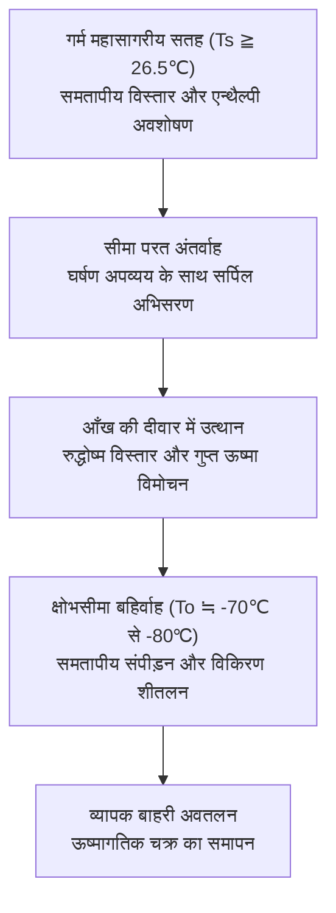
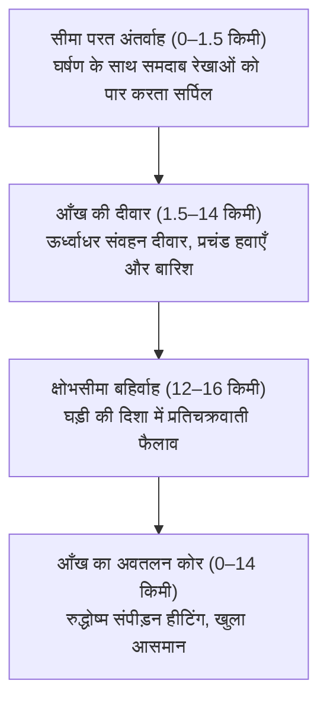
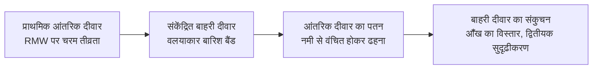
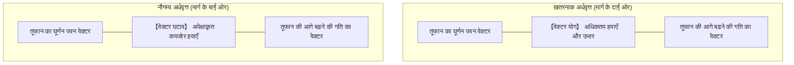
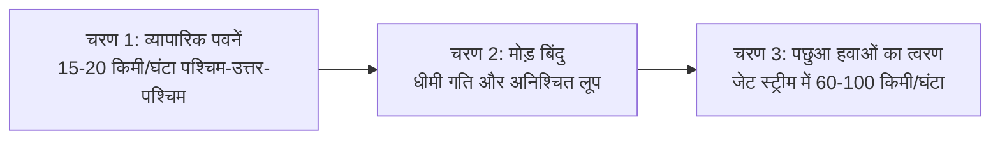
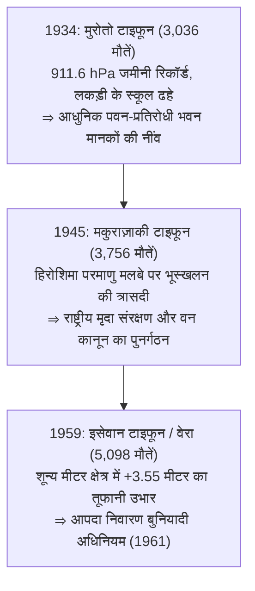
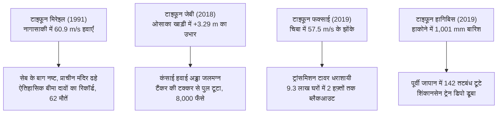
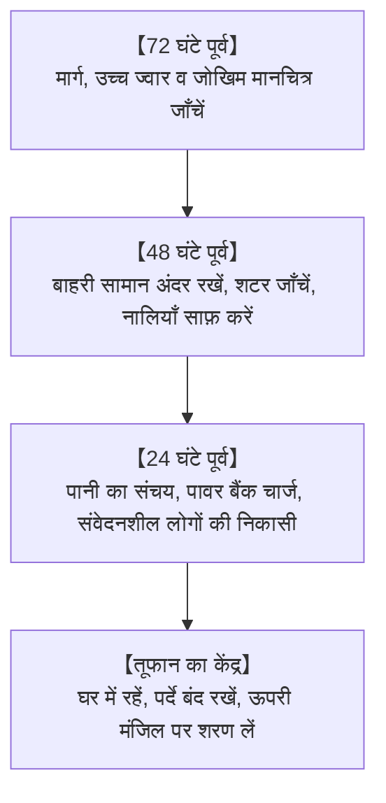
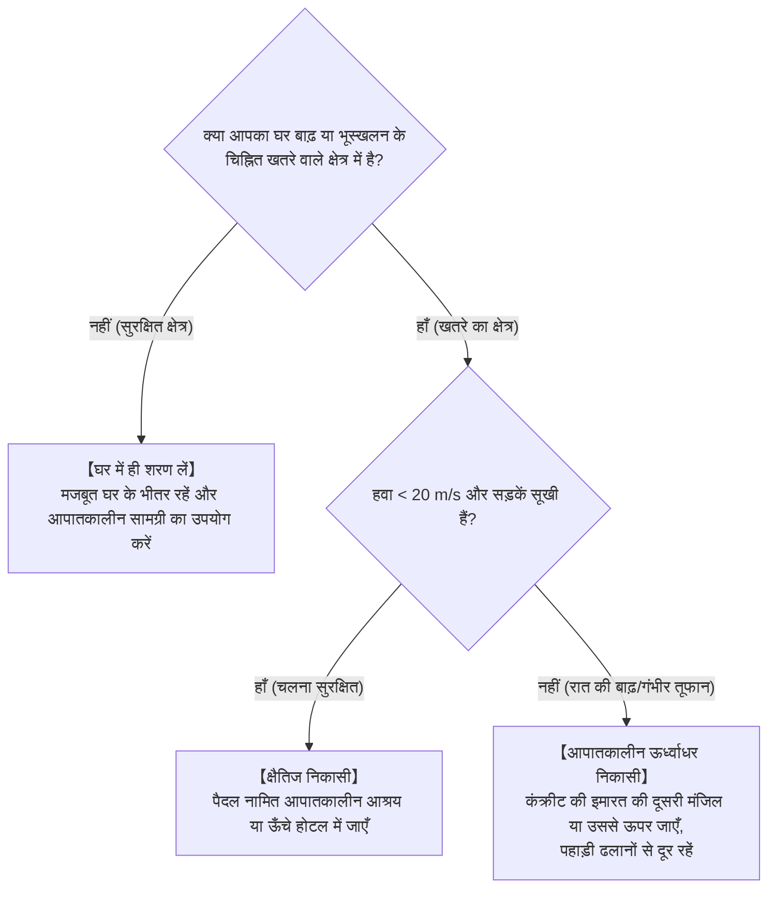

## प्रस्तावना: वायुमंडल और महासागर के विशाल ताप इंजनों का सामना

तपते उष्णकटिबंधीय महासागर की सतह से जलवाष्प के विशाल स्तंभ ऊपर उठते हैं। पृथ्वी के घूर्णन द्वारा उत्पन्न कोरिओलिस बल के प्रभाव में यह संवहन घूमना शुरू करता है और सैकड़ों से हजारों किलोमीटर में फैले एक विशाल वायुमंडलीय परिसंचरण में संगठित हो जाता है: **टाइफून (उष्णकटिबंधीय चक्रवात: Tropical Cyclone)** ।

टाइफून पृथ्वी के सबसे शक्तिशाली ऊष्मागतिकीय सुरक्षा वाल्व के रूप में कार्य करते हैं, जो भूमध्यरेखीय क्षेत्रों से अतिरिक्त सौर ताप को ध्रुवों की ओर ले जाते हैं। लेकिन जब वे मानव बस्तियों से टकराते हैं, तो उनकी विनाशकारी तिकड़ी — भयंकर तूफानी हवाएँ, तटों को निगलने वाला तूफानी उभार (Storm Surge), और मूसलाधार बारिश — कुछ ही घंटों में आधुनिक बुनियादी ढांचे को तहस-नहस कर सकती है।

जापानी द्वीपसमूह उत्तर-पश्चिमी प्रशांत टाइफून के सीधे मार्ग में स्थित है। शोवा युग की तीन महाविपत्तियों — मुरोतो टाइफून (1934), मकुराज़ाकी टाइफून (1945), और इसेवान टाइफून (वेरा, 1959) — ने हजारों जानें लीं और आधुनिक आपदा प्रबंधन कानून व तटबंध इंजीनियरिंग को जन्म दिया। 21वीं सदी में जलवायु परिवर्तन के कारण स्थितियाँ और विकट हो गई हैं: कंसाई हवाई अड्डे का जलमग्न होना (टाइफून जेबी, 2018), हफ़्तों तक बिजली गुल रहना (टाइफून फक्साई, 2019), और 142 नदी तटबंधों का टूटना (टाइफून हागिबिस, 2019)। यह मार्गदर्शिका इस नए युग में जीवन की रक्षा के लिए वैज्ञानिक और व्यावहारिक समझ प्रदान करती है।

---

## 1. ऊष्मागतिकी और उत्पत्ति तंत्र: कार्नो ताप इंजन के रूप में टाइफून

### 1.1 अंतर्राष्ट्रीय वर्गीकरण और हवा की गति मानक
गतिशील मौसम विज्ञान में, गर्म महासागरीय कोर द्वारा संचालित कम दबाव वाले चक्रवातों को **उष्णकटिबंधीय चक्रवात** कहा जाता है:

| वर्गीकरण | महासागरीय बेसिन | हवा की गति मानक | सीमा मानदंड |
| :--- | :--- | :--- | :--- |
| **टाइफून (JMA)** | उत्तर-पश्चिमी प्रशांत और दक्षिण चीन सागर | **10 मिनट का अधिकतम औसत** | $\ge 34\,\text{knots}$ ($\approx 17.2\,\text{m/s}$) |
| **टाइफून (JTWC)** | उत्तर-पश्चिमी प्रशांत | **1 मिनट का अधिकतम औसत** | $\ge 64\,\text{knots}$ ($\approx 33\,\text{m/s}$, श्रेणी 1) |
| **हरीकेन (NHC)** | उत्तरी अटलांटिक, कैरिबियन, उत्तर-पूर्वी प्रशांत | **1 मिनट का अधिकतम औसत** | $\ge 64\,\text{knots}$ ($\approx 33\,\text{m/s}$) |
| **गंभीर चक्रवाती तूफान** | हिंद महासागर, दक्षिण-पश्चिम प्रशांत | 3 या 10 मिनट का औसत | $\ge 34$ या $\ge 64\,\text{knots}$ |

जापान मौसम विज्ञान एजेंसी (JMA) तीव्रता के आधार पर वर्गीकरण:
- **मजबूत टाइफून** : $33\,\text{m/s} \sim 44\,\text{m/s}$ (64–84 नॉट्स)
- **बहुत मजबूत टाइफून** : $44\,\text{m/s} \sim 54\,\text{m/s}$ (85–104 नॉट्स)
- **प्रचंड टाइफून** : $\ge 54\,\text{m/s}$ ($\ge 105\,\text{नॉट्स}$)

---

### 1.2 कार्नो चक्र मॉडल और अधिकतम संभावित तीव्रता (MPI) सिद्धांत
एमआईटी के प्रोफेसर केरी इमैनुएल (Kerry Emanuel) ने टाइफून को एक स्थूल **कार्नो ताप इंजन (Carnot Heat Engine)** के रूप में तैयार किया:

तापीय दक्षता $\epsilon$:

$$\epsilon = \frac{T_s - T_o}{T_s}$$

उष्णकटिबंधीय जल में $T_s \approx 300\,\text{K}$ ($27^\circ\text{C}$) और $T_o \approx 200\,\text{K}$ ($-73^\circ\text{C}$) पर दक्षता लगभग $33\%$ होती है। अधिकतम संभावित तीव्रता (MPI) अधिकतम सैद्धांतिक हवा की गति $V_{\max}$ निर्धारित करती है:

$$V_{\max}^2 \approx \frac{C_k}{C_D} \frac{T_s - T_o}{T_o} \left( k_s^* - k \right)$$

समुद्र की सतह के तापमान में केवल $1^\circ\text{C}$ की वृद्धि एन्थैल्पी असंतुलन $(k_s^* - k)$ को काफी बढ़ा देती है, जिससे तूफान की चरम शक्ति में तीव्र वृद्धि होती है।

---

### 1.3 आवश्यक भौतिक स्थितियाँ
1. **समुद्र की सतह का तापमान (SST) $\ge 26.5^\circ\text{C}$** : वाष्पीकरण को बनाए रखने के लिए अनिवार्य।
2. **उष्णकटिबंधीय चक्रवात ताप क्षमता (TCHP)** : $26^\circ\text{C}$ से ऊपर की पानी की परत 50 से 100 मीटर गहरी होनी चाहिए ताकि ठंडे पानी का उत्प्रवाह (Upwelling) तूफान को ठंडा न कर सके।
3. **कोरिओलिस पैरामीटर ($f = 2\Omega\sin\phi$) अक्षांश $>5^\circ$ पर** : चक्रवाती घूर्णन उत्पन्न करने के लिए आवश्यक।
4. **कम ऊर्ध्वाधर पवन अपरूपण (VWS $< 10\,\text{m/s}$)** : उच्च पवन अपरूपण गर्म कोर को नष्ट कर देता है।
5. **CISK और WISHE सिद्धांत** : वायुमंडलीय अस्थिरता और हवा से प्रेरित सतह ऊष्मा विनिमय ($F_k \propto v$) तेजी से चक्रवात को शक्ति प्रदान करते हैं।

---

## 2. त्रि-आयामी भंवर संरचना और द्रव गतिकी

### 2.1 3D परिसंचरण संरचना

- **कोणीय संवेग का संरक्षण** : $M = vr + \frac{1}{2}fr^2 = \text{const}$। जैसे-जैसे त्रिज्या सिकुड़ती है ($r \to 0$), अपकेंद्री बल ($v^2/r$) $r^{-3}$ की दर से बढ़ता है, जो अधिकतम हवाओं की त्रिज्या (RMW) पर एक दीवार बनाता है। **आँख (Eye)** के अंदर हवा नीचे की ओर दबती है और रुद्धोष्म संपीड़न ($9.8^\circ\text{C/km}$) से गर्म होकर बादलों को पूरी तरह सुखा देती है।
- **आँख की दीवार प्रतिस्थापन चक्र (ERC)** : सुपर टाइफून में बाहरी संकेंद्रित दीवार आंतरिक दीवार से नमी छीन लेती है, जिससे आंतरिक दीवार ढह जाती है और तूफान का दायरा विस्तृत हो जाता है।

- **खतरनाक अर्धवृत्त (Dangerous Semicircle)** : उत्तरी गोलार्ध में मार्ग के दाईं ओर, आगे बढ़ने की गति घूर्णन गति में जुड़ जाती है ($v_{\text{net}} = v_{\text{rot}} + v_{\text{trans}}$), जिससे वहाँ सबसे प्रचंड हवाएँ और तूफानी लहरें उठती हैं।

---

## 3. प्रक्षेपवक्र गतिकी और बाह्य-उष्णकटिबंधीय संक्रमण (ET)

### 3.1 संचालन प्रवाह और मुड़ना
टाइफून उपोष्णकटिबंधीय उच्च दबाव प्रणाली के पश्चिमी किनारे के प्रवाह द्वारा निर्देशित होते हैं।

### 3.2 बीटा ड्रिफ्ट और फुजिव्हारा प्रभाव
कोरिओलिस बल में परिवर्तन के कारण टाइफून स्वतः **उत्तर-पश्चिम** की ओर झुकते हैं। जब दो टाइफून 1,500 किमी के भीतर आते हैं, तो वे एक-दूसरे के चारों ओर घूमते हैं (**फुजिव्हारा प्रभाव**)।

### 3.3 बाह्य-उष्णकटिबंधीय संक्रमण (ET)
टाइफून की ऊर्जा का स्रोत समुद्री गुप्त ऊष्मा से बारोक्लिनिक तापमान प्रवणता में बदल जाता है, जिससे तूफानी हवाओं का दायरा **सैकड़ों किलोमीटर** तक फैल जाता है।

---

## 4. शोवा युग की तीन महान आपदाएँ

- **मुरोतो (1934)** : $911.6\,\text{hPa}$ (जापान में सबसे कम दर्ज जमीनी दबाव); $60\,\text{m/s}$ से अधिक के झोंकों ने ओसाका में 260 लकड़ी के स्कूलों को ढहा दिया (600 बच्चों की मौत)।
- **मकुराज़ाकी (1945)** : हिरोशिमा पर बमबारी के ठीक एक महीने बाद आया; मलबे के बहाव ने अस्पतालों को बहा दिया (कुल 3,756 मौतें)।
- **इसेवान / वेरा (1959)** : नागोया में $+3.55\,\text{m}$ का तूफानी उभार; बहते लकड़ी के लट्ठों ने तटबंधों को तोड़ दिया (5,098 मृतक व लापता)। इसने 1961 के आपदा निवारण कानून को जन्म दिया।

---

## 5. ऐतिहासिक बाढ़ और समुद्री दुर्घटनाएँ

- **कैथलीन (1947)** : टोन नदी के तटबंध टूटने से टोक्यो जलमग्न हुआ (1,930 मौतें); टोक्यो के आधुनिक बाढ़ नियंत्रण की शुरुआत हुई।
- **तोया मारू (1954)** : त्सुगारू जलडमरूमध्य में 5 नौकाएँ डूबीं ($57\,\text{m/s}$, 1,430 मौतें), जिससे सेइकान अंडरसी टनल का निर्माण हुआ।
- **कानोगावा (1958)** : इज़ू प्रायद्वीप में $750\,\text{mm}$ बारिश से भारी भूस्खलन हुआ और टोक्यो में 3 लाख घरों में पानी भर गया।

---

## 6. समकालीन चरम टाइफून और जलवायु संकट

- **मिरेइल (1991)** : नागासाकी में $60.9\,\text{m/s}$ हवाएँ, सेब के बाग नष्ट, ऐतिहासिक बीमा दावों का रिकॉर्ड।
- **जेबी (2018)** : $+3.29\,\text{m}$ के उभार ने कंसाई हवाई अड्डे को जलमग्न कर दिया; टैंकर की टक्कर से संपर्क पुल टूट गया, 8,000 लोग फँस गए।
- **फक्साई (2019)** : चिबा में $57.5\,\text{m/s}$ के झोंके, ट्रांसमिशन टावर गिरे, दो हफ़्तों तक बिजली गुल।
- **हागिबिस (2019)** : हाकोने में $1,001\,\text{mm}$ बारिश से 142 तटबंध टूटे और शिंकानसेन ट्रेनें डूब गईं।

---

## 7. वैश्विक दैत्य चक्रवात और आईपीसीसी अनुमान

- **टिप (1979)** : दुनिया का सबसे कम दबाव (**$870\,\text{hPa}$**) और 2,220 किमी का व्यास।
- **हैयान (2013)** : **$378\,\text{km/h}$** के झोंकों और सुनामी जैसी तूफानी लहरों से फिलीपींस में 7,300 से अधिक मौतें।
- **कैटरीना (2005) और सैंडी (2012)** : न्यू ऑरलियन्स और न्यूयॉर्क मेट्रो प्रणाली को जलमग्न किया।
- **आईपीसीसी रिपोर्ट AR6** : श्रेणी 4-5 के महातूफानों का अनुपात बढ़ेगा, प्रति $1^\circ\text{C}$ तापमान वृद्धि पर वर्षा तीव्रता 7% बढ़ेगी।

---

## 8. विनाश की भौतिकी: पवन भार, तूफानी उभार और संयुक्त बाढ़

### 8.1 पवन दबाव का वर्ग नियम
हवा का गतिशील दबाव वेग के वर्ग के अनुपात में बढ़ता है:

$$P = \frac{1}{2} \rho v^2 C_f$$

हवा की गति दोगुनी होने पर संरचनात्मक भार 4 गुना और तिगुनी होने पर 9 गुना बढ़ जाता है।

### 8.2 तूफानी उभार की गतिकी
$$\Delta h = \Delta h_p + \Delta h_w$$
व्युत्क्रम बैरोमीटर प्रभाव ($\Delta h_p \approx 1\,\text{cm/hPa}$) और हवा के जमाव ($\frac{\partial h_w}{\partial x} \approx \frac{\rho_a C_D v^2}{\rho_w g H}$) से उथली खाड़ियों (इसे, टोक्यो, ओसाका) में पानी विनाशकारी रूप से जमा होता है।

### 8.3 संयुक्त बाढ़
तटबंध टूटना, आंतरिक जलभराव और मुख्य नदी के उच्च स्तर के कारण सहायक नदियों में बैकवाटर प्रभाव।

---

## 9. प्रारंभिक चेतावनी प्रणाली और जीवन रक्षा रणनीति

### 9.1 किकिकुरू (Kikikuru) चेतावनी तालिका
| स्तर | रंग | आधिकारिक चेतावनी | अनिवार्य नागरिक कार्रवाई |
| :--- | :--- | :--- | :--- |
| **अत्यधिक खतरनाक** | **गहरा बैंगनी** | **स्तर 4: निकासी आदेश** | **निकासी पूरी हो चुकी होनी चाहिए** |
| **बहुत खतरनाक** | **हल्का बैंगनी** | **स्तर 4: निकासी आदेश** | सभी नागरिकों की तत्काल निकासी |
| **चेतावनी** | **लाल** | **स्तर 3: वरिष्ठ नागरिकों की निकासी** | बुजुर्ग व बच्चे तुरंत सुरक्षित स्थान पर जाएँ |
| **सावधानी** | **पीला** | **स्तर 2: भारी वर्षा सलाह** | मार्ग और आपातकालीन बैग की जाँच करें |
| **आपदा घटित** | **काला** | **स्तर 5: आपातकालीन जीवन रक्षा** | **प्राणघातक जोखिम: तत्काल ऊर्ध्वाधर शरण लें** |

---

### 9.2 लैंडफॉल से 72 घंटे पहले की कार्ययोजना

### 9.3 घरेलू आत्मनिर्भर सुरक्षा
- **खिड़की के शीशे पर टेप लगाने का भ्रम** : क्रॉस टेप लगाने से शीशे की मजबूती नहीं बढ़ती। सही उपाय हैं: बाहरी शटर बंद करना, सुरक्षात्मक फिल्म लगाना और **भारी ब्लैकआउट पर्दे खींचकर क्लिप से बंद रखना** ।
- **सीवर बैकफ्लो से बचाव** : तूफानी बारिश के दौरान पहली मंजिल के शौचालयों और नालियों में पानी से भरी दोहरी थैलियाँ (वॉटर बैग) रखें।
- **14 दिनों का आपातकालीन भंडार** : प्रति व्यक्ति 3 लीटर पानी/दिन, गैस स्टोव व 28–42 गैस कनस्तर, 1,000–2,000 Wh का पोर्टेबल पावर स्टेशन, और प्रति व्यक्ति 70 रासायनिक शौचालय बैग।

### 9.4 निकासी निर्णय: क्षैतिज बनाम ऊर्ध्वाधर

---

## निष्कर्ष: विज्ञान की ढाल और कल्पना का दुर्ग

प्रकृति के इस विशाल वायुमंडलीय ताप इंजन के सामने मानव जाति की रक्षा दो स्तंभों पर टिकी है: **विज्ञान की ढाल** — भौतिक नियमों को समझना और मौसम पूर्वानुमान को पढ़ना — और **कल्पना का दुर्ग** — सामान्यता के पूर्वाग्रह को तोड़कर सबसे गंभीर आपदा परिदृश्य का अनुमान लगाना और समय रहते कदम उठाना।
