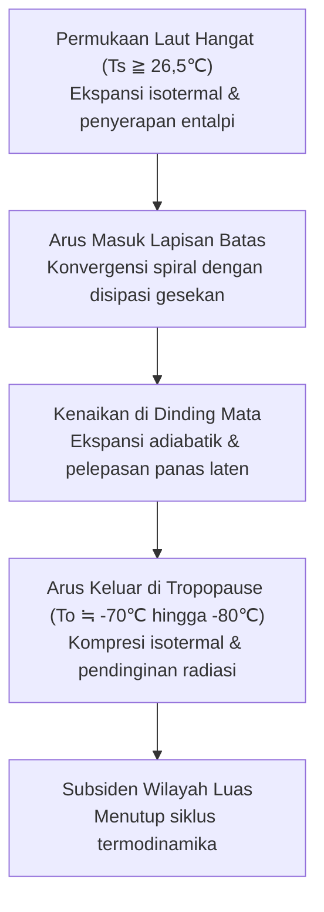
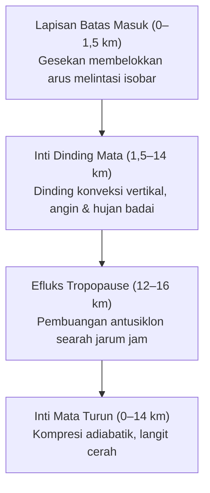
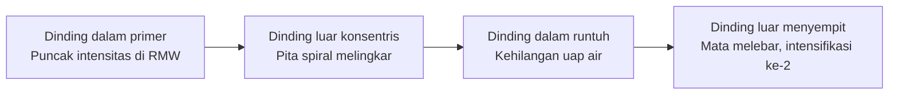
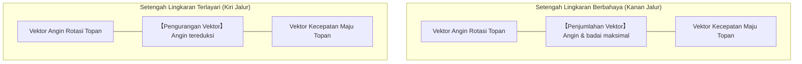
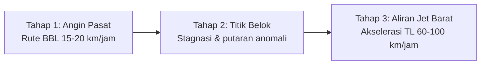
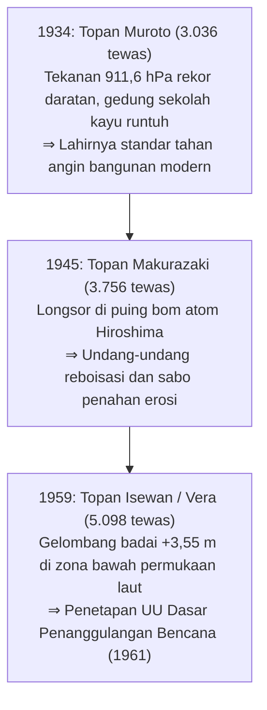
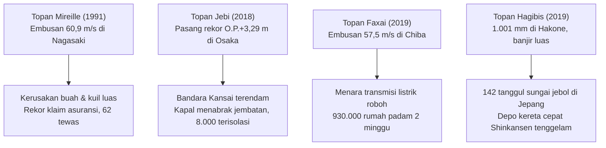
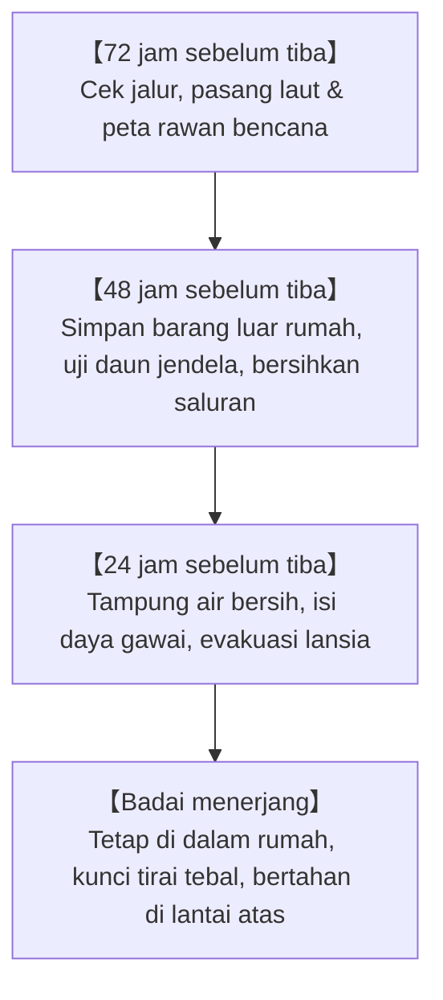
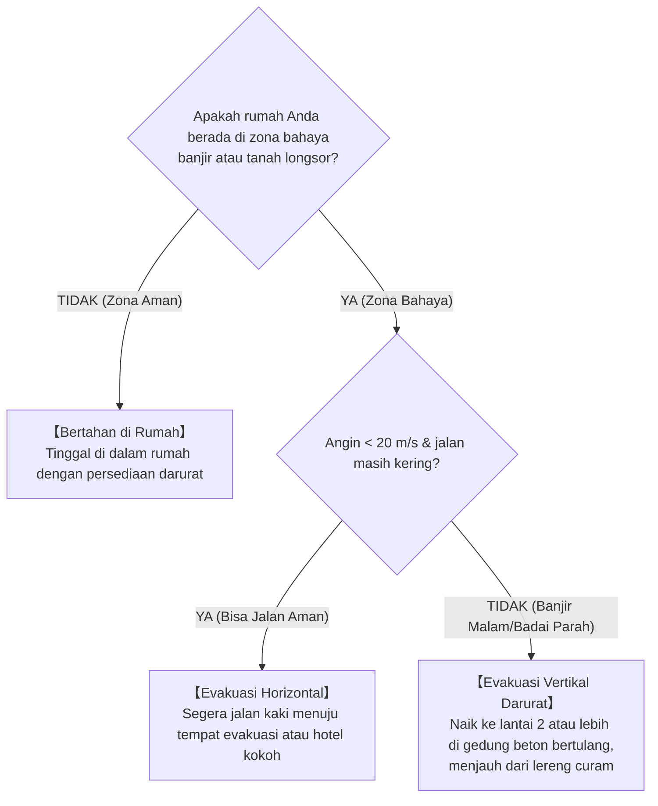

## Pendahuluan: Menghadapi Mesin Panas Raksasa Atmosfer dan Samudra

Dari hamparan samudra tropis yang dipanggang terik matahari, uap air membubung tanpa terlihat. Terputar oleh gaya Coriolis akibat rotasi bumi, gugusan awan konvektif ini berorganisasi menjadi sistem sirkulasi atmosferik raksasa berdiameter ratusan hingga ribuan kilometer: **Topan (Siklon Tropis)**.

Topan berfungsi sebagai katup pengaman termodinamika bumi, mengalirkan surplus panas matahari khatulistiwa menuju kutub. Namun, saat menyerang wilayah pesisir, triad penghancurnya – angin badai dahsyat, gelombang badai (storm surge), dan hujan lebat ekstrem – mampu meluluhlantakkan infrastruktur modern dalam beberapa jam saja.

Kepulauan Jepang berada tepat di bawah koridor utama jalur topan Pasifik Barat Laut. Tiga bencana besar era Showa – Topan Muroto (1934), Topan Makurazaki (1945), dan Topan Isewan (Vera, 1959) – masing-masing menelan ribuan korban jiwa dan mendorong lahirnya Undang-Undang Dasar Penanggulangan Bencana serta teknik penahan banjir modern. Di abad ke-21, pemanasan global memperparah bahaya: terendamnya Bandara Internasional Kansai (Topan Jebi, 2018), padamnya listrik Tokyo berminggu-minggu (Topan Faxai, 2019), dan jebolnya 142 tanggul sungai (Topan Hagibis, 2019). Panduan ini memadukan fisika fluida, sejarah bencana, dan strategi aksi bertahan hidup di era krisis iklim.

---

## 1. Termodinamika dan Terbentuknya Topan: Model Mesin Panas Carnot

### 1.1 Klasifikasi Internasional
| Klasifikasi | Wilayah Samudra | Standar Angin Maksimum | Kriteria Ambang Batas |
| :--- | :--- | :--- | :--- |
| **Topan (JMA)** | Pasifik Barat Laut & Laut Cina Selatan | **Rata-rata 10 menit** | $\ge 34\,\text{knot}$ ($\approx 17,2\,\text{m/s}$) |
| **Topan (JTWC)** | Pasifik Barat Laut | **Rata-rata 1 menit** | $\ge 64\,\text{knot}$ ($\approx 33\,\text{m/s}$, setara Kat. 1) |
| **Hurikan (NHC)** | Atlantik Utara, Karibia, Pasifik Timur Laut | **Rata-rata 1 menit** | $\ge 64\,\text{knot}$ ($\approx 33\,\text{m/s}$) |
| **Siklon Parah** | Samudra Hindia, Pasifik Barat Daya | Rata-rata 3 atau 10 menit | $\ge 34$ atau $\ge 64\,\text{knot}$ |

Klasifikasi Badan Meteorologi Jepang (JMA):
- **Topan Kuat**: $33\,\text{m/s} \sim 44\,\text{m/s}$ (64–84 knot)
- **Topan Sangat Kuat**: $44\,\text{m/s} \sim 54\,\text{m/s}$ (85–104 knot)
- **Topan Dahsyat**: $\ge 54\,\text{m/s}$ ($\ge 105\,\text{knot}$)

---

### 1.2 Model Siklus Carnot dan Intensitas Potensial Maksimum (MPI)
Kerry Emanuel (MIT) merumuskan siklon tropis sebagai **Mesin Panas Carnot**:

Efisiensi termal $\epsilon$:

$$\epsilon = \frac{T_s - T_o}{T_s}$$

Dengan $T_s \approx 300\,\text{K}$ ($27^\circ\text{C}$) dan $T_o \approx 200\,\text{K}$ ($-73^\circ\text{C}$), efisiensi mencapai sekitar $33\%$. Teori MPI menentukan kecepatan angin maksimum $V_{\max}$:

$$V_{\max}^2 \approx \frac{C_k}{C_D} \frac{T_s - T_o}{T_o} \left( k_s^* - k \right)$$

Kenaikan suhu laut sebesar $1^\circ\text{C}$ meningkatkan ketidakseimbangan entalpi $(k_s^* - k)$ secara signifikan, memperbesar daya rusak badai.

---

### 1.3 Syarat Fisik Pembentukan
1. **Suhu Permukaan Laut (SST) $\ge 26,5^\circ\text{C}$**: Mendukung penguapan hebat untuk menyuplai panas laten.
2. **Kandungan Panas Siklon Tropis (TCHP)**: Lapisan hangat setebal 50–100 m untuk mencegah upwelling air dingin mematikan topan.
3. **Parameter Coriolis ($f = 2\Omega\sin\phi$) pada lintang $>5^\circ$**: Memberikan gaya rotasi pembentuk pusaran.
4. **Geser Angin Vertikal Lemah (VWS $< 10\,\text{m/s}$)**: Menjaga struktur inti hangat vertikal tetap utuh.
5. **Teori CISK dan WISHE**: Interaksi gesekan dan panas laten (CISK) serta penguapan cepat oleh angin kencang (WISHE, $F_k \propto v$) memicu intensifikasi eksplosif.

---

## 2. Struktur Pusaran 3D dan Keseimbangan Fluida

### 2.1 Sirkulasi 3D

- **Kekekalan momentum sudut**: $M = vr + \frac{1}{2}fr^2 = \text{const}$. Saat udara memusat ($r \to 0$), percepatan sentrifugal bertambah sebesar $r^{-3}$, menghalangi penetrasi ke titik pusat dan memaksa udara turun ke bawah. Penurunan udara menghasilkan pemanasan adiabatik kering ($9,8^\circ\text{C/km}$) yang menguapkan awan di **Mata Topan**.
- **Siklus Pergantian Dinding Mata (ERC)**: Dinding mata luar melingkar memotong pasokan uap air dari dinding dalam yang kemudian runtuh, sebelum dinding baru menyempit dan memperluas medan badai.

- **Setengah Lingkaran Berbahaya**: Di belahan bumi utara, sisi kanan jalur pergerakan menggabungkan angin putaran dan laju gerak maju ($v_{\text{net}} = v_{\text{rot}} + v_{\text{trans}}$), memicu gelombang badai dan angin terkuat.

---

## 3. Kinematika Jalur dan Transisi Ekstratropis (ET)

### 3.1 Arus Pengarah dan Belokan
Topan diarahkan oleh aliran troposfer dalam di pinggir antisiklon subtropis.

### 3.2 Efek Beta dan Efek Fujiwhara
Gradien Coriolis ($\beta = df/dy$) mendorong topan ke arah **barat laut**. Bila dua topan mendekat kurang dari 1.500 km, terjadi rotasi bersama (**Efek Fujiwhara**).

### 3.3 Transisi Ekstratropis (ET)
Topan berganti motor energi: dari panas laten samudra menjadi gradien baroklinik, memperluas cakupan badai hingga **ratusan kilometer**.

---

## 4. Tiga Bencana Topan Besar Era Showa

- **Muroto (1934)**: $911,6\,\text{hPa}$; angin kencang $>60\,\text{m/s}$ merobohkan 260 sekolah kayu di Osaka, menewaskan 600 anak sekolah (total korban 3.036 jiwa).
- **Makurazaki (1945)**: Menghantam Hiroshima pasca bom atom; banjir bandang dan longsor menewaskan 3.756 orang.
- **Isewan / Vera (1959)**: Gelombang badai dahsyat ($+3,55\,\text{m}$ di Nagoya); ribuan batang kayu gelondongan terapung menjebol tanggul laut (5.098 tewas dan hilang). Mendorong pengesahan UU Penanggulangan Bencana 1961.

---

## 5. Banjir Bersejarah dan Musibah Maritim

- **Kathleen (1947)**: Menjebol tanggul Sungai Tone dan merendam Tokyo (1.930 korban jiwa); memicu proyek tanggul super ibu kota.
- **Toya Maru (1954)**: 5 kapal feri tenggelam di Selat Tsugaru ($57\,\text{m/s}$, 1.430 tewas), memicu pembangunan terowongan bawah laut Seikan.
- **Kanogawa (1958)**: Curah hujan $750\,\text{mm}$ di Semenanjung Izu menimbulkan longsor masif dan merendam 300.000 rumah di Tokyo.

---

## 6. Topan Ekstrem Kontemporer di Era Pemanasan Global

- **Mireille (1991)**: Angin $60,9\,\text{m/s}$ di Nagasaki merusak perkebunan apel dan kuil suci; kerugian asuransi tertinggi dalam sejarah.
- **Jebi (2018)**: Gelombang $+3,29\,\text{m}$ menenggelamkan Bandara Kansai; kapal tanker menabrak jembatan penghubung, mengisolasi 8.000 penumpang.
- **Faxai (2019)**: Embusan $57,5\,\text{m/s}$ merobohkan menara transmisi listrik di Chiba (930.000 rumah padam selama 2 minggu).
- **Hagibis (2019)**: Curah hujan $1.001\,\text{mm}$ di Hakone menjebol 142 tanggul di 71 sungai dan merendam armada Shinkansen.

---

## 7. Monster Global dan Proyeksi Iklim IPCC

- **Tip (1979)**: Rekor tekanan terendah di bumi (**$870\,\text{hPa}$**) dan diameter 2.220 km.
- **Haiyan / Yolanda (2013)**: Embusan puncak **$378\,\text{km/jam}$** dan gelombang badai vertikal yang menewaskan lebih dari 7.300 orang di Tacloban.
- **Katrina (2005) & Sandy (2012)**: Menenggelamkan New Orleans dan terowongan kereta bawah tanah New York City.
- **Laporan AR6 IPCC**: Proporsi badai Kategori 4–5 diproyeksikan meningkat tajam, intensitas hujan naik 7% per $1^\circ\text{C}$ kenaikan suhu global.

---

## 8. Fisika Kerusakan: Hukum Kuadrat Angin dan Gelombang Badai

### 8.1 Beban Dinamis Angin
Tekanan dinamis angin berbanding lurus dengan kuadrat kecepatan angin:

$$P = \frac{1}{2} \rho v^2 C_f$$

Kecepatan angin naik 2 kali lipat melipatgandakan beban struktur sebesar 4 kali; kenaikan 3 kali lipat melipatgandakan beban menjadi 9 kali lipat.

### 8.2 Dinamika Gelombang Badai (Storm Surge)
$$\Delta h = \Delta h_p + \Delta h_w$$
Gelombang badai diatur oleh efek barometer terbalik ($\Delta h_p \approx 1\,\text{cm/hPa}$) dan penumpukan angin ($\frac{\partial h_w}{\partial x} \approx \frac{\rho_a C_D v^2}{\rho_w g H}$) yang berbanding terbalik dengan kedalaman air $H$. Teluk dangkal seperti Ise, Tokyo, dan Osaka sangat rentan.

### 8.3 Banjir Majemuk
Luapan sungai yang mengikis tanggul, banjir genangan dalam kota akibat pintu air ditutup, dan efek arus balik (Backwater) di anak sungai.

---

## 9. Sistem Peringatan Dini dan Strategi Bertahan Hidup

### 9.1 Matriks Peringatan Kikikuru
| Tingkat | Warna | Peringatan Resmi | Tindakan Wajib Warga |
| :--- | :--- | :--- | :--- |
| **Sangat Berbahaya** | **Ungu Gelap** | **Level 4: Perintah Evakuasi** | **Evakuasi harus sudah tuntas dilakukan** |
| **Sangat Berisiko** | **Ungu Muda** | **Level 4: Perintah Evakuasi** | Segera evakuasi untuk semua warga |
| **Waspada** | **Merah** | **Level 3: Evakuasi Lansia** | Lansia dan anak-anak segera mengungsi |
| **Perhatian** | **Kuning** | **Level 2: Nasihat Hujan/Banjir** | Periksa rute dan tas siaga bencana |
| **Bencana Terjadi** | **Hitam** | **Level 5: Pengamanan Darurat** | **Bahaya maut: Evakuasi vertikal darurat** |

---

### 9.2 Garis Waktu Tindakan 72 Jam

### 9.3 Pertahanan Hunian Mandiri
- **Mitos selotip kaca silang**: Selotip tidak memperkuat kaca melawan angin; perlindungan sejati adalah menutup daun jendela logam (shutters), memasang film pelindung, dan **menutup tirai gelap tebal yang dijepit rapat**.
- **Penahan luapan air kotor**: Tempatkan kantong ganda berisi air di kloset dan saluran pembuangan lantai 1 untuk menahan arus balik kotoran.
- **Logistik darurat 14 hari**: Air 3 liter/orang/hari, kompor gas portabel dengan 28–42 tabung gas, power station baterai (1.000–2.000 Wh), dan 70 kantong toilet kimia per orang.

### 9.4 Keputusan: Evakuasi Horizontal atau Vertikal

---

## Kesimpulan: Perisai Sains dan Benteng Imajinasi

Menghadapi kedahsyatan termodinamika badai topan di muka bumi, umat manusia bertumpu pada dua perisai: **Perisai Sains** – menguasai hukum fisika fluida dan membaca peringatan dini – serta **Benteng Imajinasi** – menepis bias normalitas agar siap mengantisipasi skenario terburuk demi melindungi kehidupan.
