## はじめに：大気海洋の巨大熱機関に立ち向かうために

熱帯の灼熱の太陽が照りつける大海原から立ち上る、一筋の水蒸気。それが地球の自転が生み出す見えざる力によって回転を始め、やがて直径数百キロメートルから千キロメートルを超える超巨大な大気循環系へと自己組織化を遂げる――それが **「台風（熱帯低気圧: Tropical Cyclone）」** である。

台風は、地球上で最も強大で、かつ最も完全な幾何学的調和を持つ大気現象の一つである。低緯度地方に過剰に蓄積された太陽エネルギーを高緯度へと輸送する地球規模の気候調整装置としての役割を担う一方で、ひとたび人間社会の生活圏へと侵入すれば、猛烈な暴風、天地を揺るがす高波、海岸堤防を軽々と呑み込む高潮、そして山河を削り取る集中豪雨によって、文明が築き上げたインフラを一瞬にして粉砕する未曾有の暴威へと変貌する。

島国である日本列島は、北西太平洋で発生した台風が中緯度偏西風帯へと転向する「台風街道」の直下に位置している。縄文・弥生の古代から現代に至るまで、日本人は台風がもたらす豊かな雨の恵みによって稲作文化を育んできたと同時に、数え切れないほどの壊滅的な水害と暴風被害を経験してきた。1934年の室戸台風、1945年の枕崎台風、1959年の伊勢湾台風――これら昭和の三大台風では、それぞれ数千人におよぶ尊い命が失われ、日本の近代防災行政、建築基準法、治水工学は、それらの悲劇を乗り越えるための血のにじむような技術革新の連続によって形作られてきたのである。

しかし今日、人類は **「気候変動（地球温暖化）」** という新たな環境激変の只中にある。海面水温の上昇と大気中の飽和水蒸気量の増大は、台風の発生生態系を根底から変容させつつある。2018年の台風21号（チェービー）による関西国際空港の冠水孤立、2019年の台風15号（ファクサイ）による千葉県の大規模長期停電、そして同年の台風19号（ハギビス）による東日本71河川・142箇所におよぶ堤防決壊――私たちが目撃しているのは、もはや「過去の経験則」が通用しない新たな激甚気象の幕開けである。

本稿は、気象物理学・流体力学・熱力学の基礎原理から、台風の立体構造、進路決定メカニズム、近代日本の災害史、世界の極限記録、そして最先端の気象予測と生存戦略に至るまでを網羅した **「台風の完全学術・実践体系」** である。自然の物理法則を深く正しく理解することこそが、次の巨大台風から自らと家族、そして社会を守り抜くための最強の防壁となる。

---

## 1. 熱帯低気圧の熱力学と発生メカニズム（巨大熱機関としての台風）

### 1.1 熱帯低気圧の国際分類と定義

地球の大気循環において、低緯度地帯の過剰な太陽放射エネルギーを高緯度へと輸送する最大の担い手の一つが **熱帯低気圧（Tropical Cyclone）** である。熱帯低気圧は発生する海域や最大風速によって国際的に異なる名称で呼ばれるが、物理学的な本質はいずれも「暖気核（Warm Core）を持つ熱駆動型の回転低気圧」である。

世界気象機関（WMO）および各国の気象機関における分類基準を比較すると、用語の定義には明確な閾値が存在する。

| 分類名 | 主な対象海域 | 最大風速の定義・計測基準 | 最大風速の閾値 |
| :--- | :--- | :--- | :--- |
| **台風（Typhoon）** | 北西太平洋（東経180度以西）および南シナ海 | 日本気象庁： **10分間平均最大風速** | 34 knots（約 $17.2\,	ext{m/s}$）以上 |
| **タイフーン（米軍合同台風警報センター JTWC）** | 北西太平洋 | 米国基準： **1分間平均最大風速** | 64 knots（約 $33\,	ext{m/s}$）以上（カテゴリー1相当） |
| **ハリケーン（Hurricane）** | 北大西洋、カリブ海、メキシコ湾、北東太平洋 | 米国NHC： **1分間平均最大風速** | 64 knots（約 $33\,	ext{m/s}$）以上 |
| **サイクロン（Cyclone）** | インド洋北部・南部、南太平洋 | 各国気象局（オーストラリア・インド等）：3分〜10分平均 | 34 knots または 64 knots 以上 |

日本気象庁の運用において「台風」と呼ばれるものは、熱帯低気圧のうち最大風速（10分間平均）がおよそ $17.2\,	ext{m/s}$（34 knots、風力階級8）以上に達したものを指す。さらに勢力に応じて以下の階級に区分される。

- **強い台風** ：最大風速 $33\,	ext{m/s}$（64 knots）以上 $44\,	ext{m/s}$（85 knots）未満
- **非常に強い台風** ：最大風速 $44\,	ext{m/s}$（85 knots）以上 $54\,	ext{m/s}$（105 knots）未満
- **猛烈な台風** ：最大風速 $54\,	ext{m/s}$（105 knots）以上

また、風速 $15\,	ext{m/s}$ 以上の強風域の半径によって「大型（半径500km以上800km未満）」「超大型（半径800km以上）」という大きさの区分も併用される。

---

### 1.2 カルノーサイクルとしての台風モデル（MPI理論）

大気熱力学において、熱帯低気圧は熱源（暖かな海洋表面）から熱を吸収し、冷源（極めて低温な対流圏界面付近）へ排熱する **巨大なカルノー熱機関（Carnot Heat Engine）** として極めて美しく定式化される。マサチューセッツ工科大学（MIT）のケリー・エマニュエル（Kerry Emanuel）教授によって確立された **最大潜在強度（MPI: Maximum Potential Intensity）理論** は、台風が理論上到達し得る極限の気圧低下および最大風速を支配する物理法則を明らかにした。

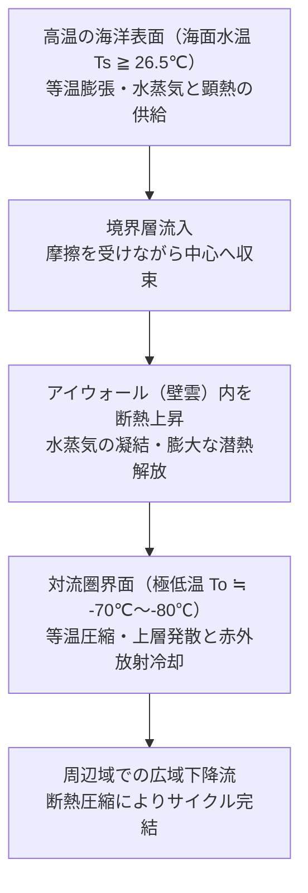

カルノーサイクルの熱効率 $\epsilon$ は、熱源の海面絶対温度 $T_s$ と排熱源である対流圏界面の絶対温度 $T_o$ によって決定される。

$$\epsilon = rac{T_s - T_o}{T_s}$$

熱帯域の海面水温が $T_s pprox 300\,	ext{K}$（約 $27^\circ	ext{C}$）、対流圏界面温度が $T_o pprox 200\,	ext{K}$（約 $-73^\circ	ext{C}$）である場合、熱効率 $\epsilon$ は約 $33\%$ に達する。台風が海面から受け取るエンタルピーフラックスと、大気境界層における摩擦散逸が釣り合う極限状態において、台風の理論的最大風速 $V_{\max}$ は以下のエマニュエルのMPI方程式によって支配される。

$$V_{\max}^2 pprox rac{C_k}{C_D} rac{T_s - T_o}{T_o} \left( k_s^* - k 
ight)$$

ここで、$C_k$ はエンタルピー交換係数、$C_D$ は地表面摩擦係数、$k_s^*$ は海面水温における飽和湿潤エンタルピー、$k$ は境界層大気の湿潤エンタルピーである。海面水温がわずか $1^\circ	ext{C}$ 上昇するだけで、大気海洋間の熱力学的非平衡度 $(k_s^* - k)$ が急激に増大し、台風の理論的極限強度が跳ね上がることがこの数理モデルから導かれる。

---

### 1.3 発生に必要な必須熱力学的条件

熱帯の海洋上であればどこでも台風が発生するわけではない。現実の地球大気において台風が発生するためには、海洋物理学および気候学的に以下の厳格な閾値が満たされなければならない。

1. **海面水温（SST: Sea Surface Temperature）が 26.5℃〜27.0℃ 以上**:
   海水からの激しい蒸発を維持し、大気境界層へ十分な水蒸気（潜熱エネルギー）を供給するための絶対条件である。海面水温が 26℃ を下回ると潜熱フラックスが急減し、対流活動が維持できなくなる。
2. **海洋混合層の熱容量（TCHP: Tropical Cyclone Heat Potential）の十分な厚み**:
   単に海面表面の薄い層が温かいだけでなく、水深 $50\,	ext{m} \sim 100\,	ext{m}$ 程度まで 26℃ 以上の温水層が続いていることが不可欠である。台風の猛烈な強風は海洋表層を激しく撹拌（タービュレント・ミキシング）し、下層の冷水を海面へ湧昇（Upwelling）させる。海洋熱容量が小さい海域では、台風自らが引き起こす海面水温低下によって自滅してしまうが、フィリピン東方沖など TCHP が極めて高い暖水塊が存在する海域では、台風は急速強化（Rapid Intensification: RI）を遂げる。
3. **コリオリパラメータ（地転パラメータ $f$）の存在（緯度5度以上）**:
   地球の自転によって生じるコリオリ力 $f = 2\Omega \sin\phi$（$\Omega$ は地球自転角速度、$\phi$ は緯度）が作用しなければ、低気圧の中心に向かって四方から吹き込む風が回転運動へと転換されず、中心の低圧部を即座に埋めてしまう。赤道直下（緯度0度〜5度）ではコリオリ力がほぼゼロであるため、台風が発生することは物理的に極めて稀である。

---

### 1.4 大気力学的発生条件と鉛直シアの微小環境

海洋側の条件が満たされていても、上空の大気力学的環境が整っていなければ、初期の擾乱は渦へと成長できない。ウィリアム・グレイ（William M. Gray）博士が提唱した熱帯低気圧発生指数（Genesis Potential Index: GPI）にも示される通り、以下の力学的要素が決定的な役割を果たす。

1. **対流圏中層（700hPa〜500hPa）の湿潤度**:
   中層大気が乾燥していると、積乱雲内へ乾燥空気が取り込まれ（エントレインメント現象）、雨粒の蒸発潜熱奪取によって強力な冷気下降流（ダウンドラフト）が発生する。これにより、低層の温暖な上昇流構造が破壊されてしまうため、中層の相対湿度が $70\%$ 以上の高湿環境が必要である。
2. **下層の水平渦度と収束**:
   熱帯収束帯（ITCZ）やモンスーントラフにおいて、北東貿易風と南西モンスーンが合流するシアーラインが存在すると、大気下層に豊富な正の相対渦度と水平収束が供給され、回転の「種」となる。
3. **鉛直ウィンドシア（Vertical Wind Shear: VWS）の微小環境**:
   高度 $1.5\,	ext{km}$（850hPa）付近の下層風と高度 $12\,	ext{km}$（200hPa）付近の上層風のベクトル差が約 $10\,	ext{m/s}$（20 knots）未満である「低鉛直シア」が極めて重要である。鉛直シアが大きいと、立ち上がった積乱雲の潜熱解放域（暖気核）が上空の強風によって横へ吹き流され、鉛直構造が傾いて熱機関としての効率が失われてしまう。

---

### 1.5 積乱雲群の組織化：CISK理論からWISHE理論へ

単独の積乱雲（数キロメートル規模、寿命1時間程度）の集合体が、いかにして数百キロメートルに及ぶ組織化された巨大渦へと自己組織化するのか。この謎を解き明かすために気象力学では二つの画期的な理論が提唱された。

#### 1. 第2種条件付不安定（CISK: Conditional Instability of the Second Kind）
チャルニー（Charney）とエリアッセン（Eliassen）が1964年に提唱した古典的理論である。
- 大気境界層の摩擦収束（エクマンパンピング）により、中心付近で湿潤空気が強制上昇する。
- 上昇した空気が凝結して積乱雲群を形成し、莫大な凝結潜熱を対流圏上層へ放出する。
- 潜熱によって上空が加温されて気圧が低下し、地表低気圧がさらに発達する。
- 地表の気圧傾度が強まることで下層の摩擦収束がさらに激化し、より多くの水蒸気が供給される。
この「低気圧スケールの循環」と「積乱雲スケールの対流」の正のフィードバックループを CISK と呼ぶ。

#### 2. 風水面交換不安定（WISHE: Wind-Induced Surface Heat Exchange）
1980年代後半にエマニュエルらが提唱した現代的理論である。CISKが既存の大気不安定度（CAPE）を積乱雲が消費することを前提としていたのに対し、WISHEは大気があらかじめ中立に近い成層状態にあっても、 **「風速の増加が海面からのエンタルピー（熱・水蒸気）蒸発フラックスを急激に増大させる」** というフィードバックによって台風が自律的に発達することを証明した。風速が増すほど海面からの熱抽出が加速し、それが低気圧の強度をさらに高めるという非線形相互作用こそが、台風の自己増殖メカニズムの本質である。

---

## 2. 台風の立体構造と流体力学的平衡

### 2.1 台風の3次元循環構造

発達した台風は、軸対称に極めて近い幾何学的対称性と、大気の立体的な3次元流動構造を持つ。鉛直断面および水平流場を俯瞰すると、主に3つの特徴的領域に区分される。

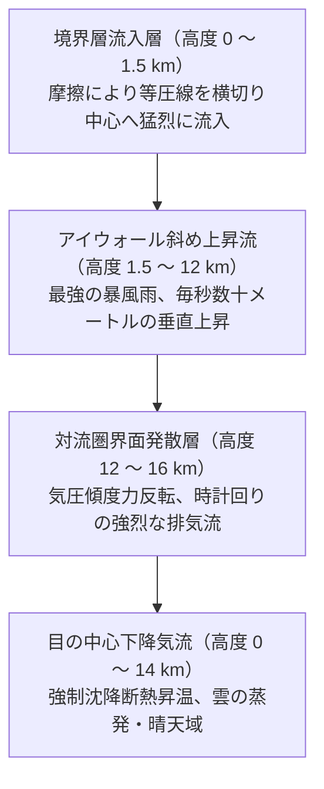

1. **下層境界層流入域（Inflow Layer: 地表〜高度約1.5km）**:
   地表摩擦の影響により地転風平衡が崩れ、風が等圧線を斜めに横切りながら、中心の超低気圧部へ向かって螺旋状に猛烈な勢いで収束する層である。この層が海面から莫大な潜熱と顕熱を吸収し、エンジンの燃料として中心へ運び込む。
2. **中心壁雲上昇域（Updraft Core: 高度約1.5km〜14km）**:
   中心へ向かって突進してきた湿潤空気は、中心付近で極限の遠心力に阻まれてもはや内進できなくなり、アイウォールに沿ってほぼ垂直に（実際には遠心力のため外側にわずかに傾斜しながら）猛烈な上昇気流となって対流圏界面まで一気に駆け上がる。
3. **上層発散流（Outflow Layer: 高度約12km〜16km）**:
   対流圏上層（約200hPa〜100hPa）に達した空気は、中心部の暖気核によって外側よりも気圧が高くなるため、今度は中心から放射状に猛烈に吹き出す。このとき、地球自転（コリオリ力）の影響を受けて北半球では「時計回り（高気圧性回転）」の巨大な排気プルームを形成する。この上層アウトフローがスムーズに広がることで、台風内部の空気の目詰まりが解消され、下層からの吸い込みが持続する。

---

### 2.2 「台風の目（Eye）」の形成力学と沈降断熱昇温

台風の最も象徴的な構造である「目（Eye）」は、自然界が生み出す流体力学の驚異である。直径は小型台風の $10\,	ext{km}$ 程度から、超巨大台風の $100\,	ext{km}$ 以上に及ぶ。

目の形成は、 **角運動量保存則（Conservation of Angular Momentum）** と **遠心力** の物理によって厳密に支配されている。中心から距離 $r$、接線風速 $v$ の空気塊が持つ絶対角運動量 $M$ は以下で表される。

$$M = v r + rac{1}{2} f r^2 = 	ext{const}$$

外側から中心へと半径 $r$ が縮小するにつれて、角運動量を保存するために接線風速 $v$ は反比例して猛烈に加速する。しかし、風速が増大すると、空気塊を外側へ押し戻そうとする遠心力 $rac{v^2}{r}$ は半径の3乗に反比例して爆発的に増大する。

ある限界半径（最大風速半径: RMW）に達すると、中心方向へ引っ張る内向きの気圧傾度力と、外向きの遠心力およびコリオリ力が完全に拮抗し、空気塊はもはやそれ以上中心に近づくことができなくなる。この動的バリアが「アイウォール」を形成し、その内側に隔離された空間として「目」が取り残される。

目の中では、周囲のアイウォールで急激に空気が吸い上げられることに対する質量補償として、 **上空からの緩やかな下降気流（沈降流: Subsidence）** が強制的に生じる。空気が下降すると、断熱圧縮によって気温が上昇する（乾燥断熱減率 約 $9.8^\circ	ext{C/km}$）。この **沈降断熱昇温** によって相対湿度が劇的に低下し、雲粒がすべて蒸発するため、目の内部は風が穏やかで青空や星空が見える無雲領域となる。

---

### 2.3 アイウォールと二次アイウォール置換サイクル（ERC）

目の外縁を円筒状に取り囲む巨大な積乱雲の壁を **アイウォール（壁雲: Eyewall）** と呼ぶ。アイウォールは台風の中で最も気圧傾度が急峻な領域であり、最大瞬間風速 $70\,	ext{m/s}$ を超える暴風と、時間雨量 $100\,	ext{mm}$ を超える猛烈な豪雨が集中する。

カテゴリー4や5に達する猛烈な超大型台風において頻繁に観測される極めて重要な現象が、 **二次アイウォール置換サイクル（ERC: Eyewall Replacement Cycle）** である。

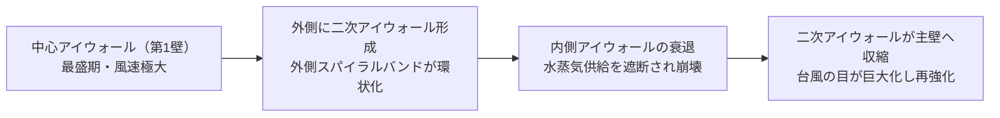

1. 台風が極限まで発達すると、主アイウォールの外側数十キロメートルの降雨帯が次第にリング状に結合し、 **外側アイウォール（二次アイウォール）** を形成する。
2. 外側のアイウォールが下層から流入する水蒸気と角運動量を横取りするため、内側の旧アイウォールへの補給が断たれ、内側アイウォールは次第に乾燥・崩壊して消滅する。
3. この置換の過程において、一時的に台風の中心気圧が上昇し、最大風速が弱まる（一時的な勢力低下）。
4. しかし、外側の新アイウォールが徐々に中心に向かって収縮（コンタクト）すると、台風の目が一回り巨大化し、再び猛烈な勢力へと再発達する。このサイクルを理解することは、上陸直前の台風の勢力急変を予測する上で極めて重要である。

---

### 2.4 スパイラルバンドの波動力学

台風の周囲には、何条もの弧を描く巨大な雲の帯が渦巻いている。これを **スパイラルバンド（螺旋状降雨帯: Spiral Rainbands）** と呼ぶ。

- **インナーバンド（内側降雨帯）**: 中心から半径 $100\,	ext{km}$ 以内に位置し、台風の渦運動と一体となって高速回転する。大気重力波や渦ロスビー波（Vortex Rossby Waves）の伝播によって形成され、アイウォールへの角運動量輸送を担う。
- **アウターバンド（外側降雨帯）**: 中心から $200\,	ext{km} \sim 500\,	ext{km}$ 離れた外縁部に形成される。台風本体が接近する半日〜数時間前から突如として激しい突風とスコール（先駆降雨帯）をもたらし、局所的な竜巻（Tornado）を多発させる危険な領域である。

---

### 2.5 風速場の物理：傾度風平衡とランキン渦

台風内部の水平方向の力学は、 **傾度風平衡（Gradient Wind Balance）** によって近似される。低気圧性の回転において、気圧傾度力、コリオリ力、遠心力の釣り合いは以下の代数方程式で記述される。

$$rac{1}{
ho} rac{\partial p}{\partial r} = f v + rac{v^2}{r}$$

ここで、$
ho$ は大気密度、$p$ は気圧、$r$ は台風中心からの距離、$v$ は接線風速、$f$ はコリオリパラメータである。中心に近づくほど遠心力項 $rac{v^2}{r}$ がコリオリ項 $f v$ を圧倒し、実質的にサイクロストロフィック風（遠心力と気圧傾度力の釣り合い）へと漸近する。

台風の水平接線風速プロファイルは、 **修正ランキン渦（Modified Rankine Vortex）** モデルによってモデル化される。

$$v(r) = egin{cases} V_{\max} \left( rac{r}{R_{\max}} 
ight) & (r < R_{\max} 	ext{ : 剛体回転域}) \ V_{\max} \left( rac{R_{\max}}{r} 
ight)^x & (r \ge R_{\max} 	ext{ : 渦位減少域}) \end{cases}$$

目の内部（$r < R_{\max}$）では、角速度一定の剛体回転のように中心に向かって直線的に風速が落ち、中心点では風速ゼロとなる。一方、最大風速半径 $R_{\max}$ の外側では、距離 $r$ の累乗（$x pprox 0.5 \sim 0.7$）に反比例して風速が減衰していく。

---

### 2.6 危険半円と可航半円の流体力学

台風の進行に伴い、風速場には著しい左右非対称性が生じる。台風の進行方向に向かって右側の半円を **危険半円（Dangerous Semicircle）** 、左側の半円を **可航半円（Navigable Semicircle）** と呼ぶ。

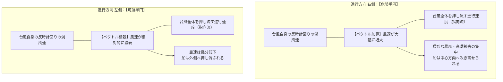

この非対称性が生じる力学的理由は2つある。

1. **風速ベクトルの合成**:
   北半球において台風は反時計回りに風が吹く。右半円では「渦の回転風向」と「台風自身の移動ベクトル」が同方向となって足し合わされ、実効風速が急増する。逆に左半円では両者が逆方向となり、互いに相殺される。
2. **地表面摩擦による進行方向の偏向**:
   地表摩擦の影響で風は中心に向かって約20度〜30度内側に切れ込む。右半円にいる船舶や陸地では、風によって台風の中心へと吸い寄せられる方向に力を受けるため極めて危険であるのに対し、左半円では外側へ押し出される風向となる。

---

## 3. 台風の進路力学とライフサイクル（発生・発達・転向・衰退・温低化）

### 3.1 指向流（ステアリングフロー）と高気圧の縁辺流

台風は自力で移動しているように見えるが、スケール的には大気海洋の大規模な大循環の中に浮かぶ巨大な渦に過ぎない。台風の移動を決定づける最も支配的な要因は、対流圏全体（深層平均）の風の流れである **指向流（ステアリングフロー: Steering Flow）** である。

北西太平洋における台風の進路は、主に以下の二大气圧系の配置と勢力関係によってコントロールされる。

1. **太平洋高気圧（サブハイ: Subtropical High）**:
   日本の南海上から小笠原諸島付近に張り出す温暖高気圧である。高気圧の周囲には時計回りの風が吹いており、台風はその南縁の東風（貿易風）に乗って西〜北西へと進み、西縁に達すると縁辺流に沿って北上を開始する。夏の太平洋高気圧が日本列島をすっぽりと覆っている場合、台風は日本を迂回して中国大陸や朝鮮半島へ向かう。一方、高気圧の縁が日本列島付近にかかっている場合、日本列島が台風の「直撃街道」となる。
2. **チベット高気圧**:
   夏季に対流圏上層（200hPa付近）に広がる超巨大高気圧であり、その張り出しの強弱が偏西風ジェット気流の蛇行パターンを変調させ、台風の進路に二次的な影響を与える。

---

### 3.2 転向（リカーブ）のメカニズムとアンサンブル予報

台風が北西進を続け、北緯25度〜30度付近の中緯度帯に達すると、中緯度上空を西から東へと猛烈な速度で吹き荒れる **偏西風（ジェット気流: Jet Stream）** に遭遇する。

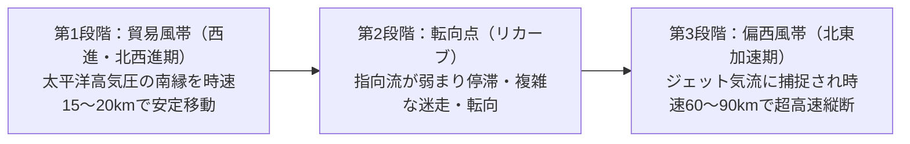

- **転向点（Recurvature Point）**:
  高気圧の西端を回り込み、進行方向を北西から北、そして北東へと大きく変える変曲点を指す。この転向点付近では周囲の指向流が一時的に非常に弱くなるため、台風の移動速度が時速数キロメートルまで急減して停滞し、進路が蛇行・迷走しやすい。
- **北東加速期**:
  偏西風の強風軸に捕捉された台風は、一転して急激に加速する。時速 $60\,	ext{km/h} \sim 90\,	ext{km/h}$（時には $100\,	ext{km/h}$ 以上）という新幹線並みの猛スピードで北東へ駆け抜けるため、日本列島を縦断する際は暴風の持続時間は短いものの、進行速度が加算された危険半円側で壊滅的な風害をもたらす。

現代の気象庁やECMWF（ヨーロッパ中期気象予報センター）では、大気モデルの初期値に意図的に微小な誤差を加えた多数の計算を同時に走らせる **アンサンブル予報（Ensemble Forecasting）** を導入している。発表される「進路予報円」は、台風の大きさを表しているのではなく、**「台風の中心が $70\%$ の確率で入る範囲」** を示しており、大気状態の不確実性が高い転向期ほど予報円は巨大化する。

---

### 3.3 ベータドリフト（$eta$ 効果）による自己偏向

台風を取り巻く環境場に全く風が吹いていない（指向流がゼロの）理想的な大気を仮定しても、台風は自発的に **北西方向（北半球の場合）** へと移動を始める。この現象を地球物理流体力学では **ベータドリフト（Beta Drift / $eta$効果）** と呼ぶ。

地球表面のコリオリパラメータ $f$ は緯度 $\phi$ と共に北へ行くほど大きくなる（$eta = rac{df}{dy} = rac{2\Omega\cos\phi}{R_E} > 0$）。
- 台風の東側では、南からの低緯度大気（渦度の小さい空気）が北へ運ばれるため、周囲に対して負の相対渦度（時計回りの循環）が生じる。
- 台風の西側では、北からの高緯度大気（渦度の大きい空気）が南へ運ばれるため、周囲に対して正の相対渦度（反時計回りの循環）が生じる。
その結果、台風の中心の東側に高気圧性の二次渦、西側に低気圧性の二次渦（ベータジャイア: Beta Gyres）が自己生成される。この二つの二次渦に挟まれた領域に「北〜北西向きの換気流（Ventilation Flow）」が誘起されるため、台風は自ら北西方向へと押し出されるのである。

---

### 3.4 藤原の効果（Fujiwhara Effect）：二重渦の相互作用

二つ以上の熱帯低気圧が約 $1,000\,	ext{km} \sim 1,500\,	ext{km}$ 以内の距離に接近した際、互いの渦度が干渉し合って複雑怪奇な動きを見せる現象を、日本の気象学者・藤原咲平博士の名を冠して **藤原の効果（Fujiwhara Effect）** と呼ぶ。

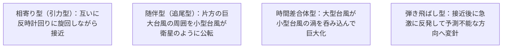

互いの低気圧が反時計回りに回りながら接近するだけでなく、片方が停滞してもう片方が急加速したり、片方が衰退してもう片方に吸収されたりする。これにより、数値予報モデルの予測を著しく困難にし、突然の迷走台風（ループ進路や反転進路）を引き起こす主要因となる。

---

### 3.5 温帯低気圧化（Extratropical Transition）のエネルギースイッチ

気象報道において最も致命的な誤解を生みやすいのが **「台風から温帯低気圧に変わりました」** というアナウンスである。多くの一般市民はこれを「台風が弱まって安全になった」と誤認するが、気象物理学の観点からは全くの誤りである。

温帯低気圧化（ET）とは、熱帯低気圧の死滅ではなく、 **「エンジンの動力源が根本から切り替わるエネルギースイッチ現象」** である。

| 比較項目 | 熱帯低気圧（台風） | 温帯低気圧化の過程・変質後 |
| :--- | :--- | :--- |
| **エネルギー源** | **水蒸気の凝結潜熱** （海洋からの熱フラックス） | **南北の水平温度傾度** （寒気と暖気の衝突による位置エネルギー・傾圧不安定） |
| **大気構造** | **順圧大気** ・暖気核（中心が最も暖かい） | **傾圧大気** ・前線構造（寒冷前線・温暖前線を獲得） |
| **暴風雨の分布** | 中心のアイウォール周辺に極めて急峻に集中 | 前線に沿って **数百〜数千キロメートルの超広域** に拡散 |
| **等圧線の形状** | 同心円状の美しい円形 | 歪んだ楕円形や波状に崩壊 |

台風が北上して北からの寒気に遭遇すると、乾燥した寒気が台風内部へと潜り込み、前線が形成される。このとき、熱帯低気圧としての潜熱駆動システムは失われるが、今度は「重い寒気が下に潜り込み、軽い暖気が上へ駆け上がる」ことによる **有効位置エネルギーの運動エネルギーへの変換（傾圧不安定）** が爆発的に進行する。

その結果、中心気圧が再発達して猛烈な低気圧（爆弾低気圧）へと変貌することがあり、最大風速域は中心から外側数百キロメートルへと劇的に拡大する。1954年の洞爺丸台風をはじめとする歴史的海難や広域暴風被害の多くは、まさにこの「温帯低気圧化」の渦中で発生しているのである。

---

## 4. 昭和の三大台風と戦後日本の壊滅的被害史

日本列島の近代防災・河川工学・建築基準・法制度の歴史は、台風による壊滅的な被害と、そこからの血のにじむような復興と技術革新の歴史そのものである。とりわけ昭和時代に発生した「室戸台風（1934年）」「枕崎台風（1945年）」「伊勢湾台風（1959年）」の3つは、それぞれ数千人規模の死者・行方不明者を出し、 **「昭和の三大台風」** として日本の防災史に刻み込まれている。

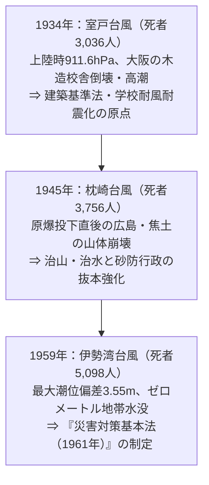

---

### 4.1 室戸台風（1934年/昭和9年）：関西壊滅と学校災害の悲劇

1934年（昭和9年）9月21日、高知県室戸岬付近に上陸した **室戸台風** は、日本の観測史上類を見ない猛烈な気圧低下を記録したモンスター台風である。

- **驚異的な気圧記録**:
 午前5時、室戸岬測候所の水銀気圧計は **$911.6\,\text{hPa}$（$683.7\,\text{mmHg}$）** を記録した。これは当時の世界記録（1919年フロリダ沖ハリケーン）に次ぐ極限値であり、日本の地上観測所における最低気圧の日本記録として現在も破られていない。
- **木造校舎の倒壊と児童の悲劇**:
  室戸台風の最大の特徴は、平日の登校時間帯（午前8時前後）に関西圏を直撃したことである。当時、大阪府下などに建設されていた木造2階建て・3階建ての学校校舎は、細長い窓を連続して配置する採光重視の構造設計が採られており、風荷重に対する耐力壁や筋かいが著しく不足していた。
  平均風速 $40\,\text{m/s}$、最大瞬間風速 $60\,\text{m/s}$ を超える暴風が直撃した瞬間、大阪府下で260校以上、兵庫県・京都府を含め数百棟の学校校舎が瞬時に座屈・倒壊した。倒壊した梁や瓦礫の下敷きとなり、児童約600人、教職員多数が死亡する未曾有の「学校惨事」となった。
- **大阪湾の大高潮**:
  折からの大潮の満潮と強烈な南寄りの暴風が重なり、大阪湾では海水面が急激に上昇（大阪港で潮位偏差 $3.1\,\text{m}$）。防潮堤を軽々と越流・破壊した海水は大阪市街地へと侵入し、港区・大正区・西淀川区など市域の約4分の1が泥海に沈んだ。
- **防災史への影響**:
  死者・行方不明者3,036人を出したこの悲劇を契機に、文部省は学校建築の標準設計基準を全面改訂し、筋かいの義務付けや鉄筋コンクリート造校舎への転換を強力に推進した。また、建物の耐風圧計算規定が近代建築法規（後の建築基準法）に導入される契機となった。

---

### 4.2 枕崎台風（1945年/昭和20年）：原爆被災地を直撃した二重の悲劇

第二次世界大戦終結からわずか1ヶ月後の1945年（昭和20年）9月17日、鹿児島県枕崎付近に上陸した台風は、後に **枕崎台風** （昭和20年台風第16号）と命名された。

- **敗戦直後の社会的空白**:
  上陸時の中心気圧は $916.3\,\text{hPa}$（枕崎測候所）、最大瞬間風速 $62.7\,\text{m/s}$ を記録した。当時は敗戦直後の極度の混乱期であり、気象情報は軍事機密解除の過渡期にあった。通信インフラは空襲でズタズタに破壊され、国民への台風警報の伝達は完全に麻痺していた。
- **広島原爆被災地における土石流の惨劇**:
  最も過酷な被害を受けたのが、8月6日に原子爆弾が投下されたばかりの広島県であった。戦争中の森林乱伐によって山肌が荒廃し、治山・治水事業が完全に放置されていた山地へ、日降水量数百ミリに及ぶ猛烈な豪雨が降り注いだ。
  広島市近郊の大野村（現廿日市市）では、大野陸軍病院が裏山の土石流（山津波）の直撃を受け、原爆被爆者の治療にあたっていた京都帝国大学医学部の調査団（真下俊一教授ら）や被爆患者を含む156名が瞬時に生き埋めとなって殉職した。広島県内だけで死者・行方不明者は2,000人を超えた。
- **全国被害と国土保全**:
  全国の死者・行方不明者は3,756人に達した。食糧難に喘ぐ国民の田畑を土砂が埋め尽くし、荒廃した国土の保全なくして日本の復興はあり得ないという強烈な危機感が、後の「治山治水緊急措置法」や大規模な砂防ダム網建設へとつながっていく。

---

### 4.3 伊勢湾台風（1959年/昭和34年）：近代防災行政の分水嶺

1959年（昭和34年）9月26日、紀伊半島潮岬に上陸した昭和34年台風第15号（国際名：ヴェラ / Vera）は、日本の近代災害史上、自然災害による死者数としては関東大震災に次ぐ最悪の惨事をもたらした。これが **伊勢湾台風** である。

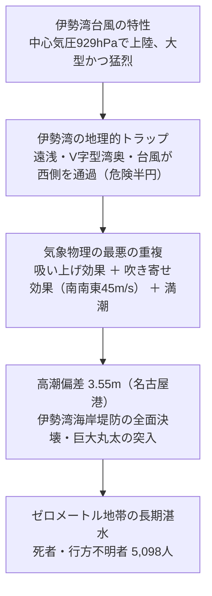

#### 1. 高潮発生の気象物理学的メカニズム
伊勢湾台風が高潮による未曾有の惨害を引き起こした背景には、気象力学と地形条件が「最悪の組み合わせ」で重なったことがある。
- **進路と風向の幾何学**: 台風の中心が伊勢湾の西側（三重県から滋賀県方面）を通過したため、伊勢湾全域が **危険半円** に入った。湾の開口部（南）から湾奥（北）に向かって、最大風速 $35\,\text{m/s}$、瞬間風速 $45\,\text{m/s}$ を超える猛烈な南南東の暴風が長時間にわたって吹き荒れた。
- **吹き寄せ効果（風応力）**: 伊勢湾は水深が浅く、奥に行くほど狭まる湾形状（V字型）である。強風が海水を湾奥へ力ずくで押しやる「吹き寄せ効果」が極大化した。
- **吸い上げ効果**: 中心気圧 $929\,\text{hPa}$ の低圧部が、海面を静水圧効果で約 $80\,\text{cm}$ 以上吸い上げた。
- **潮位偏差の極大**: 名古屋港では、天文潮位を **$3.55\,\text{m}$** も上回る驚異的な潮位偏差を記録し、最高潮位は標高 $+5.31\,\text{m}$（NP基準）に達した。

#### 2. 名古屋港・ゼロメートル地帯の悲劇
海抜ゼロメートル地帯が広がる愛知県南部（名古屋市南区・港区、海部郡、弥富町など）および三重県北部（桑名市、川越町など）の海岸堤防・河川堤防は、打ち寄せる高波と高潮の越流によって数百箇所で崩壊した。
さらに、名古屋港の貯木場から流出した数万本・数万トンに及ぶ巨大木材（外材丸太）が、津波のような高潮に乗って住宅街へ突入。頑丈な家屋を次々と粉砕・破壊し、逃げ惑う住民を押し潰した。水門や排水機場の水没により、海水が引くまで数ヶ月を要し、住民は水上生活を余儀なくされた。

#### 3. 災害対策基本法の制定と防災体制の確立
伊勢湾台風による人的被害は、 **死者4,697人、行方不明者401人（合計5,098人）** 、被災者数150万人という天文学的な規模に達した。

この衝撃を受け、国会および政府は従来の個別対応的な法体系を抜本的に見直し、1961年（昭和36年）に日本の危機管理・防災の根幹をなす **『災害対策基本法』** を制定した。
- 内閣総理大臣を会長とする「中央防災会議」の設置
- 国・都道府県・市町村が一体となる「防災基本計画」「地域防災計画」の策定義務化
- 災害救助・復旧・財政支援の包括的法制化
- 伊勢湾海岸堤防の「伊勢湾台風級高潮（T.P.+5.0m水準）」を想定した高潮防潮堤・水門の建設

伊勢湾台風は、日本が「近代的な総合防災国家」へと脱皮するための最も決定的な歴史的転換点となったのである。

---

## 5. 豪雨水害・海難・河川氾濫をもたらした歴史的台風

昭和の時代には、暴風や高潮だけでなく、異常な集中豪雨による大河川の堤防決壊や、海上交通の壊滅的遭難事故をもたらした特異な台風が存在する。その代表が「カスリーン台風」「洞爺丸台風」「狩野川台風」である。

---

### 5.1 カスリーン台風（1947年/昭和22年）：利根川決壊と首都水没の原点

終戦から2年後の1947年（昭和22年）9月、関東・東北地方を直撃した **カスリーン台風（Kathleen）** は、日本の心臓部である首都圏の治水史を根底から覆した。

- **群馬・栃木山間部の極端豪雨**:
  台風本体は房総半島沖を通過したものの、日本付近に停滞していた前線に台風からの湿潤な南風が大量に流れ込み、秩父山地や足尾山地で日雨量 $400\,\text{mm}$ を超える豪雨となった。
- **利根川堤防の決壊と濁流の南下**:
  9月16日未明、利根川水系の本川・支川の水位が限界を突破。現在の埼玉県加須市（旧東村新川通）において、利根川右岸堤防が約 $340\,\text{m}$ にわたって大決壊した。
  決壊口から噴出した毎秒数千トンの濁流は、かつて利根川が東京湾へ注いでいた古利根川の低地を時速数キロメートルで南下。決壊から2日後には埼玉県南部を呑み込み、東京都葛飾区・江戸川区のゼロメートル地帯へと侵入した。東京都下だけでも約4万戸が水没し、冠水は数週間に及んだ。
- **死者1,930人と首都圏治水計画の誕生**:
  カスリーン台風による死者・行方不明者は1,930人に達した。この破堤災害の教訓から、建設省（現国土交通省）は利根川水系の大改修に着手。上流部に藤原ダム・矢木沢ダムなどの「利根川上流八斗島ダム群」を建設するとともに、渡良瀬遊水地をはじめとする大規模調節池、そして後に完成する「首都圏外郭放水路」などの多重治水ネットワークが築かれることとなった。

---

### 5.2 洞爺丸台風（1954年/昭和29年）：青函連絡船沈没とトンネル建設

1954年（昭和29年）9月26日、日本海を北上した昭和29年台風第15号（国際名：マリー / Marie）は、青函航路において世界第2位の犠牲者を出した海難事故を引き起こした。これが **洞爺丸台風** である。

- **温帯低気圧化に伴う予測不能な猛烈再発達**:
  台風第15号は日本海で急速に「温帯低気圧化」を開始していた。前述の通り、冷気を取り込んだ低気圧は傾圧不安定により中心気圧を $956\,\text{hPa}$ まで再発達させ、猛烈な突風域を急激に広げた。
- **函館湾での遭難の連鎖**:
  国鉄の青函連絡船「洞爺丸」は、台風通過の気圧上昇を見込んで函館港を出航した直後、予想を遥かに超える暴風（瞬間風速 $57\,\text{m/s}$）と巨大な三角波に捕捉された。
  錨を引きずって漂流する「走錨（そうびょう）」状態に陥り、車両甲板の開口部から海水が機関室へと浸入。ボイラーと発電機が停止して操舵不能となり、函館市七重浜沖の浅瀬に座礁・転覆した。
 洞爺丸の乗客・乗員1,155名が死亡・行方不明となったほか、僚船4隻（第十一青函丸、北見丸、十勝丸、日高丸）も次々と沈没し、 **合計死者数は1,430人** に達した。
- **青函トンネル建設の決定打**:
  「海が荒れても北海道と本州の連絡を絶対に途絶えさせてはならない」という国民的世論が高まり、極めて困難とされた海底鉄道トンネル構想が一気に具体化。1964年の着工、そして1988年の「青函トンネル」開業へと結びついたのである。

---

### 5.3 狩野川台風（1958年/昭和33年）：伊豆の山津波と東京内水氾濫

1958年（昭和33年）9月26日、伊豆半島から関東地方をかすめた昭和33年台風第22号（国際名：アイダ / Ida）は、山地崩壊と都市水害の複合的恐怖をまざまざと見せつけた。これが **狩野川台風** である。

- **伊豆半島天城山の局所的メガ豪雨**:
  天城山周辺では24時間雨量が $750\,\text{mm}$ に達した。火山灰や軽石層が厚く堆積していた伊豆半島の山腹は一斉に崩壊し、同時多発的な「土石流（山津波）」が発生。狩野川上流の大仁町や中伊豆町では集落全体が巨岩と土砂の混じった濁流に押し流され、死者・行方不明者は伊豆半島だけで1,000人近くに上った。
- **東京都市部の浸水**:
  台風は首都圏を直撃し、東京都内でも神田川・妙正寺川・渋谷川・目黒川などの都市河川が一斉に氾濫。世田谷区や杉並区、中野区など山の手の住宅街でも30万戸以上が床上・床下浸水に見舞われた。
- **狩野川放水路の建設**:
 死者・行方不明者1,269人を記録したこの大水害を受け、狩野川の中流から駿河湾へ直結する日本最大級の分水路 **「狩野川放水路（全長約3kmのトンネル含む）」** の建設が加速され、後の伊豆半島の洪水防御に決定的な貢献を果たした。

---

## 6. 気候変動時代の新たな脅威（平成・令和の激甚台風）

昭和後期の治水投資によって、日本の台風による犠牲者数は劇的に減少した。しかし、21世紀に入り地球温暖化に伴う海水温上昇と大気中の水蒸気飽和量増加（クラウジウス・クラペイロンの法則：気温1℃上昇につき水蒸気量約7%増）が進行する中、台風は **「過去の経験則が通用しない新たな激甚化」** のフェーズへと突入した。

---

### 6.1 平成3年台風第19号（りんご台風 / 1991年）：日本縦断の猛烈風害

1991年（平成3年）9月27日、長崎県佐世保市に上陸した台風第19号（国際名：ミレー / Mireille）は、全国を縦断しながら記録的な暴風を吹き荒れさせた。

- **高速移動と危険半円の全国拡大**:
  偏西風に乗り、時速 $70\,\text{km/h} \sim 80\,\text{km/h}$ という異例の高速で日本海沿岸を北東へ縦断したため、台風の東側（本州全域）が広範囲にわたって強烈な危険半円に入った。
- **全国の暴風記録**:
  佐礼岬で最大瞬間風速 $60.9\,\text{m/s}$、青森市で $53.9\,\text{m/s}$、広島市で $58.9\,\text{m/s}$ など、全国の気象官署の約半数で観測史上最大風速を更新した。
- **農業・インフラ壊滅**:
  収穫期直前だった青森県のリンゴが約8割も落果し、「りんご台風」の通称がついた。また、全国で送電鉄塔の倒壊や塩風によるがいし絶縁破壊（塩害停電）が相次ぎ、数百万戸が大規模停電に見舞われた。世界遺産の厳島神社（広島県）の国宝・能舞台が倒壊するなど文化財被害も甚大であった（死者62人、損害保険支払額は当時の日本記録となる5,000億円超）。

---

### 6.2 平成30年台風第21号（チェービー / 2018年）：関空完全水没と海上空港の脆弱性

2018年（平成30年）9月4日、非常に強い勢力で徳島県・兵庫県に連続上陸した台風第21号（国際名：チェービー / Jebi）は、現代の高度インフラ都市がいかに高潮に対して脆弱であるかを露呈させた。

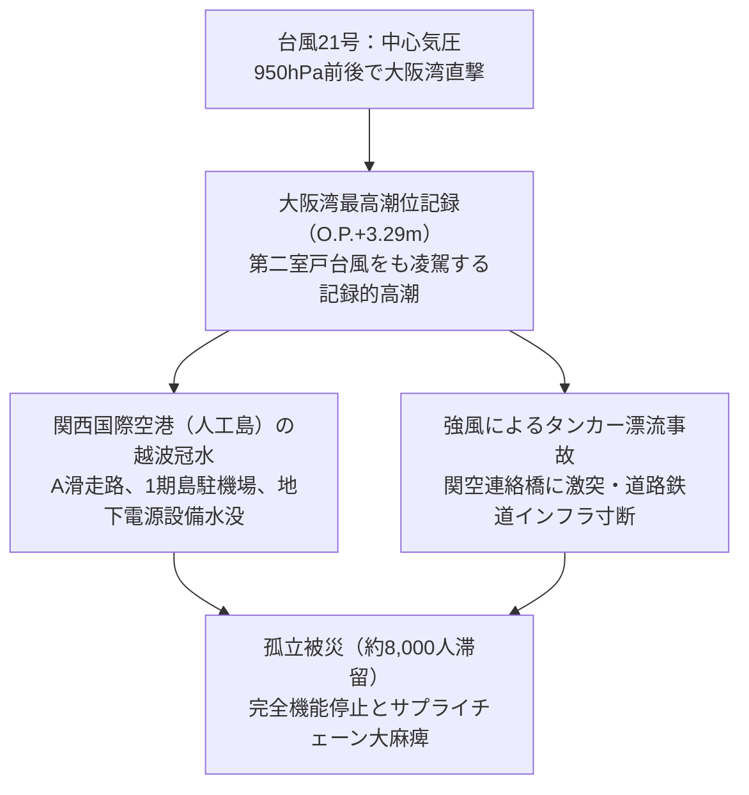

- **大阪湾の最高潮位更新**:
 大阪港の潮位は **O.P. $+3.29\,\text{m}$** に達し、1961年の第二室戸台風の記録（$+2.93\,\text{m}$）を57年ぶりに更新した。
- **関西国際空港の機能停止**:
  海上に造成された人工島である関西国際空港では、護岸を越えた海水がA滑走路や駐機場へ流入。さらに旅客ターミナルビルの地下電気設備（キュービクルや非常用発電機）が水没したため全島がブラックアウトした。
- **連絡橋激突と完全孤立**:
  台風の暴風によって錨が効かなくなった給油タンカー「宝運丸」（2,591トン）が漂流し、空港と本土を結ぶ唯一の動脈である関空連絡橋の橋桁に激突。道路および鉄道が物理的に破壊され、空港内に旅客・従業員約8,000人が完全孤立する事態となった。
  この事故は、重要インフラの電源設備の地上化・防水化、および走錨船舶の規制強化という教訓を残した。

---

### 6.3 令和元年房総半島台風（台風第15号・ファクサイ / 2019年）：首都圏直撃と千葉大停電

2019年（令和元年）9月9日未明、中心気圧 $960\,\text{hPa}$、最大風速 $40\,\text{m/s}$ で三浦半島を通過し千葉市付近に上陸した台風第15号（国際名：ファクサイ / Faxai）は、「風の台風」の恐ろしさを首都圏に見せつけた。

- **首都圏観測史上最強クラスの暴風**:
 千葉市で最大瞬間風速 **$57.5\,\text{m/s}$**、成田空港で $45.8\,\text{m/s}$ を記録。コンパクトながら気圧傾度が極めて急峻な台風であったため、上陸直前まで勢力が全く衰えなかった。
- **送電鉄塔の倒壊と広域ブラックアウト**:
 千葉県君津市山間部の高圧送電鉄塔2基が暴風により倒壊。さらに電柱約2,000本がへし折れ、送電線が寸断されたことで、千葉県を中心に **最大約93万戸** が停電した。
- **長期インフラ麻痺と熱中症クライシス**:
  停電は最長で2週間以上に及び、浄水場の機能停止による断水、通信基地局のバッテリー切れによる携帯電話不通が連鎖した。折しも上陸翌日からは気温35℃を超える猛暑日となり、エアコンが使えない被災地で高齢者を中心に熱中症による二次的死亡が多発した。
  また、暴風により数万棟の住宅で屋根瓦が飛散し、雨漏りを防ぐためのブルーシート張り作業中に屋根から転落する事故が多発。現代社会における「風害と電力依存」の致命的な脆弱性が浮き彫りとなった。

---

### 6.4 令和元年東日本台風（台風第19号・ハギビス / 2019年）：広域豪雨と堤防決壊の極限

房総半島台風からわずか1ヶ月後の2019年10月12日、超大型で強い台風第19号（国際名：ハギビス / Hagibis）が伊豆半島に上陸した。この台風は「風の15号」に対し、「雨の19号」として東日本全域に破滅的な水害をもたらした。

- **超広域メガ豪雨**:
 台風の直径が極めて大きく、南からの湿潤空気を数日間にわたり日本列島へ送り込み続けた。箱根町で48時間雨量 **$1,001.0\,\text{mm}$**（日本記録）を樹立したほか、東北・関東・甲信の各地で観測史上1位の降水量を記録した。
- **142箇所の河川堤防決壊**:
 国管理河川12水系・24河川で破堤、都道府県管理河川を含めると **71河川・142箇所** で堤防が決壊した。
 - **千曲川（長野県長野市穂保）**: 堤防決壊により濁流が住宅地へ突入。JR東日本の北陸新幹線長野新幹線車両センターが水没し、全編成の3分の1にあたる10編成（120両、製造コスト約330億円相当）が冠水・全車廃車となった映像は世界中に衝撃を与えた。
 - **阿武隈川（福島県・宮城県）**: 本川の水位上昇により支川の水が排水できなくなる **「バックウォーター現象」** が多発し、流域各所で多点同時氾濫が発生した。
- **人的・物的損害**:
  死者・行方不明者は100人を超え、住宅被害は10万棟を突破。巨大台風が直撃した際、一級河川であっても広域同時多発的に決壊し得る現実が証明され、国や自治体による「流域治水（ダムや堤防だけでなく流域全体で貯留・浸透させる思想）」への大転換を決定づけた。

---

## 7. 世界のモンスター熱帯低気圧と観測史上極限記録

台風は日本列島のみならず、西太平洋の熱帯島嶼国や東南アジア、さらには大西洋やインド洋の沿岸地域においても、地球規模の極限気象として猛威を振るってきた。世界気象観測史上、物理的な限界値に達したモンスター台風の記録を検証することは、地球温暖化が進行する未来の気候リスクを直視する上で欠かせない。

---

### 7.1 タイフーン・チップ（Tip / 1979年）：世界観測史上最低気圧「870hPa」

1979年10月に北西太平洋で発生した昭和54年台風第20号（国際名：チップ / Tip）は、地球上で観測された熱帯低気圧の中で **「史上最も気圧が低く、かつ最も巨大な熱帯低気圧」** として世界気象機関（WMO）の公式記録に君臨している。

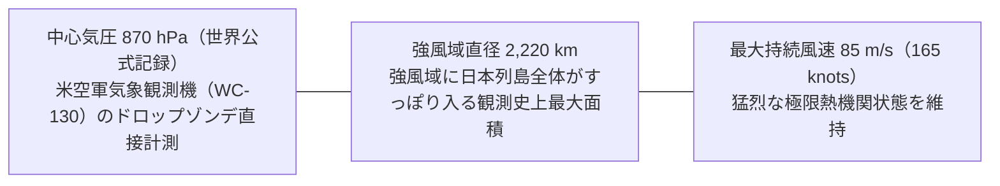

- **ドロップゾンデによる直接観測の衝撃**:
 1979年10月12日、沖ノ鳥島南東沖において、アメリカ空軍第54気象偵察飛行隊の観測機WC-130が台風の目に突入し、ドロップゾンデを投下。海面気圧 **$870\,\text{hPa}$**、中心付近気温 $30^\circ\text{C}$（暖気核の高度な成熟）を直接観測した。この気圧は、地上大気の標準気圧（1013.25hPa）から約 $14\%$ も空気密度が喪失した状態に相当する。
- **日本列島を覆い尽くす巨大循環**:
 風速 $15\,\text{m/s}$（29 knots）以上の強風域の直径は **$2,220\,\text{km}$** に達した。これは東京を中心に置いた場合、北は北海道北端から南は沖縄本島までがすべて強風域に呑み込まれるサイズである。台風チップはその後日本列島へ上陸し、全国で洪水・土砂崩れを引き起こした（死者115人）。

---

### 7.2 台風ハイエン（ヨランダ / Haiyan / 2013年）：時速378kmの暴風と高潮津波

2013年11月8日、フィリピン中東部サマール島およびレイテ島に上陸した平成25年台風第30号（フィリピン名：ヨランダ / 国際名：ハイエン / Haiyan）は、上陸時の熱帯低気圧として **観測史上最強クラス** の破壊力を見せつけた。

- **極限の風速と気圧**:
 海洋熱容量（TCHP）が極めて高いフィリピン東方海域を通過しながら爆発的な急速強化（RI）を起こし、ドボラック法による衛星解析では最大持続風速（1分間平均）**$87\,\text{m/s}$（$315\,\text{km/h}$ / 170 knots） **、最大瞬間風速は**$105\,\text{m/s}$（約 $378\,\text{km/h}$）** に達したと推定された。上陸時の中心気圧は $895\,\text{hPa}$ であった。
- **「ストームサージウォール（高潮の壁）」**:
  レイテ島の中心都市タクロバンは、遠浅で細長く奥まったサン・ペドロコ湾に面していた。そこに時速300kmを超える暴風が吹き込んだため、海面が垂直の壁のようにせり上がり、高さ $5\,\text{m} \sim 6\,\text{m}$ を超える猛烈な高潮（現地では津波と誤認された）が市街地を直撃した。
 海岸から数キロメートル内陸まであらゆる建造物が壊滅し、 **死者・行方不明者7,300人以上** を出す大惨劇となった。タクロバン空港の管制塔や滑走路も水没し、救援活動が完全に遮断された。

---

### 7.3 ハリケーン・カトリーナ（2005年）＆サンディ（2012年）：先進国都市水没の衝撃

台風と同じ熱帯低気圧である大西洋のハリケーンも、米国の巨大都市を水没させ、先進国の防災神話を崩壊させた。

- **ハリケーン・カトリーナ（2005年）**:
  メキシコ湾を通過中にカテゴリー5へ発達したカトリーナは、ルイジアナ州ニューオーリンズ市を直撃。海抜ゼロメートル地帯を囲んでいた運河の防潮堤・堤防が液状化や基礎破壊により各所で決壊し、市街地の約 $80\%$ が水没した。死者1,800人超、避難所のスーパードームにおける治安崩壊など、社会工学的な都市脆弱性を世界に露呈した。
- **ハリケーン・サンディ（2012年）**:
  北大西洋を北上し、温帯低気圧化の過程で強風域が超巨大化した「スーパーハイブリッドストーム」。満潮時にニューヨーク市を直撃し、高潮によりマンハッタン南部の地下鉄トンネル、変電所、金融街が冠水。世界最大の金融都市が数日間にわたり麻痺した。

---

### 7.4 気候変動と未来の「スーパー台風」予測

IPCC（気候変動に関する政府間パネル）第6次評価報告書（AR6）や気象庁・海洋研究開発機構（JAMSTEC）のスーパーコンピュータを用いた高解像度気候シミュレーションによると、地球温暖化に伴う台風の将来変化について以下の確度の高い科学的予測が示されている。

1. **台風の総発生数は横ばいまたは微減、しかし「非常に強い台風（カテゴリー4〜5）」の割合が有意に増加する**:
   対流圏上層の昇温に伴い大気の成層安定度が増すため、小規模な熱帯低気圧の発生頻度は抑制される。しかし、一度発生した台風は、上昇した海面水温から莫大な潜熱を吸収し、極限のスーパー台風へと急発達しやすくなる。
2. **台風に伴う降雨強度の顕著な増大**:
   クラウジウス・クラペイロンの法則に基づき、大気中の可降水水量が大幅に増加するため、台風の中心から数百キロメートル離れた場所でも、従来経験したことのない時間雨量 $150\,\text{mm}$ クラスの豪雨が発生する。
3. **台風の移動速度の低下と「滞留型」豪雨の頻発**:
   極域と赤道域の温度傾度が小さくなることで偏西風ジェット気流が弱まり、台風を押し流す指向流が減速する。その結果、同一地域に台風が長時間居座り、降水量が累積して破滅的な河川氾濫を引き起こすリスクが高まる。
4. **最盛期を迎える緯度の北上（日本近海での最強勢力維持）**:
 日本近海の海面水温が平年より2〜3℃高い状態が常態化することにより、従来であれば日本列島に接近する過程で冷水によって衰退していた台風が、 **中心気圧930hPa〜920hPaの「猛烈な勢力」のまま本州へ直撃・上陸するシナリオ** が現実味を帯びている。

---

## 8. 台風災害の三位一体（暴風・高潮・複合洪水）の物理と工学シミュレーション

台風がもたらす破壊力は、単一の現象ではなく **「暴風」「高潮」「複合洪水（外水氾濫・内水氾濫・土砂崩れ）」** という三つの物理現象が同時多発的かつ非線形に連鎖（複合災害: Multi-hazard）することによって極大化する。

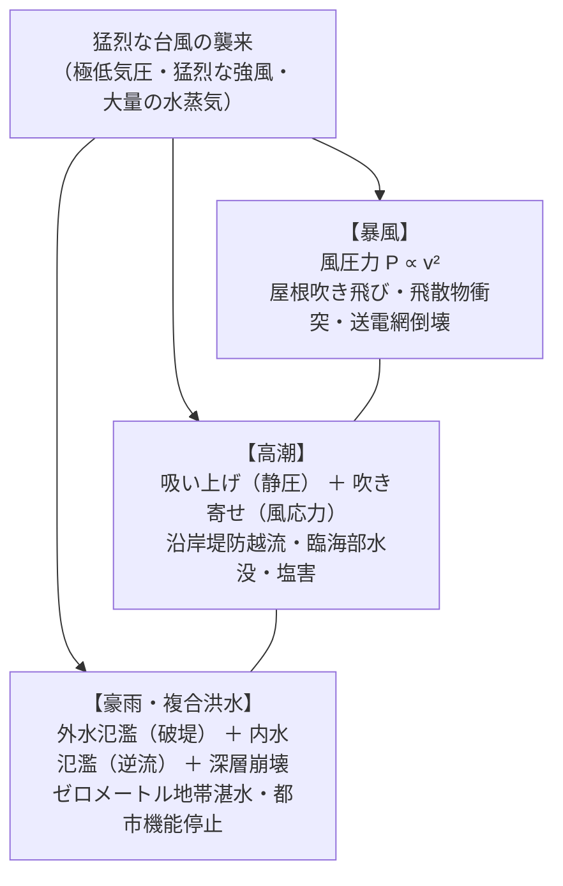

---

### 8.1 暴風工学の物理：風速と風圧力の非線形二乗則

強風が建造物に及ぼす破壊力は、風速に比例するのではなく **「風速の2乗」** に比例して爆発的に増大する。流体力学における風圧力 $P$（単位面積あたりの力: $\text{N/m}^2$）の基礎方程式は以下の通りである。

$$P = \frac{1}{2} \rho v^2 C_f$$

ここで、$\rho$ は空気密度（約 $1.2\,\text{kg/m}^3$）、$v$ は風速（$\text{m/s}$）、$C_f$ は建物の形状や開口部に応じた風力係数である。

- 風速 $20\,\text{m/s}$（台風の強風域）：風圧力は約 $240\,\text{N/m}^2$（約 $24\,\text{kgf/m}^2$）
- 風速 $40\,\text{m/s}$（強い台風）：風圧力は約 $960\,\text{N/m}^2$（約 $98\,\text{kgf/m}^2$）⇒ **力は4倍**
- 風速 $60\,\text{m/s}$（猛烈な突風）：風圧力は約 $2,160\,\text{N/m}^2$（約 $220\,\text{kgf/m}^2$）⇒ **力は9倍**

#### 建築破壊の力学：ミサイル現象と内圧上昇
暴風被害において最も危険なのは、飛来物による窓ガラスの破損である。
屋根瓦や看板、折れた木の枝が秒速50mで飛来すると、銃弾やミサイルのような貫通力を持つ（ミサイル現象）。窓ガラスが1枚でも割れると、室外の猛烈な強風が室内に一気に吹き込み、 **「室内圧力が爆発的に上昇（正圧化）」** する。
同時に、屋根の上面ではベルヌーイの定理により高速気流によって **「強烈な上向きの吸い上げ力（負圧化）」** が発生している。この「室内からの突き上げ力」と「室外からの吸い上げ力」が重なった瞬間、屋根トラス構造全体が外側へと爆発するように吹き飛ばされ、家屋は瞬時に全壊する。

---

### 8.2 高潮（Storm Surge）の数値流体メカニズム

高潮とは、台風に伴う気圧低下と暴風によって海面が異常に上昇する現象である。津波が海底地震による地殻変動で発生するのに対し、高潮は大気海洋相互作用による気象現象である。

高潮による海面上昇高 $\Delta h$ は、主に二つの物理効果の重ね合わせで決定される。

$$\Delta h = \Delta h_p + \Delta h_w$$

#### 1. 吸い上げ効果（Inverse Barometer Effect: $\Delta h_p$）
気圧が低下すると、周囲の高圧部の空気が海面を押し下げ、低圧部の海面がストローで吸い上げられるように上昇する。
水銀の密度に対する海水の密度の比から、中心気圧が標準大気圧（1013hPa）から **$1\,\text{hPa}$ 低下するごとに、海水面は約 $1\,\text{cm}$ 上昇** する。
中心気圧が $913\,\text{hPa}$ の超巨大台風の場合、吸い上げ効果単独で約 $1\,\text{m}$ の海面上昇となる。

#### 2. 吹き寄せ効果（Wind Setup: $\Delta h_w$）
強風が海面に及ぼす風応力（摩擦ドラッグ）によって海水が海岸へと力任せに押し流される現象である。定常状態における一次元浅水方程式から、吹き寄せによる水深勾配は以下の関係を満たす。

$$\frac{\partial h_w}{\partial x} \approx \frac{\rho_a C_D v^2}{\rho_w g H}$$

ここで、$\rho_a$ は空気密度、$\rho_w$ は海水密度、$C_D$ は海上摩擦係数、$v$ は風速、$g$ は重力加速度、$H$ は水深である。
この数式から極めて重要な物理的教訓が導かれる。
- 吹き寄せ高さは **「風速の2乗（$v^2$）」** に比例する。
- 吹き寄せ高さは **「水深（$H$）」に反比例** する。
水深が数十メートル以上ある外洋では吹き寄せはほとんど起きないが、水深が数メートル〜十数メートルしかない遠浅の湾（東京湾、伊勢湾、大阪湾、有明海など）では、海水が逃げ場を失って湾奥へ急激にせり上がり、数メートルにおよぶ壊滅的な高潮となる。これに大潮の満潮時刻が重なると、堤防を軽々と超える破滅的な氾濫に至る。

---

### 8.3 複合水害（外水氾濫・内水氾濫・バックウォーター現象）

台風の豪雨がもたらす河川洪水は、従来の単一河川の越水モデルでは説明できない複合的メカニズムを持つ。

1. **外水氾濫（河川堤防の越水・破堤）**:
   上流から押し寄せる濁流が堤防の計画高水位を超え、堤防天端を越流する。越流した水が堤防の裏海苔面を削り取り（裏法浸食）、堤防全体が水圧に耐えかねて瞬時に決壊（破堤）する。
2. **内水氾濫（排水機能喪失による都市水害）**:
   本川の水位が上昇すると、堤防内の住宅街の雨水を河川へ自然排水できなくなるため、水門（樋門）を閉じなければならない。水門を閉じると、市街地に降った雨を排水機場のポンプで強制排水するしかないが、ポンプの排水能力を降雨量が上回ると、堤防が決壊していなくても市街地が水没する。
3. **バックウォーター現象（背水現象）**:
   大河川（本川）の水位が異常上昇した結果、合流する中小河川（支川）の水が本川へ流れ込めなくなり、支川の水位が上流に向かって堰き止められ、支川側の堤防が上流数キロメートルにわたって越水・決壊する現象である（2018年西日本豪雨の小田川、2019年東日本台風の千曲川支川等で多発）。

---

## 9. 気象予測技術のフロンティアと究極の台風生存戦略（実践マニュアル）

気象科学と観測技術の長足の進歩により、台風は現代において **「数日前から襲来の時期・規模・進路を予測できる唯一の超巨大自然災害」** となった。地震のように突然発生するわけではないからこそ、正しい科学的リテラシーに基づいた事前行動（タイムライン防災）を実行できるか否かが、生死を分ける決定打となる。

---

### 9.1 気象観測網の最前線と防災気象情報の完全解読

現代の台風予測は、宇宙から深海に至る多層的センサーネットワークと、スーパーコンピュータによる数値流体力学計算の結晶である。

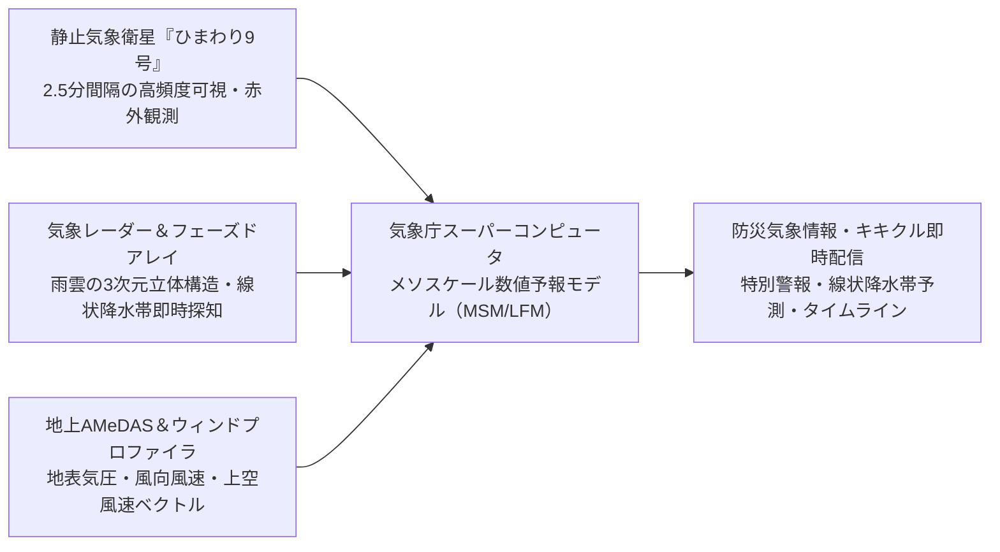

#### 気象庁「キキクル（危険度分布）」の色彩コードと避難行動
気象庁がリアルタイム配信する「キキクル」は、土砂災害・浸水害・洪水害の危険度を $1\,\text{km}$ メッシュで可視化する。色の意味を正確に理解しなければならない。

| 危険度レベル | 表示色 | 警戒レベル相当 | 住民がとるべき具体的行動規範 |
| :--- | :--- | :--- | :--- |
| **極めて危険** | **濃い紫** | **レベル4相当（避難指示）** | **危険な場所にいる全員が必ず避難を完了していなければならない限界** |
| **非常に危険** | **うすい紫** | **レベル4相当（避難指示）** | 高齢者だけでなく一般住民も速やかに立ち退き避難を開始 |
| **警戒** | **赤** | **レベル3相当（高齢者等避難）** | 高齢者、障害者、乳幼児連れは直ちに避難。一般住民も避難準備 |
| **注意** | **黄** | **レベル2相当（大雨注意報）** | ハザードマップの再確認、避難経路・持ち出し品の最終点検 |
| **災害発生情報** | **黒** | **レベル5相当（緊急安全確保）** | **命の危険が切迫。もはや避難所への移動は不可能。命を守る最善の行動** |

---

### 9.2 タイムライン防災：72時間前からの行動チェックリスト

台風は接近速度が予測できるため、時間軸に沿った防災行動計画 **「タイムライン（Timeline）」** を策定・運用することが最も効果的である。

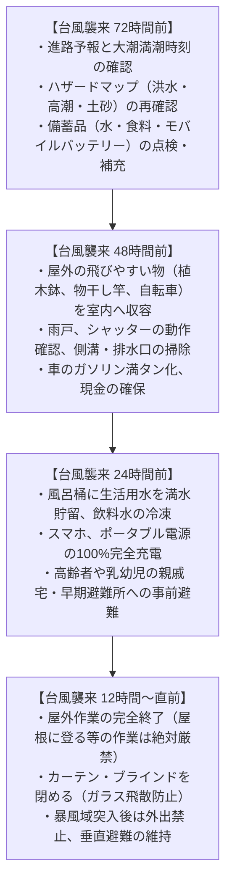

---

### 9.3 住まいとライフラインの科学的自衛策

#### 1. 窓ガラスの防護：養生テープの誤解と真の対策
SNS等で広く流布している「窓ガラスに養生テープやガムテープを米字型に貼る」という行為は、 **「ガラスの割れ（耐風圧強度）を防ぐ効果はほとんどない」** ことが建築工学の実験で証明されている。テープの真の目的は「割れた際の破片飛散をわずかに低減させること」に過ぎない。
- **真に有効な対策**:
  - 雨戸やシャッターを完全に閉めてロックする。
  - 雨戸がない窓には、防犯フィルムや飛散防止フィルムを全面に密着施工する。
 - 室内側では、 **「厚手の遮光カーテンを閉めてクリップや洗濯バサミで留めておく」** 。これにより、万一飛来物でガラスが粉砕されても、ガラス片が室内に猛烈な速度で散乱するのをカーテンが受け止めて防ぐことができる。

#### 2. 停電と断水に対する物理的備え
- **長期停電対策**: 現代の住宅（特にマンション）は停電すると給水ポンプが停止して断水し、エレベーターも停止する。大容量ポータブル電源（1000Wh以上）やソーラーパネルを常備し、医療機器や通信端末の電力を死守する。
- **水洗トイレの逆流と非常用トイレ**: 下水道が雨水で飽和すると、1階や地下の便器や排水口から汚水が噴出する（ゴボゴボ音はその予兆）。ビニール袋に水を入れた「水のう」を便器の中や風呂・洗濯機の排水口に置いて重しにする。断水時は無理に水を流さず、凝固剤入りの非常用携帯トイレ（1人1日5回×7日分）を使用する。

---

### 9.4 避難行動の意思決定規範：水平避難か垂直避難か

避難情報が発令された際、「避難所に行くこと」だけが避難ではない。避難（ひなん）とは **「難を避けること」** である。

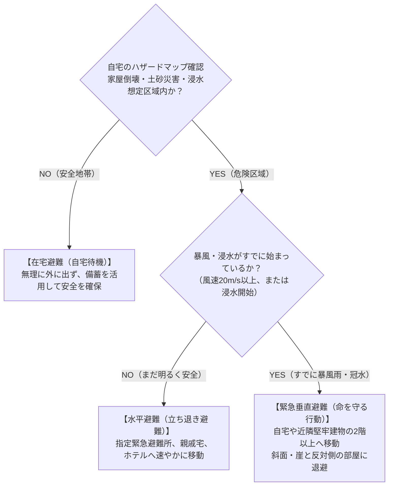

- **水平避難（立ち退き避難）のタイムリミット**:
  平均風速が $20\,\text{m/s}$ を超えると大人はまともに歩行できず、飛来物で致命傷を負うリスクが跳ね上がる。また、道路が $20\,\text{cm} \sim 30\,\text{cm}$ 冠水すると側溝やマンホールの境界が見えなくなり、水圧で車のドアが開かなくなる。暴風雨が本格化してからの屋外移動は「自殺行為」に等しい。
- **垂直避難の鉄則**:
  周囲が冠水したり夜間に暴風雨が猛威を振るっている場合は、無理に外に出て避難所へ向かうのではなく、自宅の2階以上（浸水想定高より高いフロア）、あるいは近隣の強固な鉄筋コンクリート造建物の高層階へ避難する。裏山が急傾斜地である場合は、土石流の直撃を避けるため「山と反対側の部屋」で過ごすことが生存率を最大化する。

---

## 結び：気候危機時代を生き抜く「科学の盾」と「想像力の砦」

地球温暖化の進行に伴い、海水温の上昇、大気中水蒸気量の増加、そして台風の極端化・低速化という気候クライシスは、もはや遠い未来の不確実な予測ではなく、私たちが今まさに直面している冷徹な物理的現実である。

台風という大自然の驚異を前にしたとき、私たち人間にできることは二つしかない。
一つは、流体力学や熱力学が解き明かす自然の厳格な物理法則を学び、気象レーダーや数値シミュレーションが発する早期警戒情報を正しく解読する **「科学の盾」** を持つことである。
もう一つは、「ここまでは水が来ないだろう」「自分の家だけは大丈夫だろう」という正常性バイアス（Normalcy Bias）を断ち切り、最悪のシナリオを先回りして想定する **「想像力の砦」** を築くことである。

室戸、枕崎、伊勢湾、カスリーン、洞爺丸、狩野川、そして近年のハギビスやチェービー――先人たちが流した無念の涙と、そこから立ち上がって築き上げてきた堤防、放水路、法制度、建築基準の尊い遺産を私たちは決して風化させてはならない。正しい知識を武器とし、科学に裏打ちされたタイムライン行動を実践することによってのみ、私たちは激甚化する気候変動の時代において、命と暮らしを未来へと繋ぎ止めることができるのである。
