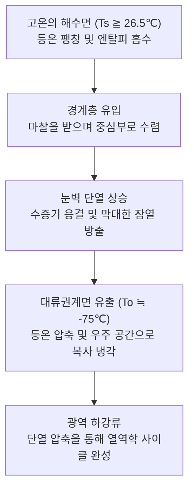
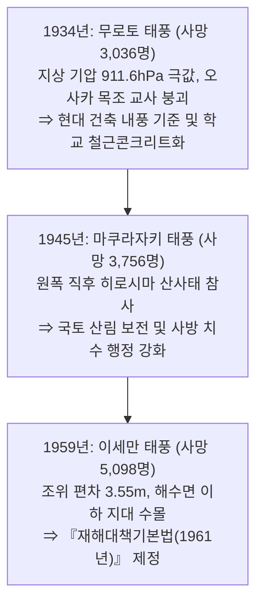
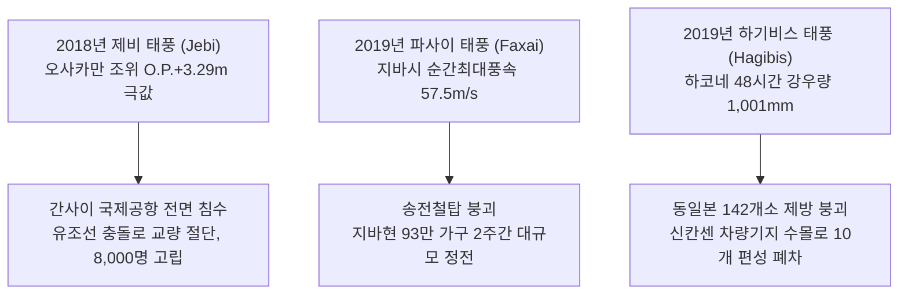

## 머리말: 대기·해양의 거대 열기관과 마주하며

열대의 작열하는 태양이 내리쬐는 대양 위로 피어오르는 한 줄기 수증기. 지구 자전이 빚어내는 보이지 않는 전향력에 의해 회전을 시작한 대류는 수백에서 수천 킬로미터에 이르는 거대한 소용돌이 체계로 자기 조직화합니다. 이것이 바로 **태풍(열대저기압: Tropical Cyclone)** 입니다.

태풍은 지구상에서 가장 강력하면서도 완벽한 기하학적 조화를 지닌 대기 현상입니다. 행성적 규모에서는 저위도의 과잉 열에너지를 극지로 수송하는 필수적인 열역학적 안전밸브 역할을 수행하지만, 인간 사회로 진입하는 순간 폭풍, 폭풍해일, 극한 폭우라는 '파괴의 삼위일체'로 문명의 인프라를 순식간에 분쇄합니다.

일본과 동아시아는 북서태평양 태풍이 중위도 편서풍대로 전향하는 주 경로에 위치해 있습니다. 수천 년 동안 태풍이 가져다준 풍부한 수자원은 벼농사 문화를 지탱해 왔으나, 동시에 수많은 역사적 대재앙을 남겼습니다. 쇼와 시대를 대표하는 3대 태풍—무로토 태풍(1934년), 마쿠라자키 태풍(1945년), 이세만 태풍(1959년)—은 각각 수천 명의 인명 피해를 내며 현대 방재 행정, 건축 내풍 기준, 하천 유역 치수 공학을 탄생시킨 결정적 계기가 되었습니다.

오늘날 인류는 기후변화라는 미증유의 위기에 직면해 있습니다. 해수면 온도 상승과 대기 중 수증기량 급증은 인공섬 해상공항 침수(2018년 제비 태풍), 수도권 전력망 장기 마비(2019년 파사이 태풍), 142개소 제방 붕괴(2019년 하기비스 태풍)로 이어졌습니다. 본 백서는 지구물리 유체역학, 열역학, 재해사, 생존 행동학을 통합하여 다가오는 슈퍼 태풍의 시대에 생명과 사회를 지켜내기 위한 과학적 방패를 제공합니다.

---

## 1. 열역학과 발생 메커니즘: 카르노 열기관으로서의 태풍

### 1.1 국제 분류와 풍속 기준

세계기상기구(WMO) 및 각국 기상청의 열대저기압 분류 기준은 다음과 같습니다.

| 분류 명칭 | 대상 해역 | 최대 풍속 측정 기준 | 판정 임계치 |
| :--- | :--- | :--- | :--- |
| **태풍 (Typhoon / 일본·한국)** | 북서태평양 및 남중국해 | **10분간 평균 최대 풍속** | $\ge 34\,\text{knots}$ (약 $17.2\,\text{m/s}$) |
| **타이푼 (미군 JTWC)** | 북서태평양 | **1분간 평균 최대 풍속** | $\ge 64\,\text{knots}$ (약 $33\,\text{m/s}$, 카테고리 1급) |
| **허리케인 (Hurricane)** | 북대서양, 카리브해, 북동태평양 | **1분간 평균 최대 풍속** | $\ge 64\,\text{knots}$ (약 $33\,\text{m/s}$) |
| **사이클론 (Cyclone)** | 인도양, 남태평양 | 3분~10분 평균 풍속 | $\ge 34\,\text{knots}$ 또는 $\ge 64\,\text{knots}$ |

---

### 1.2 카르노 사이클 모델과 최대 잠재 강도(MPI) 이론

MIT의 케리 에마누엘(Kerry Emanuel) 교수는 태풍을 거대한 **카르노 열기관(Carnot Heat Engine)** 으로 정식화했습니다. 따뜻한 해수면($T_s$)에서 엔탈피를 흡수하고, 극도로 차가운 대류권계면($T_o \approx -75^\circ\text{C}$)으로 복사 냉각 배열하는 사이클입니다.

카르노 사이클의 열효율 $\epsilon = \frac{T_s - T_o}{T_s}$ 아래에서, 에마누엘의 **최대 잠재 강도(MPI)** 방정식은 정상상태 극한 풍속 $V_{\max}$ 를 다음과 같이 규정합니다.

$$V_{\max}^2 \approx \frac{C_k}{C_D} \frac{T_s - T_o}{T_o} \left( k_s^* - k \right)$$

해수면 온도가 $1^\circ\text{C}$ 상승할 때마다 대기-해양 간 엔탈피 불균형 $(k_s^* - k)$ 이 비선형적으로 증가하여 태풍의 극한 강도가 급격히 증폭됩니다.

---

### 1.3 발생 조건과 불안정 이론(CISK / WISHE)

- **해수면 온도 $26.5^\circ\text{C}$ 이상 및 해양열용량(TCHP)** : 수심 $50\,\text{m} \sim 100\,\text{m}$ 까지 고온층이 유지되어야 자가 냉각 용승(Upwelling)을 극복할 수 있습니다.
- **전향력(Coriolis Parameter)** : 위도 $5^\circ$ 이상에서만 와도가 형성됩니다.
- **낮은 연직 바람 시어(VWS $< 10\,\text{m/s}$)** : 상하층 바람 차이가 작아야 온난핵(Warm Core)의 기둥이 수직을 유지합니다.
- **CISK 및 WISHE 불안정** : 지표 풍속 증가가 증발 플럭스를 급격히 증대시키는 피드백(WISHE)이 폭발적 급발달(Rapid Intensification)을 견인합니다.

---

## 2. 입체 구조와 유체역학적 평형

- **경계층 유입(0–1.5 km)**, **눈벽 상승 코어(1.5–14 km)**, **대류권계면 발산류(12–16 km)** 의 3차원 순환.
- **태풍의 눈(Eye)** 과 **각운동량 보존 법칙**: 중심에 다가갈수록 원심력이 세제곱에 반비례해 폭발하며 동적 장벽을 형성하고, 내부의 강제 하강류 단열 압축 승온이 구름을 증발시킵니다.
- **이중 눈벽 치환 사이클(ERC)**: 초강력 태풍에서 외측 눈벽이 내측을 흡수하며 세력이 주기적으로 재편됩니다.
- **경도풍 평형(Gradient Wind Balance)** 과 **위험반원**: 진행방향 우측은 회전풍속과 이동속도가 더해져($v_{\text{net}} = v_{\text{rot}} + v_{\text{trans}}$) 극심한 폭풍과 해일을 유발합니다.

---

## 3. 진로 역학과 온대저기압화(ET)

태풍 진로는 북태평양 고기압의 가장자리 지향류(Steering Flow)와 편서풍 제트기류에 의해 결정됩니다. 기상 정보에서 "온대저기압으로 변질되었다"는 것은 소멸이 아니라 **에너지원의 전환(잠열 구동 $\to$ 한랭·온난 기단 충돌에 의한 위치에너지 전환)** 입니다. 강풍 반경이 수백 킬로미터로 급팽창하여 광범위한 피해를 초래합니다.

---

## 4. 쇼와 3대 태풍과 현대 방재의 기틀

1. **무로토 태풍(1934년)**: 고치현 무로토곶에서 지상 기압 **$911.6\,\text{hPa}$** 기록. 등교 시간대 오사카를 직격하여 목조 교사 260여 동이 붕괴, 아동 600여 명 사망. 현대 건축 내풍 규정의 시발점이 되었습니다.
2. **마쿠라자키 태풍(1945년)**: 패전 직후 $916.3\,\text{hPa}$ 로 상륙. 원폭 피해를 입은 히로시마 오노육군병원에 산사태가 덮쳐 의료진과 피폭자 156명이 희생되는 등 국토 황폐화의 비극을 겪었습니다.
3. **이세만 태풍(1959년)**: 중심기압 $929\,\text{hPa}$ 로 상륙. 나고야항에 **$3.55\,\text{m}$ 의 기록적 폭풍해일**이 덮쳐 5,098명이 희생되었습니다. 일본 국회는 **《재해대책기본법》** 을 제정하고 종합 방재 국가로 도약했습니다.

---

## 5. 대표적 역사적 풍수해

- **캐슬린 태풍(1947년)**: 도네강 제방 붕괴로 도쿄 동부 저지대 침수, 수도권 외곽 방수로 건설의 모태가 됨.
- **도야마루 태풍(1954년)**: 온대저기압 재발달로 쓰가루 해협에서 여객선 도야마루 등 5척 침몰, **1,430명 사망**. 세이칸 해저터널 착공의 결정적 계기.
- **가노가와 태풍(1958년)**: 이즈반도에 $750\,\text{mm}$ 집중호우로 토석류 발생, 1,200여 명 사망.

---

## 6. 기후변화 시대의 헤이세이·레이와 격심 태풍

---

## 7. 세계의 극단적 열대저기압과 미래 전망

- **팁 태풍(Tip / 1979년)**: 세계 기상 관측 사상 최저 기압 **$870\,\text{hPa}$**, 강풍 직경 **$2,220\,\text{km}$** (일본 열도 전체를 뒤덮는 크기).
- **하이옌 태풍(Haiyan / 2013년)**: 필리핀 상륙 시 중심기압 $895\,\text{hPa}$, 순간풍속 **$105\,\text{m/s}$ ($378\,\text{km/h}$)**, 해일성 파도로 7,300여 명 희생.
- **IPCC 기후 전망**: 총 발생 수는 일정하거나 소폭 감소하나, **카테고리 4~5급 슈퍼 태풍의 비중이 뚜렷하게 증가** 하며 강수 강도와 중심 지속력이 북상할 것으로 예측됩니다.

---

## 8. 피해의 물리: 풍압 제곱 법칙과 폭풍해일

$$P = \frac{1}{2} \rho v^2 C_f$$

풍속이 2배가 되면 파괴력은 4배, 3배가 되면 9배로 급증합니다. 파편에 의해 창문이 파손되면 실내 압력이 급상승하고 지붕 흡입력과 결합하여 지붕 전체가 폭발하듯 뜯겨나갑니다. 폭풍해일은 기압 저하에 따른 **흡인 효과(1hPa당 약 1cm)** 와 바람에 의한 **취송 효과(풍속 제곱에 비례, 수심에 반비례)** 가 결합하여 천문조 만조와 겹칠 때 극대화됩니다.

---

## 9. 프런티어 기상과 종합 생존 전략

- **72시간 전**: 재해위험지도 확인, 만조 시각 점검.
- **48시간 전**: 실외 낙하물 실내 이동, 배수구 정비.
- **24시간 전**: 생활용수 확보, 보조배터리 완충, 취약계층 조기 대피.
- **대피 판단**: 풍속 $20\,\text{m/s}$ 이전 수평 대피 완료, 침수 시작 후에는 무리한 이동을 금하고 견고한 건물의 2층 이상으로 **수직 대피** 실행.

---

## 맺음말: 과학의 방패와 상상력의 요새

행성적 대기 에너지 앞에서 인류가 기댈 수 있는 버팀목은 두 가지입니다. 물리 법칙을 이해하고 조기경보를 해독하는 **과학의 방패**, 그리고 "내 집은 안전할 것"이라는 안이함을 깨뜨리는 **상상력의 요새** 입니다. 역사적 교훈을 바탕으로 한 선제적 방재 행동만이 기후 위기의 시대를 헤쳐 나갈 유일한 길입니다.
