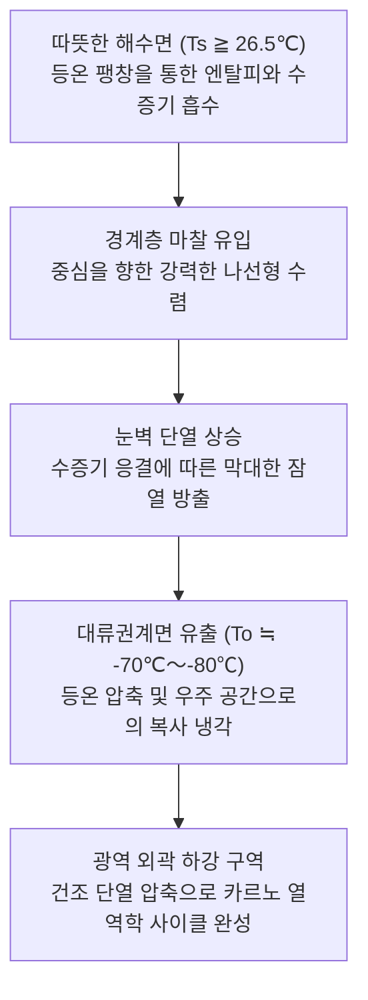
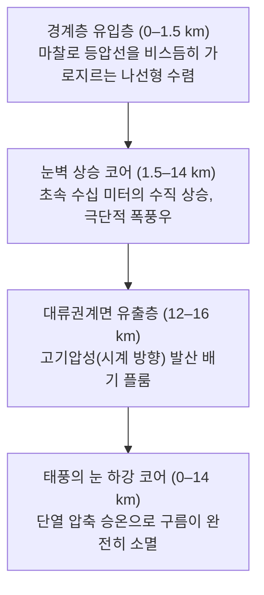
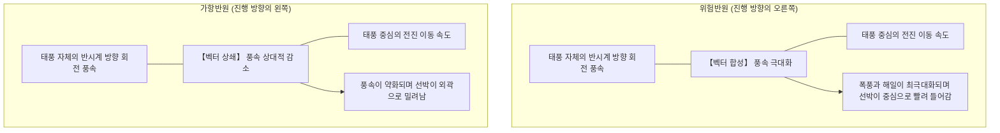
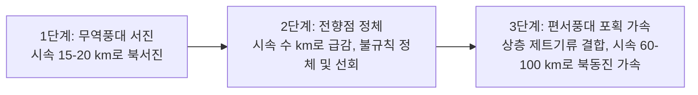
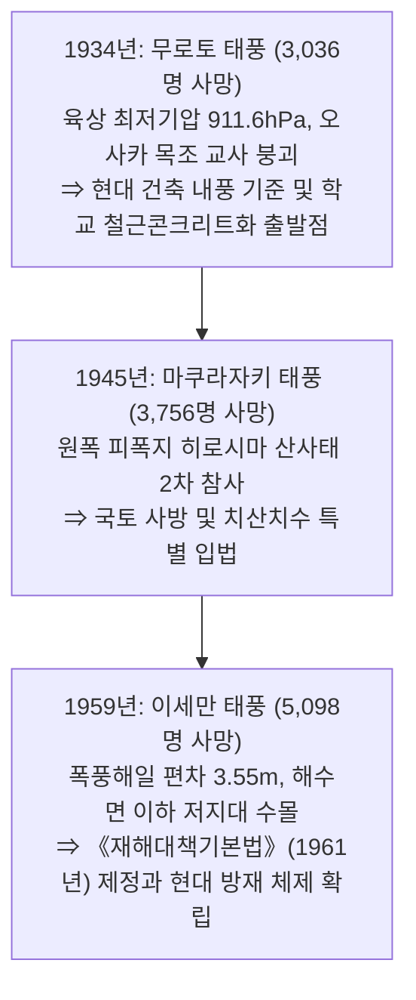
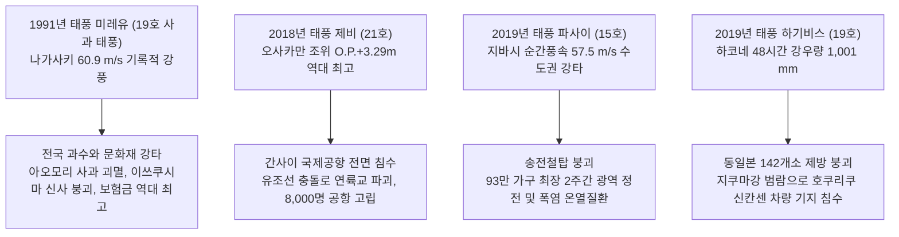
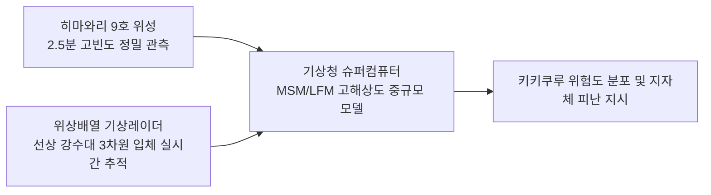
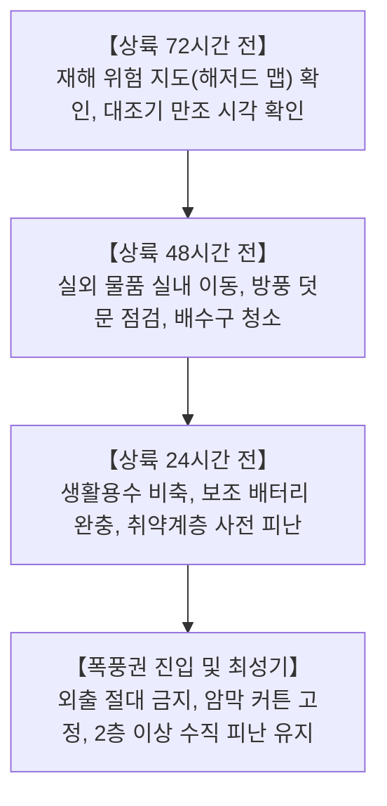
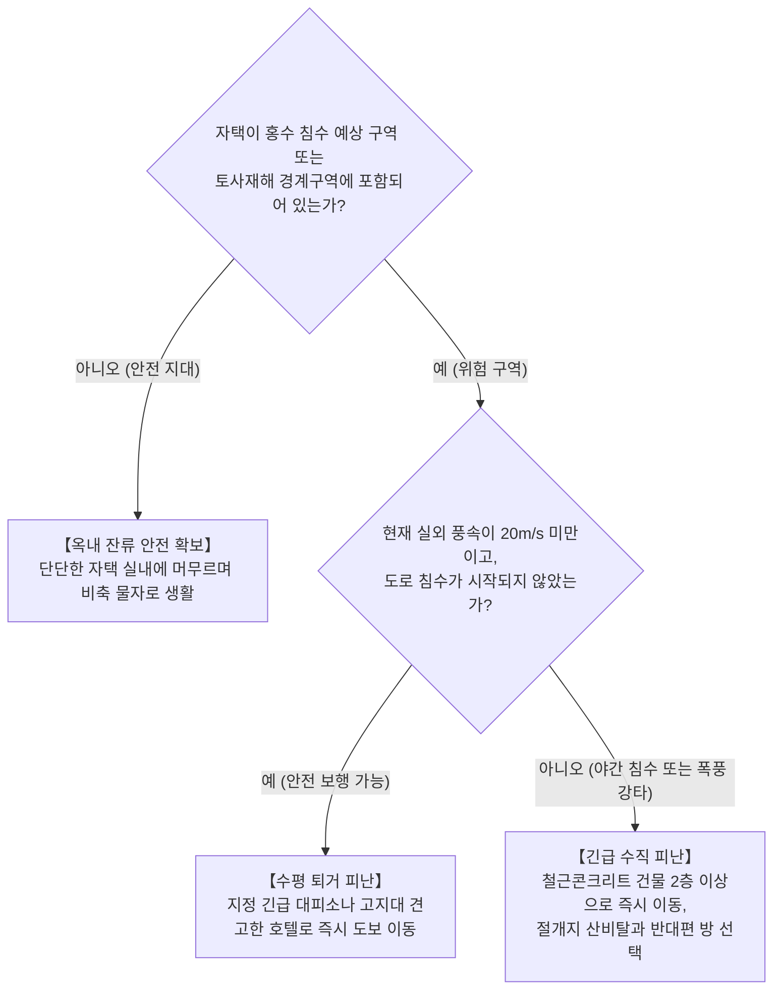

## 머리말: 대기-해양의 거대한 열기관과 마주하며

작열하는 열대의 태양이 내리쬐는 드넓은 대양에서 피어오르는 한 줄기 수증기. 이것이 지구의 자전이 만들어내는 보이지 않는 힘(전향력)에 의해 회전을 시작하고, 이윽고 직경 수백에서 천 킬로미터에 이르는 초거대 대기 순환계로 자기조직화를 이룹니다. 이것이 바로 **태풍(열대저기압: Tropical Cyclone)** 입니다.

태풍은 지구상에서 가장 강력하면서도 완벽한 기하학적 대칭성을 지닌 대기물리 현상 중 하나입니다. 지구적 규모에서는 저위도에 과도하게 축적된 태양 열에너지를 고위도 극지 냉각 싱크로 수송하는 필수적인 기후 조절 밸브 역할을 수행합니다. 그러나 일단 인간 문명의 생활권으로 진입하면, 허리케인급 폭풍, 해안 제방을 가볍게 삼키는 거대한 폭풍해일, 그리고 산하를 깎아내는 극한의 집중호우라는 '파괴의 삼위일체'로 수 시간 만에 현대 인프라를 무너뜨릴 수 있습니다.

일본 열도와 동아시아는 북서태평양에서 발생한 태풍이 중위도 편서풍대로 전향하는 주요 경로 아래에 위치해 있습니다. 수천 년 동안 벼농사를 지탱해 준 비의 축복인 동시에, 헤아릴 수 없이 참혹한 자연재해의 연속이었습니다. 1934년의 무로토 태풍, 1945년의 마쿠라자키 태풍, 1959년의 이세만 태풍(베라) 등 쇼와의 3대 태풍은 각각 수천 명의 고귀한 생명을 앗아갔으며, 현대의 《재해대책기본법》, 건축기준법, 그리고 유역 치수 공학을 탄생시킨 계기가 되었습니다.

21세기 인류는 기후변화라는 미증유의 환경 격변에 직면해 있습니다. 해수면 온도 상승과 대기 중 수증기 용량 증대(클라우지우스-클라페이롱 관계식)는 인공섬 공항의 완전 침수(2018년 태풍 제비), 수도권 송전탑 붕괴와 장기 정전(2019년 태풍 파사이), 142개소 제방 붕괴(2019년 태풍 하기비스)라는 극한 양상을 불러일으켰습니다. 본 백서는 지구물리 유체역학, 열역학, 방재사 및 생존 행동학에 이르기까지 폭넓은 지식을 체계화하여 미래 기후 위기에 맞설 과학적 방패를 제공합니다.

---

## 1. 열대저기압의 열역학 및 발생 메커니즘: 카르노 열기관으로서의 태풍

### 1.1 국제 분류 및 풍속 기준 정의
동역학적 기상학에서 따뜻한 해양을 에너지원으로 하는 회전성 저기압을 **열대저기압** 이라 총칭합니다. 주요 국제 기상기구의 풍속 기준은 다음과 같습니다:

| 분류 정의 | 해당 해역 | 풍속 측정 기준 | 판정 임계치 |
| :--- | :--- | :--- | :--- |
| **태풍 (Typhoon / 일본 기상청)** | 북서태평양 및 남중국해 | **10분 평균 최대 지속 풍속** | $\ge 34\,\text{knots}$ (약 $17.2\,\text{m/s}$) |
| **태풍 (미군합동태풍경보센터 JTWC)** | 북서태평양 | **1분 평균 최대 지속 풍속** | $\ge 64\,\text{knots}$ (약 $33\,\text{m/s}$, 1등급 허리케인 상당) |
| **허리케인 (Hurricane / 미국 NHC)** | 북대서양, 카리브해, 북동태평양 | **1분 평균 최대 지속 풍속** | $\ge 64\,\text{knots}$ (약 $33\,\text{m/s}$) |
| **사이클론 (Cyclone)** | 인도양 및 남서태평양 | 3분 또는 10분 평균 | $\ge 34\,\text{knots}$ 또는 $\ge 64\,\text{knots}$ |

일본 기상청(JMA) 강도별 세부 분류:
- **강한 태풍** : 최대 지속 풍속 $33\,\text{m/s} \sim 44\,\text{m/s}$ (64–84노트)
- **매우 강한 태풍** : 최대 지속 풍속 $44\,\text{m/s} \sim 54\,\text{m/s}$ (85–104노트)
- **맹렬한 태풍** : 최대 지속 풍속 $\ge 54\,\text{m/s}$ ($\ge 105\,\text{노트}$)

강풍 반경($15\,\text{m/s}$ 이상) 기준: 500km〜800km는 **대형** , 800km 이상은 **초대형** 으로 분류됩니다.

---

### 1.2 카르노 순환 모델과 최대 잠재 강도(MPI) 이론
MIT의 기상학자 케리 이매뉴얼(Kerry Emanuel)은 성숙한 열대저기압을 거시적인 **카르노 열기관(Carnot Heat Engine)** 으로 정식화하였습니다:

카르노 열기관의 열효율 $\epsilon$ 은 해수면 온도 $T_s$ 와 유출층 대류권계면 온도 $T_o$ 에 의해 결정됩니다:

$$\epsilon = \frac{T_s - T_o}{T_s}$$

열대 해역에서 $T_s \approx 300\,\text{K}$ ($27^\circ\text{C}$), $T_o \approx 200\,\text{K}$ ($-73^\circ\text{C}$)일 때 이론 열효율은 약 $33\%$ 에 달합니다. 해양 엔탈피 유입과 지표 공기역학적 마찰 소산이 평형을 이루는 정상 상태에서 이매뉴얼의 **최대 잠재 강도(MPI: Maximum Potential Intensity)** 이론은 중심 최대 풍속 $V_{\max}$ 를 다음과 같이 도출합니다:

$$V_{\max}^2 \approx \frac{C_k}{C_D} \frac{T_s - T_o}{T_o} \left( k_s^* - k \right)$$

여기서 $C_k$ 는 열엔탈피 교환 계수, $C_D$ 는 지표 마찰 항력 계수, $k_s^*$ 는 해수면 포화 엔탈피, $k$ 는 경계층 불포화 대기 엔탈피입니다. 해수면 온도가 불과 $1^\circ\text{C}$ 만 상승해도 열역학적 비평형 $(k_s^* - k)$ 이 비선형적으로 급증하여 태풍의 이론상 극한 강도가 현저하게 상승합니다.

---

### 1.3 발생을 위한 필수 열역학적 조건
1. **해수면 온도(SST) $\ge 26.5^\circ\text{C} \sim 27.0^\circ\text{C}$** : 잠열 엔진을 가동하기 위한 격렬한 증발량을 유지하는 절대 조건입니다. $26^\circ\text{C}$ 이하에서는 증발량이 급감합니다.
2. **열대저기압 열용량(TCHP: Tropical Cyclone Heat Potential)** : $26^\circ\text{C}$ 이상의 온수층 깊이가 $50\,\text{m}$ 내지 $100\,\text{m}$ 에 달해야 합니다. 온수층이 얕으면 태풍의 강풍이 유발하는 해수 난류 혼합으로 심층 냉수가 용승(Upwelling)하여 태풍을 스스로 냉각 소멸시킵니다. 필리핀 동쪽과 같은 높은 TCHP 해역은 급격한 발달(RI: Rapid Intensification)의 온상이 됩니다.
3. **전향력(코리올리 파라미터 $f = 2\Omega\sin\phi$)** : 위도가 최소 $5^\circ$ 이상이어야 합니다. 적도 무풍대(위도 $\pm 5^\circ$ 이내)에서는 전향력이 0에 가까워 공기가 저기압 중심으로 곧장 흘러들어가 회전 와도를 형성하지 못합니다.

---

### 1.4 역학적 초기 섭동과 연직 시어 한계
1. **중층 대류권 습도(700hPa–500hPa)** : 상대습도가 $70\%$ 이상이어야 합니다. 건조 공기가 유입되면 증발에 의한 강한 건조 하강기류가 발생하여 대류 세포가 붕괴합니다.
2. **하층 상대와도 및 수렴** : 열대수렴대(ITCZ) 또는 몬순 기압골이 초기 양의 배경 와도를 제공해야 합니다.
3. **약한 연직 바람 시어(VWS $< 10\,\text{m/s}$ / 20노트)** : 하층(850hPa)과 상층(200hPa) 간 풍속 벡터 차이가 작아야 합니다. 강한 바람 시어는 응결열로 형성된 상층 온난핵을 날려버려 연직 순환 기둥을 기울어뜨리고 파괴합니다.

---

### 1.5 대류운의 자기조직화: CISK에서 WISHE 이론으로
- **제2종 조건부 불안정(CISK: Conditional Instability of the Second Kind)** : 차니와 엘리아센(1964)은 경계층 에크만 마찰 수렴과 수증기 응결 잠열에 의한 상층 온난핵 형성, 지상 기압 하강과 하층 수렴 강화 간의 양의 피드백 루프를 제시하였습니다.
- **바람 유도 지표 열교환(WISHE: Wind-Induced Surface Heat Exchange)** : 이매뉴얼(1986)은 대기 중에 미리 저장된 CAPE 없이도 지표 풍속에 비례하여 해양 증발 플럭스가 비선형적으로 증가($F_k \propto v$)함으로써 자가 증폭적인 폭발적 발달이 일어난다는 이론을 확립하였습니다.

---

## 2. 3차원 소용돌이 구조와 유체역학적 평형

### 2.1 입체 순환 구조

1. **경계층 유입층 (0–1.5 km)** : 지표 마찰이 지형풍 평형을 깨뜨려 기류가 등압선을 가로질러 나선형으로 중심을 향해 수렴하며 열과 수증기를 공급받습니다.
2. **눈벽 상승 코어 (1.5–14 km)** : 원심력 장벽에 가로막힌 기류가 수직에 가까운 대류운 벽을 이루며 치솟아 극한의 강풍과 폭우를 쏟아냅니다.
3. **상층 유출층 (12–16 km)** : 대류권계면 부근의 고기압에서 시계 방향(북반구)으로 회전하며 외부로 배출됩니다.

---

### 2.2 태풍의 눈 역학과 각운동량 보존
**태풍의 눈(Eye)** 은 절대각운동량 보존 법칙에 의해 형성됩니다:

$$M = v r + \frac{1}{2} f r^2 = \text{const}$$

반경 $r$ 이 0에 가까워질수록 접선 속도 $v$ 는 폭발적으로 증가하며, 외향 원심력($v^2/r$)은 $r^{-3}$ 의 비율로 급증합니다. 최대풍속반경(RMW)에서 원심력과 기압경도력이 역학적 평형을 이루어 기류는 더 이상 중심에 침투하지 못하고 눈벽으로 솟구칩니다.

눈 내부에서는 주위의 거대한 질량 배출을 보상하기 위해 강제적인 **하강기류** 가 유도됩니다. 하강하는 공기는 건조 단열 압축 승온($9.8^\circ\text{C/km}$)을 겪으며 모든 수증기 입자를 증발시켜 맑고 온난하며 바람이 잔잔한 눈을 만듭니다.

---

### 2.3 이중 눈벽 대체 주기(ERC)
4–5등급의 슈퍼 태풍에서는 동심원 형태의 눈벽 대체 주기가 빈번히 관찰됩니다:

외부 눈벽이 형성되면 중심부로 들어가는 수증기 유입을 차단하여 내부 눈벽이 쇠퇴 붕괴합니다. 이후 외부 눈벽이 서서히 내부로 수축하면서 태풍은 단기적 약화 후 강풍 반경을 크게 확장하며 2차 폭발적 재발달을 이룹니다.

---

### 2.4 나선형 강우대(스파이럴 밴드)의 파동역학
- **내부 강우대 (중심 100km 이내)** : 소용돌이 로스비파(VRW)와 중력파의 결합 파동으로 전파되며, 중심 눈벽으로 절대각운동량을 전달합니다.
- **외부 강우대 (중심 200–500km)** : 태풍 중심 상륙 수 시간 내지 반나절 전에 국지적 다운버스트와 토네이도를 동반한 돌풍을 일으킵니다.

---

### 2.5 수평 풍속 분포: 경도풍 평형과 랭킨 와
수평 방향의 공기 흐름은 **경도풍 평형(Gradient Wind Balance)** 을 따릅니다:

$$\frac{1}{\rho} \frac{\partial p}{\partial r} = f v + \frac{v^2}{r}$$

접선 풍속 분포는 **수정 랭킨 와(Modified Rankine Vortex)** 로 정밀 모델링됩니다:
- RMW 내부 ($r < R_{\max}$): 강체 회전과 같이 각속도가 일정하여 $v(r) = V_{\max} (r / R_{\max})$.
- RMW 외부 ($r \ge R_{\max}$): 포텐셜 와의 감쇠 특성을 보여 $v(r) = V_{\max} (R_{\max} / r)^x$ ($x \approx 0.5 \sim 0.7$).

---

### 2.6 위험반원과 가항반원의 유체역학

북반구에서 태풍 진행 방향의 우측은 **위험반원** 으로, 반시계 방향 회전 풍속과 전진 이동 속도가 같은 방향으로 더해져($v_{\text{net}} = v_{\text{rot}} + v_{\text{trans}}$) 해일과 풍속이 극대화됩니다.

---

## 3. 태풍 이동 궤적 역학 및 온대저기압화(ET)

### 3.1 지향류와 북태평양 아열대 고기압
태풍의 진로는 대류권 전체의 가중 평균 대규모 흐름인 **지향류(Steering Flow)** 에 의해 좌우되며, 주로 북태평양 고기압의 서쪽 가장자리 기류를 따라 이동합니다.

### 3.2 전향(리커브) 메커니즘과 앙상블 예보

북위 $25^\circ \sim 30^\circ$ 부근에서 중위도 편서풍(제트기류)과 조우하면서 북동쪽으로 급격히 시계 방향 전향(Recurvature)하며 시속 $60 \sim 100\,\text{km/h}$ 로 쾌속 북상합니다. 최신 수치예보는 다중 모델 **앙상블 예보기법** 을 적용하여 $70\%$ 확률 반경 원으로 진로의 불확실성을 표시합니다.

### 3.3 베타 드리프트($\beta$ 효과)에 의한 북서 편향
주위 지향류가 전혀 없는 가상의 정지 대기에서도 태풍은 전향력의 위도별 경도 변화($\beta = df/dy$)로 인해 자발적으로 **북서쪽** 으로 이동합니다. 이를 '베타 드리프트'라 하며, 대칭 순환이 행성 와도를 이류시켜 태풍 양쪽에 반대 부호의 '베타 자이어(Beta Gyres)'를 유도하기 때문입니다.

### 3.4 후지와라 효과(Fujiwhara Effect): 이중 소용돌이 상호작용
두 열대저기압이 $1,000 \sim 1,500\,\text{km}$ 이내로 접근하면 공통 질량 중심을 축으로 서로 반시계 방향으로 회전하며 복잡한 궤도를 그립니다:

### 3.5 온대저기압화(ET)의 에너지 스위치
"태풍이 온대저기압으로 변했다"는 방송은 결코 위험이 사라졌음을 의미하지 않습니다. 기상역학적으로 온대저기압화는 **에너지 구동 엔진의 전환** 입니다:
- **열대 단계** : 해양 수증기 잠열 구동, 순압 온난핵 구조, 파괴력이 중심 눈벽 수십 km 반경에 집중.
- **온대 단계** : 찬 공기와 따뜻한 공기의 온도 기울기(경압 불안정성) 구동, 전선 구조 형성.
변성 과정에서 강풍 반경이 수십 km에서 **수백 내지 천 km** 로 급격히 확장되어 초광역 해상 조난과 해안 강풍 피해를 유발합니다.

---

## 4. 쇼와 3대 태풍과 전후 일본의 파멸적 재해사

### 4.1 무로토 태풍(1934년): 관서 궤멸과 목조 학교 붕괴의 비극
1934년 9월 21일 고치현 무로토곶에서 일본 관측 사상 최저 육상 기압인 **$911.6\,\text{hPa}$** 을 기록했습니다. 오전 등교 시간에 오사카를 순간풍속 $60\,\text{m/s}$ 이상의 폭풍으로 직격하여, 가새 보강이 없던 260여 동의 목조 학교 건물이 무너져 아동 600여 명이 사망했습니다. 총 사망자는 3,036명에 달했으며, 이를 계기로 가새 설치 의무화 등 건축 기준과 학교 건물의 철근콘크리트화가 전국적으로 추진되었습니다.

### 4.2 마쿠라자키 태풍(1945년): 원폭 폐허를 덮친 이중의 비극
종전 불과 한 달 후인 1945년 9월 17일, 중심기압 $916.3\,\text{hPa}$ 의 맹렬한 세력으로 규슈에 상륙했습니다. 전시 산림 남벌로 황폐화된 산야에 폭우가 쏟아졌고, 원폭으로 괴멸된 히로시마 일대에 거대한 토석류가 발생했습니다. 오노 육군병원에서는 원폭 피해 환자를 치료하고 연구하던 교토제국대학 조사단과 환자 156명이 토석류에 휩쓸려 세토내해로 밀려가 희생되었습니다. 전국 3,756명이 사망·실종되어 전후 산림 복구와 사방 사업 입법을 촉진했습니다.

### 4.3 이세만 태풍(베라 / Vera, 1959년): 현대 방재 행정의 원점
1959년 9월 26일 기이반도에 상륙한 중심기압 $929\,\text{hPa}$ 의 태풍 베라는 전후 일본 최악의 자연재해였습니다:
- **기상역학적 최악의 조건** : 이세만 전체가 위험반원에 들어가며 남남동풍의 강력한 밀어올림과 기압 흡입 효과가 겹쳐 나고야항에 사상 최고인 **$3.55\,\text{m}$ 의 폭풍해일 편차** 가 발생했습니다.
- **저지대와 거대 원목의 습격** : 해안 목재 야적장의 거대한 수입 원목 수만 톤이 거대한 파도에 떠내려가며 방조제를 파괴하는 공성퇴 역할을 하였습니다. 바닷물이 대규모 간척 저지대(제로미터 지대)로 쏟아져 들어가 수개월간 빠지지 않았습니다.
- **방재대책기본법 제정** : **5,098명의 사망·실종자** 가 발생하자 일본 국회는 1961년 **《재해대책기본법》** 을 제정하여 국가 및 지자체 단위의 방재 계획과 재해 복구의 법적 근거를 확립했습니다.

---

## 5. 풍수해·해난·도시 수해를 초래한 역사적 태풍

- **캐슬린 태풍(1947년)** : 종전 후 복구가 미진했던 간토 지방에 폭우를 쏟아부어 도네강 제방이 붕괴되었습니다. 홍수가 도쿄 카츠시카구와 에도가와구까지 밀고 내려와 수몰시켰으며, 1,930명이 사망했습니다. 이 재해는 도쿄 수도권 방수로와 거대 치수 댐 계획의 시발점이 되었습니다.
- **도야마루 태풍(1954년)** : 쓰가루 해협에서 온대저기압으로 급격히 재발달하며 순간풍속 $57\,\text{m/s}$ 의 돌풍으로 세이칸 철도 연락선 '도야마루' 등 5척의 대형 선박을 침몰시켜 **1,430명의 익사자** 를 냈습니다. 이 참사는 24년에 걸친 난공사 끝에 완공된 세이칸 해저터널 건설의 직접적인 계기가 되었습니다.
- **가노가와 태풍(1958년)** : 시즈오카현 이즈반도 아마기산에 $750\,\text{mm}$ 의 기록적 폭우를 내려 '산 쓰나미'라 불린 토석류로 천여 명이 희생되었고, 도쿄 시내 주택 30만 동이 침수되었습니다. 이로 인해 가노가와 방수로 사업이 추진되었습니다.

---

## 6. 기후변화 속 극한 태풍 (헤이세이·레이와 시대)

- **태풍 미레유 (1991년 19호 태풍 / 사과 태풍)** : 초고속으로 일본 열도 서측을 종단하며 나가사키에서 $60.9\,\text{m/s}$ 의 기록적 폭풍을 몰고 왔습니다. 아오모리현 사과 수확물의 80%가 낙과 피해를 입고 국보 이쓰쿠시마 신사 노무대가 무너졌으며, 62명이 사망하고 일본 역사상 최대인 5,600억 엔 이상의 화재·풍수해 보험금이 지급되었습니다.
- **태풍 제비 (2018년 21호 태풍)** : 오사카만 역사상 최고 조위($+3.29\,\text{m}$)를 기록하며 해상 인공섬인 간사이 국제공항의 활주로와 지하 전기실을 완전히 수몰시켰습니다. 강풍에 닻이 끌린 유조선이 연륙교를 들이받아 유일한 진입로가 차단되면서 이용객 8,000명이 고립되는 사태가 발생했습니다.
- **태풍 파사이 (2019년 15호 태풍)** : 고밀도 소형 태풍이 도쿄만을 직격하며 지바시에서 $57.5\,\text{m/s}$ 의 극단적인 돌풍을 기록했습니다. 대형 송전철탑 2기와 수천 본의 전신주가 꺾여 지바현 전역 93만 가구가 최장 2주간 정전되었으며, 늦더위 속에 수많은 노인 온열질환 환자가 발생하는 2차 재해를 초래했습니다.
- **태풍 하기비스 (2019년 19호 태풍)** : 대기천(Atmospheric River) 현상으로 거대한 수증기가 유입되어 하코네에서 $1,001\,\text{mm}$ 의 비가 쏟아졌습니다. 동일본 71개 하천 142개소에서 제방이 무너졌으며, 나가노현 지쿠마강 범람으로 호쿠리쿠 신칸센 편성 차량 10편(전체 차량의 3분의 1)이 물에 잠겨 전량 폐기되었습니다.

---

## 7. 세계의 몬스터 열대저기압과 기후 관측 극치

- **태풍 팁(Tip / 1979년)** : 전 세계 기상 관측 사상 최저 해수면 기압 **$870\,\text{hPa}$** , 강풍 반경 직경 **$2,220\,\text{km}$** (일본 열도 전체를 뒤덮는 크기)를 기록하여 미 공군 정찰기 드롭존데 투하 관측으로 공인되었습니다.
- **슈퍼 태풍 하이옌(Haiyan / Yolanda / 2013년)** : 필리핀 상륙 시 중심기압 $895\,\text{hPa}$ , 추정 최대순간풍속 **$105\,\text{m/s}$ ($378\,\text{km/h}$)** . 거대한 수직 해일벽이 타클로반시를 덮쳐 7,300명 이상의 사망·실종자를 냈습니다.
- **허리케인 카트리나(2005년) & 샌디(2012년)** : 카트리나는 뉴올리언스 제방을 붕괴시켜 도시의 80%를 수몰시켰고, 샌디는 뉴욕시 지하철망을 침수시켜 대도시가 폭풍해일에 얼마나 취약한지를 입증했습니다.
- **IPCC 6차 평가보고서(AR6) 미래 전망** : 전체 열대저기압 발생 빈도는 일정하거나 소폭 감소할 가능성이 높으나, **4–5등급의 슈퍼 태풍 비율은 현저히 증가** 할 것으로 전망됩니다. 기온 $1^\circ\text{C}$ 상승당 강우 강도는 약 7%씩 강화되며, 이동 속도가 둔화되어 동일 지역에 더 긴 시간 동안 극한 폭우를 퍼부을 위험이 커지고 있습니다.

---

## 8. 태풍 피해의 유체역학: 풍압 2제곱 법칙, 폭풍해일 및 복합 수해

### 8.1 공기역학적 풍압 2제곱 법칙
바람이 구조물에 가하는 동압력 $P$ 는 풍속의 제곱에 비례합니다:

$$P = \frac{1}{2} \rho v^2 C_f$$

여기서 $\rho$ 는 공기 밀도(약 $1.2\,\text{kg/m}^3$), $C_f$ 는 풍력 계수입니다. 풍속이 $20\,\text{m/s}$ 에서 $40\,\text{m/s}$ 로 2배 증가하면 구조물에 가해지는 하중은 **4배** 로 뛰며, $60\,\text{m/s}$ 가 되면 **9배** 에 달합니다.

**창문 파괴의 연쇄 메커니즘** : 돌풍에 날아온 파편(미사일 현상)에 의해 유리창이 깨지면 외측의 강풍이 실내로 쏟아져 들어와 내부 압력을 급격한 양압으로 만듭니다. 동시에 지붕 외측에는 고속 기류에 의한 베르누이 부압(흡입력)이 작용합니다. 이 내외부 압력차가 결합하여 지붕 전체를 위로 들어 올려 폭발하듯 뜯어내게 됩니다.

### 8.2 폭풍해일(Storm Surge)의 수치역학적 메커니즘
해수면 상승 편차는 두 가지 물리 효과의 합입니다:

$$\Delta h = \Delta h_p + \Delta h_w$$

1. **역기압 효과(Inverse Barometer Effect: $\Delta h_p$)** : 중심 기압이 $1\,\text{hPa}$ 내려갈 때마다 해수면은 약 $1\,\text{cm}$ 빨려 올라옵니다.
2. **바람 밀어올림 효과(Wind Setup: $\Delta h_w$)** : 천수역 유체 방정식에 의해 지배됩니다:
   $$\frac{\partial h_w}{\partial x} \approx \frac{\rho_a C_D v^2}{\rho_w g H}$$
 수면 경사는 **풍속의 제곱에 비례** 하고 **수심 $H$ 에 반비례** 합니다. 수심이 얕고 만의 입구가 넓어 안쪽으로 갈수록 좁아지는 깔때기형 만(이세만, 도쿄만, 오사카만 등)에서는 밀려 들어온 바닷물이 외해로 빠져나가지 못하고 만 안쪽에 극단적으로 축적되어 거대한 해일 참사를 일으킵니다.

### 8.3 복합 홍수 메커니즘
- **외수 범람(제방 파괴 및 세굴)** : 하천 수위가 제방을 넘치면 보호되지 않은 제방 뒷면(비탈면)이 급격히 깎여나가며(세굴) 단숨에 붕괴됩니다.
- **내수 범람(배수 불능)** : 본류 하천의 수위가 높아지면 도심 빗물 배수 수문이 역류 방지를 위해 닫힙니다. 빗물 펌프장 용량을 초과하는 순간 도로망 전체가 침수됩니다.
- **백워터 현상(Backwater Effect)** : 본류 수위 급상승으로 지류 하천이 본류로 방류되지 못하고 물이 수 킬로미터 상류로 역류하여 취약한 지류 제방을 터뜨립니다.

---

## 9. 첨단 기상 예보와 완전 생존 방재 전략 (실전 매뉴얼)

### 9.1 일본 기상청 '키키쿠루(위험도 분포)' 색상 코드와 피난 기준
| 위험 경계 수준 | 지도 표시 색상 | 법정 기상경보 상당 | 주민 법정 행동 지침 |
| :--- | :--- | :--- | :--- |
| **극도로 위험** | **짙은 보라색 (Dark Purple)** | **경계레벨 4: 피난지시 (전원 피난)** | **위험 구역의 모든 주민은 이미 피난을 완료했어야 함** |
| **매우 위험** | **연한 보라색 (Light Purple)** | **경계레벨 4: 피난지시** | 일반 주민 즉시 주저 없이 안전한 곳으로 피난 시작 |
| **경계 상태** | **빨간색 (Red)** | **경계레벨 3: 고령자 등 피난** | 고령자, 장애인, 영유아 및 보호자 즉시 피난 시작 |
| **주의 준비** | **노란색 (Yellow)** | **경계레벨 2: 호우/홍수 주의보** | 피난 경로 및 재해 위험 지도, 비상 배낭 점검 |
| **재해 발생** | **검은색 (Black)** | **경계레벨 5: 긴급안전확보** | **생명에 직간접적 치명적 위험; 최후의 수직 피난으로 생명 보전** |

---

### 9.2 상륙 72시간 전 타임라인 방재 행동 체크리스트

- **상륙 72시간 전** : 해저드 맵을 열어 자택이 침수 예상 구역이나 산사태 경계 구역에 있는지 확인하고, 조석표를 통해 대조기 만조 시간대를 대조합니다.
- **상륙 48시간 전** : 발코니 화분, 건조대, 자전거를 실내로 들여놓고 옥상 및 배수구의 낙엽을 청소합니다. 금속제 덧문을 닫고 잠금장치를 점검합니다.
- **상륙 24시간 전** : 스마트폰, 보조 배터리, LED 랜턴을 완충하고 욕조에 물을 가득 받아 단수 시 변기 세척수로 대비합니다. 노약자는 안전한 친척 집이나 호텔로 사전 이동합니다.
- **폭풍우 최성기** : 하천 수위 확인이나 지붕 보수를 위해 밖으로 나가는 행위는 자살행위입니다. 창문에서 멀리 떨어져 두꺼운 커튼을 닫아둡니다.

---

### 9.3 주거지와 생명선의 과학적 방호법
- **유리창 테이핑의 오해와 진실** : **유리창에 X자나 쌀(米)자 형태로 박스테이프를 붙여도 바람에 대한 유리창 강도는 전혀 증가하지 않습니다.** 테이프는 깨졌을 때 파편이 크게 튀는 것을 줄여줄 뿐입니다. 진정한 방어책은 **외부 금속 덧문(셔터)을 내리고 잠그는 것** 이며, 실내 측에는 비산 방지 필름을 부착하고 **두꺼운 암막 커튼을 완전히 친 뒤 집게로 양끝을 고정** 하여 날아드는 유리 파편을 커튼 안쪽에 가두는 것입니다.
- **변기 및 배수구 역류 방지 '물주머니'** : 집중호우 시 도심 하수관 수압이 상승하여 1층 변기나 욕실 배수구로 오수가 역류합니다. 대형 쓰레기봉투 2장을 겹쳐 물을 절반쯤 채우고 공기를 뺀 뒤 묶어 만든 '물주머니'를 변기 속과 배수구 위에 올려놓아 수압으로 누릅니다.
- **14일 가정용 비상 비축 품목** :
  - 식수: 1인당 하루 3L 기준 비축.
  - 휴대용 가스레인지와 부탄가스: 가구당 28–42캔.
  - 대용량 리튬 배터리 파워뱅크: 1,000–2,000 Wh 용량.
  - 응고형 비상 간이변기 키트: 1인당 70회분 (14일 단수 대비).

---

### 9.4 피난 의사결정 알고리즘: 수평 피난인가 수직 피난인가?

- **수평 피난의 한계선** : 풍속이 $20\,\text{m/s}$ 를 넘거나 도로 침수 깊이가 $20\,\text{cm}$ 를 초과하면 보행이 불가능하며 맨홀 뚜껑 탈락 등으로 사망 위험이 급증하므로 야간에 밖으로 나가서는 안 됩니다.
- **수직 피난** : 침수가 이미 시작되었거나 야간이라면 밖으로 나가지 말고 튼튼한 건물 2층 이상으로 올라가되, 산비탈에 접한 방은 피해야 합니다.

---

## 맺음말: 과학의 방패와 상상력의 성채

행성 규모의 대기-해양 열기관이 뿜어내는 가공할 에너지 앞에서 인류가 생명을 지키는 기반은 두 개의 기둥입니다. 바로 유체와 열역학 법칙을 이해하고 조기경보 지표를 통찰하는 **과학의 방패** 와, '설마 나에게 그런 일이 일어나겠는가'라는 정상화 편향을 깨뜨리고 최악의 재해 시나리오를 예측하는 **상상력의 성채** 입니다. 수많은 선인들이 남긴 역사적 재해의 뼈아픈 교훈을 되새기며 과학적 타임라인에 따라 선제적으로 행동할 때, 우리는 심화되는 기후 위기의 격랑 속에서도 소중한 생명과 문명을 굳건히 지켜낼 수 있습니다.
