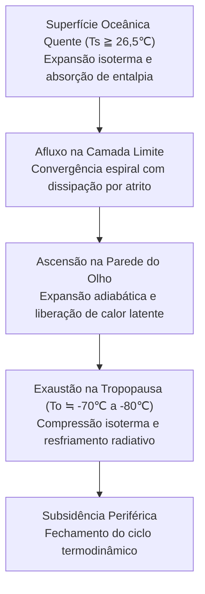
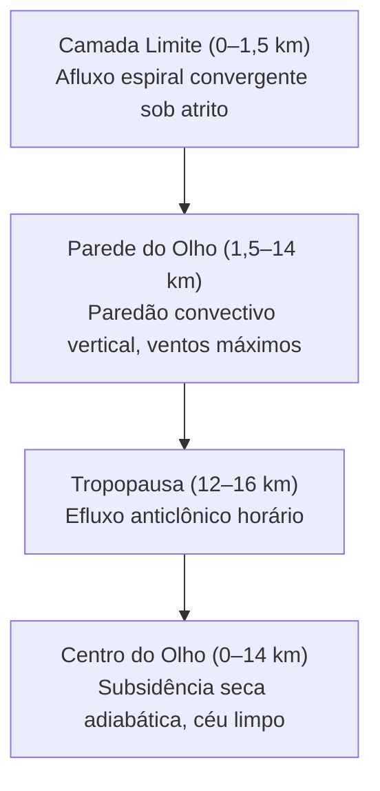
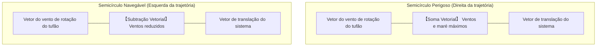
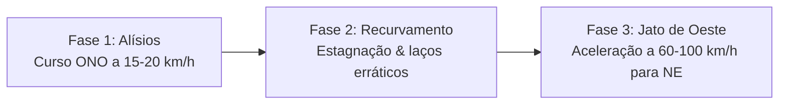
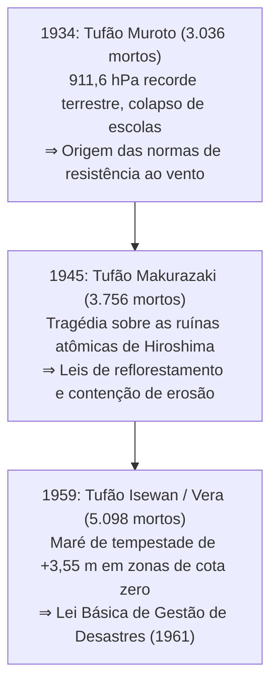
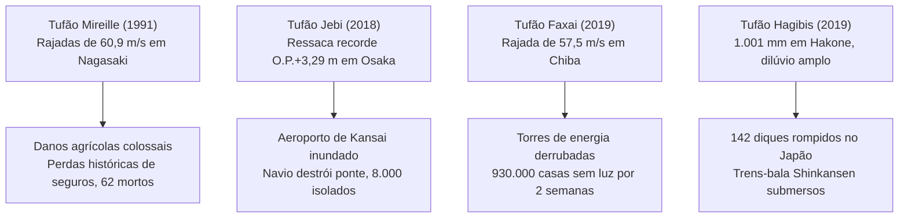
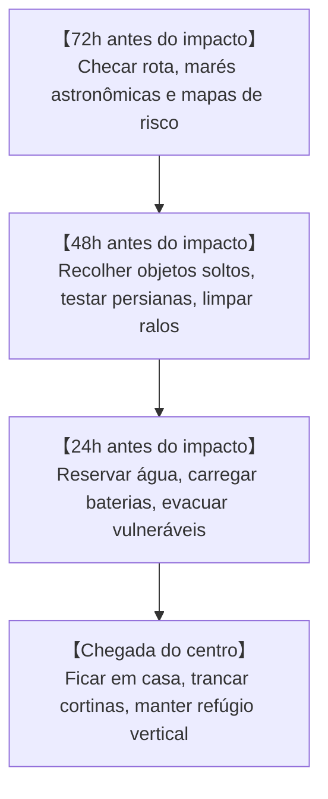
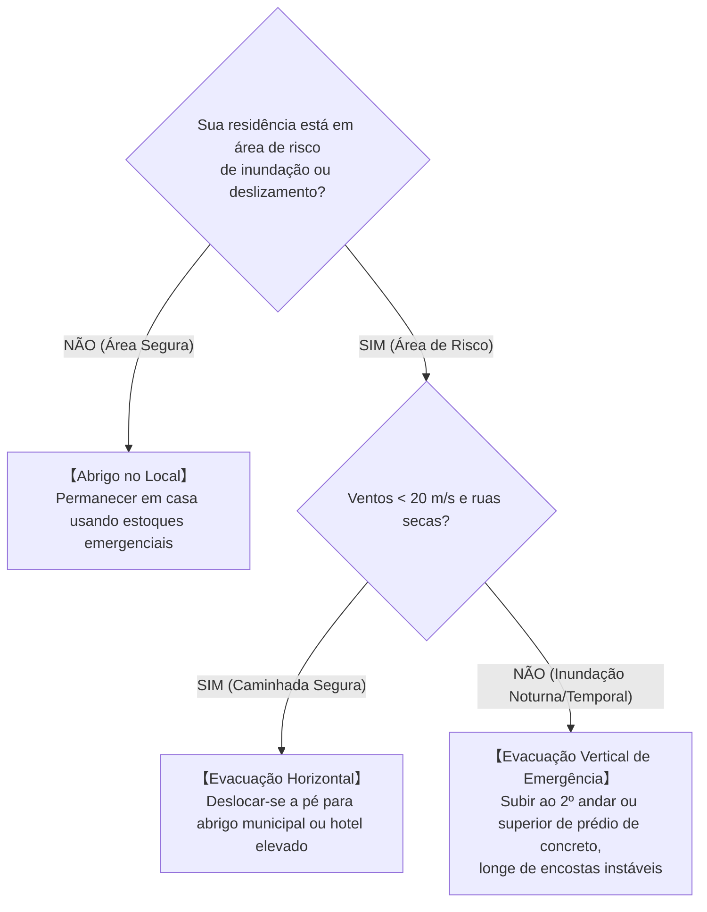

## Introdução: Diante dos Colossais Motores Térmicos do Oceano e da Atmosfera

Sobre a vasta extensão tropical aquecida pelo sol, ergue-se uma coluna invisível de vapor de água. Colocada em rotação pela força de Coriolis da rotação terrestre, essa convecção auto-organiza-se em um sistema circulatório colossal com centenas a milhares de quilômetros de diâmetro: o **Tufão (Ciclone Tropical)**.

Os tufões funcionam como gigantescas válvulas termodinâmicas planetárias, redistribuindo o calor solar acumulado no equador em direção aos polos. No entanto, quando colidem com áreas costeiras densamente povoadas, sua tríade devastadora – ventos com força de furacão, ressacas e marés de tempestade descomunais e inundações torrenciais – pode destruir infraestruturas modernas em poucas horas.

O arquipélago japonês situa-se sob o corredor direto onde os tufões do Pacífico Noroeste recurvam em direção aos ventos de oeste de latitudes médias. Três calamidades históricas da era Showa – os tufões Muroto (1934), Makurazaki (1945) e Isewan (Vera, 1959) – ceifaram milhares de vidas e moldaram a moderna Lei Básica de Gestão de Desastres do Japão. No século XXI, o aquecimento global amplifica esses extremos: a inundação do Aeroporto Internacional de Kansai (Tufão Jebi, 2018), o apagão elétrico de Tóquio (Tufão Faxai, 2019) e o rompimento simultâneo de 142 diques fluviais (Tufão Hagibis, 2019). Este tratado reúne a física dos fluidos, a história e as táticas de sobrevivência civil diante do agravamento das crises climáticas.

---

## 1. Termodinâmica e Gênese: O Tufão como Motor de Carnot

### 1.1 Classificação Internacional e Limiares
Na meteorologia dinâmica, centros de baixa pressão de núcleo quente sobre oceanos recebem o nome genérico de **Ciclones Tropicais**:

| Classificação | Bacia Oceânica | Padrão de Vento Sustentado | Limiar Operacional |
| :--- | :--- | :--- | :--- |
| **Tufão (JMA)** | Pacífico Noroeste & Mar da China Meridional | **Média de 10 minutos** | $\ge 34\,\text{nós}$ ($\approx 17,2\,\text{m/s}$) |
| **Tufão (JTWC)** | Pacífico Noroeste | **Média de 1 minuto** | $\ge 64\,\text{nós}$ ($\approx 33\,\text{m/s}$, Cat. 1) |
| **Furacão (NHC)** | Atlântico Norte, Caribe, Pacífico Nordeste | **Média de 1 minuto** | $\ge 64\,\text{nós}$ ($\approx 33\,\text{m/s}$) |
| **Ciclone Severo** | Oceano Índico, Pacífico Sudoeste | Média de 3 ou 10 minutos | $\ge 34$ ou $\ge 64\,\text{nós}$ |

Escala de intensidade da Agência Meteorológica do Japão (JMA):
- **Tufão Forte**: $33\,\text{m/s} \sim 44\,\text{m/s}$ (64–84 nós)
- **Tufão Muito Forte**: $44\,\text{m/s} \sim 54\,\text{m/s}$ (85–104 nós)
- **Tufão Violento**: $\ge 54\,\text{m/s}$ ($\ge 105\,\text{nós}$)

---

### 1.2 Ciclo de Carnot e Intensidade Potencial Máxima (MPI)
Kerry Emanuel (MIT) formulou o tufão maduro como um **Motor Térmico de Carnot**:

Rendimento termodinâmico $\epsilon$:

$$\epsilon = \frac{T_s - T_o}{T_s}$$

Para águas tropicais ($T_s \approx 300\,\text{K}$ ou $27^\circ\text{C}$ e $T_o \approx 200\,\text{K}$ ou $-73^\circ\text{C}$), a eficiência atinge cerca de $33\%$. A velocidade máxima teórica do vento $V_{\max}$ é governada pela equação de Intensidade Potencial Máxima (MPI):

$$V_{\max}^2 \approx \frac{C_k}{C_D} \frac{T_s - T_o}{T_o} \left( k_s^* - k \right)$$

O aumento de $1^\circ\text{C}$ na temperatura superficial marinha expande exponencialmente o desequilíbrio de entalpia $(k_s^* - k)$, elevando o teto de intensidade das tempestades.

---

### 1.3 Condições Físicas para Ciclogênese
1. **Temperatura da Superfície do Mar (SST) $\ge 26,5^\circ\text{C}$**: Fundamental para manter a taxa de evaporação que alimenta o calor latente.
2. **Potencial Térmico de Ciclone Tropical (TCHP)**: Camada de água acima de $26^\circ\text{C}$ de 50 m a 100 m de espessura para prevenir que a ressurgência de águas frias profundas (upwelling) resfrie a tempestade.
3. **Parâmetro de Coriolis ($f = 2\Omega\sin\phi$) em latitudes $>5^\circ$**: Essencial para induzir o giro ciclônico.
4. **Cisalhamento Vertical do Vento Fraco (VWS $< 10\,\text{m/s}$)**: Cisalhamento excessivo fragmenta a coluna vertical de calor.
5. **Teorias CISK e WISHE**: O acoplamento entre atrito e calor latente (CISK) e a evaporação amplificada pelo vento (WISHE, $F_k \propto v$) viabilizam a intensificação rápida.

---

## 2. Estrutura do Vórtice 3D e Hidrodinâmica

### 2.1 Arquitetura da Circulação 3D

- **Conservação do momento angular**: $M = vr + \frac{1}{2}fr^2 = \text{const}$. Conforme o ar converge para o centro ($r \to 0$), a aceleração centrífuga ($v^2/r$) cresce na ordem de $r^{-3}$, criando uma barreira dinâmica no Raio de Ventos Máximos (RMW). A descida forçada de ar seco aquece adiabaticamente ($9,8^\circ\text{C/km}$), desfazendo as nuvens no **Olho**.
- **Ciclo de Substituição da Parede do Olho (ERC)**: Em supertufões, uma parede externa anular corta a umidade da parede interna, que colapsa, seguida da contração da parede externa e alargamento do campo de vendavais.

- **Semicírculo Perigoso**: No hemisfério norte, à direita da trajetória, o vetor de translação soma-se ao vento de rotação ($v_{\text{net}} = v_{\text{rot}} + v_{\text{trans}}$), maximizando destruição e ressacas.

---

## 3. Cinemática de Trajetórias e Transição Extratropical (ET)

### 3.1 Fluxos Diretores e Recurvamento
Os tufões são conduzidos por fluxos de grande escala na troposfera.

### 3.2 Efeito Beta e Efeito Fujiwhara
O gradiente de Coriolis ($\beta = df/dy$) impulsiona o tufão de forma autônoma para o **noroeste**. A aproximação de dois ciclones a menos de 1.500 km induz a rotação mútua do **Efeito Fujiwhara**.

### 3.3 Transição Extratropical (ET)
A tempestade transmuta sua fonte energética: da liberação de calor latente para o gradiente baroclínico de massas de ar, expandindo a área de vendaval para **centenas de quilômetros**.

---

## 4. Os Três Grandes Tufões da Era Showa

- **Muroto (1934)**: $911,6\,\text{hPa}$ (menor pressão terrestre medida no Japão); rajadas acima de $60\,\text{m/s}$ colapsaram 260 escolas de madeira em Osaka, matando 600 crianças.
- **Makurazaki (1945)**: Atingiu Hiroshima um mês após a rendição bélica; fluxos de detritos arrastaram hospitais e causaram 3.756 mortes no total.
- **Isewan / Vera (1959)**: Ressaca devastadora ($+3,55\,\text{m}$ em Nagoya) com toras de madeira flutuantes que funcionaram como aríetes quebrando diques (5.098 mortos e desaparecidos). Deu origem à Lei Básica de 1961.

---

## 5. Inundações Históricas e Desastres Marítimos

- **Kathleen (1947)**: Rompeu os diques do rio Tone inundando Tóquio (1.930 mortos); inspirou os projetos modernos de contenção metropolitana.
- **Toya Maru (1954)**: 5 balsas ferroviárias afundadas no estreito de Tsugaru ($57\,\text{m/s}$, 1.430 mortos), acelerando a construção do túnel submarino Seikan.
- **Kanogawa (1958)**: $750\,\text{mm}$ de precipitação em Izu provocaram deslizamentos e inundaram 300.000 lares em Tóquio.

---

## 6. Tufões Extremos Contemporâneos na Era do Clima Agressivo

- **Mireille (1991)**: Rajadas de $60,9\,\text{m/s}$ em Nagasaki arrasaram pomares e templos, gerando indenizações de seguro recordes.
- **Jebi (2018)**: Ressaca de $+3,29\,\text{m}$ inundou o Aeroporto de Kansai; colisão de navio-tanque destruiu a ponte de acesso, isolando 8.000 passageiros.
- **Faxai (2019)**: Rajada de $57,5\,\text{m/s}$ derrubou torres de transmissão em Chiba (930.000 lares sem energia por duas semanas).
- **Hagibis (2019)**: $1.001\,\text{mm}$ de chuva em Hakone causaram 142 rompimentos de diques e submergiram pátios de trens-bala Shinkansen.

---

## 7. Recordes Globais e Projeções do IPCC

- **Tip (1979)**: Recorde mundial de baixa pressão (**$870\,\text{hPa}$**) e 2.220 km de diâmetro.
- **Haiyan / Yolanda (2013)**: Rajadas de **$378\,\text{km/h}$** e ressacas que mataram mais de 7.300 pessoas em Tacloban.
- **Furacões Katrina (2005) & Sandy (2012)**: Inundaram Nova Orleans e o metrô de Nova York.
- **IPCC AR6**: Aumento da proporção de ciclones Cat. 4–5 e aumento de 7% nas chuvas para cada $1^\circ\text{C}$ de aquecimento.

---

## 8. Física dos Danos: Carga Eólica, Ressacas e Inundações Compostas

### 8.1 Pressão Dinâmica do Vento
A pressão do vento obedece à lei do quadrado da velocidade:

$$P = \frac{1}{2} \rho v^2 C_f$$

Duplicar a velocidade do vento quadruplica a carga na estrutura; triplicá-la multiplica o esforço por nove.

### 8.2 Mecânica da Maré de Tempestade
$$\Delta h = \Delta h_p + \Delta h_w$$
Com o efeito barômetro inverso ($\Delta h_p \approx 1\,\text{cm/hPa}$) e o empilhamento do vento ($\frac{\partial h_w}{\partial x} \approx \frac{\rho_a C_D v^2}{\rho_w g H}$), inversamente proporcional à profundidade da água $H$.

### 8.3 Inundações Compostas
Transbordamento fluvial, erosão do talude do dique, inundação pluvial urbana por fechamento de comportas e refluxo fluvial (Backwater).

---

## 9. Alertas Avançados e Estratégia de Sobrevivência

### 9.1 Matriz de Alerta Kikikuru
| Nível | Cor | Alerta Oficial | Ação Civil Obrigatória |
| :--- | :--- | :--- | :--- |
| **Extremamente Perigoso** | **Roxo Escuro** | **Nível 4: Ordem de Evacuação** | **Evacuação deve estar concluída** |
| **Muito Perigoso** | **Roxo Claro** | **Nível 4: Ordem de Evacuação** | Evacuação imediata de todos |
| **Alerta** | **Vermelho** | **Nível 3: Evacuação Idosos** | Grupos vulneráveis evacuam já |
| **Atenção** | **Amarelo** | **Nível 2: Aviso de Chuva/Cheia** | Conferir rotas e kits |
| **Desastre em Curso** | **Preto** | **Nível 5: Segurança de Emergência** | **Perigo de morte: Refúgio vertical imediato** |

---

### 9.2 Linha do Tempo de 72 Horas

### 9.3 Autodefesa e Proteção Residencial
- **Mito da fita adesiva em janelas**: Fita adesiva em 'X' não evita a quebra mecânica do vidro; a proteção correta requer persianas metálicas, películas de segurança e **cortinas blackout grossas presas com grampos**.
- **Refluxo de esgoto**: Colocar sacos duplos com água em vasos sanitários e ralos do piso térreo para impedir retorno de esgoto.
- **Autonomia para 14 dias**: 3 litros de água/pessoa/dia, fogareiro portátil com 28 a 42 cartuchos de gás, estações de energia portáteis (1.000–2.000 Wh) e 70 sacos químicos para banheiro de emergência por pessoa.

### 9.4 Decisão de Evacuação: Horizontal vs. Vertical

---

## Conclusão: O Escudo da Ciência e a Fortaleza da Imaginação

Diante da força planetária dos tufões, a sociedade apoia-se em dois alicerces: o **Escudo da Ciência** – dominando leis físicas e interpretando alertas – e a **Fortaleza da Imaginação** – superando a negação do risco para antecipar desastres e proteger vidas.
