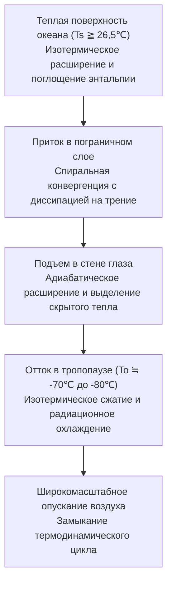
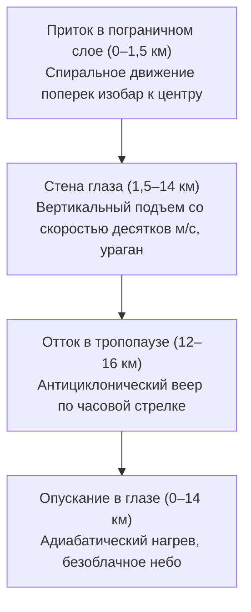
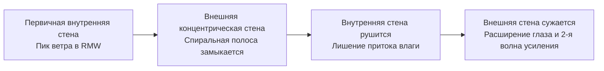
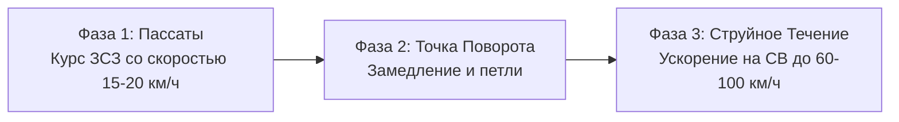
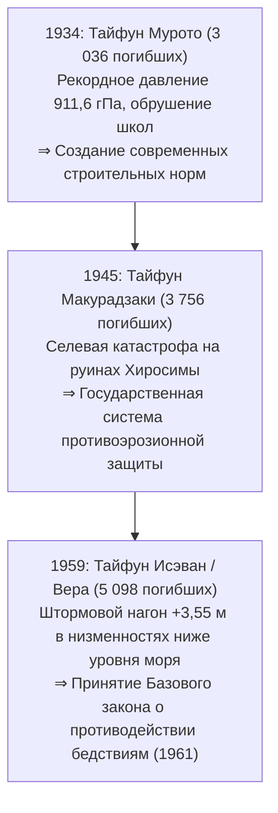
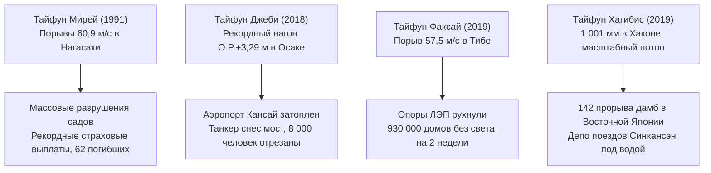
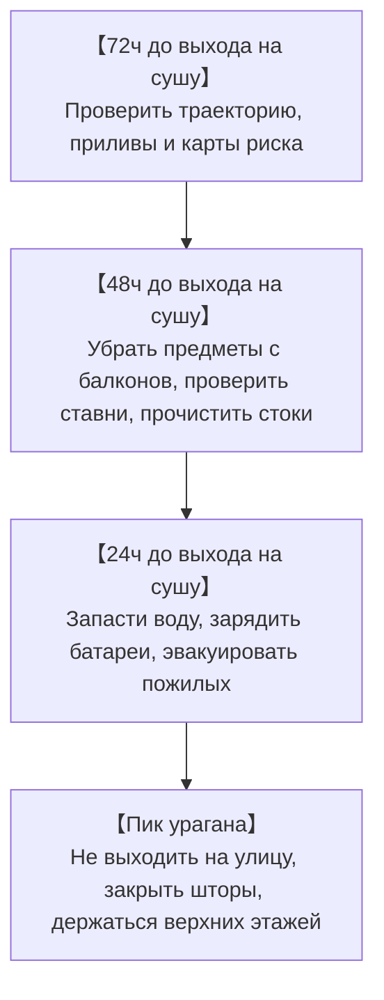
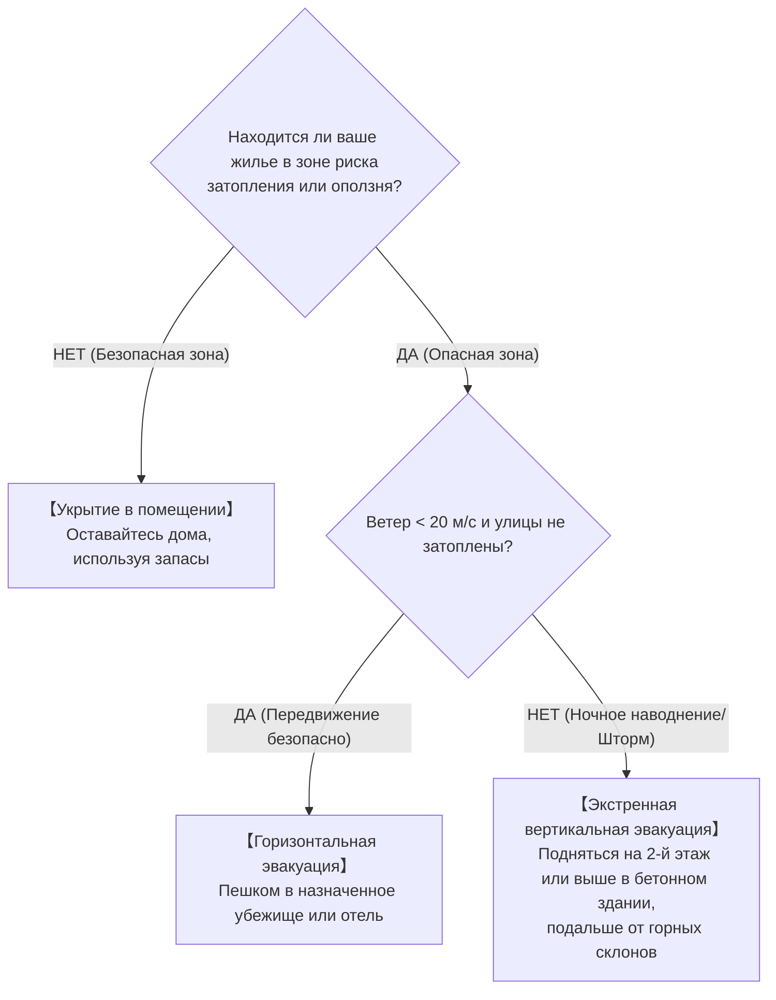

## Введение: Лицом к Лицу с Колоссальными Тепловыми Двигателями Океана и Атмосферы

Над раскаленными тропическими океанами поднимаются гигантские потоки невидимого водяного пара. Под действием силы Кориолиса, порожденной вращением Земли, конвективные скопления облаков самоорганизуются в колоссальную систему вихревой циркуляции диаметром от сотен до тысяч километров — **Тайфун (Тропический Циклон)**.

Тайфуны служат планетарными термодинамическими клапанами, переносящими избыточную солнечную энергию из экваториальных широт к полюсам. Однако при выходе на сушу их разрушительная триада — ураганные ветры, катастрофические штормовые нагоны и экстремальные ливни — способна стереть с лица земли современную инфраструктуру за считанные часы.

Японский архипелаг находится прямо на траектории поворота тайфунов северо-западной части Тихого океана в западный перенос умеренных широт. Три великие трагедии эпохи Сёва — тайфун Мурото (1934 г.), тайфун Макурадзаки (1945 г.) и тайфун в заливе Исэ (Вера, 1959 г.) — унесли жизни тысяч людей, заложив основы современного законодательства о защите от бедствий. В XXI веке изменение климата порождает экстремальные феномены: полное затопление аэропорта Кансай (тайфун Джеби, 2018 г.), масштабный двухнедельный блэкаут в районе Токио (тайфун Факсай, 2019 г.) и одновременный прорыв 142 речных дамб (тайфун Хагибис, 2019 г.). Данное руководство объединяет геофизическую гидродинамику, исторический опыт и практические протоколы выживания.

---

## 1. Термодинамика и Механизмы Генезиса: Тайфун как Тепловая Машина Карно

### 1.1 Международная Классификация и Пороги Скорости Ветра
В динамической метеорологии вращающиеся циклоны с теплым ядром над океаном называются **Тропическими Циклонами**:

| Классификация | Океанический Бассейн | Стандарт Измерения Ветра | Пороговый Критерий |
| :--- | :--- | :--- | :--- |
| **Тайфун (JMA)** | Северо-Западный Пацифик и Южно-Китайское море | **10-минутное среднее** | $\ge 34\,\text{узла}$ ($\approx 17,2\,\text{м/с}$) |
| **Тайфун (JTWC)** | Северо-Западный Пацифик | **1-минутное среднее** | $\ge 64\,\text{узла}$ ($\approx 33\,\text{м/с}$, аналог Кат. 1) |
| **Ураган (NHC)** | Северная Атлантика, Карибы, Северо-Восточный Пацифик | **1-минутное среднее** | $\ge 64\,\text{узла}$ ($\approx 33\,\text{м/с}$) |
| **Сильный Циклон** | Индийский океан, Юго-Западный Пацифик | 3- или 10-минутное среднее | $\ge 34$ или $\ge 64\,\text{узла}$ |

Японское метеорологическое агентство (JMA) градирует тайфуны по силе:
- **Сильный тайфун**: $33\,\text{м/с} \sim 44\,\text{м/с}$ (64–84 узла)
- **Очень сильный тайфун**: $44\,\text{м/с} \sim 54\,\text{м/с}$ (85–104 узла)
- **Свирепый тайфун**: $\ge 54\,\text{м/с}$ ($\ge 105\,\text{узлов}$)

---

### 1.2 Цикл Карно и Теория Максимальной Потенциальной Интенсивности (MPI)
Керри Эмануэль (MIT) описал зрелый тайфун как термодинамическую **Тепловую Машину Карно**:

Термический КПД $\epsilon$ определяется формулой:

$$\epsilon = \frac{T_s - T_o}{T_s}$$

При $T_s \approx 300\,\text{K}$ ($27^\circ\text{C}$) и $T_o \approx 200\,\text{K}$ ($-73^\circ\text{C}$) КПД достигает порядка $33\%$. Теория MPI определяет предельно возможную скорость ветра $V_{\max}$:

$$V_{\max}^2 \approx \frac{C_k}{C_D} \frac{T_s - T_o}{T_o} \left( k_s^* - k \right)$$

Повышение температуры поверхности моря всего на $1^\circ\text{C}$ вызывает резкий экспоненциальный рост энтальпийного неравновесия $(k_s^* - k)$ и колоссальное увеличение разрушительного потенциала.

---

### 1.3 Необходимые Физические Условия
1. **Температура поверхности моря (SST) $\ge 26,5^\circ\text{C}$**: Для поддержания интенсивного испарения.
2. **Теплосодержание океана (TCHP)**: Толщина слоя воды теплее $26^\circ\text{C}$ не менее 50–100 м, что препятствует охлаждению циклона апвеллингом глубинных холодных вод.
3. **Параметр Кориолиса ($f = 2\Omega\sin\phi$) на широтах $>5^\circ$**: Без него закручивание потоков невозможно.
4. **Слабый вертикальный сдвиг ветра (VWS $< 10\,\text{м/с}$)**: Предотвращает рассеивание теплого ядра.
5. **Теории CISK и WISHE**: Обратная связь между притоком трения и конденсацией (CISK) и ускоренное испарение под действием ураганных ветров (WISHE, $F_k \propto v$) вызывают взрывную интенсификацию.

---

## 2. 3D-Структура Вихря и Гидродинамическое Равновесие

### 2.1 Архитектура Циркуляции

- **Закон сохранения углового момента**: $M = vr + \frac{1}{2}fr^2 = \text{const}$. При сжатии к центру ($r \to 0$) центробежное ускорение ($v^2/r$) возрастает как $r^{-3}$, формируя непреодолимый динамический барьер в Радиусе Максимальных Ветров (RMW). Внутри индуцируется вынужденное нисходящее движение, которое за счет адиабатического нагрева ($9,8^\circ\text{C/км}$) полностью испаряет облака в **Глазе тайфуна**.
- **Цикл смены стены глаза (ERC)**: В супертайфунах внешняя кольцевая стена отсекает влагу от внутренней, вызывая её разрушение с последующим расширением штормового поля.

- **Опасный Полукруг**: В Северном полушарии справа от направления движения вектор вращения складывается со скоростью перемещения ($v_{\text{net}} = v_{\text{rot}} + v_{\text{trans}}$), что порождает максимальные штормовые нагоны и ураганные ветры.

---

## 3. Кинематика Траекторий и Внетропическая Трансформация (ET)

### 3.1 Ведущие Потоки и Поворот Траектории
Движение тайфунов определяется ведущими потоками на периферии субтропического антициклона.

### 3.2 Бета-Дрейф и Эффект Фудзивары
Градиент силы Кориолиса ($\beta = df/dy$) смещает тайфун на **северо-запад**. При сближении двух вихрей ближе 1 500 км возникает эффект их взаимного вращения (**Эффект Фудзивары**).

### 3.3 Внетропическая Трансформация (ET)
Тайфун переключает источник энергии: от скрытого тепла к бароклинным температурным контрастам, расширяя радиус шторма до **сотен километров**.

---

## 4. Три Великих Тайфуна Эпохи Сёва

- **Мурото (1934 г.)**: $911,6\,\text{гПа}$ (минимальное давление на суше в Японии); порывы свыше $60\,\text{м/с}$ обрушили 260 деревянных школ в Осаке, погубив 600 школьников.
- **Макурадзаки (1945 г.)**: Обрушился на Хиросиму через месяц после атомной бомбардировки ($916,3\,\text{гПа}$); сели смели военные госпитали (всего 3 756 погибших).
- **Исэван / Вера (1959 г.)**: Чудовищный штормовой нагон ($+3,55\,\text{м}$ в Нагое); тысячи бревен с лесоскладов таранили морские дамбы (5 098 погибших и пропавших). Послужил основой Базового закона 1961 г.

---

## 5. Исторические Наводнения и Кораблекрушения

- **Кэтлин (1947 г.)**: Прорыв дамб реки Тонэ затопил Токио (1 930 жертв); дал толчок столичному плану гидротехнической защиты.
- **Тоя Мару (1954 г.)**: Затопление 5 паромов в проливе Цугару ($57\,\text{м/с}$, 1 430 жертв), что привело к строительству подводного туннеля Сэйкан.
- **Каногава (1958 г.)**: $750\,\text{мм}$ осадков в Идзу вызвали оползни и затопили 300 000 домов в Токио.

---

## 6. Современные Экстремальные Тайфуны и Климатический Кризис

- **Мирей (1991 г.)**: Порывы $60,9\,\text{м/с}$ в Нагасаки уничтожили сады яблок в Аомори и древние святилища; рекордные страховые выплаты.
- **Джеби (2018 г.)**: Нагон $+3,29\,\text{м}$ затопил аэропорт Кансай; дрейфующий танкер разбил мост, изолировав 8 000 человек.
- **Факсай (2019 г.)**: Порыв $57,5\,\text{м/с}$ свалил опоры ЛЭП в Тибе (930 000 домов без света на две недели).
- **Хагибис (2019 г.)**: $1 001\,\text{мм}$ осадков в Хаконе вызвали 142 прорыва дамб и затопили поезда Синкансэн.

---

## 7. Мировые Рекорды и Прогнозы МГЭИК

- **Тип (1979 г.)**: Мировой рекорд минимального давления (**$870\,\text{гПа}$**) и диаметр 2 220 км.
- **Хайян (2013 г.)**: Порывы **$378\,\text{км/ч}$** и волна нагона цунамиподобной силы (более 7 300 погибших).
- **Катрина (2005) & Сэнди (2012)**: Затопление Нового Орлеана и нью-йоркского метро.
- **Отчет МГЭИК AR6**: Рост доли ураганов 4–5 категорий, увеличение интенсивности осадков (+7% на $1^\circ\text{C}$).

---

## 8. Физика Разрушений: Ветровые Нагрузки, Нагоны и Комплексные Паводки

### 8.1 Скоростной Закон Ветрового Давления
Динамическое давление ветра пропорционально квадрату скорости:

$$P = \frac{1}{2} \rho v^2 C_f$$

Удвоение скорости ветра увеличивает нагрузку в 4 раза, утроение — в 9 раз.

### 8.2 Гидродинамика Штормового Нагона
$$\Delta h = \Delta h_p + \Delta h_w$$
С барометрическим эффектом ($\Delta h_p \approx 1\,\text{см/гПа}$) и ветровым нагоном ($\frac{\partial h_w}{\partial x} \approx \frac{\rho_a C_D v^2}{\rho_w g H}$), обратно пропорциональным глубине водоема $H$.

### 8.3 Комплексные Паводки
Прорывы дамб, внутренние подтопления из-за закрытых шлюзов и эффект подпора воды в притоках (Backwater).

---

## 9. Системы Раннего Оповещения и Протоколы Выживания

### 9.1 Цветовая Шкала Опасности Kikikuru
| Уровень | Цвет | Официальный Статус | Обязательное Действие Граждан |
| :--- | :--- | :--- | :--- |
| **Крайне Опасно** | **Темно-фиолетовый** | **Уровень 4: Приказ об эвакуации** | **Эвакуация должна быть полностью завершена** |
| **Очень Опасно** | **Светло-фиолетовый** | **Уровень 4: Приказ об эвакуации** | Немедленная эвакуация населения |
| **Опасность** | **Красный** | **Уровень 3: Эвакуация уязвимых** | Пожилые и дети эвакуируются немедленно |
| **Внимание** | **Желтый** | **Уровень 2: Предупреждение** | Проверка маршрутов и тревожных рюкзаков |
| **Бедствие наступило** | **Черный** | **Уровень 5: Экстренное спасение** | **Смертельная угроза: Экстренная вертикальная эвакуация** |

---

### 9.2 72-Часовой План Действий

### 9.3 Индивидуальная Защита Дома
- **Миф об оклейке окон крест-накрест**: Скотч не предотвращает разрушение стекла; необходимы наружные рольставни, защитные пленки и **плотные блэкаут-шторы, плотно скрепленные зажимами**.
- **Защита от гидроудара канализации**: Поместить плотные двойные мешки с водой в унитазы и сливы нижних этажей.
- **14-дневный запас**: 3 л воды в день на человека, газовая плитка с 28–42 баллонами, портативная зарядная станция (1 000–2 000 Вт·ч) и 70 пакетов аварийного биотуалета на человека.

### 9.4 Алгоритм Выбора: Горизонтальная или Вертикальная Эвакуация

---

## Заключение: Щит Науки и Крепость Воображения

Перед лицом планетарной мощи тайфунов человечество защищают две опоры: **Щит Науки** — понимание законов физики и данных метеорадаров — и **Крепость Воображения**, побеждающая иллюзию личной неуязвимости для своевременных решительных действий.
