## 引言：直面海气系统中的宏伟热机

在热带灼热阳光照射的辽阔洋面上，一缕水汽蒸腾而起。在地球自转产生的科里奥利力偏转作用下，水汽对流群开始旋转，最终自我组织为直径数百乃至上千公里的宏伟低气压环流系统——这便是 **台风（热带气旋: Tropical Cyclone）** 。

台风是地球上最强大且最具几何对称美的大气物理现象之一。在行星尺度上，它是至关重要的气候调节装置，将低纬度赤道过度积累的太阳热能高效输送至高纬度极地冷却槽。然而，一旦台风侵入人类文明密集区，其毁灭性的“破坏三位一体”——飓风级暴风、风暴潮巨浪与极端洪涝暴雨——足以在数小时内摧毁现代工程防线。

日本列岛处于西北太平洋台风转向中纬度西风带的主通道上。千百年来，台风带来的丰沛降水滋养了稻作农业，但也造成了无数惨烈的历史劫难。昭和时期的三大台风——室户台风（1934年）、枕崎台风（1945年）与伊势湾台风（1959年）——均夺走数千人生命，推动了现代《灾害对策基本法》、建筑抗风抗震规范与流域治水工学的诞生。

在21世纪人类活动引起的气候变化背景下，海洋与大气的热力基础发生深刻重塑。海面水温攀升与大气饱和水汽压增大（克劳修斯-克拉佩龙方程），导致了人工岛机场全面水没（2018年飞燕台风）、首都圈高压输电铁塔倒塌大停电（2019年法茜台风）以及142处堤防决堤（2019年海贝思台风）。本文从地球物理流体力学、热力学、灾害历史、全球极端案例及生存行动学等维度，系统构建一份面向未来的防灾学术与实战全书。

---

## 1. 热带气旋的热力学与发生机制：作为卡诺热机的台风模型

### 1.1 国际分类与风速标准定义
在动力气象学中，由暖洋面提供热源驱动的旋转低气压统称为 **热带气旋** 。世界各主要气象机构的分类标准与风速阈值如下：

| 分类定义 | 涉及海域 | 风速测量基准 | 判定阈值 |
| :--- | :--- | :--- | :--- |
| **台风（Typhoon / 日本气象厅）** | 西北太平洋及南海 | **10分钟平均最大持续风速** | $\ge 34\,\text{knots}$（约 $17.2\,\text{m/s}$） |
| **台风（美军联合台风预警中心 JTWC）** | 西北太平洋 | **1分钟平均最大持续风速** | $\ge 64\,\text{knots}$（约 $33\,\text{m/s}$，相当1级飓风） |
| **飓风（Hurricane / 美国国家飓风中心）** | 北大西洋、加勒比海、东北太平洋 | **1分钟平均最大持续风速** | $\ge 64\,\text{knots}$（约 $33\,\text{m/s}$） |
| **气旋风暴（Cyclone）** | 印度洋及西南太平洋 | 3分钟至10分钟平均 | $\ge 34\,\text{knots}$ 或 $\ge 64\,\text{knots}$ |

日本气象厅（JMA）进一步依强度细分：
- **强台风** ：最大持续风速 $33\,\text{m/s} \sim 44\,\text{m/s}$（64–84节）
- **超强台风** ：最大持续风速 $44\,\text{m/s} \sim 54\,\text{m/s}$（85–104节）
- **猛烈台风** ：最大持续风速 $\ge 54\,\text{m/s}$（$\ge 105\,\text{节}$）

此外，风速达到 $15\,\text{m/s}$ 的大风半径在 500km 至 800km 为 **大型台风** ，超过 800km 为 **超大型台风** 。

---

### 1.2 卡诺循环模型与最大潜在强度（MPI）理论
麻省理工学院（MIT）气象学家克里·伊曼纽尔（Kerry Emanuel）将成熟热带气旋定量表述为一部宏观 **卡诺热机（Carnot Heat Engine）** ：

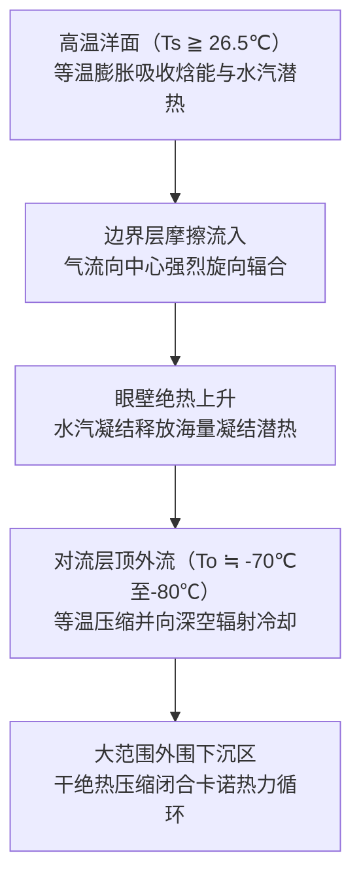

卡诺热机的热力学效率 $\epsilon$ 由海洋表面温度 $T_s$ 与流出层对流层顶温度 $T_o$ 决定：

$$\epsilon = \frac{T_s - T_o}{T_s}$$

在热带海域，$T_s \approx 300\,\text{K}$（$27^\circ\text{C}$），$T_o \approx 200\,\text{K}$（$-73^\circ\text{C}$），理论热效率高达约 $33\%$。在海洋焓能补给与地面摩擦阻力耗散相平衡的稳态假设下，伊曼纽尔的 **最大潜在强度（MPI: Maximum Potential Intensity）** 给出中心理论最大风速 $V_{\max}$：

$$V_{\max}^2 \approx \frac{C_k}{C_D} \frac{T_s - T_o}{T_o} \left( k_s^* - k \right)$$

式中 $C_k$ 为热焓交换系数，$C_D$ 为空气动力阻力系数，$k_s^*$ 为海表饱和焓，$k$ 为边界层未饱和环境气块焓。海表水温每攀升 $1^\circ\text{C}$，热力非平衡差 $(k_s^* - k)$ 呈非线性剧增，导致台风中心气压与最大风速上限显著攀升。

---

### 1.3 发生热力学必要条件
1. **海表温度（SST）$\ge 26.5^\circ\text{C} \sim 27.0^\circ\text{C}$** ：确保持续剧烈蒸发以维持巨大的潜热发动机，低于 $26^\circ\text{C}$ 蒸发量迅速衰竭。
2. **热带气旋热势（TCHP: Tropical Cyclone Heat Potential）** ：水温超过 $26^\circ\text{C}$ 的暖水层厚度必须达到 $50\,\text{m}$ 至 $100\,\text{m}$。若暖水层过浅，台风自身的强风会引起剧烈海水湍流混合与深层冷水涌升（Upwelling），导致自我降温猝死。高 TCHP 海区（如菲律宾以东的暖水池）是台风爆发性增强（Rapid Intensification）的摇篮。
3. **地转偏向力参数（$f = 2\Omega\sin\phi$）** ：纬度必须大于 $5^\circ$。在赤道无风带（纬度 $\pm 5^\circ$），科氏力微乎其微，气流直接填补低压中心而无法激发闭合旋转涡旋。

---

### 1.4 动力扰动与垂直风切变条件
1. **对流层中层湿润度（700hPa–500hPa）** ：环境相对湿度须在 $70\%$ 以上。干燥空气一旦卷入上升云系，水滴蒸发产生强烈的干冷下沉气流，直接摧毁对流单体。
2. **初始气旋性涡度与辐合** ：赤道辐合带（ITCZ）或季风槽提供初始扰动背景涡度。
3. **低垂直风切变（VWS $< 10\,\text{m/s}$ / 20节）** ：高低层风矢量差（850hPa与200hPa之间）必须极小。若风切变过大，潜热释放产生的暖心结构会被平流吹散，垂直环流柱发生倾斜撕裂。

---

### 1.5 对流云团的自组织理论：从 CISK 到 WISHE
- **第二类条件不稳定理论（CISK: Conditional Instability of the Second Kind）** ：查尼与埃利亚森（Charney & Eliassen, 1964）提出，边界层埃克曼摩擦抽吸产生辐合上升，水汽凝结释放潜热加热高层暖心，驱动地面气压下降，进一步强化低层辐合，构成正反馈闭环。
- **风致表面热交换理论（WISHE: Wind-Induced Surface Heat Exchange）** ：伊曼纽尔（1986）提出，气旋生成无需环境初始 CAPE 储存，洋面焓能蒸发通量正比于地面风速（$F_k \propto v$），强风激发更强蒸发，从而驱动自激型爆发式热力增强。

---

## 2. 三维涡旋动力结构与流体平衡

### 2.1 立体环流场结构
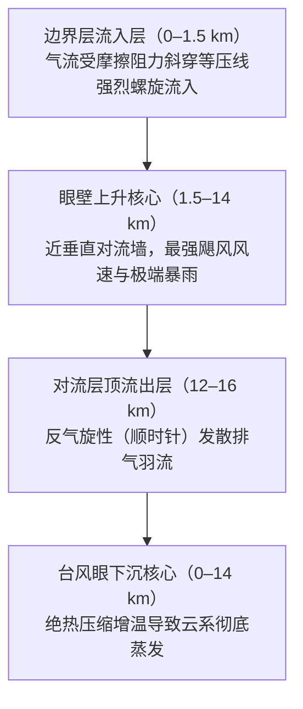

1. **边界层流入层（0–1.5 km）** ：地面与洋面摩擦打破地转平衡，气流斜穿等压线向中心急速螺旋辐合，源源不断汲取洋面热量与水汽。
2. **眼壁上升核心（1.5–14 km）** ：向心气流在离心力屏障前被迫铅直抬升，形成宽数十公里的对流云墙，伴随剧烈雷暴与极端狂风。
3. **高空流出层（12–16 km）** ：在对流层顶转为高压反气旋发散，在科氏力作用下呈顺时针向外喷射排出。

---

### 2.2 台风眼动力学与角动量守恒
**台风眼（Eye）** 的形成严格遵从绝对角动量守恒定律：

$$M = v r + \frac{1}{2} f r^2 = \text{const}$$

当气流向中心收缩半径 $r \to 0$ 时，切向风速 $v$ 呈倒数式爆发，向外的离心力（$v^2/r$）以 $r^{-3}$ 的极端速率急剧膨胀。在最大风速半径（RMW）处，离心力与向内气压梯度力达到动态平衡，气流无法再向内侵入，被迫向上冲入眼壁。

眼区内部由于外围强烈质量外抽，诱发受迫性 **下沉气流** 。气流在下沉过程中发生干绝热压缩增温（升温率约 $9.8^\circ\text{C/km}$），使所有水汽彻底蒸发消散，最终呈现静风、晴空、温暖干燥的特征性眼区。

---

### 2.3 双眼壁置换周期（ERC）
在 4–5 级超强台风中，频繁发生同心双眼壁置换：

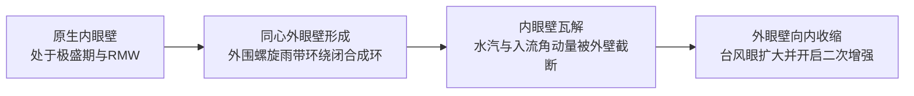

外眼壁环状闭合后阻截了向内眼壁输送的入流，内眼壁因水汽潜热匮乏而瓦解崩塌。随后外眼壁逐步向内收紧，台风经历短期强度衰退后，风场显著扩大并可能开启二次爆发增强。

---

### 2.4 螺旋雨带波动动力学
- **内螺旋雨带（距中心 100km 以内）** ：表现为涡旋罗斯贝波（Vortex Rossby Waves: VRW）与重力惯性波的耦合传播，向中心传递绝对角动量。
- **外螺旋雨带（距中心 200–500km）** ：伴随强烈的下击暴流、微下击暴流及局地龙卷风，在台风本体登陆前数小时至半天率先造成剧烈风灾。

---

### 2.5 水平风速分布：梯度风平衡与兰金涡
成熟台风在水平方向遵从 **梯度风平衡（Gradient Wind Balance）** ：

$$\frac{1}{\rho} \frac{\partial p}{\partial r} = f v + \frac{v^2}{r}$$

切向风场通常采用 **修正兰金组合涡（Modified Rankine Vortex）** 进行高精度建模：
- 眼区至最大风速半径内侧（$r < R_{\max}$）：呈现如刚体旋转一般的匀角速度转动，切向风速满足 $v(r) = V_{\max} (r / R_{\max})$。
- 最大风速半径外侧（$r \ge R_{\max}$）：呈现势涡衰减特性，满足 $v(r) = V_{\max} (R_{\max} / r)^x$（经验指数 $x \approx 0.5 \sim 0.7$）。

---

### 2.6 危险半圆与可航半圆的流体力学
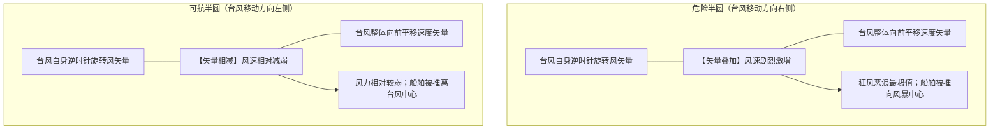

在北半球，台风行进方向右侧为 **危险半圆** ，其旋转风矢量与平移速度矢量同向叠加（$v_{\text{net}} = v_{\text{rot}} + v_{\text{trans}}$），风暴潮与狂风叠加至最强峰值，且洋面船舶极易被卷向台风中心；左侧为 **可航半圆** ，两矢量方向相反相互削弱。

---

## 3. 台风路径动力学与生命周期（转向与温带气旋变性）

### 3.1 引导气流与副热带高压
台风本身如同漂浮在大气环流长河中的旋转涡旋，其移动主要由深层对流层加权平均 **引导气流（Steering Flow）** 决定，关键控制系统为西北太平洋副热带高压（Subtropical High）的西南部边缘气流与青藏高原大陆高压。

### 3.2 转向机制与集合预报
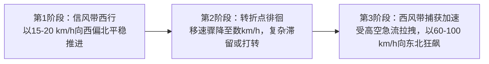

在北纬 $25^\circ \sim 30^\circ$ 附近，台风脱离低纬东风信风带，进入中纬度盛行西风带（急流轴），路径发生顺时针大幅度转向（Recurvature），移速从数十公里骤增至 $60 \sim 100\,\text{km/h}$。现代数值天气预报运用多模型 **集合预报系统（Ensemble Prediction）** 绘制 $70\%$ 概率半径圆，量化路径分歧度。

### 3.3 贝塔漂移（$\beta$ 效应）引起的自主偏北
即使在完全没有外围引导气流的理想静止大气中，台风也会自发向 **西北偏北** 方向漂移。这是由于地转参数随纬度的梯度变化（$\beta = df/dy$），对称气旋环流平流行星涡度，在气旋东西两侧激发出反向的“贝塔涡流圈（Beta Gyres）”，从而诱导产生一股向西北方向的通风气流。

### 3.4 藤原效应（Fujiwhara Effect）：双台风互旋
当两个热带气旋间距缩小至 $1,000 \sim 1,500\,\text{km}$ 以内时，两者将围绕共同质心展开逆时针相互绕旋，表现为相互牵引、围绕伴随或吞并融合：

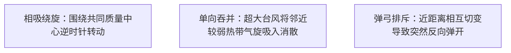

### 3.5 温带气旋化变性（ET）的能量开关
公众常误以为“台风转化为温带气旋”代表危险解除。在动力气象学中，温带变性是 **能量驱动引擎的根本切换** ：
- **热带气旋阶段** ：由海洋潜热驱动，深层正压暖心结构，极端破坏区紧密集中在眼壁周围数十公里内。
- **温带气旋阶段** ：由中纬度冷暖气团温度梯度的斜压不稳定性驱动，转化为冷暖锋面系统。
变性过程中，大风区迅速呈几何级数扩大，从数十公里暴增至 **数百乃至上千公里** ，引发超大范围的沿海狂风巨浪与海难。

---

## 4. 昭和三大台风：日本战后毁灭性灾难史与防灾法制奠基

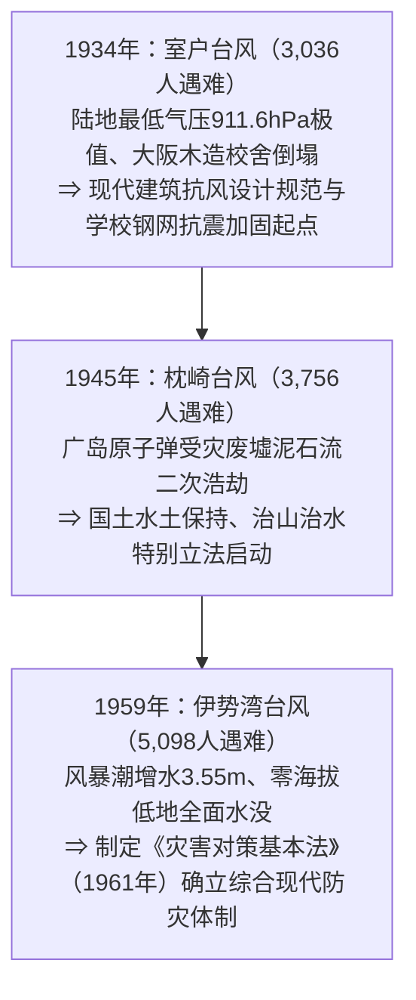

### 4.1 室户台风（1934年）：关西浩劫与木造校舍倒塌悲剧
1934年9月21日，室户台风在高知县室户岬观测到 **$911.6\,\text{hPa}$** 地面气压历史极值，至今仍为日本本土实测最低陆地气压记录。台风上午以超过 $60\,\text{m/s}$ 暴风重创大阪市，正值学生晨读时间，缺乏剪刀撑抗风支撑的 260 余所木造校舍发生多米诺骨牌式坍塌，导致 600 名师生被压遇难。全日本遇难达 3,036 人。该灾难直接催生了现代木结构抗风刚度设计准则，并推动了日本全国公立学校钢筋混凝土化改造。

### 4.2 枕崎台风（1945年）：原子弹废墟上的双重灾难
1945年9月17日，日本投降仅一个月后，枕崎台风以 $916.3\,\text{hPa}$ 极强气压在鹿儿岛县登陆。战争破坏导致山林水源破坏殆尽，暴雨在刚遭受原子弹袭击的广岛市周边引发大规模山崩泥石流。大野陆军医院被泥石流瞬间冲入濑户内海，导致前去救援原子弹患者的京都大学医学研究团队与病患共 156 人罹难。全日本遇难失踪达 3,756 人，促成了日本战后国家水土保持与防灾林法制大修。

### 4.3 伊势湾台风（1959年 / Typhoon Vera）：现代防灾行政原点
1959年9月26日登陆纪伊半岛的伊势湾台风（中心气压 $929\,\text{hPa}$）是日本战后最严重的自然灾害：
- **气象物理恶劣配置** ：伊势湾全境处于危险半圆，南南东向狂风与气压吸上叠加，名古屋港测得 **$3.55\,\text{m}$ 极端风暴潮增水** 。
- **零海拔地带与浮木炸弹** ：沿海木材加工厂中重达数吨的数万根巨型储木随潮水漂流，如攻城木般撞碎海堤。海水瞬间倒灌入大片围垦形成的“零海拔地带”，水深达数米且滞水长达数月。
- **确立防灾基本法** ： **5,098 人遇难与失踪** 震撼日本朝野。1961年日本国会颁布 **《灾害对策基本法》** ，从国家到地方设立防灾会议，确立了现代预警、避难准备与灾后重建的标准法律架构。

---

## 5. 风水害、海难与都市水灾代表性历史台风

- **凯瑟琳台风（1947年）** ：战后治水荒废之际直击关东，利根川在埼玉县东村决堤，大洪水顺地势向南直扑东京市区，葛饰区与江户川区化为汪洋，遇难达 1,930 人。此次惨痛教训奠定了首都圈利根川・荒川超级堤防工程与现代防洪规划。
- **洞爷丸台风（1954年）** ：在津轻海峡经历强烈的温带气旋变性再爆发，阵风达到 $57\,\text{m/s}$。青函铁道联络船“洞爷丸”等5艘客货轮翻沉， **1,430 人罹难** 。这场世界海难史上罕有的悲剧，直接推动了耗时24年建成的世界级工程——青函海底隧道的立项与修建。
- **狩野川台风（1958年）** ：在静冈县伊豆半岛天城山降下 $750\,\text{mm}$ 超强暴雨，诱发大规模山崩“山海啸”，同时使东京都内遭遇内涝，淹没房屋超 30 万栋。此战推动了开创性的“狩野川放水路”分洪工程建设。

---

## 6. 气候变暖背景下的极端台风（平成与令和年代）

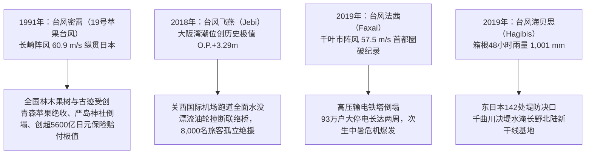

- **台风密雷（1991年19号台风 / 苹果台风）** ：以罕见的高速横扫日本列岛西侧，长崎市测得 $60.9\,\text{m/s}$ 历史风速。青森县丰收在即的苹果几乎全数被狂风打落，严岛神社能舞台崩塌，全国遇难62人，造成日本历史最高的财产保险赔付金（超 5,600 亿日元）。
- **台风飞燕（2018年21号台风 / Jebi）** ：高潮潮位突破历史极值（$+3.29\,\text{m}$），关西国际机场完全被海水淹没。受强风吹袭走锚的万吨油轮撞断机场唯一对外联络大桥，8,000 名旅客陷入停电断水孤岛，暴露出海上人工岛型基础设施的脆弱性。
- **台风法茜（2019年15号台风 / Faxai）** ：结构致密的微型猛烈台风直击东京湾，千叶市录得 $57.5\,\text{m/s}$ 创纪录阵风。两座大型高压输电铁塔与数千电线杆折断，千叶全境 93 万户大停电长达两周，适逢初秋酷暑，引发严重次生中暑伤亡危机。
- **台风海贝思（2019年19号台风 / Hagibis）** ：大气河流输送巨量水汽，神奈川县箱根创下 $1,001\,\text{mm}$ 的惊人降雨量。东日本 71 条河流 142 处堤防溃决，长野县千曲川决堤导致 10 列北陆新干线列车（占全线车队三分之一）水没报废。

---

## 7. 全球极端热带气旋纪录与气候预测

- **台风泰培（Tip / 1979年）** ：全球气象观测史上最低海平面气压 **$870\,\text{hPa}$** ，烈风圈直径达到破纪录的 **$2,220\,\text{km}$** （足以覆盖整个日本列岛），由美军 WC-130 气象侦察机下投探空仪实测认证。
- **超强台风海燕（Haiyan / Yolanda / 2013年）** ：登陆菲律宾时中心气压 $895\,\text{hPa}$，推算最大瞬间风速达 **$105\,\text{m/s}$（$378\,\text{km/h}$）** 。直立墙状的风暴潮将塔克洛班市完全抹平，导致超 7,300 人死亡失踪。
- **飓风卡特里娜（2005年）与桑迪（2012年）** ：卡特里娜导致新奥尔良防洪堤全线崩溃，全市 $80\%$ 面积没入水下；桑迪淹没了纽约市地铁隧道，证明了超级大都市在风暴潮面前的高度脆弱性。
- **IPCC 第六次评估报告（AR6）预测** ：全球热带气旋总数预计保持稳定或略降，但 **4–5级超强台风比例显著上升** ；极端降水率将以每升温 $1^\circ\text{C}$ 约增加 $7\%$ 的速率飙升；平移移速出现减缓趋势，滞留型特大暴雨风险激增。

---

## 8. 台风致灾物理机制：风压非线性定律、风暴潮与复合水灾

### 8.1 空气动力学风压平方律
风压力 $P$ 与风速平方严格成正比：

$$P = \frac{1}{2} \rho v^2 C_f$$

式中 $\rho$ 为空气密度（约 $1.2\,\text{kg/m}^3$），$C_f$ 为建筑风力系数。风速由 $20\,\text{m/s}$ 升至 $40\,\text{m/s}$ 时，外力载荷激增至 **4倍** ；当风速攀升至 $60\,\text{m/s}$ 时，冲击力剧增至 **9倍** 。

**门窗破坏的链式反应** ：狂风卷起的硬物碎片（如瓦砾、广告牌）击穿窗玻璃后，室外狂风直接强灌室内，使室内气压暴增为正压，而屋顶外侧由于空气高速流动产生强大的伯努利负压吸力。内外双重正负压差叠加，会将整个屋顶结构瞬间向上掀翻炸碎。

### 8.2 风暴潮增水数值机制
风暴潮总增水高度由两大部分组成：

$$\Delta h = \Delta h_p + \Delta h_w$$

1. **静压吸上效应（Inverse Barometer Effect: $\Delta h_p$）** ：台风中心气压每下降 $1\,\text{hPa}$，海面相应吸起上升约 $1\,\text{cm}$。
2. **风应力增水效应（Wind Setup: $\Delta h_w$）** ：遵从浅水动力方程：
   $$\frac{\partial h_w}{\partial x} \approx \frac{\rho_a C_D v^2}{\rho_w g H}$$
 增水坡度与 **风速平方成正比** ，且与 **水深 $H$ 成反比** 。在水深极浅且呈喇叭状开口的内湾（如伊势湾、东京湾、大阪湾），狂风推挤的海水无法向深海泄流，在湾顶汇聚形成灾难性的水体堆积。

### 8.3 复合洪涝水灾动力学
- **外水泛滥（堤防溃决与淘刷）** ：河流水位超过警戒堤顶产生溢流，水流冲刷背水坡（无防护土坡），导致堤身瞬间失稳溃决。
- **内水泛滥（排涝受阻）** ：外河水位高涨使城市雨水排水闸门被迫关闭，雨水管网无法重力自流，一旦雨水泵站抽水能力见底，市区道路瞬间转化为蓄水池。
- **顶托回水现象（Backwater Effect）** ：主流水位暴涨导致支流无法正常汇入，洪水在支流反向顶托上溯数公里，导致上游支流脆弱防线决堤。

---

## 9. 前沿气象预测与全天候生存防灾战略（实战手册）

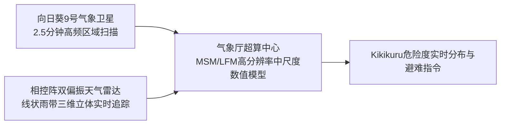

### 9.1 日本气象厅 Kikikuru（危险度分布）色别编码体系
| 风险警戒级别 | 地图标识颜色 | 对应法定气象预警 | 法定居民行动准则 |
| :--- | :--- | :--- | :--- |
| **极度危险** | **深紫色（Dark Purple）** | **4级警戒：避难指示（全员避难）** | **危险区域全体居民必须已全部完成向外撤离避难** |
| **非常危险** | **淡紫色（Light Purple）** | **4级警戒：避难指示** | 一般居民立即果断开始撤离避难 |
| **警戒状态** | **红色（Red）** | **3级警戒：老年人等避难** | 高龄者、婴幼儿、残障人士及照护人员立即开始撤离 |
| **注意准备** | **黄色（Yellow）** | **2级警戒：大雨/洪水注意报** | 确认避难路线、检查应急物资与防水设备 |
| **已发生灾害** | **黑色（Black）** | **5级警戒：紧急安全确保** | **生命受到直接致命威胁；立即采取就地垂直避险自保** |

---

### 9.2 灾前72小时时间线行动清单
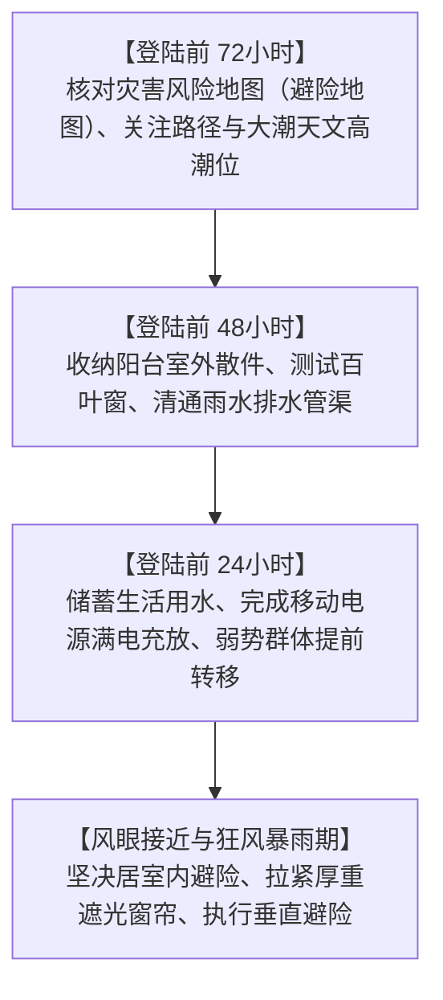

- **登陆前 72小时** ：查阅 Hazard Map 确认住所是否处于洪水淹没区或土砂灾害隐患点；校准台风移速，确认天文大潮高潮位时间节点。
- **登陆前 48小时** ：将阳台盆栽、晾衣杆、自行车全部移入室内；清理屋顶与地面排水口落叶杂物；测试外部防风卷帘门。
- **登陆前 24小时** ：将手机、应急手电、移动充电宝充满电；浴缸与水桶蓄满水（作生活冲厕用水）；协助家中高龄长者提前投亲或转移至避难所。
- **暴风圈覆盖期间** ：严禁盲目外出观察河流水位或修缮屋顶；远离临窗区域，放下并锁紧窗帘。

---

### 9.3 住宅与生命线的物理自卫法
- **窗玻璃防爆真相** ： **米字形胶带无法增强玻璃抗风强度** 。其唯一作用是碎裂时减少大块飞溅。真正科学防护是 **关闭并锁紧室外金属防风卷帘（雨户）** ，或在室内贴装专业防爆膜，并将 **厚重遮光窗帘完全拉紧并用夹子夹牢** ，形成捕捉碎玻璃的柔性网兜。
- **马桶与地漏防倒灌水袋** ：暴雨期间市政污水管网压力剧增，极易发生粪水倒灌。将大号垃圾袋套两层，注入约一半清水排出空气后扎紧，制成“水袋（Water Bag）”压入马桶底部及下水地漏口。
- **14天家庭防灾储备** ：
  - 饮用水：按每人每天 3L 计算。
  - 卡式炉及气瓶：每户准备 28–42 罐便携燃气罐。
  - 大容量移动储能电源：准备 1,000–2,000 Wh 储能电池。
  - 凝固型应急简易厕所袋：每人准备 70 回份（以断水14天计）。

---

### 9.4 避难决策判定逻辑图：水平转移还是垂直避难？
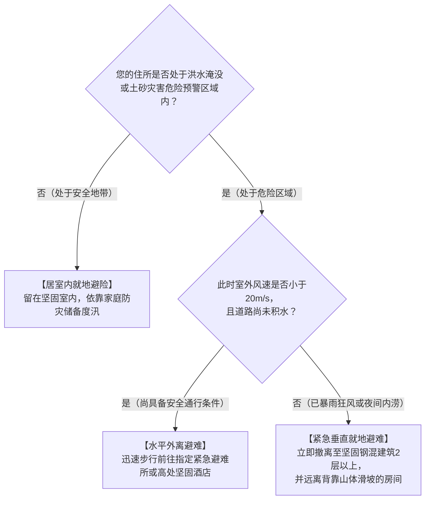

- **水平转移底线** ：一旦持续风速超过 $20\,\text{m/s}$ 或路面积水超过 $20\,\text{cm}$，严禁涉水外出（路面井盖可能已被顶开，涉水行走极易溺亡）。
- **紧急垂直避难** ：若夜间洪水暴涨已无法撤离，立即进入钢筋混凝土构造建筑 2 楼以上，并选择避开紧邻山体滑坡面的一侧房间。

---

## 结语：科学之盾与想象力之堡垒

在行星级海气热机的狂暴能量面前，人类抵御气象天灾的基石由两座支柱构成：一是洞悉流体热力学规律、精确解读现代预报指标的 **科学之盾** ；二是彻底粉碎“自己绝不会有事”侥幸心理、洞察最极端灾害情景的 **想象力之堡垒** 。继承历史惨烈灾害换来的血泪经验，以严谨的主动时间线行动守护生命，方能在这气候极端化加剧的动荡纪元中筑牢文明的安全堤防。
