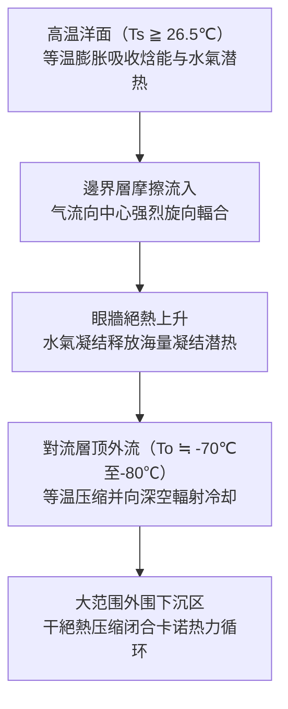
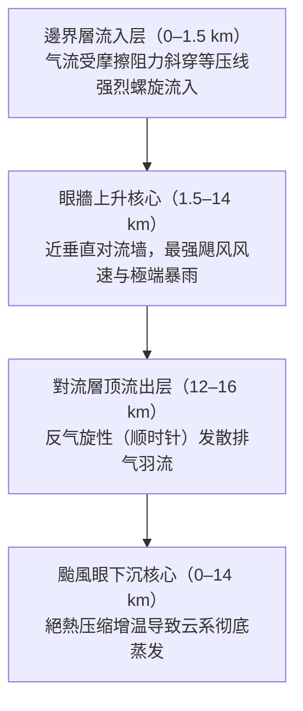
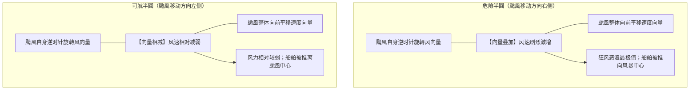
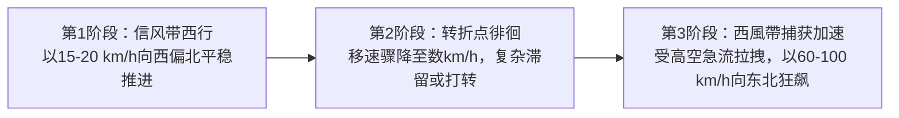
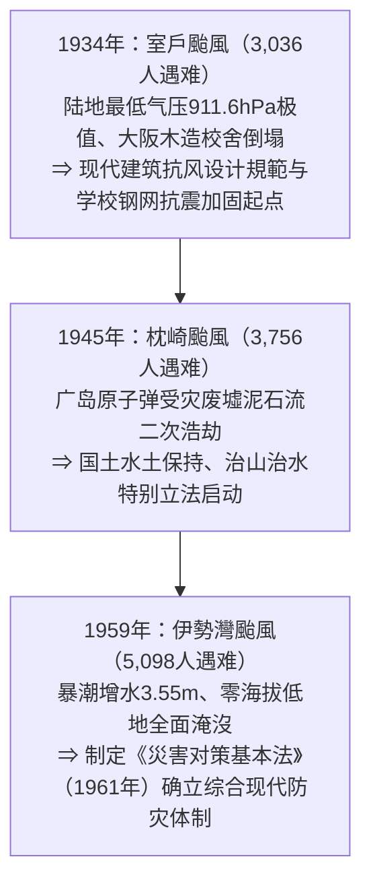
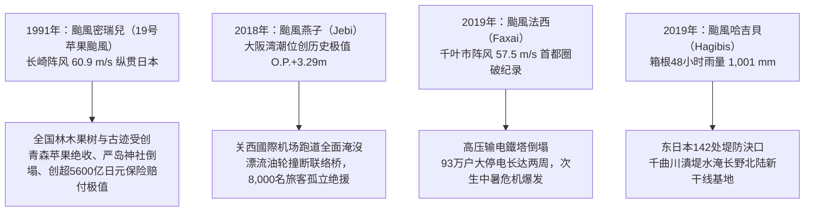
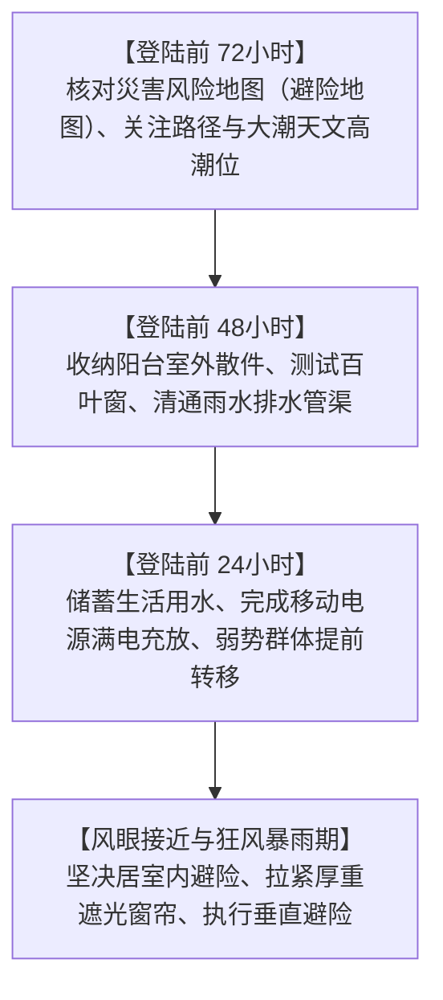
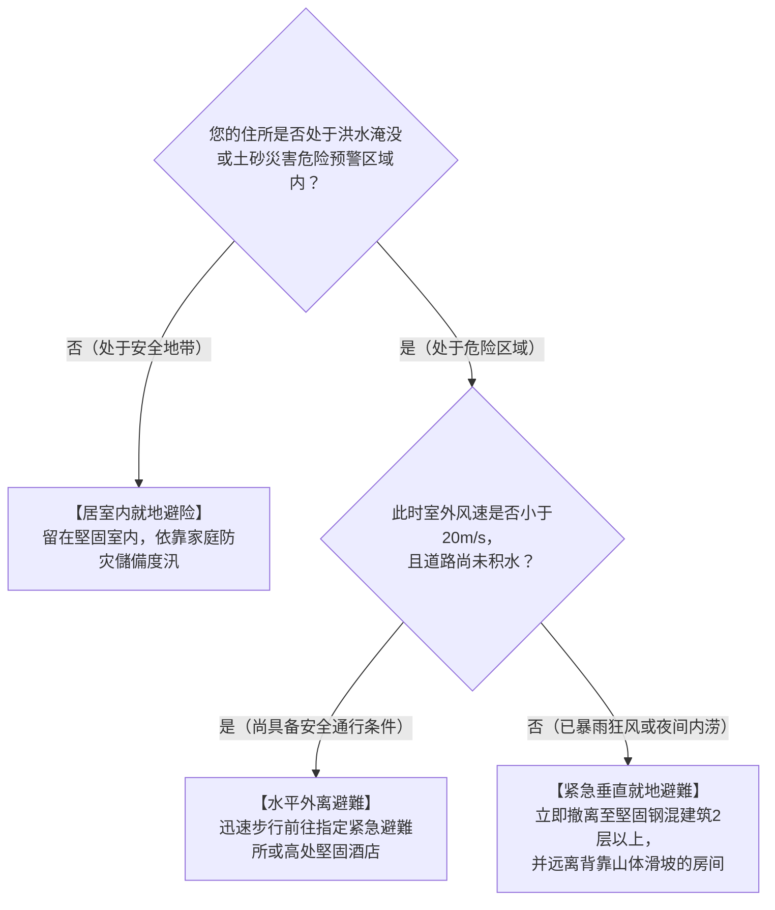

## 引言：直面海氣系統中的宏伟热机

在热带灼热阳光照射的辽阔洋面上，一缕水氣蒸腾而起。在地球自转产生的科里奥利力偏转作用下，水氣对流群开始旋轉，最终自我组织为直径数百乃至上千公里的宏伟低气压環流系统——这便是 **颱風（熱帶氣旋: Tropical Cyclone）** 。

颱風是地球上最强大且最具几何对称美的大气物理現象之一。在行星尺度上，它是至关重要的气候調節裝置，将低緯度赤道過度积累的太阳热能高效輸送至高緯度极地冷却槽。然而，一旦颱風侵入人类文明密集区，其毁灭性的“破壞三位一體”——飓风级暴风、暴潮巨浪与極端洪澇暴雨——足以在數小時内摧毁现代工程防線。

日本列島处于西北太平洋颱風轉向中緯度西風帶的主通道上。千百年来，颱風带来的丰沛降水滋养了稻作農業，但也造成了无数惨烈的历史劫难。昭和时期的三大颱風——室戶颱風（1934年）、枕崎颱風（1945年）与伊勢灣颱風（1959年）——均夺走数千人生命，推动了现代《災害对策基本法》、建筑抗风抗震規範与流域治水工學的誕生。

在21世纪人类活动引起的氣候變遷背景下，海洋与大气的热力基础发生深刻重塑。海面水温攀升与大气飽和水氣压增大（克劳修斯-克拉佩龙方程式），导致了人工島机场全面淹沒（2018年燕子颱風）、首都圈高压输电鐵塔倒塌大停电（2019年法西颱風）以及142处堤防潰堤（2019年哈吉貝颱風）。本文从地球物理流体力學、热力學、災害历史、全球極端案例及生存行动学等維度，系统构建一份面向未来的防灾学术与實戰全書。

---

## 1. 熱帶氣旋的热力學与发生機制：作为卡諾熱機的颱風模型

### 1.1 國際分類与风速標準定義
在动力氣象学中，由暖洋面提供热源驱动的旋轉低气压统称为 **熱帶氣旋** 。世界各主要氣象机构的分類標準与风速門檻值如下：

| 分類定義 | 涉及海域 | 风速测量基准 | 判定門檻值 |
| :--- | :--- | :--- | :--- |
| **颱風（Typhoon / 日本氣象厅）** | 西北太平洋及南海 | **10分钟平均最大持续风速** | $\ge 34\,\text{knots}$（约 $17.2\,\text{m/s}$） |
| **颱風（美军联合颱風预警中心 JTWC）** | 西北太平洋 | **1分钟平均最大持续风速** | $\ge 64\,\text{knots}$（约 $33\,\text{m/s}$，相当1级飓风） |
| **飓风（Hurricane / 美国国家飓风中心）** | 北大西洋、加勒比海、东北太平洋 | **1分钟平均最大持续风速** | $\ge 64\,\text{knots}$（约 $33\,\text{m/s}$） |
| **气旋风暴（Cyclone）** | 印度洋及西南太平洋 | 3分钟至10分钟平均 | $\ge 34\,\text{knots}$ 或 $\ge 64\,\text{knots}$ |

日本氣象厅（JMA）进一步依强度细分：
- **强颱風** ：最大持续风速 $33\,\text{m/s} \sim 44\,\text{m/s}$（64–84节）
- **超强颱風** ：最大持续风速 $44\,\text{m/s} \sim 54\,\text{m/s}$（85–104节）
- **猛烈颱風** ：最大持续风速 $\ge 54\,\text{m/s}$（$\ge 105\,\text{节}$）

此外，风速达到 $15\,\text{m/s}$ 的大风半径在 500km 至 800km 为 **大型颱風** ，超过 800km 为 **超大型颱風** 。

---

### 1.2 卡諾循環模型与最大潜在强度（MPI）理论
麻省理工學院（MIT）氣象学家克里·伊曼纽尔（Kerry Emanuel）将成熟熱帶氣旋定量表述为一部巨觀 **卡諾熱機（Carnot Heat Engine）** ：

卡諾熱機的热力學效率 $\epsilon$ 由海洋表面温度 $T_s$ 与流出层對流層顶温度 $T_o$ 决定：

$$\epsilon = \frac{T_s - T_o}{T_s}$$

在热带海域，$T_s \approx 300\,\text{K}$（$27^\circ\text{C}$），$T_o \approx 200\,\text{K}$（$-73^\circ\text{C}$），理论热效率高达约 $33\%$。在海洋焓能补给与地面摩擦阻力耗散相平衡的稳态假设下，伊曼纽尔的 **最大潜在强度（MPI: Maximum Potential Intensity）** 给出中心理论最大风速 $V_{\max}$：

$$V_{\max}^2 \approx \frac{C_k}{C_D} \frac{T_s - T_o}{T_o} \left( k_s^* - k \right)$$

式中 $C_k$ 为熱焓交换系数，$C_D$ 为空气动力阻力系数，$k_s^*$ 为海表飽和焓，$k$ 为邊界層未飽和环境气块焓。海表水温每攀升 $1^\circ\text{C}$，热力非平衡差 $(k_s^* - k)$ 呈非线性剧增，导致颱風中心气压与最大风速上限显著攀升。

---

### 1.3 发生热力學必要條件
1. **海表溫度（SST）$\ge 26.5^\circ\text{C} \sim 27.0^\circ\text{C}$** ：确保持续剧烈蒸发以维持巨大的潜热发动机，低于 $26^\circ\text{C}$ 蒸发量迅速衰竭。
2. **熱帶氣旋热势（TCHP: Tropical Cyclone Heat Potential）** ：水温超过 $26^\circ\text{C}$ 的暖水层厚度必须达到 $50\,\text{m}$ 至 $100\,\text{m}$。若暖水层过浅，颱風自身的强风会引起剧烈海水湍流混合与深层冷水湧升（Upwelling），导致自我降温猝死。高 TCHP 海区（如菲律宾以东的暖水池）是颱風爆发性增强（Rapid Intensification）的摇篮。
3. **地转偏向力参数（$f = 2\Omega\sin\phi$）** ：緯度必须大于 $5^\circ$。在赤道无风带（緯度 $\pm 5^\circ$），科氏力微乎其微，气流直接填补低压中心而无法激发闭合旋轉涡旋。

---

### 1.4 动力扰动与垂直風切条件
1. **對流層中层濕潤度（700hPa–500hPa）** ：环境相对湿度须在 $70\%$ 以上。干燥空气一旦卷入上升云系，水滴蒸发产生强烈的干冷下沉氣流，直接摧毁对流单体。
2. **初始气旋性渦度与輻合** ：赤道輻合带（ITCZ）或季风槽提供初始扰动背景渦度。
3. **低垂直風切（VWS $< 10\,\text{m/s}$ / 20节）** ：高低层风向量差（850hPa与200hPa之间）必须极小。若风切变过大，潜热释放产生的暖心結構会被平流吹散，垂直環流柱发生倾斜撕裂。

---

### 1.5 对流云团的自我組織理论：从 CISK 到 WISHE
- **第二類條件不穩定理论（CISK: Conditional Instability of the Second Kind）** ：查尼与埃利亚森（Charney & Eliassen, 1964）提出，邊界層埃克曼摩擦抽吸产生輻合上升，水氣凝结释放潜热加热高层暖心，驱动地面气压下降，进一步强化低层輻合，构成正反馈闭环。
- **风致表面热交换理论（WISHE: Wind-Induced Surface Heat Exchange）** ：伊曼纽尔（1986）提出，气旋生成无需环境初始 CAPE 儲存，洋面焓能蒸发通量正比于地面风速（$F_k \propto v$），强风激发更强蒸发，从而驱动自激型爆发式热力增强。

---

## 2. 三维涡旋动力結構与流体平衡

### 2.1 立体環流场結構

1. **邊界層流入层（0–1.5 km）** ：地面与洋面摩擦打破地转平衡，气流斜穿等压线向中心急速螺旋輻合，源源不断汲取洋面热量与水氣。
2. **眼牆上升核心（1.5–14 km）** ：向心气流在離心力屏障前被迫铅直抬升，形成宽数十公里的对流云墙，伴随剧烈雷暴与極端狂风。
3. **高空流出层（12–16 km）** ：在對流層顶转为高压反气旋发散，在科氏力作用下呈顺时针向外喷射排出。

---

### 2.2 颱風眼动力學与角動量守恆
**颱風眼（Eye）** 的形成严格遵从绝对角動量守恆定律：

$$M = v r + \frac{1}{2} f r^2 = \text{const}$$

当气流向中心收缩半径 $r \to 0$ 时，切向风速 $v$ 呈倒数式爆发，向外的離心力（$v^2/r$）以 $r^{-3}$ 的極端速率急剧膨胀。在最大风速半径（RMW）处，離心力与向内气压梯度力达到动态平衡，气流无法再向内侵入，被迫向上冲入眼牆。

眼区内部由于外围强烈质量外抽，诱发受迫性 **下沉氣流** 。气流在下沉过程中发生干絕熱压缩增温（升温率约 $9.8^\circ\text{C/km}$），使所有水氣彻底蒸发消散，最终呈现静风、晴空、温暖干燥的特征性眼区。

---

### 2.3 双眼牆置換週期（ERC）
在 4–5 级超强颱風中，频繁发生同心双眼牆置换：

外眼牆环状闭合后阻截了向内眼牆輸送的入流，内眼牆因水氣潜热匮乏而瓦解崩塌。随后外眼牆逐步向内收紧，颱風经历短期强度衰退后，风场显著扩大并可能开启二次爆发增强。

---

### 2.4 螺旋雨帶波动动力學
- **内螺旋雨帶（距中心 100km 以内）** ：表现为涡旋罗斯贝波（Vortex Rossby Waves: VRW）与重力惯性波的耦合传播，向中心传递绝对角动量。
- **外螺旋雨帶（距中心 200–500km）** ：伴随强烈的下击暴流、微下击暴流及局地龙卷风，在颱風本体登陆前數小時至半天率先造成剧烈风灾。

---

### 2.5 水平风速分布：氣壓梯度風平衡与蘭金渦旋
成熟颱風在水平方向遵从 **氣壓梯度風平衡（Gradient Wind Balance）** ：

$$\frac{1}{\rho} \frac{\partial p}{\partial r} = f v + \frac{v^2}{r}$$

切向风场通常采用 **修正兰金组合涡（Modified Rankine Vortex）** 进行高精度建模：
- 眼区至最大风速半径内侧（$r < R_{\max}$）：呈现如刚体旋轉一般的匀角速度转动，切向风速满足 $v(r) = V_{\max} (r / R_{\max})$。
- 最大风速半径外侧（$r \ge R_{\max}$）：呈现势涡衰减特性，满足 $v(r) = V_{\max} (R_{\max} / r)^x$（经验指数 $x \approx 0.5 \sim 0.7$）。

---

### 2.6 危險半圓与可航半圓的流体力學

在北半球，颱風行进方向右侧为 **危險半圓** ，其旋轉风向量与平移速度向量同向叠加（$v_{\text{net}} = v_{\text{rot}} + v_{\text{trans}}$），暴潮与狂风叠加至最强峰值，且洋面船舶极易被卷向颱風中心；左侧为 **可航半圓** ，两向量方向相反相互削弱。

---

## 3. 颱風路径动力學与生命周期（轉向与溫帶氣旋變性）

### 3.1 導引氣流与副熱帶高壓
颱風本身如同漂浮在大气環流长河中的旋轉涡旋，其移动主要由深层對流層加权平均 **導引氣流（Steering Flow）** 决定，关键控制系统为西北太平洋副熱帶高壓（Subtropical High）的西南部边缘气流与青藏高原大陆高压。

### 3.2 轉向機制与系集預報

在北纬 $25^\circ \sim 30^\circ$ 附近，颱風脱离低纬东风信风带，进入中緯度盛行西風帶（急流轴），路径发生顺时针大幅度轉向（Recurvature），移速从数十公里骤增至 $60 \sim 100\,\text{km/h}$。现代数值天气预报运用多模型 **系集預報系统（Ensemble Prediction）** 绘制 $70\%$ 概率半径圆，量化路径分歧度。

### 3.3 贝塔漂移（$\beta$ 效应）引起的自主偏北
即使在完全没有外围導引氣流的理想静止大气中，颱風也会自发向 **西北偏北** 方向漂移。这是由于地转参数随緯度的梯度变化（$\beta = df/dy$），对称气旋環流平流行星渦度，在气旋东西两侧激发出反向的“贝塔涡流圈（Beta Gyres）”，从而诱导产生一股向西北方向的通风气流。

### 3.4 藤原效应（Fujiwhara Effect）：双颱風互旋
当两个熱帶氣旋间距缩小至 $1,000 \sim 1,500\,\text{km}$ 以内时，两者将围绕共同质心展开逆时针相互绕旋，表现为相互牵引、围绕伴随或吞并融合：

### 3.5 溫帶氣旋化變性（ET）的能量开关
公众常误以为“颱風转化为溫帶氣旋”代表危险解除。在动力氣象学中，温带變性是 **能量驱动引擎的根本切换** ：
- **熱帶氣旋阶段** ：由海洋潜热驱动，深层正压暖心結構，極端破壞区紧密集中在眼牆周围数十公里内。
- **溫帶氣旋阶段** ：由中緯度冷暖气团温度梯度的斜压不稳定性驱动，转化为冷暖锋面系统。
變性过程中，大风区迅速呈几何级数扩大，从数十公里暴增至 **数百乃至上千公里** ，引发超大范围的沿海狂风巨浪与海难。

---

## 4. 昭和三大颱風：日本战后毁灭性灾难史与防灾法制奠基

### 4.1 室戶颱風（1934年）：关西浩劫与木造校舍倒塌悲剧
1934年9月21日，室戶颱風在高知县室戶岬观测到 **$911.6\,\text{hPa}$** 地面气压历史极值，至今仍为日本本土实测最低陆地气压记录。颱風上午以超过 $60\,\text{m/s}$ 暴风重创大阪市，正值学生晨读时间，缺乏剪刀撑抗风支撑的 260 余所木造校舍发生多米诺骨牌式坍塌，导致 600 名师生被压遇难。全日本遇难达 3,036 人。该灾难直接催生了现代木結構抗风刚度设计准则，并推动了日本全国公立学校钢筋混凝土化改造。

### 4.2 枕崎颱風（1945年）：原子弹废墟上的双重灾难
1945年9月17日，日本投降仅一个月后，枕崎颱風以 $916.3\,\text{hPa}$ 极强气压在鹿儿岛县登陆。战争破壞导致山林水源破壞殆尽，暴雨在刚遭受原子弹袭击的广岛市周边引发大规模山崩泥石流。大野陆军医院被泥石流瞬间冲入濑户内海，导致前去救援原子弹患者的京都大学医学研究团队与病患共 156 人罹难。全日本遇难失踪达 3,756 人，促成了日本战后国家水土保持与防灾林法制大修。

### 4.3 伊勢灣颱風（1959年 / Typhoon Vera）：现代防灾行政原点
1959年9月26日登陆纪伊半岛的伊勢灣颱風（中心气压 $929\,\text{hPa}$）是日本战后最严重的自然災害：
- **氣象物理恶劣配置** ：伊勢灣全境处于危險半圓，南南东向狂风与气压吸上叠加，名古屋港测得 **$3.55\,\text{m}$ 極端暴潮增水** 。
- **零海拔地带与浮木炸弹** ：沿海木材加工厂中重达数吨的数万根巨型储木随潮水漂流，如攻城木般撞碎海堤。海水瞬间倒灌入大片围垦形成的“零海拔地带”，水深达数米且滞水长达数月。
- **确立防灾基本法** ： **5,098 人遇难与失踪** 震撼日本朝野。1961年日本国会颁布 **《災害对策基本法》** ，从国家到地方设立防灾会议，确立了现代预警、避難准备与灾后重建的標準法律架构。

---

## 5. 风水害、海难与都市水灾代表性历史颱風

- **凯瑟琳颱風（1947年）** ：战后治水荒废之际直击关东，利根川在埼玉县东村潰堤，大洪水顺地势向南直扑东京市区，葛饰区与江户川区化为汪洋，遇难达 1,930 人。此次惨痛教训奠定了首都圈利根川・荒川超级堤防工程与现代防洪规划。
- **洞爷丸颱風（1954年）** ：在津轻海峡经历强烈的溫帶氣旋變性再爆发，阵风达到 $57\,\text{m/s}$。青函铁道联络船“洞爷丸”等5艘客货轮翻沉， **1,430 人罹难** 。这场世界海难史上罕有的悲剧，直接推动了耗时24年建成的世界级工程——青函海底隧道的立项与修建。
- **狩野川颱風（1958年）** ：在静冈县伊豆半岛天城山降下 $750\,\text{mm}$ 超强暴雨，诱发大规模山崩“山海啸”，同时使东京都内遭遇内涝，淹没房屋超 30 万栋。此战推动了开创性的“狩野川放水路”分洪工程建设。

---

## 6. 气候变暖背景下的極端颱風（平成与令和年代）

- **颱風密瑞兒（1991年19号颱風 / 苹果颱風）** ：以罕见的高速横扫日本列島西侧，长崎市测得 $60.9\,\text{m/s}$ 历史风速。青森县丰收在即的苹果几乎全数被狂风打落，严岛神社能舞台崩塌，全国遇难62人，造成日本历史最高的财产保险赔付金（超 5,600 亿日元）。
- **颱風燕子（2018年21号颱風 / Jebi）** ：高潮潮位突破历史极值（$+3.29\,\text{m}$），关西國際机场完全被海水淹没。受强风吹袭走锚的万吨油轮撞断机场唯一对外联络大桥，8,000 名旅客陷入停电断水孤岛，暴露出海上人工島型基础设施的脆弱性。
- **颱風法西（2019年15号颱風 / Faxai）** ：結構致密的微型猛烈颱風直击东京湾，千叶市录得 $57.5\,\text{m/s}$ 创纪录阵风。两座大型高压输电鐵塔与数千电线杆折断，千叶全境 93 万户大停电长达两周，适逢初秋酷暑，引发严重次生中暑伤亡危机。
- **颱風哈吉貝（2019年19号颱風 / Hagibis）** ：大气河流輸送巨量水氣，神奈川县箱根创下 $1,001\,\text{mm}$ 的惊人降雨量。东日本 71 条河流 142 处堤防溃决，长野县千曲川潰堤导致 10 列北陆新干线列车（占全线车队三分之一）淹沒报废。

---

## 7. 全球極端熱帶氣旋纪录与气候预测

- **颱風狄普（Tip / 1979年）** ：全球氣象观测史上最低海平面气压 **$870\,\text{hPa}$** ，烈风圈直径达到破纪录的 **$2,220\,\text{km}$** （足以覆盖整个日本列島），由美军 WC-130 氣象侦察机下投探空仪实测认证。
- **超强颱風海燕（Haiyan / Yolanda / 2013年）** ：登陆菲律宾时中心气压 $895\,\text{hPa}$，推算最大瞬间风速达 **$105\,\text{m/s}$（$378\,\text{km/h}$）** 。直立墙状的暴潮将塔克洛班市完全抹平，导致超 7,300 人死亡失踪。
- **飓风卡崔娜（2005年）与珊迪（2012年）** ：卡崔娜导致新奥尔良防洪堤全线崩溃，全市 $80\%$ 面积没入水下；珊迪淹没了纽约市地铁隧道，证明了超级大都市在暴潮面前的高度脆弱性。
- **IPCC 第六次评估报告（AR6）预测** ：全球熱帶氣旋总数预计保持稳定或略降，但 **4–5级超强颱風比例显著上升** ；極端降水率将以每升温 $1^\circ\text{C}$ 约增加 $7\%$ 的速率飙升；平移移速出现减缓趋势，滞留型特大暴雨风险激增。

---

## 8. 颱風致灾物理機制：风压非线性定律、暴潮与複合水灾

### 8.1 空气动力學风压平方定律
风压力 $P$ 与风速平方严格成正比：

$$P = \frac{1}{2} \rho v^2 C_f$$

式中 $\rho$ 为空气密度（约 $1.2\,\text{kg/m}^3$），$C_f$ 为建筑风力系数。风速由 $20\,\text{m/s}$ 升至 $40\,\text{m/s}$ 时，外力载荷激增至 **4倍** ；当风速攀升至 $60\,\text{m/s}$ 时，冲击力剧增至 **9倍** 。

**门窗破壞的链式反应** ：狂风卷起的硬物碎片（如瓦砾、广告牌）击穿窗玻璃后，室外狂风直接强灌室内，使室内气压暴增为正压，而屋顶外侧由于空气高速流动产生强大的伯努利负压吸力。内外双重正负压差叠加，会将整个屋顶結構瞬间向上掀翻炸碎。

### 8.2 暴潮增水数值機制
暴潮总增水高度由两大部分组成：

$$\Delta h = \Delta h_p + \Delta h_w$$

1. **静压吸上效应（Inverse Barometer Effect: $\Delta h_p$）** ：颱風中心气压每下降 $1\,\text{hPa}$，海面相应吸起上升约 $1\,\text{cm}$。
2. **风应力增水效应（Wind Setup: $\Delta h_w$）** ：遵从浅水动力方程式：
   $$\frac{\partial h_w}{\partial x} \approx \frac{\rho_a C_D v^2}{\rho_w g H}$$
 增水坡度与 **风速平方成正比** ，且与 **水深 $H$ 成反比** 。在水深极浅且呈喇叭状开口的内湾（如伊勢灣、东京湾、大阪湾），狂风推挤的海水无法向深海泄流，在湾顶汇聚形成灾难性的水体堆积。

### 8.3 複合洪澇水灾动力學
- **外水氾濫（堤防溃决与淘刷）** ：河流水位超过警戒堤顶产生溢流，水流冲刷背水坡（无防护土坡），导致堤身瞬间失稳溃决。
- **內水氾濫（排涝受阻）** ：外河水位高涨使城市雨水排水闸门被迫关闭，雨水管网无法重力自流，一旦雨水泵站抽水能力见底，市区道路瞬间转化为蓄水池。
- **顶托回水現象（Backwater Effect）** ：主流水位暴涨导致支流无法正常汇入，洪水在支流反向顶托上溯数公里，导致上游支流脆弱防線潰堤。

---

## 9. 前沿氣象预测与全天候生存防灾戰略（實戰手册）

### 9.1 日本氣象厅 Kikikuru（危险度分布）色别编码体系
| 风险警戒層級 | 地图标识颜色 | 对应法定氣象预警 | 法定居民行动准则 |
| :--- | :--- | :--- | :--- |
| **极度危险** | **深紫色（Dark Purple）** | **4级警戒：避難指示（全员避難）** | **危险区域全体居民必须已全部完成向外撤离避難** |
| **非常危险** | **淡紫色（Light Purple）** | **4级警戒：避難指示** | 一般居民立即果断开始撤离避難 |
| **警戒状态** | **红色（Red）** | **3级警戒：老年人等避難** | 高龄者、婴幼儿、残障人士及照护人员立即开始撤离 |
| **注意准备** | **黄色（Yellow）** | **2级警戒：大雨/洪水注意报** | 确认避難路线、检查应急物资与防水设备 |
| **已发生災害** | **黑色（Black）** | **5级警戒：紧急安全确保** | **生命受到直接致命威胁；立即采取就地垂直避险自保** |

---

### 9.2 灾前72小时时间线行动清單

- **登陆前 72小时** ：查阅 Hazard Map 确认住所是否处于洪水淹没区或土砂災害隐患点；校准颱風移速，确认天文大潮高潮位时间节点。
- **登陆前 48小时** ：将阳台盆栽、晾衣杆、自行车全部移入室内；清理屋顶与地面排水口落叶杂物；测试外部防风卷帘门。
- **登陆前 24小时** ：将手机、应急手电、移动充电宝充满电；浴缸与水桶蓄满水（作生活冲厕用水）；协助家中高龄长者提前投亲或转移至避難所。
- **暴风圈覆盖期间** ：严禁盲目外出观察河流水位或修缮屋顶；远离临窗区域，放下并锁紧窗帘。

---

### 9.3 住宅与維生管線的物理自衛法
- **窗玻璃防爆真相** ： **米字形胶带无法增强玻璃抗风强度** 。其唯一作用是碎裂时减少大块飞溅。真正科学防护是 **关闭并锁紧室外金属防风卷帘（雨户）** ，或在室内贴装专业防爆膜，并将 **厚重遮光窗帘完全拉紧并用夹子夹牢** ，形成捕捉碎玻璃的柔性网兜。
- **马桶与地漏防倒灌水袋** ：暴雨期间市政污水管网压力剧增，极易发生粪水倒灌。将大号垃圾袋套两层，注入约一半清水排出空气后扎紧，制成“水袋（Water Bag）”压入马桶底部及下水地漏口。
- **14天家庭防灾儲備** ：
  - 饮用水：按每人每天 3L 计算。
  - 卡式炉及气瓶：每户准备 28–42 罐便携燃气罐。
  - 大容量移动儲能电源：准备 1,000–2,000 Wh 儲能电池。
  - 凝固型应急简易厕所袋：每人准备 70 回份（以断水14天计）。

---

### 9.4 避難决策判定逻辑图：水平转移还是垂直避難？

- **水平转移底线** ：一旦持续风速超过 $20\,\text{m/s}$ 或路面积水超过 $20\,\text{cm}$，严禁涉水外出（路面井盖可能已被顶开，涉水行走极易溺亡）。
- **紧急垂直避難** ：若夜间洪水暴涨已无法撤离，立即进入钢筋混凝土构造建筑 2 楼以上，并选择避开紧邻山体滑坡面的一侧房间。

---

## 結語：科學之盾与想像力之堡壘

在行星级海气热机的狂暴能量面前，人类抵御氣象天灾的基石由两座支柱构成：一是洞悉流体热力學规律、精确解读现代预报指标的 **科學之盾** ；二是彻底粉碎“自己绝不会有事”侥幸心理、洞察最極端災害情景的 **想像力之堡壘** 。继承历史惨烈災害换来的血泪经验，以严谨的主动时间线行动守护生命，方能在这气候極端化加剧的动荡纪元中筑牢文明的安全堤防。
