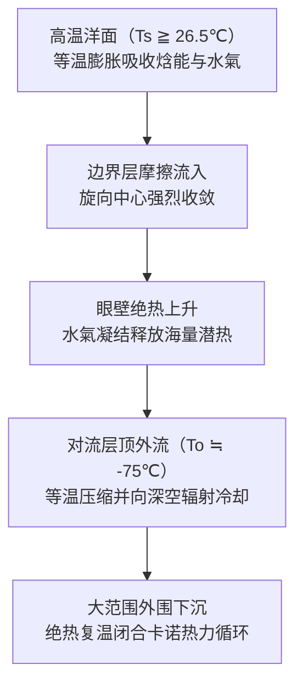
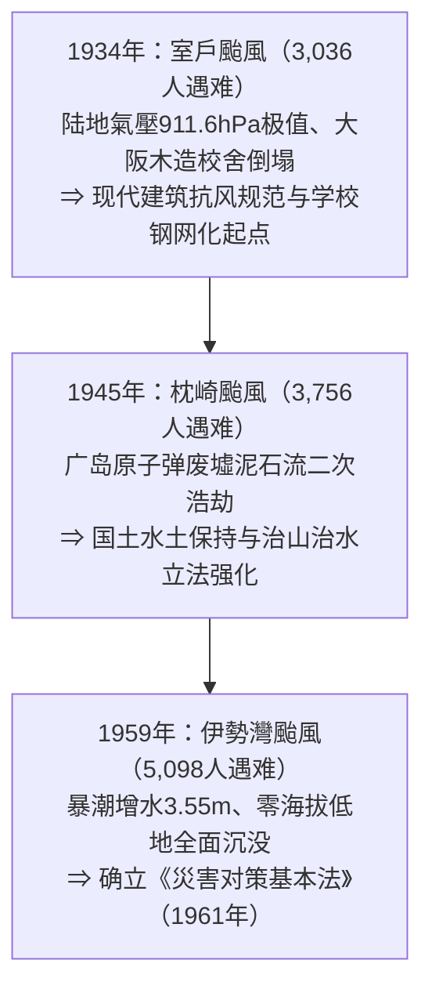
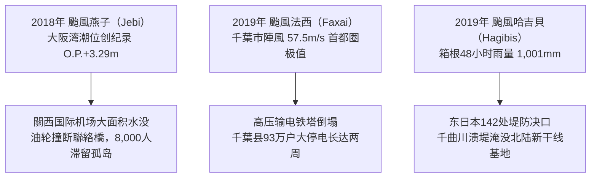
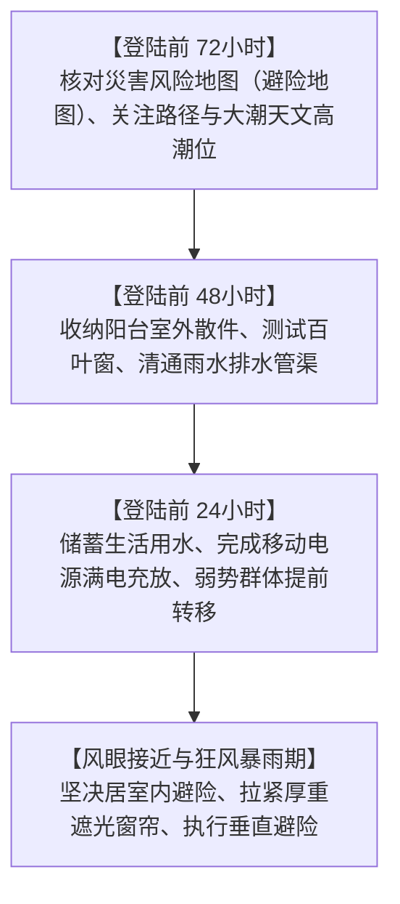

## 前言：直面海气系统中的宏伟热机

在热带灼热阳光照射的辽阔洋面上，一缕水氣蒸腾而起。在地球自转产生的无形偏转力作用下，水氣对流开始旋转，最终自我组织为直径数百乃至上千公里的宏伟低氣壓系统——这便是 **颱風（熱帶氣旋: Tropical Cyclone）** 。

颱風是地球上最强大且最具几何對稱美的大气现象之一。在行星尺度上，它是至关重要的气候调节裝置，将低緯度过剩的太阳热能高效輸送至高緯度极地冷却槽。然而，一旦颱風侵入人类文明密集区，其毁灭性的“破坏三位一体”——暴风、暴潮与极端暴雨——足以在数小时内摧毁坚固的现代工程防线。

日本列岛处于西北太平洋颱風转向中緯度西风带的主通道上。千百年来，颱風带来的丰沛雨水滋养了农耕文化，但也造成了无数惨烈的历史劫难。昭和时期的三大颱風——室戶颱風（1934年）、枕崎颱風（1945年）与伊勢灣颱風（1959年）——均夺走数千人生命，推动了日本现代《災害对策基本法》、建筑抗风抗震规范与流域治水工学的诞生。

在21世纪人类活动引起的气候变化背景下，海洋热力基础发生深刻重塑。海溫攀升与大气持水能力剧增，导致了海工人工岛机场全面水没（2018年燕子颱風）、首都圈電網瘫痪两周（2019年法西颱風）以及142处堤防决堤（2019年哈吉貝颱風）。本文从地球物理流體力學、熱力學、災害社会学及生存行动学等维度，系统构建一份面向未来的防灾学术与实战指南。

---

## 1. 熱力學机制：作为卡诺热机的颱風模型与MPI理论

### 1.1 国际分类与风速标准定义

世界氣象组织（WMO）及各主要氣象机构对熱帶氣旋的分类标准如下：

| 分类定义 | 涉及海域 | 风速测量基准 | 判定阈值 |
| :--- | :--- | :--- | :--- |
| **颱風（Typhoon / 日本氣象厅）** | 西北太平洋及南海 | **10分钟平均最大持续风速** | $\ge 34\,\text{knots}$（约 $17.2\,\text{m/s}$） |
| **颱風（美军联合颱風预警中心 JTWC）** | 西北太平洋 | **1分钟平均最大持续风速** | $\ge 64\,\text{knots}$（约 $33\,\text{m/s}$） |
| **飓风（Hurricane / 美国国家飓风中心）** | 北大西洋、加勒比海、东北太平洋 | **1分钟平均最大持续风速** | $\ge 64\,\text{knots}$（约 $33\,\text{m/s}$） |
| **气旋风暴（Cyclone）** | 印度洋及西南太平洋 | 3分钟至10分钟平均 | $\ge 34\,\text{knots}$ 或 $\ge 64\,\text{knots}$ |

日本氣象厅进一步划定：
- **强颱風** ：最大风速 $33\,\text{m/s} \sim 44\,\text{m/s}$
- **超强颱風** ：最大风速 $44\,\text{m/s} \sim 54\,\text{m/s}$
- **猛烈颱風** ：最大风速 $\ge 54\,\text{m/s}$

---

### 1.2 卡诺循环模型与最大潜在强度（MPI）理论

麻省理工学院（MIT）氣象学家克里·伊曼纽尔（Kerry Emanuel）提出，颱風本质上是一部宏观 **卡诺热机（Carnot Heat Engine）** ：从温暖洋面（$T_s$）吸收水氣热焓，在对流层顶极冷环境（$T_o \approx -75^\circ\text{C}$）向外排热辐射。

卡诺热机效率 $\epsilon$ 取决于海溫与排热层温差：

$$\epsilon = \frac{T_s - T_o}{T_s}$$

在海气焓能输入与边界层气动摩擦耗散相平衡的极值状态下，伊曼纽尔的 **最大潜在强度（MPI: Maximum Potential Intensity）** 方程决定了理论风速极限 $V_{\max}$：

$$V_{\max}^2 \approx \frac{C_k}{C_D} \frac{T_s - T_o}{T_o} \left( k_s^* - k \right)$$

式中 $C_k / C_D$ 为焓交换与摩擦阻力系数之比，$(k_s^* - k)$ 为饱和洋面与边界层空气的热力非平衡差。海溫每上升 $1^\circ\text{C}$，热力非平衡度剧增，颱風理论极限强度显著提高。

---

### 1.3 生成物理必要条件与非线性不稳定性（CISK / WISHE）

颱風的生成需要严苛的环境物理场匹配：
1. **海面温度（SST）$\ge 26.5^\circ\text{C}$** ：确保持续剧烈蒸发供应水氣。
2. **海洋热容量（TCHP）** ：$26^\circ\text{C}$ 以上暖水层厚度需达 $50\,\text{m} \sim 100\,\text{m}$，防止颱風自身强风诱发的深水涌升（Upwelling）冷却自毁。
3. **地转参数（Coriolis Parameter）** ：緯度需在 $5^\circ$ 以上以提供地转偏向力。
4. **低垂直风切变（VWS $< 10\,\text{m/s}$）** ：防止高层强风破坏暖心结构的铅直对齐。
5. **从 CISK 到 WISHE 不稳定理论** ：经典第二类条件不稳定（CISK）揭示了对流尺度的潜热释放与低压环流摩擦收敛的正反馈；现代风水面交换不稳定（WISHE）则进一步证明，洋面蒸发通量随近地面风速非线性倍增，促成了颱風爆发性自激增强（Rapid Intensification）。

---

## 2. 三维涡旋动力结构与流体平衡

### 2.1 立体环流场结构

成熟颱風在动力学上由三个特征层控制：
- **边界层流入层（0–1.5 km）** ：在摩擦作用下气流斜穿等压线向低压中心剧烈螺旋辐合。
- **眼壁倾斜上升核心（1.5–14 km）** ：剧烈对流形成的上升气流墙，集中了全系统最狂暴的狂风暴雨。
- **对流层顶辐散外流层（12–16 km）** ：反气旋性（顺时针）排气气流，消除空气阻塞。

---

### 2.2 颱風眼动力学与双眼壁置换周期（ERC）

**颱風眼（Eye）** 的形成由 **角动量守恒** 与 **離心力** 严密支配：

$$M = v r + \frac{1}{2} f r^2 = \text{const}$$

半径 $r$ 减小时，切向风速 $v$ 急剧攀升，向外的離心力 $\frac{v^2}{r}$ 呈三次方向外爆发，在最大风速半径（RMW）与内向氣壓梯度力形成动态平衡屏障。眼区内部由于质量补偿产生受迫 **下沉气流** ，绝热增温蒸发了所有水氣，呈现晴朗微风的无雲區域。

在4–5级超强颱風中普遍存在的 **双眼壁置换周期（ERC）** 结构：

---

### 2.3 傾度風平衡与危險半圓流體力學

氣壓梯度力、地转偏向力与離心力构成 **傾度風平衡（Gradient Wind Balance）** ：

$$\frac{1}{\rho} \frac{\partial p}{\partial r} = f v + \frac{v^2}{r}$$

在移动坐标系中，颱風产生显著的风场不對稱性：
- **危險半圓（行进方向右侧）** ：气旋自身逆时针风矢量与颱風整体平移矢量同向叠加（$v_{\text{net}} = v_{\text{rot}} + v_{\text{trans}}$），风速极强，并将海水推向沿岸。
- **可航半圓（行进方向左侧）** ：旋转风向与平移方向相反，风速部分抵消（$v_{\text{net}} = v_{\text{rot}} - v_{\text{trans}}$）。

---

## 3. 路径动力学与溫帶氣旋化變性（ET）

颱風移动由对流层深层平均 **引导气流（Steering Flow）** 控制，主要受西太平洋副热带高压边缘引导。在中緯度西风带捕获后经历转向加速。

氣象预报中的 **溫帶氣旋化變性（Extratropical Transition: ET）** 并非颱風衰亡，而是 **动力能源切换** ：从依靠海洋潜热的“正压暖心系统”，转变为依靠冷暖气团温度梯度的“斜压前线系统”。變性过程中大风半径呈数倍扩张，造成横跨数千公里的广泛海陆风灾。

---

## 4. 昭和三大颱風：日本现代防灾体制的历史基石

1. **室戶颱風（1934年）** ：高知县室戶岬觀測到 **$911.6\,\text{hPa}$** 地面氣壓历史极值。上午袭击大阪府，摧毁缺乏剪刀撑抗风加固的260余所木造校舍，600名学童丧生。由此确立了日本现代抗风结构规范。
2. **枕崎颱風（1945年）** ：以 $916.3\,\text{hPa}$ 登陆九州。重创因战乱荒废林水且刚遭受原子弹袭击的广岛县，引发大野陆军医院山体滑坡浩劫，促成国家水土保持与治山防洪工程。
3. **伊勢灣颱風（1959年）** ：登陆氣壓 $929\,\text{hPa}$。伊勢灣全域陷入危險半圓，南南东狂风与深海低压产生 **$3.55\,\text{m}$ 极端暴潮增水 **。数万吨原木随巨浪化为撞锤冲垮堤防，溺亡5,098人。日本国会由此制定** 《災害对策基本法》** ，开启综合防灾国家时代。

---

## 5. 洪涝与海难代表性災害

- **凯瑟琳颱風（1947年）** ：利根川大决堤，洪水向南长驱直入淹没东京都葛饰、江户川两区，催生现代首都圈外郭放水路及上游防洪库群。
- **洞爺丸颱風（1954年）** ：變性冷低压再爆发，瞬间风速 $57\,\text{m/s}$ 倾覆津轻海峡“洞爺丸”等5艘客轮，遇难 **1,430人** ，直接推动世界最长海底铁路隧道——青函隧道的开工。
- **狩野川颱風（1958年）** ：伊豆半岛天城山降雨超 $750\,\text{mm}$，山体大崩塌泥石流造成千余人死亡，促成狩野川分洪道工程。

---

## 6. 气候变暖背景下的平成·令和激甚颱風

- **2018年燕子颱風** ：大阪港潮位突破历史极值（$+3.29\,\text{m}$），關西机场跑道水没、地下电气设施损坏全岛斷電，漂流油轮撞断唯一对外通道，暴露海工枢纽致命短板。
- **2019年法西颱風** ：以高密度强氣壓梯度掠过千葉，陣風 $57.5\,\text{m/s}$ 折断两座输电铁塔与数千电线杆，引发两周大停电与热浪并发次生危机。
- **2019年哈吉貝颱風** ：大气河流型超宽幅水氣輸送，箱根雨量达 $1,001\,\text{mm}$。全日本71条河流142处决堤，长野千曲川溃堤使10列北陆新干线（价值超300亿日元）被淹报废。

---

## 7. 全球极端熱帶氣旋纪录与气候预测

- **颱風狄普（Tip / 1979年）** ：全球实测最低海平面氣壓 **$870\,\text{hPa}$**，强风圈直径 **$2,220\,\text{km}$** （足以覆盖全日本），由美军氣象侦察机下投探空仪实测确认。
- **超强颱風海燕（Haiyan / 2013年）** ：登陆菲律宾雷伊泰島时中心氣壓 $895\,\text{hPa}$，推测陣風达 **$105\,\text{m/s}$（$378\,\text{km/h}$）** ，海啸级垂直暴潮重创塔克洛班市，遇难逾7,300人。
- **未来预测** ：根据IPCC报告，全球颱風总数趋稳或略降，但 **4–5级超强颱風占比显著攀升** ，降水极值按气温每升高1℃约增加7%的速率递增，且最盛期緯度持续北移。

---

## 8. 災害物理机制：风压非线性定律与暴潮动力学

### 8.1 气动力学风压平方律
风压力 $P$ 遵从平方律：

$$P = \frac{1}{2} \rho v^2 C_f$$

风速增加一倍，破坏载荷提升四倍；风速增至三倍，风力激增九倍。飞来物击碎窗玻璃后，室内骤增正压与屋顶外侧伯努利吸力叠加，致使屋架整体向上掀翻爆裂。

### 8.2 暴潮增水力学

$$\Delta h = \Delta h_p + \Delta h_w$$

1. **静压吸上效应（$\Delta h_p$）** ：中心氣壓每下降 $1\,\text{hPa}$，海面相应吸起约 $1\,\text{cm}$。
2. **风应力增水（$\Delta h_w$）** ：
   $$\frac{\partial h_w}{\partial x} \approx \frac{\rho_a C_D v^2}{\rho_w g H}$$
 增水高度与 **风速平方成正比** ，且与 **水深 $H$ 成反比**。伊勢灣、东京湾等水浅口狭的内湾最易蓄积毁灭性暴潮。

---

## 9. 前沿氣象与防灾时间线生存战略

### 9.1 避险决策标准
- **水平转移（外离避险）** ：必须在风速超过 $20\,\text{m/s}$ 或路面积水超过 $20\,\text{cm}$ 之前完成。
- **紧急垂直避险** ：室外已进入暴雨狂风阶段时，严禁盲目涉水出门，应迅速撤离至坚固钢混建筑二层以上，并远离傍山崖壁一侧。

---

## 結語：科学之盾与想象力之堡垒

在行星级大气能量面前，人类抵御災害的依归在于两个维度：一是掌握物理规律、理解早期预警指标的 **科学之盾** ；二是摒弃“自身安然无恙”侥幸偏见的 **想象力之堡垒** 。以正确的科学素养引领主动时间线行动，方能在气候危机时代构筑坚固的生存防线。
