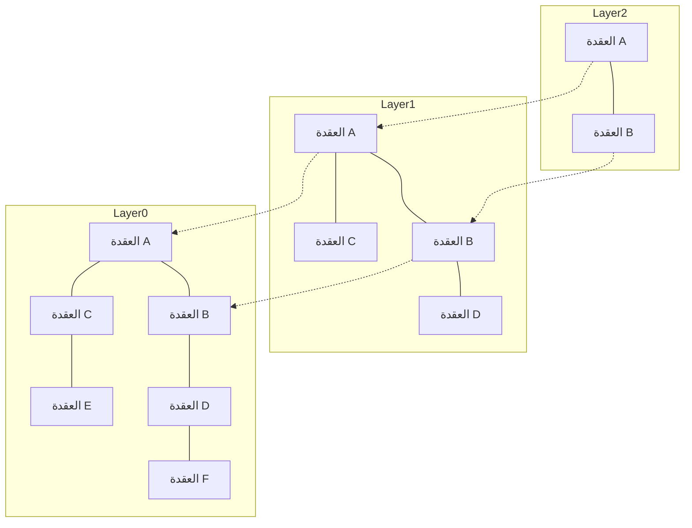

# المقدمة: صعود أنظمة RAG وأهمية قواعد البيانات المتجهة

في السنوات الأخيرة، ومع التطور المتسارع للنماذج اللغوية الكبيرة (LLMs)، حظي أسلوب "التوليد المعزز بالاسترجاع" (Retrieval-Augmented Generation - RAG) باهتمام واسع النطاق. يقوم نهج RAG ليس فقط على المعرفة المسبقة التي يمتلكها النموذج اللغوي، بل يبحث أيضاً (Retrieval) عن المعلومات ذات الصلة من قواعد معرفية خارجية، ثم يدمج هذه المعلومات في سياق التعليمات البرمجية أو الاستفسار (Augmentation) لتوليد الإجابة. يساهم ذلك في الحد من ظاهرة الهلوسة (Hallucination)، وتحقيق إجابات عالية الدقة تستند إلى أحدث البيانات الداخلية للمؤسسات والخبرات التخصصية.

ويُعدّ وجود "قواعد البيانات المتجهة" (Vector Databases) عنصراً لا غنى عنه كأساس لمنظومة RAG هذه. إذ تعتمد قواعد البيانات العلائقية التقليدية ومحركات البحث بالنص الكامل (مثل BM25) على التطابق التام للكلمات المفتاحية أو تكرارها لإجراء عمليات البحث. ومع ذلك، يصعب باستخدام هذه الطرق العثور على الجمل التي "تتطابق في المعنى ولكن تختلف في الكلمات المستخدمة". أما قواعد البيانات المتجهة، فتقوم بتخزين البيانات كمتجهات عددية عالية الأبعاد، وتتيح إجراء البحث القائم على التقارب الدلالي (البحث الدلالي - Semantic Search) عبر حساب المسافة (أو درجة التشابه) داخل الفضاء المتجهي.

تتناول هذه المقالة شرحاً مفصلاً ومنهجياً يبدأ من أساسيات "التضمينات المتجهة" (Embeddings) التي تمثل جوهر قواعد البيانات المتجهة، وصولاً إلى آلية عمل خوارزمية "HNSW" (Hierarchical Navigable Small World) التي تتيح إجراء عمليات البحث فائق السرعة.

## 1. ما هي التضمينات المتجهة (Embeddings)؟

### 1.1 تحويل المعنى إلى قيم عددية
تُعرّف "التضمينات" (Embeddings) في معالجة اللغات الطبيعية بأنها تقنية لتحويل البيانات مثل الكلمات، والجمل، والصور إلى متجهات ذات طول ثابت من القيم المتصلة (مصفوفة من الأعداد الحقيقية). على سبيل المثال، في فضاء متجهي يتكون من 300 أو 1536 بُعداً، تقع الكلمات والجمل ذات المعاني المتشابهة في مواضع متقاربة داخل هذا الفضاء.

- "ملك" - "رجل" + "امرأة" = "ملكة"

أصبحت إمكانية إجراء مثل هذه العمليات الحسابية على المعاني الدلالية معروفة على نطاق واسع بفضل نماذج التضمين المبكرة مثل Word2Vec. واليوم، تُستخدم نماذج متقدمة مثل `text-embedding-ada-002` و `text-embedding-3-small/large` من OpenAI، وEmbed من Cohere، ونماذج عائلة BERT مفتوحة المصدر (مثل Sentence-BERT) على نطاق واسع.

### 1.2 خصائص الفضاء عالي الأبعاد
المتجهات التي تنتجها نماذج التضمين الحديثة تكون فائقة الأبعاد (على سبيل المثال: 768 أو 1536 بُعداً). ومع زيادة عدد الأبعاد، تزداد القدرة التعبيرية للمتجه، لكن تكلفة الحساب ترتفع بالمقابل وتبرز ظاهرة تُعرف باسم "لعنة الأبعاد" (Curse of Dimensionality). ففي الفضاءات عالية الأبعاد، تصبح المسافات بين أي نقطتين متقاربة جداً وشبه متساوية، مما يؤدي إلى انخفاض حاد في كفاءة البحث عن أقرب الجيران. وتواجه قواعد البيانات المتجهة التحدي المتمثل في كيفية التعامل مع هذه البيانات فائقة الأبعاد بكفاءة عالية.

## 2. طرق قياس التشابه (مقاييس المسافة - Distance Metrics)

لقياس "التقارب الدلالي" بين المتجهات، تُستخدم العديد من دوال المسافة الرياضية (المقاييس). ويتعين اختيار المقياس المناسب بما يتوافق مع هدف البحث وخصائص نموذج التضمين المستخدم.

### 2.1 تشابه جيب التمام (Cosine Similarity)
يقيس هذا المقياس درجة التشابه باستخدام جيب التمام (cosine) للزاوية المحصورة بين متجهين. فهو يأخذ في الاعتبار "اتجاه" المتجهين فقط، متجاهلاً "طولهما أو مقدارهما" (Norm). وتتراوح القيمة بين -1 (متعاكسان تماماً) إلى 1 (نفس الاتجاه تماماً). ويُعد هذا المقياس الأكثر استخداماً وشيوعاً لقياس التشابه الدلالي للنصوص.

### 2.2 المسافة الإقليدية (Euclidean Distance / L2 Distance)
هي المسافة المستقيمة بين نقطتين في الفضاء المتجهي. تشير القيمة الأصغر إلى تشابه أكبر. وتناسب هذه الطريقة الحالات التي تكون فيها العلاقات المكانية المطلقة مهمة، مثل مقارنة السمات والخصائص المستخرجة من الصور.

### 2.3 الجداء النقطي (Dot Product)
هو حاصل ضرب العناصر المتقابلة لمتجهين ثم جمعها معاً. عندما تكون المتجهات معايرة أو موحدة الطول (أي أن معيارها يساوي 1)، تتطابق نتيجة الجداء النقطي تماماً مع تشابه جيب التمام. وتُفضل العديد من الأنظمة استخدام هذا المقياس لقلة خطواته الحسابية وسرعة معالجته الفائقة.

## 3. حدود البحث الدقيق (Exact Search) والبحث التقريبي لأقرب الجيران (ANN)

تُسمى مهمة العثور على المتجهات الأكثر تشابهاً مع متجه الاستعلام المُدخل من داخل قاعدة البيانات بـ "البحث عن أقرب k جيران" (k-Nearest Neighbors؛ أو k-NN اختصاراً).

### 3.1 مشكلات البحث الدقيق (k-NN)
تتمثل أبسط طريقة في حساب المسافة بين متجه الاستعلام وجميع المتجهات الموجودة في قاعدة البيانات، ثم ترتيبها تصاعدياً حسب المسافة واختيار أقرب k عنصر (Flat Search / Exact Search).
إلا أن التعقيد الحسابي لهذا النهج يبلغ $O(N \times D)$ (حيث $N$ هو عدد العناصر و $D$ هو عدد الأبعاد). وعندما يصل حجم البيانات إلى ملايين أو مليارات العناصر، قد يستغرق الاستعلام الواحد عدة ثوانٍ أو حتى عشرات الدقائق، مما يجعله غير قابل للتطبيق تماماً في التطبيقات اللحظية والتفاعلية (مثل روبوتات الدردشة وأنظمة التوصية).

### 3.2 البحث التقريبي عن أقرب الجيران (Approximate Nearest Neighbor; ANN)
وهنا تبرز خوارزميات "البحث التقريبي عن أقرب الجيران" (Approximate Nearest Neighbor - ANN)، والتي تُضحي بنسبة ضئيلة جداً من الدقة مقابل تحقيق قفزة هائلة في سرعة البحث. يتبع ANN نهج: "لا نضمن العثور على أقرب عنصر قطعاً بنسبة 100%، لكننا نعثر باحتمالية عالية جداً على عناصر قريبة بما يكفي".

تشمل أبرز خوارزميات ANN الشائعة ما يلي:
- **القائمة على الأشجار (Tree-based)**: مثل KD-Tree و Annoy. تكون فعالة في الأبعاد المنخفضة، لكنها تتأثر بشدة بـ "لعنة الأبعاد" عند زيادة عدد الأبعاد.
- **القائمة على التجزئة (Hash-based)**: مثل LSH (Locality-Sensitive Hashing). تستخدم دوال تجزئة تزيد من احتمالية توليد قيم التجزئة المتماثلة للمتجهات المتقاربة.
- **القائمة على التكميم (Quantization-based)**: مثل PQ (Product Quantization). تقوم بضغط المتجهات لتقليل استهلاك الذاكرة، وإجراء حسابات المسافة التقريبية بسرعة عالية.
- **القائمة على الرسوم البيانية (Graph-based)**: مثل HNSW (Hierarchical Navigable Small World). وتُعتبر المعيار الفعلي السائد حالياً في البحث المتجهي، نظراً لتحقيقها التوازن الأفضل على الإطلاق بين السرعة والدقة.

## 4. آلية عمل HNSW: قمة البحث القائم على الرسوم البيانية

تُعد HNSW (Hierarchical Navigable Small World) خوارزمية اقترحها يوري مالكوف (Yu. A. Malkov) وزملاؤه، وتجمع بين نظرية الشبكات المعقدة وهياكل البيانات المتقدمة. وكما يوضح اسمها، فهي ترتكز على مفهومين أساسيين: شبكات "العالم الصغير" (Small World) و"البنية الهرمية" (Hierarchical).

### 4.1 رسم بياني للعالم الصغير القابل للملاحة (Navigable Small World - NSW)
ظاهرة العالم الصغير (المعروفة بـ "درجات التباعد الست") تشير إلى الخاصية التي تتيح الانتقال بين أي عقدتين في شبكة ضخمة (مثل شبكات العلاقات الإنسانية أو الإنترنت) عبر عدد قليل فقط من الخطوات (الروابط الوسيطة).
تُطبق NSW هذه الخاصية في البحث عن الجيران داخل الفضاء المتجهي؛ حيث تُمثَّل كل نقطة بيانات كعقدة في الرسم البياني، ويتم ربط العقد المتقاربة ببعضها البعض بواسطة حواف (Edges). وفي الوقت ذاته، يتم الاحتفاظ بعدد قليل من "الحواف طويلة المدى" (Long-range Edges) التي تربط بين عقد متباعدة جغرافياً أو فضاءً.

عند البحث، يبدأ الاستعلام من عقدة عشوائية، ويقوم بالتنقل المتكرر نحو "العقدة المجاورة للعقدة الحالية التي تكون الأقرب لمتجه الاستعلام" (البحث الجشع - Greedy Search). وبفضل وجود الحواف طويلة المدى، يمكن التنقل عبر قفزات واسعة وسريعة داخل الرسم البياني، وبمجرد الاقتراب من المنطقة المستهدفة، يتم الانتقال عبر الحواف القصيرة لإجراء ضبط دقيق، مما يحقق استكشافاً فائق الكفاءة.

### 4.2 النهج المستوحى من قوائم التخطي (Skip List) عبر البنية الهرمية
تمثلت نقطة الضعف في NSW في أنه مع تزايد عدد العقد، يزداد عدد الخطوات المطلوبة حتى أثناء "القفزات الواسعة" الأولية. لذلك، استعارت خوارزمية HNSW فكرة بنية بيانات "قائمة التخطي" (Skip List)، وقامت بتقسيم الرسم البياني إلى عدة طبقات (مستويات هرمية).

- **الطبقة السفلية (Layer 0)**: رسم بياني كثيف للجيران يحتوي على جميع نقاط البيانات دون استثناء.
- **كلما صعدنا إلى الطبقات الأعلى**: يتناقص عدد العقد بشكل أسي (تخفيف العقد)، وتصبح الروابط بينها أكثر تباعداً وتشتتاً.

### 4.3 خوارزمية البحث والتوجيه في HNSW
يبدأ البحث في HNSW من الطبقة الأعلى، ويمر بالمراحل التالية:

1. **نقطة الدخول (Entry Point)**: يبدأ البحث من عقدة بداية محددة مسبقاً في الطبقة الأعلى.
2. **البحث في كل طبقة**: يُجرى بحث جشع (Greedy Search) في الطبقة الحالية للعثور على العقدة الأقرب إلى الاستعلام (الحد الأدنى المحلي - Local Minimum).
3. **الانتقال للطبقة الأدنى**: عندما يتعذر العثور على أي عقدة أقرب في تلك الطبقة، يتم النزول إلى الطبقة الأدنى مباشرة انطلاقاً من نفس العقدة الحالية.
4. **البحث النهائي في الطبقة السفلية**: تتكرر هذه العملية نزولاً حتى الوصول إلى الطبقة السفلية (Layer 0)، وتُعاد أفضل k عقد تم العثور عليها عبر البحث الجشع في Layer 0 كنتائج نهائية للبحث.

بفضل هذه البنية الهرمية، تتيح المراحل الأولى من البحث التنقل بـ "قفزات واسعة" في الطبقات العليا لتحديد المنطقة المستهدفة بسرعة فائقة، ثم زيادة الدقة تدريجياً كلما هبطنا نحو الطبقات السفلى لإجراء استكشاف دقيق ومفصل. وبذلك يصبح التعقيد الحسابي للبحث لوغاريتمياً، مما يُمكّن من الاستجابة في غضون أجزاء من الألف من الثانية (مللي ثانية) حتى مع بيانات تتجاوز مئات الملايين من العناصر.

### 4.4 بناء HNSW والمعاملات الفائقة (Hyperparameters)
عند إدراج بيانات جديدة (Insert) في رسم HNSW البياني، يتم البحث من أعلى الطبقات إلى أسفلها تماماً كعملية الاستعلام، وتُربط العقدة الجديدة بالعقد المجاورة عبر حواف في كل طبقة.
تخضع كفاءة وأداء HNSW لمجموعة من المعاملات الفائقة (Hyperparameters) الأساسية:

- **`M`**: أقصى عدد من الحواف ثنائية الاتجاه التي يمكن أن ترتبط بعقدة واحدة. تؤدي زيادة هذه القيمة إلى رفع الدقة، ولكنها تزيد من استهلاك الذاكرة وتبطئ سرعة البناء والبحث.
- **`efConstruction`**: حجم قائمة المرشحين المحتفظ بها كعقد مجاورة أثناء مرحلة بناء الرسم البياني. كلما كانت القيمة أكبر، تحسنت جودة الرسم البياني ودقته، ولكن يزداد الوقت المستغرق لبناء الفهرس.
- **`efSearch`**: حجم قائمة المرشحين المحتفظ بها أثناء مرحلة البحث. كلما كبرت القيمة، ارتفعت دقة البحث ومعدل الاسترجاع (Recall)، إلا أن سرعة البحث تنخفض. ونظراً لإمكانية تعديل هذه المعاملة ديناميكياً أثناء وقت البحث فقط، يمكن الموازنة بمرونة بين الدقة وزمن الاستجابة (Latency) حسب متطلبات التطبيق.

## 5. تطبيقات قواعد البيانات المتجهة وبيئتها البرمجية (Ecosystem)

تتوفر حالياً العديد من البرمجيات التي تقدم ميزات البحث المتجهي، ويمكن تصنيفها بصورة رئيسية إلى ثلاث فئات: "قواعد البيانات المتجهة المخصصة"، و"المكتبات البرمجية"، و"ملحقات قواعد البيانات الحالية".

### 5.1 قواعد البيانات المتجهة المخصصة
قواعد بيانات موزعة صُممت خصيصاً للبحث المتجهي، وتدعم أصلاً إمكانية التوسع، والتوافر العالي (High Availability)، والبحث الهجين:
- **Pinecone**: خدمة برمجية مدارة بالكامل (SaaS). تتميز بسهولة الإعداد القصوى، وتُستخدم على نطاق واسع في تطوير تطبيقات RAG.
- **Milvus**: قاعدة بيانات متجهة موزعة ومفتوحة المصدر. تتمتع بمعمارية سحابية أصلية مصممة للتعامل مع مجموعات البيانات الضخمة.
- **Qdrant**: قاعدة بيانات متجهة فائقة السرعة مكتوبة بلغة Rust. تتميز بقوة كبيرة في التصفية المتقدمة للبيانات الوصفية (Metadata).
- **Weaviate**: تتميز بقدرتها على التعامل مع المتجهات والعلاقات البيانية (المخططات - Schemas) بين كائنات البيانات في آن واحد.

### 5.2 مكتبات البحث التقريبي عن أقرب الجيران
مكتبات برمجية مخصصة لبناء الفهارس في ذاكرة التطبيق وإجراء عمليات بحث خفيفة وسريعة:
- **Faiss**: مكتبة C++ طوّرها فريق أبحاث الذكاء الاصطناعي في Meta (فيسبوك سابقاً). توفر العديد من الخوارزميات المتنوعة مثل PQ و IVF إلى جانب HNSW، وتدعم البحث فائق السرعة عبر وحدات معالجة الرسومات (GPU).
- **Hnswlib**: تطبيق خفيف وعالي السرعة لخوارزمية HNSW بلغة C++. يتميز ببساطة إعداده ومناسبته للمشاريع الصغيرة والمتوسطة التي تعمل بالكامل داخل الذاكرة (In-memory).

### 5.3 ملحقات المتجهات لقواعد البيانات الحالية
نهج يقوم على إضافة إمكانيات البحث المتجهي إلى قواعد البيانات العلائقية أو محركات البحث القائمة:
- **pgvector**: امتداد لقاعدة بيانات PostgreSQL. يتيح كتابة حسابات المسافة بين المتجهات والبحث السريع عبر HNSW مباشرة داخل استعلامات SQL، مما يسهل عمليات الربط (JOIN) والتصفية بين البيانات العلائقية والمتجهات.
- **Elasticsearch / OpenSearch**: تم دمج إمكانيات ANN للمتجهات عالية الأبعاد داخل محركات البحث القوية بالنص الكامل، مما يجعلها فعالة للغاية في "البحث الهجين" الذي يجمع بين البحث اللفظي والمعجمي والبحث الدلالي.

## 6. تقنيات البحث المتقدمة: تصفية البيانات الوصفية والبحث الهجين

في التطبيقات العملية الواقعية، لا يقتصر الأمر على "التقارب الدلالي" الذي توفره المتجهات فحسب، بل يتطلب الأمر أيضاً تصفية البيانات بناءً على منطق الأعمال (Business Logic).

### 6.1 معضلة البحث المتجهي والتصفية
يُعد الجمع بين التصفية باستخدام البيانات الوصفية (Metadata Filtering) وبحث ANN تحدياً تقنياً معقداً:
- **التصفية البعدية (Post-filtering)**: إجراء البحث المتجهي أولاً للحصول على أفضل النتائج، ثم تطبيق تصفية البيانات الوصفية عليها لاحقاً. ومع ذلك، إذا كانت معايير التصفية صارمة جداً، فهناك خطر من الحصول على صفر نتائج في النهاية.
- **التصفية القبلية (Pre-filtering)**: تصفية البيانات بالاعتماد على البيانات الوصفية أولاً، ثم إجراء البحث المتجهي على المجموعة الجزئية المتبقية. ولكن نظراً لأن هياكل الرسوم البيانية مثل HNSW مبنية ومُحسّنة للرسم البياني بأكمله، فإن استبعاد وتعطيل بعض العقد قد يؤدي إلى انقطاع مسارات التوجيه وفشل البحث.

تتعامل قواعد البيانات المتجهة الحديثة مع هذه المعضلة من خلال تطبيق نسخ مخصصة "Custom HNSW" ومُحسِّنات استعلام متطورة تبدّل ديناميكياً بين استراتيجيات التصفية والبحث المتجهي وفقاً لطبيعة الشروط والمعايير.

### 6.2 القيمة الحقيقية للبحث الهجين (Hybrid Search)
يبرع البحث المتجهي في التقاط "المعنى المفاهيمي والدلالي"، لكنه قد يواجه صعوبة في مطابقة "الأسماء المعرفة" أو "أرقام الطرازات المحددة بدقة". لذلك، بات "البحث الهجين" (Hybrid Search) — الذي ينفذ البحث بالنص الكامل القائم على الكلمات المفتاحية (مثل BM25) والبحث المتجهي في نفس الوقت ثم يدمج درجات التقييم للجانبين للوصول إلى النتيجة النهائية — بمثابة أفضل الممارسات المعتمدة في أنظمة RAG للمؤسسات.

## الخاتمة

تمثل قواعد البيانات المتجهة وخوارزمية HNSW بنية تحتية تقنية لا غنى عنها لتطبيقات عصر الذكاء الاصطناعي التوليدي، وتحديداً في أنظمة RAG. فمن خلال إسقاط معاني النصوص والصور في إحداثيات داخل فضاء متعدد الأبعاد واستخدام البنية الهرمية للرسوم البيانية في HNSW، أصبح من الممكن استخراج المعلومات "الأقرب دلالياً" بشكل فوري حتى من بين مئات الملايين من السجلات.

لقد بدأ بالفعل التحول الجذري من تقنيات البحث التقليدية المعتمدة على التطابق اللفظي التام إلى "البحث الدلالي" الأقرب لطبيعة الإدراك البشري. ومن خلال استيعاب مفاهيم المسافة المتجهية، وضرورة خوارزميات ANN، والبنية الداخلية لخوارزمية HNSW، وخيارات قواعد البيانات المتنوعة الموضحة في هذا المقال، ستتمكن من تصميم وتطوير تطبيقات ذكاء اصطناعي أكثر تقدماً وفاعلية وعملية.
