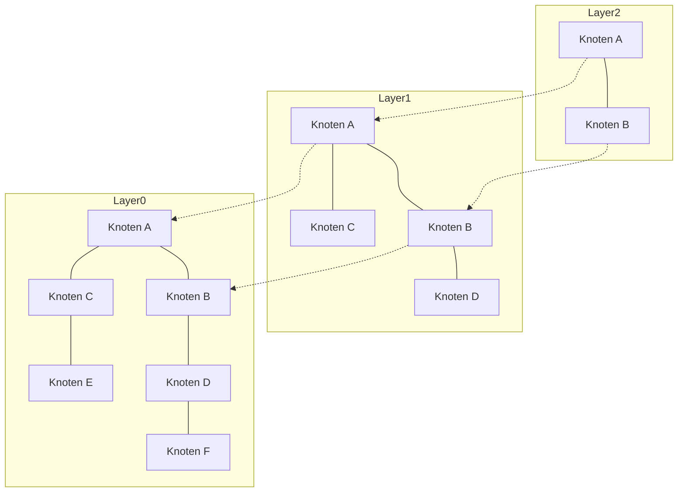

# Einleitung: Der Aufstieg von RAG und die Bedeutung von Vektordatenbanken

Mit der rasanten Entwicklung von Large Language Models (LLMs) hat in den letzten Jahren ein Ansatz namens Retrieval-Augmented Generation (RAG) große Aufmerksamkeit erlangt. RAG ist eine Methode, bei der nicht nur auf das vortrainierte Wissen des LLMs zurückgegriffen wird, sondern relevante Informationen aus einer externen Wissensdatenbank abgerufen (Retrieval) und in den Prompt integriert werden, um die Antwort zu generieren (Augmentation). Dadurch lassen sich Halluzinationen reduzieren und präzise Antworten auf Basis aktueller interner Unternehmensdaten oder von Expertenwissen liefern.

Als unverzichtbare Grundlage für RAG fungieren Vektordatenbanken (Vector Databases). Herkömmliche relationale Datenbanken und Volltext-Suchmaschinen (wie BM25) führen Suchen auf Basis exakter Keyword-Übereinstimmungen oder Worthäufigkeiten durch. Damit ist es jedoch schwierig, Texte zu finden, die zwar dieselbe Bedeutung haben, aber unterschiedliche Wörter verwenden. Eine Vektordatenbank speichert Daten als hochdimensionale numerische Vektoren und berechnet Abstände (Ähnlichkeiten) im Vektorraum, wodurch eine Suche basierend auf semantischer Nähe (semantische Suche) ermöglicht wird.

In diesem Artikel erklären wir detailliert und systematisch die Grundlagen von Einbettungen (Embeddings), die das Herzstück von Vektordatenbanken bilden, bis hin zur Funktionsweise des Algorithmus HNSW (Hierarchical Navigable Small World), der extrem schnelle Suchvorgänge ermöglicht.

## 1. Was sind Vektor-Einbettungen (Embeddings)?

### 1.1 Bedeutung in Zahlen umwandeln
In der natürlichen Sprachverarbeitung (Natural Language Processing, NLP) bezeichnet eine Einbettung (Embedding) eine Technik, bei der Daten wie Wörter, Sätze oder Bilder in Vektoren mit fester Länge aus kontinuierlichen Werten (Arrays von reellen Zahlen) umgewandelt werden. In einem beispielsweise 300- oder 1536-dimensionalen Vektorraum werden Wörter oder Sätze mit ähnlicher Bedeutung räumlich nah beieinander platziert.

- „König“ - „Mann“ + „Frau“ = „Königin“

Dass solche semantischen Rechenoperationen möglich sind, wurde vor allem durch frühe Einbettungsmodelle wie Word2Vec bekannt. Heutzutage werden Modelle wie `text-embedding-ada-002` oder `text-embedding-3-small/large` von OpenAI, Embed von Cohere sowie quelloffene BERT-basierte Modelle (z. B. Sentence-BERT) weit verbreitet eingesetzt.

### 1.2 Eigenschaften hochdimensionaler Räume
Die von modernen Einbettungsmodellen erzeugten Vektoren sind extrem hochdimensional (z. B. 768, 1536 Dimensionen usw.). Mit steigender Dimensionalität wächst zwar die Ausdruckskraft, allerdings steigen auch die Rechenkosten und es tritt das Phänomen auf, das als „Fluch der Dimensionalität“ (Curse of Dimensionality) bekannt ist. In hochdimensionalen Räumen nähern sich die Distanzen zwischen beliebigen Punkten einander an, was die Effizienz der Nächste-Nachbarn-Suche drastisch verringert. Vektordatenbanken stellen sich der Herausforderung, diese hochdimensionalen Daten effizient zu verwalten und zu durchsuchen.

## 2. Methoden zur Ähnlichkeitsberechnung (Distanzmetriken)

Um die „semantische Nähe“ zwischen Vektoren zu messen, werden verschiedene mathematische Distanzfunktionen (Metriken) verwendet. Je nach Ziel der Suche und den Eigenschaften des verwendeten Einbettungsmodells muss die passende Metrik gewählt werden.

### 2.1 Kosinus-Ähnlichkeit (Cosine Similarity)
Hierbei wird die Ähnlichkeit anhand des Kosinus des Winkels zwischen zwei Vektoren gemessen. Es wird lediglich die „Richtung“ der Vektoren berücksichtigt, während die „Länge (Norm)“ ignoriert wird. Der Wert liegt im Bereich von -1 (entgegengesetzte Richtung) bis 1 (identische Richtung). Dies ist die am häufigsten verwendete Metrik zur Messung der semantischen Ähnlichkeit von Texten.

### 2.2 Euklidische Distanz (Euclidean Distance / L2-Distanz)
Dies ist der geradlinige Abstand zwischen zwei Punkten im Vektorraum. Ein kleinerer Wert bedeutet eine höhere Ähnlichkeit. Sie eignet sich besonders dann, wenn absolute räumliche Beziehungen wichtig sind, wie etwa beim Vergleich von Bildmerkmalen.

### 2.3 Skalarprodukt (Dot Product)
Das Skalarprodukt entsteht durch die Multiplikation korrespondierender Elemente zweier Vektoren und deren Aufsummierung. Wenn die Vektoren normalisiert sind (eine Norm von 1 aufweisen), entspricht das Skalarprodukt exakt der Kosinus-Ähnlichkeit. Da es nur wenige Rechenschritte erfordert und extrem schnell ausgeführt werden kann, wird es in vielen Systemen bevorzugt.

## 3. Grenzen der exakten Suche (Exact Search) und ANN

Die Aufgabe, zu einem gegebenen Abfragevektor (Query-Vektor) die ähnlichsten Vektoren in einer Datenbank zu finden, wird als „k-Nächste-Nachbarn-Suche“ (k-Nearest Neighbors, k-NN) bezeichnet.

### 3.1 Das Problem der exakten Suche (k-NN)
Der einfachste Ansatz besteht darin, die Distanz zwischen dem Abfragevektor und allen Vektoren in der Datenbank zu berechnen, die Ergebnisse aufsteigend nach Distanz zu sortieren und die obersten $k$ Treffer abzurufen (Flat Search / Exact Search).
Allerdings beträgt die Rechenkomplexität dieses Ansatzes $O(N \times D)$, wobei $N$ die Anzahl der Datensätze und $D$ die Dimension darstellt. Bei Millionen oder gar Milliarden von Datensätzen würde eine einzelne Suche Sekunden bis Minuten dauern – für Echtzeitanwendungen wie Chatbots oder Empfehlungssysteme völlig inakzeptabel.

### 3.2 Approximative Nächste-Nachbarn-Suche (Approximate Nearest Neighbor, ANN)
Hier kommen Algorithmen zur approximativen Nächste-Nachbarn-Suche (Approximate Nearest Neighbor, ANN) ins Spiel. Sie opfern einen winzigen Teil der Genauigkeit, um im Gegenzug eine dramatische Beschleunigung der Suchgeschwindigkeit zu erreichen. ANN verfolgt das Prinzip: „Es gibt keine absolute Garantie, den exakt nächsten Nachbarn zu finden, aber mit sehr hoher Wahrscheinlichkeit einen hinreichend nahen.“

Zu den typischen ANN-Algorithmen zählen:
- **Baumbasiert**: KD-Bäume, Annoy usw. Bei niedrigen Dimensionen effektiv, leiden sie bei hochdimensionalen Daten jedoch stark unter dem Fluch der Dimensionalität.
- **Hash-basiert**: LSH (Locality-Sensitive Hashing). Verwendet Hash-Funktionen, bei denen nahe beieinander liegende Vektoren mit höherer Wahrscheinlichkeit denselben Hash-Wert erhalten.
- **Quantisierungsbasiert**: PQ (Product Quantization). Komprimiert Vektoren zur Reduzierung des Speicherbedarfs und ermöglicht schnelle approximative Distanzberechnungen.
- **Graphbasiert**: HNSW (Hierarchical Navigable Small World). Gilt derzeit als der beste Kompromiss zwischen Geschwindigkeit und Genauigkeit und hat sich als De-facto-Standard in der Vektorsuche etabliert.

## 4. Funktionsweise von HNSW: Der Höhepunkt graphbasierter Suchverfahren

HNSW (Hierarchical Navigable Small World) ist ein von Yu. A. Malkov et al. vorgeschlagener Algorithmus, der komplexe Netzwerktheorie mit effizienten Datenstrukturen kombiniert. Wie der Name verrät, basiert er auf zwei Kernkonzepten: „Small-World-Netzwerken“ und einer „hierarchischen Struktur“.

### 4.1 Navigable Small World (NSW) Graphen
Das Small-World-Phänomen (bekannt als „Six Degrees of Separation“) beschreibt die Eigenschaft riesiger Netzwerke (wie sozialer Beziehungen oder des Internets), dass zwischen zwei beliebigen Knoten über nur wenige Zwischenschritte eine Verbindung hergestellt werden kann.
NSW überträgt diese Eigenschaft auf die Nachbarschaftssuche im Vektorraum. Jeder Datenpunkt bildet einen Knoten im Graphen, und Knoten, die nahe beieinander liegen, werden durch Kanten verbunden. Gleichzeitig existiert eine kleine Anzahl von „Long-Range-Kanten“ (Weitverkehrsverbindungen), die weit entfernte Knoten miteinander verbinden.

Bei der Suche startet man an einem Zufallsknoten und wechselt wiederholt zu demjenigen Nachbarknoten des aktuellen Knotens, der dem Abfragevektor am nächsten liegt (Greedy Search). Dank der Long-Range-Kanten kann man sich zunächst in großen Sprüngen durch den Graphen bewegen und, sobald man sich dem Ziel nähert, über kürzere Kanten feine Anpassungen vornehmen.

### 4.2 Der Skip-List-Ansatz durch hierarchische Schichten (Hierarchical)
Die Schwachstelle von NSW lag darin, dass mit steigender Knotenanzahl auch die Anzahl der Schritte bei den anfänglichen „großen Sprüngen“ zunahm. HNSW greift daher die Idee der Datenstruktur „Skip-List“ auf und unterteilt den Graphen in mehrere Schichten (Hierarchien).

- **Unterste Schicht (Layer 0)**: Ein dichter Nachbarschaftsgraph, der alle Datenpunkte enthält.
- **Höhere Schichten**: Die Anzahl der Knoten wird exponentiell ausgedünnt, wodurch auch die Kantenverbindungen weitmaschiger werden.

### 4.3 Der Suchalgorithmus von HNSW (Routing)
Die Suche in HNSW beginnt in der obersten Schicht und läuft wie folgt ab:

1. **Einstiegspunkt (Entry Point)**: Die Suche beginnt an einem vordefinierten Startknoten in der obersten Schicht.
2. **Suche in der Schicht**: In der aktuellen Schicht wird eine gierige Suche (Greedy Search) durchgeführt, um den Knoten zu finden, der der Abfrage am nächsten liegt (lokales Minimum).
3. **Abstieg in die nächste Schicht**: Sobald in dieser Schicht kein näherer Knoten mehr gefunden werden kann, steigt der Algorithmus an dieser Position eine Schicht tiefer ab.
4. **Finale Suche auf Layer 0**: Dieser Vorgang wiederholt sich bis zur untersten Schicht (Layer 0). Die dort per Greedy Search ermittelten besten $k$ Knoten werden als endgültiges Suchergebnis zurückgegeben.

Dank dieser hierarchischen Struktur bewegt sich die Suche in der Anfangsphase auf den oberen Ebenen in „großen Schritten“, um den Zielbereich rasch einzugrenzen. Beim Abstieg in die tieferen Schichten erhöht sich die Auflösung für eine hochpräzise Suche. Die Suchkomplexität sinkt dadurch auf logarithmische Zeit ($O(\log N)$), was selbst bei Hunderten Millionen von Datenpunkten Antwortzeiten im Millisekundenbereich ermöglicht.

### 4.4 Konstruktion von HNSW und Hyperparameter
Beim Einfügen neuer Daten (Insert) in den HNSW-Graphen wird analog zur Suche von der obersten Schicht nach unten navigiert, um in den jeweiligen Schichten Nachbarknoten zu identifizieren und Kanten zu knüpfen.
Die Leistungsfähigkeit von HNSW wird maßgeblich durch folgende Schlüssel-Hyperparameter gesteuert:

- **`M`**: Die maximale Anzahl bidirektionaler Kanten, die ein Knoten besitzen kann. Ein höherer Wert steigert die Genauigkeit, erhöht jedoch den Speicherbedarf und verlangsamt Indexierungs- sowie Suchzeiten.
- **`efConstruction`**: Die Größe der Kandidatenliste, die während der Grapherstellung für Nachbarknoten verwaltet wird. Ein höherer Wert verbessert die Graphqualität (Genauigkeit), verlängert jedoch die Aufbauzeit des Index.
- **`efSearch`**: Die Größe der Kandidatenliste während der Suche. Ein höherer Wert verbessert die Suchgenauigkeit (Recall), verringert jedoch die Suchgeschwindigkeit. Da dieser Parameter zur Abfragezeit dynamisch angepasst werden kann, lässt sich der Kompromiss zwischen Genauigkeit und Latenz je nach Anwendungsfall flexibel steuern.

## 5. Implementierungen und Ökosystem von Vektordatenbanken

Heute gibt es zahlreiche Softwarelösungen für die Vektorsuche, die sich im Wesentlichen in drei Kategorien unterteilen lassen: spezialisierte Vektordatenbanken, Bibliotheken und Vektorerweiterungen für bestehende Datenbanken.

### 5.1 Spezialisierte Vektordatenbanken
Verteilte Datenbanken, die eigens für die Vektorsuche entwickelt wurden. Sie bieten native Unterstützung für Skalierbarkeit, Hochverfügbarkeit und hybride Suche.
- **Pinecone**: Vollständig verwaltetes SaaS-Angebot. Äußerst einfache Einrichtung und weit verbreitet in der Entwicklung von RAG-Anwendungen.
- **Milvus**: Quelloffene, verteilte Vektordatenbank. Entwickelt mit einer cloud-nativen Architektur für riesige Datensätze.
- **Qdrant**: In Rust geschriebene, performante Vektordatenbank mit herausragenden Fähigkeiten beim erweiterten Filtern nach Metadaten.
- **Weaviate**: Zeichnet sich dadurch aus, dass es graphbasierte Beziehungen (Schemas) zwischen Datenobjekten und Vektoren nahtlos miteinander verknüpft.

### 5.2 Bibliotheken für die approximative Nächste-Nachbarn-Suche
Bibliotheken zum Aufbau von In-Memory-Indizes innerhalb von Anwendungen für leichtgewichtige Suchabfragen.
- **Faiss**: Eine vom Meta AI Research-Team (ehemals Facebook) entwickelte C++-Bibliothek. Neben HNSW unterstützt sie viele Algorithmen wie PQ (Product Quantization) und IVF (Inverted File) sowie extrem schnelle GPU-beschleunigte Suchen.
- **Hnswlib**: Eine schlanke und schnelle C++-Implementierung des HNSW-Algorithmus. Einfach zu konfigurieren und ideal für In-Memory-Szenarien bei kleinen bis mittleren Datenmengen.

### 5.3 Vektorerweiterungen für bestehende Datenbanken
Dieser Ansatz erweitert bestehende relationale Datenbanken oder Suchmaschinen um Vektorsuchfähigkeiten.
- **pgvector**: Eine Erweiterung für PostgreSQL. Ermöglicht Distanzberechnungen und HNSW-gestützte Suchen direkt in SQL-Queries, wodurch relationale Joins und Filterungen unkompliziert mit Vektordaten kombiniert werden können.
- **Elasticsearch / OpenSearch**: Die etablierten Volltext-Suchmaschinen wurden um ANN-Funktionen für hochdimensionale Vektoren erweitert. Besonders stark für die „hybride Suche“, die lexikalische und semantische Suche vereint.

## 6. Fortgeschrittene Suchmethoden: Metadaten-Filterung und hybride Suche

In realen Anwendungen reicht die bloße „semantische Nähe“ durch Vektoren oft nicht aus; es sind zusätzliche Filterkriterien basierend auf Geschäftslogik erforderlich.

### 6.1 Das Dilemma zwischen Vektorsuche und Filterung
Die Kombination von Metadaten-Filterung und ANN-Suche stellt eine anspruchsvolle technische Herausforderung dar.
- **Post-Filtering**: Zunächst werden die Top-Kandidaten per Vektorsuche ermittelt und anschließend anhand der Metadaten gefiltert. Bei sehr strengen Filterkriterien besteht jedoch das Risiko, dass am Ende null relevante Ergebnisse übrig bleiben.
- **Pre-Filtering**: Zuerst werden die Daten anhand der Metadaten gefiltert, und die Vektorsuche wird nur auf dieser Teilmenge ausgeführt. Da Graphstrukturen wie HNSW jedoch global optimiert sind, kann das Deaktivieren bestimmter Knoten die Pfadfindung unterbrechen und die Suche behindern.

Moderne Vektordatenbanken begegnen diesem Problem durch „Custom HNSW“-Varianten oder fortschrittliche Query-Optimierer, die je nach Filterselektivität dynamisch zwischen verschiedenen Filter- und Suchstrategien wechseln.

### 6.2 Der wahre Wert der hybriden Suche
Vektorsuchen eignen sich hervorragend zum Erfassen „konzeptioneller Bedeutungen“, schwächeln jedoch mitunter bei exakten Eigennamen oder spezifischen Artikelnummern. Daher etabliert sich die „hybride Suche“ – die parallele Ausführung einer klassischen keywordbasierten Volltextsuche (z. B. BM25) und einer Vektorsuche mit anschließender Score-Fusion – als Best Practice für produktive RAG-Systeme im Enterprise-Umfeld.

## Fazit

Vektordatenbanken und der HNSW-Algorithmus bilden das unverzichtbare technologische Fundament für Anwendungen im Zeitalter der generativen KI – allen voran für RAG-Systeme. Indem die Bedeutung von Texten oder Bildern auf Koordinaten in einem mehrdimensionalen Raum abgebildet wird und HNSW mit seiner hierarchischen Graphstruktur zum Einsatz kommt, lassen sich selbst aus Hunderten Millionen Datensätzen blitzschnell semantisch relevante Informationen extrahieren.

Der Paradigmenwechsel von traditionellen Suchtechnologien, die auf exakter Übereinstimmung basieren, hin zu einer „semantischen Suche“, die der menschlichen Wahrnehmung ähnelt, ist bereits in vollem Gange. Mit dem Verständnis für Vektordistanzmetriken, die Notwendigkeit von ANN, die internen Mechanismen von HNSW sowie die vielfältigen Datenbank-Optionen sind Sie bestens gerüstet, um anspruchsvolle und praxistaugliche KI-Anwendungen zu konzipieren und zu entwickeln.
