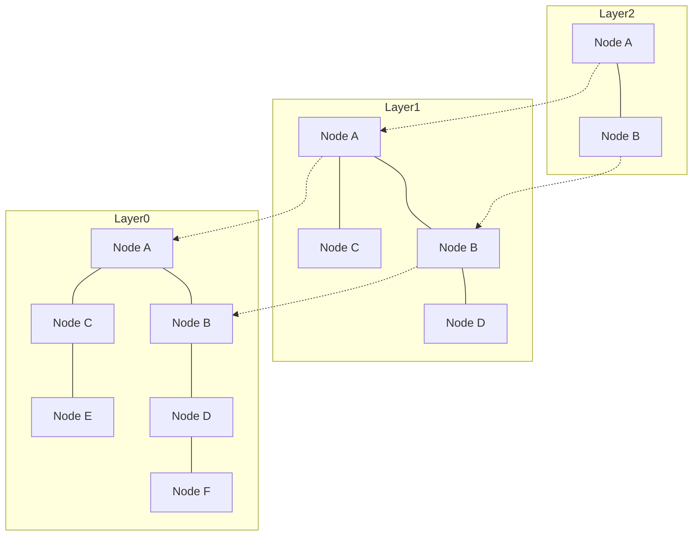

# Introduction: The Rise of RAG and the Importance of Vector Databases

In recent years, alongside the evolution of Large Language Models (LLMs), a technique called Retrieval-Augmented Generation (RAG) has garnered significant attention. RAG is an approach where an LLM does not rely solely on its pre-trained knowledge; instead, it retrieves relevant information from external knowledge bases and augments its prompt with that information before generating an answer. This mitigates hallucinations and enables highly accurate responses grounded in up-to-date internal company data and domain-specific knowledge.

An indispensable foundation of RAG is the "Vector Database." Traditional relational databases and full-text search engines (such as BM25) search based on exact keyword matches or term frequency. However, this makes it difficult to find documents that share the same meaning but use different wording. Vector databases store data as high-dimensional numerical vectors and calculate distances (similarities) in vector space, enabling search based on semantic similarity (semantic search).

In this article, we provide a detailed and systematic guide covering everything from the fundamentals of "embeddings"—the core building block of vector databases—to the inner workings of the "Hierarchical Navigable Small World (HNSW)" algorithm that makes high-speed retrieval possible.

## 1. What are Vector Embeddings?

### 1.1 Converting Meaning into Numbers
In natural language processing, "Embeddings" refer to a technique for converting data—such as words, sentences, or images—into fixed-length continuous numerical vectors (arrays of real numbers). For example, in a 300-dimensional or 1536-dimensional vector space, words or sentences with similar meanings are positioned close to each other.

- "King" - "Man" + "Woman" = "Queen"

The fact that such semantic arithmetic is possible became widely known through early embedding models like Word2Vec. Today, OpenAI's `text-embedding-ada-002` and `text-embedding-3-small/large`, Cohere's Embed, and open-source BERT-family models (such as Sentence-BERT) are widely used.

### 1.2 Characteristics of High-Dimensional Space
Vectors produced by modern embedding models are extremely high-dimensional (e.g., 768 or 1536 dimensions). While higher dimensionality provides richer expressive capability, it also dramatically increases computational cost and gives rise to a phenomenon known as the "Curse of Dimensionality." In high-dimensional spaces, the distances between arbitrary pairs of points tend to converge and become very similar, drastically reducing the efficiency of nearest neighbor search. Vector databases address the challenge of handling this high-dimensional data efficiently.

## 2. Distance Metrics

To measure the "closeness of meaning" between vectors, several mathematical distance functions (metrics) are employed. It is essential to select the appropriate metric based on the search objective and the characteristics of the embedding model being used.

### 2.1 Cosine Similarity
Cosine similarity measures similarity using the cosine of the angle between two vectors. It considers only the "direction" of the vectors and ignores their "magnitude (norm)." The values range from -1 (directly opposite) to 1 (pointing in exactly the same direction). It is the most commonly used metric when measuring semantic similarity in text.

### 2.2 Euclidean Distance (L2 Distance)
Euclidean distance is the straight-line distance between two points in vector space. A smaller value indicates greater similarity. It is suitable when absolute positional relationships matter, such as when comparing image feature representations.

### 2.3 Dot Product
The dot product is computed by multiplying the corresponding elements of two vectors and summing the results. When the vectors are normalized (i.e., their norms are set to 1), the dot product is mathematically equivalent to cosine similarity. Because it requires fewer computation steps and can be executed quickly, it is favored by many systems.

## 3. The Limits of Exact Search and ANN

The task of finding the most similar vectors in a database for a given query vector is known as "k-Nearest Neighbors (k-NN) search."

### 3.1 Issues with Exact Search (k-NN)
The simplest approach is to compute the distance between the query vector and every vector in the database, sort them by distance, and retrieve the top-k results (Flat Search / Exact Search).
However, the computational complexity of this approach is $O(N \times D)$ (where $N$ is the number of data items and $D$ is the dimensionality). When datasets scale to millions or hundreds of millions of items, a single search query can take seconds or even minutes, making it entirely impractical for real-time applications such as chatbots and recommendation systems.

### 3.2 Approximate Nearest Neighbor (ANN) Search
This is where "Approximate Nearest Neighbor (ANN)" algorithms come into play. By trading off a slight amount of precision, they dramatically improve search speed. ANN adopts the philosophy: "While there is no guarantee of finding the absolute closest item, we can find items that are sufficiently close with high probability."

Major types of ANN algorithms include:
- **Tree-based**: KD-Tree, Annoy, etc. Effective in low dimensions, but severely impacted by the curse of dimensionality as dimensions increase.
- **Hash-based**: LSH (Locality-Sensitive Hashing). Uses hash functions where similar vectors are likely to hash into the same buckets.
- **Quantization-based**: PQ (Product Quantization). Compresses vectors to reduce memory consumption and accelerates approximate distance computations.
- **Graph-based**: HNSW (Hierarchical Navigable Small World). Currently considered to offer the best balance of speed and recall in vector search, making it the de facto industry standard.

## 4. How HNSW Works: The Pinnacle of Graph-Based Search

HNSW (Hierarchical Navigable Small World) is an algorithm proposed by Yu. A. Malkov et al. that combines complex network theory with clever data structures. As the name suggests, it is built upon two core concepts: "Small World" networks and a "Hierarchical" structure.

### 4.1 Navigable Small World (NSW) Graphs
The small-world phenomenon (six degrees of separation) is the property found in many real-world large networks (such as social networks or the internet) where any two nodes can be reached in just a small number of intermediary hops.
NSW applies this property to nearest-neighbor search in vector space. Each data point is represented as a node in a graph, with edges connecting mutually close nodes. Simultaneously, a small number of "long-range edges" (long-distance links) connecting distant nodes are maintained.

During search, the algorithm starts from a random node and iteratively transitions to the neighboring node that is closest to the query vector (Greedy Search). Thanks to the long-range edges, the search can traverse the graph in large initial strides, and once near the target area, it can navigate fine-grained local edges to converge on the target efficiently.

### 4.2 A Skip-List-Inspired Approach with Hierarchical Structures
The limitation of NSW was that as the number of nodes grew, even the initial "large strides" required an increasing number of steps. HNSW addressed this by borrowing the concept of the "Skip List" data structure and splitting the graph into multiple layers (hierarchies).

- **Bottom Layer (Layer 0)**: A dense proximity graph containing all data points.
- **Higher Layers**: Nodes are pruned exponentially, resulting in sparser edge connections.

### 4.3 HNSW Search Algorithm (Routing)
Search in HNSW begins at the top layer and proceeds as follows:

1. **Entry Point**: The search begins at a predetermined entry point node in the top layer.
2. **Search within Each Layer**: Greedy Search is executed within the current layer to find the node closest to the query (the local minimum).
3. **Descending to the Next Layer**: Once no closer node can be found in the current layer, the search drops down to the next lower layer from that node.
4. **Final Search at the Bottom Layer**: This process is repeated down to the bottom layer (Layer 0). The top-k nodes identified via Greedy Search in Layer 0 are returned as the final search results.

With this hierarchical architecture, the initial phase moves in wide strides across upper layers to rapidly pinpoint the target region, and as it descends through lower layers, it progressively increases resolution to perform a fine-grained search. The computational complexity of the search scales logarithmically, enabling millisecond response times even over hundreds of millions of data items.

### 4.4 HNSW Construction and Hyperparameters
When inserting new data into an HNSW graph, a top-down traversal is performed just like in search, identifying neighboring nodes at each layer and establishing edges.
The performance of HNSW is primarily governed by the following key hyperparameters:

- **`M`**: The maximum number of bidirectional edges a single node can have. Increasing this value improves recall/accuracy, but increases memory usage and slows down index construction and search.
- **`efConstruction`**: The size of the candidate list maintained during graph construction. A larger value improves the quality (recall) of the graph, but increases indexing time.
- **`efSearch`**: The size of the candidate list maintained during search. A larger value increases search accuracy (Recall), but reduces search speed. Since this can be tuned dynamically at query time, it allows fine-tuning the trade-off between recall and latency according to application requirements.

## 5. Vector Database Implementations and Ecosystem

Today, numerous software solutions offer vector search capabilities, broadly categorized into three types: "Dedicated Vector Databases," "Libraries," and "Vector Extensions for Existing Databases."

### 5.1 Dedicated Vector Databases
Distributed databases specifically designed from the ground up for vector search. They natively support scalability, high availability, and hybrid search.
- **Pinecone**: A fully managed SaaS. Extremely easy to set up and widely adopted for building RAG applications.
- **Milvus**: An open-source distributed vector database featuring a cloud-native architecture optimized for large-scale datasets.
- **Qdrant**: A high-performance vector database written in Rust, featuring powerful advanced metadata filtering capabilities.
- **Weaviate**: Characterized by its ability to store and query both vector embeddings and graph-like relationships (schemas) between data objects simultaneously.

### 5.2 Approximate Nearest Neighbor Libraries
Libraries that build in-memory indexes within an application for lightweight search.
- **Faiss**: A C++ library developed by Meta's (formerly Facebook) AI Research team. Beyond HNSW, it provides a wide variety of algorithms such as PQ (Product Quantization) and IVF (Inverted File), as well as ultra-fast GPU-accelerated search.
- **Hnswlib**: A lightweight, fast C++ implementation of the HNSW algorithm. It features simple configuration and is well suited for in-memory small-to-medium-scale projects.

### 5.3 Vector Extensions for Existing Databases
An approach that adds vector search functionality to existing relational databases or search engines.
- **pgvector**: A PostgreSQL extension. Allows computing vector distances and executing fast HNSW searches directly within SQL queries, making JOINs and filtering between relational data and vectors seamless.
- **Elasticsearch / OpenSearch**: High-dimensional vector ANN capabilities have been integrated into these traditional, powerful full-text search engines. Highly effective for "hybrid search" combining lexical and semantic search.

## 6. Advanced Search Techniques: Metadata Filtering and Hybrid Search

In real-world applications, searching simply by "semantic similarity" via vectors is often not enough; filtering based on business logic is required.

### 6.1 The Dilemma between Vector Search and Filtering
Combining metadata filtering with ANN search poses significant technical challenges.
- **Post-filtering**: Vector search is executed first to retrieve top results, which are subsequently filtered by metadata. However, if the filter conditions are overly restrictive, there is a risk that the final result set becomes completely empty.
- **Pre-filtering**: Metadata filtering is applied first to narrow down the dataset, followed by vector search on that subset. However, because graph structures like HNSW are globally optimized, deactivating parts of the nodes can disrupt traversal paths and degrade search capability.

Modern vector databases address this issue with implementations like "Custom HNSW" and advanced query optimizers that dynamically switch between filtering and vector traversal based on query conditions.

### 6.2 The Real Value of Hybrid Search
While vector search excels at capturing "conceptual meaning," it can struggle with exact matches for proper nouns or specific part/model numbers. Consequently, "Hybrid Search"—which executes traditional keyword-based full-text search (e.g., BM25) and vector search concurrently and fuses their scores—is becoming the industry best practice for enterprise RAG systems.

## Summary

Vector databases and the HNSW algorithm are indispensable technical foundations for applications in the generative AI era, particularly RAG systems. By mapping the semantics of text and images to coordinates in multi-dimensional space and leveraging HNSW's hierarchical graph structures, it becomes possible to retrieve the "semantically closest" information in milliseconds, even from datasets containing hundreds of millions of entries.

The paradigm shift from conventional search technologies reliant on exact matching to human-like "semantic search" is already well underway. By understanding the concepts of vector distance metrics, the necessity of ANN, the internal mechanics of HNSW, and the diverse database options available, developers and architects will be well equipped to design and build more sophisticated, production-grade AI applications.
