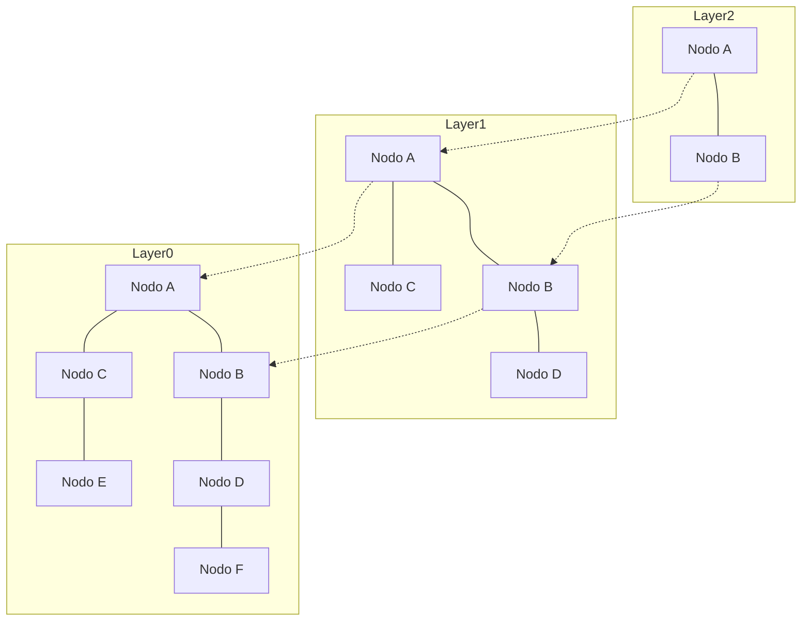

# Introducción: el auge de RAG y la importancia de las bases de datos vectoriales

En los últimos años, junto con el avance de los modelos de lenguaje grande (LLM, por sus siglas en inglés), una técnica conocida como Retrieval-Augmented Generation (RAG o Generación Aumentada por Recuperación) ha cobrado gran relevancia. RAG es un enfoque en el que no solo se utiliza el conocimiento previo del LLM, sino que también se recupera (Retrieval) información relevante desde una base de conocimiento externa y se incorpora al prompt para generar (Augmentation) la respuesta. Esto permite mitigar las alucinaciones (hallucinations) y ofrecer respuestas de alta precisión basadas en datos corporativos actualizados o conocimientos especializados.

Como base indispensable para RAG encontramos las «bases de datos vectoriales» (Vector Databases). Las bases de datos relacionales tradicionales y los motores de búsqueda de texto completo (como BM25) realizan búsquedas basadas en la coincidencia exacta de palabras clave o en su frecuencia. Sin embargo, esto dificulta encontrar textos que tengan «el mismo significado pero utilicen palabras diferentes». Las bases de datos vectoriales almacenan datos como vectores numéricos de alta dimensión y calculan la distancia (o similitud) dentro de un espacio vectorial, permitiendo realizar búsquedas basadas en la proximidad semántica (búsqueda semántica).

En este artículo, explicaremos de forma detallada y sistemática desde los fundamentos de las «representaciones incrustadas» (Embeddings), que constituyen la base de las bases de datos vectoriales, hasta el funcionamiento del algoritmo «HNSW» (Hierarchical Navigable Small World), que hace posible la búsqueda a alta velocidad.

## 1. ¿Qué son los embeddings vectoriales (Embeddings)?

### 1.1 Convertir el significado en números
En el procesamiento del lenguaje natural (PLN), los «embeddings» o representaciones incrustadas son una técnica que transforma datos como palabras, oraciones o imágenes en vectores continuos de longitud fija (arreglos de números reales). Por ejemplo, en un espacio vectorial de 300 o 1536 dimensiones, las palabras o textos con significados similares se ubican en posiciones cercanas dentro de dicho espacio.

- «Rey» - «Hombre» + «Mujer» = «Reina»

El hecho de que tales operaciones semánticas fueran posibles se popularizó con modelos tempranos de incrustación como Word2Vec. En la actualidad, se utilizan ampliamente modelos como `text-embedding-ada-002` o `text-embedding-3-small/large` de OpenAI, Embed de Cohere y modelos de código abierto basados en BERT (como Sentence-BERT).

### 1.2 Propiedades de los espacios de alta dimensionalidad
Los vectores generados por los modelos de embedding modernos son de dimensiones muy elevadas (por ejemplo, 768 o 1536 dimensiones). Cuanto mayor es el número de dimensiones, más rica es la capacidad de representación; sin embargo, el coste computacional aumenta y surge el fenómeno conocido como la «maldición de la dimensionalidad» (Curse of Dimensionality). En espacios de alta dimensión, las distancias entre cualesquiera dos puntos tienden a parecerse mucho entre sí, lo que reduce drásticamente la eficiencia de la búsqueda de vecinos más cercanos. Las bases de datos vectoriales abordan precisamente el reto de cómo gestionar estos datos de alta dimensión de manera eficiente.

## 2. Métodos de cálculo de similitud (Distance Metrics)

Para medir la «proximidad del significado» entre vectores, se emplean diversas funciones matemáticas de distancia (métricas). Es necesario seleccionar la métrica adecuada en función del objetivo de la búsqueda y de las características del modelo de embedding utilizado.

### 2.1 Similitud coseno (Cosine Similarity)
Mide la similitud utilizando el coseno del ángulo formado por dos vectores. Considera únicamente la «dirección» de los vectores e ignora su «magnitud (norma)». Su valor varía entre -1 (orientaciones opuestas) y 1 (exactamente la misma orientación). Es la métrica más comúnmente utilizada a la hora de medir la similitud semántica en textos.

### 2.2 Distancia euclidiana (Euclidean Distance / Distancia L2)
Es la distancia en línea recta entre dos puntos en el espacio vectorial. Un valor menor indica mayor similitud. Resulta adecuada en casos donde la relación posicional absoluta es relevante, como en la comparación de características de imágenes.

### 2.3 Producto escalar (Dot Product)
Es el valor que resulta de multiplicar los elementos correspondientes de dos vectores y sumarlos. Cuando los vectores están normalizados (su norma es igual a 1), el resultado del producto escalar coincide exactamente con la similitud coseno. Al requerir menos pasos de cómputo y poder procesarse a gran velocidad, es la opción preferida en muchos sistemas.

## 3. Limitaciones de la búsqueda exacta (Exact Search) y la ANN

La tarea de encontrar en una base de datos los vectores más similares a un vector de consulta (query) de entrada se conoce como «búsqueda de k vecinos más cercanos» (k-Nearest Neighbors; k-NN).

### 3.1 Problemas de la búsqueda exacta (k-NN)
El método más simple consiste en calcular la distancia entre el vector de consulta y cada uno de los vectores de la base de datos, ordenarlos por distancia ascendente y obtener los $k$ mejores resultados (Flat Search / Exact Search).
Sin embargo, la complejidad computacional de este enfoque es de $O(N \times D)$ (donde $N$ es el número de elementos y $D$ es el número de dimensiones). Cuando el volumen de datos alcanza millones o cientos de millones de registros, una sola búsqueda puede tardar desde varios segundos hasta decenas de minutos, lo que resulta inviable para aplicaciones en tiempo real (como chatbots o sistemas de recomendación).

### 3.2 Búsqueda aproximada de vecinos más cercanos (Approximate Nearest Neighbor; ANN)
Es aquí donde entran en juego los algoritmos de «búsqueda aproximada de vecinos más cercanos» (ANN), que sacrifican una pequeña fracción de precisión a cambio de un aumento drástico en la velocidad de búsqueda. La ANN adopta el enfoque de «no garantizar de forma absoluta el vecino más cercano, pero encontrar uno lo suficientemente cercano con una probabilidad muy alta».

Entre los algoritmos de ANN más representativos se encuentran los siguientes:
- **Basados en estructuras de árbol**: como KD-Tree o Annoy. Son efectivos en dimensiones bajas, pero en dimensiones altas se ven fuertemente afectados por la maldición de la dimensionalidad.
- **Basados en hashing**: como LSH (Locality-Sensitive Hashing). Utilizan funciones de hash diseñadas para que los vectores cercanos tengan una mayor probabilidad de generar el mismo valor hash.
- **Basados en cuantización**: como PQ (Product Quantization). Comprimen los vectores para reducir el uso de memoria y realizan cálculos de distancia aproximados de forma rápida.
- **Basados en grafos**: como HNSW (Hierarchical Navigable Small World). Actualmente se considera el algoritmo con el mejor equilibrio entre velocidad y precisión en la búsqueda vectorial, convirtiéndose en el estándar de facto.

## 4. Cómo funciona HNSW: la cúspide de la búsqueda basada en grafos

HNSW (Hierarchical Navigable Small World) es un algoritmo propuesto por Yu. A. Malkov y colaboradores, que combina la teoría de redes complejas con estructuras de datos eficientes. Como indica su nombre, se fundamenta en dos conceptos clave: las redes de «mundo pequeño» (Small World) y la «estructura jerárquica» (Hierarchical).

### 4.1 Grafos Navigable Small World (NSW)
El fenómeno del mundo pequeño (los seis grados de separación) se refiere a la propiedad en redes a gran escala (como las relaciones humanas o Internet) según la cual es posible conectar cualesquiera dos nodos a través de un número reducido de saltos intermedios.

NSW aplica esta propiedad a la búsqueda de vecinos cercanos en el espacio vectorial. Cada punto de datos actúa como un nodo del grafo, y los nodos que están cerca entre sí se conectan mediante aristas (edges). Al mismo tiempo, se mantiene una pequeña cantidad de «aristas de largo alcance» (long-range edges o enlaces a larga distancia) que conectan nodos distantes entre sí.

Durante la búsqueda, se comienza desde un nodo aleatorio y se repite la operación de «moverse hacia el nodo adyacente al actual que esté más cerca del vector de consulta» (Greedy Search o búsqueda voraz). Gracias a las aristas de largo alcance, es posible avanzar rápidamente a grandes zancadas a través del grafo y, una vez cerca del objetivo, ajustar la trayectoria con precisión mediante las aristas locales más cortas, logrando así una exploración muy eficiente.

### 4.2 Enfoque tipo Skip List mediante estructura jerárquica (Hierarchical)
El punto débil de NSW radicaba en que, al aumentar la cantidad de nodos, la cantidad de pasos necesarios incluso para los avances iniciales a «grandes zancadas» se incrementaba. Por ello, HNSW adoptó la idea de la estructura de datos conocida como «Skip List» (lista por saltos), dividiendo el grafo en múltiples capas (niveles o jerarquías).

- **Capa inferior (Layer 0)**: Grafo de vecindad denso que contiene todos los puntos de datos.
- **A medida que se sube a capas superiores**: El número de nodos se reduce exponencialmente y las conexiones entre aristas se vuelven más dispersas.

### 4.3 Algoritmo de búsqueda de HNSW (enrutamiento)
La búsqueda en HNSW comienza en la capa superior y procede de la siguiente manera:

1. **Punto de entrada**: La búsqueda comienza en un nodo inicial predeterminado de la capa superior.
2. **Búsqueda en cada capa**: En la capa actual, se realiza una búsqueda voraz (Greedy Search) para encontrar el nodo más cercano a la consulta (mínimo local).
3. **Descenso a la capa inferior**: Cuando ya no se encuentran nodos más cercanos en esa capa, se desciende al nivel inmediatamente inferior partiendo de dicho nodo.
4. **Búsqueda final en la capa inferior**: Este proceso se repite hasta alcanzar la capa más baja (Layer 0), y los $k$ nodos más cercanos obtenidos mediante Greedy Search en Layer 0 se devuelven como resultado final de la búsqueda.

Gracias a esta estructura jerárquica, en la fase inicial de la búsqueda se avanza a «grandes zancadas» en las capas superiores para delimitar con rapidez la zona cercana al objetivo y, a medida que se desciende hacia las capas inferiores, se aumenta progresivamente la resolución para realizar una exploración precisa. La complejidad computacional de la búsqueda pasa a ser de tiempo logarítmico, permitiendo tiempos de respuesta del orden de milisegundos incluso frente a cientos de millones de registros.

### 4.4 Construcción e hiperparámetros de HNSW
Al insertar nuevos datos en el grafo HNSW, de manera análoga a la búsqueda, se explora desde la capa superior hacia las inferiores, encontrando los nodos vecinos en cada capa y estableciendo aristas con ellos.
El rendimiento de HNSW está regulado por los siguientes hiperparámetros clave:

- **`M`**: Número máximo de aristas bidireccionales que puede tener un nodo. Un valor mayor incrementa la precisión, pero aumenta el consumo de memoria y reduce la velocidad tanto de construcción como de búsqueda.
- **`efConstruction`**: Tamaño de la lista de candidatos que se mantiene durante la construcción del grafo para evaluar los vecinos más cercanos. Cuanto mayor sea, mejor será la calidad (precisión) del grafo, pero requerirá más tiempo para indexar.
- **`efSearch`**: Tamaño de la lista de candidatos que se mantiene durante la búsqueda. Cuanto mayor sea, mayor será la precisión de búsqueda (recall), pero la velocidad de búsqueda disminuirá. Como puede ajustarse dinámicamente en el momento de la consulta, permite calibrar el compromiso entre precisión y latencia según los requisitos de la aplicación.

## 5. Implementaciones y ecosistema de bases de datos vectoriales

Actualmente existen numerosas soluciones de software que ofrecen capacidades de búsqueda vectorial, las cuales se clasifican principalmente en tres categorías: «bases de datos vectoriales dedicadas», «bibliotecas» y «extensiones de bases de datos existentes».

### 5.1 Bases de datos vectoriales dedicadas
Son bases de datos distribuidas diseñadas específicamente para la búsqueda vectorial. Ofrecen soporte nativo para escalabilidad, alta disponibilidad y búsqueda híbrida.
- **Pinecone**: Servicio SaaS totalmente gestionado. Es muy fácil de configurar y se utiliza ampliamente en el desarrollo de aplicaciones RAG.
- **Milvus**: Base de datos vectorial distribuida de código abierto. Posee una arquitectura nativa de la nube pensada para conjuntos de datos a gran escala.
- **Qdrant**: Base de datos vectorial de alta velocidad escrita en Rust. Destaca por sus potentes capacidades de filtrado avanzado mediante metadatos.
- **Weaviate**: Destaca por su capacidad para manejar simultáneamente vectores y relaciones estructurales de tipo grafo (esquemas) entre objetos de datos.

### 5.2 Bibliotecas de búsqueda aproximada de vecinos más cercanos
Son bibliotecas diseñadas para construir índices directamente en la memoria de la aplicación y realizar búsquedas de forma ligera.
- **Faiss**: Biblioteca en C++ desarrollada por el equipo de investigación de IA de Meta (anteriormente Facebook). Proporciona diversos algoritmos además de HNSW, como PQ (Product Quantization) o IVF (Inverted File), y ofrece soporte para búsquedas ultrarrápidas aceleradas por GPU.
- **Hnswlib**: Implementación en C++ ligera y rápida del algoritmo HNSW. Presenta una configuración sencilla y resulta idónea para proyectos de pequeña a mediana escala que operan en memoria.

### 5.3 Extensiones vectoriales para bases de datos existentes
Es un enfoque que incorpora funcionalidades de búsqueda vectorial a motores de búsqueda o bases de datos relacionales ya existentes.
- **pgvector**: Módulo de extensión para PostgreSQL. Permite expresar directamente en consultas SQL el cálculo de distancias vectoriales y búsquedas aceleradas mediante HNSW, facilitando filtros y uniones (JOINs) entre datos relacionales y vectores.
- **Elasticsearch / OpenSearch**: A sus consolidados motores de búsqueda de texto completo se les han integrado capacidades de ANN para vectores de alta dimensión. Son herramientas extremadamente potentes para la «búsqueda híbrida», combinando búsqueda léxica y búsqueda semántica.

## 6. Técnicas avanzadas de búsqueda: filtrado por metadatos y búsqueda híbrida

En las aplicaciones del mundo real, no basta con buscar por «proximidad de significado» vectorial, sino que a menudo es indispensable realizar filtrados basados en la lógica de negocio.

### 6.1 El dilema entre la búsqueda vectorial y el filtrado
Combinar el filtrado por metadatos con la búsqueda ANN representa un reto técnico considerable.
- **Post-filtering (filtrado posterior)**: Primero se obtienen los resultados principales mediante búsqueda vectorial y luego se filtran por metadatos. Sin embargo, si las condiciones del filtro son demasiado estrictas, existe el riesgo de que el resultado final quede totalmente vacío.
- **Pre-filtering (filtrado previo)**: Primero se reducen los datos mediante metadatos y luego se ejecuta la búsqueda vectorial sobre ese subconjunto. No obstante, dado que las estructuras de grafo como HNSW están optimizadas globalmente, invalidar ciertos nodos puede fragmentar la conectividad y bloquear la exploración.

Las bases de datos vectoriales modernas abordan este problema implementando «Custom HNSW» u optimizadores de consultas avanzados, alternando de manera dinámica entre filtrado y exploración vectorial según las condiciones de la consulta.

### 6.2 El verdadero valor de la búsqueda híbrida
Si bien la búsqueda vectorial sobresale a la hora de captar el «significado conceptual», puede tener dificultades para buscar «nombres propios» o «números de modelo específicos». Por esta razón, ejecutar simultáneamente búsquedas tradicionales de texto completo basadas en palabras clave (como BM25) y búsquedas vectoriales, fusionando las puntuaciones de ambas para obtener el resultado final («búsqueda híbrida»), se está convirtiendo en la mejor práctica para sistemas RAG empresariales.

## Conclusión

Las bases de datos vectoriales y el algoritmo HNSW constituyen una infraestructura tecnológica fundamental en las aplicaciones de la era de la IA generativa, especialmente en los sistemas RAG. Al proyectar el significado de textos e imágenes en coordenadas dentro de un espacio multidimensional y aprovechar la estructura de grafo jerárquica de HNSW, es posible extraer de forma casi instantánea la información «semánticamente más cercana», incluso entre cientos de millones de registros.

El cambio de paradigma desde las tecnologías de búsqueda tradicionales, dependientes de coincidencias exactas, hacia una «búsqueda semántica» más afín a la cognición humana ya ha comenzado. Comprender los conceptos de distancia vectorial, la necesidad de ANN, la estructura interna de HNSW y las diversas opciones de bases de datos explicadas en este artículo permitirá el diseño y desarrollo de aplicaciones de IA mucho más avanzadas y prácticas.
