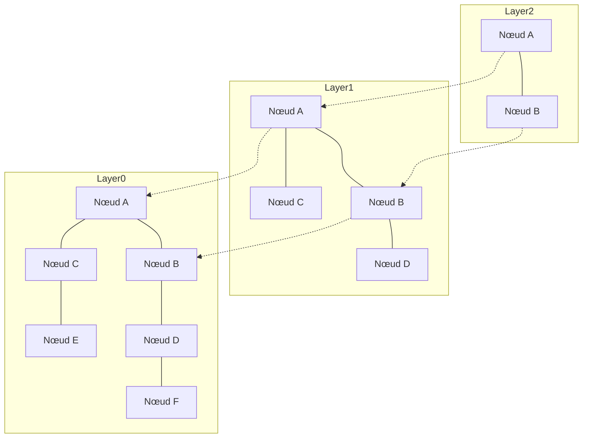

# Introduction : L'essor du RAG et l'importance des bases de données vectorielles

Ces dernières années, avec les progrès des grands modèles de langage (LLM), une approche appelée Retrieval-Augmented Generation (RAG) suscite un vif intérêt. Le RAG est une méthode qui ne repose pas uniquement sur les connaissances préalables du LLM : elle consiste à rechercher (Retrieval) des informations pertinentes au sein d'une base de connaissances externe, puis à les injecter dans l'invite (prompt) pour générer (Augmentation) la réponse. Cette approche permet d'atténuer les hallucinations tout en fournissant des réponses hautement précises fondées sur les données internes les plus récentes ou sur des connaissances spécialisées.

Au cœur de l'infrastructure du RAG, les « bases de données vectorielles » (Vector Databases) sont devenues indispensables. Les bases de données relationnelles traditionnelles et les moteurs de recherche plein texte (comme BM25) effectuent leurs recherches à partir de correspondances exactes de mots-clés ou de leur fréquence. Cependant, cette méthode peine à identifier des passages « dont le sens est identique mais qui emploient des termes différents ». Une base de données vectorielle enregistre les données sous la forme de vecteurs numériques à haute dimension et calcule leur distance (similarité) dans l'espace vectoriel, rendant ainsi possible une recherche basée sur la proximité sémantique (recherche sémantique).

Dans cet article, nous explorerons de manière détaillée et méthodique les bases des représentations vectorielles (« plongements » ou *embeddings*), fondement même des bases de données vectorielles, jusqu'au fonctionnement de l'algorithme HNSW (*Hierarchical Navigable Small World*), qui rend possible une recherche ultra-rapide.

## 1. Qu'est-ce que le plongement vectoriel (Embeddings) ?

### 1.1 Convertir le sens en valeurs numériques
Dans le traitement du langage naturel (NLP), les « plongements » (*embeddings*) désignent une technique permettant de convertir des données telles que des mots, des phrases ou des images en un vecteur continu de longueur fixe (un tableau de nombres réels). Par exemple, dans un espace vectoriel de 300 ou 1 536 dimensions, les mots ou phrases ayant un sens similaire sont positionnés à proximité les uns des autres dans cet espace.

- « Roi » - « Homme » + « Femme » = « Reine »

La possibilité d'effectuer de telles opérations arithmétiques sur le sens a été popularisée par les premiers modèles de plongement comme Word2Vec. Aujourd'hui, des modèles tels que `text-embedding-ada-002` ou `text-embedding-3-small/large` d'OpenAI, Embed de Cohere, ainsi que des modèles open source basés sur BERT (comme Sentence-BERT) sont massivement adoptés.

### 1.2 Les propriétés des espaces à haute dimension
Les vecteurs générés par les modèles de plongement modernes possèdent un très grand nombre de dimensions (par exemple 768 ou 1 536 dimensions). Si l'augmentation du nombre de dimensions enrichit l'expressivité de la représentation, elle accroît également le coût de calcul et engendre le phénomène appelé « fléau de la dimension » (*Curse of Dimensionality*). Dans un espace à haute dimension, les distances entre deux points arbitraires tendent à devenir presque uniformes, ce qui dégrade considérablement l'efficacité de la recherche des plus proches voisins. Les bases de données vectorielles ont précisément été conçues pour relever le défi du traitement performant de ces données à haute dimension.

## 2. Méthodes de calcul de similarité (Distance Metrics)

Pour évaluer la « proximité sémantique » entre deux vecteurs, plusieurs fonctions de distance mathématiques (métriques) sont employées. Il convient de choisir la métrique adéquate en fonction de l'objectif de recherche et des caractéristiques du modèle d'embedding utilisé.

### 2.1 Similarité cosinus (Cosine Similarity)
Elle mesure la similarité par le cosinus de l'angle formé par deux vecteurs. Elle ne prend en compte que la « direction » du vecteur, en ignorant sa « norme » (longueur). Les valeurs sont comprises entre -1 (directions opposées) et 1 (orientations strictement identiques). C'est la métrique la plus couramment utilisée pour évaluer la similarité sémantique de textes.

### 2.2 Distance euclidienne (Euclidean Distance / Distance L2)
Il s'agit de la distance en ligne droite séparant deux points dans l'espace vectoriel. Plus la valeur est faible, plus les points sont similaires. Elle est particulièrement adaptée aux cas où la position absolue importe, comme la comparaison de caractéristiques visuelles d'images.

### 2.3 Produit scalaire (Dot Product)
Il correspond à la somme des produits des composantes respectives de deux vecteurs. Lorsque les vecteurs sont normalisés (leur norme est égale à 1), le produit scalaire est rigoureusement équivalent à la similarité cosinus. Moins exigeant en opérations de calcul et donc plus rapide, il est privilégié dans de nombreux systèmes.

## 3. Limites de la recherche exacte (Exact Search) et ANN

La tâche consistant à identifier dans la base de données les vecteurs les plus similaires à un vecteur requête donné est appelée « recherche des k plus proches voisins » (*k-Nearest Neighbors* ou *k-NN*).

### 3.1 Les limites de la recherche exacte (k-NN)
La méthode la plus simple consiste à calculer la distance entre le vecteur requête et l'ensemble des vecteurs de la base de données, puis à les trier par distance croissante pour extraire les k premiers éléments (*Flat Search* ou *Exact Search*).
Toutefois, la complexité algorithmique de cette approche s'élève à $O(N \times D)$ (où $N$ représente le nombre d'éléments et $D$ le nombre de dimensions). Lorsque le volume de données atteint des millions ou des centaines de millions d'entrées, chaque requête nécessite de quelques secondes à plusieurs dizaines de minutes, ce qui la rend totalement impraticable pour des applications en temps réel (agents conversationnels, systèmes de recommandation, etc.).

### 3.2 La recherche approximative des plus proches voisins (Approximate Nearest Neighbor - ANN)
C'est ici qu'interviennent les algorithmes de « recherche approximative des plus proches voisins » (*Approximate Nearest Neighbor* ou *ANN*), qui sacrifient une infime part de précision au profit d'une accélération spectaculaire de la vitesse de recherche. L'ANN repose sur le compromis suivant : « sans garantir de manière absolue l'exactitude du plus proche voisin, identifier avec une très forte probabilité des éléments suffisamment proches ».

Les principaux types d'algorithmes ANN sont les suivants :
- **Basés sur des structures en arbre** : KD-Tree, Annoy, etc. Efficaces pour des dimensions faibles, mais fortement pénalisés par le fléau de la dimension à haute dimension.
- **Basés sur le hachage** : LSH (*Locality-Sensitive Hashing*). Ils utilisent des fonctions de hachage probabilistes où des vecteurs proches ont une forte probabilité de produire la même valeur de hachage.
- **Basés sur la quantification** : PQ (*Product Quantization*). Ils compressent les vecteurs pour réduire l'empreinte mémoire et accélérer le calcul approché des distances.
- **Basés sur des graphes** : HNSW (*Hierarchical Navigable Small World*). Considéré aujourd'hui comme offrant le meilleur équilibre entre rapidité et précision dans la recherche vectorielle, il s'est imposé comme le standard de fait.

## 4. Fonctionnement de HNSW : Le sommet de la recherche basée sur les graphes

HNSW (*Hierarchical Navigable Small World*) est un algorithme proposé par Yu. A. Malkov et al., combinant la théorie des réseaux complexes et des structures de données avancées. Comme son nom l'indique, il repose sur deux concepts fondamentaux : les réseaux « petit monde » (*Small World*) et une organisation « hiérarchique » (*Hierarchical*).

### 4.1 Le graphe Navigable Small World (NSW)
Le phénomène du « petit monde » (les six degrés de séparation) est une propriété des vastes réseaux réels (relations humaines, Internet, etc.) selon laquelle deux nœuds quelconques peuvent être reliés en un nombre restreint d'étapes (ou sauts).
Le graphe NSW transpose cette propriété à la recherche de voisins dans l'espace vectoriel. Chaque point de données devient un nœud du graphe, et les nœuds proches les uns des autres sont reliés par des arêtes. Parallèlement, un petit nombre d'arêtes à longue portée (*long-range edges*) relie des nœuds distants.

Lors d'une requête, la recherche part d'un nœud initial puis répète l'opération suivante : « se déplacer vers le nœud voisin le plus proche du vecteur requête » (recherche gloutonne ou *Greedy Search*). Grâce aux arêtes à longue portée, il est possible de traverser rapidement le graphe par de « grands pas », avant d'affiner la trajectoire via les arêtes locales au fur et à mesure que l'on s'approche de la cible.

### 4.2 L'approche hiérarchique inspirée des Skip Lists
La faiblesse du NSW résidait dans le fait que, lorsque le nombre de nœuds augmente, même ces « grands pas » initiaux finissent par exiger un nombre d'étapes trop important. HNSW a donc emprunté le concept de la structure de données « Skip List » (liste à sauts) en subdivisant le graphe en plusieurs couches (niveaux hiérarchiques).

- **Couche inférieure (Layer 0)** : graphe de voisinage dense contenant la totalité des points de données.
- **Plus on monte dans les couches supérieures** : les nœuds sont élagués de façon exponentielle et le maillage des arêtes devient clairsemé.

### 4.3 Algorithme de recherche HNSW (Routage)
Dans HNSW, le routage de recherche s'amorce depuis la couche supérieure et progresse comme suit :

1. **Point d'entrée** : la recherche démarre à partir d'un nœud d'entrée prédéterminé au sommet de la hiérarchie.
2. **Exploration à chaque niveau** : sur la couche actuelle, une recherche gloutonne (*Greedy Search*) est exécutée pour trouver le nœud le plus proche de la requête (minimum local).
3. **Descente vers la couche inférieure** : lorsqu'aucun voisin plus proche n'est accessible sur cette couche, l'algorithme descend d'un niveau en conservant ce nœud comme point de départ.
4. **Recherche finale sur la couche 0** : ce processus est répété jusqu'à la couche de base (Layer 0). La recherche gloutonne sur Layer 0 renvoie alors les $k$ nœuds les plus proches en guise de résultat final.

Grâce à cette structure hiérarchique, les premières étapes de la recherche franchissent de grandes distances sur les couches supérieures pour localiser rapidement la région cible, puis la résolution s'affine progressivement en descendant dans les couches inférieures. La complexité de recherche est logarithmique, permettant des temps de réponse de l'ordre de la milliseconde même sur des centaines de millions d'enregistrements.

### 4.4 Construction de HNSW et hyperparamètres
Lors de l'insertion d'un nouvel élément dans le graphe HNSW, la procédure est similaire à une recherche : on explore de la couche supérieure vers le bas, identifiant les voisins les plus proches à chaque niveau pour créer de nouvelles arêtes.
Les performances de HNSW sont régies par les hyperparamètres clés suivants :

- **`M`** : nombre maximal d'arêtes bidirectionnelles qu'un nœud peut posséder. Une valeur plus élevée améliore le rappel (précision), mais augmente la consommation mémoire et ralentit la vitesse d'indexation et de recherche.
- **`efConstruction`** : taille de la liste des candidats retenus lors de la construction du graphe. Plus cette valeur est grande, meilleure est la qualité (précision) du graphe, mais plus le temps d'indexation s'allonge.
- **`efSearch`** : taille de la liste des candidats conservés lors de la recherche. Une valeur plus élevée augmente le taux de rappel (*Recall*), mais réduit la vitesse d'exécution. Ce paramètre pouvant être ajusté dynamiquement à la requête, il permet d'arbitrer précisément le compromis entre précision et latence selon les besoins de l'application.

## 5. Implémentations et écosystème des bases de données vectorielles

De nos jours, de nombreuses solutions logicielles proposent des fonctionnalités de recherche vectorielle. Elles se répartissent principalement en trois catégories : les bases de données vectorielles dédiées, les bibliothèques et les extensions pour bases de données existantes.

### 5.1 Bases de données vectorielles dédiées
Ce sont des bases de données distribuées conçues spécifiquement pour la recherche vectorielle. Elles intègrent nativement la scalabilité horizontale, la haute disponibilité et la recherche hybride.
- **Pinecone** : service SaaS entièrement managé. Très facile à déployer, il est largement utilisé dans le développement d'applications RAG.
- **Milvus** : base de données vectorielle distribuée open source. Dotée d'une architecture native pour le cloud, elle est adaptée aux volumétries massives.
- **Qdrant** : base de données vectorielle ultra-rapide écrite en Rust. Elle se distingue par ses fonctionnalités avancées de filtrage sur les métadonnées.
- **Weaviate** : solution capable de gérer simultanément les vecteurs et les relations de type graphe (schémas) entre les objets de données.

### 5.2 Bibliothèques de recherche approximative des plus proches voisins (ANN)
Ces bibliothèques construisent les index directement dans la mémoire de l'application afin d'assurer des recherches ultra-légères et performantes.
- **Faiss** : bibliothèque C++ développée par l'équipe Meta AI Research (anciennement Facebook). Outre HNSW, elle propose une vaste palette d'algorithmes comme PQ (*Product Quantization*) ou IVF (*Inverted File*), et prend en charge l'accélération matérielle par GPU.
- **Hnswlib** : implémentation C++ légère et performante de l'algorithme HNSW. Simple de configuration, elle est parfaitement adaptée aux projets de petite à moyenne échelle fonctionnant en mémoire vive.

### 5.3 Extensions vectorielles pour bases de données existantes
Cette approche consiste à greffer des fonctionnalités de recherche vectorielle sur des moteurs de recherche ou des bases de données relationnelles préexistants.
- **pgvector** : module d'extension pour PostgreSQL. Il permet d'effectuer directement des calculs de distance vectorielle et des indexations HNSW au sein de requêtes SQL classiques, facilitant les jointures et filtrages conjoints avec les données relationnelles.
- **Elasticsearch / OpenSearch** : ces moteurs de recherche plein texte renommés ont intégré des fonctionnalités ANN pour vecteurs à haute dimension. Ils constituent des solutions puissantes pour la « recherche hybride », combinant recherche lexicale et recherche sémantique.

## 6. Techniques de recherche avancées : Filtrage par métadonnées et recherche hybride

Dans les applications réelles, la simple « proximité sémantique » vectorielle ne suffit généralement pas : il est souvent indispensable d'appliquer des filtres basés sur la logique métier.

### 6.1 Le dilemme entre recherche vectorielle et filtrage
La combinaison du filtrage par métadonnées et de la recherche ANN soulève d'importantes difficultés techniques.
- **Post-filtrage (Post-filtering)** : on exécute d'abord la recherche vectorielle pour extraire les meilleurs candidats, puis on applique le filtre de métadonnées. Toutefois, si les critères de filtrage sont stricts, on risque de n'obtenir aucun résultat final.
- **Pré-filtrage (Pre-filtering)** : on filtre d'abord les données selon les métadonnées, puis on effectue la recherche vectorielle sur ce sous-ensemble. Néanmoins, une structure de graphe comme HNSW étant globalement interconnectée, désactiver arbitrairement certains nœuds peut rompre la connectivité et bloquer l'exploration.

Pour contourner cet écueil, les bases de données vectorielles modernes mettent en œuvre des variantes personnalisées de HNSW (« Custom HNSW ») ainsi que des optimiseurs de requêtes sophistiqués capables d'adapter dynamiquement la stratégie de filtrage et de navigation.

### 6.2 La valeur ajoutée de la recherche hybride
Si la recherche vectorielle excelle dans la capture du « sens conceptuel », elle peut s'avérer moins performante pour retrouver des « noms propres » ou des « références produit précises ». C'est pourquoi la « recherche hybride » — combinant recherche plein texte traditionnelle par mots-clés (BM25, etc.) et recherche vectorielle en fusionnant leurs scores respectifs — s'impose aujourd'hui comme une bonne pratique incontournable dans les architectures RAG d'entreprise.

## Conclusion

Les bases de données vectorielles et l'algorithme HNSW constituent le socle technologique fondamental des applications à l'ère de l'IA générative, et en particulier des architectures RAG. En projetant le sens des textes et des images sous forme de coordonnées dans un espace multidimensionnel, et en s'appuyant sur la structure hiérarchique en graphes de HNSW, il devient possible d'extraire instantanément l'information « sémantiquement la plus proche », même parmi des centaines de millions d'éléments.

Le passage d'une recherche traditionnelle dépendante de la correspondance exacte à une « recherche sémantique » plus proche de la cognition humaine est déjà une réalité. La maîtrise des concepts présentés dans cet article — des métriques de distance vectorielle et de la nécessité de l'ANN jusqu'aux rouages internes de HNSW et aux diverses solutions de bases de données — vous donnera les clés pour concevoir et déployer des applications d'IA toujours plus avancées et performantes.
