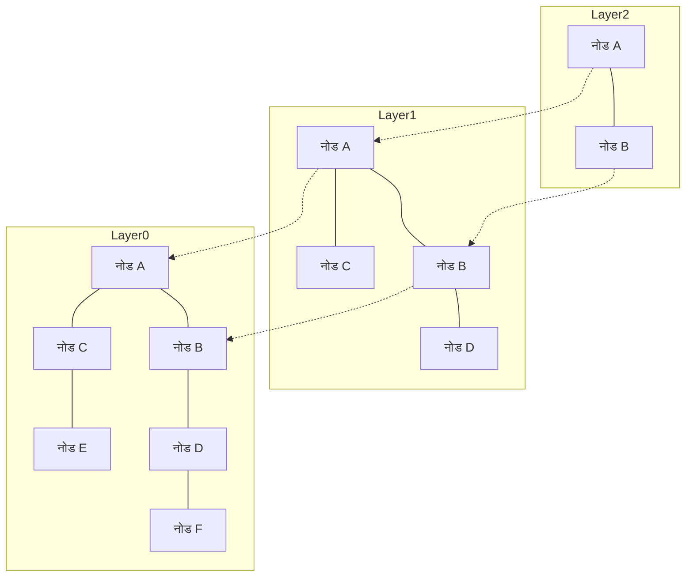

# परिचय: RAG का उभार और वेक्टर डेटाबेस का महत्व

हाल के वर्षों में, लार्ज लैंग्वेज मॉडल्स (LLM) के विकास के साथ, Retrieval-Augmented Generation (RAG) नामक तकनीक ने अत्यधिक ध्यान आकर्षित किया है। RAG एक ऐसा दृष्टिकोण है जिसमें LLM केवल अपने पूर्व-प्रशिक्षित ज्ञान पर निर्भर रहने के बजाय, किसी बाहरी नॉलेज बेस से प्रासंगिक जानकारी खोजता (Retrieval) है और उस जानकारी को प्रॉम्प्ट में शामिल करके सटीक उत्तर उत्पन्न (Augmentation) करता है। इससे हैल्युसिनेशन (काल्पनिक या भ्रामक उत्तर) को कम किया जा सकता है और नवीनतम आंतरिक डेटा या विशिष्ट डोमेन ज्ञान पर आधारित अत्यधिक सटीक उत्तर प्राप्त किए जा सकते हैं।

इस RAG आर्किटेक्चर के एक अनिवार्य आधार के रूप में "वेक्टर डेटाबेस (Vector Database)" सामने आता है। पारंपरिक रिलेशनल डेटाबेस या फ़ुल-टेक्स्ट सर्च इंजन (जैसे BM25) कीवर्ड्स के सटीक मिलान (Exact Match) या उनकी आवृत्ति (Frequency) के आधार पर खोज करते हैं। हालांकि, इस पद्धति से ऐसे वाक्यों को खोजना बेहद कठिन होता है जिनका "अर्थ तो समान है लेकिन उनमें उपयोग किए गए शब्द भिन्न हैं"। वेक्टर डेटाबेस डेटा को उच्च-आयामी संख्यात्मक वैक्टर (High-dimensional Numerical Vectors) के रूप में संग्रहीत करता है और वेक्टर स्पेस में उनके बीच की दूरी (समानता) की गणना करके अर्थ संबंधी निकटता के आधार पर खोज (सिमेंटिक सर्च / Semantic Search) को संभव बनाता है।

इस लेख में, हम वेक्टर डेटाबेस के मूल आधार "एम्बेडिंग्स (Embeddings)" की बुनियादी बातों से लेकर अत्यधिक तेज़ खोज को सक्षम बनाने वाले एल्गोरिदम "HNSW (Hierarchical Navigable Small World)" की कार्यप्रणाली तक, विस्तृत और व्यवस्थित रूप से चर्चा करेंगे।

## 1. वेक्टर एम्बेडिंग्स (Embeddings) क्या हैं

### 1.1 अर्थ को संख्याओं में बदलना
नेचुरल लैंग्वेज प्रोसेसिंग (NLP) में "एम्बेडिंग्स (Embeddings)" का तात्पर्य शब्दों, वाक्यों या छवियों जैसे डेटा को एक निश्चित लंबाई वाले निरंतर संख्यात्मक वेक्टर (वास्तविक संख्याओं की ऐरे / Array of Real Numbers) में बदलने की तकनीक से है। उदाहरण के लिए, 300-आयामी या 1536-आयामी वेक्टर स्पेस में, जिन शब्दों या वाक्यों का अर्थ समान होता है, वे उस स्पेस में एक-दूसरे के निकट स्थित होते हैं।

- "राजा" - "पुरुष" + "महिला" = "रानी"

इस प्रकार की सिमेंटिक अंकगणितीय गणनाओं का संभव होना Word2Vec जैसे शुरुआती एम्बेडिंग मॉडल्स के माध्यम से व्यापक रूप से जाना गया। आज के समय में, OpenAI का `text-embedding-ada-002` और `text-embedding-3-small/large`, Cohere का Embed, और ओपन-सोर्स BERT-आधारित मॉडल (जैसे Sentence-BERT) व्यापक रूप से उपयोग किए जा रहे हैं।

### 1.2 उच्च-आयामी स्पेस की विशेषताएं
आधुनिक एम्बेडिंग मॉडल द्वारा जनरेट किए गए वैक्टर अत्यधिक उच्च-आयामी (जैसे 768-आयाम, 1536-आयाम आदि) होते हैं। जैसे-जैसे आयामों की संख्या बढ़ती है, उनकी अभिव्यंजक क्षमता (Expressiveness) तो समृद्ध होती है, लेकिन कम्प्यूटेशनल लागत भी अत्यधिक बढ़ जाती है और "कर्स ऑफ डायमेंशनैलिटी (Curse of Dimensionality)" नामक समस्या उत्पन्न होती है। उच्च-आयामी स्पेस में किन्हीं भी दो बिंदुओं के बीच की दूरी लगभग एक जैसी लगने लगती है, जिससे निकटतम पड़ोसी खोज (Nearest Neighbor Search) की दक्षता में भारी गिरावट आती है। वेक्टर डेटाबेस मुख्य रूप से इसी चुनौती का समाधान करते हैं कि इस उच्च-आयामी डेटा को कुशलतापूर्वक कैसे प्रबंधित और प्रोसेस किया जाए।

## 2. समानता की गणना के तरीके (Distance Metrics)

वैक्टरों के बीच "अर्थ की निकटता" को मापने के लिए कई गणितीय दूरी फलनों (डिस्टेंस मेट्रिक्स) का उपयोग किया जाता है। खोज के उद्देश्य और उपयोग किए जाने वाले एम्बेडिंग मॉडल की विशेषताओं के आधार पर सही मेट्रिक का चयन करना आवश्यक होता है।

### 2.1 कोसाइन समानता (Cosine Similarity)
यह दो वैक्टरों के बीच बनने वाले कोण के कोसाइन (Cosine) का उपयोग करके उनकी समानता को मापता है। यह केवल वैक्टर की "दिशा (Direction)" पर विचार करता है और उसके "परिमाण (Magnitude / Norm)" को नज़रअंदाज़ करता है। इसका मान -1 (बिल्कुल विपरीत दिशा) से लेकर 1 (पूरी तरह से समान दिशा) के बीच होता है। टेक्स्ट की सिमेंटिक समानता को मापने के लिए यह सबसे व्यापक रूप से उपयोग किया जाने वाला मेट्रिक है।

### 2.2 यूक्लिडियन दूरी (Euclidean Distance / L2 Distance)
यह वेक्टर स्पेस में दो बिंदुओं के बीच की सीधी रेखा की दूरी है। मान जितना कम होगा, वे बिंदु उतने ही समान माने जाते हैं। यह छवि विशेषताओं (Image Feature Embeddings) की तुलना करने जैसे मामलों के लिए उपयुक्त है, जहां निरपेक्ष स्थानिक स्थिति (Absolute Position) महत्वपूर्ण होती है।

### 2.3 डॉट प्रोडक्ट (Dot Product)
यह दो वैक्टरों के संगत तत्वों (Components) को गुणा करके उन्हें जोड़ने पर प्राप्त मान है। यदि वैक्टर सामान्यीकृत (Normalized - जिनका नॉर्म 1 हो) हैं, तो डॉट प्रोडक्ट की गणना का परिणाम पूरी तरह से कोसाइन समानता के समान होता है। चूँकि इसमें कम्प्यूटेशनल स्टेप्स कम होते हैं और गणना तेज़ी से होती है, इसलिए कई प्रणालियों में इसे प्राथमिकता दी जाती है।

## 3. पूर्ण खोज (Exact Search) की सीमाएं और ANN

क्वेरी के रूप में दिए गए इनपुट वेक्टर के सबसे समान वैक्टरों को डेटाबेस से खोजने के कार्य को "k-निकटतम पड़ोसी खोज (k-Nearest Neighbors; k-NN)" कहा जाता है।

### 3.1 पूर्ण खोज (k-NN) की समस्याएं
सबसे सरल तरीका यह है कि डेटाबेस के प्रत्येक वेक्टर और क्वेरी वेक्टर के बीच की दूरी की गणना की जाए, उन्हें निकटता के क्रम में सॉर्ट किया जाए और शीर्ष k परिणाम प्राप्त किए जाएं (Flat Search / Exact Search)।
हालाँकि, इस दृष्टिकोण की कम्प्यूटेशनल जटिलता $O(N \times D)$ होती है (जहाँ N डेटा बिंदुओं की संख्या है और D आयामों की संख्या है)। जब डेटा की संख्या लाखों या करोड़ों में पहुँच जाती है, तो एक ही खोज में कई सेकंड या मिनट लग सकते हैं, जिससे यह रीयल-टाइम अनुप्रयोगों (जैसे चैटबॉट्स या अनुशंसा प्रणालियों) के लिए पूरी तरह से अनुपयोगी हो जाता है।

### 3.2 सन्निकट निकटतम पड़ोसी खोज (Approximate Nearest Neighbor; ANN)
यहीं पर "सन्निकट निकटतम पड़ोसी खोज (Approximate Nearest Neighbor; ANN)" एल्गोरिदम काम में आते हैं, जो सटीकता में थोड़ा सा समझौता करके खोज की गति को नाटकीय रूप से बढ़ा देते हैं। ANN एक ऐसा दृष्टिकोण अपनाता है जिसमें "यह 100% गारंटी नहीं होती कि परिणाम बिल्कुल निकटतम ही होगा, लेकिन अत्यधिक उच्च संभावना के साथ पर्याप्त रूप से निकटतम परिणाम तुरंत मिल जाता है।"

प्रमुख ANN एल्गोरिदम में निम्नलिखित प्रकार शामिल हैं:
- **ट्री-आधारित**: KD-Tree और Annoy आदि। कम आयामों में यह प्रभावी होते हैं, लेकिन उच्च आयामों में इन पर कर्स ऑफ डायमेंशनैलिटी का भारी प्रभाव पड़ता है।
- **हैश-आधारित**: LSH (Locality-Sensitive Hashing)। इसमें ऐसे हैश फ़ंक्शन का उपयोग किया जाता है जहाँ निकटवर्ती वैक्टरों का हैश मान समान होने की संभावना अधिक होती है।
- **क्वांटाइजेशन-आधारित**: PQ (Product Quantization)। यह मेमोरी उपयोग को कम करने के लिए वैक्टरों को कंप्रेस करता है और अनुमानित दूरी की त्वरित गणना करता है।
- **ग्राफ़-आधारित**: HNSW (Hierarchical Navigable Small World)। वर्तमान वेक्टर खोज में, इसे गति और सटीकता का सबसे बेहतरीन संतुलन माना जाता है और यह एक मानक (De-facto Standard) बन चुका है।

## 4. HNSW की कार्यप्रणाली: ग्राफ़-आधारित खोज का शिखर

HNSW (Hierarchical Navigable Small World) यू. ए. मालकोव (Yu. A. Malkov) और उनकी टीम द्वारा प्रस्तावित एक एल्गोरिदम है, जो जटिल नेटवर्क सिद्धांत और डेटा संरचनाओं को एक साथ जोड़ता है। जैसा कि इसके नाम से स्पष्ट है, यह दो मुख्य अवधारणाओं पर आधारित है: "स्मॉल वर्ल्ड (Small World)" नेटवर्क और "पदानुक्रमित संरचना (Hierarchical)"।

### 4.1 नेविगेबल स्मॉल वर्ल्ड (NSW) ग्राफ़
स्मॉल वर्ल्ड फेनोमेनन (सिक्स डिग्रीज़ ऑफ़ सेपरेशन) दुनिया के विशाल नेटवर्कों (जैसे मानव संबंध या इंटरनेट) की वह विशेषता है जिसमें केवल कुछ ही चरणों (मध्यस्थों) के माध्यम से किन्हीं भी दो नोड्स के बीच पहुँचा जा सकता है।
NSW इसी विशेषता को वेक्टर स्पेस में निकटतम पड़ोसी खोज पर लागू करता है। प्रत्येक डेटा बिंदु को ग्राफ़ का एक नोड माना जाता है, और एक-दूसरे के निकट स्थित नोड्स को किनारों (Edges) द्वारा जोड़ा जाता है। साथ ही, दूर स्थित नोड्स को जोड़ने वाले कुछ "लॉन्ग-रेंज एजेस (लंबी दूरी के लिंक)" भी बनाए रखे जाते हैं।

खोज के दौरान, एक यादृच्छिक (Random) नोड से शुरुआत की जाती है और "वर्तमान नोड के पड़ोसी नोड्स में से क्वेरी वेक्टर के सबसे निकटतम नोड" की ओर बढ़ने की प्रक्रिया को दोहराया जाता है (Greedy Search)। लॉन्ग-रेंज एजेस की बदौलत, ग्राफ़ में तेज़ी से लंबी छलांगें लगाकर लक्षित क्षेत्र के निकट पहुँचा जा सकता है, और लक्ष्य के करीब पहुँचने पर छोटे एजेस के ज़रिए सूक्ष्म समायोजन करते हुए कुशल खोज संभव होती है।

### 4.2 पदानुक्रमित संरचना (Hierarchical) द्वारा स्किप लिस्ट जैसा दृष्टिकोण
NSW की कमी यह थी कि जैसे-जैसे नोड्स की संख्या बढ़ती थी, शुरुआती "लंबी छलांगों" में भी चरणों की संख्या बढ़ जाती थी। इसलिए HNSW ने डेटा संरचना के "स्किप लिस्ट (Skip List)" के विचार को अपनाया और ग्राफ़ को कई परतों (Layers / स्तरों) में विभाजित किया।

- **सबसे निचली परत (Layer 0)**: एक सघन (Dense) निकटतम पड़ोसी ग्राफ़ जिसमें सभी डेटा बिंदु शामिल होते हैं।
- **जैसे-जैसे ऊपरी परतों में जाते हैं**: नोड्स की संख्या चरघातांकी रूप से कम होती जाती है, और एजेस के जुड़ाव भी विरल हो जाते हैं।

### 4.3 HNSW का खोज एल्गोरिदम (रूटिंग)
HNSW में खोज उच्चतम परत से शुरू होती है और इस प्रकार आगे बढ़ती है:

1. **एंट्री पॉइंट**: खोज की शुरुआत उच्चतम परत के पूर्वनिर्धारित प्रारंभिक नोड से होती है।
2. **प्रत्येक परत में खोज**: वर्तमान परत में Greedy Search की जाती है और क्वेरी के सबसे निकटतम नोड (लोकल मिनिमम) को खोजा जाता है।
3. **निचली परत में उतरना**: जब उस परत में कोई और निकटतम नोड नहीं मिलता, तो उसी नोड से एक स्तर नीचे की परत में उतरा जाता है।
4. **सबसे निचली परत में अंतिम खोज**: इस प्रक्रिया को सबसे निचली परत (Layer 0) तक दोहराया जाता है, और Layer 0 में Greedy Search द्वारा प्राप्त शीर्ष k नोड्स को अंतिम खोज परिणाम के रूप में वापस किया जाता है।

इस पदानुक्रमित संरचना के कारण, खोज के शुरुआती चरणों में ऊपरी परतों पर "लंबी छलांगें" लगाकर लक्षित क्षेत्र की पहचान तेज़ी से की जाती है, और जैसे-जैसे निचली परतों की ओर बढ़ते हैं, रिज़ॉल्यूशन को बढ़ाते हुए सटीक खोज की जाती है। खोज की कम्प्यूटेशनल जटिलता लॉगरिदमिक समय हो जाती है, जिससे करोड़ों डेटा बिंदुओं में भी मिलीसेकंड स्तर की प्रतिक्रिया संभव होती है।

### 4.4 HNSW का निर्माण और हाइपरपैरामीटर्स
HNSW ग्राफ़ में नया डेटा जोड़ते (Insert) समय भी, खोज की तरह ही उच्चतम परत से निचली परतों की ओर खोज की जाती है, और प्रत्येक परत में निकटतम नोड्स ढूँढकर उनके बीच एजेस बनाए जाते हैं।
HNSW का प्रदर्शन निम्नलिखित महत्वपूर्ण हाइपरपैरामीटर्स द्वारा नियंत्रित होता है:

- **`M`**: एक नोड के अधिकतम द्विदिशीय एजेस की संख्या। इस मान को बढ़ाने से सटीकता बढ़ती है, लेकिन मेमोरी का उपयोग बढ़ जाता है और निर्माण व खोज की गति धीमी हो जाती है।
- **`efConstruction`**: ग्राफ़ निर्माण के दौरान निकटतम नोड के उम्मीदवारों के रूप में बनाए रखी जाने वाली सूची का आकार। यह मान जितना अधिक होगा, ग्राफ़ की गुणवत्ता (सटीकता) उतनी ही बेहतर होगी, लेकिन इंडेक्स निर्माण में अधिक समय लगेगा।
- **`efSearch`**: खोज के समय बनाए रखी जाने वाली उम्मीदवार सूची का आकार। यह मान जितना अधिक होगा, खोज सटीकता (Recall) उतनी ही बेहतर होगी, लेकिन खोज की गति कम हो जाएगी। इसे केवल खोज के समय गतिशील रूप से बदला जा सकता है, जिससे एप्लिकेशन की आवश्यकताओं के अनुसार सटीकता और लेटेंसी के बीच संतुलन स्थापित किया जा सकता है।

## 5. वेक्टर डेटाबेस कार्यान्वयन और इकोसिस्टम

वर्तमान में, वेक्टर खोज क्षमता प्रदान करने वाले कई सॉफ़्टवेयर मौजूद हैं, जिन्हें मुख्य रूप से तीन श्रेणियों में विभाजित किया जा सकता है: "समर्पित वेक्टर डेटाबेस", "लाइब्रेरीज़", और "मौजूदा डेटाबेस के एक्सटेंशन"।

### 5.1 समर्पित वेक्टर डेटाबेस
ये विशेष रूप से वेक्टर खोज के लिए डिज़ाइन किए गए वितरित (Distributed) डेटाबेस हैं। ये स्केलेबिलिटी, उच्च उपलब्धता (High Availability), और हाइब्रिड खोज को मूल रूप से (Natively) सपोर्ट करते हैं।
- **Pinecone**: पूरी तरह से प्रबंधित (Fully-managed) SaaS समाधान। इसका सेटअप बेहद आसान है और RAG अनुप्रयोगों के विकास में इसका व्यापक रूप से उपयोग किया जाता है।
- **Milvus**: एक ओपन-सोर्स वितरित वेक्टर डेटाबेस। बड़े पैमाने के डेटासेट के लिए इसमें क्लाउड-नेटिव आर्किटेक्चर है।
- **Qdrant**: Rust भाषा में लिखा गया एक अत्यधिक तेज़ वेक्टर डेटाबेस। यह मेटाडेटा आधारित उन्नत फ़िल्टरिंग क्षमताओं के लिए प्रसिद्ध है।
- **Weaviate**: इसमें डेटा ऑब्जेक्ट्स के बीच ग्राफ़-आधारित संबंधों (स्कीमा) और वैक्टरों को एक साथ प्रबंधित करने की क्षमता है।

### 5.2 सन्निकट निकटतम पड़ोसी खोज लाइब्रेरीज़
ये एप्लिकेशन की मेमोरी में इंडेक्स बनाकर तेज़ और हल्के (Lightweight) तरीके से खोज करने के लिए उपयोग की जाने वाली लाइब्रेरीज़ हैं।
- **Faiss**: Meta (पूर्व Facebook) AI रिसर्च टीम द्वारा विकसित एक C++ लाइब्रेरी। यह केवल HNSW ही नहीं, बल्कि PQ (Product Quantization) और IVF (Inverted File) जैसे विभिन्न एल्गोरिदम प्रदान करती है, और GPU पर अल्ट्रा-फास्ट खोज का भी समर्थन करती है।
- **Hnswlib**: HNSW एल्गोरिदम का एक हल्का और तेज़ C++ कार्यान्वयन। इसका सेटअप सरल है और यह इन-मेमोरी चलने वाले छोटे से मध्यम आकार के प्रोजेक्ट्स के लिए आदर्श है।

### 5.3 मौजूदा डेटाबेस के वेक्टर एक्सटेंशन
यह पारंपरिक रिलेशनल डेटाबेस या सर्च इंजन में वेक्टर खोज कार्यक्षमता जोड़ने का एक दृष्टिकोण है।
- **pgvector**: PostgreSQL के लिए एक एक्सटेंशन मॉड्यूल। यह आपको सीधे SQL क्वेरीज़ में वैक्टरों के बीच दूरी की गणना और HNSW का उपयोग करके तेज़ खोज करने की अनुमति देता है, जिससे रिलेशनल डेटा और वैक्टरों को आसानी से JOIN और फ़िल्टर किया जा सकता है।
- **Elasticsearch / OpenSearch**: इन पारंपरिक शक्तिशाली फ़ुल-टेक्स्ट सर्च इंजनों में उच्च-आयामी वैक्टरों के लिए ANN क्षमताओं को एकीकृत किया गया है। यह लेक्सिकल (कीवर्ड-आधारित) और सिमेंटिक खोज को संयोजित करने वाली "हाइब्रिड खोज" के लिए अत्यंत शक्तिशाली है।

## 6. उन्नत खोज तकनीकें: मेटाडेटा फ़िल्टरिंग और हाइब्रिड खोज

वास्तविक दुनिया के अनुप्रयोगों में, केवल वेक्टर-आधारित "अर्थ की समानता" ही पर्याप्त नहीं होती, बल्कि व्यावसायिक लॉजिक (Business Logic) के आधार पर डेटा को फ़िल्टर करने की भी आवश्यकता होती है।

### 6.1 वेक्टर खोज और फ़िल्टरिंग की दुविधा
मेटाडेटा फ़िल्टरिंग और ANN खोज को एक साथ जोड़ना तकनीकी रूप से एक चुनौतीपूर्ण कार्य है।
- **Post-filtering**: पहले वेक्टर खोज के ज़रिए शीर्ष परिणाम प्राप्त किए जाते हैं, और फिर मेटाडेटा के आधार पर उन्हें फ़िल्टर किया जाता है। हालाँकि, यदि फ़िल्टर की शर्तें बहुत सख्त हों, तो अंतिम परिणाम शून्य होने का जोखिम रहता है।
- **Pre-filtering**: पहले मेटाडेटा के आधार पर डेटा को फ़िल्टर किया जाता है, और फिर उस सबसेट पर वेक्टर खोज की जाती है। लेकिन HNSW जैसी ग्राफ़ संरचना पूरे डेटासेट के लिए अनुकूलित होती है, इसलिए कुछ नोड्स को अमान्य करने से ग्राफ़ का नेविगेशन बाधित हो सकता है।

आधुनिक वेक्टर डेटाबेस इस समस्या को हल करने के लिए "Custom HNSW" या उन्नत क्वेरी ऑप्टिमाइज़र लागू करते हैं, जो दी गई स्थितियों के आधार पर फ़िल्टरिंग और वेक्टर खोज के बीच गतिशील रूप से स्विच करते हैं।

### 6.2 हाइब्रिड खोज का वास्तविक मूल्य
वेक्टर खोज "वैचारिक अर्थ" को समझने में उत्कृष्ट है, लेकिन "व्यक्तिवाचक संज्ञा" या "विशिष्ट उत्पाद कोड / मॉडल नंबर" जैसी चीज़ों को खोजने में कभी-कभी असमर्थ हो सकती है। इसलिए, पारंपरिक कीवर्ड-आधारित फ़ुल-टेक्स्ट खोज (जैसे BM25) और वेक्टर खोज को एक साथ चलाना और दोनों के स्कोर्स को मिलाकर अंतिम परिणाम प्राप्त करना—जिसे "हाइब्रिड खोज" कहा जाता है—एंटरप्राइज-स्तरीय RAG सिस्टम्स के लिए सबसे अच्छा अभ्यास (Best Practice) बनता जा रहा है।

## निष्कर्ष

वेक्टर डेटाबेस और HNSW एल्गोरिदम जनरेटिव एआई के युग में आधुनिक अनुप्रयोगों, विशेष रूप से RAG प्रणालियों के लिए अपरिहार्य तकनीकी आधारशिला हैं। टेक्स्ट और छवियों के अर्थ को बहु-आयामी स्पेस में निर्देशांकों के रूप में मैप करके, और HNSW की पदानुक्रमित ग्राफ़ संरचना का उपयोग करके, करोड़ों डेटा बिंदुओं से भी तुरंत "अर्थ की दृष्टि से सबसे निकटतम" जानकारी प्राप्त करना संभव हो जाता है।

सटीक कीवर्ड मिलान पर निर्भर रहने वाली पारंपरिक खोज तकनीकों से मानव संज्ञान के करीब "सिमेंटिक खोज" की ओर यह बदलाव (Paradigm Shift) पहले ही शुरू हो चुका है। इस लेख में समझाए गए वेक्टर दूरी की अवधारणा, ANN की आवश्यकता, HNSW की आंतरिक संरचना और विभिन्न डेटाबेस विकल्पों को समझकर, आप अधिक उन्नत और व्यावहारिक एआई अनुप्रयोगों को डिज़ाइन और विकसित करने में सक्षम होंगे।
