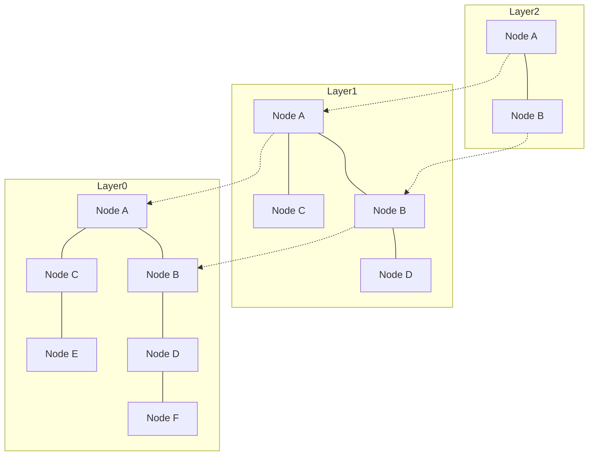

# Pendahuluan: Kebangkitan RAG dan Pentingnya Database Vektor

Dalam beberapa tahun terakhir, seiring dengan perkembangan Large Language Model (LLM), metode yang disebut Retrieval-Augmented Generation (RAG) semakin menarik perhatian. RAG adalah pendekatan di mana sistem tidak hanya mengandalkan pengetahuan bawaan LLM, melainkan mengambil (Retrieval) informasi yang relevan dari basis pengetahuan eksternal, kemudian menyematkan informasi tersebut ke dalam prompt untuk menghasilkan (Augmentation) jawaban. Pendekatan ini mampu menekan halusinasi dan mewujudkan respons berakurasi tinggi berdasarkan data internal terkini maupun pengetahuan khusus.

Komponen penting yang tidak tergantikan sebagai fondasi RAG ini adalah "database vektor (Vector Database)". Database relasional konvensional maupun mesin pencari teks lengkap (seperti BM25) melakukan pencarian berdasarkan kecocokan kata kunci secara persis (exact match) atau frekuensi kemunculannya. Akan tetapi, metode ini kesulitan menemukan kalimat yang "memiliki makna serupa namun menggunakan kata-kata yang berbeda". Database vektor menyimpan data sebagai vektor numerik berdimensi tinggi dan menghitung jarak (kemiripan) di dalam ruang vektor, sehingga memungkinkan pencarian berdasarkan kedekatan makna (pencarian semantik / semantic search).

Artikel ini akan mengupas secara terperinci dan sistematis mulai dari dasar "representasi sematan (Embeddings)" yang menjadi inti dari database vektor, hingga mekanisme algoritma "HNSW (Hierarchical Navigable Small World)" yang memungkinkan pencarian berkecepatan tinggi.

## 1. Apa Itu Representasi Sematan Vektor (Embeddings)?

### 1.1 Mengubah Makna Menjadi Angka
Dalam pemrosesan bahasa alami (Natural Language Processing / NLP), "representasi sematan (Embeddings)" adalah teknik untuk mengubah data seperti kata, kalimat, atau gambar menjadi vektor bernilai kontinu dengan panjang tetap (larik bilangan riil). Sebagai contoh, dalam ruang vektor 300 dimensi atau 1536 dimensi, kata-kata atau kalimat dengan makna yang mirip akan ditempatkan pada posisi yang berdekatan di dalam ruang tersebut.

- "Raja" - "Pria" + "Wanita" = "Ratu"

Kemampuan melakukan operasi matematika terhadap makna semacam ini mulai dikenal luas berkat model-model sematan awal seperti Word2Vec. Saat ini, model seperti `text-embedding-ada-002` dan `text-embedding-3-small/large` dari OpenAI, Embed dari Cohere, serta model berbasis BERT sumber terbuka (seperti Sentence-BERT) telah digunakan secara luas.

### 1.2 Karakteristik Ruang Berdimensi Tinggi
Vektor yang dihasilkan oleh model sematan modern berdimensi sangat tinggi (misalnya: 768 dimensi, 1536 dimensi, dan sebagainya). Semakin tinggi jumlah dimensi, semakin kaya pula daya ekspresinya; namun, biaya komputasi juga melonjak dan memicu fenomena yang dikenal sebagai "Kutukan Dimensi (Curse of Dimensionality)". Masalahnya, dalam ruang berdimensi tinggi, jarak antara dua titik acak cenderung menjadi seragam dan hampir sama, sehingga efisiensi pencarian tetangga terdekat menurun secara drastis. Database vektor dirancang untuk mengatasi tantangan dalam menangani data berdimensi tinggi ini secara efisien.

## 2. Metode Perhitungan Kemiripan (Distance Metrics)

Untuk mengukur "kedekatan makna" antarbeberapa vektor, digunakan beberapa fungsi jarak matematika (metrik). Pemilihan metrik yang tepat harus disesuaikan dengan tujuan pencarian dan karakteristik model sematan yang digunakan.

### 2.1 Kemiripan Kosinus (Cosine Similarity)
Mengukur kemiripan menggunakan kosinus sudut yang dibentuk oleh dua vektor. Metrik ini hanya mempertimbangkan "arah" vektor dan mengabaikan "panjang/besarannya (norm)". Nilainya berkisar antara -1 (arah berlawanan total) hingga 1 (arah yang persis sama). Ini adalah metrik yang paling umum digunakan saat mengukur kemiripan semantik teks.

### 2.2 Jarak Euklides (Euclidean Distance / L2 Distance)
Merupakan jarak garis lurus antara dua titik dalam ruang vektor. Semakin kecil nilainya, semakin mirip kedua vektor tersebut. Metrik ini cocok untuk kasus di mana hubungan posisi absolut bersifat penting, seperti perbandingan fitur gambar.

### 2.3 Perkalian Titik (Dot Product)
Merupakan hasil penjumlahan dari perkalian elemen-elemen yang bersesuaian pada dua vektor. Jika vektor telah dinormalisasi (panjang/norm bernilai 1), hasil perhitungan perkalian titik identik dengan kemiripan kosinus. Metrik ini disukai di banyak sistem karena membutuhkan lebih sedikit langkah komputasi sehingga dapat diproses dengan cepat.

## 3. Keterbatasan Pencarian Eksak (Exact Search) dan ANN

Tugas mencari vektor yang paling mirip di dalam database terhadap sebuah vektor kueri input disebut sebagai "Pencarian Tetangga Terdekat ke-k (k-Nearest Neighbors; k-NN)".

### 3.1 Masalah pada Pencarian Eksak (k-NN)
Cara paling sederhana adalah menghitung jarak antara vektor kueri dengan seluruh vektor yang ada di dalam database, kemudian mengurutkannya berdasarkan jarak terdekat dan mengambil $k$ item teratas (Flat Search / Exact Search).
Namun, kompleksitas komputasi pendekatan ini adalah $O(N \times D)$ ($N$ adalah jumlah data, $D$ adalah jumlah dimensi). Ketika jumlah data mencapai jutaan hingga ratusan juta, satu proses pencarian bisa memakan waktu beberapa detik hingga puluhan menit, sehingga mustahil digunakan untuk aplikasi waktu nyata (seperti chatbot atau sistem rekomendasi).

### 3.2 Pencarian Tetangga Terdekat Perkiraan (Approximate Nearest Neighbor; ANN)
Oleh karena itu, hadirlah algoritma "Approximate Nearest Neighbor (ANN)" yang secara drastis meningkatkan kecepatan pencarian dengan sedikit mengorbankan akurasi. ANN mengadopsi pendekatan "tidak menjamin menemukan titik yang mutlak paling dekat, tetapi memiliki probabilitas tinggi untuk menemukan titik yang cukup dekat".

Beberapa jenis algoritma ANN yang representatif meliputi:
- **Berbasis Struktur Pohon (Tree-based)**: Seperti KD-Tree dan Annoy. Efektif untuk dimensi rendah, namun sangat terpengaruh oleh kutukan dimensi ketika diterapkan pada dimensi tinggi.
- **Berbasis Hash (Hash-based)**: LSH (Locality-Sensitive Hashing). Menggunakan fungsi hash di mana vektor-vektor yang saling berdekatan cenderung menghasilkan nilai hash yang sama.
- **Berbasis Kuantisasi (Quantization-based)**: PQ (Product Quantization). Mengompresi vektor untuk mengurangi penggunaan memori dan mempercepat kalkulasi jarak perkiraan.
- **Berbasis Graf (Graph-based)**: HNSW (Hierarchical Navigable Small World). Dianggap memiliki keseimbangan kecepatan dan akurasi terbaik dalam pencarian vektor modern dan telah menjadi standar de facto.

## 4. Cara Kerja HNSW: Puncak dari Pencarian Berbasis Graf

HNSW (Hierarchical Navigable Small World) adalah algoritma yang diajukan oleh Yu. A. Malkov dkk., yang menggabungkan teori jaringan kompleks dengan struktur data. Sesuai namanya, algoritma ini dibangun di atas dua konsep penting: jaringan "Small World" (dunia kecil) dan "Hierarchical" (struktur bertingkat/hierarkis).

### 4.1 Graf Navigable Small World (NSW)
Fenomena small-world (enam derajat pemisah / six degrees of separation) adalah karakteristik pada jaringan masif di dunia nyata (seperti hubungan antarmanusia atau internet), di mana siapa pun dapat berpindah antara dua simpul (node) acak hanya melalui beberapa langkah perantara.
NSW menerapkan karakteristik ini untuk pencarian tetangga terdekat di dalam ruang vektor. Setiap titik data diposisikan sebagai node dalam graf, dan node-node yang saling berdekatan dihubungkan dengan sisi (edge). Pada saat yang sama, sejumlah kecil "long-range edges" (tautan jarak jauh) juga dibentuk untuk menghubungkan node-node yang saling berjauhan.

Selama pencarian, proses dimulai dari node acak dan mengulangi operasi perpindahan ke "node di antara tetangga node saat ini yang paling dekat dengan vektor kueri" (Greedy Search). Berkat keberadaan long-range edge, sistem dapat melompat jauh dengan cepat melintasi graf, dan ketika sudah mendekati target, pencarian disesuaikan secara mendetail melalui edge-edge pendek di sekitarnya. Hal ini menghasilkan proses penelusuran yang sangat efisien.

### 4.2 Pendekatan Mirip Skip List Melalui Struktur Hierarkis (Hierarchical)
Kelemahan dari NSW adalah seiring bertambahnya jumlah node, jumlah langkah yang dibutuhkan bahkan untuk "lompatan jauh" pada tahap awal pun ikut meningkat. Untuk mengatasi hal ini, HNSW mengadopsi ide dari struktur data "Skip List" dan membagi graf menjadi beberapa lapisan (layer/hierarki).

- **Lapisan Terbawah (Layer 0)**: Graf tetangga yang padat (dense), memuat seluruh titik data.
- **Semakin ke Lapisan Atas**: Jumlah node dikurangi secara eksponensial, dan koneksi antar-edge menjadi semakin renggang (sparse).

### 4.3 Algoritma Pencarian HNSW (Routing)
Pencarian pada HNSW dimulai dari lapisan teratas dan berlangsung melalui tahapan berikut:

1. **Titik Masuk (Entry Point)**: Pencarian dimulai dari node awal yang telah ditentukan sebelumnya pada lapisan paling atas.
2. **Pencarian di Setiap Lapisan**: Pada lapisan saat ini, dilakukan Greedy Search untuk menemukan node yang paling dekat dengan kueri (local minimum).
3. **Turun ke Lapisan Bawah**: Ketika tidak ada lagi node yang lebih dekat di lapisan tersebut, pencarian berpindah turun ke satu lapisan di bawahnya dari titik node tersebut.
4. **Pencarian Akhir di Lapisan Terbawah**: Proses ini diulang hingga mencapai lapisan paling bawah (Layer 0), dan hasil Greedy Search di Layer 0 yang menghasilkan $k$ node teratas dikembalikan sebagai hasil akhir pencarian.

Melalui struktur hierarkis ini, pada tahap awal pencarian sistem dapat melakukan "lompatan besar" di lapisan atas untuk mengidentifikasi area di sekitar target secara cepat. Kemudian, seiring turunnya pencarian ke lapisan bawah, resolusi ditingkatkan secara bertahap untuk melakukan eksplorasi yang presisi. Kompleksitas komputasi pencarian menjadi waktu logaritmik ($O(\log N)$), memungkinkan respons dalam hitungan milidetik bahkan untuk kumpulan data berskala ratusan juta item.

### 4.4 Konstruksi HNSW dan Hyperparameter
Saat menambahkan (Insert) data baru ke dalam graf HNSW, proses penelusuran juga dilakukan dari lapisan teratas ke bawah seperti halnya saat pencarian, guna menemukan node tetangga terdekat pada setiap lapisan dan menghubungkan edge.
Performa HNSW dikontrol oleh beberapa hyperparameter penting berikut:

- **`M`**: Jumlah maksimum edge dua arah yang dapat dimiliki oleh satu node. Nilai yang lebih besar meningkatkan akurasi, tetapi juga meningkatkan konsumsi memori serta memperlambat kecepatan pembentukan graf dan pencarian.
- **`efConstruction`**: Ukuran daftar kandidat tetangga terdekat yang disimpan selama pembangunan graf. Semakin besar nilainya, semakin tinggi kualitas (akurasi) graf yang dihasilkan, namun waktu pembangunan indeks akan lebih lama.
- **`efSearch`**: Ukuran daftar kandidat yang dipertahankan selama proses pencarian. Semakin besar nilainya, semakin tinggi akurasi pencarian (Recall), tetapi kecepatan pencarian akan berkurang. Parameter ini dapat diubah secara dinamis saat kueri dijalankan, sehingga memungkinkan penyesuaian trade-off antara akurasi dan latensi sesuai kebutuhan aplikasi.

## 5. Implementasi Database Vektor dan Ekosistemnya

Saat ini terdapat banyak perangkat lunak yang menyediakan kapabilitas pencarian vektor, yang secara garis besar dapat diklasifikasikan ke dalam tiga kategori: "Database Vektor Khusus", "Pustaka (Library)", dan "Ekstensi Database yang Sudah Ada".

### 5.1 Database Vektor Khusus (Dedicated Vector Database)
Database terdistribusi yang dirancang khusus untuk pencarian vektor. Sistem ini mendukung skalabilitas, ketersediaan tinggi (high availability), dan pencarian hibrida secara bawaan (native).
- **Pinecone**: Layanan SaaS yang terkelola penuh (fully-managed). Konfigurasinya sangat mudah dan digunakan secara luas dalam pengembangan aplikasi RAG.
- **Milvus**: Database vektor terdistribusi sumber terbuka. Memiliki arsitektur cloud-native yang cocok untuk dataset berskala masif.
- **Qdrant**: Database vektor berkecepatan tinggi yang ditulis dalam bahasa Rust. Memiliki keunggulan dalam fitur pemfilteran berbasis metadata tingkat lanjut.
- **Weaviate**: Memiliki fitur unik yang mampu menangani hubungan graf antarobjek data (skema) sekaligus vektor secara bersamaan.

### 5.2 Pustaka Pencarian Tetangga Terdekat Perkiraan (ANN Libraries)
Pustaka untuk membangun indeks di dalam memori aplikasi dan melakukan pencarian secara ringan.
- **Faiss**: Pustaka C++ yang dikembangkan oleh tim Meta AI Research (sebelumnya Facebook AI). Menyediakan berbagai macam algoritma tidak hanya HNSW, tetapi juga PQ (Product Quantization) dan IVF (Inverted File), serta mendukung pencarian berkecepatan sangat tinggi di GPU.
- **Hnswlib**: Implementasi C++ yang ringan dan cepat dari algoritma HNSW. Konfigurasinya sederhana dan sangat cocok untuk proyek skala kecil hingga menengah yang berjalan secara in-memory.

### 5.3 Ekstensi Vektor untuk Database yang Sudah Ada
Pendekatan yang menambahkan kemampuan pencarian vektor ke dalam database relasional atau mesin pencari yang sudah ada.
- **pgvector**: Modul ekstensi untuk PostgreSQL. Memungkinkan penulisan langsung perhitungan jarak vektor maupun pencarian cepat menggunakan HNSW dalam kueri SQL, serta mempermudah operasi JOIN dan pemfilteran antara data relasional dan vektor.
- **Elasticsearch / OpenSearch**: Mengintegrasikan kemampuan ANN untuk vektor berdimensi tinggi ke dalam mesin pencari teks lengkap konvensional yang andal. Sangat kuat untuk "pencarian hibrida" yang menggabungkan pencarian leksikal dan pencarian semantik.

## 6. Metode Pencarian Tingkat Lanjut: Pemfilteran Metadata dan Pencarian Hibrida

Dalam aplikasi di dunia nyata, pencarian tidak hanya memerlukan "kedekatan makna" berbasis vektor semata, melainkan juga penyaringan data berdasarkan logika bisnis.

### 6.1 Dilema antara Pencarian Vektor dan Pemfilteran
Menggabungkan pemfilteran berbasis metadata dengan pencarian ANN merupakan tantangan teknis yang cukup kompleks.
- **Post-filtering**: Mengambil kandidat teratas melalui pencarian vektor terlebih dahulu, kemudian menyaringnya dengan metadata. Namun, jika kriteria filter terlalu ketat, terdapat risiko hasil akhirnya menjadi 0 item.
- **Pre-filtering**: Menyaring data terlebih dahulu menggunakan metadata, lalu menjalankan pencarian vektor pada subset data tersebut. Namun, karena struktur graf seperti HNSW dioptimalkan secara menyeluruh pada seluruh graf, menonaktifkan sebagian node dapat memutus jalur penelusuran sehingga pencarian gagal berjalan semestinya.

Database vektor modern mengatasi tantangan ini dengan mengimplementasikan "Custom HNSW" maupun query optimizer canggih yang secara dinamis beralih antara teknik pemfilteran dan penelusuran vektor sesuai dengan kondisi kueri.

### 6.2 Nilai Nyata dari Pencarian Hibrida (Hybrid Search)
Pencarian vektor sangat unggul dalam menangkap "makna konseptual", namun terkadang kurang andal dalam mencari "nama diri (proper noun)" atau "nomor model/seri tertentu". Oleh sebab itu, mengeksekusi pencarian teks lengkap berbasis kata kunci konvensional (seperti BM25) bersamaan dengan pencarian vektor, lalu menggabungkan skor dari kedua metode tersebut untuk memperoleh hasil akhir—yang dikenal sebagai "pencarian hibrida (hybrid search)"—telah menjadi praktik terbaik (best practice) dalam sistem RAG skala enterprise.

## Kesimpulan

Database vektor dan algoritma HNSW merupakan fondasi teknologi yang krusial bagi aplikasi di era AI generatif, khususnya sistem RAG. Dengan memetakan makna teks maupun gambar ke dalam koordinat ruang multidimensi dan memanfaatkan struktur graf hierarkis HNSW, kita dapat menarik informasi yang "secara semantik paling mirip" dalam sekejap, bahkan dari kumpulan data berskala ratusan juta item.

Pergeseran paradigma dari teknologi pencarian tradisional yang bergantung pada kecocokan eksak menuju "pencarian semantik" yang mendekati cara berpikir kognitif manusia telah dimulai. Dengan memahami konsep jarak vektor, urgensi ANN, struktur internal HNSW, serta berbagai opsi database yang telah diulas dalam artikel ini, Anda akan dapat merancang dan mengembangkan aplikasi AI yang lebih canggih dan praktis.
