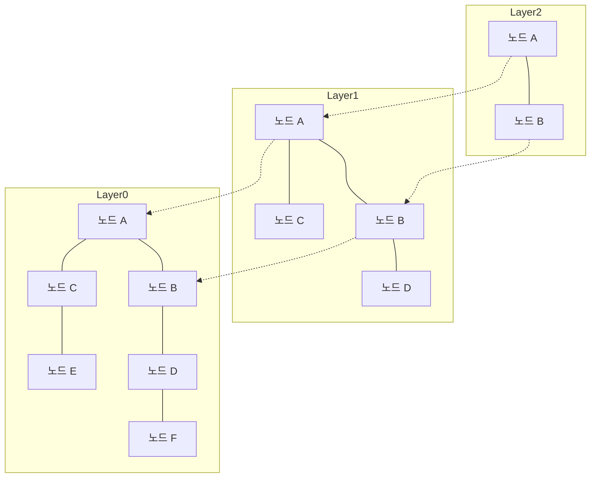

# 시작하며: RAG의 대두와 벡터 데이터베이스의 중요성

최근 대규모 언어 모델(LLM)의 발전과 함께 검색 증강 생성(Retrieval-Augmented Generation, RAG)이라 불리는 기법이 큰 주목을 받고 있습니다. RAG는 LLM이 지닌 사전 지식뿐만 아니라 외부 지식 베이스에서 관련 정보를 검색(Retrieval)하고, 해당 정보를 프롬프트에 결합하여 답변을 생성(Augmentation)하는 방식입니다. 이를 통해 환각 현상(Hallucination)을 억제하고, 최신 사내 데이터나 전문 지식에 기반한 정확도 높은 답변을 구현할 수 있습니다.

이러한 RAG의 기반으로 빠질 수 없는 핵심 기술이 바로 '벡터 데이터베이스(Vector Database)'입니다. 기존의 관계형 데이터베이스나 전문 검색 엔진(BM25 등)은 키워드의 완전 일치나 빈도수를 기반으로 검색을 수행합니다. 그러나 이러한 방식으로는 "의미는 동일하지만 사용된 단어가 다른" 문장을 찾아내기 어렵습니다. 벡터 데이터베이스는 데이터를 고차원 수치 벡터로 저장하고 벡터 공간에서의 거리(유사도)를 계산함으로써, 의미적 유사성을 기준으로 한 검색(시맨틱 검색)을 가능하게 합니다.

본 글에서는 벡터 데이터베이스의 근간을 이루는 '임베딩 표현(Embeddings)'의 기초부터, 초고속 검색을 가능하게 하는 알고리즘인 'HNSW(Hierarchical Navigable Small World)'의 작동 원리까지 상세하고 체계적으로 살펴봅니다.

## 1. 벡터 임베딩 표현(Embeddings)이란?

### 1.1 의미를 수치로 변환하기
자연어 처리에서 '임베딩 표현(Embeddings)'이란 단어, 문장, 이미지 등의 데이터를 고정 길이의 연속형 벡터(실수 배열)로 변환하는 기술입니다. 예를 들어 300차원이나 1536차원의 벡터 공간에서 의미가 유사한 단어나 문장은 공간 내에서 가까운 위치에 배치됩니다.

- "왕" - "남자" + "여자" = "여왕"

이와 같은 의미 연산이 성립한다는 점은 Word2Vec 등 초기 임베딩 모델을 통해 널리 알려졌습니다. 현재는 OpenAI의 `text-embedding-ada-002` 및 `text-embedding-3-small/large`, Cohere의 Embed, 오픈소스 BERT 계열 모델(Sentence-BERT 등)이 널리 사용되고 있습니다.

### 1.2 고차원 공간의 특성
현대 임베딩 모델이 출력하는 벡터는 매우 높은 차원(예: 768차원, 1536차원 등)을 가집니다. 차원 수가 높아질수록 표현력은 풍부해지지만, 계산 비용이 증가하고 '차원의 저주(Curse of Dimensionality)'라는 현상이 발생합니다. 고차원 공간에서는 임의의 두 점 사이의 거리가 서로 비슷해져 근접 탐색의 효율이 현저히 떨어지는 문제입니다. 벡터 데이터베이스는 이러한 고차원 데이터를 어떻게 효율적으로 다룰 것인가라는 과제를 해결하고 있습니다.

## 2. 유사도 계산 방법 (Distance Metrics)

벡터 간의 '의미적 유사성'을 측정하기 위해 몇 가지 수학적 거리 함수(메트릭)가 사용됩니다. 검색 목적과 사용하는 임베딩 모델의 특성에 맞추어 적절한 메트릭을 선택해야 합니다.

### 2.1 코사인 유사도 (Cosine Similarity)
두 벡터가 이루는 각도의 코사인(Cosine) 값을 이용하여 유사도를 측정합니다. 벡터의 '방향'만을 고려하며, '크기(노름, Norm)'는 무시합니다. 값은 -1(정반대 방향)부터 1(완전히 같은 방향)까지의 범위를 갖습니다. 텍스트의 의미적 유사도를 측정할 때 가장 널리 사용되는 지표입니다.

### 2.2 유클리드 거리 (Euclidean Distance / L2 Distance)
벡터 공간상 두 점 사이의 직선거리입니다. 값이 작을수록 유사함을 나타냅니다. 이미지 특징량 비교처럼 절대적인 위치 관계가 중요한 경우에 적합합니다.

### 2.3 내적 (Dot Product)
두 벡터의 각 요소를 곱한 후 모두 더한 값입니다. 벡터가 정규화(노름이 1로 맞춰짐)되어 있는 경우, 내적 계산 결과는 코사인 유사도와 완전히 일치합니다. 계산 단계가 적고 빠르게 처리할 수 있어 많은 시스템에서 선호됩니다.

## 3. 완전 탐색(Exact Search)의 한계와 ANN

쿼리로 입력된 벡터에 대해 데이터베이스 내에서 가장 유사한 벡터를 찾아내는 작업을 'k-최근접 이웃 탐색(k-Nearest Neighbors, k-NN)'이라고 부릅니다.

### 3.1 완전 탐색(k-NN)의 문제점
가장 단순한 방법은 데이터베이스 내의 모든 벡터와 쿼리 벡터 간의 거리를 계산하고, 거리가 가까운 순으로 정렬하여 상위 k개를 가져오는 방식입니다(Flat Search / Exact Search).
하지만 이 접근법의 계산 복잡도는 $O(N \times D)$(N은 데이터 건수, D는 차원 수)가 됩니다. 데이터 건수가 수백만~수억 건에 달하면 검색 한 번에 수 초에서 수십 분이 소요되어, 실시간 애플리케이션(챗봇이나 추천 시스템 등)에서는 도저히 사용할 수 없습니다.

### 3.2 근사 최근접 이웃 탐색(Approximate Nearest Neighbor, ANN)
여기서 등장하는 것이 정확도를 약간 희생하는 대신 검색 속도를 비약적으로 향상시키는 '근사 최근접 이웃 탐색(ANN)' 알고리즘입니다. ANN은 "반드시 가장 가까운 것을 찾는다는 보장은 없지만, 높은 확률로 충분히 가까운 것을 찾아낸다"는 접근 방식을 취합니다.

대표적인 ANN 알고리즘에는 다음과 같은 종류가 있습니다.
- **트리 구조 기반**: KD-Tree, Annoy 등. 차원이 낮을 때는 효과적이지만, 고차원이 되면 차원의 저주 영향을 강하게 받습니다.
- **해시 기반**: LSH(Locality-Sensitive Hashing). 가까운 벡터일수록 같은 해시값을 가질 확률이 높은 해시 함수를 사용합니다.
- **양자화 기반**: PQ(Product Quantization). 벡터를 압축하여 메모리 사용량을 줄이고 근사적인 거리 계산을 빠르게 수행합니다.
- **그래프 기반**: HNSW(Hierarchical Navigable Small World). 현재 벡터 검색에서 속도와 정확도의 밸런스가 가장 뛰어난 것으로 평가받으며 사실상의 표준(De facto standard)으로 자리 잡았습니다.

## 4. HNSW의 작동 원리: 그래프 기반 탐색의 정점

HNSW(Hierarchical Navigable Small World)는 Yu. A. Malkov 등이 제안한 알고리즘으로, 복잡계 네트워크 이론과 데이터 구조를 결합한 것입니다. 이름 그대로 '스몰 월드(Small World)' 네트워크와 '계층 구조(Hierarchical)'라는 두 가지 중요한 개념으로 구성되어 있습니다.

### 4.1 내비게어블 스몰 월드(NSW) 그래프
스몰 월드 현상(6단계 분리 법칙)이란 세상의 거대한 네트워크(인간관계나 인터넷 등)에서 몇 단계의 경유(스텝)만으로 임의의 두 노드 사이를 이동할 수 있는 성질을 말합니다.
NSW는 이러한 성질을 벡터 공간상의 근접 탐색에 응용한 것입니다. 각 데이터 포인트를 그래프의 노드로 삼고 서로 거리가 가까운 노드끼리 에지(Edge)로 연결합니다. 동시에 멀리 떨어진 노드끼리 연결하는 '롱 레인지 에지(장거리 링크, Long-range edge)'도 소수 유지합니다.

검색 시에는 무작위 노드에서 시작하여 '현재 노드의 이웃 노드 중 쿼리 벡터와 가장 가까운 노드'로 이동하는 과정을 반복합니다(Greedy Search, 탐욕 탐색). 롱 레인지 에지 덕분에 그래프 내에서 보폭을 크게 하여 빠르게 이동하고, 목표 지점에 가까워지면 조밀한 에지로 미세 조정하며 효율적인 탐색이 가능해집니다.

### 4.2 계층 구조(Hierarchical)를 통한 스킵 리스트식 접근
NSW의 약점은 노드 수가 증가하면 초기의 '큰 보폭 이동'에서도 스텝 수가 늘어난다는 점이었습니다. 이에 HNSW는 자료구조인 '스킵 리스트(Skip List)'의 아이디어를 도입하여 그래프를 여러 레이어(계층)로 분할했습니다.

- **최하위 계층(Layer 0)**: 모든 데이터 포인트가 포함된 조밀한 근접 그래프.
- **상위 계층으로 갈수록**: 노드 수가 지수함수적으로 솎아내어(축소)지며, 에지 연결도 성글어(Sparse)집니다.

### 4.3 HNSW의 검색 알고리즘 (라우팅)
HNSW에서의 검색은 최상위 레이어에서 시작하여 다음과 같이 진행됩니다.

1. **진입점(Entry Point)**: 최상위 레이어의 미리 정해진 시작 노드에서 탐색을 시작합니다.
2. **각 레이어에서의 탐색**: 현재 레이어에서 Greedy Search를 수행하여 쿼리와 가장 가까운 노드(로컬 미니멈)를 찾습니다.
3. **하위 레이어로의 하강**: 해당 레이어에서 더 이상 가까운 노드를 찾을 수 없게 되면, 그 노드를 유지한 채 바로 아래 레이어로 내려갑니다.
4. **최하위 계층에서의 최종 탐색**: 이를 최하위 레이어(Layer 0)까지 반복하며, Layer 0에서의 Greedy Search를 통해 얻은 상위 k개 노드를 최종 검색 결과로 반환합니다.

이러한 계층 구조 덕분에 검색 초기 단계에서는 상위 레이어에서 '성큼성큼' 이동하여 목표 주변 영역을 빠르게 특정하고, 하위 레이어로 내려갈수록 점진적으로 해상도를 높여 정밀한 탐색을 수행할 수 있습니다. 검색의 계산 복잡도는 로그 시간($O(\log N)$) 수준으로 낮아져, 수억 건의 데이터에 대해서도 밀리초 단위의 응답이 가능해집니다.

### 4.4 HNSW 구성과 하이퍼파라미터
HNSW 그래프에 새로운 데이터를 추가(Insert)할 때도 검색과 마찬가지로 최상위부터 하위 레이어로 탐색을 진행하며, 각 레이어에서 이웃 노드를 찾아 에지를 연결합니다.
HNSW의 성능은 다음과 같은 핵심 하이퍼파라미터에 의해 제어됩니다.

- **`M`**: 하나의 노드가 가질 수 있는 양방향 에지의 최대 수. 값을 크게 설정하면 정확도가 향상되지만 메모리 사용량이 증가하고 인덱스 구축 및 검색 속도가 저하됩니다.
- **`efConstruction`**: 그래프 구축 시 이웃 노드 후보로 유지할 리스트의 크기. 값이 클수록 그래프의 품질(정확도)이 향상되지만 인덱스 구축에 더 많은 시간이 걸립니다.
- **`efSearch`**: 검색 시 유지할 후보 리스트의 크기. 값이 클수록 검색 정확도(재현율, Recall)는 높아지지만 검색 속도는 느려집니다. 검색 시에만 동적으로 변경할 수 있으므로, 애플리케이션의 요구사항에 맞춰 정확도와 지연 시간(Latency) 간의 트레이드오프를 유연하게 조정할 수 있습니다.

## 5. 벡터 데이터베이스 구현 및 생태계

현재 벡터 검색 기능을 제공하는 소프트웨어는 매우 다양하며, 주로 '전용 벡터 데이터베이스', '라이브러리', '기존 DB의 확장' 3가지 범주로 나뉩니다.

### 5.1 전용 벡터 데이터베이스
벡터 검색에 특화되어 설계된 분산형 데이터베이스입니다. 확장성(Scalability), 고가용성, 하이브리드 검색을 기본적으로 지원합니다.
- **Pinecone**: 완전 관리형(Fully managed) SaaS. 설정이 매우 간단하여 RAG 애플리케이션 개발에 널리 사용됩니다.
- **Milvus**: 오픈소스 분산형 벡터 데이터베이스. 대규모 데이터셋을 위한 클라우드 네이티브 아키텍처를 갖추고 있습니다.
- **Qdrant**: Rust 언어로 작성된 초고속 벡터 데이터베이스. 메타데이터를 활용한 고급 필터링 기능에 강점이 있습니다.
- **Weaviate**: 데이터 객체 간의 그래프 관계성(스키마)과 벡터를 동시에 다룰 수 있는 특징이 있습니다.

### 5.2 근사 최근접 이웃 탐색 라이브러리
애플리케이션의 메모리 내에 인덱스를 구축하고 가볍게 검색을 수행하기 위한 라이브러리입니다.
- **Faiss**: Meta(구 Facebook) AI 리서치 팀에서 개발한 C++ 라이브러리. HNSW뿐만 아니라 PQ(Product Quantization), IVF(Inverted File) 등 다양한 알고리즘을 제공하며 GPU를 통한 초고속 검색도 지원합니다.
- **Hnswlib**: HNSW 알고리즘의 경량 고속 C++ 구현체. 설정이 단순하여 메모리 내에서 작동하는 중소 규모 프로젝트에 적합합니다.

### 5.3 기존 DB의 벡터 확장
관계형 데이터베이스나 검색 엔진에 벡터 검색 기능을 추가하는 접근 방식입니다.
- **pgvector**: PostgreSQL의 확장 모듈. SQL 쿼리 안에서 벡터 간 거리 계산이나 HNSW를 통한 고속 검색을 직접 작성할 수 있으며, 관계형 데이터와 벡터의 JOIN 및 필터링이 용이합니다.
- **Elasticsearch / OpenSearch**: 기존의 강력한 전문 검색 엔진에 고차원 벡터 ANN 기능이 통합되었습니다. 어휘 검색(Lexical Search)과 시맨틱 검색(Semantic Search)을 결합한 '하이브리드 검색'에 매우 강력합니다.

## 6. 고급 검색 기법: 메타데이터 필터링과 하이브리드 검색

실제 애플리케이션에서는 단순한 벡터 기반의 '의미적 유사성'뿐만 아니라 비즈니스 로직에 따른 조건별 필터링이 필수적입니다.

### 6.1 벡터 검색과 필터링의 딜레마
메타데이터 기반 필터링과 ANN 검색을 결합하는 것은 기술적으로 까다로운 과제입니다.
- **사후 필터링(Post-filtering)**: 먼저 벡터 검색으로 상위 결과를 가져온 후 메타데이터로 필터링합니다. 그러나 필터 조건이 너무 엄격하면 최종 결과가 0건이 되어버릴 위험이 있습니다.
- **사전 필터링(Pre-filtering)**: 메타데이터로 데이터를 먼저 좁힌 다음, 해당 부분집합에 대해 벡터 검색을 수행합니다. 그러나 HNSW와 같은 그래프 구조는 전체 데이터를 기준으로 최적화되어 있으므로, 일부 노드를 비활성화하면 원활한 탐색 경로가 끊겨 검색이 불가능해지는 문제가 발생합니다.

최신 벡터 데이터베이스들은 이 문제에 대응하여 'Custom HNSW'나 고도화된 쿼리 최적화기(Optimizer)를 구현하여, 조건에 따라 필터링과 벡터 탐색 방식을 동적으로 전환하는 방식을 채택하고 있습니다.

### 6.2 하이브리드 검색의 진가
벡터 검색은 '개념적 의미'를 포착하는 데 뛰어나지만, '고유명사'나 '특정 모델 번호/품번' 검색에는 취약할 수 있습니다. 따라서 기존 키워드 기반 전문 검색(BM25 등)과 벡터 검색을 동시에 실행하고, 양쪽의 스코어를 합성하여 최종 결과를 도출하는 '하이브리드 검색'이 엔터프라이즈 RAG 시스템의 모범 사례(Best Practice)로 자리 잡고 있습니다.

## 요약

벡터 데이터베이스와 HNSW 알고리즘은 생성형 AI 시대의 애플리케이션, 특히 RAG 시스템에서 없어서는 안 될 핵심 기술 기반입니다. 텍스트와 이미지의 의미를 다차원 공간의 좌표로 매핑하고 HNSW의 계층형 그래프 구조를 활용함으로써, 수억 건의 방대한 데이터 속에서도 순식간에 '의미상 가장 유사한' 정보를 도출해낼 수 있습니다.

키워드 완전 일치에 의존하던 전통적인 검색 기술에서 인간의 인지 방식과 유사한 '시맨틱 검색'으로의 패러다임 전환은 이미 시작되었습니다. 본 글에서 살펴본 벡터 거리의 개념, ANN의 필요성, HNSW의 내부 구조, 그리고 다양한 데이터베이스 선택지를 이해한다면 한층 더 진보되고 실용적인 AI 애플리케이션을 설계하고 개발할 수 있을 것입니다.
