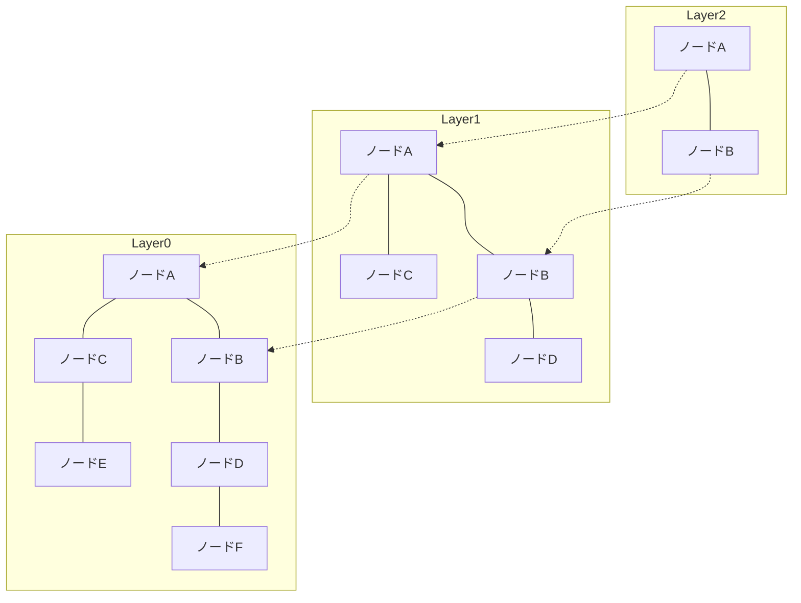

# はじめに：RAGの台頭とベクトルデータベースの重要性

近年、大規模言語モデル（LLM）の発展とともに、Retrieval-Augmented Generation（RAG）と呼ばれる手法が注目を集めています。RAGは、LLMが持つ事前知識だけでなく、外部のナレッジベースから関連情報を検索（Retrieval）し、その情報をプロンプトに組み込んで回答を生成（Augmentation）するアプローチです。これにより、ハルシネーション（幻覚）を抑制し、最新の社内データや専門知識に基づいた精度の高い回答を実現します。

このRAGの基盤として欠かせないのが「ベクトルデータベース（Vector Database）」です。従来のリレーショナルデータベースや全文検索エンジン（BM25など）は、キーワードの完全一致や頻度に基づいて検索を行います。しかし、これでは「意味は同じだが使われている単語が異なる」文章を見つけることが困難です。ベクトルデータベースは、データを高次元の数値ベクトルとして保存し、ベクトル空間上での距離（類似度）を計算することで、意味的な近さを基準とした検索（セマンティック検索）を可能にします。

本記事では、ベクトルデータベースの根幹をなす「埋め込み表現（Embeddings）」の基礎から、高速検索を可能にするアルゴリズム「HNSW（Hierarchical Navigable Small World）」の仕組みまで、詳細かつ体系的に解説します。

## 1. ベクトルの埋め込み表現（Embeddings）とは

### 1.1 意味を数値に変換する
自然言語処理における「埋め込み表現（Embeddings）」とは、単語、文、画像などのデータを、固定長の連続値ベクトル（実数の配列）に変換する技術です。例えば、300次元や1536次元のベクトル空間において、意味が似ている言葉や文章は、空間内で近い位置に配置されます。

- 「王」 - 「男」 + 「女」 = 「女王」

このような意味の演算が成り立つことは、Word2Vecなどの初期の埋め込みモデルでよく知られるようになりました。現在では、OpenAIの `text-embedding-ada-002` や `text-embedding-3-small/large`、CohereのEmbed、オープンソースのBERT系モデル（Sentence-BERTなど）が広く使われています。

### 1.2 高次元空間の性質
現代の埋め込みモデルが出力するベクトルは、非常に高次元（例：768次元、1536次元など）です。次元数が高くなるほど、表現力は豊かになりますが、計算コストが増大し、「次元の呪い（Curse of Dimensionality）」と呼ばれる現象が発生します。高次元空間では、任意の2点間の距離が似通ってしまい、近傍探索の効率が著しく低下するという問題です。ベクトルデータベースは、この高次元データをいかに効率よく扱うかという課題に立ち向かっています。

## 2. 類似度の計算方法（Distance Metrics）

ベクトル間の「意味の近さ」を測るために、いくつかの数学的な距離関数（メトリクス）が用いられます。検索の目的や使用する埋め込みモデルの特性に合わせて、適切なメトリクスを選択する必要があります。

### 2.1 コサイン類似度（Cosine Similarity）
2つのベクトルがなす角度のコサイン（余弦）を用いて類似度を測ります。ベクトルの「方向」のみを考慮し、「大きさ（ノルム）」は無視します。値は -1（正反対）から 1（完全に同じ向き）の範囲をとります。テキストの意味的な類似度を測る場合、最も一般的に使用される指標です。

### 2.2 ユークリッド距離（Euclidean Distance / L2 Distance）
ベクトル空間上の2点間の直線距離です。値が小さいほど似ていることを示します。画像特徴量の比較など、絶対的な位置関係が重要な場合に適しています。

### 2.3 内積（Dot Product）
2つのベクトルの各要素を掛け合わせて足し合わせた値です。ベクトルが正規化（ノルムが1に揃えられている）されている場合、内積の計算結果はコサイン類似度と完全に一致します。計算ステップが少なく高速に処理できるため、多くのシステムで好まれます。

## 3. 完全探索（Exact Search）の限界とANN

クエリとなる入力ベクトルに対して、最も類似するベクトルをデータベース内から見つけ出すタスクを「k-近傍探索（k-Nearest Neighbors; k-NN）」と呼びます。

### 3.1 完全探索（k-NN）の問題点
最も単純な方法は、データベース内のすべてのベクトルとクエリベクトルの距離を計算し、距離が近い順にソートして上位k件を取得することです（Flat Search / Exact Search）。
しかし、このアプローチの計算量は $O(N \times D)$（Nはデータ件数、Dは次元数）となります。データ件数が数百万〜数億件になると、1回の検索に数秒から数十分かかってしまい、リアルタイムのアプリケーション（チャットボットや推薦システムなど）には到底使えません。

### 3.2 近似最近傍探索（Approximate Nearest Neighbor; ANN）
そこで登場するのが、精度をわずかに犠牲にする代わりに、検索速度を劇的に向上させる「近似最近傍探索（ANN）」アルゴリズムです。ANNでは「絶対に一番近い保証はないが、高い確率で十分に近いものを見つける」というアプローチをとります。

代表的なANNアルゴリズムには以下のような種類があります。
- **木構造ベース**: KD-TreeやAnnoyなど。次元が低い場合は有効ですが、高次元になると次元の呪いの影響を強く受けます。
- **ハッシュベース**: LSH（Locality-Sensitive Hashing）。近いベクトルが同じハッシュ値になりやすいハッシュ関数を用います。
- **量子化ベース**: PQ（Product Quantization）。ベクトルを圧縮してメモリ使用量を減らし、近似的な距離計算を高速に行います。
- **グラフベース**: HNSW（Hierarchical Navigable Small World）。現在のベクトル検索において、速度と精度のバランスが最も優れているとされ、デファクトスタンダードとなっています。

## 4. HNSWの仕組み：グラフベース探索の頂点

HNSW（Hierarchical Navigable Small World）は、Yu. A. Malkov らによって提案されたアルゴリズムで、複雑なネットワーク理論とデータ構造を組み合わせたものです。名前の通り、「スモールワールド（Small World）」ネットワークと「階層構造（Hierarchical）」という2つの重要な概念から成り立っています。

### 4.1 ナビゲーブル・スモールワールド（NSW）グラフ
スモールワールド現象（六次の隔たり）とは、世の中の巨大なネットワーク（人間関係やインターネットなど）において、少数のステップ（中継）を経るだけで任意の2ノード間を移動できるという性質です。
NSWは、この性質をベクトル空間上の近傍探索に応用したものです。各データ点をグラフのノードとし、互いに距離が近いノード同士をエッジで結びます。同時に、遠く離れたノード同士を結ぶ「ロングレンジエッジ（長距離リンク）」も少数だけ持たせます。

検索時は、ランダムなノードからスタートし、「現在のノードの隣接ノードのうち、クエリベクトルに最も近いノード」へ移動する、という操作を繰り返します（Greedy Search）。ロングレンジエッジのおかげで、グラフ内を素早く大股で移動し、目標付近に近づいたら細かいエッジで微調整する、という効率的な探索が可能になります。

### 4.2 階層構造（Hierarchical）によるスキップリスト的アプローチ
NSWの弱点は、ノード数が増えると初期の「大股の移動」でもステップ数が増えてしまうことでした。そこでHNSWは、データ構造の「スキップリスト（Skip List）」のアイデアを取り入れ、グラフを複数のレイヤー（階層）に分割しました。

- **最下層（Layer 0）**: すべてのデータ点が含まれる、密な近傍グラフ。
- **上位層に行くほど**: ノードの数が指数関数的に間引かれ、エッジのつながりも疎になります。

### 4.3 HNSWの検索アルゴリズム（ルーティング）
HNSWでの検索は、最上位レイヤーから開始され、以下のように進行します。

1. **エントリーポイント**: 最上位レイヤーのあらかじめ決められた開始ノードから探索を始めます。
2. **各レイヤーでの探索**: 現在のレイヤーにおいて、Greedy Searchを行い、クエリに最も近いノード（ローカルミニマム）を見つけます。
3. **下のレイヤーへの降下**: そのレイヤーでこれ以上近いノードが見つからなくなったら、そのノードのまま1つ下のレイヤーに降下します。
4. **最下層での最終探索**: これを最下層（Layer 0）まで繰り返し、Layer 0でのGreedy Searchによって得られた上位k個のノードを最終的な検索結果として返します。

この階層構造により、検索の初期段階では上位レイヤーで「大股」に移動して目標付近の領域を高速に特定し、下位レイヤーに降りるにつれて徐々に解像度を上げて精密な探索を行うことができます。検索の計算量は対数時間となり、数億件のデータに対してもミリ秒単位の応答が可能になります。

### 4.4 HNSWの構築とハイパーパラメータ
HNSWグラフに新しいデータを追加（Insert）する際も、検索と同様に最上位から下層へと探索を行い、各レイヤーで近傍ノードを見つけてエッジを張ります。
HNSWの性能は、以下の重要なハイパーパラメータによって制御されます。

- **`M`**: 1つのノードが持つことができる双方向エッジの最大数。値を大きくすると精度が上がりますが、メモリ使用量が増加し、構築・検索速度が低下します。
- **`efConstruction`**: グラフ構築時に、近傍ノードの候補として保持するリストのサイズ。大きいほどグラフの品質（精度）が向上しますが、インデックス構築に時間がかかります。
- **`efSearch`**: 検索時に保持する候補リストのサイズ。大きいほど検索精度（Recall）が上がりますが、検索速度は低下します。検索時のみ動的に変更可能なため、アプリケーションの要件に応じて精度とレイテンシのトレードオフを調整できます。

## 5. ベクトルデータベースの実装とエコシステム

現在、ベクトル検索機能を提供するソフトウェアは多数存在し、主に「専用のベクトルデータベース」「ライブラリ」「既存DBの拡張」の3つに分類されます。

### 5.1 専用のベクトルデータベース
ベクトル検索に特化して設計された分散型データベースです。スケーラビリティ、高可用性、ハイブリッド検索をネイティブにサポートしています。
- **Pinecone**: フルマネージドのSaaS。セットアップが非常に簡単で、RAGアプリケーションの開発で広く使われています。
- **Milvus**: オープンソースの分散型ベクトルデータベース。大規模なデータセット向けにクラウドネイティブなアーキテクチャを持ちます。
- **Qdrant**: Rust言語で書かれた高速なベクトルデータベース。メタデータによる高度なフィルタリング機能に強みを持ちます。
- **Weaviate**: データオブジェクト間のグラフ的な関係性（スキーマ）とベクトルを同時に扱える特徴があります。

### 5.2 近似最近傍探索ライブラリ
アプリケーションのメモリ内にインデックスを構築し、軽量に検索を行うためのライブラリです。
- **Faiss**: Meta（旧Facebook）AIリサーチチームが開発したC++ライブラリ。HNSWだけでなく、PQ（Product Quantization）やIVF（Inverted File System）など多様なアルゴリズムを提供し、GPUでの超高速検索もサポートします。
- **Hnswlib**: HNSWアルゴリズムの軽量で高速なC++実装。設定がシンプルで、オンメモリで動作する小〜中規模のプロジェクトに適しています。

### 5.3 既存DBのベクトル拡張
リレーショナルデータベースや検索エンジンにベクトル検索機能を追加するアプローチです。
- **pgvector**: PostgreSQLの拡張モジュール。SQLクエリの中でベクトル間の距離計算やHNSWによる高速検索を直接記述でき、リレーショナルデータとベクトルのJOINやフィルタリングが容易です。
- **Elasticsearch / OpenSearch**: 従来の強力な全文検索エンジンに高次元ベクトルのANN機能が統合されました。レキシカル検索とセマンティック検索を組み合わせた「ハイブリッド検索」に非常に強力です。

## 6. 高度な検索手法：メタデータフィルタリングとハイブリッド検索

実際のアプリケーションでは、単なるベクトルによる「意味の近さ」だけでなく、ビジネスロジックに基づいた絞り込みが必要になります。

### 6.1 ベクトル検索とフィルタリングのジレンマ
メタデータによるフィルタリングとANN検索を組み合わせることは、技術的に難しい課題です。
- **Post-filtering**: まずベクトル検索で上位を取得し、その後メタデータでフィルタリングします。しかし、フィルタ条件が厳しすぎると、最終的な結果が0件になってしまうリスクがあります。
- **Pre-filtering**: メタデータで先にデータを絞り込み、その部分集合に対してベクトル検索を行います。しかし、HNSWのようなグラフ構造は全体で最適化されているため、一部のノードを無効化すると探索ができなくなる問題があります。

モダンなベクトルデータベースは、この問題に対して「Custom HNSW」や高度なクエリオプティマイザを実装し、条件に応じてフィルタリングとベクトル探索を動的に切り替えたりしています。

### 6.2 ハイブリッド検索の真価
ベクトル検索は「概念的な意味」を捉えるのが得意ですが、「固有名詞」や「特定の型番」の検索は苦手な場合があります。そのため、従来のキーワードベースの全文検索（BM25など）とベクトル検索を同時に実行し、双方のスコアを合成して最終結果を得る「ハイブリッド検索」が、エンタープライズ向けのRAGシステムにおけるベストプラクティスとなりつつあります。

## まとめ

ベクトルデータベースとHNSWアルゴリズムは、生成AI時代のアプリケーション、特にRAGシステムにおいて不可欠な技術基盤です。テキストや画像の意味を多次元空間の座標にマッピングし、HNSWの階層型グラフ構造を用いることで、数億件のデータからでも瞬時に「意味的に最も近い」情報を引き出すことが可能になります。

完全一致に依存していた従来の検索技術から、人間の認知に近い「セマンティックな検索」へのパラダイムシフトは、すでに始まっています。本記事で解説したベクトル距離の概念、ANNの必要性、HNSWの内部構造、そして多様なデータベースの選択肢を理解することで、より高度で実用的なAIアプリケーションの設計・開発が可能になるでしょう。
