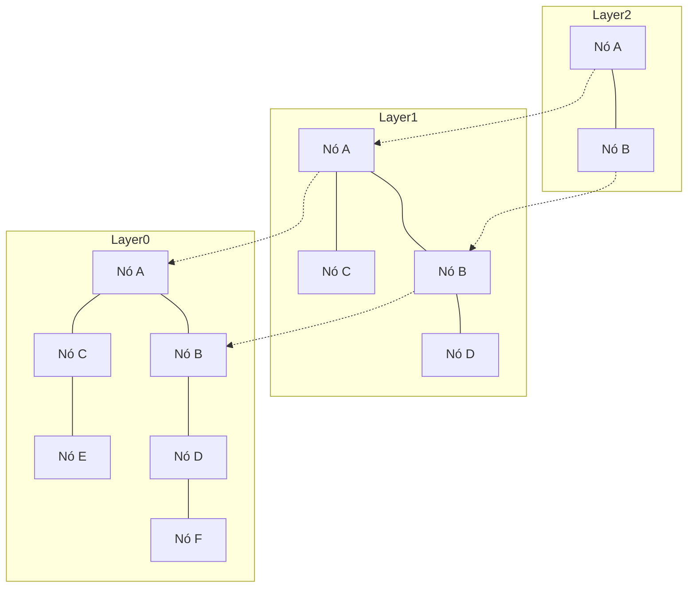

# Introdução: A Ascensão do RAG e a Importância dos Bancos de Dados Vetoriais

Nos últimos anos, com a evolução dos Grandes Modelos de Linguagem (LLMs), uma abordagem chamada Geração Aumentada por Recuperação (Retrieval-Augmented Generation - RAG) tem atraído grande atenção. O RAG é uma técnica que vai além do conhecimento prévio do LLM, buscando (Retrieval) informações relevantes em uma base de conhecimento externa e incorporando esses dados ao prompt para gerar (Augmentation) respostas. Isso permite mitigar alucinações (hallucinations) e fornecer respostas altamente precisas com base em dados internos atualizados ou conhecimentos especializados.

Como base fundamental desse ecossistema RAG, os "bancos de dados vetoriais" (Vector Databases) tornaram-se indispensáveis. Bancos de dados relacionais tradicionais ou mecanismos de busca textual (como BM25) realizam buscas baseando-se em correspondência exata de palavras-chave ou frequência de termos. No entanto, dessa forma é difícil encontrar frases com o "mesmo significado, mas palavras diferentes". Os bancos de dados vetoriais armazenam os dados como vetores numéricos de alta dimensão e calculam distâncias (similaridade) no espaço vetorial, possibilitando buscas orientadas pelo significado semântico (busca semântica).

Neste artigo, explicaremos de forma detalhada e sistemática desde os fundamentos dos "embeddings" (representações vetoriais), que formam o alicerce dos bancos de dados vetoriais, até o funcionamento do algoritmo "HNSW" (Hierarchical Navigable Small World), que viabiliza buscas em altíssima velocidade.

## 1. O que são Representações Vetoriais (Embeddings)

### 1.1 Convertendo Significado em Números
No processamento de linguagem natural (PLN), os "embeddings" (representações vetoriais) referem-se à tecnologia que converte dados como palavras, frases ou imagens em vetores de valores contínuos de comprimento fixo (arrays de números reais). Por exemplo, em um espaço vetorial de 300 ou 1536 dimensões, palavras ou frases com significados semelhantes são posicionadas próximas umas das outras nesse espaço.

- "Rei" - "Homem" + "Mulher" = "Rainha"

A possibilidade de realizar operações aritméticas com significados tornou-se amplamente conhecida com modelos pioneiros de embedding, como o Word2Vec. Hoje em dia, modelos como o `text-embedding-ada-002` e `text-embedding-3-small/large` da OpenAI, o Embed da Cohere e modelos baseados em BERT de código aberto (como o Sentence-BERT) são amplamente utilizados.

### 1.2 Propriedades dos Espaços de Alta Dimensão
Os vetores gerados pelos modelos de embedding modernos possuem dimensionalidade extremamente elevada (por exemplo, 768 ou 1536 dimensões). À medida que o número de dimensões aumenta, a capacidade expressiva cresce, mas o custo computacional também se eleva, desencadeando um fenômeno conhecido como a "maldição da dimensionalidade" (Curse of Dimensionality). Em espaços de altíssima dimensão, a distância entre quaisquer dois pontos tende a se equiparar, degradando drasticamente a eficiência da busca por vizinhos mais próximos. Os bancos de dados vetoriais enfrentam justamente o desafio de processar esses dados de alta dimensão com a máxima eficiência.

## 2. Métodos de Cálculo de Similaridade (Métricas de Distância)

Para quantificar a "proximidade semântica" entre vetores, utilizam-se diversas funções matemáticas de distância (métricas). É fundamental escolher a métrica mais adequada de acordo com o objetivo da busca e as características do modelo de embedding empregado.

### 2.1 Similaridade de Cosseno (Cosine Similarity)
Mede a similaridade utilizando o cosseno do ângulo formado entre dois vetores. Leva em consideração apenas a "direção" do vetor, ignorando sua "magnitude" (norma). O valor varia de -1 (direções opostas) a 1 (mesma direção exata). É a métrica mais comumente utilizada para medir a similaridade semântica de textos.

### 2.2 Distância Euclidiana (Euclidean Distance / Distância L2)
Representa a distância em linha reta entre dois pontos no espaço vetorial. Quanto menor o valor, maior a similaridade. É adequada para cenários onde as relações posicionais absolutas são cruciais, como na comparação de características de imagens.

### 2.3 Produto Escalar (Dot Product)
É a soma dos produtos dos elementos correspondentes de dois vetores. Quando os vetores estão normalizados (norma unitária igual a 1), o resultado do produto escalar torna-se matematicamente idêntico à similaridade de cosseno. Por exigir menos passos de cálculo e ser computacionalmente muito rápido, é amplamente preferido em muitos sistemas.

## 3. Limitações da Busca Exata (Exact Search) e a ANN

A tarefa de localizar no banco de dados os vetores mais semelhantes em relação a um vetor de consulta (query) é chamada de "busca pelos k-vizinhos mais próximos" (k-Nearest Neighbors; k-NN).

### 3.1 Os Problemas da Busca Exata (k-NN)
A abordagem mais simples consiste em calcular a distância entre o vetor de consulta e todos os vetores presentes no banco de dados, ordenando-os pela menor distância para recuperar os $k$ primeiros resultados (Flat Search / Exact Search).
Contudo, a complexidade computacional dessa abordagem é de $O(N \times D)$ (onde $N$ é o número de itens e $D$ é a quantidade de dimensões). Quando o volume de dados atinge a casa dos milhões ou centenas de milhões, uma única consulta pode levar de vários segundos a dezenas de minutos, inviabilizando completamente sua aplicação em sistemas de tempo real (como chatbots ou sistemas de recomendação).

### 3.2 Busca pelos Vizinhos Mais Próximos Aproximados (Approximate Nearest Neighbor; ANN)
É nesse cenário que entram os algoritmos de "Busca pelos Vizinhos Mais Próximos Aproximados" (Approximate Nearest Neighbor - ANN), que aumentam drasticamente a velocidade de busca com uma perda marginal de precisão. O conceito fundamental da ANN é: "não há garantia absoluta de encontrar o vizinho mais próximo exato, mas há uma probabilidade extremamente alta de encontrar itens suficientemente próximos".

Entre os principais tipos de algoritmos de ANN, destacam-se:
- **Baseados em árvores**: como KD-Tree e Annoy. São eficientes em dimensões baixas, mas sofrem fortemente com a maldição da dimensionalidade à medida que o número de dimensões cresce.
- **Baseados em hashing**: como o LSH (Locality-Sensitive Hashing). Utiliza funções de hash projetadas para que vetores próximos tenham alta probabilidade de colidir no mesmo hash.
- **Baseados em quantização**: como a PQ (Product Quantization). Compacta os vetores para reduzir o consumo de memória e acelerar os cálculos aproximados de distância.
- **Baseados em grafos**: como o HNSW (Hierarchical Navigable Small World). Atualmente considerado o estado da arte e o padrão de fato na busca vetorial, oferecendo o melhor equilíbrio entre velocidade e precisão.

## 4. Como Funciona o HNSW: O Ápice da Busca Baseada em Grafos

O HNSW (Hierarchical Navigable Small World) é um algoritmo proposto por Yu. A. Malkov e colaboradores, combinando a teoria de redes complexas com estruturas de dados avançadas. Como o próprio nome indica, ele se baseia em dois conceitos fundamentais: redes de "mundo pequeno" (Small World) e uma estrutura "hierárquica" (Hierarchical).

### 4.1 Grafos do Tipo Navigable Small World (NSW)
O fenômeno do "mundo pequeno" (como a teoria dos seis graus de separação) descreve a propriedade observada em grandes redes do mundo real (como redes sociais ou a própria internet), onde é possível transitar entre quaisquer dois nós em apenas alguns poucos passos (saltos).
O NSW aplica essa propriedade à busca por vizinhos no espaço vetorial. Cada ponto de dado atua como um nó no grafo, e nós próximos entre si são conectados por arestas. Concomitantemente, mantém-se uma pequena quantidade de "arestas de longo alcance" (links de longa distância) conectando nós distantes.

Durante a busca, inicia-se a partir de um nó aleatório e repete-se a operação de navegar para "o nó vizinho mais próximo do vetor de consulta" (Busca Gulosa / Greedy Search). Graças às arestas de longo alcance, é possível dar "passos largos" e navegar rapidamente pelo grafo; ao se aproximar do alvo, a busca transita por arestas mais curtas para fazer o ajuste fino, viabilizando uma exploração extremamente eficiente.

### 4.2 Abordagem Semelhante à Skip List por Estrutura Hierárquica (Hierarchical)
A principal fraqueza do NSW era que, conforme o número de nós crescia, até mesmo esses saltos iniciais com "passos largos" demandavam mais etapas. Para solucionar isso, o HNSW incorporou o conceito da estrutura de dados "Skip List", particionando o grafo em múltiplas camadas (layers).

- **Camada inferior (Layer 0)**: Grafo denso de vizinhança contendo todos os pontos de dados.
- **Camadas superiores**: O número de nós diminui exponencialmente e as conexões de arestas tornam-se mais esparsas.

### 4.3 Algoritmo de Busca do HNSW (Roteamento)
A busca no HNSW começa na camada superior e progride da seguinte maneira:

1. **Ponto de Entrada (Entry Point)**: A busca é iniciada a partir de um nó inicial predeterminado na camada superior.
2. **Busca em cada camada**: Na camada atual, realiza-se uma Busca Gulosa (Greedy Search) para encontrar o nó mais próximo da consulta (mínimo local).
3. **Descida para a camada inferior**: Quando não for mais possível encontrar nós mais próximos naquela camada, desce-se para a camada imediatamente inferior mantendo aquele mesmo nó como ponto de partida.
4. **Busca final na camada base**: Esse processo se repete até atingir a camada mais baixa (Layer 0), onde uma busca gulosa final retorna os $k$ nós mais próximos como o resultado definitivo da consulta.

Com essa arquitetura hierárquica, a fase inicial da busca dá passos amplos nas camadas superiores, identificando com rapidez a vizinhança aproximada do alvo; à medida que desce pelas camadas, a resolução aumenta gradativamente para conduzir uma exploração refinada. A complexidade de busca torna-se logarítmica, permitindo tempos de resposta na escala de milissegundos mesmo sobre centenas de milhões de registros.

### 4.4 Construção do HNSW e Hiperparâmetros
Ao inserir (Insert) novos dados no grafo HNSW, o processo de busca é executado a partir do topo até as camadas inferiores de forma similar, localizando os nós vizinhos em cada camada e estabelecendo as conexões (arestas).
O desempenho do HNSW é controlado principalmente pelos seguintes hiperparâmetros:

- **`M`**: O número máximo de arestas bidirecionais que um nó pode possuir. Valores maiores aumentam a precisão, mas elevam o consumo de memória e diminuem a velocidade de construção e de busca.
- **`efConstruction`**: O tamanho da lista de nós candidatos avaliados durante a construção do grafo. Quanto maior o valor, maior a qualidade (precisão) do grafo, porém o tempo de indexação é maior.
- **`efSearch`**: O tamanho da lista de candidatos mantida durante a busca. Quanto maior o valor, maior o recall (taxa de recuperação), embora a velocidade de busca seja reduzida. Como esse parâmetro pode ser ajustado dinamicamente em tempo de consulta, é possível equilibrar a relação de compromisso (trade-off) entre precisão e latência conforme as necessidades da aplicação.

## 5. Implementações e Ecossistema de Bancos de Dados Vetoriais

Atualmente, existem inúmeros softwares que fornecem recursos de busca vetorial, categorizados principalmente em: "bancos de dados vetoriais dedicados", "bibliotecas" e "extensões para bancos de dados existentes".

### 5.1 Bancos de Dados Vetoriais Dedicados
Sistemas de bancos de dados distribuídos desenvolvidos especificamente para busca vetorial. Oferecem suporte nativo a escalabilidade, alta disponibilidade e busca híbrida.
- **Pinecone**: Solução SaaS totalmente gerenciada. Configuração extremamente simples, sendo amplamente adotada no desenvolvimento de aplicações com RAG.
- **Milvus**: Banco de dados vetorial distribuído de código aberto, projetado com arquitetura nativa em nuvem para lidar com conjuntos massivos de dados.
- **Qdrant**: Banco de dados vetorial de alta performance implementado em Rust. Destaca-se por seus avançados recursos de filtragem por metadados.
- **Weaviate**: Diferencia-se por manipular simultaneamente vetores e esquemas relacionais/grafos estruturados entre objetos de dados.

### 5.2 Bibliotecas de Busca por Vizinhos Mais Próximos Aproximados
Bibliotecas projetadas para construir índices em memória e realizar buscas leves e eficientes diretamente na aplicação.
- **Faiss**: Biblioteca em C++ desenvolvida pela equipe de pesquisa de IA da Meta (antigo Facebook). Suporta não apenas o HNSW, mas também algoritmos diversos como PQ (Product Quantization) e IVF (Inverted File), além de contar com suporte a processamento ultrarrápido em GPU.
- **Hnswlib**: Implementação em C++ leve e rápida do algoritmo HNSW. Com configuração simples, é ideal para projetos de pequeno a médio porte que operam inteiramente em memória.

### 5.3 Extensões Vetoriais para Bancos de Dados Tradicionais
Uma abordagem que adiciona recursos de busca vetorial a bancos de dados relacionais e motores de busca já consolidados.
- **pgvector**: Extensão para PostgreSQL. Permite calcular distâncias vetoriais e executar buscas aceleradas por HNSW diretamente dentro de consultas SQL, facilitando operações de JOIN e filtragens com dados relacionais.
- **Elasticsearch / OpenSearch**: Os consolidados motores de busca textual incorporaram funcionalidades de ANN para vetores de alta dimensão. São extremamente poderosos para a implementação de "busca híbrida", combinando busca lexical e busca semântica.

## 6. Métodos Avançados de Busca: Filtragem por Metadados e Busca Híbrida

Em aplicações reais, não basta considerar apenas a "proximidade semântica" dos vetores; é frequentemente necessário refinar os resultados com base em regras de negócio.

### 6.1 O Dilema entre Busca Vetorial e Filtragem
A combinação de filtragem baseada em metadados com algoritmos de ANN representa um desafio técnico significativo.
- **Pós-filtragem (Post-filtering)**: Executa primeiro a busca vetorial para obter os melhores resultados e, em seguida, aplica o filtro de metadados. Contudo, se as condições de filtragem forem muito restritivas, há o risco de o resultado final ficar vazio (zero itens).
- **Pré-filtragem (Pre-filtering)**: Filtra os dados antecipadamente pelos metadados e realiza a busca vetorial somente sobre esse subconjunto. No entanto, como estruturas de grafo como o HNSW são otimizadas para o conjunto global, desativar nós arbitrariamente pode quebrar as rotas de navegação e impedir a busca.

Bancos de dados vetoriais modernos contornam essa limitação implementando variações personalizadas de HNSW ("Custom HNSW") e otimizadores avançados de consulta, alternando dinamicamente entre estratégias de filtragem e busca vetorial conforme as características da consulta.

### 6.2 O Verdadeiro Valor da Busca Híbrida
Embora a busca vetorial seja excelente para capturar "significados conceituais", ela pode apresentar dificuldades na recuperação de "nomes próprios" ou "códigos de referência específicos". Por essa razão, a "busca híbrida" — que executa simultaneamente a busca textual tradicional baseada em palavras-chave (como BM25) e a busca vetorial, combinando as pontuações de ambas — consolidou-se como a melhor prática para sistemas RAG corporativos.

## Conclusão

Os bancos de dados vetoriais e o algoritmo HNSW são alicerces tecnológicos indispensáveis para aplicações na era da IA generativa, especialmente em sistemas RAG. Ao mapear o significado de textos e imagens para coordenadas em espaços multidimensionais e utilizar a estrutura de grafos hierárquicos do HNSW, torna-se possível recuperar instantaneamente as informações "semanticamente mais próximas", mesmo em conjuntos contendo centenas de milhões de registros.

A transição de paradigma das tecnologias de busca tradicionais — dependentes de correspondências exatas — para uma "busca semântica" muito mais próxima da cognição humana já é uma realidade. Compreender os conceitos de métricas de distância vetorial, a necessidade da ANN, a mecânica interna do HNSW e as variadas opções de bancos de dados disponíveis fornecerá a base necessária para projetar e construir aplicações de IA cada vez mais avançadas e eficientes.
