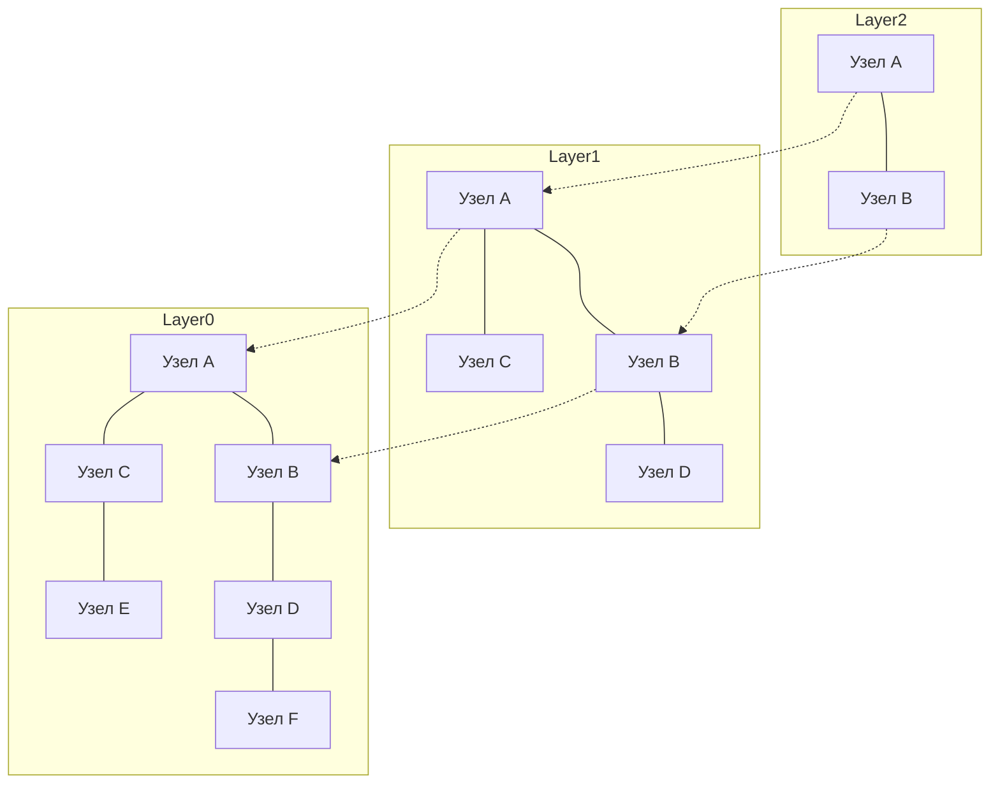

# Введение: взлет RAG и значимость векторных баз данных

В последние годы на фоне развития больших языковых моделей (LLM) стремительно набирает популярность подход под названием Retrieval-Augmented Generation (RAG, генерация с дополненной выборкой). RAG — это метод, при котором модель опирается не только на свои предварительно обученные знания, но и извлекает (Retrieval) релевантную информацию из внешних баз знаний и добавляет (Augmentation) её в промпт для генерации ответа. Это позволяет снизить уровень галлюцинаций и получать высокоточные ответы на основе актуальных корпоративных данных и предметных знаний.

Неотъемлемым фундаментом RAG являются векторные базы данных (Vector Databases). Традиционные реляционные СУБД и движки полнотекстового поиска (такие как BM25) ищут данные на основе точного совпадения ключевых слов или их частотности. Однако в таком случае крайне сложно обнаружить фрагменты текста, которые совпадают по смыслу, но сформулированы другими словами. Векторные базы данных хранят информацию в виде многомерных числовых векторов и вычисляют расстояние (сходство) между ними в векторном пространстве, обеспечивая поиск по смысловой близости (семантический поиск).

В этой статье мы подробно и систематично разберем весь путь: от основ векторных эмбеддингов (Embeddings), лежащих в основе векторных баз данных, до принципов работы алгоритма HNSW (Hierarchical Navigable Small World), обеспечивающего молниеносный поиск.

## 1. Что такое векторные эмбеддинги (Embeddings)

### 1.1 Преобразование смысла в числа
В области обработки естественного языка (NLP) под «эмбеддингами» (векторными представлениями) понимается технология преобразования таких данных, как слова, предложения или изображения, в непрерывные векторы фиксированной длины (массивы вещественных чисел). Например, в 300-мерном или 1536-мерном векторном пространстве близкие по смыслу слова и предложения располагаются рядом друг с другом.

- «Король» - «Мужчина» + «Женщина» = «Королева»

Возможность проведения подобных смысловых арифметических операций стала широко известна благодаря ранним моделям эмбеддингов, таким как Word2Vec. Сегодня повсеместно используются современные модели: `text-embedding-ada-002` и `text-embedding-3-small/large` от OpenAI, Embed от Cohere, а также открытые модели на базе архитектуры BERT (например, Sentence-BERT).

### 1.2 Особенности многомерного пространства
Векторы, создаваемые современными моделями эмбеддингов, обладают очень высокой размерностью (например, 768, 1536 измерений и более). С ростом размерности возрастает выразительная способность представления, но одновременно с этим растут вычислительные затраты и проявляется феномен, известный как «проклятие размерности» (Curse of Dimensionality). В многомерных пространствах расстояния между любыми двумя произвольными точками становятся практически одинаковыми, из-за чего эффективность поиска ближайших соседей резко падает. Векторные базы данных созданы именно для решения задачи эффективной работы с такими высокоразмерными данными.

## 2. Способы вычисления сходства (Distance Metrics)

Для оценки «смысловой близости» между векторами применяются различные математические функции расстояния (метрики). Выбор подходящей метрики зависит от целей поиска и характеристик используемой модели эмбеддингов.

### 2.1 Косинусное сходство (Cosine Similarity)
Определяет степень сходства через косинус угла между двумя векторами. Эта метрика учитывает только «направление» векторов, игнорируя их «величину» (норму). Значение варьируется от -1 (диаметрально противоположные направления) до 1 (полное совпадение направлений). Это наиболее распространенная метрика для измерения семантической близости текстов.

### 2.2 Евклидово расстояние (Euclidean Distance / L2 Distance)
Прямолинейное геометрическое расстояние между двумя точками в векторном пространстве. Чем меньше значение, тем ближе объекты. Подходит для сценариев, где важно абсолютное взаимное расположение, например при сравнении визуальных признаков изображений.

### 2.3 Скалярное произведение (Dot Product)
Сумма попарных произведений соответствующих координат двух векторов. Если векторы нормализованы (их евклидова норма равна 1), скалярное произведение полностью совпадает с косинусным сходством. Поскольку его вычисление требует минимума операций и выполняется очень быстро, оно предпочтительно во многих высоконагруженных системах.

## 3. Ограничения точного поиска (Exact Search) и переход к ANN

Задача нахождения в базе данных векторов, наиболее похожих на вектор входящего запроса, называется поиском k ближайших соседей (k-Nearest Neighbors, k-NN).

### 3.1 Проблемы полного перебора (k-NN)
Самый прямолинейный способ — вычислить расстояние между вектором запроса и всеми векторами в базе данных, отсортировать их по возрастанию расстояния и выбрать топ-k результатов (Flat Search / Exact Search).
Однако вычислительная сложность такого подхода составляет $O(N \times D)$ (где $N$ — число записей, а $D$ — размерность). Когда объем данных достигает миллионов или сотен миллионов записей, один поисковый запрос может занимать от нескольких секунд до десятков минут, что делает точный перебор абсолютно непригодным для приложений реального времени (таких как чат-боты или рекомендательные системы).

### 3.2 Поиск приближенных ближайших соседей (Approximate Nearest Neighbor, ANN)
На помощь приходят алгоритмы приближенного поиска ближайших соседей (Approximate Nearest Neighbor, ANN). Они немного жертвуют абсолютной точностью ради кардинального увеличения скорости поиска. Подход ANN базируется на принципе: «стопроцентная гарантия нахождения самого близкого вектора не дается, но с высокой вероятностью будет найден результат, находящийся достаточно близко».

Среди основных классов алгоритмов ANN выделяют следующие:
- **Древовидные структуры (Tree-based)**: KD-деревья, Annoy и др. Эффективны при небольшой размерности, но при увеличении числа измерений сильно страдают от «проклятия размерности».
- **Хеширование (Hash-based)**: LSH (Locality-Sensitive Hashing). Используют специальные хеш-функции, при которых близкие векторы с высокой вероятностью получают одинаковые хеш-значения.
- **Квантование (Quantization-based)**: PQ (Product Quantization). Сжимают векторы для экономии оперативной памяти и позволяют быстро вычислять приближенное расстояние.
- **Графовые методы (Graph-based)**: HNSW (Hierarchical Navigable Small World). Считается де-факто стандартом современного векторного поиска благодаря наилучшему балансу между скоростью и точностью.

## 4. Как устроен HNSW: вершина графового поиска

Алгоритм HNSW (Hierarchical Navigable Small World), предложенный Ю. А. Мальковым и соавторами, сочетает в себе теорию сложных сетей и специализированные структуры данных. Как следует из названия, он базируется на двух ключевых концепциях: сети «тесного мира» (Small World) и многоуровневой иерархии (Hierarchical).

### 4.1 Графы Navigable Small World (NSW)
Феномен «тесного мира» (включая концепцию шести рукопожатий) заключается в том, что в гигантских реальных сетях (таких как социальные контакты или интернет) между любыми двумя узлами можно переместиться всего за небольшое число промежуточных шагов (хопов).
NSW применяет это свойство к задаче поиска ближайших соседей в векторном пространстве. Каждая точка данных становится вершиной графа, при этом близко расположенные вершины соединяются ребрами. Одновременно создается небольшое количество длинных связей (long-range edges), соединяющих удаленные друг от друга узлы.

При поиске алгоритм стартует со случайного узла и жадно перемещается к тому соседнему узлу, который ближе всего к вектору запроса (Greedy Search). Благодаря длинным связям алгоритм может быстро совершать широкие скачки по графу, приближаясь к нужной области, а затем с помощью коротких локальных связей уточнять позицию.

### 4.2 Иерархическая структура по принципу Skip List
Слабым местом обычного NSW было то, что с ростом общего числа узлов увеличивалось и количество шагов даже на этапе начальных «широких скачков». В алгоритме HNSW эту проблему решили, заимствовав идею классической структуры данных Skip List (список с пропусками) и разделив граф на несколько слоев (уровней иерархии).

- **Нижний слой (Layer 0)**: Плотный граф соседей, содержащий абсолютно все точки данных.
- **Чем выше слой**: Количество узлов экспоненциально уменьшается (прореживается), а связи между ними становятся более разреженными и длинными.

### 4.3 Алгоритм поиска в HNSW (маршрутизация)
Поиск в HNSW начинается с самого верхнего слоя и проходит следующие шаги:

1. **Точка входа**: Поиск стартует с заранее определенной начальной вершины на самом верхнем слое.
2. **Поиск на текущем слое**: В рамках текущего слоя выполняется жадный поиск (Greedy Search) для нахождения узла, ближайшего к запросу (локального минимума).
3. **Спуск на слой ниже**: Когда на текущем уровне более близких узлов найти не удается, алгоритм переходит в найденную вершину на слой ниже.
4. **Финальный поиск на нижнем слое**: Процедура повторяется до нижнего слоя (Layer 0). Жадный поиск на Layer 0 формирует итоговый список топ-k ближайших узлов, которые и возвращаются в качестве результата.

Благодаря этой иерархии на начальном этапе поиск перемещается огромными шагами по верхним слоям, быстро локализуя нужную область, а при спуске вниз точность последовательно возрастает. Временная сложность поиска логарифмическая, что позволяет получать ответы за миллисекунды даже на базах с сотнями миллионов записей.

### 4.4 Построение HNSW и гиперпараметры
При вставке (Insert) новых данных в HNSW-граф поиск ближайших узлов также ведется сверху вниз, и на соответствующих слоях создаются новые двунаправленные связи.
Производительность и характеристики HNSW определяются следующими ключевыми гиперпараметрами:

- **`M`**: Максимальное количество двунаправленных связей (ребер), которое может иметь один узел. Увеличение этого значения повышает точность поиска, но требует больше оперативной памяти и замедляет как построение индекса, так и поиск.
- **`efConstruction`**: Размер очереди кандидатов в ближайшие соседи при построении графа. Чем больше это значение, тем выше качество графа (и итоговая точность), но тем дольше строится индекс.
- **`efSearch`**: Размер очереди кандидатов, поддерживаемой непосредственно во время выполнения поиска. Чем выше значение, тем выше полнота поиска (Recall), но выше и задержка (Latency). Этот параметр можно динамически менять во время выполнения запросов, настраивая баланс между точностью и скоростью под требования конкретного приложения.

## 5. Реализации и экосистема векторных баз данных

На сегодняшний день существует множество решений для векторного поиска. Их можно разделить на три основные категории: «специализированные векторные СУБД», «библиотеки» и «векторные расширения для традиционных СУБД».

### 5.1 Специализированные векторные базы данных
Распределенные СУБД, спроектированные специально для векторного поиска. Они из коробки поддерживают масштабируемость, высокую доступность и гибридный поиск.
- **Pinecone**: Полностью управляемый SaaS-сервис. Отличается предельно простой настройкой и широко используется для разработки RAG-приложений.
- **Milvus**: Распределенная векторная база данных с открытым исходным кодом. Обладает cloud-native архитектурой, рассчитанной на петабайтные объемы данных.
- **Qdrant**: Быстрая векторная СУБД, написанная на языке Rust. Ее сильная сторона — мощные и гибкие возможности фильтрации по метаданным.
- **Weaviate**: Отличается возможностью одновременно работать как с векторами, так и с графоподобными связями между объектами данных (схемами данных).

### 5.2 Библиотеки приближенного поиска ближайших соседей
Библиотеки для создания индексов в оперативной памяти приложения и выполнения легковесного поиска.
- **Faiss**: Библиотека на C++, разработанная Meta AI Research (ранее Facebook). Поддерживает не только HNSW, но и множество других алгоритмов, таких как PQ (Product Quantization) и IVF (Inverted File), а также сверхбыстрый поиск на GPU.
- **Hnswlib**: Легковесная и быстрая реализация алгоритма HNSW на C++. Имеет минималистичный API и отлично подходит для компактных и средних проектов, работающих полностью in-memory.

### 5.3 Векторные расширения для существующих СУБД
Подход, добавляющий поддержку векторного поиска в привычные реляционные СУБД или поисковые движки.
- **pgvector**: Расширение для PostgreSQL. Позволяет рассчитывать векторные расстояния и строить HNSW-индексы прямо в SQL-запросах, а также легко объединять (JOIN) и фильтровать реляционные данные вместе с векторами.
- **Elasticsearch / OpenSearch**: В классические мощные движки полнотекстового поиска была интегрирована поддержка ANN для многомерных векторов. Они особенно эффективны для реализации «гибридного поиска», объединяющего лексический и семантический подходы.

## 6. Продвинутые методы поиска: фильтрация по метаданным и гибридный поиск

В реальных сценариях поиск исключительно по «семантической близости» недостаточен — практически всегда требуется дополнительная фильтрация по бизнес-логике.

### 6.1 Дилемма совмещения векторного поиска и фильтрации
Комбинирование фильтрации по метаданным с ANN-поиском — нетривиальная инженерная задача.
- **Постфильтрация (Post-filtering)**: Сначала выполняется векторный поиск для отбора топ-кандидатов, а затем к ним применяется фильтр по метаданным. Однако при слишком строгих условиях фильтрации есть риск получить в итоге нулевой результат.
- **Префильтрация (Pre-filtering)**: Сначала данные фильтруются по метаданным, а затем векторный поиск выполняется только по полученному подмножеству. Однако графовые структуры типа HNSW оптимизированы глобально, и исключение части узлов может нарушить связность графа и сделать обход невозможным.

Современные векторные базы данных решают эту проблему с помощью модификаций алгоритма («Custom HNSW») и умных оптимизаторов запросов, которые динамически выбирают стратегию фильтрации в зависимости от условий.

### 6.2 Сила гибридного поиска
Векторный поиск превосходно улавливает концептуальный смысл, но может уступать при поиске точных имен собственных, артикулов или серийных номеров. Поэтому отраслевым стандартом в корпоративных RAG-системах становится «гибридный поиск»: одновременное выполнение традиционного полнотекстового поиска по ключевым словам (например, BM25) и векторного поиска с последующим сведением и ранжированием общих результатов.

## Заключение

Векторные базы данных и алгоритм HNSW — это краеугольные камни приложений эпохи генеративного ИИ, и особенно систем RAG. Отображение смысла текста или изображений в координаты многомерного пространства в сочетании с иерархическими графами HNSW позволяет мгновенно находить семантически наиболее релевантную информацию даже среди сотен миллионов документов.

Сдвиг парадигмы от поиска по точному совпадению к «семантическому поиску», близкому к человеческому восприятию, уже произошел. Понимание метрик векторных расстояний, принципов ANN, внутреннего устройства HNSW и спектра доступных баз данных позволяет проектировать и разрабатывать гораздо более совершенные и надежные ИИ-приложения.
