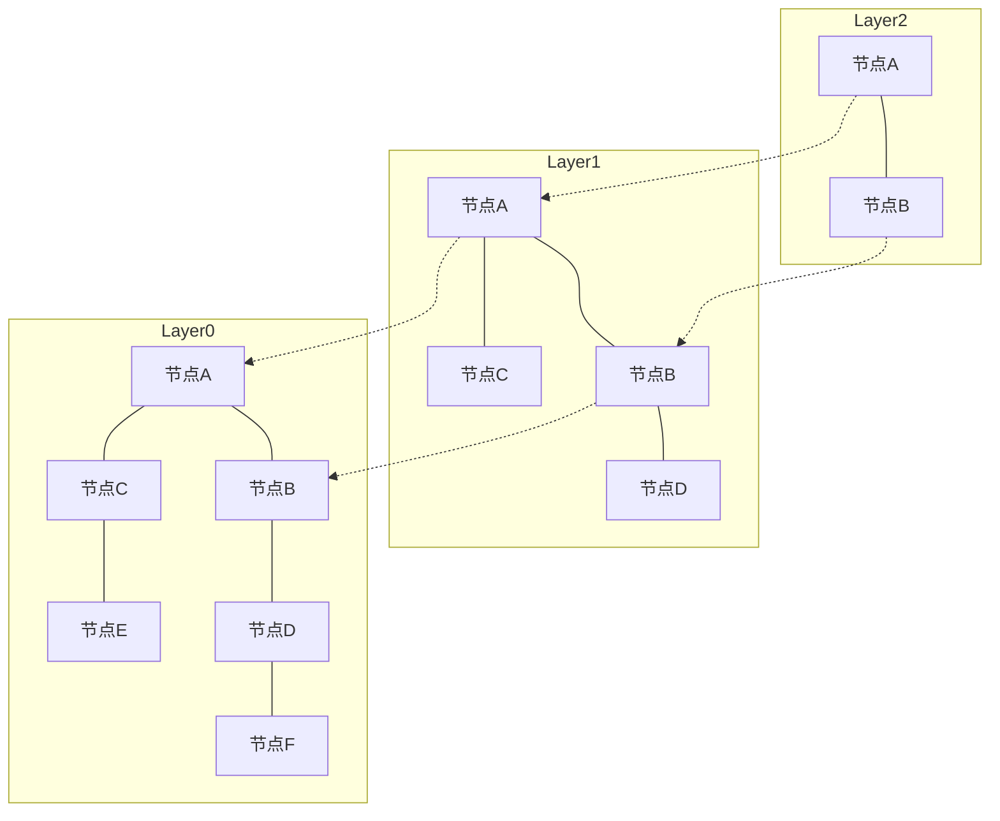

# 引言：RAG的兴起与向量数据库的重要性

近年来，随着大语言模型（LLM）的发展，被称为检索增强生成（Retrieval-Augmented Generation，RAG）的技术方法受到了广泛关注。RAG不仅依赖LLM自身具备的先验知识，还从外部知识库中检索（Retrieval）相关信息，并将这些信息融入提示词中以生成（Augmentation）回答。这种方法能够有效抑制幻觉（Hallucination），并基于最新的企业内部数据或专业知识提供高精度的回答。

而作为RAG不可或缺的基础设施，正是“向量数据库（Vector Database）”。传统的公理化关系型数据库或全文搜索引擎（如BM25等）通常基于关键词的完全匹配或词频来进行检索。然而，这种方式很难找出“含义相同但用词不同”的文本。向量数据库将数据存储为高维数值向量，通过计算向量空间中的距离（相似度），实现了基于语义相近程度的检索（语义检索，Semantic Search）。

本文将系统且深入地解析向量数据库的核心技术：从“嵌入表示（Embeddings）”的基础知识，到实现高速检索的核心算法“HNSW（分层可导航小世界，Hierarchical Navigable Small World）”的工作原理。

## 1. 什么是向量嵌入表示（Embeddings）

### 1.1 将语义转换为数值
自然语言处理中的“嵌入表示（Embeddings）”，是指将单词、句子、图像等数据转换为固定长度的连续数值向量（实数数组）的技术。例如，在300维或1536维的向量空间中，语义相近的词语或句子会被映射到空间中邻近的位置。

- “国王” - “男人” + “女人” = “女王”

这种语义层面的代数运算能够成立，正是通过Word2Vec等早期嵌入模型而广为人知的。如今，OpenAI的 `text-embedding-ada-002` 和 `text-embedding-3-small/large`、Cohere的Embed，以及开源的BERT系列模型（如Sentence-BERT等）得到了广泛应用。

### 1.2 高维空间的性质
现代嵌入模型输出的向量通常具有极高的维度（例如：768维、1536维等）。维度越高，模型的表达能力越丰富，但随之而来的是计算成本的大幅增加，并引发所谓的“维度灾难（Curse of Dimensionality）”。在高维空间中，任意两点之间的距离会趋于相近，导致近邻搜索的效率显著下降。向量数据库所面临的核心挑战之一，正是如何高效处理这些高维数据。

## 2. 相似度计算方法（Distance Metrics）

为了衡量向量之间的“语义相近度”，通常会使用几种数学距离函数（度量标准）。需要根据检索目的以及所使用的嵌入模型特性，选择合适的度量方法。

### 2.1 余弦相似度（Cosine Similarity）
通过计算两个向量夹角的余弦值来衡量相似度。它只考虑向量的“方向”，忽略“模长（范数）”。取值范围为 -1（方向完全相反）到 1（方向完全相同）。在衡量文本语义相似度时，这是最常用的指标。

### 2.2 欧几里得距离（Euclidean Distance / L2 Distance）
即向量空间中两点之间的直线距离。数值越小表示越相似。适用于图像特征比较等绝对位置关系至关重要的场景。

### 2.3 点积（Dot Product）
两个向量对应元素相乘后的累加和。当向量被归一化（模长为1）时，点积的计算结果与余弦相似度完全一致。由于计算步骤少、处理速度快，因此在许多系统中受到青睐。

## 3. 全量搜索（Exact Search）的局限与ANN

针对输入的查询向量，在数据库中找出最相似向量的任务被称为“k-近邻搜索（k-Nearest Neighbors，k-NN）”。

### 3.1 全量搜索（k-NN）的问题
最直观的方法是计算数据库中所有向量与查询向量之间的距离，按距离排序后返回前k个结果（即Flat Search / Exact Search）。
然而，这种方法的计算复杂度为 $O(N \times D)$（N为数据量，D为维度）。当数据量达到数百万乃至数亿级别时，单次检索可能需要耗费数秒甚至几十分钟，根本无法应用于需要实时响应的场景（如聊天机器人、推荐系统等）。

### 3.2 近似最近邻搜索（Approximate Nearest Neighbor，ANN）
为此，以牺牲极少许精度换取检索速度飞跃式提升的“近似最近邻搜索（ANN）”算法应运而生。ANN采取“不保证绝对找到最近的点，但以极高概率找到足够近的点”的策略。

主流的ANN算法主要分为以下几类：
- **基于树结构**：如KD-Tree、Annoy等。在低维场景下非常有效，但维度升高后会受到维度灾难的严重影响。
- **基于哈希**：LSH（局部敏感哈希，Locality-Sensitive Hashing）。采用让相近向量极易产生相同哈希值的哈希函数。
- **基于量化**：PQ（乘积量化，Product Quantization）。通过压缩向量来减少内存占用，并高速完成近似距离计算。
- **基于图结构**：HNSW（分层可导航小世界，Hierarchical Navigable Small World）。在目前的向量检索中，因在速度与精度之间取得了最佳平衡，成为了事实上的工业标准。

## 4. HNSW原理解析：基于图检索的巅峰

HNSW（Hierarchical Navigable Small World）是由 Yu. A. Malkov 等人提出的算法，巧妙结合了复杂网络理论与经典数据结构。正如其名，它由“小世界（Small World）”网络和“分层结构（Hierarchical）”两大核心概念构成。

### 4.1 可导航小世界（NSW）图
小世界现象（六度分隔理论）是指在现实世界的庞大网络（如人际关系网、互联网等）中，任意两个节点之间仅需经过很少的步骤（中继）即可相互连通。
NSW将这种性质应用到了向量空间中的近邻搜索中。它将每个数据点作为图的节点，彼此相近的节点之间通过边相连。与此同时，还会保留少量连接较远节点的“长距离边（Long-range links）”。

检索时，从随机节点出发，重复执行“移动到当前节点的邻居中与查询向量最近的节点”这一操作（贪心搜索，Greedy Search）。得益于长距离边的存在，算法可以在图中以“大步跨越”的方式快速移动，而在接近目标区域后再利用密集的短边进行微调，从而实现了高效的搜索。

### 4.2 通过分层结构（Hierarchical）实现跳表思想
NSW的短板在于，当节点数量庞大时，初期的“大步跨越”也需要消耗较多的步数。因此，HNSW借鉴了数据结构中“跳表（Skip List）”的思想，将图划分为多个分层（Layers）。

- **最底层（Layer 0）**：包含所有数据点的密集近邻图。
- **层级越高**：节点数量呈指数级抽稀，节点间的连接也更加稀疏。

### 4.3 HNSW检索算法（路由机制）
HNSW的检索过程从最顶层开始，按如下步骤进行：

1. **入口点（Entry Point）**：从最顶层预先确定的起始节点开始搜索。
2. **各层内部搜索**：在当前层中执行贪心搜索，找到距离查询向量最近的节点（局部最优）。
3. **下沉到下一层**：如果在当前层无法找到更近的节点，则以该节点为起点下沉到紧邻的下一层。
4. **最底层的最终搜索**：重复上述过程直到最底层（Layer 0），在Layer 0中执行贪心搜索并获取前k个最近的节点，作为最终的检索结果返回。

通过这种分层结构，检索在初期阶段可以在高层进行“大步跨越”的路由，快速定位目标所在的大致区域；随着层级逐渐下沉，逐步提高分辨率以进行精确搜索。这样使得检索的计算复杂度降至对数级别，即便面对数亿级别的数据，也能实现毫秒级的响应。

### 4.4 HNSW的构建与超参数
向HNSW图插入（Insert）新数据时，同样遵循类似搜索的过程：从最顶层向下逐层检索，在各层找到邻近节点并建立连接。
HNSW的性能主要受以下几个关键超参数的调控：

- **`M`**：单个节点最多可以拥有的双向边的数量。数值越大，检索精度越高，但内存占用会增加，建图与检索速度也会有所下降。
- **`efConstruction`**：构建图时，作为候选近邻节点保留的列表大小。该值越大，构建出的图质量（精度）越高，但索引构建所需的时间越长。
- **`efSearch`**：检索时动态保留的候选节点列表大小。该值越大，检索召回率（Recall）越高，但检索速度会降低。由于该参数可在检索时动态调整，因此可以根据具体业务场景灵活权衡精度与延迟。

## 5. 向量数据库的实现与生态系统

当前提供向量检索功能的软件层出不穷，主要可以划分为“专用向量数据库”、“算法库”以及“现有数据库扩展”三大类。

### 5.1 专用向量数据库
专为向量检索设计的分布式数据库，原生支持高可扩展性、高可用性以及混合检索。
- **Pinecone**：全托管的SaaS云服务。配置极简，在各类RAG应用的开发中被广泛使用。
- **Milvus**：开源分布式向量数据库。具备面向超大规模数据集的云原生架构。
- **Qdrant**：采用Rust语言编写的高性能向量数据库，其优势在于支持基于元数据的强大过滤功能。
- **Weaviate**：特色在于能够同时处理数据对象之间的图关系（模式Schema）与向量。

### 5.2 近似最近邻搜索算法库
用于在应用程序内存中直接构建索引并进行轻量化检索的库。
- **Faiss**：由Meta（原Facebook）AI研究团队开发的C++库。不仅支持HNSW，还提供了PQ（乘积量化）、IVF（倒排文件系统）等多种算法，并支持GPU超高速检索。
- **Hnswlib**：轻量且高速的HNSW算法C++实现。配置简单，非常适合基于内存运行的中小型项目。

### 5.3 现有数据库的向量扩展
在传统关系型数据库或搜索引擎中增加向量检索功能的扩展方案。
- **pgvector**：PostgreSQL的扩展模块。允许在SQL查询中直接进行向量距离计算和基于HNSW的高速搜索，极易与关系型数据进行JOIN和条件过滤。
- **Elasticsearch / OpenSearch**：在原有的强大全文搜索引擎中集成了高维向量ANN功能。在结合词法检索与语义检索的“混合检索”场景中极具优势。

## 6. 高阶检索方法：元数据过滤与混合检索

在实际业务应用中，不仅需要基于向量的“语义相似”，往往还需要结合业务逻辑进行数据筛选。

### 6.1 向量检索与过滤的权衡困境
将元数据过滤与ANN检索结合是一个技术难点：
- **后置过滤（Post-filtering）**：先通过向量检索获取Top-K候选集，随后利用元数据进行过滤。然而，如果过滤条件过于严苛，可能会导致最终返回的结果为0条。
- **前置过滤（Pre-filtering）**：先通过元数据筛选出候选子集，再在该子集上执行向量检索。然而，像HNSW这种图结构是针对全量数据进行全局优化的，一旦部分节点被禁用，可能导致图遍历路径中断而无法正常搜索。

现代向量数据库通过实现“Custom HNSW”或高级查询优化器来解决这一问题，能够根据过滤条件动态切换过滤与向量图遍历的执行策略。

### 6.2 混合检索的价值
向量检索长于捕捉“概念性语义”，但在处理“专有名词”或“特定型号”时往往表现欠佳。因此，将传统的基于关键词的全文检索（如BM25等）与向量检索并行执行，并将两者的得分进行加权融合以获得最终结果的“混合检索（Hybrid Search）”，已成为企业级RAG系统的最佳实践。

## 总结

向量数据库与HNSW算法是生成式AI时代应用开发、尤其是RAG系统中不可或缺的技术基石。通过将文本和图像的语义映射到多维空间坐标中，并利用HNSW的分层图结构，使得从数亿级数据中瞬间检索出“语义最相近”的信息成为可能。

从过去依赖完全匹配的传统检索技术，转向更贴近人类认知的“语义检索”，这一技术范式转移已经拉开序幕。深入理解本文所介绍的向量距离概念、ANN的必要性、HNSW的内部架构以及多样化的数据库选型，将为设计与开发更先进、更具实用价值的AI应用奠定坚实的基础。
