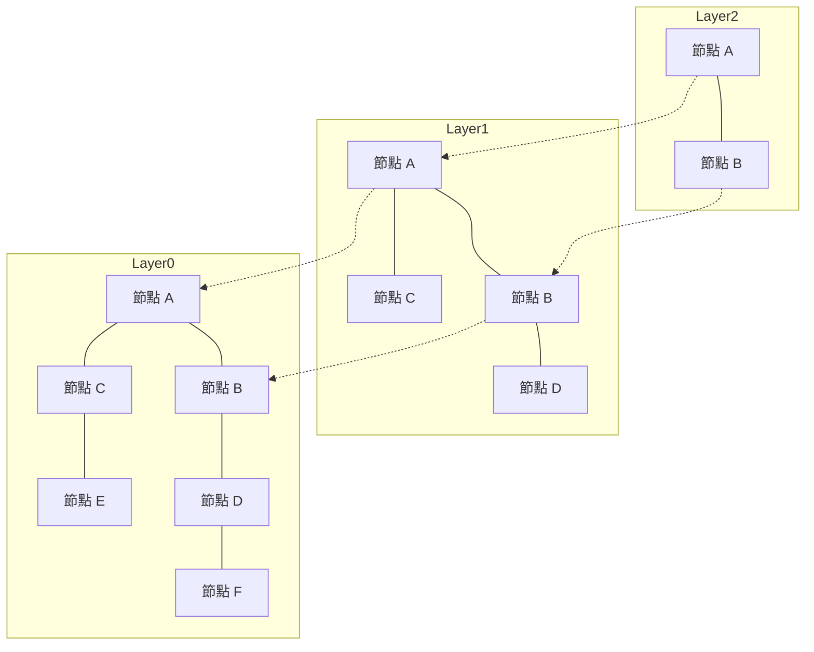

# 前言：RAG 的崛起與向量資料庫的重要性

近年來，隨著大型語言模型（LLM）的飛速發展，一種名為檢索增強生成（Retrieval-Augmented Generation，簡稱 RAG）的架構備受矚目。RAG 不僅依賴 LLM 本身具備的預訓練知識，還能從外部知識庫中檢索（Retrieval）相關資訊，並將其整合至提示詞（Prompt）中以生成回答（Augmentation）。這種做法能有效抑制模型產生的「幻覺」（Hallucination），並基於企業最新的內部資料或專業領域知識，提供高度精準的回答。

而作為 RAG 架構核心基石、不可或缺的技術，正是「向量資料庫（Vector Database）」。傳統的關聯式資料庫或全文搜尋引擎（如 BM25 等），主要是依賴關鍵字的精確匹配與出現頻率來進行檢索。然而，這種方式很難找出「語意相同但用詞完全不同」的文本。向量資料庫將各種類型的資料轉換並儲存為高維度的數值向量，透過計算向量空間中的距離（相似度），實現以語意相近度為基準的檢索方式（語意搜尋，Semantic Search）。

本文將從構成向量資料庫基礎的「向量嵌入（Embeddings）」概念談起，進而深入且系統性地解析實現超高速檢索的關鍵演算法——「HNSW（Hierarchical Navigable Small World）」的運作原理。

## 1. 什麼是向量嵌入（Embeddings）

### 1.1 將語意轉化為數值
在自然語言處理領域中，「向量嵌入（Embeddings）」是指將單詞、句子甚至圖片等非結構化資料，轉換為固定長度的連續數值向量（實數陣列）的技術。例如，在 300 維或 1536 維的向量空間中，語意相近的詞彙或句子會被分佈在空間中相對接近的位置。

- 「國王」 - 「男人」 + 「女人」 = 「女王」

這種語意運算能夠在向量空間中成立，最早是透過 Word2Vec 等早期嵌入模型廣為人知。而在現代，OpenAI 的 `text-embedding-ada-002` 與 `text-embedding-3-small/large`、Cohere 的 Embed，以及開源的 BERT 系列模型（例如 Sentence-BERT 等），都已被廣泛應用。

### 1.2 高維空間的特性
現代嵌入模型輸出的向量維度通常極高（例如 768 維、1536 維等）。維度越高，模型的語意表達能力就越豐富，但同時計算成本也會顯著增加，並引發所謂的「維度詛咒（Curse of Dimensionality）」。在高維空間中，任意兩點之間的距離往往會趨於相似，使得近鄰搜尋的效率大幅下降。向量資料庫所要解決的核心難題之一，正是如何在高維資料環境下維持高效率的運作。

## 2. 相似度計算方法（Distance Metrics）

為了衡量向量之間的「語意相似度」，數學上常使用幾種不同的距離函數（度量標準，Metrics）。開發者需要根據檢索目的以及所採用的嵌入模型特性，選擇合適的度量指標。

### 2.1 餘弦相似度（Cosine Similarity）
餘弦相似度透過計算兩個向量之間夾角的餘弦值來評估相似程度。它只關注向量的「方向」，而忽略向量的「長度（模長 / Norm）」。其取值範圍落在 -1（完全相反）到 1（方向完全一致）之間。在評估文本語意相似度時，這是最普遍採用的指標。

### 2.2 歐幾里得距離（Euclidean Distance / L2 Distance）
即向量空間中兩點之間的直線距離。數值越小，代表兩者越相近。當絕對位置關係具備物理或特徵意義時（例如影像特徵比對），非常適合使用此距離。

### 2.3 內積（Dot Product）
將兩個向量的對應元素相乘後加總的值。當向量已經過正規化（Normalized，即向量長度統一為 1）時，內積的計算結果與餘弦相似度完全一致。由於其計算步驟精簡、硬體運算速度極快，在許多實際系統中備受青睞。

## 3. 精確搜尋（Exact Search）的極限與 ANN

針對輸入的查詢向量（Query Vector），從資料庫中找出最相似向量的任務稱為「k-最近鄰搜尋（k-Nearest Neighbors，k-NN）」。

### 3.1 精確搜尋（k-NN）的瓶頸
最簡單直觀的方法，是將查詢向量與資料庫中所有的向量逐一計算距離，再按照距離由近到遠排序，取出前 k 個結果（稱為 Flat Search 或 Exact Search）。
然而，這種方法的運算複雜度為 $O(N \times D)$（其中 N 為資料筆數，D 為向量維度）。當資料量達到數百萬甚至數億筆時，單次檢索可能需要耗費數秒到數十分鐘，根本無法滿足即時應用程式（如聊天機器人、推薦系統等）的低延遲需求。

### 3.2 近似最近鄰搜尋（Approximate Nearest Neighbor，ANN）
為了突破這項效能瓶頸，「近似最近鄰搜尋（ANN）」演算法應運而生。ANN 的核心思維是：允許犧牲極少量的精準度，以換取檢索速度的劇烈提升。ANN 的原則是「雖然不保證百分之百找到全域絕對最近的鄰居，但能在極高機率下快速找到足夠接近的項目」。

常見的 ANN 演算法類型包括：
- **樹狀結構（Tree-based）**: 例如 KD-Tree、Annoy 等。在低維度空間效果良好，但進入高維空間時容易受到維度詛咒的強烈衝擊。
- **雜湊結構（Hash-based）**: 例如 LSH（局部敏感雜湊，Locality-Sensitive Hashing）。利用特殊的雜湊函數，讓距離相近的向量有較高機率對應到相同的雜湊值。
- **量化結構（Quantization-based）**: 例如 PQ（乘積量化，Product Quantization）。透過對向量進行壓縮以減少記憶體佔用，並大幅加速近似距離計算。
- **圖形結構（Graph-based）**: 例如 HNSW（Hierarchical Navigable Small World）。在目前的向量搜尋領域中，被公認為在速度與準確率之間達到最佳平衡的演算法，已成為事實上的業界標準（De facto standard）。

## 4. HNSW 運作原理：圖形搜尋的巔峰之作

HNSW（Hierarchical Navigable Small World）是由 Yu. A. Malkov 等人提出的演算法，結合了複雜網路理論與高效資料結構。正如其名，它由「小世界（Small World）」網路與「階層架構（Hierarchical）」兩大核心概念構建而成。

### 4.1 可導航小世界（NSW）圖
小世界現象（源自「六度分隔理論」）是指在許多現實世界的巨型網路（如人際關係網、網際網路等）中，任意兩個節點之間通常只需透過少數幾個中繼節點即可連通。
NSW 將這項特性應用於向量空間的近鄰搜尋。它將每個資料點視為圖中的節點，並在距離相近的節點之間建立邊（Edge）。與此同時，也會保留少數連接距離較遠節點的「長距離邊（Long-range Edges）」。

進行檢索時，演算法從隨機節點出發，重複執行「移動至當前節點的所有鄰居中，與查詢向量最接近的節點」此一步驟（貪婪搜尋，Greedy Search）。藉助長距離邊的幫助，演算法能以「大步跨越」的方式在圖中迅速逼近目標區域；當抵達目標附近後，再利用密集的短距離邊進行細緻調整，實現了極高效率的探索。

### 4.2 引入階層結構（Hierarchical）的跳躍表（Skip List）思維
NSW 的缺陷在於：當節點總數大幅增加時，即使是初期的「大步跨越」階段，所需的跳轉步數也會顯著增多。為了解決這個問題，HNSW 借鑒了經典資料結構「跳躍表（Skip List）」的概念，將整個圖分割為多個層次（Layer）。

- **最底層（Layer 0）**: 包含資料集中所有資料點的高密度近鄰圖。
- **越往上層**: 節點數量呈指數級減少，邊的連結也變得更加稀疏。

### 4.3 HNSW 的檢索演算法（路由機制）
在 HNSW 中進行檢索時，流程會從最頂層開始，逐步向下推進：

1. **入口點（Entry Point）**: 從最頂層預先設定的起始節點展開搜尋。
2. **各層內的搜尋**: 在當前層執行貪婪搜尋（Greedy Search），找出該層中與查詢向量最接近的節點（局部最小值，Local Minimum）。
3. **切換至下一層**: 當在該層無法找到更接近的節點時，便以該節點作為下一層的入口點，垂直向下移動至下一層。
4. **最底層的最終檢索**: 重複上述步驟直至抵達最底層（Layer 0）。在 Layer 0 進行精細的貪婪搜尋，並返回最終評估出的前 k 個最鄰近節點作為搜尋結果。

透過這種分層架構，檢索初期能夠在上層以「大跨步」迅速鎖定目標區域，隨著層層向下推進，解析度逐步提高，最後在底層完成精準定位。這使得檢索的時間複雜度降至對數等級（Logarithmic time），即便面對數億筆規模的資料庫，也能達到毫秒級的響應速度。

### 4.4 HNSW 的構建與超參數
當要向 HNSW 圖中插入新資料（Insert）時，流程與搜尋類似：同樣從最頂層向下檢索，並在相應的層級中尋找最近鄰節點以建立連線。
HNSW 的效能與資源消耗主要由以下幾個核心超參數控制：

- **`M`**: 每個節點能擁有的雙向邊最大數量。調大該數值可提升檢索精準度，但會增加記憶體消耗，並降低索引建立與檢索的速度。
- **`efConstruction`**: 在建立圖索引時，作為候選近鄰節點所保留的清單大小。數值越大，產生的圖結構品質（精準度）越高，但建立索引所需的時間也越長。
- **`efSearch`**: 執行查詢時保留的候選清單大小。數值越大，檢索召回率（Recall）越高，但查詢速度會相應下降。該參數可在查詢時動態調整，讓應用程式能靈活地在精確度與延遲之間取得平衡。

## 5. 向量資料庫的實作與生態系

目前市面上提供向量檢索功能的軟體相當豐富，主要可劃分為「專用向量資料庫」、「近似最近鄰檢索函式庫」以及「現有資料庫的向量擴充」三大類別。

### 5.1 專用向量資料庫
專為向量檢索量身打造的分散式資料庫系統，原生支援水平擴展、高可用性以及混合搜尋功能。
- **Pinecone**: 全代管式（Fully Managed）SaaS 服務。開箱即用、配置極其簡單，在各類 RAG 應用開發中被廣泛採用。
- **Milvus**: 開源的分散式向量資料庫，具備雲原生架構，特別適合處理超大規模的資料集。
- **Qdrant**: 以 Rust 語言打造的高效能向量資料庫，強項在於提供強大且豐富的元資料篩選功能。
- **Weaviate**: 其特色在於能同時管理資料物件之間的圖形關聯性（Schema）與向量特徵。

### 5.2 近似最近鄰檢索函式庫
直接在應用程式記憶體中建立索引並進行輕量檢索的函式庫。
- **Faiss**: 由 Meta（原 Facebook）AI 研究團隊開發的 C++ 函式庫。不僅支援 HNSW，還涵蓋 PQ（乘積量化）、IVF（倒排檔案）等多種演算法，且具備出色的 GPU 加速能力。
- **Hnswlib**: HNSW 演算法的輕量級高效 C++ 實作。設定簡潔明瞭，非常適用於運行於記憶體中的中小型專案。

### 5.3 現有資料庫的向量擴充
在傳統關聯式資料庫或搜尋引擎中加入向量搜尋能力的外掛或模組。
- **pgvector**: PostgreSQL 的向量擴充套件。允許直接在 SQL 查詢中執行向量距離計算與 HNSW 索引搜尋，能輕鬆實現關聯式資料與向量資料的 JOIN 與篩選。
- **Elasticsearch / OpenSearch**: 在原本強大的全文搜尋引擎基礎上整合了高維向量 ANN 功能。在結合詞彙搜尋（Lexical Search）與語意搜尋（Semantic Search）的「混合搜尋」場景中表現格外強勁。

## 6. 進階檢索技術：元資料篩選與混合搜尋

在實際的生產環境應用中，往往不能僅依賴向量的「語意相近度」，還需要結合業務邏輯進行精確篩選。

### 6.1 向量檢索與條件篩選的兩難
將元資料篩選（Metadata Filtering）與 ANN 檢索互相結合，在技術實現上具有相當的挑戰性：
- **後篩選（Post-filtering）**: 先透過向量檢索找出相似度最高的前 N 筆資料，隨後再利用元資料進行條件過濾。然而，若篩選條件過於嚴苛，極有可能導致最終返回的結果數量為 0。
- **前篩選（Pre-filtering）**: 先依據元資料條件過濾出符合資格的資料子集，再於該子集中進行向量搜尋。但像 HNSW 這類圖結構通常是針對全域節點進行優化的，若直接停用或忽略部分節點，可能導致圖的連通性被破壞而無法順暢遍歷。

現代向量資料庫為解決此難題，開發了「自訂 HNSW（Custom HNSW）」演算法與高度智慧的查詢最佳化器（Query Optimizer），能依據條件自動動態切換篩選與向量探索的先後策略。

### 6.2 混合搜尋的真正價值
向量搜尋雖然擅長捕捉「抽象概念的語意」，但在檢索「專有名詞」或「特定產品型號」時往往力不從心。因此，將傳統基於關鍵字的全文檢索（如 BM25）與現代向量搜尋並行運作，並融合兩者的評分以輸出最終排名的「混合搜尋（Hybrid Search）」，已逐漸成為企業級 RAG 系統的最佳實踐架構。

## 總結

向量資料庫與 HNSW 演算法，是生成式 AI 時代應用（特別是 RAG 系統）不可或缺的技術基石。透過將文字與圖像的深層意涵映射至高維度空間座標，並結合 HNSW 的分層圖結構，即便在數億筆規模的海量資料中，也能在瞬間抽取出「語意上最相近」的資訊。

從仰賴關鍵字精確比對的傳統檢索技術，邁向更貼近人類認知模式的「語意檢索」，這場搜尋技術的典範轉移早已悄然展開。透徹理解本文所剖析的向量距離概念、ANN 的必要性、HNSW 的底層架構，以及各類資料庫方案的優缺點，將有助於你在未來的系統設計與架構規劃中，打造出更具智慧與效能的 AI 應用。
