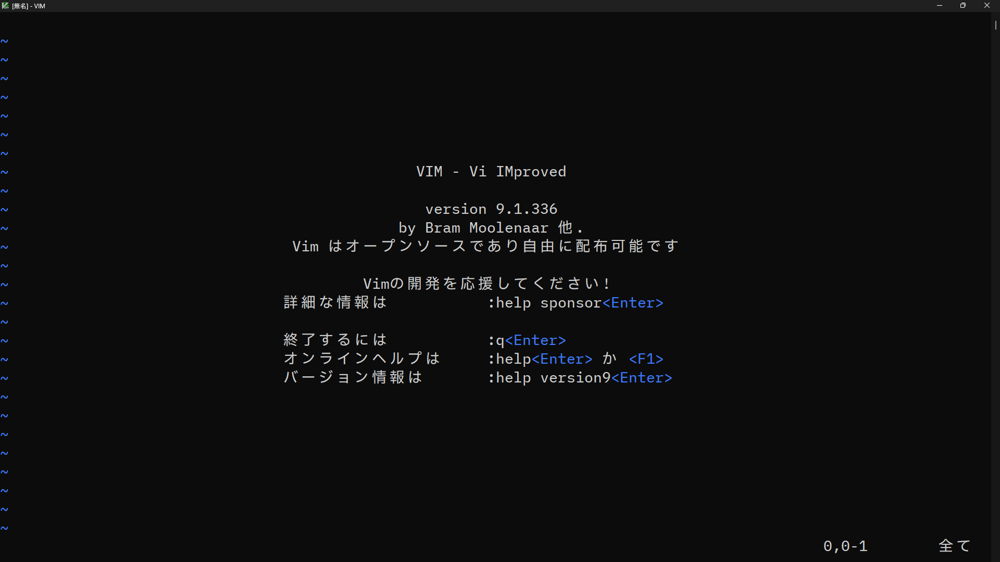

# مقدمة إلى Vim

## التنزيل والتثبيت

[https://www.vim.org/download.php](https://www.vim.org/download.php)

قم بتنزيل الوحدة وتثبيتها لنظام التشغيل الخاص بك من الموقع أعلاه.

بالنسبة لنظام التشغيل Windows، من الأفضل اختيار `gvim_X.X.X_x64_signed.exe`.

## كيفية التشغيل

في حالة Windows، يجب تسجيل المجلد الذي يحتوي على `vim.exe` في مسار متغيرات البيئة Path.

طريقة التشغيل

```
vim
```

إذا كنت تريد التشغيل بتحديد اسم ملف

```
vim filename.txt
```

## كيفية الخروج

للخروج، اكتب `:` (نقطتين)، ثم اكتب `q`، واضغط على Enter
```
:q
```

إذا قمت بتحديث الملف، فسيتم عرض `لم يتم الحفظ منذ آخر تغيير (أضف ! للتجاوز)`.
يمكنك تجاهل التغييرات والخروج بالقوة.
```
:q!
```

لحفظ الملف والخروج
```
:wq
```

التالي له نفس المعنى.
```
:x
```

يمكنك أيضًا الخروج بالضغط على `z` مرتين مع الاستمرار في الضغط على `Shift`. (نفس :wq)

## الأوضاع

يحتوي Vim على `وضع الأوامر` و`وضع الإدخال`. عند تشغيل vim، سيكون في `وضع الأوامر`، وسيؤدي الضغط على مفتاح `i` إلى التبديل إلى `وضع الإدخال`.

في `وضع الإدخال`، يمكنك الكتابة كالمعتاد. للتبديل من `وضع الإدخال` إلى `وضع الأوامر`، اضغط على مفتاح `ESC`.

إن وجود تبديل الأوضاع هذا هو من خصائص Vim.

## حركة المؤشر والتمرير

فيما يلي ملخص لحركة المؤشر والتمرير في `وضع الأوامر`.

| المفتاح                            | الوصف                 |
|------------------------------------|-------------------------|
| `h` (أو `Ctrl`+`H`، `BackSpace`، `←`) | الانتقال إلى اليسار     |
| `j` (أو `Ctrl`+`J`، `N`، `↓`)         | الانتقال إلى الأسفل     |
| `k` (أو `Ctrl`+`P`، `↑`)             | الانتقال إلى الأعلى     |
| `l` (أو `Space`، `→`)               | الانتقال إلى اليمين     |
| `+` (أو `Enter`)                   | الانتقال إلى بداية السطر التالي |
| `-`                                | الانتقال إلى بداية السطر السابق |
| `Ctrl`+`B` (أو `PageUp`)            | التمرير لأعلى          |
| `Ctrl`+`F` (أو `PageDown`)          | التمرير لأسفل          |
| `Ctrl`+`U`                         | التمرير لأعلى نصف شاشة  |
| `Ctrl`+`D`                         | التمرير لأسفل نصف شاشة  |
| `Ctrl`+`Y`                         | التمرير لأعلى سطراً واحداً |
| `Ctrl`+`E`                         | التمرير لأسفل سطراً واحداً |
| `z` `Enter`                        | تمرير سطر المؤشر إلى أعلى الشاشة |
| `z` `.`                            | تمرير سطر المؤشر إلى وسط الشاشة |
| `z` `-`                            | تمرير سطر المؤشر إلى أسفل الشاشة |
| `0` (أو `\|`)                       | نقل المؤشر إلى بداية السطر |
| `$`                                | نقل المؤشر إلى نهاية السطر |
| `^` (أو `_`)                        | نقل المؤشر إلى بداية السطر (باستثناء المسافات وعلامات الجدولة) |
| `G` (أو `:$`)                       | نقل المؤشر إلى السطر الأخير |
| `:رقم السطر` `Enter`               | الانتقال إلى السطر المحدد |

إذا قمت بإدخال مفاتيح الحركة أعلاه بعد `رقم`، فيمكنك الانتقال عدة مرات بمقدار ذلك الرقم.
(على سبيل المثال، كتابة `3j` ستنقلك 3 أسطر لأسفل من موضع المؤشر الحالي.)

## أوامر أخرى

| المفتاح      | الوصف                |
|------------|----------------------|
| `Ctrl`+`L` | إعادة رسم الشاشة       |
| `Ctrl`+`G` | عرض عدد أسطر الملف بأكمله، وموضع المؤشر، وما إلى ذلك |
