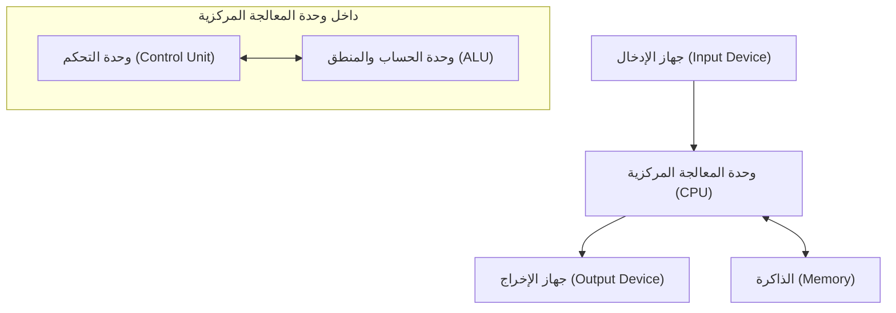

## 1. مقدمة

كان جون فون نيومان (1903-1957) عالم رياضيات عبقريًا مَثّل القرن العشرين وكان له تأثير لا يقاس على جميع مجالات العلوم الحديثة. لقد تجاوزت إنجازاته الرياضيات البحتة بكثير، لتمتد إلى ميكانيكا الكم، ونظرية الألعاب، وعلوم الحاسوب، والاقتصاد، والأرصاد الجوية، وحتى تطوير القنبلة الذرية. وبسبب قدرته الاستثنائية على الحساب وتفكيره المنطقي، كان معاصروه يهابونه ويحترمونه، ويطلقون عليه لقب "الدماغ الشيطاني" و"المريخي".

سيوضح هذا المقال بالتفصيل حياة فون نيومان، وإنجازاته الهائلة، والعديد من الحكايات التي تركها وراءه. دعونا نستكشف بعمق نوع التفكير الذي كان يمتلكه وكيف بنى أسس المجتمع الحديث. إن تتبع خطاه لا يقل عن تتبع تاريخ تطور العلم الحديث نفسه.

## 2. ولادة معجزة: الطفولة في بودابست

ولد جون فون نيومان (الاسم المجري: نيومان يانوش لايوش) عام 1903 في بودابست، المجر، في عائلة مصرفية يهودية ثرية. منذ سن مبكرة، أظهر ذاكرة وقدرة استثنائية على الحساب، وأظهر حقًا مواهب تستحق أن يُطلق عليها **معجزة**. يقال إنه كان يستطيع إجراء عمليات قسمة من ثمانية أرقام في ذهنه في سن السادسة، وأتقن التفاضل والتكامل في سن الثامنة. كان أيضًا بارعًا للغاية في اللغات، حيث تعلم اليونانية واللاتينية منذ سن مبكرة، وكان يتبادل النكات باللغة اليونانية الكلاسيكية مع والده.

في ذلك الوقت، كانت بودابست مركزًا عالميًا للثقافة والمعرفة، وأنتجت العديد من العلماء اليهود اللامعين. يوجين ويغنر، وليو زيلارد، وإدوارد تيلر، وغيرهم من العلماء الذين أصبحوا نشطين لاحقًا في الولايات المتحدة، كانوا جميعًا من بودابست مثل فون نيومان، وبسبب مواهبهم الفريدة، أطلق عليهم مجتمعين اسم **المريخيون** (Martians). نشأ فون نيومان في هذه البيئة الفكرية الممتازة، ووصل إلى مستوى حيث كان ينشر بالفعل أوراقًا رياضية في المدرسة الثانوية.

## 3. المساهمات في أسس الرياضيات: نظرية المجموعات البديهية

كانت إحدى أهم إنجازات فون نيومان المبكرة أبحاثه حول بديهية نظرية المجموعات. كان من المتوقع أن تكون نظرية المجموعات، التي أسسها [جورج كانتور](https://kenji.blog/ar/p/cantor/)، أساس الرياضيات، لكنها واجهت تناقضات منطقية (مفارقات) مثل مفارقة راسل. لحل هذه المشكلة، كان إرنست تسيرميلو وأدولف فرانكل وآخرون يبنون نظرية المجموعات البديهية، لكن فون نيومان اتبع نهجًا مختلفًا.

أدخل مفهوم "الفئات" وتجنب المفارقات ببراعة من خلال التمييز الصارم بين المجموعات العادية والفئات الأكبر من أن تكون مجموعات (الفئات الحقيقية). تم تحسين هذا النظام لاحقًا بواسطة بول بيرنايز و[كورت غودل](https://kenji.blog/ar/p/godel/)، ويُعرف الآن باسم **نظرية مجموعات فون نيومان - بيرنايز - غودل** (نظرية مجموعات NBG).

$$
\forall X \ ( X \in V \iff \exists Y \ (X \in Y) )
$$

هنا، يمثل $V$ **فئة كل المجموعات** ( $\text{الفئة الشاملة}$ ). أصبح هذا البحث التأسيسي مساهمة مهمة تدعم جذور الرياضيات.

## 4. الأسس الرياضية لميكانيكا الكم

في أواخر عشرينيات القرن العشرين، كانت ميكانيكا الكم تتطور كنظريتين مختلفتين تمامًا على ما يبدو: "ميكانيكا المصفوفات" لفيرنر هايزنبيرغ و "ميكانيكا الموجات" لإروين شرودنغر. أثبت فون نيومان أن هاتين النظريتين متكافئتان رياضيًا، مما أعطى ميكانيكا الكم أساسًا رياضيًا صارمًا.

باستخدام نظرية **فضاء هيلبرت**، صاغ الكميات الفيزيائية (التي يمكن ملاحظتها) كعوامل مرافقة ذاتية في فضاء هيلبرت اللانهائي الأبعاد. يعتبر كتابه "الأسس الرياضية لميكانيكا الكم"، الذي نُشر عام 1932، بمثابة كتاب مقدس حتى لفيزيائيي العصر الحديث، ولا يزال يحظى بتقدير كبير اليوم ككتاب مدرسي قياسي لميكانيكا الكم.

كما أدخل مفهوم **مصفوفة الكثافة** ( $\text{مصفوفة الكثافة}$ ) لوصف الحالات المختلطة، مما أرسى أسس الميكانيكا الإحصائية الكمومية.

$$
\rho = \sum_{i} p_i |\psi_i\rangle \langle\psi_i|
$$

هنا، يمثل $p_i$ الاحتمال ( $\text{وزن الاحتمال}$ ) لاتخاذ الحالة $|\psi_i\rangle$. كما أجرى اعتبارات عميقة حول "انهيار الحزمة الموجية" و "مشكلة القياس" في نظرية القياس الكمومي.

## 5. نظرية الألعاب والسلوك الاقتصادي

انطلاقًا من تحليل الاستراتيجيات في ألعاب مثل البوكر، أسس فون نيومان مجالًا جديدًا تمامًا في الرياضيات يسمى "نظرية الألعاب". في عام 1928، أثبت **مبرهنة الحد الأدنى والأعلى (Minimax)**، والتي تنص على أنه في لعبة معلومات كاملة وحتمية ومنتهية الصفرية لشخصين، إذا تبنى كلا الطرفين استراتيجيات مثالية، فإن النتيجة ستستقر دائمًا عند نتيجة معينة.

$$
\max_{x \in X} \min_{y \in Y} f(x, y) = \min_{y \in Y} \max_{x \in X} f(x, y)
$$

يمثل الجانب الأيسر من هذه المعادلة استراتيجية "تقليل الخسارة في أسوأ الحالات" ( $\text{استراتيجية ماكسيمن}$ )، ويمثل الجانب الأيمن استراتيجية "تعظيم الربح الخاص ضد أفضل حركة للخصم".

في وقت لاحق، شارك في تأليف العمل الضخم "نظرية الألعاب والسلوك الاقتصادي" (1944) مع الاقتصادي أوسكار مورغنشتيرن، مما أحدث ثورة في الاقتصاد. كانت هذه محاولة لنمذجة عملية صنع القرار البشري العقلاني رياضيًا، واليوم يتم تطبيقها في مجموعة واسعة من المجالات، ليس فقط في الاقتصاد ولكن أيضًا في العلوم السياسية وعلم الأحياء والاستراتيجية العسكرية.

## 6. علوم الحاسوب وبنية فون نيومان

تم بناء جميع أجهزة الكمبيوتر الحديثة تقريبًا بناءً على **بنية فون نيومان** التي ابتكرها. واقترح "مفهوم البرنامج المخزن"، حيث يتم تخزين البرامج في الذاكرة كبيانات وقراءتها وتنفيذها بالتتابع.

تتكون هذه البنية من العناصر الرئيسية التالية:

شارك فون نيومان في مشروع تطوير EDVAC في جامعة بنسلفانيا ولخص هذا المفهوم الرائد في "المسودة الأولى لتقرير عن EDVAC". وقد جعل هذا من الممكن تحقيق جهاز كمبيوتر للأغراض العامة يمكنه إجراء عمليات حسابية مختلفة ببساطة عن طريق إعادة كتابة البرنامج (السوفتوير) دون الحاجة إلى إعادة توصيل الأجهزة ماديًا. بُني مجتمع تكنولوجيا المعلومات الحديث على هذا الأساس الذي أسسه.

## 7. الأتمتة الخلوية ونظرية الآلات ذاتية التكاثر

في سنواته الأخيرة، أبدى فون نيومان اهتمامًا قويًا بنمذجة آليات التكاثر الذاتي البيولوجي رياضيًا. وبنصيحة من زميله ستانيسلاف أولام، ابتكر مفهوم **الأتمتة الخلوية**، حيث يتم تقسيم المساحة إلى شبكة، وتقوم كل خلية في الشبكة بتغيير حالتها وفقًا لقاعدة معينة.

باستخدام خلايا ذات 29 حالة، أثبت بدقة أن الآلة ذاتية التكاثر (المنشئ العالمي) ممكنة نظريًا. كان هذا قبل اكتشاف البنية الحلزونية المزدوجة للحمض النووي، ويمكن القول إنه تنبأ بالآليات الجينية وأنظمة نقل المعلومات للحياة من منظور علوم المعلومات. بعد وفاته، أدت هذه النظرية إلى أبحاث في الحياة الاصطناعية.

## 8. مشروع مانهاتن والمساهمات في ديناميكا الموائع

خلال الحرب العالمية الثانية، شارك فون نيومان في "مشروع مانهاتن" لتطوير القنبلة الذرية في مختبر لوس ألاموس الوطني. لعب دورًا مركزيًا في ديناميكا الموائع وحسابات موجة الصدمة، وقام بإجراء الحسابات المعقدة الضرورية لتصميم العدسات المتفجرة للقنبلة الذرية من نوع البلوتونيوم (الرجل البدين). يقال إنه لولا نظريته حول تفاعل موجات الصدمة وقدرته الهائلة على الحساب، لكان التطوير قد تأخر بشكل كبير.

حتى بعد الحرب، استمر في التمتع بتأثير قوي ككبير المستشارين في السياسة العسكرية والعلمية للحكومة الأمريكية، وقاد مشاريع وطنية مثل تطوير الصواريخ الباليستية والتنبؤ العددي بالطقس (أول توقعات طقس تعتمد على الكمبيوتر في العالم).

## 9. الرجل الذي يُدعى "المريخي": حكايات غير عادية عن عبقري

هناك عدد لا يحصى من الحكايات التي تحيط بدماغ فون نيومان الخارق.

* **سرعة حساب مذهلة**: للتحقق مما إذا كانت النتائج التي حسبها ENIAC (جهاز كمبيوتر إلكتروني مبكر) صحيحة، أجرى فون نيومان حسابات ذهنية للتحقق منها، وتقول الأسطورة إن فون نيومان انتهى من الحساب بشكل أسرع.
* **ذاكرة فوتوغرافية مثالية**: كان بإمكانه حفظ محتويات الكتب وأدلة الهاتف كلمة بكلمة بعد قراءتها مرة واحدة. عندما طُلب منه "إلقاء بداية قصة مدينتين" بعد عقود، يُقال إنه استمر في إلقائها بشكل مثالي لعشرات الدقائق حتى أوقفه صديقه.
* **القيادة والضوضاء**: كان سائقًا سيئًا للغاية وكثيرًا ما تسبب في حوادث. هناك حكاية قدم فيها عذرًا: "لم تبتعد الأشجار عن طريقي". كان يفضل أيضًا البيئات الصاخبة على الصمت وأجرى أبحاثًا رياضية معقدة أثناء تشغيل موسيقى مسيرة ألمانية بصوت عالٍ في مكتبه.
* **نكتة المريخي**: كان زملاؤه الفيزيائيون يمزحون بشكل نصف جدي: "فون نيومان مريخي يعيش على الأرض ويتظاهر بأنه إنسان. ومع ذلك، فهو قادر على تقليد إنسان بشكل مثالي".

## 10. الكتب والمقالات الرئيسية

تتنوع الكتب والمقالات التي تركها فون نيومان وراءه خلال حياته، ولكننا نقدم هنا أعمالًا تمثيلية كان لها تأثير كبير بشكل خاص على الأجيال اللاحقة.

1. **الأسس الرياضية لميكانيكا الكم (1932)**
   عمل ضخم صاغ بدقة ميكانيكا الكم باستخدام نظرية فضاءات هيلبرت.
2. **نظرية الألعاب والسلوك الاقتصادي (1944)**
   شارك في تأليفه مع أوسكار مورغنشتيرن. تحفة فنية ناقشت بشكل منهجي كل شيء بدءًا من ألعاب المجموع الصفري إلى الألعاب التعاونية.
3. **الكمبيوتر والدماغ (1958)**
   مخطوطة غير مكتملة نُشرت بعد وفاته. عمل رائد يقارن الشبكات العصبية للدماغ البشري بآليات أجهزة الكمبيوتر الرقمية.
4. **نظرية الأتمتة ذاتية التكاثر (1966)**
   تم تجميعها ونشرها من مخطوطات فون نيومان بعد وفاته بواسطة آرثر بيركس.

## 11. جون فون نيومان: تسلسل زمني موجز

فيما يلي جدول زمني مفصل يلخص حياة جون فون نيومان وإنجازاته الرئيسية.

* **1903**: ولد في بودابست، مملكة المجر.
* **1911**: دخل صالة ألعاب رياضية لوثرية.
* **1921**: دخل جامعة بودابست، تخصص في الرياضيات. درس في وقت واحد الكيمياء في جامعة برلين والمعهد الفدرالي السويسري للتكنولوجيا في زيورخ.
* **1926**: حصل على درجة الدكتوراه في الرياضيات من جامعة بودابست.
* **1928**: أثبت نظرية الحد الأدنى والأعلى (Minimax)، مما أرسى أسس نظرية الألعاب.
* **1930**: انتقل إلى الولايات المتحدة كأستاذ زائر في جامعة برينستون.
* **1932**: نشر "الأسس الرياضية لميكانيكا الكم".
* **1933**: تم تعيينه أستاذًا مدى الحياة في معهد الدراسات المتقدمة في برينستون. أصبح أحد أعضائه الأوائل إلى جانب ألبرت أينشتاين وآخرين.
* **1937**: حصل على جنسية الولايات المتحدة الأمريكية.
* **1943**: شارك في مشروع مانهاتن، وقاد حسابات العدسات المتفجرة.
* **1944**: نشر "نظرية الألعاب والسلوك الاقتصادي".
* **1945**: كتب "المسودة الأولى لتقرير عن EDVAC"، مقترحًا مفهوم البرنامج المخزن.
* **1948**: أعلن عن نظرية الأتمتة الخلوية ومفهوم الآلات ذاتية التكاثر.
* **1951**: أصبح رئيسًا للجمعية الرياضية الأمريكية.
* **1954**: تم تعيينه عضوًا في هيئة الطاقة الذرية الأمريكية.
* **1955**: تم تشخيصه بسرطان العظام (أو سرطان البنكرياس) وبدأ معركة مع المرض.
* **1957**: توفي في مركز والتر ريد الطبي العسكري في واشنطن العاصمة عن عمر يناهز 53 عامًا.

## 12. الخاتمة

توفي جون فون نيومان عام 1957 في سن مبكرة تبلغ 53 عامًا بسبب السرطان. ومع ذلك، فإن الإرث الفكري الذي تركه لا يزال حيًا بقوة حتى اليوم كأساس للرياضيات الحديثة والفيزياء والاقتصاد وتكنولوجيا المعلومات. من الهواتف الذكية وأجهزة الكمبيوتر التي نستخدمها كل يوم إلى تقنية الذكاء الاصطناعي (AI) المتطورة والأساليب التحليلية في العلوم الاجتماعية، يمكن رؤية لمحات من "الدماغ الشيطاني" لفون نيومان في كل مكان. إن التفكير في حياته يجعلنا ندرك مرة أخرى الاحتمالات اللانهائية للفكر البشري وحجم تأثيره على العالم. في تاريخ البشرية، لا يوجد شخص آخر تسبب في تحولات نموذجية أساسية في مجموعة واسعة من المجالات مثله.

