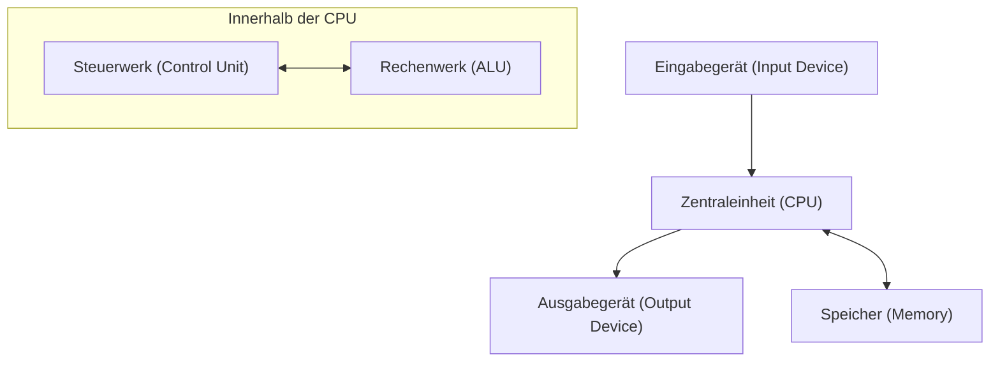

## 1. Einleitung

John von Neumann (1903–1957) war ein genialer Mathematiker, der das 20. Jahrhundert repräsentierte und einen unermesslichen Einfluss auf alle Bereiche der modernen Wissenschaft hatte. Seine Leistungen gingen weit über die reine Mathematik hinaus und erstreckten sich auf Quantenmechanik, Spieltheorie, Informatik, Wirtschaftswissenschaften, Meteorologie und sogar die Entwicklung der Atombombe. Aufgrund seiner außergewöhnlichen Rechenleistung und seines logischen Denkvermögens fürchteten und respektierten ihn seine Zeitgenossen und nannten ihn das "Dämonische Gehirn" und einen "Marsianer".

Dieser Artikel wird das Leben von Neumanns, seine enormen Errungenschaften und die zahlreichen Anekdoten, die er hinterlassen hat, im Detail erklären. Lassen Sie uns tief erforschen, welche Art von Denken er hatte und wie er die Grundlagen der modernen Gesellschaft aufgebaut hat. Seine Fußstapfen zurückzuverfolgen ist nichts anderes, als die Entwicklungsgeschichte der modernen Wissenschaft selbst zurückzuverfolgen.

## 2. Geburt eines Wunderkindes: Kindheit in Budapest

John von Neumann (ungarischer Name: Neumann János Lajos) wurde 1903 in Budapest, Ungarn, in eine wohlhabende jüdische Bankiersfamilie geboren. Schon in jungen Jahren zeigte er ein außergewöhnliches Gedächtnis und eine außergewöhnliche Rechenleistung und zeigte wirklich Talente, die es wert sind, als **Wunderkind** bezeichnet zu werden. Es heißt, er konnte im Alter von 6 Jahren achtstellige Divisionen im Kopf durchführen und beherrschte die Infinitesimalrechnung im Alter von 8 Jahren. Er war auch sehr sprachbegabt, lernte schon früh Griechisch und Latein und tauschte sogar Witze auf Altgriechisch mit seinem Vater aus.

Damals war Budapest ein globales Zentrum für Kultur und Wissenschaft und brachte viele brillante jüdische Wissenschaftler hervor. Eugene Wigner, Leo Szilard, Edward Teller und andere Wissenschaftler, die später in den Vereinigten Staaten aktiv wurden, stammten alle wie von Neumann aus Budapest, und aufgrund ihrer einzigartigen Talente wurden sie kollektiv als die **Marsianer** (Martians) bezeichnet. Von Neumann wuchs in diesem hervorragenden intellektuellen Umfeld auf und erreichte ein Niveau, auf dem er bereits in der High School mathematische Arbeiten veröffentlichte.

## 3. Beiträge zu den Grundlagen der Mathematik: Axiomatische Mengenlehre

Eine der wichtigsten frühen Errungenschaften von Neumanns war seine Forschung zur Axiomatisierung der Mengenlehre. Die von [Georg Cantor](https://kenji.blog/de/p/cantor/) begründete Mengenlehre sollte die Grundlage der Mathematik bilden, stieß jedoch auf logische Widersprüche (Paradoxien) wie die Russellsche Antinomie. Um dieses Problem zu lösen, bauten Ernst Zermelo, Adolf Fraenkel und andere die axiomatische Mengenlehre auf, aber von Neumann wählte einen anderen Ansatz.

Er führte das Konzept der "Klassen" ein und vermied die Paradoxien auf brillante Weise, indem er streng zwischen normalen Mengen und Klassen unterschied, die zu groß sind, um Mengen zu sein (echte Klassen). Dieses System wurde später von Paul Bernays und [Kurt Gödel](https://kenji.blog/de/p/godel/) verbessert und ist heute als **Von-Neumann-Bernays-Gödel-Mengenlehre** (NBG-Mengenlehre) bekannt.

$$
\forall X \ ( X \in V \iff \exists Y \ (X \in Y) )
$$

Hier repräsentiert $V$ die **Klasse aller Mengen** ( $\text{Universalklasse}$ ). Diese Grundlagenforschung wurde zu einem wichtigen Beitrag zur Unterstützung der Wurzeln der Mathematik.

## 4. Mathematische Grundlagen der Quantenmechanik

In den späten 1920er Jahren entwickelte sich die Quantenmechanik als zwei scheinbar völlig unterschiedliche Theorien: Werner Heisenbergs "Matrizenmechanik" und Erwin Schrödingers "Wellenmechanik". Von Neumann bewies, dass diese beiden Theorien mathematisch äquivalent sind, und gab der Quantenmechanik eine strenge mathematische Grundlage.

Unter Verwendung der Theorie des **[Hilbert](https://kenji.blog/de/p/hilbert/)raums** formulierte er physikalische Größen (Observablen) als selbstadjungierte Operatoren in einem unendlichdimensionalen [Hilbert](https://kenji.blog/de/p/hilbert/)raum. Sein 1932 erschienenes Buch "Mathematische Grundlagen der Quantenmechanik" gilt selbst modernen Physikern als Bibel und genießt auch heute noch als Standardlehrbuch der Quantenmechanik hohes Ansehen.

Er führte auch das Konzept der **Dichtematrix** ( $\text{Dichtematrix}$ ) zur Beschreibung gemischter Zustände ein und legte damit den Grundstein für die Quantenstatistik.

$$
\rho = \sum_{i} p_i |\psi_i\rangle \langle\psi_i|
$$

Hier repräsentiert $p_i$ die Wahrscheinlichkeit ( $\text{Wahrscheinlichkeitsgewicht}$ ), den [Zustand](https://kenji.blog/de/p/state-management-history-redux-context-recoil-zustand/) $|\psi_i\rangle$ anzunehmen. Er führte auch tiefe Überlegungen zum "Kollaps des Wellenpakets" und zum "Messproblem" in der Quantenmesstheorie durch.

## 5. Spieltheorie und wirtschaftliches Verhalten

Ausgehend von der Analyse von Strategien in Spielen wie Poker begründete von Neumann ein völlig neues Gebiet der Mathematik, die sogenannte "Spieltheorie". 1928 bewies er das **Minimax-Theorem**, das besagt, dass sich in einem endlichen deterministischen Zwei-Personen-Nullsummenspiel mit perfekter Information, wenn beide Seiten optimale Strategien anwenden, das Ergebnis immer bei einem bestimmten Ergebnis einpendeln wird.

$$
\max_{x \in X} \min_{y \in Y} f(x, y) = \min_{y \in Y} \max_{x \in X} f(x, y)
$$

Die linke Seite dieser Gleichung stellt die Strategie dar, "den Verlust im schlimmsten Fall zu minimieren" ( $\text{Maximin-Strategie}$ ), und die rechte Seite stellt die Strategie dar, "den eigenen Gewinn gegen den besten Zug des Gegners zu maximieren".

Später verfasste er zusammen mit dem Ökonomen Oskar Morgenstern das monumentale Werk "Spieltheorie und wirtschaftliches Verhalten" (1944), das die Wirtschaftswissenschaften revolutionierte. Dies war ein Versuch, rationale menschliche Entscheidungsfindung mathematisch zu modellieren, und wird heute in einer Vielzahl von Bereichen angewendet, nicht nur in der Wirtschaft, sondern auch in der Politikwissenschaft, Biologie und Militärstrategie.

## 6. Informatik und Von-Neumann-Architektur

Fast alle modernen Computer basieren auf der von ihm erdachten **Von-Neumann-Architektur**. Er schlug das "Von-Neumann-Architektur-Konzept" vor, bei dem Programme als Daten im Speicher abgelegt und sequentiell ausgelesen und ausgeführt werden.

Diese Architektur besteht aus den folgenden Hauptelementen:

Von Neumann nahm am EDVAC-Entwicklungsprojekt an der University of Pennsylvania teil und fasste dieses bahnbrechende Konzept im "First Draft of a Report on the EDVAC" zusammen. Dies ermöglichte die Realisierung eines Allzweckcomputers, der verschiedene Berechnungen durchführen kann, indem einfach die Software (das Programm) neu geschrieben wird, ohne die Hardware physisch neu verkabeln zu müssen. Die moderne IT-Gesellschaft baut auf diesem von ihm geschaffenen Fundament auf.

## 7. Zelluläre [Automaten](https://kenji.blog/de/p/automata-formal-language-theory/) und die Theorie selbstreplizierender Maschinen

In seinen späteren Jahren interessierte sich von Neumann sehr für die mathematische Modellierung der Mechanismen der biologischen Selbstreplikation. Auf Anraten seines Kollegen Stanislaw Ulam entwarf er das Konzept der **zellulären Automaten**, bei dem der Raum in ein Raster unterteilt ist und jede Rasterzelle ihren [Zustand](https://kenji.blog/de/p/state-management-history-redux-context-recoil-zustand/) nach einer bestimmten Regel ändert.

Unter Verwendung von Zellen mit 29 Zuständen bewies er rigoros, dass eine selbstreplizierende Maschine (universeller Konstruktor) theoretisch möglich ist. Dies geschah vor der Entdeckung der Doppelhelix-Struktur der DNA, und man kann sagen, dass er die genetischen Mechanismen und Informationsübertragungssysteme des Lebens aus der Perspektive der Informationswissenschaft vorausgesagt hat. Nach seinem Tod führte diese Theorie zur Erforschung künstlicher Leben.

## 8. Das Manhattan-Projekt und Beiträge zur Strömungsmechanik

Während des Zweiten Weltkriegs nahm von Neumann am "Manhattan-Projekt" zur Entwicklung der Atombombe am Los Alamos National Laboratory teil. Er spielte eine zentrale Rolle bei Berechnungen in der Strömungsmechanik und Stoßwellen und führte die komplexen Berechnungen durch, die für die Konstruktion der Sprengstofflinsen der Plutonium-Atombombe (Fat Man) unerlässlich waren. Es wird gesagt, dass sich die Entwicklung ohne seine Theorie zur Wechselwirkung von Stoßwellen und seine überwältigende Rechenleistung erheblich verzögert hätte.

Auch nach dem Krieg behielt er als oberster Berater der US-Regierung für Militär- und Wissenschaftspolitik starken Einfluss und leitete nationale Projekte wie die Entwicklung ballistischer Raketen und die numerische Wettervorhersage (die erste computergestützte Wettervorhersage der Welt).

## 9. Der Mann namens "Marsianer": Außergewöhnliche Anekdoten eines Genies

Es gibt unzählige Anekdoten rund um von Neumanns übermenschliches Gehirn.

* **Erstaunliche Rechengeschwindigkeit**: Um zu überprüfen, ob die vom ENIAC (einem frühen elektronischen Computer) berechneten Ergebnisse korrekt waren, führte von Neumann Kopfrechnungen durch, um sie zu überprüfen, und die Legende besagt, dass von Neumann mit dem Rechnen schneller fertig war.
* **Perfektes fotografisches Gedächtnis**: Er konnte sich den Inhalt von Büchern und Telefonbüchern Wort für Wort merken, nachdem er sie einmal gelesen hatte. Als er Jahrzehnte später gebeten wurde, "den Anfang von 'Eine Geschichte aus zwei Städten' zu rezitieren", soll er ihn zig Minuten lang perfekt weiter rezitiert haben, bis sein Freund ihn aufhielt.
* **Fahren und Lärm**: Er war ein sehr schlechter Fahrer und verursachte häufig Unfälle. Es gibt eine Anekdote, in der er sich herausredete: "Die Bäume sind mir nicht aus dem Weg gegangen." Er zog auch laute Umgebungen der Stille vor und führte komplexe mathematische Forschungen durch, während er in seinem Büro deutsche Marschmusik in hoher Lautstärke abspielte.
* **Marsianer-Witz**: Seine Physiker-Kollegen scherzten halbernst: "Von Neumann ist ein Marsianer, der auf der Erde lebt und vorgibt, ein Mensch zu sein. Er ist jedoch in der Lage, einen Menschen perfekt zu imitieren."

## 10. Wichtige Bücher und Artikel

Die Bücher und Artikel, die von Neumann zu Lebzeiten hinterlassen hat, sind vielfältig, aber hier stellen wir repräsentative Werke vor, die einen besonders bedeutenden Einfluss auf spätere Generationen hatten.

1. **Mathematische Grundlagen der Quantenmechanik (1932)**
   Ein monumentales Werk, das die Quantenmechanik mithilfe der Theorie des [Hilbert](https://kenji.blog/de/p/hilbert/)raums streng formulierte.
2. **Spieltheorie und wirtschaftliches Verhalten (1944)**
   Zusammen mit Oskar Morgenstern verfasst. Ein Meisterwerk, das systematisch alles von Nullsummenspielen bis hin zu kooperativen Spielen diskutierte.
3. **Der Computer und das Gehirn (1958)**
   Ein unvollendetes Manuskript, das posthum veröffentlicht wurde. Ein Pionierwerk, das die neuronalen Netze des menschlichen Gehirns mit den Mechanismen digitaler Computer vergleicht.
4. **Theorie der selbstreproduzierenden [Automaten](https://kenji.blog/de/p/automata-formal-language-theory/) (1966)**
   Zusammengestellt und veröffentlicht aus von Neumanns posthumen Manuskripten von Arthur Burks.

## 11. John von Neumann: Kurze Chronologie

Im Folgenden finden Sie einen detaillierten Zeitplan, der das Leben und die wichtigsten Erfolge von John von Neumann zusammenfasst.

* **1903**: Geboren in Budapest, Königreich Ungarn.
* **1911**: Tritt in ein lutherisches Gymnasium ein.
* **1921**: Tritt in die Universität Budapest ein mit dem Hauptfach Mathematik. Studiert gleichzeitig Chemie an der Universität Berlin und der ETH Zürich.
* **1926**: Promoviert in Mathematik an der Universität Budapest.
* **1928**: Beweist das Minimax-Theorem und legt damit den Grundstein für die Spieltheorie.
* **1930**: Zieht als Gastprofessor an der Princeton University in die Vereinigten Staaten.
* **1932**: Veröffentlicht "Mathematische Grundlagen der Quantenmechanik".
* **1933**: Zum Professor auf Lebenszeit am Institute for Advanced Study in Princeton ernannt. Wird neben Albert Einstein und anderen eines seiner ersten Mitglieder.
* **1937**: Erwirbt die Staatsbürgerschaft der Vereinigten Staaten von Amerika.
* **1943**: Nimmt am Manhattan-Projekt teil und leitet die Berechnungen für die Sprengstofflinsen.
* **1944**: Veröffentlicht "Spieltheorie und wirtschaftliches Verhalten".
* **1945**: Schreibt den "First Draft of a Report on the EDVAC" und schlägt das Konzept des gespeicherten Programms vor.
* **1948**: Kündigt die Theorie zellulärer Automaten und das Konzept selbstreplizierender Maschinen an.
* **1951**: Wird Präsident der American Mathematical Society.
* **1954**: Zum Mitglied der United States Atomic Energy Commission ernannt.
* **1955**: Diagnose Knochenkrebs (oder Bauchspeicheldrüsenkrebs) und beginnt den Kampf gegen die Krankheit.
* **1957**: Stirbt im Alter von 53 Jahren im Walter Reed Army Medical Center in Washington, D.C..

## 12. Fazit

John von Neumann verstarb 1957 im jungen Alter von 53 Jahren an Krebs. Das intellektuelle Erbe, das er hinterlassen hat, lebt jedoch bis heute als Grundlage der modernen Mathematik, Physik, Wirtschaft und Informationstechnologie stark weiter. Von den Smartphones und Computern, die wir jeden Tag nutzen, bis hin zu modernster Technologie für künstliche Intelligenz (KI) und analytischen Methoden in den Sozialwissenschaften – überall lassen sich Einblicke in von Neumanns "Dämonisches Gehirn" erkennen. Wenn wir über sein Leben nachdenken, erkennen wir einmal mehr die unendlichen Möglichkeiten des menschlichen Intellekts und das Ausmaß seines Einflusses auf die Welt. In der Geschichte der Menschheit hat niemand sonst einen grundlegenden Paradigmenwechsel in so vielen Bereichen herbeigeführt wie er.
